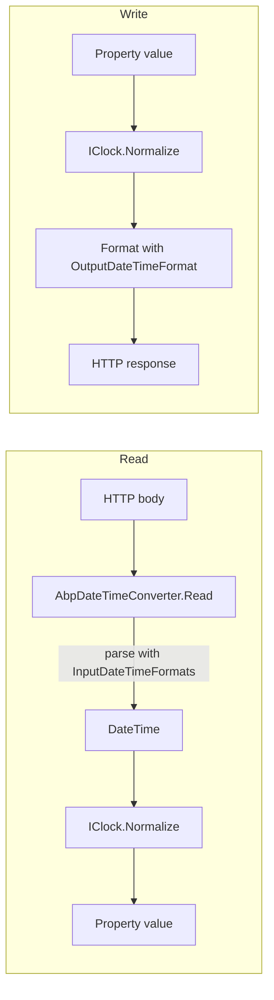
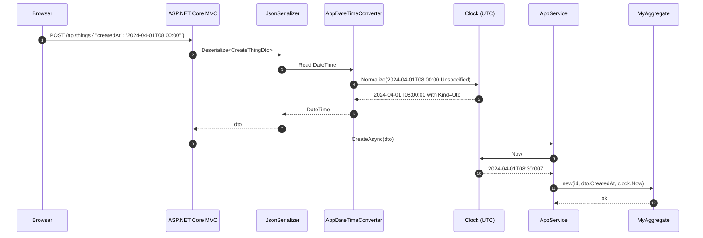

`Volo.Abp.Timing` does one thing well: it gives the framework a single, configurable answer to *"what's the current time?"* and *"what kind of DateTime do we want everywhere?"*. Application code injects `IClock` instead of calling `DateTime.Now` directly, the JSON serializers route every `DateTime` property through `IClock.Normalize` before reading or writing, and a separate `ITimezoneProvider` (backed by `TimeZoneConverter`) bridges the Windows ↔ IANA timezone naming gap so admin UIs can show users a single, friendly list of zones.

The choice is configured through one line:

```csharp
Configure<AbpClockOptions>(o => o.Kind = DateTimeKind.Utc);
```

…and from that point on, `_clock.Now` returns `DateTime.UtcNow`, `_clock.Normalize(localDate)` returns the UTC equivalent, and STJ / Newtonsoft serializers stamp every emitted DateTime with `DateTimeKind.Utc`. For multi-tenant or distributed scenarios this is the de-facto default.

## File inventory

| File | Purpose |
| --- | --- |
| `Volo/Abp/Timing/AbpTimingModule.cs` | Module class; configures embedded localization and depends on `AbpLocalizationModule` + `AbpSettingsModule`. |
| `Volo/Abp/Timing/IClock.cs` | The contract: `Now`, `Kind`, `SupportsMultipleTimezone`, `Normalize`. |
| `Volo/Abp/Timing/Clock.cs` | Default `[ITransientDependency]` implementation. |
| `Volo/Abp/Timing/AbpClockOptions.cs` | `Kind` (defaults to `Unspecified`). |
| `Volo/Abp/Timing/DisableDateTimeNormalizationAttribute.cs` | Opts a class, property or parameter out of normalization. |
| `Volo/Abp/Timing/ITimezoneProvider.cs` | Two-way Windows ↔ IANA conversion + `GetTimeZoneInfo`. |
| `Volo/Abp/Timing/TZConvertTimezoneProvider.cs` | Default impl using `TimeZoneConverter`. |
| `Volo/Abp/Timing/TimeZoneHelper.cs` | Formatting helpers for admin UIs. |
| `Volo/Abp/Timing/TimingSettingNames.cs`, `TimingSettingProvider.cs` | Setting definitions (per-user / per-tenant timezone). |
| `Volo/Abp/Timing/Localization/AbpTimingResource.cs` | Localization resource. |

## Key abstractions

| Type | Signature | Notes |
| --- | --- | --- |
| `IClock` | `DateTime Now { get; }`, `DateTimeKind Kind { get; }`, `bool SupportsMultipleTimezone { get; }`, `DateTime Normalize(DateTime dateTime)` | Inject this instead of `DateTime.Now`. |
| `Clock` | Default implementation | `Now` returns `UtcNow` or `Now`; `Normalize` reconciles `Kind`. |
| `AbpClockOptions` | `DateTimeKind Kind { get; set; } = Unspecified` | Single configuration knob. |
| `DisableDateTimeNormalizationAttribute` | `[AttributeUsage(Class \| Property \| Parameter)]` | Read by both JSON adapters' DateTime converters. |
| `ITimezoneProvider` | `GetWindowsTimezones`, `GetIanaTimezones`, `WindowsToIana`, `IanaToWindows`, `GetTimeZoneInfo` | Backed by `TimeZoneConverter`. |

## The clock contract

```csharp
public interface IClock
{
    /// <summary>
    /// Gets Now.
    /// </summary>
    DateTime Now { get; }

    /// <summary>
    /// Gets kind.
    /// </summary>
    DateTimeKind Kind { get; }

    /// <summary>
    /// Is that provider supports multiple time zone.
    /// </summary>
    bool SupportsMultipleTimezone { get; }

    /// <summary>
    /// Normalizes given <see cref="DateTime"/>.
    /// </summary>
    /// <param name="dateTime">DateTime to be normalized.</param>
    /// <returns>Normalized DateTime</returns>
    DateTime Normalize(DateTime dateTime);
}
```

Four members. The contract is light by design — it does not try to be a date math library. Three of the four members are derived: `Now` is `UtcNow` when `Kind` is UTC, otherwise `DateTime.Now`; `SupportsMultipleTimezone` is true iff `Kind == DateTimeKind.Utc`; `Normalize` translates incoming `DateTime` values to the configured `Kind`.

## The default `Clock`

```csharp
public class Clock : IClock, ITransientDependency
{
    protected AbpClockOptions Options { get; }

    public Clock(IOptions<AbpClockOptions> options)
    {
        Options = options.Value;
    }

    public virtual DateTime Now =>
        Options.Kind == DateTimeKind.Utc ? DateTime.UtcNow : DateTime.Now;

    public virtual DateTimeKind Kind => Options.Kind;

    public virtual bool SupportsMultipleTimezone => Options.Kind == DateTimeKind.Utc;

    public virtual DateTime Normalize(DateTime dateTime)
    {
        if (Kind == DateTimeKind.Unspecified || Kind == dateTime.Kind)
        {
            return dateTime;
        }

        if (Kind == DateTimeKind.Local && dateTime.Kind == DateTimeKind.Utc)
        {
            return dateTime.ToLocalTime();
        }

        if (Kind == DateTimeKind.Utc && dateTime.Kind == DateTimeKind.Local)
        {
            return dateTime.ToUniversalTime();
        }

        return DateTime.SpecifyKind(dateTime, Kind);
    }
}
```

The normalization matrix is:

| `Options.Kind` | Input kind | Result |
| --- | --- | --- |
| `Unspecified` | anything | input unchanged |
| any | matches `Options.Kind` | input unchanged |
| `Local` | `Utc` | `ToLocalTime()` |
| `Utc` | `Local` | `ToUniversalTime()` |
| else | `Unspecified` | `DateTime.SpecifyKind(input, Options.Kind)` |

The last row is the *only* lossy operation: the framework cannot know what zone a `DateTime` with `Kind = Unspecified` originated from, so it pins it to the configured kind without conversion. This is the behaviour you want when an HTTP request submits an ISO date string without a `Z` or offset suffix — the system stamps it with the assumed kind rather than guessing.

## `AbpClockOptions`

```csharp
public class AbpClockOptions
{
    /// <summary>
    /// Default: <see cref="DateTimeKind.Unspecified"/>
    /// </summary>
    public DateTimeKind Kind { get; set; }

    public AbpClockOptions()
    {
        Kind = DateTimeKind.Unspecified;
    }
}
```

The default `Unspecified` is intentional: it means the clock is a *no-op* until the host opts in. New ABP application templates configure `Kind = Utc` in the application module, which is the recommended setting for SaaS.

## Opting out: `DisableDateTimeNormalizationAttribute`

```csharp
[AttributeUsage(AttributeTargets.Class | AttributeTargets.Property | AttributeTargets.Parameter)]
public class DisableDateTimeNormalizationAttribute : Attribute
{
}
```

Three placement sites:

- **Property** — exempt a single `DateTime` from JSON normalization. Both adapters' `AbpDateTimeConverter` and the System.Text.Json modifier check `ReflectionHelper.GetSingleAttributeOfMemberOrDeclaringTypeOrDefault<DisableDateTimeNormalizationAttribute>`.
- **Class** — exempt every `DateTime` member of a DTO. Useful for log/audit DTOs that carry already-normalized timestamps from upstream systems.
- **Parameter** — exempt a query string or body parameter. Picked up by the binding-layer interceptors in `Volo.Abp.AspNetCore.Mvc`.

## Timezone provider

```csharp
public interface ITimezoneProvider
{
    List<NameValue> GetWindowsTimezones();
    List<NameValue> GetIanaTimezones();

    string WindowsToIana(string windowsTimeZoneId);
    string IanaToWindows(string ianaTimeZoneName);

    TimeZoneInfo GetTimeZoneInfo(string windowsOrIanaTimeZoneId);
}
```

The default implementation delegates to [TimeZoneConverter](https://github.com/mattjohnsonpint/TimeZoneConverter):

```csharp
public class TZConvertTimezoneProvider : ITimezoneProvider, ITransientDependency
{
    public virtual List<NameValue> GetWindowsTimezones()
        => TZConvert.KnownWindowsTimeZoneIds.OrderBy(x => x).Select(x => new NameValue(x, x)).ToList();

    public virtual List<NameValue> GetIanaTimezones()
        => TZConvert.KnownIanaTimeZoneNames.OrderBy(x => x).Select(x => new NameValue(x, x)).ToList();

    public virtual string WindowsToIana(string windowsTimeZoneId)
        => TZConvert.WindowsToIana(windowsTimeZoneId);

    public virtual string IanaToWindows(string ianaTimeZoneName)
        => TZConvert.IanaToWindows(ianaTimeZoneName);

    public virtual TimeZoneInfo GetTimeZoneInfo(string windowsOrIanaTimeZoneId)
        => TZConvert.GetTimeZoneInfo(windowsOrIanaTimeZoneId);
}
```

`TimeZoneConverter` reads its mapping data from CLDR; ABP redistributes it as part of the package. The provider is intentionally stateless — a fresh `List<NameValue>` is built per call, which is fine for admin pages that render the list at most once per request.

## Display helpers

```csharp
public static class TimeZoneHelper
{
    public static List<NameValue> GetTimezones(List<NameValue> timezones)
    {
        return timezones
            .OrderBy(x => x.Name)
            .Select(x => new NameValue($"{x.Name} ({GetTimezoneOffset(TZConvert.GetTimeZoneInfo(x.Name))})", x.Name))
            .ToList();
    }

    public static string GetTimezoneOffset(TimeZoneInfo timeZoneInfo)
    {
        if (timeZoneInfo.BaseUtcOffset < TimeSpan.Zero)
            return "-" + timeZoneInfo.BaseUtcOffset.ToString(@"hh\:mm");

        return "+" + timeZoneInfo.BaseUtcOffset.ToString(@"hh\:mm");
    }
}
```

The helper produces friendly strings like `"Europe/Berlin (+01:00)"` used in admin dropdowns. It uses the *base* UTC offset, not the current one — DST is not factored in here because the dropdown is configuration, not display.

## Module wiring

```csharp
[DependsOn(
    typeof(AbpLocalizationModule),
    typeof(AbpSettingsModule)
)]
public class AbpTimingModule : AbpModule
{
    public override void ConfigureServices(ServiceConfigurationContext context)
    {
        Configure<AbpVirtualFileSystemOptions>(options =>
        {
            options.FileSets.AddEmbedded<AbpTimingModule>();
        });

        Configure<AbpLocalizationOptions>(options =>
        {
            options
                .Resources
                .Add<AbpTimingResource>("en")
                .AddVirtualJson("/Volo/Abp/Timing/Localization");
        });
    }
}
```

The module dependencies make sense:

- **Localization** — UI strings (month names, "now", "today") localize through `AbpTimingResource`.
- **Settings** — `TimingSettingProvider` registers `Abp.Timing.Timezone`, the per-user / per-tenant default timezone.

## Cooperation with JSON serializers

The connection between `IClock` and the JSON layer is two-way:



Both [Newtonsoft adapter](/framework/data/json-newtonsoft) and [System.Text.Json adapter](/framework/data/json-systemtextjson) call `_clock.Normalize` at the boundary. If `Options.Kind` is `Utc` (recommended), every `DateTime` that crosses the HTTP boundary is normalized to UTC on read and emitted as UTC on write — the rest of the application is free to ignore time zones.

## Sequence: an HTTP request creating an entity



Notice how the `Unspecified` input from the wire becomes `Utc` once it crosses `IClock.Normalize`. This is the framework's contract: **internally everything is UTC; externally everything is whatever the wire said.**

## Pitfalls

- **`Kind` set to `Unspecified` makes `Normalize` a no-op**, so JSON DateTimes round-trip with whatever kind the wire provided. This was the historical default for backward compatibility but is rarely what you want today.
- **`SupportsMultipleTimezone` is `false` when `Kind != Utc`.** Multi-tenant timezone-aware UIs typically check this property before exposing timezone settings.
- **`DateTimeOffset` is not part of `IClock`.** If you mix `DateTime` and `DateTimeOffset` across APIs, build a parallel helper around the clock rather than expecting the JSON converters to translate.
- **`DateTime.Now` calls inside hot paths** are common bugs that survive code review. A unit test that fails when the system clock changes is much better than a flaky production alert.

## Related pages

- [JSON / IJsonSerializer](/framework/data/json) — uses `IClock.Normalize` on every `DateTime` round-trip.
- [Newtonsoft adapter](/framework/data/json-newtonsoft) and [System.Text.Json adapter](/framework/data/json-systemtextjson) — implementation sites.
- [Threading](/framework/data/threading) — `AsyncHelper`, `ICancellationTokenProvider`, and the timer utilities that consult the clock.
