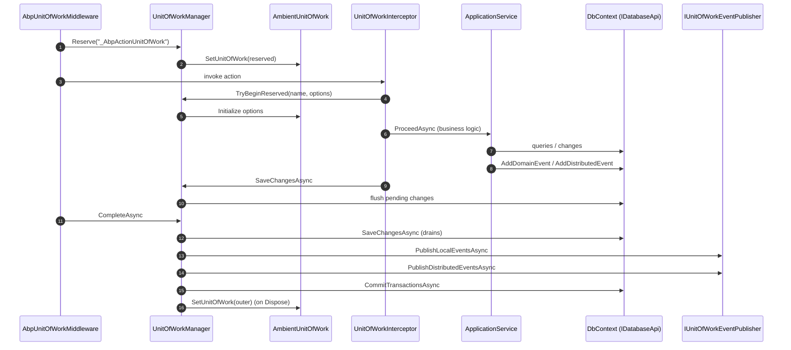

A *Unit of Work* (UoW) in ABP is the ambient transactional scope that ties together database operations, domain events and outbox dispatch. The `Volo.Abp.Uow` module provides the abstractions: `IUnitOfWork`, `IUnitOfWorkManager`, the `[UnitOfWork]` attribute, the `UnitOfWorkInterceptor` that activates it for every application-service call, the `AmbientUnitOfWork` that exposes the *current* UoW to the rest of the framework, and the `ChildUnitOfWork` wrapper used to nest method-level calls inside an already-running outer UoW.

This page walks the runtime: how a controller request creates one logical UoW, how nested calls become child UoWs without starting a new transaction, how reserved UoWs let middleware "preallocate" a UoW for an upcoming MVC action, and how `CompleteAsync` orchestrates `SaveChangesAsync` → event publication → `CommitTransactionsAsync`.

## File inventory

| File | Purpose |
| --- | --- |
| `Volo/Abp/Uow/AbpUnitOfWorkModule.cs` | Registers `UnitOfWorkInterceptorRegistrar` via `Services.OnRegistered`. |
| `Volo/Abp/Uow/IUnitOfWork.cs` | Core contract: lifecycle, events, transactional behaviour. |
| `Volo/Abp/Uow/UnitOfWork.cs` | Default implementation (`ITransientDependency`). |
| `Volo/Abp/Uow/IUnitOfWorkManager.cs` | Begin / Reserve / TryBeginReserved entry points. |
| `Volo/Abp/Uow/UnitOfWorkManager.cs` | Default manager; creates `IServiceScope` per UoW. |
| `Volo/Abp/Uow/AmbientUnitOfWork.cs` | `AsyncLocal<IUnitOfWork?>` holder of the current UoW. |
| `Volo/Abp/Uow/IAmbientUnitOfWork.cs` | Interface exposed to consumers. |
| `Volo/Abp/Uow/ChildUnitOfWork.cs` | Wraps an existing UoW so nested `using`s are no-ops on `CompleteAsync`/`Dispose`. |
| `Volo/Abp/Uow/UnitOfWorkAttribute.cs` | The `[UnitOfWork]` marker. |
| `Volo/Abp/Uow/UnitOfWorkInterceptor.cs` | DynamicProxy interceptor that opens a UoW around method calls. |
| `Volo/Abp/Uow/UnitOfWorkInterceptorRegistrar.cs` | Decides which services to intercept. |
| `Volo/Abp/Uow/UnitOfWorkHelper.cs` | Reflection helpers for attribute detection. |
| `Volo/Abp/Uow/AbpUnitOfWorkOptions.cs` | Per-call options (transactional, isolation, timeout). |
| `Volo/Abp/Uow/AbpUnitOfWorkDefaultOptions.cs` | Module-level defaults; computes `IsTransactional`. |
| `Volo/Abp/Uow/UnitOfWorkTransactionBehavior.cs` | `Auto / Enabled / Disabled` enum. |
| `Volo/Abp/Uow/IDatabaseApi.cs`, `IDatabaseApiContainer.cs` | Per-database participant abstractions. |
| `Volo/Abp/Uow/ITransactionApi.cs`, `ITransactionApiContainer.cs` | Per-transaction participant abstractions. |
| `Volo/Abp/Uow/ISupportsSavingChanges.cs`, `ISupportsRollback.cs` | Marker interfaces implemented by database APIs. |
| `Volo/Abp/Uow/EventOrderGenerator.cs` | Atomic counter for ordering events inside a UoW. |
| `Volo/Abp/Uow/IUnitOfWorkEventPublisher.cs`, `NullUnitOfWorkEventPublisher.cs` | Strategy for publishing local/distributed events on complete. |
| `Volo/Abp/Uow/UnitOfWorkEventRecord.cs`, `UnitOfWorkEventArgs.cs`, `UnitOfWorkFailedEventArgs.cs` | Event payloads. |
| `Volo/Abp/Uow/AlwaysDisableTransactionsUnitOfWorkManager.cs` | Replacement manager that forces non-transactional behaviour. |
| `Volo/Abp/Uow/IUnitOfWorkTransactionBehaviourProvider.cs`, `NullUnitOfWorkTransactionBehaviourProvider.cs` | Hook for HTTP-method-aware behaviour (e.g. GETs are non-transactional). |
| `Volo/Abp/Uow/UnitOfWorkExtensions.cs`, `UnitOfWorkManagerExtensions.cs` | Convenience helpers. |

## Key abstractions

| Type | Signature (excerpt) | Notes |
| --- | --- | --- |
| `IUnitOfWork` | `Initialize(options)`, `Reserve(name)`, `SaveChangesAsync`, `CompleteAsync`, `RollbackAsync`, `OnCompleted(handler)` | Implements `IDatabaseApiContainer`, `ITransactionApiContainer`, `IDisposable`. |
| `IUnitOfWorkManager` | `Current`, `Begin(options, requiresNew)`, `Reserve(name, requiresNew)`, `TryBeginReserved(name, options)` | Single ambient entry point. |
| `IAmbientUnitOfWork` | `IUnitOfWork? UnitOfWork`, `SetUnitOfWork`, `GetCurrentByChecking` | Singleton with `AsyncLocal<IUnitOfWork?>`. |
| `UnitOfWorkAttribute` | `IsTransactional?`, `IsolationLevel?`, `Timeout?`, `IsDisabled` | Method or class scope. |
| `AbpUnitOfWorkOptions` | `IsTransactional`, `IsolationLevel?`, `Timeout?` + `Clone()` | Per-call options. |
| `AbpUnitOfWorkDefaultOptions` | `TransactionBehavior` (Auto/Enabled/Disabled), `Normalize`, `CalculateIsTransactional` | Module-level defaults. |

## The contract

```csharp
public interface IUnitOfWork : IDatabaseApiContainer, ITransactionApiContainer, IDisposable
{
    Guid Id { get; }
    Dictionary<string, object> Items { get; }

    event EventHandler<UnitOfWorkFailedEventArgs> Failed;
    event EventHandler<UnitOfWorkEventArgs> Disposed;

    IAbpUnitOfWorkOptions? Options { get; }
    IUnitOfWork? Outer { get; }

    bool IsReserved { get; }
    bool IsDisposed { get; }
    bool IsCompleted { get; }
    string? ReservationName { get; }

    void SetOuter(IUnitOfWork? outer);
    void Initialize(AbpUnitOfWorkOptions options);
    void Reserve(string reservationName);

    Task SaveChangesAsync(CancellationToken cancellationToken = default);
    Task CompleteAsync(CancellationToken cancellationToken = default);
    Task RollbackAsync(CancellationToken cancellationToken = default);

    void OnCompleted(Func<Task> handler);

    void AddOrReplaceLocalEvent(UnitOfWorkEventRecord eventRecord, Predicate<UnitOfWorkEventRecord>? replacementSelector = null);
    void AddOrReplaceDistributedEvent(UnitOfWorkEventRecord eventRecord, Predicate<UnitOfWorkEventRecord>? replacementSelector = null);
}
```

Three observations:

- **`Items` is a free-form bag** that lives for the duration of the UoW. EF Core stores resolved DbContexts here; you can use it for per-request memoization.
- **Events are deferred.** `AddOrReplaceLocalEvent` and `AddOrReplaceDistributedEvent` accumulate `UnitOfWorkEventRecord` instances; they are flushed in `CompleteAsync` *after* `SaveChangesAsync` so handlers see persisted state.
- **Reservation** (`Reserve`, `IsReserved`, `ReservationName`) is what makes ASP.NET Core middleware-controlled UoWs work: the framework can allocate an empty UoW early in the pipeline and let a downstream interceptor call `TryBeginReserved` to take ownership.

## Options

### Per-call: `AbpUnitOfWorkOptions`

```csharp
public class AbpUnitOfWorkOptions : IAbpUnitOfWorkOptions
{
    public bool IsTransactional { get; set; }
    public IsolationLevel? IsolationLevel { get; set; }
    public int? Timeout { get; set; }

    public AbpUnitOfWorkOptions Clone() => new AbpUnitOfWorkOptions
    {
        IsTransactional = IsTransactional,
        IsolationLevel = IsolationLevel,
        Timeout = Timeout
    };
}
```

### Module-level: `AbpUnitOfWorkDefaultOptions`

```csharp
public class AbpUnitOfWorkDefaultOptions
{
    public UnitOfWorkTransactionBehavior TransactionBehavior { get; set; }
        = UnitOfWorkTransactionBehavior.Auto;
    public IsolationLevel? IsolationLevel { get; set; }
    public int? Timeout { get; set; }

    internal AbpUnitOfWorkOptions Normalize(AbpUnitOfWorkOptions options)
    {
        if (options.IsolationLevel == null) options.IsolationLevel = IsolationLevel;
        if (options.Timeout == null) options.Timeout = Timeout;
        return options;
    }

    public bool CalculateIsTransactional(bool autoValue) => TransactionBehavior switch
    {
        UnitOfWorkTransactionBehavior.Enabled  => true,
        UnitOfWorkTransactionBehavior.Disabled => false,
        UnitOfWorkTransactionBehavior.Auto     => autoValue,
        _ => throw new AbpException("Not implemented TransactionBehavior value: " + TransactionBehavior)
    };
}
```

`Auto` defers the decision to `IUnitOfWorkTransactionBehaviourProvider`, whose default in ASP.NET Core is "transactional unless the method name starts with `Get`" (see `UnitOfWorkInterceptor.CreateOptions` below). This is why a `GetXxxAsync` query inside an app service does not start a transaction by default.

## The attribute

```csharp
[AttributeUsage(AttributeTargets.Method | AttributeTargets.Class | AttributeTargets.Interface)]
public class UnitOfWorkAttribute : Attribute
{
    public bool? IsTransactional { get; set; }
    public int? Timeout { get; set; }
    public IsolationLevel? IsolationLevel { get; set; }
    public bool IsDisabled { get; set; }

    public virtual void SetOptions(AbpUnitOfWorkOptions options)
    {
        if (IsTransactional.HasValue) options.IsTransactional = IsTransactional.Value;
        if (Timeout.HasValue)         options.Timeout = Timeout;
        if (IsolationLevel.HasValue)  options.IsolationLevel = IsolationLevel;
    }
}
```

You rarely need to apply `[UnitOfWork]` explicitly because *application services and repositories are intercepted by convention* — see `UnitOfWorkHelper.IsUnitOfWorkType`. The attribute is useful when you need to:

- enable a UoW on a non-conventional class;
- force `IsTransactional = true` on a `GetXxx` method;
- raise the timeout for a long-running migration step;
- pass `IsDisabled = true` to opt out of UoW for a specific public method.

## How interception decides

```csharp
public static bool IsUnitOfWorkType(TypeInfo implementationType)
{
    //Explicitly defined UnitOfWorkAttribute
    if (HasUnitOfWorkAttribute(implementationType) || AnyMethodHasUnitOfWorkAttribute(implementationType))
        return true;

    //Conventional classes
    if (typeof(IUnitOfWorkEnabled).GetTypeInfo().IsAssignableFrom(implementationType))
        return true;

    return false;
}
```

Marker interface `IUnitOfWorkEnabled` is implemented by `ApplicationService`, `IRepository`, etc. — so virtually every business-logic class is intercepted by default. The interceptor itself is added per type via `OnRegistered`:

```csharp
public static class UnitOfWorkInterceptorRegistrar
{
    public static void RegisterIfNeeded(IOnServiceRegistredContext context)
    {
        if (ShouldIntercept(context.ImplementationType))
        {
            context.Interceptors.TryAdd<UnitOfWorkInterceptor>();
        }
    }

    private static bool ShouldIntercept(Type type)
    {
        return !DynamicProxyIgnoreTypes.Contains(type)
            && UnitOfWorkHelper.IsUnitOfWorkType(type.GetTypeInfo());
    }
}
```

## The interceptor

```csharp
public class UnitOfWorkInterceptor : AbpInterceptor, ITransientDependency
{
    private readonly IServiceScopeFactory _serviceScopeFactory;

    public override async Task InterceptAsync(IAbpMethodInvocation invocation)
    {
        if (!UnitOfWorkHelper.IsUnitOfWorkMethod(invocation.Method, out var unitOfWorkAttribute))
        {
            await invocation.ProceedAsync();
            return;
        }

        using (var scope = _serviceScopeFactory.CreateScope())
        {
            var options = CreateOptions(scope.ServiceProvider, invocation, unitOfWorkAttribute);

            var unitOfWorkManager = scope.ServiceProvider.GetRequiredService<IUnitOfWorkManager>();

            //Trying to begin a reserved UOW by AbpUnitOfWorkMiddleware
            if (unitOfWorkManager.TryBeginReserved(UnitOfWork.UnitOfWorkReservationName, options))
            {
                await invocation.ProceedAsync();

                if (unitOfWorkManager.Current != null)
                    await unitOfWorkManager.Current.SaveChangesAsync();

                return;
            }

            using (var uow = unitOfWorkManager.Begin(options))
            {
                await invocation.ProceedAsync();
                await uow.CompleteAsync();
            }
        }
    }

    private AbpUnitOfWorkOptions CreateOptions(IServiceProvider serviceProvider, IAbpMethodInvocation invocation, UnitOfWorkAttribute? unitOfWorkAttribute)
    {
        var options = new AbpUnitOfWorkOptions();
        unitOfWorkAttribute?.SetOptions(options);

        if (unitOfWorkAttribute?.IsTransactional == null)
        {
            var defaultOptions = serviceProvider.GetRequiredService<IOptions<AbpUnitOfWorkDefaultOptions>>().Value;
            options.IsTransactional = defaultOptions.CalculateIsTransactional(
                autoValue: serviceProvider.GetRequiredService<IUnitOfWorkTransactionBehaviourProvider>().IsTransactional
                           ?? !invocation.Method.Name.StartsWith("Get", StringComparison.InvariantCultureIgnoreCase)
            );
        }

        return options;
    }
}
```

Three branches matter:

1. **Not a UoW method** — pass through. This is how `Get`-style queries on non-conventional services execute without any UoW overhead.
2. **A reserved UoW exists** — `TryBeginReserved` initializes the previously reserved UoW (typically allocated by `AbpUnitOfWorkMiddleware` for the current HTTP request) with the computed options. The interceptor does not call `CompleteAsync` here; the middleware will.
3. **Fresh UoW** — `Begin(options)` creates a real or child UoW and the interceptor itself commits/disposes it.

## The manager

```csharp
public class UnitOfWorkManager : IUnitOfWorkManager, ISingletonDependency
{
    public IUnitOfWork? Current => _ambientUnitOfWork.GetCurrentByChecking();

    public IUnitOfWork Begin(AbpUnitOfWorkOptions options, bool requiresNew = false)
    {
        Check.NotNull(options, nameof(options));

        var currentUow = Current;
        if (currentUow != null && !requiresNew)
            return new ChildUnitOfWork(currentUow);

        var unitOfWork = CreateNewUnitOfWork();
        unitOfWork.Initialize(options);
        return unitOfWork;
    }

    public IUnitOfWork Reserve(string reservationName, bool requiresNew = false)
    {
        if (!requiresNew &&
            _ambientUnitOfWork.UnitOfWork != null &&
            _ambientUnitOfWork.UnitOfWork.IsReservedFor(reservationName))
        {
            return new ChildUnitOfWork(_ambientUnitOfWork.UnitOfWork);
        }

        var unitOfWork = CreateNewUnitOfWork();
        unitOfWork.Reserve(reservationName);
        return unitOfWork;
    }

    public bool TryBeginReserved(string reservationName, AbpUnitOfWorkOptions options)
    {
        var uow = _ambientUnitOfWork.UnitOfWork;
        while (uow != null && !uow.IsReservedFor(reservationName))
            uow = uow.Outer;

        if (uow == null) return false;

        uow.Initialize(options);
        return true;
    }

    private IUnitOfWork CreateNewUnitOfWork()
    {
        var scope = _serviceScopeFactory.CreateScope();
        try
        {
            var outerUow = _ambientUnitOfWork.UnitOfWork;
            var unitOfWork = scope.ServiceProvider.GetRequiredService<IUnitOfWork>();

            unitOfWork.SetOuter(outerUow);
            _ambientUnitOfWork.SetUnitOfWork(unitOfWork);

            unitOfWork.Disposed += (sender, args) =>
            {
                _ambientUnitOfWork.SetUnitOfWork(outerUow);
                scope.Dispose();
            };

            return unitOfWork;
        }
        catch
        {
            scope.Dispose();
            throw;
        }
    }
}
```

Three things to internalize:

- **Each new UoW owns a child `IServiceScope`.** That scope is disposed when the UoW is disposed. This is why scoped services (DbContexts, repositories) created inside a UoW are released cleanly.
- **`Begin` returns `ChildUnitOfWork`** if there is already a current UoW *and* the caller did not ask for `requiresNew`. Children are transparent forwarders whose `CompleteAsync` and `Dispose` do nothing — the outer UoW owns the lifecycle.
- **Reservation chain** — `TryBeginReserved` walks the `Outer` chain to find a reserved UoW. This lets nested middleware (e.g. tenant resolution → MVC action) coordinate without leaking implementation details.

## Ambient UoW

```csharp
[ExposeServices(typeof(IAmbientUnitOfWork), typeof(IUnitOfWorkAccessor))]
public class AmbientUnitOfWork : IAmbientUnitOfWork, ISingletonDependency
{
    public IUnitOfWork? UnitOfWork => _currentUow.Value;

    private readonly AsyncLocal<IUnitOfWork?> _currentUow;

    public AmbientUnitOfWork() => _currentUow = new AsyncLocal<IUnitOfWork?>();

    public void SetUnitOfWork(IUnitOfWork? unitOfWork) => _currentUow.Value = unitOfWork;

    public IUnitOfWork? GetCurrentByChecking()
    {
        var uow = UnitOfWork;
        while (uow != null && (uow.IsReserved || uow.IsDisposed || uow.IsCompleted))
            uow = uow.Outer;
        return uow;
    }
}
```

`GetCurrentByChecking` is what `UnitOfWorkManager.Current` exposes. By skipping over reserved, completed and disposed UoWs it returns the *first usable* UoW, which is the intuition consumers want.

## Child UoW

```csharp
internal class ChildUnitOfWork : IUnitOfWork
{
    public Guid Id => _parent.Id;
    public IAbpUnitOfWorkOptions? Options => _parent.Options;
    public IUnitOfWork? Outer => _parent.Outer;
    public bool IsReserved => _parent.IsReserved;
    public bool IsDisposed => _parent.IsDisposed;
    public bool IsCompleted => _parent.IsCompleted;

    public Task SaveChangesAsync(CancellationToken cancellationToken = default)
        => _parent.SaveChangesAsync(cancellationToken);

    public Task CompleteAsync(CancellationToken cancellationToken = default)
        => Task.CompletedTask;

    public Task RollbackAsync(CancellationToken cancellationToken = default)
        => _parent.RollbackAsync(cancellationToken);

    public void Dispose() { }

    public override string ToString() => $"[UnitOfWork {Id}]";
}
```

Notice that `CompleteAsync` and `Dispose` are intentional no-ops. This is the magic that lets every nested `using (var uow = _manager.Begin(...))` *just work*: only the outermost block actually commits and disposes; the inner ones are forwarders.

## Complete & rollback flow

The default `UnitOfWork.CompleteAsync` orchestrates three things in order:

```csharp
public virtual async Task CompleteAsync(CancellationToken cancellationToken = default)
{
    if (_isRolledback) return;

    PreventMultipleComplete();
    try
    {
        _isCompleting = true;
        await SaveChangesAsync(cancellationToken);

        while (LocalEvents.Any() || DistributedEvents.Any())
        {
            if (LocalEvents.Any())
            {
                var localEventsToBePublished = LocalEvents.OrderBy(e => e.EventOrder).ToArray();
                LocalEvents.Clear();
                await UnitOfWorkEventPublisher.PublishLocalEventsAsync(localEventsToBePublished);
            }

            if (DistributedEvents.Any())
            {
                var distributedEventsToBePublished = DistributedEvents.OrderBy(e => e.EventOrder).ToArray();
                DistributedEvents.Clear();
                await UnitOfWorkEventPublisher.PublishDistributedEventsAsync(distributedEventsToBePublished);
            }

            await SaveChangesAsync(cancellationToken);
        }

        await CommitTransactionsAsync(cancellationToken);
        IsCompleted = true;
        await OnCompletedAsync();
    }
    catch (Exception ex)
    {
        _exception = ex;
        throw;
    }
}
```

Order matters:

1. `SaveChangesAsync` flushes every `IDatabaseApi` that implements `ISupportsSavingChanges` (one DbContext per logical database).
2. Local then distributed events are published in `EventOrder` order. Events drained earlier can register *new* events (a domain event handler that raises another event) — the `while` loop keeps pumping until both queues are empty.
3. `CommitTransactionsAsync` commits every `ITransactionApi`.
4. `IsCompleted` is set and `OnCompleted` handlers (registered by `OnCompleted(Func<Task>)`) are awaited.

`EventOrderGenerator.GetNext()` provides the monotonically increasing order key:

```csharp
public static class EventOrderGenerator
{
    private static long _lastOrder;
    public static long GetNext() => Interlocked.Increment(ref _lastOrder);
}
```

## End-to-end sequence



## Manual usage

```csharp
public class MyWorker : IDomainService
{
    private readonly IUnitOfWorkManager _uowManager;

    public async Task DoBatchAsync(IReadOnlyList<long> ids)
    {
        foreach (var batch in ids.Chunk(500))
        {
            using (var uow = _uowManager.Begin(
                new AbpUnitOfWorkOptions { IsTransactional = true, Timeout = 60_000 },
                requiresNew: true))   // force a fresh UoW even if one is current
            {
                await ProcessAsync(batch);
                await uow.CompleteAsync();
            }
        }
    }
}
```

`requiresNew: true` is the way to break out of the ambient UoW — useful for background loops where you want each iteration to commit independently.

## What to read next

- [Volo.Abp.Data](/framework/data/volo-abp-data) — connection strings, seeding and data filters that the UoW transports.
- [Object Extending](/framework/data/object-extending) — the extra-property model whose validators run inside the UoW commit path.
- [Threading](/framework/data/threading) — `ICancellationTokenProvider`, ambient scope provider, and how `AsyncLocal` mirrors the UoW pattern.
