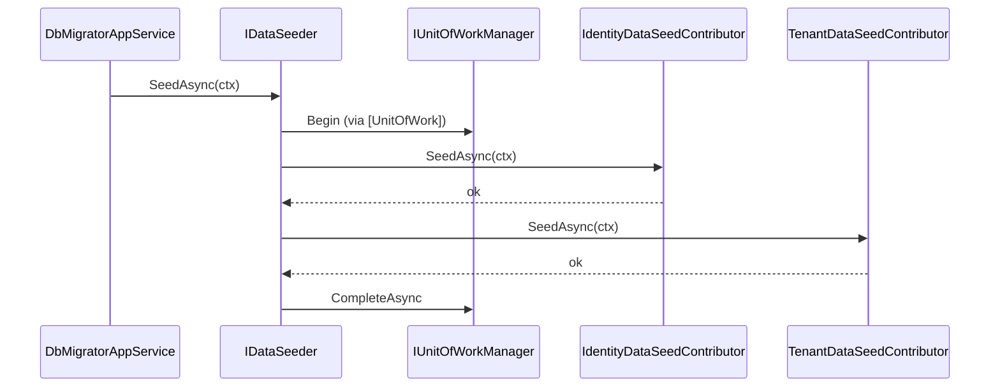

The `Volo.Abp.Data` package is the *neutral ground* on which every persistence stack in ABP builds. It does not know about Entity Framework Core, MongoDB, or Dapper — it only defines the contracts they all agree on: how to resolve a **connection string**, how to **seed** initial data into a tenant or host database, how to toggle **data filters** like `ISoftDelete` or `IMultiTenant`, and how to share configuration through `AbpDbConnectionOptions`. Provider modules (`Volo.Abp.EntityFrameworkCore`, `Volo.Abp.MongoDB`, etc.) implement these contracts; application code consumes them through the abstractions in this module.

Three subsystems live here and each is exposed via a small interface:

- **`IConnectionStringResolver`** — given a logical name (or none), return the connection string. The default resolver reads `AbpDbConnectionOptions.ConnectionStrings` and supports per‑database mappings.
- **`IDataSeeder` / `IDataSeedContributor`** — a transient pipeline that walks every registered contributor inside a Unit of Work, so test fixtures and module installers can populate tables in a uniform way.
- **`IDataFilter` / `IDataFilter<TFilter>`** — async-local toggles for query filters (e.g. `IDataFilter<ISoftDelete>`), used by repositories to enable/disable filtering for a logical scope.

## File inventory

| File | Purpose |
| --- | --- |
| `Volo/Abp/Data/AbpDataModule.cs` | Module class. Registers `IDataFilter<>` as singleton, auto‑collects contributors, depends on `AbpObjectExtendingModule`, `AbpUnitOfWorkModule`, `AbpEventBusAbstractionsModule`. |
| `Volo/Abp/Data/AbpDbConnectionOptions.cs` | Options object holding `ConnectionStrings` and `Databases` mapping. |
| `Volo/Abp/Data/ConnectionStrings.cs` | `Dictionary<string,string?>` with a `Default` accessor. |
| `Volo/Abp/Data/IConnectionStringResolver.cs` | `Resolve` (obsolete) / `ResolveAsync` interface. |
| `Volo/Abp/Data/DefaultConnectionStringResolver.cs` | Default implementation backed by options. |
| `Volo/Abp/Data/ConnectionStringNameAttribute.cs` | Marks a repository/DbContext with a logical connection-string name. |
| `Volo/Abp/Data/IDataSeeder.cs` | Pipeline entry point. |
| `Volo/Abp/Data/DataSeeder.cs` | Default seeder; iterates `IDataSeedContributor`s. |
| `Volo/Abp/Data/IDataSeedContributor.cs` | One step in the pipeline. |
| `Volo/Abp/Data/DataSeedContext.cs` | Per‑call context with `TenantId` and a `Properties` bag. |
| `Volo/Abp/Data/AbpDataSeedOptions.cs` | Holds `Contributors` list. |
| `Volo/Abp/Data/DataSeederExtensions.cs` | `SeedInSeparateUow` / `WithProperty` helpers. |
| `Volo/Abp/Data/IDataFilter.cs` | Generic and non‑generic filter interfaces. |
| `Volo/Abp/Data/DataFilter.cs` | Default `IDataFilter` and `IDataFilter<TFilter>` with AsyncLocal state. |
| `Volo/Abp/Data/DataFilterState.cs` | `IsEnabled` + `Clone`. |
| `Volo/Abp/Data/AbpDataFilterOptions.cs` | Per‑filter default `DataFilterState`. |
| `Volo/Abp/Data/IDbConnectionStringResolver.cs` | (Optional) marker used by relational providers. |
| `Volo/Abp/Data/IExtraPropertyValidator.cs` | Hook for validating extra-property values. |
| `Volo/Abp/Data/AbpCommonDbProperties.cs` | Magic-string column names used by every provider. |
| `Volo/Abp/Data/AbpDbConcurrencyException.cs` | Shared exception raised on concurrency-stamp mismatch. |
| `Volo/Abp/Data/AbpDatabaseInfoDictionary.cs` | Multi‑database routing table. |

## Key abstractions

| Type | Signature (excerpt) | Notes |
| --- | --- | --- |
| `IConnectionStringResolver` | `Task<string> ResolveAsync(string? connectionStringName = null)` | Async-first since v4. The sync `Resolve` is `[Obsolete]`. |
| `IDataSeeder` | `Task SeedAsync(DataSeedContext context)` | Single entry point used at host start-up and per-tenant. |
| `IDataSeedContributor` | `Task SeedAsync(DataSeedContext context)` | Modules implement this; auto-registered. |
| `IDataFilter` | `IDisposable Enable<TFilter>()` / `Disable<TFilter>()` / `bool IsEnabled<TFilter>()` | Non-generic facade. |
| `IDataFilter<TFilter>` | `IDisposable Enable()` / `Disable()` / `bool IsEnabled` | Per-filter state. |
| `ConnectionStringNameAttribute` | `Name`, `static GetConnStringName<T>()` | Lets a `DbContext` or repository declare its logical name. |
| `AbpDbConnectionOptions` | `ConnectionStrings`, `Databases`, `GetConnectionStringOrNull(...)` | Single source of truth for connection strings. |

## Module wiring

`AbpDataModule` performs three things during the boot phases:

```csharp
[DependsOn(
    typeof(AbpObjectExtendingModule),
    typeof(AbpUnitOfWorkModule),
    typeof(AbpEventBusAbstractionsModule)
)]
public class AbpDataModule : AbpModule
{
    public override void PreConfigureServices(ServiceConfigurationContext context)
    {
        AutoAddDataSeedContributors(context.Services);
    }

    public override void ConfigureServices(ServiceConfigurationContext context)
    {
        var configuration = context.Services.GetConfiguration();

        Configure<AbpDbConnectionOptions>(configuration);

        context.Services.AddSingleton(typeof(IDataFilter<>), typeof(DataFilter<>));
    }

    public override void PostConfigureServices(ServiceConfigurationContext context)
    {
        Configure<AbpDbConnectionOptions>(options =>
        {
            options.Databases.RefreshIndexes();
        });
    }

    private static void AutoAddDataSeedContributors(IServiceCollection services)
    {
        var contributors = new List<Type>();

        services.OnRegistered(context =>
        {
            if (typeof(IDataSeedContributor).IsAssignableFrom(context.ImplementationType))
            {
                contributors.Add(context.ImplementationType);
            }
        });

        services.Configure<AbpDataSeedOptions>(options =>
        {
            options.Contributors.AddIfNotContains(contributors);
        });
    }
}
```

Two important details:

1. **Open generic singleton.** `IDataFilter<TFilter>` is registered as `AddSingleton(typeof(IDataFilter<>), typeof(DataFilter<>))`. Because the inner state uses `AsyncLocal<DataFilterState>`, a single instance per closed generic is safe and ambient‑scope‑friendly.
2. **Contributor auto‑collection.** Any type that implements `IDataSeedContributor` and gets registered via the normal conventional registrar is appended to `AbpDataSeedOptions.Contributors` from `PreConfigureServices`.

## Connection strings

### `ConnectionStrings`

```csharp
[Serializable]
public class ConnectionStrings : Dictionary<string, string?>
{
    public const string DefaultConnectionStringName = "Default";

    public string? Default {
        get => this.GetOrDefault(DefaultConnectionStringName);
        set => this[DefaultConnectionStringName] = value;
    }
}
```

Plain dictionary with a `Default` shortcut. The configuration root binds the `ConnectionStrings:*` section into this object via `Configure<AbpDbConnectionOptions>(configuration)`.

### `AbpDbConnectionOptions`

```csharp
public class AbpDbConnectionOptions
{
    public ConnectionStrings ConnectionStrings { get; set; }
    public AbpDatabaseInfoDictionary Databases { get; set; }

    public string? GetConnectionStringOrNull(
        string connectionStringName,
        bool fallbackToDatabaseMappings = true,
        bool fallbackToDefault = true)
    {
        var connectionString = ConnectionStrings.GetOrDefault(connectionStringName);
        if (!connectionString.IsNullOrEmpty())
            return connectionString;

        if (fallbackToDatabaseMappings)
        {
            var database = Databases.GetMappedDatabaseOrNull(connectionStringName);
            if (database != null)
            {
                connectionString = ConnectionStrings.GetOrDefault(database.DatabaseName);
                if (!connectionString.IsNullOrEmpty())
                    return connectionString;
            }
        }

        if (fallbackToDefault)
        {
            connectionString = ConnectionStrings.Default;
            if (!connectionString.IsNullOrWhiteSpace())
                return connectionString;
        }

        return null;
    }
}
```

The fallback chain — *named → mapped database → default* — is what allows modules with their own logical name (e.g. `"AbpIdentity"`) to share the host's `Default` connection string when no explicit override exists. It is also what lets you split a single application into multiple physical databases by adding mappings to `Databases`.

### `DefaultConnectionStringResolver`

```csharp
public class DefaultConnectionStringResolver : IConnectionStringResolver, ITransientDependency
{
    protected AbpDbConnectionOptions Options { get; }

    public DefaultConnectionStringResolver(IOptionsMonitor<AbpDbConnectionOptions> options)
    {
        Options = options.CurrentValue;
    }

    public virtual Task<string> ResolveAsync(string? connectionStringName = null)
    {
        return Task.FromResult(ResolveInternal(connectionStringName))!;
    }

    private string? ResolveInternal(string? connectionStringName)
    {
        if (connectionStringName == null)
            return Options.ConnectionStrings.Default;

        var connectionString = Options.GetConnectionStringOrNull(connectionStringName);
        return !connectionString.IsNullOrEmpty() ? connectionString : null;
    }
}
```

Tenant-aware databases (saas) replace this implementation with a resolver that consults the tenant store before falling back to `AbpDbConnectionOptions`.

### `ConnectionStringNameAttribute`

```csharp
public class ConnectionStringNameAttribute : Attribute
{
    public string Name { get; }

    public ConnectionStringNameAttribute(string name)
    {
        Check.NotNull(name, nameof(name));
        Name = name;
    }

    public static string GetConnStringName<T>() => GetConnStringName(typeof(T));

    public static string GetConnStringName(Type type)
    {
        var nameAttribute = type.GetTypeInfo().GetCustomAttribute<ConnectionStringNameAttribute>();
        return nameAttribute == null ? type.FullName! : nameAttribute.Name;
    }
}
```

A `DbContext` decorated with `[ConnectionStringName("AbpIdentity")]` will resolve through that name; without the attribute the fully qualified type name is used. EF Core's `AbpDbContextOptions.UseDbContext<TDbContext>()` calls `GetConnStringName(typeof(TDbContext))` to pick the right key.

## Data seeding pipeline

```csharp
public class DataSeeder : IDataSeeder, ITransientDependency
{
    protected IServiceScopeFactory ServiceScopeFactory { get; }
    protected AbpDataSeedOptions Options { get; }

    [UnitOfWork]
    public virtual async Task SeedAsync(DataSeedContext context)
    {
        using (var scope = ServiceScopeFactory.CreateScope())
        {
            if (context.Properties.ContainsKey(DataSeederExtensions.SeedInSeparateUow))
            {
                var manager = scope.ServiceProvider.GetRequiredService<IUnitOfWorkManager>();
                foreach (var contributorType in Options.Contributors)
                {
                    var options = context.Properties.TryGetValue(DataSeederExtensions.SeedInSeparateUowOptions, out var uowOptions)
                        ? (AbpUnitOfWorkOptions) uowOptions!
                        : new AbpUnitOfWorkOptions();
                    var requiresNew = context.Properties.TryGetValue(DataSeederExtensions.SeedInSeparateUowRequiresNew, out var obj) && (bool) obj!;

                    using (var uow = manager.Begin(options, requiresNew))
                    {
                        var contributor = (IDataSeedContributor)scope.ServiceProvider.GetRequiredService(contributorType);
                        await contributor.SeedAsync(context);
                        await uow.CompleteAsync();
                    }
                }
            }
            else
            {
                foreach (var contributorType in Options.Contributors)
                {
                    var contributor = (IDataSeedContributor)scope.ServiceProvider.GetRequiredService(contributorType);
                    await contributor.SeedAsync(context);
                }
            }
        }
    }
}
```

Two execution modes are supported:

1. **Single UoW (default).** Because `SeedAsync` carries `[UnitOfWork]`, all contributors share one transaction. Failure of any contributor rolls back every prior insert.
2. **Per‑contributor UoW.** When `context.Properties[SeedInSeparateUow] == true`, each contributor runs in its own `manager.Begin(...)` scope. This is the pattern used by migration tooling that wants to commit module‑by‑module even if a later module fails.

### `DataSeedContext`

```csharp
public class DataSeedContext
{
    public Guid? TenantId { get; set; }

    public object? this[string name] {
        get => Properties.GetOrDefault(name);
        set => Properties[name] = value;
    }

    [NotNull]
    public Dictionary<string, object?> Properties { get; }

    public DataSeedContext(Guid? tenantId = null)
    {
        TenantId = tenantId;
        Properties = new Dictionary<string, object?>();
    }

    public virtual DataSeedContext WithProperty(string key, object? value)
    {
        Properties[key] = value;
        return this;
    }
}
```

`TenantId` is the formal contract for *who am I seeding for?*; the `Properties` bag is the informal contract for everything else (admin email, default password, feature flags). Calling `new DataSeedContext(tenantId).WithProperty("AdminEmail", "admin@x.com")` is the typical builder pattern.

### Sequence



## Data filters

The data-filter mechanism mirrors `IDataFilter` from the older ABP.IO releases but is now built on `AsyncLocal` so that filter state propagates correctly across awaits and parallel tasks.

```csharp
public interface IDataFilter<TFilter>
    where TFilter : class
{
    IDisposable Enable();
    IDisposable Disable();
    bool IsEnabled { get; }
}

public interface IDataFilter
{
    IDisposable Enable<TFilter>() where TFilter : class;
    IDisposable Disable<TFilter>() where TFilter : class;
    bool IsEnabled<TFilter>() where TFilter : class;
}
```

### Generic `DataFilter<TFilter>`

```csharp
public class DataFilter<TFilter> : IDataFilter<TFilter>
    where TFilter : class
{
    public bool IsEnabled {
        get {
            EnsureInitialized();
            return _filter.Value!.IsEnabled;
        }
    }

    private readonly AbpDataFilterOptions _options;
    private readonly AsyncLocal<DataFilterState> _filter;

    public DataFilter(IOptions<AbpDataFilterOptions> options)
    {
        _options = options.Value;
        _filter = new AsyncLocal<DataFilterState>();
    }

    public IDisposable Enable()
    {
        if (IsEnabled) return NullDisposable.Instance;
        _filter.Value!.IsEnabled = true;
        return new DisposeAction(() => Disable());
    }

    public IDisposable Disable()
    {
        if (!IsEnabled) return NullDisposable.Instance;
        _filter.Value!.IsEnabled = false;
        return new DisposeAction(() => Enable());
    }

    private void EnsureInitialized()
    {
        if (_filter.Value != null) return;
        _filter.Value = _options.DefaultStates.GetOrDefault(typeof(TFilter))?.Clone()
                        ?? new DataFilterState(true);
    }
}
```

The pattern is the same as Entity Framework Core's global filters but lets you toggle by **logical concept** (`ISoftDelete`, `IMultiTenant`) rather than by `DbSet`. Each filter records a starting state in `AbpDataFilterOptions.DefaultStates`, and you can adjust it per-call:

```csharp
using (_dataFilter.Disable<ISoftDelete>())
{
    // queries that should include soft-deleted rows
}
```

The non-generic façade simply caches resolved generic filters in a `ConcurrentDictionary`:

```csharp
public class DataFilter : IDataFilter, ISingletonDependency
{
    private readonly ConcurrentDictionary<Type, object> _filters;
    private readonly IServiceProvider _serviceProvider;

    private IDataFilter<TFilter> GetFilter<TFilter>() where TFilter : class
    {
        return (_filters.GetOrAdd(
            typeof(TFilter),
            factory: () => _serviceProvider.GetRequiredService<IDataFilter<TFilter>>()
        ) as IDataFilter<TFilter>)!;
    }
}
```

### `DataFilterState`

```csharp
public class DataFilterState
{
    public bool IsEnabled { get; set; }

    public DataFilterState(bool isEnabled) => IsEnabled = isEnabled;

    public DataFilterState Clone() => new DataFilterState(IsEnabled);
}
```

`Clone` is what allows the AsyncLocal value to be independent from `AbpDataFilterOptions.DefaultStates` — without it, mutating the per-call state would leak back into the module-level defaults.

## Configuration recipe

```csharp
// In a host module
public override void ConfigureServices(ServiceConfigurationContext context)
{
    Configure<AbpDbConnectionOptions>(options =>
    {
        options.ConnectionStrings.Default = "Server=...";
        options.ConnectionStrings["AbpAuditLogging"] = "Server=audit-db...";
    });

    Configure<AbpDataFilterOptions>(options =>
    {
        // Disable soft-delete filter by default
        options.DefaultStates[typeof(ISoftDelete)] = new DataFilterState(isEnabled: false);
    });

    Configure<AbpDataSeedOptions>(options =>
    {
        // Add a custom contributor explicitly (auto-add catches conventional ones)
        options.Contributors.Add<MyExtraContributor>();
    });
}
```

## What this module deliberately does *not* do

- It does not open a `DbConnection` — that's the EF Core / Dapper / MongoDB provider's job. `IConnectionStringResolver` only returns the *string*.
- It does not define repositories. Repositories live in `Volo.Abp.Domain` and consume `IDataFilter` and `IConnectionStringResolver`.
- It does not enforce transaction semantics. The transactional scope around `IDataSeeder.SeedAsync` is provided by `[UnitOfWork]` and the `AbpUnitOfWorkModule` interceptor.

For the UoW mechanism itself, see [Unit of Work](/framework/data/uow). For extra-property storage shared across DTOs and entities, see [Object Extending](/framework/data/object-extending).
