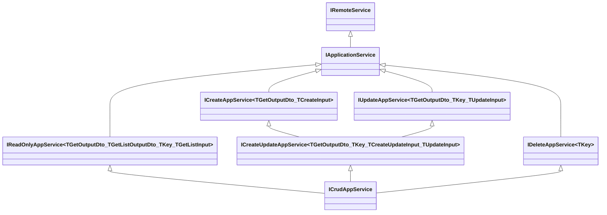

`Volo.Abp.Ddd.Application.Contracts` is the assembly an HTTP client, a Blazor WASM client, an Angular client, or any other downstream consumer **must** reference to talk to your application. It contains zero implementation — only DTO classes and service-contract interfaces. By splitting these from `Volo.Abp.Ddd.Application` (which holds the runtime), ABP lets you ship a tiny "contracts" NuGet to clients that have no reason to drag in EF Core, repositories, or domain logic.

This page enumerates every public type in the assembly under `Volo.Abp.Application.Dtos` and `Volo.Abp.Application.Services`, the localization resource, and the project-level dependencies that the csproj advertises.

## Package coordinates

```xml framework/src/Volo.Abp.Ddd.Application.Contracts/Volo.Abp.Ddd.Application.Contracts.csproj
<Project Sdk="Microsoft.NET.Sdk">
  <PropertyGroup>
    <TargetFrameworks>netstandard2.0;netstandard2.1;net7.0</TargetFrameworks>
    <Nullable>enable</Nullable>
    <AssemblyName>Volo.Abp.Ddd.Application.Contracts</AssemblyName>
    <PackageId>Volo.Abp.Ddd.Application.Contracts</PackageId>
  </PropertyGroup>

  <ItemGroup>
    <EmbeddedResource Include="Volo\Abp\Application\Localization\Resources\AbpDdd\*.json" />
    <Content Remove="Volo\Abp\Application\Localization\Resources\AbpDdd\*.json" />
  </ItemGroup>

  <ItemGroup>
    <ProjectReference Include="..\Volo.Abp.Auditing.Contracts\..." />
    <ProjectReference Include="..\Volo.Abp.Localization\..." />
    <ProjectReference Include="..\Volo.Abp.Data\..." />
  </ItemGroup>
</Project>
```

Notice the three dependencies and the **absence of `Volo.Abp.Ddd.Domain`**. Contracts have no business reaching into the domain. The Domain layer references this assembly only indirectly through `AbpDddDomainSharedModule`.

## Module wiring

```csharp framework/src/Volo.Abp.Ddd.Application.Contracts/Volo/Abp/Application/AbpDddApplicationContractsModule.cs
[DependsOn(
    typeof(AbpLocalizationModule),
    typeof(AbpAuditingContractsModule),
    typeof(AbpDataModule)
)]
public class AbpDddApplicationContractsModule : AbpModule
{
    public override void ConfigureServices(ServiceConfigurationContext context)
    {
        Configure<AbpVirtualFileSystemOptions>(options =>
        {
            options.FileSets.AddEmbedded<AbpDddApplicationContractsModule>();
        });

        Configure<AbpLocalizationOptions>(options =>
        {
            options.Resources
                .Add<AbpDddApplicationContractsResource>("en")
                .AddVirtualJson("/Volo/Abp/Application/Localization/Resources/AbpDdd");
        });
    }
}
```

The module:

1. Adds itself to the virtual file system so consumers can read its embedded JSON.
2. Registers the `AbpDddApplicationContractsResource` localization resource with `"en"` as the base culture.

## DTO file inventory

All DTO files live in `Volo/Abp/Application/Dtos/`:

### Marker interfaces

| File | Type | Members |
| --- | --- | --- |
| `IEntityDto.cs` | `IEntityDto`, `IEntityDto<TKey>` | Empty / `TKey Id { get; set; }`. |

### Entity DTO base classes

| File | Type | Inherits |
| --- | --- | --- |
| `EntityDto.cs` | `EntityDto`, `EntityDto<TKey>` | `IEntityDto[<TKey>]`. |
| `ExtensibleEntityDto.cs` | `ExtensibleEntityDto`, `ExtensibleEntityDto<TKey>` | `ExtensibleObject`, `IEntityDto[<TKey>]`. |
| `CreationAuditedEntityDto.cs` | `CreationAuditedEntityDto`, `CreationAuditedEntityDto<TKey>` | `EntityDto` + `ICreationAuditedObject`. |
| `AuditedEntityDto.cs` | `AuditedEntityDto`, `AuditedEntityDto<TKey>` | `CreationAuditedEntityDto` + `IAuditedObject`. |
| `FullAuditedEntityDto.cs` | `FullAuditedEntityDto`, `FullAuditedEntityDto<TKey>` | `AuditedEntityDto` + `IFullAuditedObject`. |
| `ExtensibleCreationAuditedEntityDto.cs` | `ExtensibleCreationAuditedEntityDto[<TKey>]` | `ExtensibleEntityDto` + `ICreationAuditedObject`. |
| `ExtensibleAuditedEntityDto.cs` | `ExtensibleAuditedEntityDto[<TKey>]` | `ExtensibleCreationAuditedEntityDto` + `IAuditedObject`. |
| `ExtensibleFullAuditedEntityDto.cs` | `ExtensibleFullAuditedEntityDto[<TKey>]` | `ExtensibleAuditedEntityDto` + `IFullAuditedObject`. |
| `*WithUserDto.cs` | `AuditedEntityWithUserDto`, `FullAuditedEntityWithUserDto`, `CreationAuditedEntityWithUserDto`, plus `Extensible*` variants | Add a user-detail navigation. |

### Result envelopes

| File | Type | Purpose |
| --- | --- | --- |
| `IListResult.cs` | `IListResult<T>` | Standardises `IReadOnlyList<T> Items`. |
| `ListResultDto.cs` | `ListResultDto<T>`, `ExtensibleListResultDto<T>` | Plain list response. |
| `IPagedResult.cs` | `IPagedResult<T>` | `IListResult<T>` + `IHasTotalCount`. |
| `IHasTotalCount.cs` | `IHasTotalCount` | `long TotalCount { get; set; }`. |
| `PagedResultDto.cs` | `PagedResultDto<T>`, `ExtensiblePagedResultDto<T>` | Paged response. |

### Request envelopes

| File | Type | Purpose |
| --- | --- | --- |
| `ILimitedResultRequest.cs` | `ILimitedResultRequest` | `int MaxResultCount`. |
| `LimitedResultRequestDto.cs` | `LimitedResultRequestDto`, `ExtensibleLimitedResultRequestDto` | Implements the above with `[Range(1, int.MaxValue)]` + `IValidatableObject`. |
| `IPagedResultRequest.cs` | `IPagedResultRequest` | `ILimitedResultRequest` + `int SkipCount`. |
| `PagedResultRequestDto.cs` | `PagedResultRequestDto`, `ExtensiblePagedResultRequestDto` | Implements the above with `[Range(0, int.MaxValue)]`. |
| `ISortedResultRequest.cs` | `ISortedResultRequest` | `string? Sorting { get; set; }`. |
| `IPagedAndSortedResultRequest.cs` | `IPagedAndSortedResultRequest` | `IPagedResultRequest` + `ISortedResultRequest`. |
| `PagedAndSortedResultRequestDto.cs` | `PagedAndSortedResultRequestDto`, `ExtensiblePagedAndSortedResultRequestDto` | The most common GetList input DTO. |

## Walk-through of the key DTOs

### `IEntityDto<TKey>` and `EntityDto<TKey>`

```csharp framework/src/Volo.Abp.Ddd.Application.Contracts/Volo/Abp/Application/Dtos/IEntityDto.cs
public interface IEntityDto { }

public interface IEntityDto<TKey> : IEntityDto
{
    TKey Id { get; set; }
}
```

```csharp framework/src/Volo.Abp.Ddd.Application.Contracts/Volo/Abp/Application/Dtos/EntityDto.cs
[Serializable]
public abstract class EntityDto : IEntityDto
{
    public override string ToString() => $"[DTO: {GetType().Name}]";
}

[Serializable]
public abstract class EntityDto<TKey> : EntityDto, IEntityDto<TKey>
{
    public TKey Id { get; set; } = default!;
    public override string ToString() => $"[DTO: {GetType().Name}] Id = {Id}";
}
```

The comment on the non-generic `EntityDto` says it bluntly: *"//TODO: Consider to delete this class"* — the framework still ships it for legacy reasons but new DTOs should derive from `EntityDto<TKey>` or one of the auditing/extensible variants.

### `ExtensibleEntityDto`

```csharp framework/src/Volo.Abp.Ddd.Application.Contracts/Volo/Abp/Application/Dtos/ExtensibleEntityDto.cs
[Serializable]
public abstract class ExtensibleEntityDto<TKey> : ExtensibleObject, IEntityDto<TKey>
{
    public TKey Id { get; set; } = default!;

    protected ExtensibleEntityDto() : this(true) { }
    protected ExtensibleEntityDto(bool setDefaultsForExtraProperties) : base(setDefaultsForExtraProperties) { }
}
```

Inherits from `ExtensibleObject` in `Volo.Abp.Data`, so it carries an `ExtraProperties` dictionary that mirrors the entity-side `IHasExtraProperties`. This is what allows the object-extension feature to flow extra properties from entity to DTO to wire and back without modifying schemas. See [Object-extending](/framework/data/object-extending) for the full story.

### `FullAuditedEntityDto<TKey>`

```csharp framework/src/Volo.Abp.Ddd.Application.Contracts/Volo/Abp/Application/Dtos/FullAuditedEntityDto.cs
[Serializable]
public abstract class FullAuditedEntityDto<TPrimaryKey>
    : AuditedEntityDto<TPrimaryKey>, IFullAuditedObject
{
    public bool IsDeleted { get; set; }
    public Guid? DeleterId { get; set; }
    public DateTime? DeletionTime { get; set; }
}
```

Together with `CreationAuditedEntityDto<TKey>` (adds `CreationTime`, `CreatorId`) and `AuditedEntityDto<TKey>` (adds `LastModificationTime`, `LastModifierId`), this triple is the analogue of the entity-side `CreationAuditedEntity` / `AuditedEntity` / `FullAuditedEntity` hierarchy.

### `ListResultDto<T>` and `PagedResultDto<T>`

```csharp framework/src/Volo.Abp.Ddd.Application.Contracts/Volo/Abp/Application/Dtos/ListResultDto.cs
[Serializable]
public class ListResultDto<T> : IListResult<T>
{
    public IReadOnlyList<T> Items
    {
        get => _items ??= new List<T>();
        set => _items = value;
    }
    private IReadOnlyList<T>? _items;

    public ListResultDto() { }
    public ListResultDto(IReadOnlyList<T> items) { Items = items; }
}
```

```csharp framework/src/Volo.Abp.Ddd.Application.Contracts/Volo/Abp/Application/Dtos/PagedResultDto.cs
[Serializable]
public class PagedResultDto<T> : ListResultDto<T>, IPagedResult<T>
{
    public long TotalCount { get; set; }
    public PagedResultDto() { }
    public PagedResultDto(long totalCount, IReadOnlyList<T> items) : base(items) { TotalCount = totalCount; }
}
```

Use `PagedResultDto<T>` as the return type for any `GetListAsync` that accepts a `PagedResultRequestDto`. Use `ListResultDto<T>` when the list is naturally bounded (e.g. permission groups, role names).

### `LimitedResultRequestDto` with built-in validation

```csharp framework/src/Volo.Abp.Ddd.Application.Contracts/Volo/Abp/Application/Dtos/LimitedResultRequestDto.cs
[Serializable]
public class LimitedResultRequestDto : ILimitedResultRequest, IValidatableObject
{
    public static int DefaultMaxResultCount { get; set; } = 10;
    public static int MaxMaxResultCount { get; set; } = 1000;

    [Range(1, int.MaxValue)]
    public virtual int MaxResultCount { get; set; } = DefaultMaxResultCount;

    public virtual IEnumerable<ValidationResult> Validate(ValidationContext validationContext)
    {
        if (MaxResultCount > MaxMaxResultCount)
        {
            var localizer = validationContext
                .GetRequiredService<IStringLocalizer<AbpDddApplicationContractsResource>>();

            yield return new ValidationResult(
                localizer[
                    "MaxResultCountExceededExceptionMessage",
                    nameof(MaxResultCount),
                    MaxMaxResultCount,
                    typeof(LimitedResultRequestDto).FullName!,
                    nameof(MaxMaxResultCount)
                ],
                new[] { nameof(MaxResultCount) });
        }
    }
}
```

The two static knobs `DefaultMaxResultCount = 10` and `MaxMaxResultCount = 1000` are **process-wide defaults**. Set them once at startup if your service has a different policy:

```csharp
LimitedResultRequestDto.MaxMaxResultCount = 100;
LimitedResultRequestDto.DefaultMaxResultCount = 25;
```

`PagedResultRequestDto` extends this with `SkipCount` (`[Range(0, int.MaxValue)]`), and `PagedAndSortedResultRequestDto` further adds `Sorting`. The `Sorting` string format is documented in `ISortedResultRequest`:

```text
"Name"
"Name DESC"
"Name ASC, Age DESC"
```

## Service contract file inventory

All under `Volo/Abp/Application/Services/`:

| File | Type |
| --- | --- |
| `IApplicationService.cs` | `IApplicationService` (extends `IRemoteService`). |
| `ICreateAppService.cs` | `ICreateAppService<TEntityDto>`, `ICreateAppService<TGetOutputDto, TCreateInput>`. |
| `IUpdateAppService.cs` | `IUpdateAppService<TEntityDto, TKey>`, `IUpdateAppService<TGetOutputDto, TKey, TUpdateInput>`. |
| `IDeleteAppService.cs` | `IDeleteAppService<TKey>`. |
| `ICreateUpdateAppService.cs` | Several arities; combines create+update. |
| `IReadOnlyAppService.cs` | Read-only contract — `GetAsync`, `GetListAsync`. |
| `ICrudAppService.cs` | Full CRUD; multiple arities up to seven generic parameters. |

### `IApplicationService` — the marker

```csharp framework/src/Volo.Abp.Ddd.Application.Contracts/Volo/Abp/Application/Services/IApplicationService.cs
public interface IApplicationService : IRemoteService { }
```

Two things:

- It is empty — `ApplicationService` (in the runtime assembly) implements it.
- It extends `IRemoteService` so the [Dynamic HTTP API](/flows/dynamic-http-proxy) feature knows to expose implementing classes as HTTP endpoints automatically.

### `IReadOnlyAppService`

```csharp framework/src/Volo.Abp.Ddd.Application.Contracts/Volo/Abp/Application/Services/IReadOnlyAppService.cs
public interface IReadOnlyAppService<TEntityDto, in TKey>
    : IReadOnlyAppService<TEntityDto, TEntityDto, TKey, PagedAndSortedResultRequestDto> { }

public interface IReadOnlyAppService<TEntityDto, in TKey, in TGetListInput>
    : IReadOnlyAppService<TEntityDto, TEntityDto, TKey, TGetListInput> { }

public interface IReadOnlyAppService<TGetOutputDto, TGetListOutputDto, in TKey, in TGetListInput>
    : IApplicationService
{
    Task<TGetOutputDto> GetAsync(TKey id);
    Task<PagedResultDto<TGetListOutputDto>> GetListAsync(TGetListInput input);
}
```

Two methods, four generic parameters at the bottom of the hierarchy:

| Type parameter | Meaning |
| --- | --- |
| `TGetOutputDto` | Returned by `GetAsync(id)`. |
| `TGetListOutputDto` | Each item in the paged list. |
| `TKey` | Primary key type. |
| `TGetListInput` | Input filter / paging DTO. |

The convenience overloads collapse `TGetOutputDto = TGetListOutputDto` and `TGetListInput = PagedAndSortedResultRequestDto`.

### `ICreateUpdateAppService` and `IDeleteAppService`

```csharp framework/src/Volo.Abp.Ddd.Application.Contracts/Volo/Abp/Application/Services/ICreateAppService.cs
public interface ICreateAppService<TGetOutputDto, in TCreateInput> : IApplicationService
{
    Task<TGetOutputDto> CreateAsync(TCreateInput input);
}
```

```csharp framework/src/Volo.Abp.Ddd.Application.Contracts/Volo/Abp/Application/Services/IUpdateAppService.cs
public interface IUpdateAppService<TGetOutputDto, in TKey, in TUpdateInput> : IApplicationService
{
    Task<TGetOutputDto> UpdateAsync(TKey id, TUpdateInput input);
}
```

```csharp framework/src/Volo.Abp.Ddd.Application.Contracts/Volo/Abp/Application/Services/IDeleteAppService.cs
public interface IDeleteAppService<in TKey> : IApplicationService
{
    Task DeleteAsync(TKey id);
}
```

`ICreateUpdateAppService<…>` is a convenience that inherits both create and update — see the source file for the four arities.

### `ICrudAppService`

```csharp framework/src/Volo.Abp.Ddd.Application.Contracts/Volo/Abp/Application/Services/ICrudAppService.cs
public interface ICrudAppService<TGetOutputDto, TGetListOutputDto, in TKey, in TGetListInput, in TCreateInput, in TUpdateInput>
    : IReadOnlyAppService<TGetOutputDto, TGetListOutputDto, TKey, TGetListInput>,
      ICreateUpdateAppService<TGetOutputDto, TKey, TCreateInput, TUpdateInput>,
      IDeleteAppService<TKey>
{
}
```

A clean **composition** of the four sub-contracts. The four shorter arities collapse generic parameters:

```csharp
public interface ICrudAppService<TEntityDto, in TKey>
    : ICrudAppService<TEntityDto, TKey, PagedAndSortedResultRequestDto> { }

public interface ICrudAppService<TEntityDto, in TKey, in TGetListInput>
    : ICrudAppService<TEntityDto, TKey, TGetListInput, TEntityDto> { }

public interface ICrudAppService<TEntityDto, in TKey, in TGetListInput, in TCreateInput>
    : ICrudAppService<TEntityDto, TKey, TGetListInput, TCreateInput, TCreateInput> { }

public interface ICrudAppService<TEntityDto, in TKey, in TGetListInput, in TCreateInput, in TUpdateInput>
    : ICrudAppService<TEntityDto, TEntityDto, TKey, TGetListInput, TCreateInput, TUpdateInput> { }
```

The most common form in a real service is:

```csharp
public interface ITenantAppService :
    ICrudAppService<
        TenantDto,
        Guid,
        GetTenantsInput,
        TenantCreateDto,
        TenantUpdateDto>
{ }
```

### Visualizing the contract graph



## Permission constants — convention only

The framework's own `ICrudAppService` interface does **not** declare permission names. Permissions are a runtime concern of the implementation side. The convention in commercial ABP modules and solution templates is to ship a `XxxPermissions` static class inside the `*.Application.Contracts` project:

```csharp
public static class TenantPermissions
{
    public const string GroupName = "AbpTenantManagement";

    public static class Tenants
    {
        public const string Default = GroupName + ".Tenants";
        public const string Create  = Default + ".Create";
        public const string Update  = Default + ".Update";
        public const string Delete  = Default + ".Delete";
    }
}
```

…and a `PermissionDefinitionProvider` that wires the strings to the permission tree. Application services then assign the constants to the protected `CreatePolicyName` / `UpdatePolicyName` / `DeletePolicyName` slots on the runtime base class — see [Application Services](/framework/ddd/application-services).

## Localization resource

```csharp framework/src/Volo.Abp.Ddd.Application.Contracts/Volo/Abp/Application/Localization/Resources/AbpDdd/AbpDddApplicationContractsResource.cs
[LocalizationResourceName("AbpDddApplicationContracts")]
public class AbpDddApplicationContractsResource { }
```

`en.json` holds the only string the package itself emits:

```json framework/src/Volo.Abp.Ddd.Application.Contracts/Volo/Abp/Application/Localization/Resources/AbpDdd/en.json
{
  "culture": "en",
  "texts": {
    "MaxResultCountExceededExceptionMessage": "{0} can not be more than {1}! Increase {2}.{3} on the server side to allow more results."
  }
}
```

This is the message emitted from `LimitedResultRequestDto.Validate` when a caller asks for too many rows. 26 cultures are shipped under the same folder.

## See also

<CardGroup cols={2}>
<Card title="Application services" href="/framework/ddd/application-services">
The runtime implementations of these contracts — `ApplicationService`, `CrudAppService`, `AbstractKeyCrudAppService`.
</Card>
<Card title="Domain Shared" href="/framework/ddd/domain-shared">
The other low-level assembly shared with the Domain layer.
</Card>
<Card title="Dynamic HTTP API" href="/flows/dynamic-http-proxy">
Why `IApplicationService : IRemoteService` matters — it's the trigger for the auto-controller and client-proxy generation.
</Card>
<Card title="Object-extending" href="/framework/data/object-extending">
The mechanism behind `Extensible*Dto` and `ExtraProperties`.
</Card>
</CardGroup>
