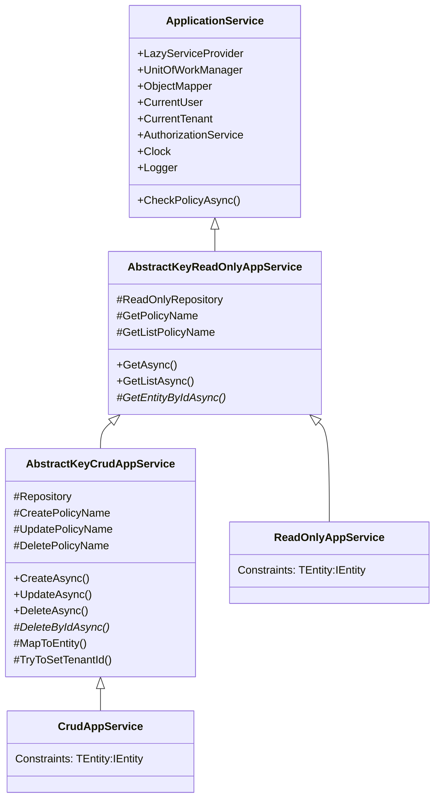
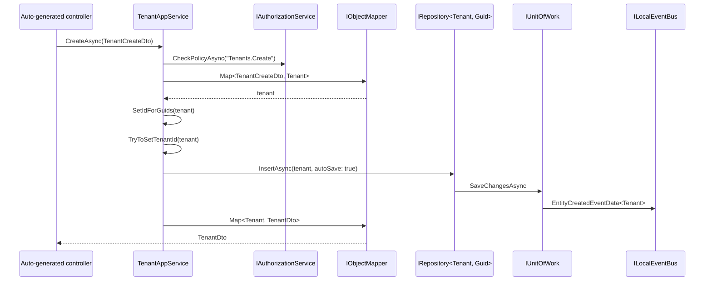

`Volo.Abp.Ddd.Application` is the runtime side of the contract package. It provides the abstract base classes — `ApplicationService`, `AbstractKeyReadOnlyAppService`, `AbstractKeyCrudAppService`, and `CrudAppService` — that real application services inherit from. Together they wire every cross-cutting concern an HTTP-facing service typically needs (auditing, validation, UoW, authorization, feature checks, current user/tenant, logging, localization, object mapping) and turn the implementation of a CRUD service into a handful of override methods.

> **Naming note:** older ABP versions shipped `AsyncCrudAppService` as a sibling class. In v7.4.0 that class has been removed; its API is the *async* CRUD shape now provided by `CrudAppService` and `AbstractKeyCrudAppService` directly. The class name `AsyncCrudAppService` no longer exists in the source tree.

## Package coordinates

```xml framework/src/Volo.Abp.Ddd.Application/Volo.Abp.Ddd.Application.csproj
<AssemblyName>Volo.Abp.Ddd.Application</AssemblyName>
<PackageId>Volo.Abp.Ddd.Application</PackageId>
<TargetFrameworks>netstandard2.0;netstandard2.1;net7.0</TargetFrameworks>

<ItemGroup>
  <ProjectReference Include="..\Volo.Abp.Authorization\..." />
  <ProjectReference Include="..\Volo.Abp.Ddd.Application.Contracts\..." />
  <ProjectReference Include="..\Volo.Abp.Ddd.Domain\..." />
  <ProjectReference Include="..\Volo.Abp.Features\..." />
  <ProjectReference Include="..\Volo.Abp.GlobalFeatures\..." />
  <ProjectReference Include="..\Volo.Abp.Http.Abstractions\..." />
  <ProjectReference Include="..\Volo.Abp.Localization\..." />
  <ProjectReference Include="..\Volo.Abp.ObjectMapping\..." />
  <ProjectReference Include="..\Volo.Abp.Security\..." />
  <ProjectReference Include="..\Volo.Abp.Settings\..." />
  <ProjectReference Include="..\Volo.Abp.Validation\..." />
</ItemGroup>
```

This is the *fat* assembly — it pulls in authorization, features, validation, security, settings, the HTTP abstractions, and object mapping.

```csharp framework/src/Volo.Abp.Ddd.Application/Volo/Abp/Application/AbpDddApplicationModule.cs
[DependsOn(
    typeof(AbpDddDomainModule),
    typeof(AbpDddApplicationContractsModule),
    typeof(AbpSecurityModule),
    typeof(AbpObjectMappingModule),
    typeof(AbpValidationModule),
    typeof(AbpAuthorizationModule),
    typeof(AbpHttpAbstractionsModule),
    typeof(AbpSettingsModule),
    typeof(AbpFeaturesModule),
    typeof(AbpGlobalFeaturesModule)
)]
public class AbpDddApplicationModule : AbpModule
{
    public override void ConfigureServices(ServiceConfigurationContext context)
    {
        Configure<AbpApiDescriptionModelOptions>(options =>
        {
            options.IgnoredInterfaces.AddIfNotContains(typeof(IRemoteService));
            options.IgnoredInterfaces.AddIfNotContains(typeof(IApplicationService));
            options.IgnoredInterfaces.AddIfNotContains(typeof(IUnitOfWorkEnabled));
            options.IgnoredInterfaces.AddIfNotContains(typeof(IAuditingEnabled));
            options.IgnoredInterfaces.AddIfNotContains(typeof(IValidationEnabled));
            options.IgnoredInterfaces.AddIfNotContains(typeof(IGlobalFeatureCheckingEnabled));
        });
    }
}
```

The `AbpApiDescriptionModelOptions` configuration tells the [dynamic HTTP API](/flows/dynamic-http-proxy) feature to **ignore** these "trait" interfaces when generating client proxies — they are framework markers, not part of the service contract.

## File inventory

| File | Type | Role |
| --- | --- | --- |
| `Services/ApplicationService.cs` | `ApplicationService` | Abstract base with all cross-cutting property-injected services. |
| `Services/ReadOnlyAppService.cs` | `ReadOnlyAppService<…>` (5 arities) | Concrete `IEntity<TKey>`-flavoured read-only service. |
| `Services/AbstractKeyReadOnlyAppService.cs` | `AbstractKeyReadOnlyAppService<…>` (4 arities) | Same, but works with `IEntity` (no `TKey` constraint). |
| `Services/CrudAppService.cs` | `CrudAppService<…>` (5 arities) | Read + write for `IEntity<TKey>`. |
| `Services/AbstractKeyCrudAppService.cs` | `AbstractKeyCrudAppService<…>` (5 arities) | Same, no `TKey` constraint on the entity. |
| `System/Linq/AbpPagingQueryableExtensions.cs` | static | `IQueryable.PageBy(IPagedResultRequest)` extension. |

## `ApplicationService` — the cross-cutting bag

```csharp framework/src/Volo.Abp.Ddd.Application/Volo/Abp/Application/Services/ApplicationService.cs
public abstract class ApplicationService :
    IApplicationService,
    IAvoidDuplicateCrossCuttingConcerns,
    IValidationEnabled,
    IUnitOfWorkEnabled,
    IAuditingEnabled,
    IGlobalFeatureCheckingEnabled,
    ITransientDependency
{
    public IAbpLazyServiceProvider LazyServiceProvider { get; set; } = default!;

    public static string[] CommonPostfixes { get; set; } =
        { "AppService", "ApplicationService", "IntService", "IntegrationService", "Service" };

    public List<string> AppliedCrossCuttingConcerns { get; } = new();

    protected IUnitOfWorkManager UnitOfWorkManager
        => LazyServiceProvider.LazyGetRequiredService<IUnitOfWorkManager>();

    protected IAsyncQueryableExecuter AsyncExecuter
        => LazyServiceProvider.LazyGetRequiredService<IAsyncQueryableExecuter>();

    protected Type? ObjectMapperContext { get; set; }
    protected IObjectMapper ObjectMapper => LazyServiceProvider.LazyGetService<IObjectMapper>(provider =>
        ObjectMapperContext == null
            ? provider.GetRequiredService<IObjectMapper>()
            : (IObjectMapper)provider.GetRequiredService(
                typeof(IObjectMapper<>).MakeGenericType(ObjectMapperContext)));

    protected IGuidGenerator GuidGenerator
        => LazyServiceProvider.LazyGetService<IGuidGenerator>(SimpleGuidGenerator.Instance);

    protected ILoggerFactory LoggerFactory
        => LazyServiceProvider.LazyGetRequiredService<ILoggerFactory>();

    protected ICurrentTenant CurrentTenant
        => LazyServiceProvider.LazyGetRequiredService<ICurrentTenant>();

    protected IDataFilter DataFilter
        => LazyServiceProvider.LazyGetRequiredService<IDataFilter>();

    protected ICurrentUser CurrentUser
        => LazyServiceProvider.LazyGetRequiredService<ICurrentUser>();

    protected ISettingProvider SettingProvider
        => LazyServiceProvider.LazyGetRequiredService<ISettingProvider>();

    protected IClock Clock
        => LazyServiceProvider.LazyGetRequiredService<IClock>();

    protected IAuthorizationService AuthorizationService
        => LazyServiceProvider.LazyGetRequiredService<IAuthorizationService>();

    protected IFeatureChecker FeatureChecker
        => LazyServiceProvider.LazyGetRequiredService<IFeatureChecker>();

    protected IStringLocalizerFactory StringLocalizerFactory
        => LazyServiceProvider.LazyGetRequiredService<IStringLocalizerFactory>();

    protected IStringLocalizer L
    {
        get
        {
            if (_localizer == null)
                _localizer = CreateLocalizer();
            return _localizer;
        }
    }
    private IStringLocalizer? _localizer;

    protected Type? LocalizationResource
    {
        get => _localizationResource;
        set { _localizationResource = value; _localizer = null; }
    }
    private Type? _localizationResource = typeof(DefaultResource);

    protected IUnitOfWork? CurrentUnitOfWork => UnitOfWorkManager?.Current;

    protected ILogger Logger
        => LazyServiceProvider.LazyGetService<ILogger>(provider
            => LoggerFactory?.CreateLogger(GetType().FullName!) ?? NullLogger.Instance);
}
```

### What each implemented interface does

| Marker | Behavior |
| --- | --- |
| `IApplicationService` (`IRemoteService`) | Triggers auto-controller + dynamic-proxy generation. |
| `IAvoidDuplicateCrossCuttingConcerns` | The `AppliedCrossCuttingConcerns` list lets interceptors detect "this method has already run UoW/auditing, don't apply twice." |
| `IValidationEnabled` | Activates the `ValidationInterceptor` (data-annotation + `IValidatableObject`). |
| `IUnitOfWorkEnabled` | Activates the `UnitOfWorkInterceptor`. |
| `IAuditingEnabled` | Activates the `AuditingInterceptor`. |
| `IGlobalFeatureCheckingEnabled` | Activates the global-feature interceptor that throws if a method's `[RequiresGlobalFeature]` isn't satisfied. |
| `ITransientDependency` | Conventional-registrar tag — every `ApplicationService` subclass is registered transient. |

### The property-injected services

Each property uses `LazyServiceProvider.LazyGetRequiredService<T>()` (or `LazyGetService<T>(fallback)` when a default exists). Resolution happens the **first time** the property is read, so subclasses pay no cost for services they do not use.

| Property | Type | Notes |
| --- | --- | --- |
| `UnitOfWorkManager` | `IUnitOfWorkManager` | Access ambient UoW. |
| `CurrentUnitOfWork` | `IUnitOfWork?` | Shortcut for `UnitOfWorkManager.Current`. |
| `AsyncExecuter` | `IAsyncQueryableExecuter` | Provider-agnostic LINQ-async. |
| `ObjectMapper` | `IObjectMapper` (or scoped via `ObjectMapperContext`) | DTO ↔ entity mapping. |
| `GuidGenerator` | `IGuidGenerator` | Falls back to `SimpleGuidGenerator.Instance`. |
| `LoggerFactory`, `Logger` | `ILoggerFactory`, `ILogger` | Logger is named after `GetType().FullName`. |
| `CurrentTenant` | `ICurrentTenant` | Tenant resolution. |
| `DataFilter` | `IDataFilter` | Toggle soft-delete / multi-tenant filters. |
| `CurrentUser` | `ICurrentUser` | User id, roles, claims. |
| `SettingProvider` | `ISettingProvider` | Setting management. |
| `Clock` | `IClock` | Time abstraction. |
| `AuthorizationService` | `IAuthorizationService` | Used by `CheckPolicyAsync`. |
| `FeatureChecker` | `IFeatureChecker` | Tenant feature gates. |
| `StringLocalizerFactory`, `L`, `LocalizationResource` | Localization | Set `LocalizationResource = typeof(MyResource);` in your service ctor. |

### `CheckPolicyAsync` and `CreateLocalizer`

```csharp framework/src/Volo.Abp.Ddd.Application/Volo/Abp/Application/Services/ApplicationService.cs
protected virtual async Task CheckPolicyAsync(string? policyName)
{
    if (string.IsNullOrEmpty(policyName))
        return;

    await AuthorizationService.CheckAsync(policyName!);
}

protected virtual IStringLocalizer CreateLocalizer()
{
    if (LocalizationResource != null)
        return StringLocalizerFactory.Create(LocalizationResource);

    var localizer = StringLocalizerFactory.CreateDefaultOrNull();
    if (localizer == null)
        throw new AbpException(
            $"Set {nameof(LocalizationResource)} or define the default localization resource type "
            + $"(by configuring the {nameof(AbpLocalizationOptions)}.{nameof(AbpLocalizationOptions.DefaultResourceType)}) "
            + $"to be able to use the {nameof(L)} object!");

    return localizer;
}
```

`CheckPolicyAsync(null)` is a no-op — that is **the** mechanism the CRUD base classes use to make permission checks opt-in.

## `AbstractKeyReadOnlyAppService` — the read pipeline

```csharp framework/src/Volo.Abp.Ddd.Application/Volo/Abp/Application/Services/AbstractKeyReadOnlyAppService.cs
public abstract class AbstractKeyReadOnlyAppService<TEntity, TGetOutputDto, TGetListOutputDto, TKey, TGetListInput>
    : ApplicationService,
      IReadOnlyAppService<TGetOutputDto, TGetListOutputDto, TKey, TGetListInput>
    where TEntity : class, IEntity
{
    protected IReadOnlyRepository<TEntity> ReadOnlyRepository { get; }

    protected virtual string? GetPolicyName { get; set; }
    protected virtual string? GetListPolicyName { get; set; }

    protected AbstractKeyReadOnlyAppService(IReadOnlyRepository<TEntity> repository)
        => ReadOnlyRepository = repository;

    public virtual async Task<TGetOutputDto> GetAsync(TKey id)
    {
        await CheckGetPolicyAsync();
        var entity = await GetEntityByIdAsync(id);
        return await MapToGetOutputDtoAsync(entity);
    }

    public virtual async Task<PagedResultDto<TGetListOutputDto>> GetListAsync(TGetListInput input)
    {
        await CheckGetListPolicyAsync();

        var query = await CreateFilteredQueryAsync(input);
        var totalCount = await AsyncExecuter.CountAsync(query);

        var entities = new List<TEntity>();
        var entityDtos = new List<TGetListOutputDto>();

        if (totalCount > 0)
        {
            query = ApplySorting(query, input);
            query = ApplyPaging(query, input);
            entities = await AsyncExecuter.ToListAsync(query);
            entityDtos = await MapToGetListOutputDtosAsync(entities);
        }

        return new PagedResultDto<TGetListOutputDto>(totalCount, entityDtos);
    }

    protected abstract Task<TEntity> GetEntityByIdAsync(TKey id);
    protected virtual async Task CheckGetPolicyAsync()     => await CheckPolicyAsync(GetPolicyName);
    protected virtual async Task CheckGetListPolicyAsync() => await CheckPolicyAsync(GetListPolicyName);
}
```

The class is structured around a few overridable hooks.

### Hooks

| Hook | Default behavior |
| --- | --- |
| `GetEntityByIdAsync(TKey id)` | Abstract — subclass (`ReadOnlyAppService<TEntity,…>` or `CrudAppService<TEntity,…>`) calls `Repository.GetAsync(id)`. |
| `CreateFilteredQueryAsync(TGetListInput)` | Returns `Repository.GetQueryableAsync()`. Override to apply filters. |
| `ApplySorting(IQueryable, TGetListInput)` | Honours `ISortedResultRequest.Sorting`; falls back to `ApplyDefaultSorting` when `input is ILimitedResultRequest`. |
| `ApplyDefaultSorting(IQueryable)` | Orders by `IHasCreationTime.CreationTime` descending if the entity has it; throws otherwise. (`ReadOnlyAppService` overrides this for `IEntity<TKey>` to fall back to `Id`.) |
| `ApplyPaging(IQueryable, TGetListInput)` | `IPagedResultRequest → PageBy(input)`; `ILimitedResultRequest → Take(MaxResultCount)`. |
| `MapToGetOutputDtoAsync(TEntity)` / `MapToGetOutputDto(TEntity)` | Default: `ObjectMapper.Map<TEntity, TGetOutputDto>(entity)`. |
| `MapToGetListOutputDtoAsync(TEntity)` / `MapToGetListOutputDto(TEntity)` | Default: same as above with `TGetListOutputDto`. |

### Sorting and paging excerpt

```csharp
protected virtual IQueryable<TEntity> ApplySorting(IQueryable<TEntity> query, TGetListInput input)
{
    if (input is ISortedResultRequest sortInput)
    {
        if (!sortInput.Sorting.IsNullOrWhiteSpace())
            return query.OrderBy(sortInput.Sorting!);
    }

    if (input is ILimitedResultRequest)
        return ApplyDefaultSorting(query);

    return query;
}

protected virtual IQueryable<TEntity> ApplyPaging(IQueryable<TEntity> query, TGetListInput input)
{
    if (input is IPagedResultRequest pagedInput)
        return query.PageBy(pagedInput);

    if (input is ILimitedResultRequest limitedInput)
        return query.Take(limitedInput.MaxResultCount);

    return query;
}
```

`query.OrderBy(sortInput.Sorting!)` uses `System.Linq.Dynamic.Core` to parse the `"Name DESC, Age ASC"` syntax described by `ISortedResultRequest`.

## `AbstractKeyCrudAppService` — the full pipeline

```csharp framework/src/Volo.Abp.Ddd.Application/Volo/Abp/Application/Services/AbstractKeyCrudAppService.cs
public abstract class AbstractKeyCrudAppService<TEntity, TGetOutputDto, TGetListOutputDto, TKey, TGetListInput, TCreateInput, TUpdateInput>
    : AbstractKeyReadOnlyAppService<TEntity, TGetOutputDto, TGetListOutputDto, TKey, TGetListInput>,
      ICrudAppService<TGetOutputDto, TGetListOutputDto, TKey, TGetListInput, TCreateInput, TUpdateInput>
    where TEntity : class, IEntity
{
    protected IRepository<TEntity> Repository { get; }

    protected virtual string? CreatePolicyName { get; set; }
    protected virtual string? UpdatePolicyName { get; set; }
    protected virtual string? DeletePolicyName { get; set; }

    protected AbstractKeyCrudAppService(IRepository<TEntity> repository) : base(repository)
        => Repository = repository;

    public virtual async Task<TGetOutputDto> CreateAsync(TCreateInput input)
    {
        await CheckCreatePolicyAsync();

        var entity = await MapToEntityAsync(input);
        TryToSetTenantId(entity);
        await Repository.InsertAsync(entity, autoSave: true);

        return await MapToGetOutputDtoAsync(entity);
    }

    public virtual async Task<TGetOutputDto> UpdateAsync(TKey id, TUpdateInput input)
    {
        await CheckUpdatePolicyAsync();

        var entity = await GetEntityByIdAsync(id);
        await MapToEntityAsync(input, entity);
        await Repository.UpdateAsync(entity, autoSave: true);

        return await MapToGetOutputDtoAsync(entity);
    }

    public virtual async Task DeleteAsync(TKey id)
    {
        await CheckDeletePolicyAsync();
        await DeleteByIdAsync(id);
    }

    protected abstract Task DeleteByIdAsync(TKey id);

    protected virtual async Task CheckCreatePolicyAsync() => await CheckPolicyAsync(CreatePolicyName);
    protected virtual async Task CheckUpdatePolicyAsync() => await CheckPolicyAsync(UpdatePolicyName);
    protected virtual async Task CheckDeletePolicyAsync() => await CheckPolicyAsync(DeletePolicyName);
}
```

### The mapping hooks

```csharp
protected virtual Task<TEntity> MapToEntityAsync(TCreateInput createInput)
    => Task.FromResult(MapToEntity(createInput));

protected virtual TEntity MapToEntity(TCreateInput createInput)
{
    var entity = ObjectMapper.Map<TCreateInput, TEntity>(createInput);
    SetIdForGuids(entity);
    return entity;
}

protected virtual void SetIdForGuids(TEntity entity)
{
    if (entity is IEntity<Guid> entityWithGuidId && entityWithGuidId.Id == Guid.Empty)
    {
        EntityHelper.TrySetId(
            entityWithGuidId,
            () => GuidGenerator.Create(),
            checkForDisableIdGenerationAttribute: true);
    }
}

protected virtual Task MapToEntityAsync(TUpdateInput updateInput, TEntity entity)
{
    MapToEntity(updateInput, entity);
    return Task.CompletedTask;
}

protected virtual void MapToEntity(TUpdateInput updateInput, TEntity entity)
    => ObjectMapper.Map(updateInput, entity);
```

- `SetIdForGuids` honours `[DisableIdGeneration]` and uses `IGuidGenerator` so the generated id is *ordered* (sequential GUIDs improve clustered-index inserts).
- The async pair `MapToEntityAsync(... )` exists so subclasses can override with awaitable logic; the sync pair stays as the fast-path.

### Tenant-id stamping for `IMultiTenant`

```csharp
protected virtual void TryToSetTenantId(TEntity entity)
{
    if (entity is IMultiTenant && HasTenantIdProperty(entity))
    {
        var tenantId = CurrentTenant.Id;
        if (!tenantId.HasValue) return;

        var propertyInfo = entity.GetType().GetProperty(nameof(IMultiTenant.TenantId));
        if (propertyInfo == null || propertyInfo.GetSetMethod(true) == null)
            return;

        propertyInfo.SetValue(entity, tenantId);
    }
}
```

The check is needed because `IMultiTenant.TenantId` is `protected set` on aggregate roots (`IdentityUser.TenantId`, for example); reflection finds the non-public setter.

## `CrudAppService<…>` — the keyed flavour

```csharp framework/src/Volo.Abp.Ddd.Application/Volo/Abp/Application/Services/CrudAppService.cs
public abstract class CrudAppService<TEntity, TGetOutputDto, TGetListOutputDto, TKey, TGetListInput, TCreateInput, TUpdateInput>
    : AbstractKeyCrudAppService<TEntity, TGetOutputDto, TGetListOutputDto, TKey, TGetListInput, TCreateInput, TUpdateInput>
    where TEntity : class, IEntity<TKey>
    where TGetOutputDto : IEntityDto<TKey>
    where TGetListOutputDto : IEntityDto<TKey>
{
    protected new IRepository<TEntity, TKey> Repository { get; }

    protected CrudAppService(IRepository<TEntity, TKey> repository) : base(repository)
        => Repository = repository;

    protected override async Task DeleteByIdAsync(TKey id)
        => await Repository.DeleteAsync(id);

    protected override async Task<TEntity> GetEntityByIdAsync(TKey id)
        => await Repository.GetAsync(id);

    protected override void MapToEntity(TUpdateInput updateInput, TEntity entity)
    {
        if (updateInput is IEntityDto<TKey> entityDto)
            entityDto.Id = entity.Id;
        base.MapToEntity(updateInput, entity);
    }
}
```

Key differences from `AbstractKeyCrudAppService`:

- Constrains `TEntity` to `IEntity<TKey>` so it can override `GetEntityByIdAsync` and `DeleteByIdAsync` with the `id`-based repository overloads.
- DTO constraints (`TGetOutputDto : IEntityDto<TKey>`, `TGetListOutputDto : IEntityDto<TKey>`) make the auto-generated client proxies type-safe.
- The `MapToEntity(TUpdateInput, TEntity)` override **patches the update DTO's `Id`** with the entity's actual id before mapping — defends against clients that ship a stale or empty id in the body.

## Permission protocol — `*PolicyName` slots

Every CRUD base class declares four nullable string slots:

| Slot | Where checked |
| --- | --- |
| `GetPolicyName` | `CheckGetPolicyAsync` before `GetAsync(id)`. |
| `GetListPolicyName` | `CheckGetListPolicyAsync` before `GetListAsync(input)`. |
| `CreatePolicyName` | `CheckCreatePolicyAsync` before `CreateAsync(input)`. |
| `UpdatePolicyName` | `CheckUpdatePolicyAsync` before `UpdateAsync(id, input)`. |
| `DeletePolicyName` | `CheckDeletePolicyAsync` before `DeleteAsync(id)`. |

A concrete service just assigns them in its constructor:

```csharp
public class TenantAppService : CrudAppService<Tenant, TenantDto, Guid, GetTenantsInput, TenantCreateDto, TenantUpdateDto>
{
    public TenantAppService(IRepository<Tenant, Guid> repository) : base(repository)
    {
        GetPolicyName     = TenantManagementPermissions.Tenants.Default;
        GetListPolicyName = TenantManagementPermissions.Tenants.Default;
        CreatePolicyName  = TenantManagementPermissions.Tenants.Create;
        UpdatePolicyName  = TenantManagementPermissions.Tenants.Update;
        DeletePolicyName  = TenantManagementPermissions.Tenants.Delete;
    }
}
```

If a slot is left `null`, `CheckPolicyAsync(null)` short-circuits and the method is publicly callable. This is the *conventional* permission name pattern — there is no `ProtectedMethodPermissionName` attribute, just these named protected slots. Permission constants are defined in the `*Application.Contracts` package by convention (see [Application Contracts](/framework/ddd/application-contracts)).

## Inheritance graph at runtime



## End-to-end request flow



The `autoSave: true` is what causes the `EntityCreatedEventData` to publish *immediately* — convenient inside CRUD but worth knowing about if you compose multiple operations.

## `AbpPagingQueryableExtensions`

```csharp
public static IQueryable<T> PageBy<T>(this IQueryable<T> query, IPagedResultRequest input)
    => query.Skip(input.SkipCount).Take(input.MaxResultCount);
```

A two-line static used by `AbstractKeyReadOnlyAppService.ApplyPaging`.

## Override checklist for a real CRUD service

<CardGroup cols={2}>
<Card title="Constructor" icon="hammer">
Take `IRepository<TEntity, TKey>` (or a more specific repository interface) and assign the policy slots.
</Card>
<Card title="Override `CreateFilteredQueryAsync`" icon="filter">
Apply input-specific filters; do **not** apply paging or sorting here.
</Card>
<Card title="Override `MapToEntity` for create" icon="arrow-right-arrow-left">
Build the aggregate via its constructor instead of `ObjectMapper.Map` when invariants matter.
</Card>
<Card title="Override `ApplyDefaultSorting`" icon="sort">
When your entity has neither `Id` nor `IHasCreationTime`, supply explicit ordering.
</Card>
</CardGroup>

## See also

<CardGroup cols={2}>
<Card title="Application Contracts" href="/framework/ddd/application-contracts">
The DTO/contract side that pairs with these runtime classes.
</Card>
<Card title="Repositories" href="/framework/ddd/repositories">
The IRepository / IReadOnlyRepository services injected here.
</Card>
<Card title="Domain Services" href="/framework/ddd/domain-services">
Where to put cross-aggregate orchestration that doesn't belong in an application service.
</Card>
<Card title="Dynamic HTTP API" href="/flows/dynamic-http-proxy">
How `IApplicationService` becomes a controller without you writing one.
</Card>
</CardGroup>
