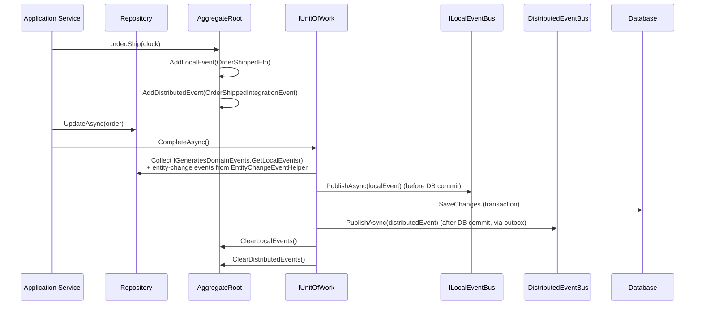

ABP supports two distinct flavors of domain events. **Local events** travel inside the same process via `ILocalEventBus` — useful for cross-aggregate reactions, projection rebuilds, and cache invalidation. **Distributed events** travel over `IDistributedEventBus` (RabbitMQ, Kafka, etc.) to other bounded contexts. Aggregate roots collect both kinds *during* the unit of work and the framework publishes them at the right moments around `SaveChangesAsync`. This page walks through every API involved.

## Aggregate-root API

Every class deriving from `BasicAggregateRoot` (so also `AggregateRoot`, `FullAuditedAggregateRoot`, …) exposes four public observers and two protected mutators:

```csharp framework/src/Volo.Abp.Ddd.Domain/Volo/Abp/Domain/Entities/BasicAggregateRoot.cs
[Serializable]
public abstract class BasicAggregateRoot : Entity, IAggregateRoot, IGeneratesDomainEvents
{
    private readonly ICollection<DomainEventRecord> _distributedEvents = new Collection<DomainEventRecord>();
    private readonly ICollection<DomainEventRecord> _localEvents = new Collection<DomainEventRecord>();

    public virtual IEnumerable<DomainEventRecord> GetLocalEvents() => _localEvents;
    public virtual IEnumerable<DomainEventRecord> GetDistributedEvents() => _distributedEvents;

    public virtual void ClearLocalEvents() => _localEvents.Clear();
    public virtual void ClearDistributedEvents() => _distributedEvents.Clear();

    protected virtual void AddLocalEvent(object eventData)
        => _localEvents.Add(new DomainEventRecord(eventData, EventOrderGenerator.GetNext()));

    protected virtual void AddDistributedEvent(object eventData)
        => _distributedEvents.Add(new DomainEventRecord(eventData, EventOrderGenerator.GetNext()));
}
```

| Member | Visibility | Purpose |
| --- | --- | --- |
| `AddLocalEvent(object)` | `protected virtual` | Append to the in-process queue. |
| `AddDistributedEvent(object)` | `protected virtual` | Append to the cross-process queue. |
| `GetLocalEvents()` | `public virtual` | Iterate currently buffered local events. |
| `GetDistributedEvents()` | `public virtual` | Iterate currently buffered distributed events. |
| `ClearLocalEvents()` | `public virtual` | Reset the local buffer (called after publication). |
| `ClearDistributedEvents()` | `public virtual` | Reset the distributed buffer. |

The contract is captured by `IGeneratesDomainEvents`:

```csharp framework/src/Volo.Abp.Ddd.Domain/Volo/Abp/Domain/Entities/IGeneratesDomainEvents.cs
public interface IGeneratesDomainEvents
{
    IEnumerable<DomainEventRecord> GetLocalEvents();
    IEnumerable<DomainEventRecord> GetDistributedEvents();
    void ClearLocalEvents();
    void ClearDistributedEvents();
}
```

### `DomainEventRecord`

```csharp framework/src/Volo.Abp.Ddd.Domain/Volo/Abp/Domain/Entities/DomainEventRecord.cs
public class DomainEventRecord
{
    public object EventData { get; }
    public long EventOrder { get; }

    public DomainEventRecord(object eventData, long eventOrder)
    {
        EventData = eventData;
        EventOrder = eventOrder;
    }
}
```

`EventOrder` is assigned by `EventOrderGenerator.GetNext()` (a process-wide `Interlocked.Increment` counter in `Volo.Abp.EventBus`). It ensures the unit-of-work can replay events in the exact order they were emitted, even when they come from multiple aggregates updated in the same transaction.

### Typical use inside an aggregate

```csharp
public class Order : FullAuditedAggregateRoot<Guid>
{
    public OrderState State { get; private set; }

    public void Ship(IClock clock)
    {
        if (State != OrderState.Paid)
            throw new BusinessException("Order:CannotShip", "Order must be paid first.");

        State = OrderState.Shipped;

        AddLocalEvent(new OrderShippedEto(Id, clock.Now));        // in-process subscribers
        AddDistributedEvent(new OrderShippedIntegrationEvent(Id)); // outbox + bus
    }
}
```

`AddLocalEvent` should typically carry the *full domain payload*. `AddDistributedEvent` should carry the **integration-event** (ETO) payload — small, serialization-friendly, no behavior.

## Built-in entity change events

You don't normally call `AddLocalEvent` for the generic *created / updated / deleted* notifications — ABP raises them automatically. They live in `Entities/Events/`:

```csharp framework/src/Volo.Abp.Ddd.Domain/Volo/Abp/Domain/Entities/Events/EntityEventData.cs
[Serializable]
public class EntityEventData<TEntity> : IEventDataWithInheritableGenericArgument, IEventDataMayHaveTenantId
{
    public TEntity Entity { get; }
    public EntityEventData(TEntity entity) { Entity = entity; }
    public virtual object[] GetConstructorArgs() => new object[] { Entity! };

    public virtual bool IsMultiTenant(out Guid? tenantId)
    {
        if (Entity is IMultiTenant multiTenantEntity) { tenantId = multiTenantEntity.TenantId; return true; }
        tenantId = null; return false;
    }
}
```

The three concrete events all extend `EntityChangedEventData<TEntity>`:

| Event | File | Triggered |
| --- | --- | --- |
| `EntityCreatedEventData<TEntity>` | `Events/EntityCreatedEventData.cs` | After `InsertAsync` is committed. |
| `EntityUpdatedEventData<TEntity>` | `Events/EntityUpdatedEventData.cs` | After `UpdateAsync` is committed. |
| `EntityDeletedEventData<TEntity>` | `Events/EntityDeletedEventData.cs` | After `DeleteAsync` is committed (or after soft-delete flag is set). |

Their distributed counterparts live in `Volo.Abp.Ddd.Domain.Shared`:

```csharp framework/src/Volo.Abp.Ddd.Domain.Shared/Volo/Abp/Domain/Entities/Events/Distributed/EntityCreatedEto.cs
[Serializable]
[GenericEventName(Postfix = ".Created")]
public class EntityCreatedEto<TEntityEto> : IEventDataMayHaveTenantId { /* ... */ }
```

Three classes: `EntityCreatedEto`, `EntityUpdatedEto`, `EntityDeletedEto` — see [Domain Shared](/framework/ddd/domain-shared) for the full source.

## `EntityChangeEventHelper`

The framework's *publisher* for the generic events is `EntityChangeEventHelper`:

```csharp framework/src/Volo.Abp.Ddd.Domain/Volo/Abp/Domain/Entities/Events/EntityChangeEventHelper.cs
public class EntityChangeEventHelper : IEntityChangeEventHelper, ITransientDependency
{
    private const string UnitOfWorkEventRecordEntityPropName = "_Abp_Entity";

    public ILocalEventBus LocalEventBus { get; set; }
    public IDistributedEventBus DistributedEventBus { get; set; }

    protected IUnitOfWorkManager UnitOfWorkManager { get; }
    protected IEntityToEtoMapper EntityToEtoMapper { get; }
    protected AbpDistributedEntityEventOptions DistributedEntityEventOptions { get; }

    public virtual void PublishEntityCreatedEvent(object entity)
    {
        TriggerEventWithEntity(LocalEventBus, typeof(EntityCreatedEventData<>), entity, entity);

        if (ShouldPublishDistributedEventForEntity(entity))
        {
            var eto = EntityToEtoMapper.Map(entity);
            if (eto != null)
                TriggerEventWithEntity(DistributedEventBus, typeof(EntityCreatedEto<>), eto, entity);
        }
    }
}
```

Key contract points:

- It accepts `object` so the database-provider code (EF Core's `ChangeTracker` interceptor, MongoDB's command handler) can hand it raw entries.
- It looks up an `AbpDistributedEntityEventOptions.AutoEventSelectors` match before generating distributed events — this is how the application opts certain entities in or out of the bus.
- It uses `EntityToEtoMapper` to convert the entity into its ETO and publishes the typed `EntityCreatedEto<TEto>`.

`ShouldPublishDistributedEventForEntity` checks the selector list:

```csharp framework/src/Volo.Abp.Ddd.Domain/Volo/Abp/Domain/Entities/Events/EntityChangeEventHelper.cs
private bool ShouldPublishDistributedEventForEntity(object entity)
{
    return DistributedEntityEventOptions
        .AutoEventSelectors
        .IsMatch(ProxyHelper.UnProxy(entity).GetType());
}
```

`ProxyHelper.UnProxy` ensures the lookup uses the concrete CLR type, not the proxy that EF Core may have produced.

## Configuring distributed entity events

Inside any module:

```csharp
public override void ConfigureServices(ServiceConfigurationContext context)
{
    Configure<AbpDistributedEntityEventOptions>(options =>
    {
        // Map domain entity -> integration ETO
        options.EtoMappings.Add<Tenant, TenantEto>();

        // Opt this aggregate in to the auto-publish list
        options.AutoEventSelectors.Add<Tenant>();
    });
}
```

The two collections come from `AbpDistributedEntityEventOptions` (in `Volo.Abp.Ddd.Domain.Shared`):

```csharp framework/src/Volo.Abp.Ddd.Domain.Shared/Volo/Abp/Domain/Entities/Events/Distributed/AbpDistributedEntityEventOptions.cs
public class AbpDistributedEntityEventOptions
{
    public IAutoEntityDistributedEventSelectorList AutoEventSelectors { get; }
    public EtoMappingDictionary EtoMappings { get; set; }
}
```

## `EntityEventReport` and `DomainEventEntry`

When the EF Core / Mongo provider scans the change-tracker at SaveChanges time it produces an `EntityEventReport`:

```csharp framework/src/Volo.Abp.Ddd.Domain/Volo/Abp/Domain/Entities/Events/EntityEventReport.cs
public class EntityEventReport
{
    public List<DomainEventEntry> DomainEvents { get; }
    public List<DomainEventEntry> DistributedEvents { get; }

    public EntityEventReport()
    {
        DomainEvents = new List<DomainEventEntry>();
        DistributedEvents = new List<DomainEventEntry>();
    }
}
```

Each `DomainEventEntry` keeps a back-reference to the source aggregate plus the event payload and order:

```csharp framework/src/Volo.Abp.Ddd.Domain/Volo/Abp/Domain/Entities/Events/DomainEventEntry.cs
public class DomainEventEntry
{
    public object SourceEntity { get; }
    public object EventData { get; }
    public long EventOrder { get; }
}
```

The provider then hands the report to the unit of work, which is responsible for ordering and publication.

## Publication flow



The exact timing differences:

- **Local events** are published **before** the database transaction commits, so a local subscriber can mutate other aggregates and have its changes saved in the same transaction.
- **Distributed events** are sent **after** commit, typically via the [Outbox/Inbox](/flows/event-publication) machinery in `Volo.Abp.EventBus.Distributed`, to guarantee at-least-once delivery without polluting the local transaction with a remote broker call.
- After publication, `ClearLocalEvents` and `ClearDistributedEvents` reset the aggregate's buffers so any subsequent re-save in the same scope does not re-publish.

## Subscribing to events

A handler is a transient class implementing `ILocalEventHandler<T>` or `IDistributedEventHandler<T>` (defined in `Volo.Abp.EventBus`):

```csharp
public class WarehouseProjector :
    ILocalEventHandler<EntityCreatedEventData<Order>>,
    ITransientDependency
{
    public Task HandleEventAsync(EntityCreatedEventData<Order> eventData)
    {
        // eventData.Entity is the Order aggregate
        return Task.CompletedTask;
    }
}
```

Handlers are discovered by the event bus modules during DI registration — see [Event publication](/flows/event-publication).

## Putting it all together

<CardGroup cols={2}>
<Card title="Local events" icon="bolt">
Fired inside the process; participate in the same UoW transaction; the right tool for projections and intra-context reactions.
</Card>
<Card title="Distributed events" icon="globe">
Travel on `IDistributedEventBus`; payload is an ETO; used for inter-module / inter-microservice integration.
</Card>
<Card title="Generic CRUD events" icon="rotate">
Auto-emitted by `EntityChangeEventHelper`; subscribe to `EntityCreated/Updated/Deleted EventData<T>` for any aggregate.
</Card>
<Card title="ETO mapping" icon="diagram-project">
Configure `AbpDistributedEntityEventOptions.EtoMappings` + `AutoEventSelectors` to opt entities into distributed publication.
</Card>
</CardGroup>

## See also

<CardGroup cols={2}>
<Card title="Domain Shared" href="/framework/ddd/domain-shared">
The package that holds the ETOs and distributed-event options.
</Card>
<Card title="Event publication flow" href="/flows/event-publication">
End-to-end trace from `AddLocalEvent` through the outbox to a downstream service.
</Card>
<Card title="Unit of work" href="/framework/data/uow">
Where the event-publishing hook lives.
</Card>
<Card title="Entities & Aggregates" href="/framework/ddd/entities-and-aggregates">
The base classes that expose `AddLocalEvent` and `AddDistributedEvent`.
</Card>
</CardGroup>
