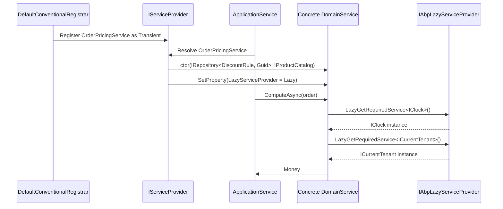

A **domain service** in ABP is a stateless operation that does not belong to a single entity or aggregate root but still expresses domain logic. Canonical examples in the framework's own modules are `IdentityUserManager`, `PermissionManager`, `TenantManager`. They orchestrate multiple aggregates, enforce invariants that span an entire bounded context, or call other domain services. ABP's contribution is a tiny convention surface — one marker interface and one abstract base class — that wires every cross-cutting service you usually need.

This page covers everything in `framework/src/Volo.Abp.Ddd.Domain/Volo/Abp/Domain/Services/`.

## Files in the namespace

| File | Type | Role |
| --- | --- | --- |
| `IDomainService.cs` | Marker interface inheriting `ITransientDependency`. | Tags a class as a domain service for conventional registration. |
| `DomainService.cs` | Abstract base class. | Property-injected services + lazy-resolved cross-cutting dependencies. |

## `IDomainService` — the marker

```csharp framework/src/Volo.Abp.Ddd.Domain/Volo/Abp/Domain/Services/IDomainService.cs
using Volo.Abp.DependencyInjection;

namespace Volo.Abp.Domain.Services;

public interface IDomainService : ITransientDependency
{
}
```

Two observations:

1. The interface is empty — it exists solely to be a marker for `DefaultConventionalRegistrar`.
2. Because it derives from `ITransientDependency`, every concrete domain service is automatically registered in the DI container as **transient** by the conventional registrar — no `[Dependency]` attribute or manual `services.AddTransient<…>` call is needed.

When you write `public class OrderPricingService : DomainService, IDomainService { ... }`, ABP exposes it under `OrderPricingService` (and any interfaces it directly implements). A subclass of `DomainService` is *already* an `IDomainService` because `DomainService : IDomainService` (see below) — adding the interface to your subclass is optional but convention.

## `DomainService` — the base class

```csharp framework/src/Volo.Abp.Ddd.Domain/Volo/Abp/Domain/Services/DomainService.cs
public abstract class DomainService : IDomainService
{
    public IAbpLazyServiceProvider LazyServiceProvider { get; set; } = default!;

    [Obsolete("Use LazyServiceProvider instead.")]
    public IServiceProvider ServiceProvider { get; set; } = default!;

    protected IClock Clock
        => LazyServiceProvider.LazyGetRequiredService<IClock>();

    protected IGuidGenerator GuidGenerator
        => LazyServiceProvider.LazyGetService<IGuidGenerator>(SimpleGuidGenerator.Instance);

    protected ILoggerFactory LoggerFactory
        => LazyServiceProvider.LazyGetRequiredService<ILoggerFactory>();

    protected ICurrentTenant CurrentTenant
        => LazyServiceProvider.LazyGetRequiredService<ICurrentTenant>();

    protected IAsyncQueryableExecuter AsyncExecuter
        => LazyServiceProvider.LazyGetRequiredService<IAsyncQueryableExecuter>();

    protected ILogger Logger
        => LazyServiceProvider.LazyGetService<ILogger>(provider
            => LoggerFactory?.CreateLogger(GetType().FullName!) ?? NullLogger.Instance);
}
```

Every concrete domain service in the framework — `PermissionGrantRepository`, `RoleManager`, `IdentityUserManager`, and so on — inherits from this and gets these services *for free*.

### Why property injection?

ABP picks **property injection through `IAbpLazyServiceProvider`** instead of constructor injection on purpose:

- A `DomainService` subclass can be constructor-injected by its *consumers* without having to forward the entire cross-cutting bag (clock, GUID generator, current tenant, ...) up the chain.
- Resolution is **lazy**: a domain service that never logs never pays the cost of resolving `ILoggerFactory`.
- Subclasses keep their own constructors clean — typically they only constructor-inject the **repositories** and **other domain services** they collaborate with.

### Available cross-cutting services

| Property | Type | Resolution strategy |
| --- | --- | --- |
| `LazyServiceProvider` | `IAbpLazyServiceProvider` | Property-injected by the framework's resolver. |
| `ServiceProvider` | `IServiceProvider` | Obsolete — kept for backwards compatibility. |
| `Clock` | `IClock` | `LazyGetRequiredService` — throws if not registered. |
| `GuidGenerator` | `IGuidGenerator` | Falls back to `SimpleGuidGenerator.Instance` when not registered. |
| `LoggerFactory` | `ILoggerFactory` | Required. |
| `CurrentTenant` | `ICurrentTenant` | Required. |
| `AsyncExecuter` | `IAsyncQueryableExecuter` | Required. |
| `Logger` | `ILogger` | Built on first access via `LoggerFactory.CreateLogger(GetType().FullName)`; falls back to `NullLogger.Instance`. |

### `IClock` and the time abstraction

`Clock` is the framework-wide way to get *the current point in time*. It returns `DateTime` values that:

- Respect the configured `AbpClockOptions.Kind` (Utc or Unspecified).
- Can be substituted in tests (replace `IClock` with a fixed-time implementation).

Inside a domain service, **always** use `Clock.Now` rather than `DateTime.UtcNow`. The auditing pipeline also reads from `IClock`, so consistent use guarantees correctness of `CreationTime`, `LastModificationTime`, and `DeletionTime`.

### `ICurrentTenant`

`ICurrentTenant.Id` is the ambient tenant identifier. Domain services typically use it to:

- Verify cross-tenant invariants.
- Switch tenant context with `using (CurrentTenant.Change(otherTenantId)) { ... }` to operate on another tenant's data.

### `AsyncExecuter` and LINQ-async

`IAsyncQueryableExecuter` lets a domain service write provider-agnostic LINQ:

```csharp
public async Task<bool> HasMultipleAdminsAsync()
{
    var query = (await _userRepository.GetQueryableAsync())
        .Where(u => u.Roles.Any(r => r.RoleName == "admin"));
    return await AsyncExecuter.CountAsync(query) > 1;
}
```

This compiles equally well against EF Core, MongoDB, or an in-memory list — the executer is the LINQ shim documented under [Data & Unit of Work](/framework/data/uow).

## Typical subclass pattern

A real domain service (paraphrased shape):

```csharp
public class OrderPricingService : DomainService
{
    private readonly IRepository<DiscountRule, Guid> _discountRules;
    private readonly IProductCatalog _catalog;

    public OrderPricingService(
        IRepository<DiscountRule, Guid> discountRules,
        IProductCatalog catalog)
    {
        _discountRules = discountRules;
        _catalog = catalog;
    }

    public virtual async Task<Money> ComputeAsync(Order order)
    {
        Logger.LogInformation("Pricing order {OrderId} at {Now:o}", order.Id, Clock.Now);

        var rules = await _discountRules.GetListAsync(
            r => r.TenantId == CurrentTenant.Id || r.TenantId == null);

        var subtotal = await ComputeSubtotalAsync(order);
        return ApplyRules(subtotal, rules);
    }
}
```

Things to notice:

- **Constructor injection** is reserved for collaborators specific to this service (the discount-rule repository, the product catalog).
- **Property injection** provides `Logger`, `Clock`, `CurrentTenant` — they appear "out of thin air" because `DomainService` declared them.
- The method is `virtual`, allowing test doubles and ABP's dynamic-proxy interception (e.g. unit-of-work, exception-handling aspects) to wrap it.

## Lifecycle and DI flow



## When to use a domain service

<CardGroup cols={2}>
<Card title="Cross-aggregate invariants" icon="link">
Logic that updates two aggregates atomically — for example, transferring stock between warehouses where neither warehouse "owns" the operation.
</Card>
<Card title="Pure computation requiring infra" icon="calculator">
Computations that need infrastructure (IClock, IGuidGenerator, a repository for reference data) but no aggregate state.
</Card>
<Card title="Encapsulating policy" icon="shield">
A `PasswordPolicy`, `PricingPolicy`, `ReservationPolicy` — testable in isolation.
</Card>
<Card title="Avoid for app-level orchestration" icon="ban">
If the operation involves DTOs, authorization, or transactional boundaries, it belongs in an **application service** instead. See the [Application Services](/framework/ddd/application-services) page.
</Card>
</CardGroup>

## Patterns layered on top

Although the framework ships only `IDomainService` and `DomainService`, ABP solution templates and the commercial modules add a sibling abstraction:

- **`DomainService<TEntity>` / `AggregateManager<TEntity, TKey>`** — generic helpers that take the aggregate's repository in the constructor and expose `CreateAsync` / `UpdateAsync` / `DeleteAsync` on top. They are application-level conventions; the framework leaves these to your domain assembly.

## See also

<CardGroup cols={2}>
<Card title="Application services" href="/framework/ddd/application-services">
The orchestration layer that calls domain services.
</Card>
<Card title="Repositories" href="/framework/ddd/repositories">
The primary collaborator of a domain service.
</Card>
<Card title="Dependency injection" href="/framework/core/dependency-injection">
How conventional registrars discover and register `ITransientDependency` types.
</Card>
<Card title="LazyServiceProvider" href="/framework/core/dependency-injection">
The mechanism behind property injection used by `DomainService`.
</Card>
</CardGroup>
