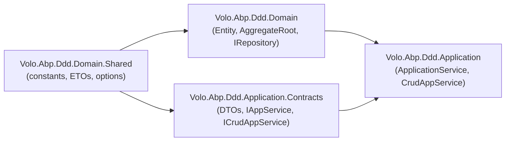

`Volo.Abp.Ddd.Domain.Shared` is the *thinnest* of the four DDD packages shipped by ABP. It exists so that **types which both the Domain layer and the Application.Contracts layer must reference** can live in a single low-dependency assembly — preventing the Application.Contracts package from having to take a project reference on the much heavier `Volo.Abp.Ddd.Domain` package. In practice, every ABP solution template (`templates/app/aspnet-core/src/MyCompanyName.MyProjectName.Domain.Shared`) inherits from this assembly to expose tenant-wide enums, localization resources, error codes, and entity ETOs that flow on the distributed event bus.

This page is a complete inventory of what the framework ships inside the package and an explanation of why each file lives here rather than in `Volo.Abp.Ddd.Domain`.

## Package layout

The whole package sits under `framework/src/Volo.Abp.Ddd.Domain.Shared/`. The csproj is intentionally minimal:

```xml framework/src/Volo.Abp.Ddd.Domain.Shared/Volo.Abp.Ddd.Domain.Shared.csproj
<Project Sdk="Microsoft.NET.Sdk">
  <Import Project="..\..\..\configureawait.props" />
  <Import Project="..\..\..\common.props" />
  <PropertyGroup>
    <TargetFrameworks>netstandard2.0;netstandard2.1;net7.0</TargetFrameworks>
    <Nullable>enable</Nullable>
  </PropertyGroup>
</Project>
```

Notice it has **no `<ItemGroup><ProjectReference>` declarations** apart from common props. The only runtime dependencies come transitively through the module's `[DependsOn]` graph.

## The module declaration

```csharp framework/src/Volo.Abp.Ddd.Domain.Shared/Volo/Abp/Domain/AbpDddDomainSharedModule.cs
[DependsOn(
    typeof(AbpMultiTenancyAbstractionsModule),
    typeof(AbpEventBusAbstractionsModule)
)]
public class AbpDddDomainSharedModule : AbpModule
{
}
```

Two telling dependencies:

- `AbpMultiTenancyAbstractionsModule` — the ETOs implement `IEventDataMayHaveTenantId` and need `IMultiTenant`.
- `AbpEventBusAbstractionsModule` — `[GenericEventName]` is defined there and used on the ETO classes.

That's the entire surface: the package gives every project access to **multi-tenant aware Entity Transfer Objects** without forcing them to drag in the full domain layer.

## File inventory

<CardGroup cols={2}>
<Card title="Module" icon="cube">
- `Volo/Abp/Domain/AbpDddDomainSharedModule.cs`
</Card>
<Card title="Distributed entity event options" icon="sliders">
- `Volo/Abp/Domain/Entities/Events/Distributed/AbpDistributedEntityEventOptions.cs`
- `Volo/Abp/Domain/Entities/Events/Distributed/AutoEntityDistributedEventSelectorList.cs`
- `Volo/Abp/Domain/Entities/Events/Distributed/IAutoEntityDistributedEventSelectorList.cs`
- `Volo/Abp/Domain/Entities/Events/Distributed/EtoMappingDictionary.cs`
- `Volo/Abp/Domain/Entities/Events/Distributed/EtoMappingDictionaryItem.cs`
</Card>
<Card title="Entity Transfer Objects" icon="envelope">
- `Volo/Abp/Domain/Entities/Events/Distributed/EntityEto.cs`
- `Volo/Abp/Domain/Entities/Events/Distributed/IEntityEto.cs`
- `Volo/Abp/Domain/Entities/Events/Distributed/EntityCreatedEto.cs`
- `Volo/Abp/Domain/Entities/Events/Distributed/EntityUpdatedEto.cs`
- `Volo/Abp/Domain/Entities/Events/Distributed/EntityDeletedEto.cs`
</Card>
<Card title="ETO mapping abstraction" icon="arrows-rotate">
- `Volo/Abp/Domain/Entities/Events/Distributed/IEntityToEtoMapper.cs`
</Card>
</CardGroup>

### Module + options

| Type | Purpose |
| --- | --- |
| `AbpDddDomainSharedModule` | The `AbpModule` host. Pulls in multi-tenancy + event-bus abstractions. |
| `AbpDistributedEntityEventOptions` | The options bag attached via `Configure<AbpDistributedEntityEventOptions>()` in any module. Exposes `AutoEventSelectors` and `EtoMappings`. |
| `IAutoEntityDistributedEventSelectorList` / `AutoEntityDistributedEventSelectorList` | A `List<NamedTypeSelector>` used by `EntityChangeEventHelper` to decide whether to publish a distributed event for a given entity type. |
| `EtoMappingDictionary` / `EtoMappingDictionaryItem` | A `Dictionary<Type, EtoMappingDictionaryItem>` mapping entity CLR types to their ETO CLR types and an optional `ObjectMapperContext`. |

The options bag is constructed lazily:

```csharp framework/src/Volo.Abp.Ddd.Domain.Shared/Volo/Abp/Domain/Entities/Events/Distributed/AbpDistributedEntityEventOptions.cs
public class AbpDistributedEntityEventOptions
{
    public IAutoEntityDistributedEventSelectorList AutoEventSelectors { get; }
    public EtoMappingDictionary EtoMappings { get; set; }

    public AbpDistributedEntityEventOptions()
    {
        AutoEventSelectors = new AutoEntityDistributedEventSelectorList();
        EtoMappings = new EtoMappingDictionary();
    }
}
```

`EtoMappings.Add<TEntity, TEntityEto>()` registers the dictionary entry consumed by `EntityToEtoMapper` (in `Volo.Abp.Ddd.Domain`).

### Entity Transfer Objects (ETOs)

ETOs are the **serializable** counterparts of domain entities. They cross process boundaries on the distributed event bus and never carry behavior, only data. They are defined here — and not in `Volo.Abp.Ddd.Domain` — because consumers (handler modules, integration services, microservices) usually consume the ETO without taking a dependency on the publisher's domain assembly.

| Type | Generic signature | Notes |
| --- | --- | --- |
| `EntityEto` | non-generic | Carries `EntityType` (FQN) and `KeysAsString` for opaque, late-bound references. |
| `EntityEto<TKey>` | abstract | Strongly-typed `Id` property; base for typed ETOs. |
| `IEntityEto<TKey>` | interface | The `TKey Id { get; set; }` contract. |
| `EntityCreatedEto<TEntityEto>` | `[GenericEventName(Postfix = ".Created")]` | Implements `IEventDataMayHaveTenantId` (propagates `TenantId` from `IMultiTenant`). |
| `EntityUpdatedEto<TEntityEto>` | `[GenericEventName(Postfix = ".Updated")]` | Same. |
| `EntityDeletedEto<TEntityEto>` | `[GenericEventName(Postfix = ".Deleted")]` | Same. |

The created/updated/deleted ETOs share an identical shape:

```csharp framework/src/Volo.Abp.Ddd.Domain.Shared/Volo/Abp/Domain/Entities/Events/Distributed/EntityCreatedEto.cs
[Serializable]
[GenericEventName(Postfix = ".Created")]
public class EntityCreatedEto<TEntityEto> : IEventDataMayHaveTenantId
{
    public TEntityEto Entity { get; set; }

    public EntityCreatedEto(TEntityEto entity) { Entity = entity; }

    public virtual bool IsMultiTenant(out Guid? tenantId)
    {
        if (Entity is IMultiTenant multiTenantEntity)
        {
            tenantId = multiTenantEntity.TenantId;
            return true;
        }
        tenantId = null;
        return false;
    }
}
```

`[GenericEventName(Postfix = ".Created")]` controls the wire-level event name generated by `IEventNameProvider`; e.g. `EntityCreatedEto<TenantEto>` becomes `tenant.created` on the bus.

### `IEntityToEtoMapper`

```csharp framework/src/Volo.Abp.Ddd.Domain.Shared/Volo/Abp/Domain/Entities/Events/Distributed/IEntityToEtoMapper.cs
public interface IEntityToEtoMapper
{
    object? Map(object entityObj);
}
```

The interface is declared here so that any module — even ones that do not depend on `Volo.Abp.Ddd.Domain` — can resolve an entity-to-ETO mapper without taking a heavier dependency. The default implementation, `EntityToEtoMapper`, lives in `Volo.Abp.Ddd.Domain` and uses `AbpDistributedEntityEventOptions.EtoMappings` to look up the `Type` to map to.

## Why this tier exists

The four-tier reference graph that motivates `Domain.Shared` looks like this:



A solution-template `Domain.Shared` project typically contains:

- Enums (`UserStatus`, `OrderState`) used in both the entity and the DTO.
- Constants (`MaxLength` values used by both the entity column and the DTO `[StringLength]` attribute).
- Localization resources whose strings are thrown as `BusinessException`s from the domain and re-displayed by the UI through the application contracts.
- ETOs that travel on the distributed event bus and are consumed by other bounded contexts.

Without this package, the *Contracts* side would have to depend on the *Domain* side, defeating the layer separation and dragging EF Core / Repository symbols into every API surface.

## Where this package is referenced

The framework's own consumers:

- `Volo.Abp.Ddd.Domain.csproj` → references `Volo.Abp.Ddd.Domain.Shared.csproj` (transitively through its `[DependsOn(typeof(AbpDddDomainSharedModule))]`).
- `Volo.Abp.Ddd.Application.Contracts.csproj` → consumers of contracts import the shared types from here.
- Solution templates pull it in via `MyProject.Domain.Shared`, the bottom-most project in the dependency graph.

## Related pages

<CardGroup cols={2}>
<Card title="Domain package" href="/framework/ddd/domain">
The next tier up — entities, repositories, domain services.
</Card>
<Card title="Domain events" href="/framework/ddd/domain-events">
How `EntityCreatedEto` / `EntityUpdatedEto` / `EntityDeletedEto` are dispatched.
</Card>
<Card title="Application contracts" href="/framework/ddd/application-contracts">
The other consumer of Domain.Shared — DTOs and service interfaces.
</Card>
<Card title="Event bus" href="/flows/event-publication">
End-to-end flow of how an aggregate's distributed event reaches another microservice.
</Card>
</CardGroup>
