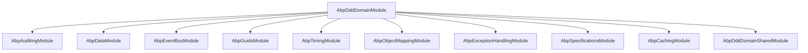

`Volo.Abp.Ddd.Domain` is the package that turns ABP's bootstrap and DI infrastructure into a **DDD framework**. It declares the building-block contracts (`IEntity`, `IAggregateRoot`, `IRepository`, `IDomainService`, `ValueObject`) and their default base classes, plus an `AbpRepositoryConventionalRegistrar` that automatically wires every concrete repository it finds into the container as a transient service exposed by its interfaces. Every domain assembly in an ABP solution — `MyProject.Domain`, `Volo.Abp.Identity.Domain`, `Volo.Abp.PermissionManagement.Domain`, etc. — depends on this package directly.

This page is a tour of the package's directory tree and links to the per-feature deep-dives.

## Package coordinates

```xml framework/src/Volo.Abp.Ddd.Domain/Volo.Abp.Ddd.Domain.csproj
<TargetFrameworks>netstandard2.0;netstandard2.1;net7.0</TargetFrameworks>
<AssemblyName>Volo.Abp.Ddd.Domain</AssemblyName>
<PackageId>Volo.Abp.Ddd.Domain</PackageId>
```

The csproj is on disk at `framework/src/Volo.Abp.Ddd.Domain/Volo.Abp.Ddd.Domain.csproj` and source code lives under `framework/src/Volo.Abp.Ddd.Domain/Volo/Abp/`.

## The module

```csharp framework/src/Volo.Abp.Ddd.Domain/Volo/Abp/Domain/AbpDddDomainModule.cs
[DependsOn(
    typeof(AbpAuditingModule),
    typeof(AbpDataModule),
    typeof(AbpEventBusModule),
    typeof(AbpGuidsModule),
    typeof(AbpTimingModule),
    typeof(AbpObjectMappingModule),
    typeof(AbpExceptionHandlingModule),
    typeof(AbpSpecificationsModule),
    typeof(AbpCachingModule),
    typeof(AbpDddDomainSharedModule)
)]
public class AbpDddDomainModule : AbpModule
{
    public override void PreConfigureServices(ServiceConfigurationContext context)
    {
        context.Services.AddConventionalRegistrar(new AbpRepositoryConventionalRegistrar());
    }
}
```

Two important effects:

1. The `[DependsOn]` graph pulls in every cross-cutting concern the domain layer needs (auditing, eventing, GUID generation, timing, caching, exception handling, specifications).
2. `PreConfigureServices` registers `AbpRepositoryConventionalRegistrar`. From that point on, *any* class that implements `IRepository` is automatically registered as a transient and exposed by all of its interfaces. See [Repositories](/framework/ddd/repositories) for details.

## Sub-namespace map

The package is organised by DDD concept. Each folder under `Volo/Abp/Domain` and its siblings is summarized below; click through to the deep-dive page for the full file inventory.

<CardGroup cols={2}>
<Card title="Entities" icon="cube" href="/framework/ddd/entities-and-aggregates">
`Volo/Abp/Domain/Entities/` — `Entity`, `Entity<TKey>`, `BasicAggregateRoot`, `AggregateRoot`, `IEntity`, `IAggregateRoot`, `IGeneratesDomainEvents`, `EntityHelper`, `DomainEventRecord`, `ConcurrencyStampConsts`, `DisableIdGenerationAttribute`.
</Card>
<Card title="Auditing variants" icon="clock-rotate-left" href="/framework/ddd/entities-and-aggregates">
`Volo/Abp/Domain/Entities/Auditing/` — `CreationAuditedEntity`, `AuditedEntity`, `FullAuditedEntity`, the aggregate-root counterparts, plus the `*WithUser` variants.
</Card>
<Card title="Repositories" icon="database" href="/framework/ddd/repositories">
`Volo/Abp/Domain/Repositories/` — `IRepository`, `IBasicRepository`, `IReadOnlyRepository`, `BasicRepositoryBase`, `RepositoryBase`, `AbpRepositoryConventionalRegistrar`, `RepositoryRegistrarBase`, `RepositoryAsyncExtensions`, `RepositoryExtensions`, `UnitOfWorkItemNames`, `ISupportsExplicitLoading`.
</Card>
<Card title="Services" icon="gears" href="/framework/ddd/domain-services">
`Volo/Abp/Domain/Services/` — `IDomainService` (a marker that extends `ITransientDependency`) and the `DomainService` base class with property-injected `IClock`, `IGuidGenerator`, `ICurrentTenant`, `IAsyncQueryableExecuter`, `ILoggerFactory`, and an `IAbpLazyServiceProvider`.
</Card>
<Card title="Values" icon="diamond" href="/framework/ddd/value-objects">
`Volo/Abp/Domain/Values/ValueObject.cs` — the abstract `ValueObject` with `GetAtomicValues`-based equality.
</Card>
<Card title="Events" icon="bolt" href="/framework/ddd/domain-events">
`Volo/Abp/Domain/Entities/Events/` (local) and `Volo/Abp/Domain/Entities/Events/Distributed/` (cross-process). `EntityChangeEventHelper`, `EntityEventReport`, `DomainEventEntry`, the `EntityCreatedEventData<>` / `EntityUpdatedEventData<>` / `EntityDeletedEventData<>` triplet.
</Card>
<Card title="Entity cache" icon="bolt-lightning">
`Volo/Abp/Domain/Entities/Caching/` — `EntityCacheBase`, `EntityCacheWithObjectMapper`, `EntityCacheWithoutCacheItem`, `IEntityCache`, plus the `AddEntityCache` extension on `IServiceCollection`. Used for entity-by-key caches in modules like Tenant Management.
</Card>
<Card title="Auditing helpers" icon="list-check">
`Volo/Abp/Auditing/EntityHistorySelectorListExtensions.cs` — adds a built-in `Abp.Entities.All` selector that matches every `IEntity` for the entity-history (audit log) feature.
</Card>
<Card title="DI helpers" icon="syringe">
`Volo/Abp/DependencyInjection/` — `AbpCommonDbContextRegistrationOptions`, `IAbpCommonDbContextRegistrationOptionsBuilder`, `MultiTenantDbContextType`, `ReplaceDbContextAttribute`. Consumed by the EF Core and MongoDB integrations to register repositories and replace tenant-specific DbContexts.
</Card>
</CardGroup>

## Microsoft.Extensions hooks

The package also adds a single `ServiceCollection` extension under the `Microsoft.Extensions.DependencyInjection` namespace:

```text framework/src/Volo.Abp.Ddd.Domain/Microsoft/Extensions/DependencyInjection/ServiceCollectionRepositoryExtensions.cs
public static IServiceCollection AddDefaultRepository(
    this IServiceCollection services,
    Type entityType,
    Type repositoryImplementationType,
    bool replaceExisting = false)
```

This is what every database-provider package (EF Core, MongoDB, Memory) uses inside its `RepositoryRegistrarBase<TOptions>.AddRepositories()` to bind concrete repositories to `IRepository<TEntity>` and `IRepository<TEntity, TKey>` at startup.

## Reference graph



Every solution module that wants to define entities or repositories takes a `[DependsOn(typeof(AbpDddDomainModule))]` and inherits the entire graph above.

## What the next pages cover

<CardGroup cols={2}>
<Card title="Entities & Aggregates" href="/framework/ddd/entities-and-aggregates">
Class hierarchy from `Entity` → `BasicAggregateRoot` → `AggregateRoot`, the auditing mixins, `EntityHelper`, key generation, multi-tenancy, and concurrency stamps.
</Card>
<Card title="Repositories" href="/framework/ddd/repositories">
The repository interface graph, base classes, conventional registrar, and the async extension surface.
</Card>
<Card title="Domain Services" href="/framework/ddd/domain-services">
The `DomainService` base, its property-injected dependencies, and patterns like the `AggregateManager`.
</Card>
<Card title="Value Objects" href="/framework/ddd/value-objects">
`ValueObject.GetAtomicValues` semantics and how to layer record-style value types on top.
</Card>
<Card title="Domain Events" href="/framework/ddd/domain-events">
`AddLocalEvent` / `AddDistributedEvent`, the `EntityChangeEventHelper`, and the UoW publication flow.
</Card>
<Card title="Specifications" href="/framework/ddd/specifications">
`ISpecification<T>`, `Specification<T>`, `And`/`Or`/`Not`, and how to feed them to a repository.
</Card>
</CardGroup>
