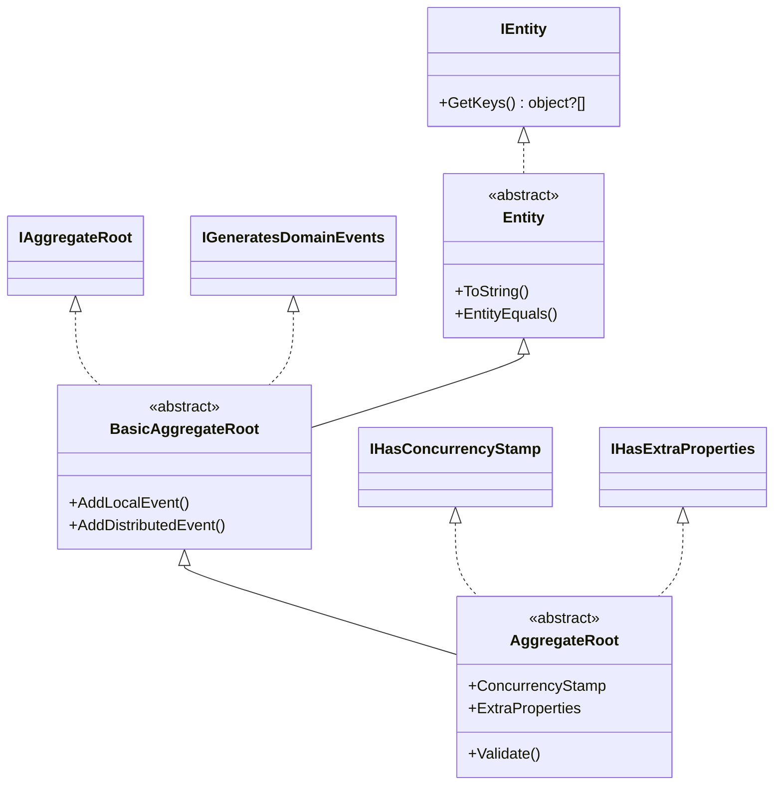
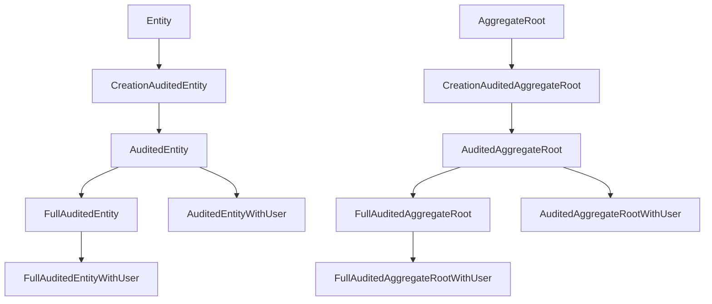

ABP draws a hard distinction between **entities** (objects with identity and a lifecycle) and **aggregate roots** (entities that own a consistency boundary and may raise domain events). The base classes for both live in `Volo.Abp.Ddd.Domain` under `Volo/Abp/Domain/Entities/`. This page enumerates each base class, the interfaces they implement, and the auditing variants in `Entities/Auditing/`, plus the cross-cutting helpers — `EntityHelper`, `DomainEventRecord`, `DisableIdGenerationAttribute`, and `ConcurrencyStampConsts` — that the framework uses to reason about them.

## Marker interfaces

ABP's identity model is interface-first. Every base class derives from one or more of:

| Interface | File | Purpose |
| --- | --- | --- |
| `IEntity` | `Entities/IEntity.cs` | Marker; exposes `object?[] GetKeys()` for composite keys. |
| `IEntity<TKey>` | `Entities/IEntity.cs` | Single-key entities; adds `TKey Id { get; }`. |
| `IAggregateRoot` | `Entities/IAggregateRoot.cs` | Marker that signals a consistency boundary; extends `IEntity`. |
| `IAggregateRoot<TKey>` | `Entities/IAggregateRoot.cs` | Same, with typed `Id`. |
| `IGeneratesDomainEvents` | `Entities/IGeneratesDomainEvents.cs` | Adds `GetLocalEvents`, `GetDistributedEvents`, and their `Clear*` counterparts. |
| `IHasConcurrencyStamp` | (in `Volo.Abp.Data`) | `string ConcurrencyStamp { get; set; }` — optimistic concurrency token. |
| `IHasExtraProperties` | (in `Volo.Abp.Data`) | `ExtraPropertyDictionary ExtraProperties { get; }` — the object-extending hook. |
| `ISoftDelete` | (in `Volo.Abp.Data`) | `bool IsDeleted { get; set; }` — soft-delete filter trigger. |

```csharp framework/src/Volo.Abp.Ddd.Domain/Volo/Abp/Domain/Entities/IEntity.cs
public interface IEntity
{
    object?[] GetKeys();
}

public interface IEntity<TKey> : IEntity
{
    TKey Id { get; }
}
```

```csharp framework/src/Volo.Abp.Ddd.Domain/Volo/Abp/Domain/Entities/IAggregateRoot.cs
public interface IAggregateRoot : IEntity { }
public interface IAggregateRoot<TKey> : IEntity<TKey>, IAggregateRoot { }
```

`IGeneratesDomainEvents` is the contract behind every `AddLocalEvent` / `AddDistributedEvent` call you see in domain code:

```csharp framework/src/Volo.Abp.Ddd.Domain/Volo/Abp/Domain/Entities/IGeneratesDomainEvents.cs
public interface IGeneratesDomainEvents
{
    IEnumerable<DomainEventRecord> GetLocalEvents();
    IEnumerable<DomainEventRecord> GetDistributedEvents();
    void ClearLocalEvents();
    void ClearDistributedEvents();
}
```

## `Entity` and `Entity<TKey>`

The non-aggregate base class:

```csharp framework/src/Volo.Abp.Ddd.Domain/Volo/Abp/Domain/Entities/Entity.cs
[Serializable]
public abstract class Entity : IEntity
{
    protected Entity()
    {
        EntityHelper.TrySetTenantId(this);
    }

    public override string ToString()
        => $"[ENTITY: {GetType().Name}] Keys = {GetKeys().JoinAsString(", ")}";

    public abstract object?[] GetKeys();

    public bool EntityEquals(IEntity other)
        => EntityHelper.EntityEquals(this, other);
}

[Serializable]
public abstract class Entity<TKey> : Entity, IEntity<TKey>
{
    public virtual TKey Id { get; protected set; } = default!;

    protected Entity() { }
    protected Entity(TKey id) { Id = id; }

    public override object?[] GetKeys() => new object?[] { Id };
    public override string ToString()
        => $"[ENTITY: {GetType().Name}] Id = {Id}";
}
```

A few things to notice:

- The default constructor calls `EntityHelper.TrySetTenantId(this)`. If your concrete entity implements `IMultiTenant`, the framework will automatically stamp `TenantId` from the ambient `ICurrentTenant`.
- The `Id` setter is `protected` — entities created by clients of the framework must funnel through constructors or factory methods.
- `GetKeys()` is the universal hook used by `EntityHelper.EntityEquals` and by repositories that need to address an entity by composite key.

## Aggregate roots: `BasicAggregateRoot` and `AggregateRoot`

There are two aggregate-root bases. **Use `BasicAggregateRoot` when you do not want extra properties or a concurrency stamp**; use `AggregateRoot` otherwise. Both implement the domain-event collector.

```csharp framework/src/Volo.Abp.Ddd.Domain/Volo/Abp/Domain/Entities/BasicAggregateRoot.cs
[Serializable]
public abstract class BasicAggregateRoot : Entity, IAggregateRoot, IGeneratesDomainEvents
{
    private readonly ICollection<DomainEventRecord> _distributedEvents = new Collection<DomainEventRecord>();
    private readonly ICollection<DomainEventRecord> _localEvents = new Collection<DomainEventRecord>();

    public virtual IEnumerable<DomainEventRecord> GetLocalEvents() => _localEvents;
    public virtual IEnumerable<DomainEventRecord> GetDistributedEvents() => _distributedEvents;
    public virtual void ClearLocalEvents() => _localEvents.Clear();
    public virtual void ClearDistributedEvents() => _distributedEvents.Clear();

    protected virtual void AddLocalEvent(object eventData)
        => _localEvents.Add(new DomainEventRecord(eventData, EventOrderGenerator.GetNext()));

    protected virtual void AddDistributedEvent(object eventData)
        => _distributedEvents.Add(new DomainEventRecord(eventData, EventOrderGenerator.GetNext()));
}
```

The local- and distributed-event collections are **separate** because they cross different boundaries: local events fire inside the same process before SaveChanges, distributed events flow over the message bus (RabbitMQ, Kafka, etc.) after the UoW commits. See [Domain events](/framework/ddd/domain-events) for the full publication flow.

`AggregateRoot` adds two cross-cutting concerns on top of `BasicAggregateRoot`:

```csharp framework/src/Volo.Abp.Ddd.Domain/Volo/Abp/Domain/Entities/AggregateRoot.cs
[Serializable]
public abstract class AggregateRoot : BasicAggregateRoot,
    IHasExtraProperties,
    IHasConcurrencyStamp
{
    public virtual ExtraPropertyDictionary ExtraProperties { get; protected set; }

    [DisableAuditing]
    public virtual string ConcurrencyStamp { get; set; }

    protected AggregateRoot()
    {
        ConcurrencyStamp = Guid.NewGuid().ToString("N");
        ExtraProperties = new ExtraPropertyDictionary();
        this.SetDefaultsForExtraProperties();
    }

    public virtual IEnumerable<ValidationResult> Validate(ValidationContext validationContext)
        => ExtensibleObjectValidator.GetValidationErrors(this, validationContext);
}
```

- `ConcurrencyStamp` is generated at construction time. Database providers (EF Core in particular) treat it as a `[ConcurrencyCheck]` column and refresh it on each save. The maximum length is fixed by `ConcurrencyStampConsts.MaxLength = 40`.
- `ExtraProperties` is the **object-extending** hook — modules can attach extra properties without modifying the entity schema. See `framework/data/object-extending` for the larger story.
- `Validate()` runs the data-annotation rules over both the strongly typed properties and the entries in `ExtraProperties`.

### Hierarchy at a glance



## Auditing variants

`Entities/Auditing/` ships eight base classes — four for entities, four for aggregate roots — that progressively add auditing properties. They derive from `IAuditedObject`, `IFullAuditedObject`, and `ICreationAuditedObject` (in `Volo.Abp.Auditing.Contracts`).

| Class | Adds | Use case |
| --- | --- | --- |
| `CreationAuditedEntity` | `CreationTime`, `CreatorId` | Inserts only. |
| `AuditedEntity` | `LastModificationTime`, `LastModifierId` (on top of CreationAudited) | Standard mutable entity. |
| `FullAuditedEntity` | `IsDeleted`, `DeleterId`, `DeletionTime` (on top of Audited) | Soft-deleted entity. |
| `CreationAuditedAggregateRoot` / `AuditedAggregateRoot` / `FullAuditedAggregateRoot` | Same triplet, but inherit from `AggregateRoot`. | Aggregate-root equivalents. |
| `*WithUser` variants | Add a navigation to a user (`CreatorId`, `LastModifierId`, `DeleterId`) | When you want EF Core to load the user navigation. |

Example — `FullAuditedAggregateRoot` is the most popular base class:

```csharp framework/src/Volo.Abp.Ddd.Domain/Volo/Abp/Domain/Entities/Auditing/FullAuditedAggregateRoot.cs
[Serializable]
public abstract class FullAuditedAggregateRoot<TKey> : AuditedAggregateRoot<TKey>, IFullAuditedObject
{
    public virtual bool IsDeleted { get; set; }
    public virtual Guid? DeleterId { get; set; }
    public virtual DateTime? DeletionTime { get; set; }

    protected FullAuditedAggregateRoot() { }
    protected FullAuditedAggregateRoot(TKey id) : base(id) { }
}
```

A real-world example from the Identity module:

```csharp framework/../modules/identity/src/Volo.Abp.Identity.Domain/Volo/Abp/Identity/IdentityUser.cs
public class IdentityUser : FullAuditedAggregateRoot<Guid>, IUser, IHasEntityVersion
{
    public virtual Guid? TenantId { get; protected set; }
    public virtual string UserName { get; protected internal set; }

    [DisableAuditing]
    public virtual string NormalizedUserName { get; protected internal set; }
    // ...
}
```

`IdentityUser` gets, for free: a `Guid Id`, the full auditing triplet, soft delete, extra properties, a concurrency stamp, the domain-event collectors, multi-tenant tenant-id stamping, and `IValidatableObject` integration. The `[DisableAuditing]` attribute on `NormalizedUserName` tells the auditing system to skip that column when computing entity diffs.

### Auditing class graph



## `EntityHelper`

`EntityHelper` is the static utility every part of the framework uses to reason about entities reflectively. The most important methods:

```csharp framework/src/Volo.Abp.Ddd.Domain/Volo/Abp/Domain/Entities/EntityHelper.cs
public static bool IsEntity(Type type)
    => typeof(IEntity).IsAssignableFrom(type);

public static bool IsValueObject(Type type)
    => IsValueObjectPredicate(type);

public static Type? FindPrimaryKeyType(Type entityType) { /* scans IEntity<> */ }

public static Expression<Func<TEntity, bool>> CreateEqualityExpressionForId<TEntity, TKey>(TKey id)
    where TEntity : IEntity<TKey>
{
    var lambdaParam = Expression.Parameter(typeof(TEntity));
    var leftExpression = Expression.PropertyOrField(lambdaParam, "Id");
    var idValue = Convert.ChangeType(id, typeof(TKey));
    Expression<Func<object?>> closure = () => idValue;
    var rightExpression = Expression.Convert(closure.Body, leftExpression.Type);
    var lambdaBody = Expression.Equal(leftExpression, rightExpression);
    return Expression.Lambda<Func<TEntity, bool>>(lambdaBody, lambdaParam);
}

public static void TrySetId<TKey>(
    IEntity<TKey> entity,
    Func<TKey> idFactory,
    bool checkForDisableIdGenerationAttribute = false)
    => ObjectHelper.TrySetProperty(entity, x => x.Id, idFactory,
        checkForDisableIdGenerationAttribute
            ? new[] { typeof(DisableIdGenerationAttribute) }
            : new Type[] { });

public static void TrySetTenantId(IEntity entity) { /* stamps TenantId from AsyncLocalCurrentTenantAccessor */ }
```

Highlights:

- `EntityEquals` implements ABP's identity equality rule: same runtime type (or one assignable to the other), matching `TenantId` if both are `IMultiTenant`, identical key arrays, and **transient entities are never considered equal to each other**.
- `HasDefaultId<TKey>` and `HasDefaultKeys` recognise the EF Core quirk where `int`/`long` keys get set to `MinValue` on attach.
- `CreateEqualityExpressionForId` is the expression `Repository.GetAsync(id)` translates to under the hood — it is what makes `GetAsync(Guid id)` translate to `e => e.Id == id` for any `TKey`.
- `TrySetId` will refuse to assign an `Id` if the property carries `DisableIdGenerationAttribute` — useful when you want the database (or the caller) to control identity generation.

## `DomainEventRecord`

A tiny value object that pairs an event payload with a monotonically increasing ordinal:

```csharp framework/src/Volo.Abp.Ddd.Domain/Volo/Abp/Domain/Entities/DomainEventRecord.cs
public class DomainEventRecord
{
    public object EventData { get; }
    public long EventOrder { get; }

    public DomainEventRecord(object eventData, long eventOrder)
    {
        EventData = eventData;
        EventOrder = eventOrder;
    }
}
```

The `EventOrder` (assigned by `EventOrderGenerator.GetNext()` inside `Volo.Abp.EventBus`) lets the UoW preserve event order even when events come from multiple aggregates.

## `DisableIdGenerationAttribute`

```csharp framework/src/Volo.Abp.Ddd.Domain/Volo/Abp/Domain/Entities/DisableIdGenerationAttribute.cs
public class DisableIdGenerationAttribute : Attribute { }
```

A zero-state marker. When applied on an entity's `Id` property, ABP's repository and `EntityHelper.TrySetId` will not generate a value before insert. The most common application is custom keys, deterministic IDs, or string IDs (e.g. tenant slugs).

## `ConcurrencyStampConsts`

```csharp framework/src/Volo.Abp.Ddd.Domain/Volo/Abp/Domain/Entities/ConcurrencyStampConsts.cs
public static class ConcurrencyStampConsts
{
    public const int MaxLength = 40;
}
```

Used by EF Core configuration code (e.g. `b.Property(x => x.ConcurrencyStamp).IsConcurrencyToken().HasMaxLength(ConcurrencyStampConsts.MaxLength);`) so the column matches the `Guid.NewGuid().ToString("N")` payload `AggregateRoot` generates.

## Picking the right base class

<CardGroup cols={2}>
<Card title="Use `Entity<TKey>`" icon="cube">
For child entities that live **inside** an aggregate boundary — `IdentityUserRole`, `OrderLine`, `PostTag`. They have identity but should not raise domain events themselves; the aggregate root does it.
</Card>
<Card title="Use `BasicAggregateRoot<TKey>`" icon="circle-nodes">
For aggregate roots that should not carry a concurrency stamp or extra properties. Rare; typically log entries, lightweight read models.
</Card>
<Card title="Use `AggregateRoot<TKey>`" icon="diagram-project">
Default for any aggregate root that exposes a public API to other layers. Inherits concurrency stamping and extra properties.
</Card>
<Card title="Use `FullAuditedAggregateRoot<TKey>`" icon="clock-rotate-left">
The most common base in real ABP applications. Soft delete + full audit + extra properties + concurrency.
</Card>
</CardGroup>

## See also

<CardGroup cols={2}>
<Card title="Repositories" href="/framework/ddd/repositories">
How aggregates are persisted and queried.
</Card>
<Card title="Domain events" href="/framework/ddd/domain-events">
What `AddLocalEvent` / `AddDistributedEvent` do at SaveChanges time.
</Card>
<Card title="Value objects" href="/framework/ddd/value-objects">
For entity properties that are equality-by-value rather than by identity.
</Card>
<Card title="Object-extending" href="/framework/data/object-extending">
The `ExtraProperties` machinery in detail.
</Card>
</CardGroup>
