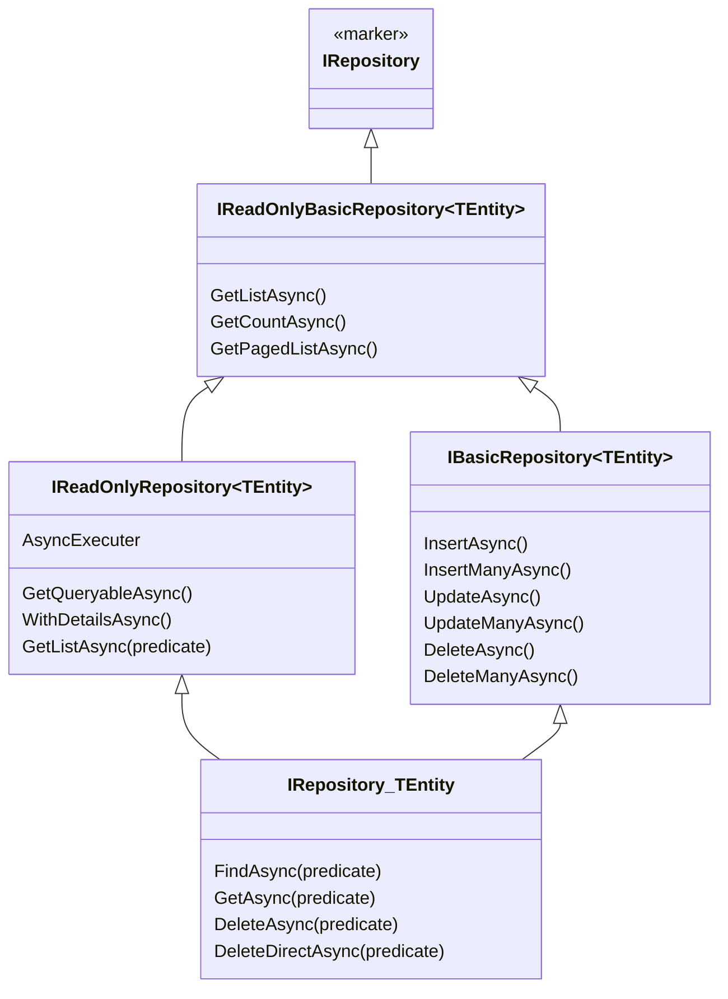
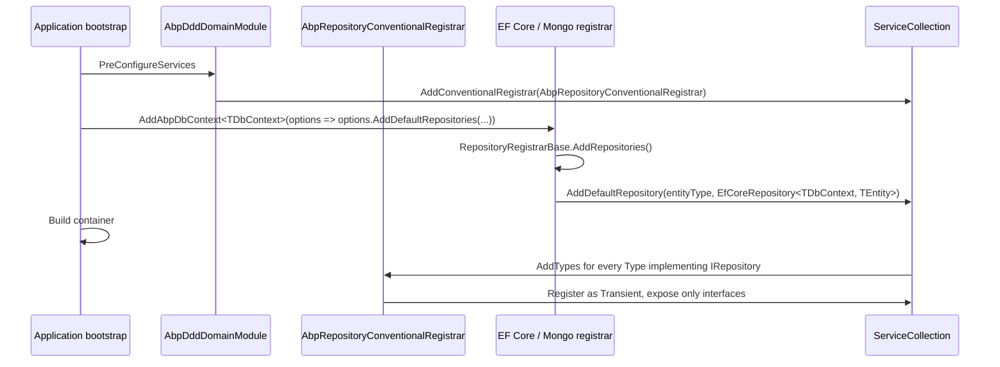

ABP's repository abstraction lives in `Volo/Abp/Domain/Repositories/`. It is intentionally split into three orthogonal interface hierarchies — **basic** (`Insert`/`Update`/`Delete`), **read-only** (`GetList`/`GetCount`/`Find`), and the **full repository** that combines them with LINQ-aware predicates. This page enumerates every interface and base class in the namespace, explains how the conventional registrar wires them into the container, and walks through the extension API.

## File inventory

| File | Type | Role |
| --- | --- | --- |
| `IRepository.cs` | `IRepository`, `IRepository<TEntity>`, `IRepository<TEntity, TKey>` | Marker + the predicate-aware full surface. |
| `IBasicRepository.cs` | `IBasicRepository<TEntity>`, `IBasicRepository<TEntity, TKey>` | Insert/update/delete only. |
| `IReadOnlyRepository.cs` | `IReadOnlyRepository<TEntity>`, `IReadOnlyRepository<TEntity, TKey>` | LINQ-aware queries; exposes `IAsyncQueryableExecuter` and `GetQueryableAsync`. |
| `IReadOnlyBasicRepository.cs` | `IReadOnlyBasicRepository<TEntity>`, `IReadOnlyBasicRepository<TEntity, TKey>` | List/count/paged-list with no LINQ. |
| `ISupportsExplicitLoading.cs` | `ISupportsExplicitLoading<TEntity, TKey>` | EnsureCollectionLoadedAsync / EnsurePropertyLoadedAsync. |
| `BasicRepositoryBase.cs` | abstract base | Property-injected services, default `InsertManyAsync`, `UpdateManyAsync`, `DeleteManyAsync`. |
| `RepositoryBase.cs` | abstract base | Adds LINQ filtering, `ApplyDataFilters`, `WithDetailsAsync`, `GetQueryableAsync`. |
| `RepositoryAsyncExtensions.cs` | static | LINQ-async extension surface on `IReadOnlyRepository<T>` (`AnyAsync`, `CountAsync`, `WhereAsync`, ...). |
| `RepositoryExtensions.cs` | static | Sync helpers and the `ISupportsExplicitLoading` shortcut. |
| `AbpRepositoryConventionalRegistrar.cs` | `IConventionalRegistrar` | Auto-registers concrete `IRepository` types as transients. |
| `RepositoryRegistrarBase.cs` | abstract | Provider-specific registrar hook for EF Core / Mongo / Memory. |
| `UnitOfWorkItemNames.cs` | `static class` | `HardDeletedEntities` UoW item key. |

## The interface graph



The generic-TKey versions (`IBasicRepository<TEntity, TKey>`, `IRepository<TEntity, TKey>`, etc.) sit one rung above their unkeyed counterparts and add **id-based overloads**: `GetAsync(TKey id)`, `DeleteAsync(TKey id)`, `FindAsync(TKey id)`, `DeleteManyAsync(IEnumerable<TKey> ids)`.

### The `IRepository` marker

```csharp framework/src/Volo.Abp.Ddd.Domain/Volo/Abp/Domain/Repositories/IRepository.cs
public interface IRepository { }
```

This empty marker is what the **conventional registrar** uses to identify "this class is a repository, register it as transient and expose all its interfaces" — see below.

### `IReadOnlyBasicRepository<TEntity>`

The simplest read API — no LINQ, just list / count / paged-list, ideal for layers that should not depend on `System.Linq`:

```csharp framework/src/Volo.Abp.Ddd.Domain/Volo/Abp/Domain/Repositories/IReadOnlyBasicRepository.cs
public interface IReadOnlyBasicRepository<TEntity> : IRepository
    where TEntity : class, IEntity
{
    Task<List<TEntity>> GetListAsync(bool includeDetails = false, CancellationToken cancellationToken = default);
    Task<long> GetCountAsync(CancellationToken cancellationToken = default);
    Task<List<TEntity>> GetPagedListAsync(
        int skipCount, int maxResultCount, string sorting,
        bool includeDetails = false, CancellationToken cancellationToken = default);
}
```

### `IReadOnlyRepository<TEntity>`

Adds the LINQ entry point and the **async executor**:

```csharp framework/src/Volo.Abp.Ddd.Domain/Volo/Abp/Domain/Repositories/IReadOnlyRepository.cs
public interface IReadOnlyRepository<TEntity> : IReadOnlyBasicRepository<TEntity>
    where TEntity : class, IEntity
{
    IAsyncQueryableExecuter AsyncExecuter { get; }

    Task<IQueryable<TEntity>> WithDetailsAsync();
    Task<IQueryable<TEntity>> WithDetailsAsync(params Expression<Func<TEntity, object>>[] propertySelectors);
    Task<IQueryable<TEntity>> GetQueryableAsync();

    Task<List<TEntity>> GetListAsync(
        Expression<Func<TEntity, bool>> predicate,
        bool includeDetails = false,
        CancellationToken cancellationToken = default);
}
```

`IAsyncQueryableExecuter` is the LINQ-provider-agnostic shim used to call `AnyAsync`/`CountAsync`/`ToListAsync` against an `IQueryable<T>` regardless of whether it is EF Core, Marten, or an in-memory list. It is what makes the `RepositoryAsyncExtensions` methods provider-agnostic.

### `IBasicRepository<TEntity>` — the write surface

```csharp framework/src/Volo.Abp.Ddd.Domain/Volo/Abp/Domain/Repositories/IBasicRepository.cs
public interface IBasicRepository<TEntity> : IReadOnlyBasicRepository<TEntity>
    where TEntity : class, IEntity
{
    Task<TEntity> InsertAsync(TEntity entity, bool autoSave = false, CancellationToken ct = default);
    Task InsertManyAsync(IEnumerable<TEntity> entities, bool autoSave = false, CancellationToken ct = default);
    Task<TEntity> UpdateAsync(TEntity entity, bool autoSave = false, CancellationToken ct = default);
    Task UpdateManyAsync(IEnumerable<TEntity> entities, bool autoSave = false, CancellationToken ct = default);
    Task DeleteAsync(TEntity entity, bool autoSave = false, CancellationToken ct = default);
    Task DeleteManyAsync(IEnumerable<TEntity> entities, bool autoSave = false, CancellationToken ct = default);
}
```

Note the `autoSave` switch. When `false` (the default), changes are deferred until the surrounding `IUnitOfWork.SaveChangesAsync` fires. When `true`, the repository calls `UnitOfWorkManager.Current?.SaveChangesAsync` immediately — useful when you need the generated key, or when a side-effect (a domain event handler in another module) depends on the state being durable.

### `IRepository<TEntity>` — the full surface

```csharp framework/src/Volo.Abp.Ddd.Domain/Volo/Abp/Domain/Repositories/IRepository.cs
public interface IRepository<TEntity> : IReadOnlyRepository<TEntity>, IBasicRepository<TEntity>
    where TEntity : class, IEntity
{
    Task<TEntity?> FindAsync(Expression<Func<TEntity, bool>> predicate,
        bool includeDetails = true, CancellationToken ct = default);

    Task<TEntity> GetAsync(Expression<Func<TEntity, bool>> predicate,
        bool includeDetails = true, CancellationToken ct = default);

    Task DeleteAsync(Expression<Func<TEntity, bool>> predicate,
        bool autoSave = false, CancellationToken ct = default);

    Task DeleteDirectAsync(Expression<Func<TEntity, bool>> predicate,
        CancellationToken ct = default);
}
```

Two key methods at the end:

- `DeleteAsync(predicate)` — fetches matching entities first, applies soft-delete / multi-tenant / audit logic, then deletes.
- `DeleteDirectAsync(predicate)` — issues a single SQL `DELETE … WHERE …`. **Bypasses soft delete, multi-tenancy and audit logging** — the XML doc is explicit about this — but it is the only way to delete millions of rows without round-tripping them.

### `ISupportsExplicitLoading<TEntity, TKey>`

```csharp framework/src/Volo.Abp.Ddd.Domain/Volo/Abp/Domain/Repositories/ISupportsExplicitLoading.cs
public interface ISupportsExplicitLoading<TEntity, TKey>
    where TEntity : class, IEntity<TKey>
{
    Task EnsureCollectionLoadedAsync<TProperty>(
        TEntity entity,
        Expression<Func<TEntity, IEnumerable<TProperty>>> propertyExpression,
        CancellationToken cancellationToken)
        where TProperty : class;

    Task EnsurePropertyLoadedAsync<TProperty>(
        TEntity entity,
        Expression<Func<TEntity, TProperty>> propertyExpression,
        CancellationToken cancellationToken)
        where TProperty : class;
}
```

The EF Core repository implements this so callers can lazily hydrate navigation properties. The `RepositoryExtensions.EnsureCollectionLoadedAsync` helper dispatches to this interface via `ProxyHelper.UnProxy`.

## Base classes

### `BasicRepositoryBase<TEntity>`

```csharp framework/src/Volo.Abp.Ddd.Domain/Volo/Abp/Domain/Repositories/BasicRepositoryBase.cs
public abstract class BasicRepositoryBase<TEntity> :
    IBasicRepository<TEntity>,
    IServiceProviderAccessor,
    IUnitOfWorkEnabled
    where TEntity : class, IEntity
{
    public IAbpLazyServiceProvider LazyServiceProvider { get; set; } = default!;
    public IServiceProvider ServiceProvider { get; set; } = default!;

    public IDataFilter DataFilter => LazyServiceProvider.LazyGetRequiredService<IDataFilter>();
    public ICurrentTenant CurrentTenant => LazyServiceProvider.LazyGetRequiredService<ICurrentTenant>();
    public IAsyncQueryableExecuter AsyncExecuter => LazyServiceProvider.LazyGetRequiredService<IAsyncQueryableExecuter>();
    public IUnitOfWorkManager UnitOfWorkManager => LazyServiceProvider.LazyGetRequiredService<IUnitOfWorkManager>();
    public ICancellationTokenProvider CancellationTokenProvider
        => LazyServiceProvider.LazyGetService<ICancellationTokenProvider>(NullCancellationTokenProvider.Instance);

    public abstract Task<TEntity> InsertAsync(TEntity entity, bool autoSave = false, CancellationToken ct = default);
    public abstract Task<TEntity> UpdateAsync(TEntity entity, bool autoSave = false, CancellationToken ct = default);
    public abstract Task DeleteAsync(TEntity entity, bool autoSave = false, CancellationToken ct = default);
    // ...

    protected virtual Task SaveChangesAsync(CancellationToken ct)
    {
        if (UnitOfWorkManager?.Current != null)
            return UnitOfWorkManager.Current.SaveChangesAsync(ct);
        return Task.CompletedTask;
    }
}
```

Key design choices:

- **All services arrive by property injection through `IAbpLazyServiceProvider`** — concrete repositories don't need constructor wiring for cross-cutting services.
- The base class implements `IUnitOfWorkEnabled`, which means every repository call participates in the ambient `IUnitOfWork`.
- `InsertManyAsync`, `UpdateManyAsync`, `DeleteManyAsync` are implemented as `foreach` loops over the single-entity methods, then call `SaveChangesAsync` when `autoSave: true`. Providers may override for batched operations.

### `RepositoryBase<TEntity>`

```csharp framework/src/Volo.Abp.Ddd.Domain/Volo/Abp/Domain/Repositories/RepositoryBase.cs
public abstract class RepositoryBase<TEntity> : BasicRepositoryBase<TEntity>,
    IRepository<TEntity>, IUnitOfWorkManagerAccessor
    where TEntity : class, IEntity
{
    public abstract Task<IQueryable<TEntity>> GetQueryableAsync();

    public abstract Task<TEntity?> FindAsync(
        Expression<Func<TEntity, bool>> predicate,
        bool includeDetails = true,
        CancellationToken cancellationToken = default);

    public async Task<TEntity> GetAsync(
        Expression<Func<TEntity, bool>> predicate,
        bool includeDetails = true,
        CancellationToken cancellationToken = default)
    {
        var entity = await FindAsync(predicate, includeDetails, cancellationToken);
        if (entity == null)
            throw new EntityNotFoundException(typeof(TEntity));
        return entity;
    }

    protected virtual TQueryable ApplyDataFilters<TQueryable, TOtherEntity>(TQueryable query)
        where TQueryable : IQueryable<TOtherEntity>
    {
        if (typeof(ISoftDelete).IsAssignableFrom(typeof(TOtherEntity)))
            query = (TQueryable)query.WhereIf(
                DataFilter.IsEnabled<ISoftDelete>(),
                e => ((ISoftDelete)e!).IsDeleted == false);
        // ... multi-tenant filter
        return query;
    }
}
```

`ApplyDataFilters` is what makes ABP's [data filters](/flows/auditing-flow) — `ISoftDelete`, `IMultiTenant`, custom filters — automatic on every repository query. Provider implementations like `EfCoreRepository<TDbContext, TEntity>` call it before returning their `IQueryable`.

`RepositoryBase<TEntity, TKey>` adds the keyed overloads:

```csharp framework/src/Volo.Abp.Ddd.Domain/Volo/Abp/Domain/Repositories/RepositoryBase.cs
public abstract class RepositoryBase<TEntity, TKey> : RepositoryBase<TEntity>,
    IRepository<TEntity, TKey>
    where TEntity : class, IEntity<TKey>
{
    public virtual async Task<TEntity> GetAsync(TKey id, bool includeDetails = true, ...)
    { /* uses EntityHelper.CreateEqualityExpressionForId */ }

    public abstract Task<TEntity?> FindAsync(TKey id, bool includeDetails = true, ...);

    public virtual Task DeleteAsync(TKey id, bool autoSave = false, ...) { /* ... */ }
}
```

## Conventional registration

ABP does **not** rely on attribute-based service registration for repositories. Instead it ships a `IConventionalRegistrar`:

```csharp framework/src/Volo.Abp.Ddd.Domain/Volo/Abp/Domain/Repositories/AbpRepositoryConventionalRegistrar.cs
public class AbpRepositoryConventionalRegistrar : DefaultConventionalRegistrar
{
    public static bool ExposeRepositoryClasses { get; set; }

    protected override bool IsConventionalRegistrationDisabled(Type type)
    {
        return !typeof(IRepository).IsAssignableFrom(type)
               || base.IsConventionalRegistrationDisabled(type);
    }

    protected override List<Type> GetExposedServiceTypes(Type type)
    {
        if (ExposeRepositoryClasses)
            return base.GetExposedServiceTypes(type);

        return base.GetExposedServiceTypes(type)
            .Where(x => x.IsInterface)
            .ToList();
    }

    protected override ServiceLifetime? GetDefaultLifeTimeOrNull(Type type)
        => ServiceLifetime.Transient;
}
```

Rules:

- A class is "a repository" iff it implements `IRepository`.
- By default the *implementation type* is **not** exposed — only the interfaces. Set `AbpRepositoryConventionalRegistrar.ExposeRepositoryClasses = true` if you need to resolve the concrete class.
- All repositories are **transient**. They are cheap to construct because their dependencies arrive through `IAbpLazyServiceProvider`.

The registrar is added in `AbpDddDomainModule.PreConfigureServices`:

```csharp framework/src/Volo.Abp.Ddd.Domain/Volo/Abp/Domain/AbpDddDomainModule.cs
public override void PreConfigureServices(ServiceConfigurationContext context)
{
    context.Services.AddConventionalRegistrar(new AbpRepositoryConventionalRegistrar());
}
```

## Provider-specific registrar — `RepositoryRegistrarBase<TOptions>`

The EF Core, MongoDB, and Memory providers each ship a subclass of `RepositoryRegistrarBase<TOptions>`. The base implements the three-stage registration:

```csharp framework/src/Volo.Abp.Ddd.Domain/Volo/Abp/Domain/Repositories/RepositoryRegistrarBase.cs
public abstract class RepositoryRegistrarBase<TOptions>
    where TOptions : AbpCommonDbContextRegistrationOptions
{
    public virtual void AddRepositories()
    {
        RegisterCustomRepositories();
        RegisterDefaultRepositories();
        RegisterSpecifiedDefaultRepositories();
    }

    protected virtual void RegisterCustomRepositories()
    {
        foreach (var customRepository in Options.CustomRepositories)
            Options.Services.AddDefaultRepository(
                customRepository.Key, customRepository.Value, replaceExisting: true);
    }
    // ...
}
```

`Options` is `AbpCommonDbContextRegistrationOptions` (also in this assembly) and lets the call site choose:

- `RegisterDefaultRepositories` — wire `IRepository<TEntity>` and `IRepository<TEntity, TKey>` for every entity in the DbContext.
- `IncludeAllEntitiesForDefaultRepositories` — include non-aggregate-root entities too.
- `AddRepository<TEntity, TRepositoryImpl>()` — override the implementation for one entity.

Reach the bottom of `framework/data/uow` for how this plugs into the provider modules.

## Extension methods

### `RepositoryAsyncExtensions`

This static class projects the entire `IAsyncQueryableExecuter` surface onto an `IReadOnlyRepository<T>`, so callers can write `await repository.AnyAsync(predicate)` instead of `await (await repository.GetQueryableAsync()).AnyAsync(predicate)`. Excerpt:

```csharp framework/src/Volo.Abp.Ddd.Domain/Volo/Abp/Domain/Repositories/RepositoryAsyncExtensions.cs
public static async Task<bool> AnyAsync<T>(
    this IReadOnlyRepository<T> repository,
    Expression<Func<T, bool>> predicate,
    CancellationToken cancellationToken = default)
    where T : class, IEntity
{
    var queryable = await repository.GetQueryableAsync();
    return await repository.AsyncExecuter.AnyAsync(
        queryable.Where(predicate),
        cancellationToken);
}
```

The same file declares `ContainsAsync`, `AllAsync`, `CountAsync`, `LongCountAsync`, `FirstAsync`, `FirstOrDefaultAsync`, `LastAsync`, `LastOrDefaultAsync`, `SingleAsync`, `SingleOrDefaultAsync`, `MinAsync`, `MaxAsync`, `SumAsync`, `AverageAsync`, `ToListAsync`, `ToArrayAsync` — all in `IReadOnlyRepository<T>` predicate-or-projection pairs.

### `RepositoryExtensions`

Adds the explicit-loading shortcut:

```csharp framework/src/Volo.Abp.Ddd.Domain/Volo/Abp/Domain/Repositories/RepositoryExtensions.cs
public static async Task EnsureCollectionLoadedAsync<TEntity, TKey, TProperty>(
    this IBasicRepository<TEntity, TKey> repository,
    TEntity entity,
    Expression<Func<TEntity, IEnumerable<TProperty>>> propertyExpression,
    CancellationToken cancellationToken = default)
    where TEntity : class, IEntity<TKey>
    where TProperty : class
{
    var repo = ProxyHelper.UnProxy(repository)
        as ISupportsExplicitLoading<TEntity, TKey>;
    if (repo != null)
        await repo.EnsureCollectionLoadedAsync(entity, propertyExpression, cancellationToken);
}
```

`ProxyHelper.UnProxy` strips the dynamic-proxy decoration (interception/UoW) so the cast to `ISupportsExplicitLoading` succeeds.

## `UnitOfWorkItemNames`

A single constant:

```csharp framework/src/Volo.Abp.Ddd.Domain/Volo/Abp/Domain/Repositories/UnitOfWorkItemNames.cs
public static class UnitOfWorkItemNames
{
    public const string HardDeletedEntities = "AbpHardDeletedEntities";
}
```

The EF Core repository stashes a `HashSet<IEntity>` under this UoW-items key when `IHardDelete` is detected, so the auditing and event-emission code can later distinguish a hard delete from a soft one.

## DI registration flow



## See also

<CardGroup cols={2}>
<Card title="Entities & Aggregates" href="/framework/ddd/entities-and-aggregates">
The `TEntity` types every repository takes as type parameter.
</Card>
<Card title="Unit of work" href="/framework/data/uow">
How `autoSave: false` defers persistence until UoW completion.
</Card>
<Card title="Specifications" href="/framework/ddd/specifications">
Build composable predicates and pass them to repository methods.
</Card>
<Card title="Domain events" href="/framework/ddd/domain-events">
The publication path after an aggregate is saved.
</Card>
</CardGroup>
