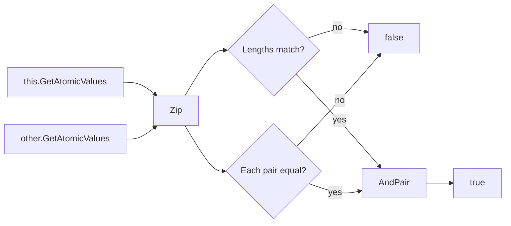

A **value object** is a domain type identified by *the value of its parts* rather than by an identity. ABP's contribution to the pattern is intentionally minimal: one abstract base class, `Volo.Abp.Domain.Values.ValueObject`, that ships a single equality protocol — `GetAtomicValues()` — and leaves everything else to you. This page covers the source file, the equality contract, recommended subclass patterns, and the recognition path ABP uses to treat your type as a value object.

## The source file

```csharp framework/src/Volo.Abp.Ddd.Domain/Volo/Abp/Domain/Values/ValueObject.cs
//Inspired from https://docs.microsoft.com/en-us/dotnet/standard/microservices-architecture/microservice-ddd-cqrs-patterns/implement-value-objects

public abstract class ValueObject
{
    protected abstract IEnumerable<object> GetAtomicValues();

    public bool ValueEquals(object obj)
    {
        if (obj == null || obj.GetType() != GetType())
        {
            return false;
        }

        var other = (ValueObject)obj;

        var thisValues = GetAtomicValues().GetEnumerator();
        var otherValues = other.GetAtomicValues().GetEnumerator();

        var thisMoveNext = thisValues.MoveNext();
        var otherMoveNext = otherValues.MoveNext();
        while (thisMoveNext && otherMoveNext)
        {
            if (ReferenceEquals(thisValues.Current, null)
                ^ ReferenceEquals(otherValues.Current, null))
            {
                return false;
            }

            if (thisValues.Current != null
                && !thisValues.Current.Equals(otherValues.Current))
            {
                return false;
            }

            thisMoveNext = thisValues.MoveNext();
            otherMoveNext = otherValues.MoveNext();

            if (thisMoveNext != otherMoveNext)
            {
                return false;
            }
        }

        return !thisMoveNext && !otherMoveNext;
    }
}
```

The whole API is two members:

| Member | Visibility | Purpose |
| --- | --- | --- |
| `GetAtomicValues()` | `protected abstract` | Returns the ordered sequence of "atoms" that define identity. |
| `ValueEquals(object)` | `public` | Compares two value objects element-by-element, in declaration order, using `Equals` on each atom. |

The comment at the top credits Microsoft's official DDD/CQRS guidance — ABP's implementation is a near-verbatim port and behaves the same way as the canonical sample in the *Microservices Architecture* eShopOnContainers book.

## The equality contract

`ValueEquals` works by zipping the two `GetAtomicValues()` enumerators in lock-step:



Notice the explicit handling of three corner cases:

- `obj.GetType() != GetType()` — derived value-object types are **not** equal to the base; same-runtime-type is required.
- One enumerator has a `null` atom while the other has a non-null atom (`a ^ b`) — explicit `false`.
- Sequences of different lengths — `thisMoveNext != otherMoveNext` after the loop.

The base class **does not override** `Equals`, `GetHashCode`, or the `==` operator. That is intentional — ABP leaves the choice to your subclass, because hash-code stability is a property of the values themselves.

## Recommended subclass shape

A classic subclass overrides `GetAtomicValues`, `Equals`, `GetHashCode`, and ideally the equality operators:

```csharp
public sealed class Address : ValueObject
{
    public string Street { get; }
    public string City { get; }
    public string Country { get; }
    public string PostalCode { get; }

    public Address(string street, string city, string country, string postalCode)
    {
        Street = Check.NotNullOrWhiteSpace(street, nameof(street));
        City = Check.NotNullOrWhiteSpace(city, nameof(city));
        Country = Check.NotNullOrWhiteSpace(country, nameof(country));
        PostalCode = Check.NotNullOrWhiteSpace(postalCode, nameof(postalCode));
    }

    protected override IEnumerable<object> GetAtomicValues()
    {
        yield return Street;
        yield return City;
        yield return Country;
        yield return PostalCode;
    }

    public override bool Equals(object? obj)
        => obj is Address other && ValueEquals(other);

    public override int GetHashCode()
        => HashCode.Combine(Street, City, Country, PostalCode);

    public static bool operator ==(Address? a, Address? b)
        => a is null ? b is null : a.Equals(b);

    public static bool operator !=(Address? a, Address? b) => !(a == b);
}
```

Five rules of thumb:

1. **Immutability** — every property is `get`-only. To "change" a value object, build a new one.
2. **Validation in the constructor** — `Address` cannot exist in an invalid state.
3. **`GetAtomicValues` enumerates in a stable order** — adding, removing, or reordering atoms is a breaking change for callers that have cached hashes.
4. **`GetHashCode` must combine the same fields** that `GetAtomicValues` returns.
5. **Sealed unless you mean it** — value-object inheritance breaks LSP because `Equals` requires identical runtime types.

## Record-style usage

C# records make most of the boilerplate disappear. If you target `net7.0` (one of `Volo.Abp.Ddd.Domain`'s `TargetFrameworks`), you can write:

```csharp
public sealed record Money(decimal Amount, string Currency)
{
    public Money Add(Money other)
    {
        if (Currency != other.Currency)
            throw new BusinessException("Money:CurrencyMismatch");
        return new Money(Amount + other.Amount, Currency);
    }
}
```

A `record` already produces a structurally-equal `Equals`, `GetHashCode`, `==`, and `!=`. If you also want compatibility with the ABP `ValueObject` machinery (e.g. so `EntityHelper.IsValueObject(typeof(Money))` returns `true`), wrap it:

```csharp
public sealed record Money(decimal Amount, string Currency) : ValueObjectRecord
{
    protected override IEnumerable<object> GetAtomicValues()
    {
        yield return Amount;
        yield return Currency;
    }
}

public abstract record ValueObjectRecord : ValueObject
{
    protected abstract override IEnumerable<object> GetAtomicValues();
}
```

This is **not** part of the framework — `ValueObject` is plain `abstract class`, not `abstract record` — but it is a common solution-level pattern.

## How the framework recognizes value objects

`EntityHelper` exposes a predicate the rest of the framework uses to distinguish entities from value objects:

```csharp framework/src/Volo.Abp.Ddd.Domain/Volo/Abp/Domain/Entities/EntityHelper.cs
public static Func<Type, bool> IsValueObjectPredicate
    = type => typeof(ValueObject).IsAssignableFrom(type);

public static bool IsValueObject(Type type)
{
    Check.NotNull(type, nameof(type));
    return IsValueObjectPredicate(type);
}

public static bool IsValueObject(object? obj)
    => obj != null && IsValueObject(obj.GetType());
```

Two things follow from this:

- The default rule is "is `T` assignable to `ValueObject`?". To opt your records into the system *without* inheriting, replace the predicate at startup: `EntityHelper.IsValueObjectPredicate = t => …;` — this is a writable static.
- Code paths that need to distinguish entity vs. value object (e.g. the EF Core ChangeTracker hooks for auditing, the object-extending feature, snapshot equality) consult `IsValueObject(Type)`.

## When to choose ValueObject vs Entity

<CardGroup cols={2}>
<Card title="Use ValueObject" icon="diamond">
- The object has no identity beyond its data.
- It's safe to replace one instance with an equal one anywhere it appears.
- It's an attribute of an entity (Address on User, Money on OrderLine).
</Card>
<Card title="Use Entity" icon="cube">
- The object has a lifecycle and a primary key.
- Two instances with identical state are still distinct (two `User`s with the same email).
- Equality is by ID.
</Card>
</CardGroup>

## Common pitfalls

| Pitfall | Why it bites | Fix |
| --- | --- | --- |
| Forgetting to override `Equals`/`GetHashCode` | Dictionary/HashSet lookups behave as reference equality. | Override both, or use a `record`. |
| Different runtime types | `new Address(..) as ValueObject == new InternationalAddress(..)` returns false. | Don't subclass value objects, or seal them. |
| Mutable properties | Hash codes change in mid-collection, breaking dictionaries. | Make every setter private/init. |
| Reflection-driven serializers strip ctor validation | EF Core can re-hydrate an invalid value object. | Keep DB columns as primitives, expose them via owned types or value converters. |

## Persisting value objects

`ValueObject` itself has no opinion on persistence. The common approaches in ABP:

- **EF Core owned types** — declare `b.OwnsOne(o => o.ShippingAddress)` in your `DbContext.OnModelCreating`. Each atom maps to a column.
- **Value converters** — for single-atom value objects, convert to a primitive on save and back on load.
- **JSON columns** — for complex value objects, serialize to a single `nvarchar` column.

`ValueObject` participates in the auditing system too: because it is not an entity, the auditing pipeline treats it as part of the parent entity's snapshot.

## See also

<CardGroup cols={2}>
<Card title="Entities & Aggregates" href="/framework/ddd/entities-and-aggregates">
The companion identity-bearing types in the same namespace tree.
</Card>
<Card title="Domain Services" href="/framework/ddd/domain-services">
Where value objects often appear as method parameters and return types.
</Card>
<Card title="Object-extending" href="/framework/data/object-extending">
The `IHasExtraProperties` extension model — orthogonal to value objects.
</Card>
<Card title="Specifications" href="/framework/ddd/specifications">
Composable query-time predicates often built from value-object atoms.
</Card>
</CardGroup>
