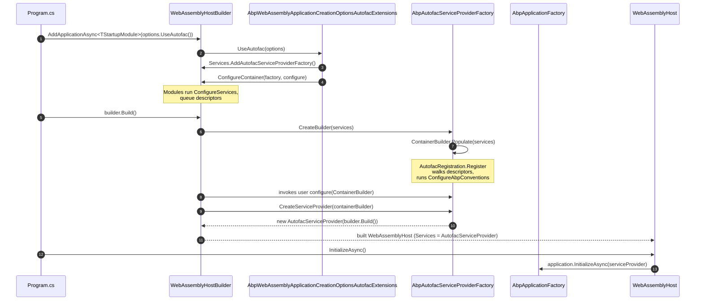

Blazor WebAssembly does not use the Generic Host. Its `WebAssemblyHostBuilder` builds an `IServiceProvider` directly from an `IServiceCollection`, and the `IServiceProviderFactory<TContainerBuilder>` indirection that `IHostBuilder.UseServiceProviderFactory(...)` exposes for server hosts is reached through a different API: `WebAssemblyHostBuilder.ConfigureContainer(...)`. `Volo.Abp.Autofac.WebAssembly` is the **one-file shim** that bridges those two worlds. It reuses the `AbpAutofacServiceProviderFactory` from [`/framework/di/autofac`](/framework/di/autofac) and adapts it to the WASM bootstrap so a Blazor WASM app gets the same conventional registration, property injection, and interceptor weaving as a server-side ABP app.

This page covers the package's three files, the exact bootstrap path through `AddApplicationAsync<TModule>` under WebAssembly, and the WASM-specific quirks (Castle dynamic proxy attribute replication, `IClientScopeServiceProviderAccessor`) that ABP works around.

## Package shape

`Volo.Abp.Autofac.WebAssembly.csproj` targets net7.0 only (Blazor WASM is a `net7.0`-flavored runtime in v7.4.0) and project-references both the server-side Autofac package and the Blazor WebAssembly host package:

```xml
<TargetFramework>net7.0</TargetFramework>
<Nullable>enable</Nullable>

<ProjectReference Include="..\Volo.Abp.AspNetCore.Components.WebAssembly\Volo.Abp.AspNetCore.Components.WebAssembly.csproj" />
<ProjectReference Include="..\Volo.Abp.Autofac\Volo.Abp.Autofac.csproj" />
```

There are no new NuGet packages — every Autofac type comes through `Volo.Abp.Autofac`, every WebAssembly type comes through `Volo.Abp.AspNetCore.Components.WebAssembly`.

### File inventory

| Path under `framework/src/Volo.Abp.Autofac.WebAssembly/` | Type / role | Summary |
| --- | --- | --- |
| `Volo/Abp/Autofac/WebAssembly/AbpAutofacWebAssemblyModule.cs` | `AbpModule` | Empty module that `DependsOn(AbpAutofacModule, AbpAspNetCoreComponentsWebAssemblyModule)`. Pulls both worlds into the module graph. |
| `Microsoft/AspNetCore/Components/WebAssembly/Hosting/AbpWebAssemblyApplicationCreationOptionsAutofacExtensions.cs` | static extensions | `UseAutofac(this AbpWebAssemblyApplicationCreationOptions, Action<ContainerBuilder>?)` — registers the factory and wires `HostBuilder.ConfigureContainer(...)`. |
| `Volo.Abp.Autofac.WebAssembly.csproj` | csproj | Targets `net7.0`, project-references shown above. |
| `Volo.Abp.Autofac.WebAssembly.abppkg.json` | abp package metadata | Marks the package for ABP's package graph tooling. |
| `FodyWeavers.xml`, `FodyWeavers.xsd` | Fody config | Shared `ConfigureAwait.Fody` config. |

Everything that matters at runtime lives in two `.cs` files totalling about thirty lines — the heavy lifting is done by the dependencies.

## Module declaration

`Volo/Abp/Autofac/WebAssembly/AbpAutofacWebAssemblyModule.cs`:

```csharp
using Volo.Abp.AspNetCore.Components.WebAssembly;
using Volo.Abp.Modularity;

namespace Volo.Abp.Autofac.WebAssembly;

[DependsOn(
    typeof(AbpAutofacModule),
    typeof(AbpAspNetCoreComponentsWebAssemblyModule)
    )]
public class AbpAutofacWebAssemblyModule : AbpModule
{

}
```

The module is empty on purpose. It exists so:

- Other Blazor WASM modules can put `[DependsOn(typeof(AbpAutofacWebAssemblyModule))]` on their module class and have both the Autofac bridge **and** the WebAssembly support pulled into the dependency graph in one declaration.
- The reverse-topological module load order guarantees that `AbpAutofacModule.ConfigureServices` (i.e. the Castle interceptor registration) runs before WebAssembly-specific configuration.

Neither `ConfigureServices` nor `OnApplicationInitialization` is overridden: there is nothing to configure beyond pulling in dependencies.

## The host-side bridge

`Microsoft/AspNetCore/Components/WebAssembly/Hosting/AbpWebAssemblyApplicationCreationOptionsAutofacExtensions.cs` is the single extension that user code calls:

```csharp
using System;
using Autofac;
using JetBrains.Annotations;
using Microsoft.Extensions.DependencyInjection;
using Volo.Abp;
using Volo.Abp.AspNetCore.Components.WebAssembly;

namespace Microsoft.AspNetCore.Components.WebAssembly.Hosting;

public static class AbpWebAssemblyApplicationCreationOptionsAutofacExtensions
{
    public static void UseAutofac(
        [NotNull] this AbpWebAssemblyApplicationCreationOptions options,
        Action<ContainerBuilder>? configure = null)
    {
        options.HostBuilder.Services.AddAutofacServiceProviderFactory();
        options.HostBuilder.ConfigureContainer(
            options.HostBuilder.Services.GetSingletonInstance<IServiceProviderFactory<ContainerBuilder>>(),
            configure
        );
    }
}
```

Two lines, four important behaviors:

1. **`AddAutofacServiceProviderFactory()`** (the same extension covered in [`/framework/di/autofac`](/framework/di/autofac)) is called against `options.HostBuilder.Services`. That:
   - Constructs a new `ContainerBuilder`.
   - Wraps it in an `ObjectAccessor<ContainerBuilder>` and adds it to `services`.
   - Adds an `AbpAutofacServiceProviderFactory` as a **singleton** typed as `IServiceProviderFactory<ContainerBuilder>`.

2. **`GetSingletonInstance<IServiceProviderFactory<ContainerBuilder>>()`** is a re-read of the factory we just registered. It's a hard pull from the in-flight `IServiceCollection` (not from a built provider) — this is the canonical ABP way to retrieve a service-collection-registered singleton before the container is built. If `AddAutofacServiceProviderFactory()` was skipped the call throws an `AbpException`.

3. **`options.HostBuilder.ConfigureContainer(factory, configure)`** is the WebAssembly equivalent of `IHostBuilder.UseServiceProviderFactory(...)`. The `WebAssemblyHostBuilder.ConfigureContainer<TBuilder>(IServiceProviderFactory<TBuilder>, Action<TBuilder>?)` API on the Blazor side will, when `WebAssemblyHostBuilder.Build()` runs:
   - Call `factory.CreateBuilder(services)` — which is `AbpAutofacServiceProviderFactory.CreateBuilder` and triggers the descriptor walk in `AutofacRegistration.Populate` (see [`/framework/di/autofac`](/framework/di/autofac)).
   - Invoke the optional user `configure(ContainerBuilder)` callback so the app can register raw Autofac modules or components alongside ABP's conventional registrations.
   - Call `factory.CreateServiceProvider(containerBuilder)` — which returns `new AutofacServiceProvider(containerBuilder.Build())`.

4. **The `configure` delegate is optional.** Passing `null` (the default) is the common case; passing `b => b.RegisterModule(new MyAutofacModule())` is how you mix raw Autofac modules into a Blazor WASM ABP app.

The Blazor host then uses that `AutofacServiceProvider` as the WASM app's `IServiceProvider` — every `[Inject]` property on every Razor component, every constructor parameter on every `ApplicationService` proxy, every interceptor resolution happens through Autofac.

## The host-options type

`AbpWebAssemblyApplicationCreationOptions` (in `Volo.Abp.AspNetCore.Components.WebAssembly`) is the per-call carrier that lets the `UseAutofac` extension reach both the WASM host builder and the ABP application options:

```csharp
public class AbpWebAssemblyApplicationCreationOptions
{
    public WebAssemblyHostBuilder HostBuilder { get; }

    public AbpApplicationCreationOptions ApplicationCreationOptions { get; }

    public AbpWebAssemblyApplicationCreationOptions(
        WebAssemblyHostBuilder hostBuilder,
        AbpApplicationCreationOptions applicationCreationOptions)
    {
        HostBuilder = hostBuilder;
        ApplicationCreationOptions = applicationCreationOptions;
    }
}
```

This is the value passed into the `Action<AbpWebAssemblyApplicationCreationOptions>` configure delegate that `WebAssemblyHostBuilder.AddApplicationAsync<TStartupModule>(...)` accepts (see below). The extension just navigates from there: `options.HostBuilder.Services`, `options.HostBuilder.ConfigureContainer`.

## End-to-end: `AddApplicationAsync<TStartupModule>` under WASM

A typical Blazor WASM `Program.cs` looks like this:

```csharp
var builder = WebAssemblyHostBuilder.CreateDefault(args);

await builder.AddApplicationAsync<MyClientModule>(options =>
{
    options.UseAutofac();
});

var host = builder.Build();

await host.InitializeAsync();
await host.RunAsync();
```

The `AddApplicationAsync<TStartupModule>` extension is in `Volo.Abp.AspNetCore.Components.WebAssembly/Microsoft/AspNetCore/Components/WebAssembly/Hosting/AbpWebAssemblyHostBuilderExtensions.cs`:

```csharp
public async static Task<IAbpApplicationWithExternalServiceProvider> AddApplicationAsync<TStartupModule>(
    [NotNull] this WebAssemblyHostBuilder builder,
    Action<AbpWebAssemblyApplicationCreationOptions> options)
    where TStartupModule : IAbpModule
{
    Check.NotNull(builder, nameof(builder));

    // Related this commit(https://github.com/dotnet/aspnetcore/commit/b99d805bc037fcac56afb79abeb7d5a43141c85e)
    // Microsoft.AspNetCore.Blazor.BuildTools has been removed in net 5.0.
    // This call may be removed when we find a suitable solution.
    // System.Runtime.CompilerServices.AsyncStateMachineAttribute
    Castle.DynamicProxy.Generators.AttributesToAvoidReplicating.Add<AsyncStateMachineAttribute>();

    builder.Services.AddSingleton<IConfiguration>(builder.Configuration);
    builder.Services.AddSingleton(builder);

    var application = await builder.Services.AddApplicationAsync<TStartupModule>(opts =>
    {
        options?.Invoke(new AbpWebAssemblyApplicationCreationOptions(builder, opts));
        if (opts.Environment.IsNullOrWhiteSpace())
        {
            opts.Environment = builder.HostEnvironment.Environment;
        }
    });

    return application;
}
```

The ordering of effects is what makes the Autofac bridge work:

1. **`AttributesToAvoidReplicating.Add<AsyncStateMachineAttribute>()`** is called first. Castle DynamicProxy normally replicates attributes from the target method onto the proxy method; on certain runtimes the AOT/IL-rewriting that Blazor does makes `AsyncStateMachineAttribute` un-replicable. The source comment notes that this workaround was originally tied to `Microsoft.AspNetCore.Blazor.BuildTools` removal in .NET 5 and is still required as of v7.4.0. Without this line, building an interface proxy for any `async` interceptor target in WebAssembly throws at proxy-generation time.

2. **`builder.Configuration` and the `builder` itself are added as singletons** to `builder.Services`, so any ABP module can resolve `IConfiguration` or `WebAssemblyHostBuilder` during `ConfigureServices`.

3. **`builder.Services.AddApplicationAsync<TStartupModule>(...)`** is the standard ABP entry point (from `Volo.Abp.Core`). It builds an `AbpApplicationCreationOptions`, hands it to the user callback wrapped in an `AbpWebAssemblyApplicationCreationOptions`, then proceeds with the normal `AbpApplicationFactory.CreateAsync` flow: module discovery, module instantiation, `ServiceConfigurationContext` creation, conventional-registrar setup, every loaded module's `PreConfigureServices`/`ConfigureServices`/`PostConfigureServices`.

4. **Inside the user callback**, `options.UseAutofac()` runs while module discovery is in progress but before any module's `ConfigureServices` has executed. This means:
   - The `AbpAutofacServiceProviderFactory` and the `ContainerBuilder` are parked in the service collection.
   - When each module's `ConfigureServices` later calls `services.AddSingleton/Scoped/Transient(...)`, those descriptors are queued on the same `IServiceCollection` that the factory will later `Populate`.

5. **`opts.Environment` falls back to `builder.HostEnvironment.Environment`** if not explicitly set — usually `"Development"` or `"Production"` in WASM.

6. **The returned `IAbpApplicationWithExternalServiceProvider`** is *not* yet initialized. The container hasn't been built. The factory hasn't been called. We just have an application that knows its module graph and has accumulated descriptors.

### Build and initialize

After `AddApplicationAsync<TStartupModule>` returns, `builder.Build()` runs on the Blazor side. That's where the Autofac factory finally fires:



The detailed `AbpApplicationFactory.CreateAsync` and `IAbpApplicationWithExternalServiceProvider.InitializeAsync` flows are in [`/flows/application-startup`](/flows/application-startup). What's WASM-specific is the seam between `builder.Build()` (which is the moment Autofac actually runs) and `InitializeApplicationAsync` (the moment ABP modules' `OnApplicationInitialization` hooks fire).

### `InitializeApplicationAsync` and the client scope accessor

`Volo.Abp.AspNetCore.Components.WebAssembly` also exposes an `InitializeApplicationAsync` helper that user code calls after `builder.Build()`:

```csharp
public async static Task InitializeApplicationAsync(
    [NotNull] this IAbpApplicationWithExternalServiceProvider application,
    [NotNull] IServiceProvider serviceProvider)
{
    Check.NotNull(application, nameof(application));
    Check.NotNull(serviceProvider, nameof(serviceProvider));

    ((ComponentsClientScopeServiceProviderAccessor)serviceProvider
        .GetRequiredService<IClientScopeServiceProviderAccessor>()).ServiceProvider = serviceProvider;

    await application.InitializeAsync(serviceProvider);
}
```

Two notes for the Autofac bridge:

- The `serviceProvider` parameter is the `AutofacServiceProvider` returned by the factory's `CreateServiceProvider`. The `application.InitializeAsync(serviceProvider)` call is what allows ABP-injected services to flow into module initialization through the Autofac-built provider.
- `IClientScopeServiceProviderAccessor` is the WASM analogue of "the root scope" — Blazor WebAssembly has no per-request scope, so ABP fakes one by parking the root provider on the accessor. Anything ABP code that needs a "client scope" (notably `Volo.Abp.AspNetCore.Components.WebAssembly` HTTP client proxies) will see the Autofac provider here.

## What the WebAssembly companion module pulls in

`AbpAutofacWebAssemblyModule.DependsOn(typeof(AbpAspNetCoreComponentsWebAssemblyModule))` is what transitively assembles the rest of the WASM stack alongside the Autofac bridge. That sibling module (`Volo.Abp.AspNetCore.Components.WebAssembly/Volo/Abp/AspNetCore/Components/WebAssembly/AbpAspNetCoreComponentsWebAssemblyModule.cs`) does the work that has to happen before the Autofac container is built:

```csharp
[DependsOn(
    typeof(AbpAspNetCoreMvcClientCommonModule),
    typeof(AbpUiModule),
    typeof(AbpAspNetCoreComponentsWebModule)
)]
public class AbpAspNetCoreComponentsWebAssemblyModule : AbpModule
{
    public override void PreConfigureServices(ServiceConfigurationContext context)
    {
        var abpHostEnvironment = context.Services.GetSingletonInstance<IAbpHostEnvironment>();
        if (abpHostEnvironment.EnvironmentName.IsNullOrWhiteSpace())
        {
            abpHostEnvironment.EnvironmentName = context.Services.GetWebAssemblyHostEnvironment().Environment;
        }

        PreConfigure<AbpHttpClientBuilderOptions>(options =>
        {
            options.ProxyClientBuildActions.Add((_, builder) =>
            {
                builder.AddHttpMessageHandler<AbpBlazorClientHttpMessageHandler>();
            });
        });
    }

    public override void ConfigureServices(ServiceConfigurationContext context)
    {
        context.Services.AddHttpClient();
        context.Services
            .GetHostBuilder().Logging
            .AddProvider(new AbpExceptionHandlingLoggerProvider(context.Services));
    }

    // OnApplicationInitializationAsync resolves WebAssemblyCachedApplicationConfigurationClient
    // and AbpComponentsClaimsCache through IClientScopeServiceProviderAccessor.ServiceProvider
    // and runs current-culture setup.
}
```

What's important from the Autofac bridge perspective:

- All of those `PreConfigure<...>`, `ConfigureServices`, and the `OnApplicationInitializationAsync` overrides queue descriptors and options onto the same `IServiceCollection` that the Autofac factory will later `Populate`. The order — `PreConfigureServices` → `ConfigureServices` → `PostConfigureServices` across all loaded modules in topological order, then container build, then `OnApplicationInitialization` — is enforced by `AbpApplicationFactory.CreateAsync` (see [`/flows/application-startup`](/flows/application-startup)) and is identical between WASM and server. The Autofac shim does not reorder anything.
- The `IClientScopeServiceProviderAccessor.ServiceProvider` mutation in `InitializeApplicationAsync` is what lets this module's `OnApplicationInitializationAsync` resolve `WebAssemblyCachedApplicationConfigurationClient` and `AbpComponentsClaimsCache` from a real Autofac-built provider.

## What's *not* in the WebAssembly package

The lean shape of this package is intentional. A few things you might expect to find here actually live elsewhere:

- **Lifetime mapping** is the same as the server case — `Transient → InstancePerDependency`, `Scoped → InstancePerLifetimeScope`, `Singleton → SingleInstance`. WebAssembly only ever has one lifetime scope at runtime (the root), so `Scoped` and `Singleton` resolve identically in practice. The mapping itself comes from `AutofacRegistration.ConfigureLifecycle` in `Volo.Abp.Autofac`.
- **Property injection rules** are exactly those of `AbpRegistrationBuilderExtensions.EnablePropertyInjection`: types must live in a loaded module assembly and must not carry `[DisablePropertyInjection]`. The WASM package adds no special rules.
- **Interceptor weaving** is unchanged. Castle's `AsyncInterceptor` runs inside the browser exactly as it does on the server, modulo the `AttributesToAvoidReplicating.Add<AsyncStateMachineAttribute>()` workaround.
- **The Castle interceptor wrapper** (`AbpAsyncDeterminationInterceptor<>`) is registered transiently by `AbpCastleCoreModule.ConfigureServices` — transitively pulled in through `AbpAutofacModule`. See [`/framework/di/castle-core`](/framework/di/castle-core).
- **`IHostBuilder.UseAutofac()`** has no counterpart here — Blazor WASM doesn't use `IHostBuilder`. The only call site for the WASM bridge is `AbpWebAssemblyApplicationCreationOptions.UseAutofac(...)`.

## Gotchas and known edges

- **You must call `options.UseAutofac()` synchronously inside the `AddApplicationAsync<TStartupModule>` callback.** The factory must be in the service collection before `AbpApplicationFactory.CreateAsync` starts walking module dependencies — calling `UseAutofac()` after `AddApplicationAsync` returns has no effect because the module configuration has already finished.
- **The Castle attributes-to-avoid line is global mutation.** It's idempotent (the set is keyed by attribute type) and the workaround is documented in the source comment with a link to the dotnet/aspnetcore commit that triggered it. If you spin up multiple ABP applications in the same process under WASM (rare), the extra `.Add<AsyncStateMachineAttribute>()` calls are harmless.
- **`configure: Action<ContainerBuilder>?` runs *after* `Populate`.** That ordering is determined by `WebAssemblyHostBuilder.ConfigureContainer` — the factory creates the builder, populates it from `services`, then invokes the user delegate. So raw Autofac modules registered through `configure` cannot override any descriptor that `Populate` already added (Autofac's "last-registration-wins" only applies to identical `As<>` chains; overriding ABP-registered types requires `.PreserveExistingDefaults()` or `.Named/Keyed` registrations).
- **`AbpException` from `GetSingletonInstance<...>`.** If you call `UseAutofac` twice or your code path skips `AddAutofacServiceProviderFactory()` and tries to call `ConfigureContainer` directly, you'll get the `Could not find ContainerBuilder. Be sure that you have called UseAutofac method before!` exception — the message is from `AbpAutofacServiceCollectionExtensions.GetContainerBuilder` and it's the canonical "you forgot to call `UseAutofac`" signal.
- **The package targets `net7.0` only.** There's no `netstandard2.x` build because `WebAssemblyHostBuilder` and `WebAssemblyHost` are net7.0+ types. Consumers must also target a Blazor-compatible TFM.

## Related pages

- [`/framework/di/autofac`](/framework/di/autofac) — the underlying `AbpAutofacServiceProviderFactory`, `AutofacRegistration.Populate`, `ConfigureAbpConventions`, lifetime mapping, and property-injection rules. Every behavior in this page that isn't WASM-specific is documented there.
- [`/framework/di/castle-core`](/framework/di/castle-core) — `AbpAsyncDeterminationInterceptor<T>`, the `AsyncInterceptor` base, and the method-invocation adapters that run on top of Castle DynamicProxy in the browser.
- [`/flows/application-startup`](/flows/application-startup) — `AbpApplicationFactory.CreateAsync`, module loading, `ConfigureServices` ordering, and how `IAbpApplicationWithExternalServiceProvider.InitializeAsync` slots in after the container is built.
- [`/framework/core/dependency-injection`](/framework/core/dependency-injection) — `IConventionalRegistrar`, `OnServiceRegistredContext`, `ServiceRegistrationActionList`, and the conventional-registrar pipeline that populates the interceptor lists `AddInterceptors` reads from.
