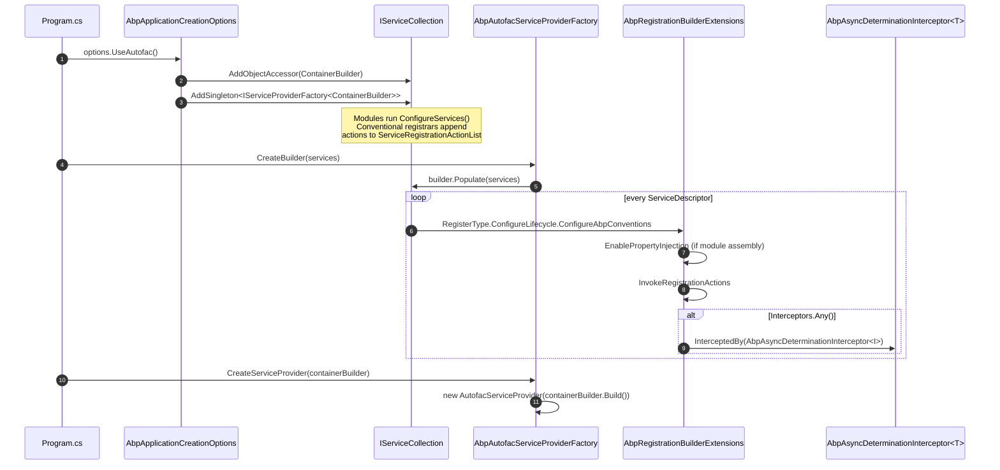

ABP's startup pipeline is built on `Microsoft.Extensions.DependencyInjection`, but real apps need three things that the default container does not provide: **property injection**, **interface/class interception** for cross-cutting concerns (UoW, auditing, authorization, caching), and **open-generic registrations under decorators**. `Volo.Abp.Autofac` is the small adapter package that swaps the built-in `ServiceProviderFactory` for an Autofac-backed one, then re-walks the `IServiceCollection` so every descriptor is registered through ABP's conventional registration hooks. The package lives at `framework/src/Volo.Abp.Autofac/` and depends only on `Volo.Abp.Castle.Core` (for the `IAbpInterceptor` ⇄ Castle `IAsyncInterceptor` adapter).

This page is the deep dive on what each file does, how the Autofac container ends up holding ABP's conventional registrations and interceptors, and where the lifetime/property-injection rules diverge from vanilla `Autofac.Extensions.DependencyInjection`.

## Package shape

`Volo.Abp.Autofac.csproj` multi-targets `netstandard2.0;netstandard2.1;net7.0`, pulls in three Autofac packages, and project-references `Volo.Abp.Castle.Core`:

```xml
<PackageReference Include="Autofac" Version="7.0.0" />
<PackageReference Include="Autofac.Extensions.DependencyInjection" Version="8.0.0" />
<PackageReference Include="Autofac.Extras.DynamicProxy" Version="6.0.1" />
<PackageReference Include="Microsoft.Bcl.AsyncInterfaces" Version="$(MicrosoftPackageVersion)" />
<PackageReference Include="Microsoft.Extensions.Hosting.Abstractions" Version="$(MicrosoftPackageVersion)" />

<ProjectReference Include="..\Volo.Abp.Castle.Core\Volo.Abp.Castle.Core.csproj" />
```

`RootNamespace` is intentionally blank so the file system layout is the namespace layout — extensions on `Microsoft.Extensions.*` live under `Microsoft/Extensions/...`, extensions on `Autofac.Builder` live under `Autofac/Builder/...`, and so on.

### File inventory

| Path under `framework/src/Volo.Abp.Autofac/` | Type / role | Summary |
| --- | --- | --- |
| `Volo/Abp/Autofac/AbpAutofacModule.cs` | `AbpModule` | Empty module that `DependsOn(typeof(AbpCastleCoreModule))` — exists so other modules can `[DependsOn(typeof(AbpAutofacModule))]`. |
| `Volo/Abp/Autofac/AbpAutofacServiceProviderFactory.cs` | `IServiceProviderFactory<ContainerBuilder>` | The replacement factory: holds a `ContainerBuilder`, calls `builder.Populate(services)` in `CreateBuilder`, then `new AutofacServiceProvider(containerBuilder.Build())` in `CreateServiceProvider`. |
| `Volo/Abp/Autofac/AbpPropertySelector.cs` | `Autofac.Core.IPropertySelector` | Subclass of `DefaultPropertySelector` that vetoes any property carrying `[DisablePropertyInjection]`. |
| `Volo/Abp/AbpAutofacAbpApplicationCreationOptionsExtensions.cs` | static extensions | `AbpApplicationCreationOptions.UseAutofac()` and the two `IServiceCollection.AddAutofacServiceProviderFactory(...)` overloads. |
| `Microsoft/Extensions/Hosting/AbpAutofacHostBuilderExtensions.cs` | static extensions | `IHostBuilder.UseAutofac()` — registers the `ContainerBuilder` as object accessor and wires `UseServiceProviderFactory(new AbpAutofacServiceProviderFactory(containerBuilder))`. |
| `Microsoft/Extensions/DependencyInjection/AbpAutofacServiceCollectionExtensions.cs` | static extensions | `IServiceCollection.GetContainerBuilder()` accessor and `BuildAutofacServiceProvider(...)` convenience. |
| `Autofac/Builder/AbpRegistrationBuilderExtensions.cs` | extensions on `IRegistrationBuilder<...>` | The heart of the conventional bridge: `ConfigureAbpConventions(...)`, `EnablePropertyInjection`, `InvokeRegistrationActions`, `AddInterceptors`. |
| `Autofac/Extensions/DependencyInjection/AutofacRegistration.cs` | static `Populate` + `ConfigureLifecycle` | ABP's fork of the upstream `AutofacRegistration` so every descriptor gets `.ConfigureAbpConventions(...)`. |
| `Volo.Abp.Autofac.csproj` | csproj | Targets & package references shown above. |
| `Volo.Abp.Autofac.abppkg.json` | abp package metadata | Marks the package for ABP's package graph tooling. |
| `FodyWeavers.xml`, `FodyWeavers.xsd` | Fody config | `ConfigureAwait.Fody` configuration shared across the repo. |

There are nine code files, two MSBuild files, and two Fody config files — the entire surface area.

## Three entry points, one factory

End users wire Autofac in exactly one of three places. All three end up constructing the same `AbpAutofacServiceProviderFactory` and parking the same `ContainerBuilder` in the service collection as an `ObjectAccessor<ContainerBuilder>`.

### 1. `AbpApplicationCreationOptions.UseAutofac()` (recommended)

This is the call you see in every ABP `Program.cs`. From `Volo/Abp/AbpAutofacAbpApplicationCreationOptionsExtensions.cs`:

```csharp
public static class AbpAutofacAbpApplicationCreationOptionsExtensions
{
    public static void UseAutofac(this AbpApplicationCreationOptions options)
    {
        options.Services.AddAutofacServiceProviderFactory();
    }

    public static AbpAutofacServiceProviderFactory AddAutofacServiceProviderFactory(this IServiceCollection services)
    {
        return services.AddAutofacServiceProviderFactory(new ContainerBuilder());
    }

    public static AbpAutofacServiceProviderFactory AddAutofacServiceProviderFactory(
        this IServiceCollection services,
        ContainerBuilder containerBuilder)
    {
        var factory = new AbpAutofacServiceProviderFactory(containerBuilder);

        services.AddObjectAccessor(containerBuilder);
        services.AddSingleton((IServiceProviderFactory<ContainerBuilder>)factory);

        return factory;
    }
}
```

Three side effects matter:

1. A fresh `ContainerBuilder` is created and wrapped in an `ObjectAccessor` — every module/service that needs to register raw Autofac components can `services.GetContainerBuilder()` during `ConfigureServices`.
2. The factory is added as a **singleton** typed as `IServiceProviderFactory<ContainerBuilder>`. ABP's `AbpApplicationFactory.CreateAsync` (see [`/flows/application-startup`](/flows/application-startup)) looks for this singleton and uses it instead of building a plain `ServiceProvider`.
3. The factory is *also* returned by value so callers like the WASM bootstrap can pull it back out.

### 2. `IHostBuilder.UseAutofac()`

For Generic Host scenarios (worker services, the host portion of `WebApplicationBuilder.Host`), `Microsoft/Extensions/Hosting/AbpAutofacHostBuilderExtensions.cs` provides:

```csharp
public static class AbpAutofacHostBuilderExtensions
{
    public static IHostBuilder UseAutofac(this IHostBuilder hostBuilder)
    {
        var containerBuilder = new ContainerBuilder();

        return hostBuilder.ConfigureServices((_, services) =>
            {
                services.AddObjectAccessor(containerBuilder);
            })
            .UseServiceProviderFactory(new AbpAutofacServiceProviderFactory(containerBuilder));
    }
}
```

For `WebApplicationBuilder` (the minimal-hosting model in `Program.cs`), call `builder.Host.UseAutofac()`. There is **no** dedicated `WebApplicationBuilder.UseAutofac()` overload in v7.4.0 — `Host` is the seam, and the `UseAutofac` extension on `AbpApplicationCreationOptions` (option 1) is the idiomatic ABP path.

### 3. `IServiceCollection.BuildAutofacServiceProvider(...)`

For tests and custom hosts, `Microsoft/Extensions/DependencyInjection/AbpAutofacServiceCollectionExtensions.cs` exposes:

```csharp
public static IServiceProvider BuildAutofacServiceProvider(
    [NotNull] this IServiceCollection services,
    Action<ContainerBuilder>? builderAction = null)
{
    return services.BuildServiceProviderFromFactory(builderAction);
}
```

`BuildServiceProviderFromFactory` is a Microsoft.Extensions API that looks for any `IServiceProviderFactory<TContainerBuilder>` registered in `services` and uses it — so calling `AddAutofacServiceProviderFactory()` first is required, otherwise you'll get the default Microsoft `ServiceProvider`. The same file also exposes a hard accessor that throws if the builder hasn't been parked:

```csharp
[NotNull]
public static ContainerBuilder GetContainerBuilder([NotNull] this IServiceCollection services)
{
    Check.NotNull(services, nameof(services));

    var builder = services.GetObjectOrNull<ContainerBuilder>();
    if (builder == null)
    {
        throw new AbpException($"Could not find ContainerBuilder. Be sure that you have called {nameof(AbpAutofacAbpApplicationCreationOptionsExtensions.UseAutofac)} method before!");
    }

    return builder;
}
```

That exception message — naming the `UseAutofac` method by `nameof` — is the canonical hint when a module forgets to switch the container.

## The factory: `AbpAutofacServiceProviderFactory`

`Volo/Abp/Autofac/AbpAutofacServiceProviderFactory.cs` is short. It implements the standard `IServiceProviderFactory<ContainerBuilder>` interface from `Microsoft.Extensions.DependencyInjection`:

```csharp
public class AbpAutofacServiceProviderFactory : IServiceProviderFactory<ContainerBuilder>
{
    private readonly ContainerBuilder _builder;
    private IServiceCollection _services = default!;

    public AbpAutofacServiceProviderFactory(ContainerBuilder builder)
    {
        _builder = builder;
    }

    public ContainerBuilder CreateBuilder(IServiceCollection services)
    {
        _services = services;

        _builder.Populate(services);

        return _builder;
    }

    public IServiceProvider CreateServiceProvider(ContainerBuilder containerBuilder)
    {
        Check.NotNull(containerBuilder, nameof(containerBuilder));

        return new AutofacServiceProvider(containerBuilder.Build());
    }
}
```

The hand-off into Autofac is the `_builder.Populate(services)` call — but that `Populate` is **not** the upstream `AutofacRegistration.Populate`. It's an ABP fork that lives alongside in the same namespace (`Autofac.Extensions.DependencyInjection`), and that's where the conventional registration bridge actually runs.

## The conventional bridge: `AutofacRegistration` (ABP fork)

`Autofac/Extensions/DependencyInjection/AutofacRegistration.cs` is a near-verbatim copy of the upstream Autofac.Extensions.DependencyInjection `AutofacRegistration` class, with **one critical change**: every concrete-type and open-generic registration is chained with `.ConfigureAbpConventions(moduleContainer, registrationActionList)`. The upstream method only does lifetime mapping; the ABP fork additionally runs every `Action<IOnServiceRegistredContext>` that conventional registrars enqueued during module configuration.

### Lifetime mapping table

`ConfigureLifecycle` maps Microsoft.Extensions `ServiceLifetime` to Autofac registration calls. The exact mapping is:

| `ServiceLifetime` | Autofac call | Effect |
| --- | --- | --- |
| `Singleton` (no scope tag) | `.SingleInstance()` | One instance for the lifetime of the root container. |
| `Singleton` (`lifetimeScopeTagForSingleton != null`) | `.InstancePerMatchingLifetimeScope(tag)` | One instance per matching tagged child scope — used when isolating ASP.NET Core scopes inside a larger Autofac app. |
| `Scoped` | `.InstancePerLifetimeScope()` | One instance per Autofac lifetime scope (i.e. per HTTP request when Autofac is bridged to ASP.NET Core). |
| `Transient` | `.InstancePerDependency()` | New instance every resolution. |

The source of that switch:

```csharp
switch (lifecycleKind)
{
    case ServiceLifetime.Singleton:
        if (lifetimeScopeTagForSingleton == null)
        {
            registrationBuilder.SingleInstance();
        }
        else
        {
            registrationBuilder.InstancePerMatchingLifetimeScope(lifetimeScopeTagForSingleton);
        }
        break;
    case ServiceLifetime.Scoped:
        registrationBuilder.InstancePerLifetimeScope();
        break;
    case ServiceLifetime.Transient:
        registrationBuilder.InstancePerDependency();
        break;
}
```

### The descriptor walk

`Register` iterates every `ServiceDescriptor` and forks on `ImplementationType` vs `ImplementationFactory` vs `ImplementationInstance`:

```csharp
foreach (var descriptor in services)
{
    if (descriptor.ImplementationType != null)
    {
        var serviceTypeInfo = descriptor.ServiceType.GetTypeInfo();
        if (serviceTypeInfo.IsGenericTypeDefinition)
        {
            builder
                .RegisterGeneric(descriptor.ImplementationType)
                .As(descriptor.ServiceType)
                .ConfigureLifecycle(descriptor.Lifetime, lifetimeScopeTagForSingletons)
                .ConfigureAbpConventions(moduleContainer, registrationActionList);
        }
        else
        {
            builder
                .RegisterType(descriptor.ImplementationType)
                .As(descriptor.ServiceType)
                .ConfigureLifecycle(descriptor.Lifetime, lifetimeScopeTagForSingletons)
                .ConfigureAbpConventions(moduleContainer, registrationActionList);
        }
    }
    else if (descriptor.ImplementationFactory != null)
    {
        var registration = RegistrationBuilder.ForDelegate(descriptor.ServiceType, (context, parameters) =>
            {
                var serviceProvider = context.Resolve<IServiceProvider>();
                return descriptor.ImplementationFactory(serviceProvider);
            })
            .ConfigureLifecycle(descriptor.Lifetime, lifetimeScopeTagForSingletons)
            .CreateRegistration();
        //TODO: ConfigureAbpConventions ?

        builder.RegisterComponent(registration);
    }
    else
    {
        builder
            .RegisterInstance(descriptor.ImplementationInstance!)
            .As(descriptor.ServiceType)
            .ConfigureLifecycle(descriptor.Lifetime, null);
    }
}
```

Three things to internalize:

- **`ImplementationType`** descriptors — the common case — go through `.ConfigureAbpConventions(...)`. They get property injection and they get interceptors.
- **`ImplementationFactory`** descriptors do *not*. The `//TODO: ConfigureAbpConventions ?` comment in source flags this as a known gap: services registered via `services.AddXxx(sp => new Foo())` are opaque to the registration-action list, so no `OnServiceRegistredContext` ever runs for them. They will not have interceptors woven in; they will be resolved by the factory delegate as-is.
- **`ImplementationInstance`** descriptors get the singleton lifetime forced (the third argument is `null` — i.e. ignore any singleton-scope tag) because pre-built instances cannot be tagged.

The factory case also exhibits a subtle indirection: the delegate captures an `IServiceProvider` resolved from the Autofac scope, which means factory-style registrations transparently see Autofac-managed dependencies.

Before the descriptor walk, the method pulls two things out of the service collection:

```csharp
var moduleContainer = services.GetSingletonInstance<IModuleContainer>();
var registrationActionList = services.GetRegistrationActionList();
```

The `IModuleContainer` was added to `services` very early in `AbpApplicationFactory.CreateAsync` (it knows every loaded ABP module and its assemblies); the `ServiceRegistrationActionList` was populated by conventional registrars (`DefaultConventionalRegistrar` and friends) during each module's `ConfigureServices`. By the time `Populate` runs, both are fully formed — see [`/framework/core/dependency-injection`](/framework/core/dependency-injection) for how they get there.

Two convenience overloads sit in front of the descriptor walk and call `Register` with `lifetimeScopeTagForSingletons = null`:

```csharp
public static void Populate(this ContainerBuilder builder, IServiceCollection services)
{
    Populate(builder, services, null);
}
```

The three-argument overload exists for advanced scenarios that nest ABP/Autofac inside a larger Autofac host and want to isolate ASP.NET Core's "singletons" inside a child lifetime scope.

## `ConfigureAbpConventions`: the actual bridge

`Autofac/Builder/AbpRegistrationBuilderExtensions.cs` is where ABP's `IConventionalRegistrar` model meets Autofac's `IRegistrationBuilder<...>`:

```csharp
public static IRegistrationBuilder<TLimit, TActivatorData, TRegistrationStyle> ConfigureAbpConventions<TLimit, TActivatorData, TRegistrationStyle>(
        this IRegistrationBuilder<TLimit, TActivatorData, TRegistrationStyle> registrationBuilder,
        IModuleContainer moduleContainer,
        ServiceRegistrationActionList registrationActionList)
    where TActivatorData : ReflectionActivatorData
{
    var serviceType = registrationBuilder.RegistrationData.Services.OfType<IServiceWithType>().FirstOrDefault()?.ServiceType;
    if (serviceType == null)
    {
        return registrationBuilder;
    }

    var implementationType = registrationBuilder.ActivatorData.ImplementationType;
    if (implementationType == null)
    {
        return registrationBuilder;
    }

    registrationBuilder = registrationBuilder.EnablePropertyInjection(moduleContainer, implementationType);
    registrationBuilder = registrationBuilder.InvokeRegistrationActions(registrationActionList, serviceType, implementationType);

    return registrationBuilder;
}
```

The generic constraint `where TActivatorData : ReflectionActivatorData` is what limits this extension to type-based registrations — the constraint is satisfied by `RegisterType(...)` and `RegisterGeneric(...)` but **not** by `RegisterInstance(...)` or delegate registrations. That's the C#-level guarantee behind the descriptor walk above.

### Property injection rules

`EnablePropertyInjection` only fires for types in module assemblies and only for types not opted out:

```csharp
private static IRegistrationBuilder<TLimit, TActivatorData, TRegistrationStyle> EnablePropertyInjection<TLimit, TActivatorData, TRegistrationStyle>(
        this IRegistrationBuilder<TLimit, TActivatorData, TRegistrationStyle> registrationBuilder,
        IModuleContainer moduleContainer,
        Type implementationType)
    where TActivatorData : ReflectionActivatorData
{
    // Enable Property Injection only for types in an assembly containing an AbpModule
    // and without a DisablePropertyInjection attribute on class or properties.
    if (moduleContainer.Modules.Any(m => m.AllAssemblies.Contains(implementationType.Assembly)) &&
        implementationType.GetCustomAttributes(typeof(DisablePropertyInjectionAttribute), true).IsNullOrEmpty())
    {
        registrationBuilder = registrationBuilder.PropertiesAutowired(new AbpPropertySelector(false));
    }

    return registrationBuilder;
}
```

The rules in plain English:

1. **Assembly must belong to a loaded ABP module.** `moduleContainer.Modules` enumerates the `IAbpModuleDescriptor` list; `AllAssemblies` covers each module's main assembly *and* its declared additional assemblies. A plain class library that no module declares will not get property injection.
2. **`[DisablePropertyInjection]` on the implementation class opts the entire class out.** This is a `Volo.Abp.DependencyInjection.DisablePropertyInjectionAttribute` defined in Core.
3. **`[DisablePropertyInjection]` on individual properties** is enforced by `AbpPropertySelector`, which subclasses Autofac's `DefaultPropertySelector`:

   ```csharp
   public class AbpPropertySelector : DefaultPropertySelector
   {
       public AbpPropertySelector(bool preserveSetValues) : base(preserveSetValues) { }

       public override bool InjectProperty(PropertyInfo propertyInfo, object instance)
       {
           return propertyInfo.GetCustomAttributes(typeof(DisablePropertyInjectionAttribute), true).IsNullOrEmpty() &&
                  base.InjectProperty(propertyInfo, instance);
       }
   }
   ```

   `preserveSetValues: false` means Autofac will overwrite property values that were already set (e.g. in the constructor) — combined with `&& base.InjectProperty(...)`, properties still need to be writable, public, and resolvable for injection to actually happen.

#### Property injection gotchas

- **Circular dependencies via properties are silently allowed.** Autofac will set the property *after* the constructor runs; if A's constructor takes B and B has an `[Autowired]`-style property of A, Autofac will resolve B, then set its property to A. Constructor cycles still throw.
- **Properties on types in non-module assemblies are not injected.** If you ship a utility library and never put an `AbpModule` in it (or never declare it via `AdditionalAssemblies`), property injection is silently skipped.
- **`null` is a valid resolution.** `DefaultPropertySelector` skips properties whose type the container cannot resolve, but if a service registers `null` (via `ImplementationInstance = null` — rare but possible with custom descriptors) the property will be set to `null`.
- **Static properties are ignored** by `DefaultPropertySelector` regardless of the attribute.

### Conventional registration actions and interceptors

`InvokeRegistrationActions` runs every `Action<IOnServiceRegistredContext>` that conventional registrars enqueued:

```csharp
private static IRegistrationBuilder<TLimit, TActivatorData, TRegistrationStyle> InvokeRegistrationActions<TLimit, TActivatorData, TRegistrationStyle>(
    this IRegistrationBuilder<TLimit, TActivatorData, TRegistrationStyle> registrationBuilder,
    ServiceRegistrationActionList registrationActionList,
    Type serviceType,
    Type implementationType)
    where TActivatorData : ReflectionActivatorData
{
    var serviceRegistredArgs = new OnServiceRegistredContext(serviceType, implementationType);

    foreach (var registrationAction in registrationActionList)
    {
        registrationAction.Invoke(serviceRegistredArgs);
    }

    if (serviceRegistredArgs.Interceptors.Any())
    {
        registrationBuilder = registrationBuilder.AddInterceptors(
            registrationActionList,
            serviceType,
            serviceRegistredArgs.Interceptors
        );
    }

    return registrationBuilder;
}
```

`OnServiceRegistredContext` (from `Volo.Abp.Core/Volo/Abp/DependencyInjection/OnServiceRegistredContext.cs`) carries a `TypeList<IAbpInterceptor>`. Every registration action gets a chance to look at `(ServiceType, ImplementationType)` and append interceptor types — that's how `UnitOfWorkInterceptorRegistrar`, `AuditingInterceptorRegistrar`, `AuthorizationInterceptorRegistrar` and friends opt classes into cross-cutting behavior.

`ServiceRegistrationActionList` itself is a `List<Action<IOnServiceRegistredContext>>` plus a `IsClassInterceptorsDisabled` flag:

```csharp
public class ServiceRegistrationActionList : List<Action<IOnServiceRegistredContext>>
{
    public bool IsClassInterceptorsDisabled { get; set; }
}
```

The flag exists because class interception in Castle requires the target class to have virtual methods (or use `[Intercept]` derived proxies) — some hosts force-disable class interceptors to avoid the surprise. Interface interception has no such constraint.

### Weaving interceptors with Castle DynamicProxy

`AddInterceptors` is what actually wires Castle DynamicProxy on top of an Autofac registration:

```csharp
private static IRegistrationBuilder<TLimit, TActivatorData, TRegistrationStyle>
    AddInterceptors<TLimit, TActivatorData, TRegistrationStyle>(
        this IRegistrationBuilder<TLimit, TActivatorData, TRegistrationStyle> registrationBuilder,
        ServiceRegistrationActionList serviceRegistrationActionList,
        Type serviceType,
        IEnumerable<Type> interceptors)
    where TActivatorData : ReflectionActivatorData
{
    if (serviceType.IsInterface)
    {
        registrationBuilder = registrationBuilder.EnableInterfaceInterceptors();
    }
    else
    {
        if (serviceRegistrationActionList.IsClassInterceptorsDisabled)
        {
            return registrationBuilder;
        }

        (registrationBuilder as IRegistrationBuilder<TLimit, ConcreteReflectionActivatorData, TRegistrationStyle>)?.EnableClassInterceptors();
    }

    foreach (var interceptor in interceptors)
    {
        registrationBuilder.InterceptedBy(
            typeof(AbpAsyncDeterminationInterceptor<>).MakeGenericType(interceptor)
        );
    }

    return registrationBuilder;
}
```

Three branches:

- **Interface service type** → `.EnableInterfaceInterceptors()` (from `Autofac.Extras.DynamicProxy`). The resolved object is a Castle-generated dynamic proxy that implements the interface and forwards each call through the interceptor chain.
- **Class service type, class interception enabled** → `.EnableClassInterceptors()` via a runtime cast to the concrete activator data flavor. This works only for `RegisterType(...)` — `RegisterGeneric(...)` returns a `ReflectionActivatorData` that does *not* satisfy `ConcreteReflectionActivatorData`, so the null-conditional cast silently no-ops for open generics. Open generic class interception is therefore not supported through this path.
- **Class service type, class interception disabled** → early-return: no proxy is built and the interceptor list is dropped.

For each interceptor type, the registration is decorated with `AbpAsyncDeterminationInterceptor<TInterceptor>`. That generic wrapper (defined in `Volo.Abp.Castle.Core` — see [`/framework/di/castle-core`](/framework/di/castle-core)) is what bridges ABP's `IAbpInterceptor.InterceptAsync(IAbpMethodInvocation)` abstraction to Castle's `IAsyncInterceptor` contract.

## End-to-end registration flow



This diagram tracks exactly what `AbpApplicationFactory.CreateAsync` orchestrates around the call to `UseAutofac()`. The detailed module-loading and `ConfigureServices` ordering are covered in [`/flows/application-startup`](/flows/application-startup); the conventional-registrar machinery itself lives in [`/framework/core/dependency-injection`](/framework/core/dependency-injection).

## Module declaration

`Volo/Abp/Autofac/AbpAutofacModule.cs` is a single-line dependency declaration:

```csharp
[DependsOn(typeof(AbpCastleCoreModule))]
public class AbpAutofacModule : AbpModule
{

}
```

It registers no services and overrides nothing. Its job is purely to participate in the `DependsOn` graph: any module that imports `Volo.Abp.Autofac` should `[DependsOn(typeof(AbpAutofacModule))]`, which transitively pulls in `AbpCastleCoreModule` (whose `ConfigureServices` adds `AbpAsyncDeterminationInterceptor<>` as transient — necessary because the wrapper is resolved through DI when Castle builds the proxy).

In practice, end-user `Program.cs` files do *not* declare a `[DependsOn(typeof(AbpAutofacModule))]` — they call `options.UseAutofac()` directly on the `AbpApplicationCreationOptions`. The module exists so other framework packages (notably `Volo.Abp.Autofac.WebAssembly` — see [`/framework/di/autofac-webassembly`](/framework/di/autofac-webassembly)) can compose it.

## Behavioral edges and known gaps

- **Factory descriptors skip conventional registration.** Anything registered with `services.AddSingleton<IFoo>(sp => ...)` will not have its `OnServiceRegistredContext` populated. The source carries `//TODO: ConfigureAbpConventions ?` to mark this. If you need interception for a factory-built object, register the concrete type and let the factory resolve from the container.
- **Open-generic class interception is not wired.** `EnableClassInterceptors()` is gated on `ConcreteReflectionActivatorData`, which `RegisterGeneric(...)` doesn't produce. Use interfaces for cross-cutting open generics.
- **`ImplementationInstance` always becomes a singleton.** The third argument to `ConfigureLifecycle` is forced to `null` for instance descriptors, regardless of the descriptor's declared lifetime. This matches the Autofac upstream behavior.
- **`AbpPropertySelector(preserveSetValues: false)` is wired with `false`.** Property values set in the constructor will be overwritten by DI resolution. If you want to keep constructor-set defaults, use `[DisablePropertyInjection]` on the property.
- **No `WebApplicationBuilder.UseAutofac()` extension** at v7.4.0. Use `builder.Host.UseAutofac()` for hosts built imperatively, or — more idiomatically — let ABP handle it via `AbpApplicationCreationOptions.UseAutofac()` inside `Program.cs`'s `AddApplicationAsync<TModule>` call.
- **`GetContainerBuilder()` throws an `AbpException`** with a `nameof(UseAutofac)` hint when the builder hasn't been parked. This is the canonical error for "you forgot to switch the container."

## Related pages

- [`/framework/core/dependency-injection`](/framework/core/dependency-injection) — `IConventionalRegistrar`, `DefaultConventionalRegistrar`, `ServiceRegistrationActionList`, and the `ExposedServiceTypesProvider` chain that feeds `Populate`.
- [`/flows/application-startup`](/flows/application-startup) — where `UseAutofac()` actually plugs in relative to module loading and `ConfigureServicesAsync`.
- [`/framework/di/castle-core`](/framework/di/castle-core) — `AbpAsyncDeterminationInterceptor<T>`, `CastleAsyncAbpInterceptorAdapter<T>`, and the method-invocation adapter chain that turns Castle calls into `IAbpInterceptor.InterceptAsync(IAbpMethodInvocation)`.
- [`/framework/di/autofac-webassembly`](/framework/di/autofac-webassembly) — the Blazor WebAssembly companion that adapts `WebAssemblyHostBuilder` to the same factory.
