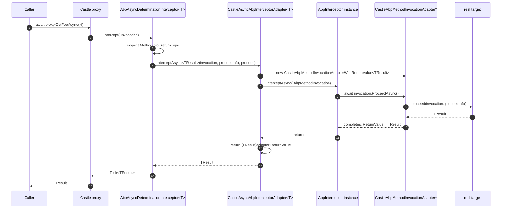

ABP's cross-cutting concerns — unit-of-work, auditing, authorization, caching, distributed locking — are all implemented as interceptors that conform to a tiny abstraction in `Volo.Abp.Core`:

```csharp
public interface IAbpInterceptor
{
    Task InterceptAsync(IAbpMethodInvocation invocation);
}
```

That abstraction is intentionally proxy-engine-agnostic. **`Volo.Abp.Castle.Core`** is the package that makes it run on top of [Castle DynamicProxy](https://github.com/castleproject/Core) and the [Castle.Core.AsyncInterceptor](https://github.com/JSkimming/Castle.Core.AsyncInterceptor) addon, with correct handling of synchronous, `Task`, and `Task<T>`-returning methods.

This page walks the package's five code files, how each one bridges Castle types to ABP types, and the async-determination flow that turns one Castle `IInvocation` into a single `IAbpInterceptor.InterceptAsync(IAbpMethodInvocation)` call regardless of the intercepted method's actual return shape.

## Package shape

`Volo.Abp.Castle.Core.csproj` multi-targets `netstandard2.0;netstandard2.1;net7.0`, references two Castle packages, and project-references `Volo.Abp.Core`:

```xml
<PackageReference Include="Castle.Core" Version="5.1.1" />
<PackageReference Include="Castle.Core.AsyncInterceptor" Version="2.1.0" />

<ProjectReference Include="..\Volo.Abp.Core\Volo.Abp.Core.csproj" />
```

`Castle.Core` provides `DynamicProxy` (the IL emitter that generates proxy classes, plus the `IInvocation`/`IInterceptor` interfaces). `Castle.Core.AsyncInterceptor` provides the higher-level `AsyncInterceptorBase` and `AsyncDeterminationInterceptor` types that hide the synchronous-vs-`Task`-vs-`Task<T>` complexity.

### File inventory

| Path under `framework/src/Volo.Abp.Castle.Core/` | Type / role | Summary |
| --- | --- | --- |
| `Volo/Abp/Castle/AbpCastleCoreModule.cs` | `AbpModule` | Registers `AbpAsyncDeterminationInterceptor<>` as transient in DI. |
| `Volo/Abp/Castle/DynamicProxy/AbpAsyncDeterminationInterceptor.cs` | `AsyncDeterminationInterceptor` subclass | Generic wrapper that takes a concrete `IAbpInterceptor` and feeds it to `CastleAsyncAbpInterceptorAdapter<T>`. This is the type Autofac wires via `InterceptedBy(...)`. |
| `Volo/Abp/Castle/DynamicProxy/CastleAsyncAbpInterceptorAdapter.cs` | `AsyncInterceptorBase` subclass | Translates Castle's `InterceptAsync` (split into void/return-value overloads) into a single `IAbpInterceptor.InterceptAsync(IAbpMethodInvocation)` call. |
| `Volo/Abp/Castle/DynamicProxy/CastleAbpMethodInvocationAdapterBase.cs` | abstract `IAbpMethodInvocation` | Implements the read-only/shared portions: `Arguments`, `ArgumentsDictionary`, `GenericArguments`, `TargetObject`, `Method`, `ReturnValue`. |
| `Volo/Abp/Castle/DynamicProxy/CastleAbpMethodInvocationAdapter.cs` | sealed adapter | `ProceedAsync` for `void` / `Task`-returning calls — awaits `Proceed(invocation, proceedInfo)`. |
| `Volo/Abp/Castle/DynamicProxy/CastleAbpMethodInvocationAdapterWithReturnValue.cs` | sealed generic adapter | `ProceedAsync` for `Task<TResult>` calls — awaits the `Task<TResult>` and stashes the result on `ReturnValue`. |
| `Volo.Abp.Castle.Core.csproj` | csproj | Targets & package references shown above. |
| `Volo.Abp.Castle.Core.abppkg.json`, `Volo.Abp.Castle.Core.abppkg.analyze.json` | abp package metadata | Marks the package for ABP's package graph tooling. |
| `FodyWeavers.xml`, `FodyWeavers.xsd` | Fody config | Shared `ConfigureAwait.Fody` configuration. |

Five C# files, ~120 lines of code total. The smallness is the point — this package is a translation layer, not a feature.

## How ABP defines a method invocation

The contract on the ABP side is in `Volo.Abp.Core/Volo/Abp/DynamicProxy/`:

```csharp
public interface IAbpMethodInvocation
{
    object[] Arguments { get; }

    IReadOnlyDictionary<string, object> ArgumentsDictionary { get; }

    Type[] GenericArguments { get; }

    object TargetObject { get; }

    MethodInfo Method { get; }

    object ReturnValue { get; set; }

    Task ProceedAsync();
}
```

An interceptor receives an `IAbpMethodInvocation`, reads `Arguments`/`Method`/`TargetObject`, optionally calls `ProceedAsync()` to invoke the next interceptor (or the real method), then optionally writes back `ReturnValue`. The interface is deliberately small and entirely async: there is no sync `Proceed()`. That makes ABP interceptors composable across sync and async target methods — but it means the bridge to Castle has to do real work to maintain that illusion. That work is what this package contains.

The intercepted target's own contract on the ABP side:

```csharp
public interface IAbpInterceptor
{
    Task InterceptAsync(IAbpMethodInvocation invocation);
}

public abstract class AbpInterceptor : IAbpInterceptor
{
    public abstract Task InterceptAsync(IAbpMethodInvocation invocation);
}
```

That `Task InterceptAsync(IAbpMethodInvocation)` shape is what every concrete ABP interceptor — `UnitOfWorkInterceptor`, `AbpAuthorizationInterceptor`, `AuditingInterceptor`, etc. — implements.

## The module: parking the wrapper in DI

`Volo/Abp/Castle/AbpCastleCoreModule.cs` does exactly one thing:

```csharp
public class AbpCastleCoreModule : AbpModule
{
    public override void ConfigureServices(ServiceConfigurationContext context)
    {
        context.Services.AddTransient(typeof(AbpAsyncDeterminationInterceptor<>));
    }
}
```

Two notes:

- **Registration is for the open generic type definition.** `AbpAsyncDeterminationInterceptor<>` is generic over a type parameter `TInterceptor : IAbpInterceptor`. When Autofac later asks the DI container for `AbpAsyncDeterminationInterceptor<UnitOfWorkInterceptor>`, the open-generic registration produces a closed instance.
- **Transient lifetime is required.** Each proxy needs its own interceptor instance because `AsyncInterceptorBase` carries internal continuation state per call. Re-using a singleton would race across concurrent intercepted calls.

This module is what `AbpAutofacModule` `DependsOn`. The dependency direction is `AbpAutofacModule → AbpCastleCoreModule`, never the other way: Castle.Core has no Autofac dependency and could in principle be reused under a different proxy engine.

## The Autofac-facing wrapper

`Volo/Abp/Castle/DynamicProxy/AbpAsyncDeterminationInterceptor.cs`:

```csharp
public class AbpAsyncDeterminationInterceptor<TInterceptor> : AsyncDeterminationInterceptor
    where TInterceptor : IAbpInterceptor
{
    public AbpAsyncDeterminationInterceptor(TInterceptor abpInterceptor)
        : base(new CastleAsyncAbpInterceptorAdapter<TInterceptor>(abpInterceptor))
    {

    }
}
```

`AsyncDeterminationInterceptor` (from `Castle.Core.AsyncInterceptor`) implements Castle's `IInterceptor`. Its job: inspect the intercepted method's return type and route the call to the right `InterceptAsync` overload on its inner `IAsyncInterceptor`. There are three routes:

- `void`-returning or "fire-and-forget" sync method → call the inner interceptor's void path.
- `Task`-returning method → call the inner interceptor's `Task` path.
- `Task<TResult>`-returning method → call the inner interceptor's `Task<TResult>` path.

That routing is done by `AsyncDeterminationInterceptor`. Subclassing it and passing a custom `IAsyncInterceptor` (here `CastleAsyncAbpInterceptorAdapter<TInterceptor>`) is the entire Castle integration.

The generic constraint `where TInterceptor : IAbpInterceptor` is what makes the closed types meaningful. When Autofac builds a proxy for, say, `IFooAppService` and the `OnServiceRegistredContext.Interceptors` list contains `typeof(UnitOfWorkInterceptor)`, `AbpRegistrationBuilderExtensions.AddInterceptors` (see [`/framework/di/autofac`](/framework/di/autofac)) does:

```csharp
registrationBuilder.InterceptedBy(
    typeof(AbpAsyncDeterminationInterceptor<>).MakeGenericType(interceptor)
);
```

i.e. it registers `AbpAsyncDeterminationInterceptor<UnitOfWorkInterceptor>` as the Castle interceptor for the proxy. When the container resolves that type for the proxy, DI picks up the open-generic registration from `AbpCastleCoreModule.ConfigureServices`, constructs `AbpAsyncDeterminationInterceptor<UnitOfWorkInterceptor>`, which constructor-injects a `UnitOfWorkInterceptor`, which is wrapped in `CastleAsyncAbpInterceptorAdapter<UnitOfWorkInterceptor>` and passed up to `AsyncDeterminationInterceptor`.

## The async interceptor adapter

`Volo/Abp/Castle/DynamicProxy/CastleAsyncAbpInterceptorAdapter.cs` is the Castle-side `IAsyncInterceptor` that `AsyncDeterminationInterceptor` will call:

```csharp
public class CastleAsyncAbpInterceptorAdapter<TInterceptor> : AsyncInterceptorBase
    where TInterceptor : IAbpInterceptor
{
    private readonly TInterceptor _abpInterceptor;

    public CastleAsyncAbpInterceptorAdapter(TInterceptor abpInterceptor)
    {
        _abpInterceptor = abpInterceptor;
    }

    protected override async Task InterceptAsync(
        IInvocation invocation,
        IInvocationProceedInfo proceedInfo,
        Func<IInvocation, IInvocationProceedInfo, Task> proceed)
    {
        await _abpInterceptor.InterceptAsync(
            new CastleAbpMethodInvocationAdapter(invocation, proceedInfo, proceed)
        );
    }

    protected override async Task<TResult> InterceptAsync<TResult>(
        IInvocation invocation,
        IInvocationProceedInfo proceedInfo,
        Func<IInvocation, IInvocationProceedInfo, Task<TResult>> proceed)
    {
        var adapter = new CastleAbpMethodInvocationAdapterWithReturnValue<TResult>(
            invocation, proceedInfo, proceed);

        await _abpInterceptor.InterceptAsync(adapter);

        return (TResult)adapter.ReturnValue;
    }
}
```

`AsyncInterceptorBase` (from `Castle.Core.AsyncInterceptor`) is the type that lets you write a single async method and have it transparently handle both `Task` and `Task<TResult>` return shapes — but you write two overloads, one for each shape. ABP collapses those two overloads into a single call into `_abpInterceptor.InterceptAsync(...)`, with the only difference being **which adapter type wraps the invocation**.

The mechanics of "is this a sync method, a `Task`, or a `Task<T>`?":

- `AsyncDeterminationInterceptor` reads the `MethodInfo` from the `IInvocation` and inspects the return type at proxy-call time.
- For sync and `Task` methods → it calls the `InterceptAsync(IInvocation, IInvocationProceedInfo, Func<...,Task>)` overload above.
- For `Task<TResult>` methods → it builds a generic dispatch and calls `InterceptAsync<TResult>(IInvocation, IInvocationProceedInfo, Func<...,Task<TResult>>)`.

For the `Task<TResult>` path, note the order of operations carefully:

1. Construct a `CastleAbpMethodInvocationAdapterWithReturnValue<TResult>` carrying the proceed delegate.
2. Call into `_abpInterceptor.InterceptAsync(adapter)`. The ABP interceptor may call `await adapter.ProceedAsync()`, which awaits the real call and writes the result onto `adapter.ReturnValue`. The interceptor may then read/modify `ReturnValue`.
3. Cast `adapter.ReturnValue` back to `TResult` and return it. The cast is necessary because `IAbpMethodInvocation.ReturnValue` is typed `object`.

A subtle point: **if the ABP interceptor never calls `ProceedAsync()`**, `ReturnValue` stays at its default (`default!` — which is `null` for reference types). The cast `(TResult)adapter.ReturnValue` will throw `NullReferenceException` if `TResult` is a non-nullable value type, but is safe for reference types. This matches the "if you skip Proceed you must set ReturnValue" contract.

For the void/`Task` path the same skip-Proceed behavior is benign because there's no value to return.

## The method invocation adapters

All three adapter classes share a common base.

### Shared base: `CastleAbpMethodInvocationAdapterBase`

`Volo/Abp/Castle/DynamicProxy/CastleAbpMethodInvocationAdapterBase.cs`:

```csharp
public abstract class CastleAbpMethodInvocationAdapterBase : IAbpMethodInvocation
{
    public object[] Arguments => Invocation.Arguments;

    public IReadOnlyDictionary<string, object> ArgumentsDictionary => _lazyArgumentsDictionary.Value;
    private readonly Lazy<IReadOnlyDictionary<string, object>> _lazyArgumentsDictionary;

    public Type[] GenericArguments => Invocation.GenericArguments;

    public object TargetObject => Invocation.InvocationTarget ?? Invocation.MethodInvocationTarget;

    public MethodInfo Method => Invocation.MethodInvocationTarget ?? Invocation.Method;

    public object ReturnValue { get; set; } = default!;

    protected IInvocation Invocation { get; }

    protected CastleAbpMethodInvocationAdapterBase(IInvocation invocation)
    {
        Invocation = invocation;
        _lazyArgumentsDictionary = new Lazy<IReadOnlyDictionary<string, object>>(GetArgumentsDictionary);
    }

    public abstract Task ProceedAsync();

    private IReadOnlyDictionary<string, object> GetArgumentsDictionary()
    {
        var dict = new Dictionary<string, object>();

        var methodParameters = Method.GetParameters();
        for (int i = 0; i < methodParameters.Length; i++)
        {
            dict[methodParameters[i].Name!] = Invocation.Arguments[i];
        }

        return dict;
    }
}
```

Behavioral notes:

- **`Arguments` is the same array Castle holds**, not a copy. Mutating it through `IAbpMethodInvocation.Arguments[0] = newVal` mutates the actual call arguments for the inner proceed — that's how some ABP interceptors rewrite arguments.
- **`ArgumentsDictionary` is lazy.** The dictionary is built only if an interceptor actually asks for it, which avoids the per-call allocation cost for the common case where interceptors use `Arguments` directly. The dictionary maps parameter name → value, using `ParameterInfo.Name`.
- **`TargetObject` and `Method` prefer `MethodInvocationTarget` over `Method`.** This is critical for class proxies where the proxy's generated method is a different `MethodInfo` than the target class's real method. `MethodInvocationTarget` is Castle's accessor for "the actual method that will be invoked on the target class"; falling back to `Method` covers the interface-proxy case (no concrete target method).
- **`Invocation.InvocationTarget`** is null for some Castle proxy configurations (notably proxies-without-target); falling back to `MethodInvocationTarget`'s declaring instance is the safety net.
- **`ReturnValue` defaults to `default!`** — i.e. `null` annotated as non-null. The nullable-warning suppression here is intentional; the contract is "non-null on return for value types only if an interceptor sets it."
- **The `Invocation` property is `protected`** so the two derived adapters can pass it to their proceed delegates. The interface contract intentionally hides Castle types from ABP interceptors.

### Void / `Task` adapter

`Volo/Abp/Castle/DynamicProxy/CastleAbpMethodInvocationAdapter.cs`:

```csharp
public class CastleAbpMethodInvocationAdapter : CastleAbpMethodInvocationAdapterBase, IAbpMethodInvocation
{
    protected IInvocationProceedInfo ProceedInfo { get; }
    protected Func<IInvocation, IInvocationProceedInfo, Task> Proceed { get; }

    public CastleAbpMethodInvocationAdapter(
        IInvocation invocation,
        IInvocationProceedInfo proceedInfo,
        Func<IInvocation, IInvocationProceedInfo, Task> proceed)
        : base(invocation)
    {
        ProceedInfo = proceedInfo;
        Proceed = proceed;
    }

    public override async Task ProceedAsync()
    {
        await Proceed(Invocation, ProceedInfo);
    }
}
```

Used for `void`-returning and `Task`-returning method calls. The `Proceed` delegate is the one `AsyncInterceptorBase` supplies — when called it advances to the next interceptor (or to the real method) and returns a `Task` that completes when the inner call completes. The adapter simply forwards.

### `Task<TResult>` adapter

`Volo/Abp/Castle/DynamicProxy/CastleAbpMethodInvocationAdapterWithReturnValue.cs`:

```csharp
public class CastleAbpMethodInvocationAdapterWithReturnValue<TResult>
    : CastleAbpMethodInvocationAdapterBase, IAbpMethodInvocation
{
    protected IInvocationProceedInfo ProceedInfo { get; }
    protected Func<IInvocation, IInvocationProceedInfo, Task<TResult>> Proceed { get; }

    public CastleAbpMethodInvocationAdapterWithReturnValue(
        IInvocation invocation,
        IInvocationProceedInfo proceedInfo,
        Func<IInvocation, IInvocationProceedInfo, Task<TResult>> proceed)
        : base(invocation)
    {
        ProceedInfo = proceedInfo;
        Proceed = proceed;
    }

    public override async Task ProceedAsync()
    {
        ReturnValue = (await Proceed(Invocation, ProceedInfo))!;
    }
}
```

This is the only structural difference from the void adapter: after awaiting the proceed delegate, the `TResult` is stored on `ReturnValue` (boxed if it's a value type). The `!` operator suppresses a nullable warning — `Proceed` could legitimately return `null` for reference `TResult` types, and the adapter is happy to set `ReturnValue = null`. The ABP interceptor reads it back and possibly mutates it. On return from `InterceptAsync` (in `CastleAsyncAbpInterceptorAdapter<T>.InterceptAsync<TResult>`), the final `(TResult)adapter.ReturnValue` cast hands it back to Castle.

## End-to-end interception flow



The path looks deep but it's the same call stack on every intercepted invocation: caller → Castle proxy → `AbpAsyncDeterminationInterceptor<T>` → `AsyncDeterminationInterceptor` → `CastleAsyncAbpInterceptorAdapter<T>` → ABP `IAbpInterceptor` → back through `IAbpMethodInvocation.ProceedAsync` → Castle proceed delegate → real method.

For void/`Task` calls the diagram is identical except `MIA` is `CastleAbpMethodInvocationAdapter` (no generic), no `(TResult)` cast happens, and `Proxy → Caller` returns `Task` instead of `Task<TResult>`.

## Connection to `Volo.Abp.Core/Volo/Abp/DynamicProxy/`

`Volo.Abp.Core` ships **only** the abstractions:

- `IAbpInterceptor` — single method `Task InterceptAsync(IAbpMethodInvocation)`.
- `IAbpMethodInvocation` — properties + `Task ProceedAsync()`.
- `AbpInterceptor` — abstract base class that just re-declares `InterceptAsync` as abstract.
- `ProxyHelper.UnProxy(object)` and `GetUnProxiedType(object)` — utilities that walk a Castle proxy's internal `__target` field (matched on namespace `"Castle.Proxies"`) to recover the original instance/type.

The `ProxyHelper` is interesting because it's the **one place** `Volo.Abp.Core` knows about Castle by name:

```csharp
private const string ProxyNamespace = "Castle.Proxies";

public static object UnProxy(object obj)
{
    if (obj.GetType().Namespace != ProxyNamespace)
    {
        return obj;
    }

    var targetField = obj.GetType()
        .GetFields(BindingFlags.Instance | BindingFlags.NonPublic)
        .FirstOrDefault(f => f.Name == "__target");

    if (targetField == null)
    {
        return obj;
    }

    return targetField.GetValue(obj)!;
}
```

Castle DynamicProxy puts generated proxy types in the `Castle.Proxies` namespace and stores the target on a private field named `__target`. ABP relies on those two stable conventions to "see through" a proxy when, for example, the entity framework wants the raw entity type and not the proxy type.

- For class proxies whose underlying target is the same proxy instance (because Castle uses `IInvocation.InvocationTarget = this`), `__target` is null/absent and `UnProxy` falls back to returning the proxy unchanged; `GetUnProxiedType` then walks one level up the inheritance chain via `BaseType`.
- For interface proxies the `__target` field holds the real instance and `UnProxy` returns it directly.

All other Castle types are confined to this package (`Volo.Abp.Castle.Core`). That means swapping to a different proxy engine — `DispatchProxy`, `LinFu`, etc. — would only need a new "Castle.Core"-shaped package, not changes to core ABP.

## How interceptors meet Autofac

The end-to-end story across the three pages in this section:

1. A conventional registrar (e.g. `UnitOfWorkInterceptorRegistrar`, in some downstream module's `ConfigureServices`) appends an `Action<IOnServiceRegistredContext>` to the `ServiceRegistrationActionList` ([`/framework/core/dependency-injection`](/framework/core/dependency-injection)).
2. When `AbpAutofacServiceProviderFactory.CreateBuilder` runs and `AutofacRegistration.Register` walks descriptors, every registration is funneled through `ConfigureAbpConventions`, which calls `InvokeRegistrationActions`. The registration action inspects `OnServiceRegistredContext.ImplementationType` and (if the type should be intercepted) appends a Castle interceptor type to `context.Interceptors`.
3. `AddInterceptors` calls `EnableInterfaceInterceptors()` or `EnableClassInterceptors()` on the Autofac registration builder, then `.InterceptedBy(typeof(AbpAsyncDeterminationInterceptor<>).MakeGenericType(interceptor))` for each interceptor type ([`/framework/di/autofac`](/framework/di/autofac)).
4. At resolution time, Autofac builds a Castle dynamic proxy. The interceptor `AbpAsyncDeterminationInterceptor<TInterceptor>` is resolved through DI thanks to the open-generic registration in `AbpCastleCoreModule`. It carries a `CastleAsyncAbpInterceptorAdapter<TInterceptor>` that wraps the actual `TInterceptor` instance (also resolved through DI).
5. On call, Castle's `IInvocation` enters the adapter chain. The adapter constructs a `CastleAbpMethodInvocationAdapter` (or `WithReturnValue<TResult>` variant), then invokes the user-written `IAbpInterceptor.InterceptAsync(IAbpMethodInvocation)`. The user code never sees Castle types.

## Gotchas and edges

- **Open generic class interception isn't wired.** `AbpRegistrationBuilderExtensions.AddInterceptors` casts to `IRegistrationBuilder<TLimit, ConcreteReflectionActivatorData, TRegistrationStyle>` before calling `EnableClassInterceptors()`. `RegisterGeneric(...)` returns `ReflectionActivatorData` (not the "Concrete" flavor), so the null-conditional cast silently drops interception for open-generic class registrations. Use interfaces if you need open-generic interception. (See [`/framework/di/autofac`](/framework/di/autofac).)
- **`ReturnValue = default!`.** If your interceptor short-circuits and never calls `ProceedAsync()`, the `(TResult)adapter.ReturnValue` cast in `CastleAsyncAbpInterceptorAdapter<T>.InterceptAsync<TResult>` will throw `NullReferenceException` for non-nullable value-type `TResult`s. Always set `invocation.ReturnValue` to a sensible value when skipping proceed.
- **`Arguments` is the live Castle array.** Mutating `invocation.Arguments[i]` mutates the actual call arguments — useful for arg rewriting, but easy to do by accident.
- **`ArgumentsDictionary` requires `MethodInfo.ParameterInfo.Name` to be non-null.** The dictionary builder uses `methodParameters[i].Name!`. Parameter names are stripped only in unusual scenarios (very old ref assemblies); for normal compiled assemblies they're present.
- **`AbpAsyncDeterminationInterceptor<>` must be resolved transiently.** `AbpCastleCoreModule.ConfigureServices` registers it as transient for that reason. If a downstream module re-registers it as a singleton (don't), concurrent calls through the same proxy will trample `AsyncInterceptorBase` state.
- **Blazor WebAssembly requires an extra workaround.** `Castle.DynamicProxy.Generators.AttributesToAvoidReplicating.Add<AsyncStateMachineAttribute>()` is called by `AbpWebAssemblyHostBuilderExtensions.AddApplicationAsync` because the AOT IL rewriting in Blazor cannot replicate `AsyncStateMachineAttribute`. The Castle.Core dependency itself supports WASM; only this one attribute needs to be excluded. (See [`/framework/di/autofac-webassembly`](/framework/di/autofac-webassembly).)
- **Proxies live in the `Castle.Proxies` namespace.** `ProxyHelper.UnProxy` and `GetUnProxiedType` rely on this constant. Anything that generates types in that namespace and isn't a Castle proxy would confuse the un-proxy walk — there are no known instances in the ABP codebase.

## Related pages

- [`/framework/di/autofac`](/framework/di/autofac) — `AbpAsyncDeterminationInterceptor<T>` is registered as a Castle interceptor by `AbpRegistrationBuilderExtensions.AddInterceptors`; that page covers the call to `EnableInterfaceInterceptors`/`EnableClassInterceptors` and `InterceptedBy`.
- [`/framework/di/autofac-webassembly`](/framework/di/autofac-webassembly) — the `AttributesToAvoidReplicating.Add<AsyncStateMachineAttribute>()` workaround and how the Castle pipeline runs in the browser.
- [`/framework/core/dependency-injection`](/framework/core/dependency-injection) — `IAbpInterceptor`, `IAbpMethodInvocation`, `OnServiceRegistredContext.Interceptors`, and the conventional-registrar pipeline that decides which classes get which interceptors.
- [`/flows/application-startup`](/flows/application-startup) — where `AbpCastleCoreModule.ConfigureServices` actually runs in the module load order, and how `AbpApplicationFactory.CreateAsync` arranges for the open-generic interceptor registration to be visible by the time Autofac populates.
