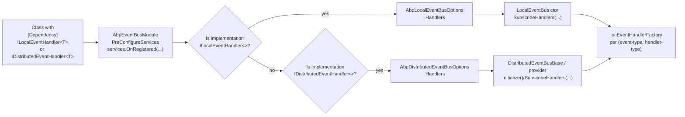

`Volo.Abp.EventBus.Abstractions` is the **dependency-free contract package** that every other EventBus assembly — `Volo.Abp.EventBus`, `Volo.Abp.EventBus.RabbitMQ`, `Volo.Abp.EventBus.Kafka`, `Volo.Abp.EventBus.Azure`, `Volo.Abp.EventBus.Rebus`, and `Volo.Abp.EventBus.Dapr` — references. It has exactly one ABP dependency (`AbpObjectExtendingModule`) and ships only:

- The **bus interfaces** (`IEventBus`, `ILocalEventBus`, `IDistributedEventBus`).
- The **handler interfaces** (`IEventHandler`, `ILocalEventHandler<T>`, `IDistributedEventHandler<T>`).
- The **factory / invoker / dispose-wrapper** primitives that the runtime uses to resolve handlers from DI.
- **Event-naming** (`EventNameAttribute`, `GenericEventNameAttribute`, `IEventNameProvider`).
- The **inbox / outbox DTO surface** (`IncomingEventInfo`, `OutgoingEventInfo`, `InboxConfig`, `OutboxConfig`, `IEventInbox`, `IEventOutbox`, `IInboxProcessor`, `IOutboxSender`, `ISupportsEventBoxes`).
- Two **diagnostic** events (`DistributedEventSent`, `DistributedEventReceived`) and the `DistributedEventSource` enum.
- The `EtoBase` base for event-transfer-objects (under `Volo.Abp.Domain.Entities.Events.Distributed`).

Because everything in this package is an interface or a small POCO, **applications and other infrastructure modules can take a hard dependency on it without pulling in `Volo.Abp.EventBus`'s runtime services** (timers, background workers, distributed lock, JSON serializer, etc.). That separation is what lets `IDistributedCache`, `IRepository`, and ABP's UnitOfWork inject `IDistributedEventBus` into application code without dragging in RabbitMQ or Kafka transitively.

## File inventory

| File | Purpose |
| --- | --- |
| `Volo/Abp/EventBus/Abstractions/AbpEventBusAbstractionsModule.cs` | Marker module — `[DependsOn(typeof(AbpObjectExtendingModule))]`. No runtime services. |
| `Volo/Abp/EventBus/IEventBus.cs` | Root bus contract: `PublishAsync`, eight `Subscribe`/`Unsubscribe` overloads, `UnsubscribeAll`. |
| `Volo/Abp/EventBus/Local/ILocalEventBus.cs` | Adds `Subscribe<TEvent>(ILocalEventHandler<TEvent>)`. |
| `Volo/Abp/EventBus/Distributed/IDistributedEventBus.cs` | Adds `Subscribe<TEvent>(IDistributedEventHandler<TEvent>)` and `PublishAsync(..., useOutbox)`. |
| `Volo/Abp/EventBus/IEventHandler.cs` | Empty marker interface. Implement `ILocalEventHandler<>` or `IDistributedEventHandler<>` instead. |
| `Volo/Abp/EventBus/Local/ILocalEventHandler.cs` | `Task HandleEventAsync(TEvent eventData)`. |
| `Volo/Abp/EventBus/Distributed/IDistributedEventHandler.cs` | Same signature, different marker so the runtime can tell them apart. |
| `Volo/Abp/EventBus/IEventHandlerFactory.cs` | `GetHandler()` + `IsInFactories(...)`. Resolves/releases handlers from DI. |
| `Volo/Abp/EventBus/IEventHandlerInvoker.cs` | `Task InvokeAsync(IEventHandler, object eventData, Type eventType)`. |
| `Volo/Abp/EventBus/IEventHandlerDisposeWrapper.cs` | `IDisposable` wrapper carrying the `IEventHandler` resolved by the factory. |
| `Volo/Abp/EventBus/EventNameAttribute.cs` | `[EventName("user.created")]` + `GetNameOrDefault(Type)`. |
| `Volo/Abp/EventBus/GenericEventNameAttribute.cs` | Picks the name from the single generic argument with optional prefix/postfix. |
| `Volo/Abp/EventBus/IEventNameProvider.cs` | One-method contract that both attributes implement. |
| `Volo/Abp/EventBus/IEventDataMayHaveTenantId.cs` | Optional contract — let the bus resolve the tenant scope before invoking handlers. |
| `Volo/Abp/EventBus/IEventDataWithInheritableGenericArgument.cs` | Cascade `EntityCreatedEventData<Student>` ⇒ `EntityCreatedEventData<Person>`. |
| `Volo/Abp/EventBus/EventBusConsts.cs` | `CorrelationIdHeaderName = "X-Correlation-Id"`. |
| `Volo/Abp/EventBus/Local/LocalEventHandlerOrderAttribute.cs` | `[LocalEventHandlerOrder(10)]` — ordered execution per event type. |
| `Volo/Abp/EventBus/Distributed/IEventInbox.cs` | Inbox storage contract — enqueue, get-waiting, mark-as-processed, dedup, cleanup. |
| `Volo/Abp/EventBus/Distributed/IEventOutbox.cs` | Outbox storage contract — enqueue, get-waiting, delete (single/many). |
| `Volo/Abp/EventBus/Distributed/IInboxProcessor.cs` | Lifecycle: `StartAsync(InboxConfig)`, `StopAsync()`. |
| `Volo/Abp/EventBus/Distributed/IOutboxSender.cs` | Lifecycle: `StartAsync(OutboxConfig)`, `StopAsync()`. |
| `Volo/Abp/EventBus/Distributed/ISupportsEventBoxes.cs` | Implemented by providers that can publish from outbox / process from inbox. |
| `Volo/Abp/EventBus/Distributed/InboxConfig.cs` | Per-inbox name, database, type, event/handler selectors, `IsProcessingEnabled`. |
| `Volo/Abp/EventBus/Distributed/OutboxConfig.cs` | Per-outbox name, database, type, selector, `IsSendingEnabled`. |
| `Volo/Abp/EventBus/Distributed/InboxConfigDictionary.cs` | `Configure("Default", x => …)` helper over `Dictionary<string, InboxConfig>`. |
| `Volo/Abp/EventBus/Distributed/OutboxConfigDictionary.cs` | Same shape for outboxes. |
| `Volo/Abp/EventBus/Distributed/IncomingEventInfo.cs` | Inbox row DTO — `Id`, `MessageId`, `EventName`, `EventData (byte[])`, extra props. |
| `Volo/Abp/EventBus/Distributed/OutgoingEventInfo.cs` | Outbox row DTO — same shape without `MessageId`. |
| `Volo/Abp/EventBus/Distributed/DistributedEventSent.cs` | Diagnostic local event — published by the bus when something leaves. |
| `Volo/Abp/EventBus/Distributed/DistributedEventReceived.cs` | Diagnostic local event — published when something arrives. |
| `Volo/Abp/EventBus/Distributed/DistributedEventSource.cs` | `Direct | Inbox | Outbox`. |
| `Volo/Abp/Domain/Entities/Events/Distributed/EtoBase.cs` | `[Serializable]` base for ETOs with a `Dictionary<string,string> Properties` bag. |

## The module

`AbpEventBusAbstractionsModule` is intentionally hollow — it has no `ConfigureServices` override. Its only job is to drag in `AbpObjectExtendingModule` so that `IncomingEventInfo` / `OutgoingEventInfo` can carry an `ExtraPropertyDictionary` with whatever fields the application has registered as extended.

```csharp title="AbpEventBusAbstractionsModule.cs"
[DependsOn(typeof(AbpObjectExtendingModule))]
public class AbpEventBusAbstractionsModule : AbpModule
{
}
```

<Note>
You will rarely depend on this module directly. `Volo.Abp.EventBus` declares it as a transitive dependency, so anything that depends on the runtime EventBus already gets it.
</Note>

## Key abstractions

| Symbol | Kind | File |
| --- | --- | --- |
| `IEventBus` | interface | `Volo/Abp/EventBus/IEventBus.cs` |
| `ILocalEventBus : IEventBus` | interface | `Volo/Abp/EventBus/Local/ILocalEventBus.cs` |
| `IDistributedEventBus : IEventBus` | interface | `Volo/Abp/EventBus/Distributed/IDistributedEventBus.cs` |
| `IEventHandler` | marker | `Volo/Abp/EventBus/IEventHandler.cs` |
| `ILocalEventHandler<in TEvent>` | interface | `Volo/Abp/EventBus/Local/ILocalEventHandler.cs` |
| `IDistributedEventHandler<in TEvent>` | interface | `Volo/Abp/EventBus/Distributed/IDistributedEventHandler.cs` |
| `IEventHandlerFactory` | interface | `Volo/Abp/EventBus/IEventHandlerFactory.cs` |
| `IEventHandlerInvoker` | interface | `Volo/Abp/EventBus/IEventHandlerInvoker.cs` |
| `IEventHandlerDisposeWrapper` | interface | `Volo/Abp/EventBus/IEventHandlerDisposeWrapper.cs` |
| `EventNameAttribute` | attribute | `Volo/Abp/EventBus/EventNameAttribute.cs` |
| `GenericEventNameAttribute` | attribute | `Volo/Abp/EventBus/GenericEventNameAttribute.cs` |
| `IEventNameProvider` | interface | `Volo/Abp/EventBus/IEventNameProvider.cs` |
| `LocalEventHandlerOrderAttribute` | attribute | `Volo/Abp/EventBus/Local/LocalEventHandlerOrderAttribute.cs` |
| `IEventInbox` / `IEventOutbox` | interfaces | `Volo/Abp/EventBus/Distributed/` |
| `IInboxProcessor` / `IOutboxSender` | lifecycle interfaces | `Volo/Abp/EventBus/Distributed/` |
| `ISupportsEventBoxes` | provider capability | `Volo/Abp/EventBus/Distributed/ISupportsEventBoxes.cs` |
| `InboxConfig` / `OutboxConfig` | DTO | `Volo/Abp/EventBus/Distributed/` |
| `IncomingEventInfo` / `OutgoingEventInfo` | DTO | `Volo/Abp/EventBus/Distributed/` |
| `DistributedEventSent` / `DistributedEventReceived` | local event | `Volo/Abp/EventBus/Distributed/` |
| `DistributedEventSource` | enum (`Direct | Inbox | Outbox`) | `Volo/Abp/EventBus/Distributed/DistributedEventSource.cs` |
| `EtoBase` | abstract class | `Volo/Abp/Domain/Entities/Events/Distributed/EtoBase.cs` |
| `EventBusConsts.CorrelationIdHeaderName` | const string | `Volo/Abp/EventBus/EventBusConsts.cs` |

## `IEventBus` — the publish / subscribe surface

Every bus, local or distributed, implements this interface. The publishing side is two overloads (generic and `Type`-based) and the subscription side has eight overloads — three handler shapes (`Func<T,Task>`, `IEventHandler` instance, `IEventHandlerFactory`) crossed with strongly-typed / `Type`-based / new-instance variants.

```csharp title="IEventBus.cs (excerpt)"
public interface IEventBus
{
    Task PublishAsync<TEvent>(TEvent eventData, bool onUnitOfWorkComplete = true)
        where TEvent : class;

    Task PublishAsync(Type eventType, object eventData, bool onUnitOfWorkComplete = true);

    IDisposable Subscribe<TEvent>(Func<TEvent, Task> action)
        where TEvent : class;

    IDisposable Subscribe<TEvent, THandler>()
        where TEvent : class
        where THandler : IEventHandler, new();

    IDisposable Subscribe(Type eventType, IEventHandler handler);

    IDisposable Subscribe<TEvent>(IEventHandlerFactory factory) where TEvent : class;
    IDisposable Subscribe(Type eventType, IEventHandlerFactory factory);

    void Unsubscribe<TEvent>(Func<TEvent, Task> action) where TEvent : class;
    void Unsubscribe<TEvent>(ILocalEventHandler<TEvent> handler) where TEvent : class;
    void Unsubscribe(Type eventType, IEventHandler handler);
    void Unsubscribe<TEvent>(IEventHandlerFactory factory) where TEvent : class;
    void Unsubscribe(Type eventType, IEventHandlerFactory factory);
    void UnsubscribeAll<TEvent>() where TEvent : class;
    void UnsubscribeAll(Type eventType);
}
```

The `onUnitOfWorkComplete = true` default is what powers ABP's transactional outbox semantics: when a UoW is open, the publish is **deferred to `IUnitOfWork.OnCompleted`** instead of being dispatched immediately. See [Local EventBus](/framework/eventbus/local-eventbus) and [Distributed EventBus](/framework/eventbus/distributed-eventbus) for how that deferral is wired through `EventBusBase.PublishAsync` and `UnitOfWorkEventPublisher`.

### `ILocalEventBus`

Adds **exactly one** member over `IEventBus` — a strongly-typed subscribe overload for `ILocalEventHandler<TEvent>` instances:

```csharp title="ILocalEventBus.cs"
public interface ILocalEventBus : IEventBus
{
    IDisposable Subscribe<TEvent>(ILocalEventHandler<TEvent> handler) where TEvent : class;
}
```

### `IDistributedEventBus`

Adds the equivalent `IDistributedEventHandler<TEvent>` overload **and** the `useOutbox` flag on `PublishAsync`. That flag is the entry point for the [Inbox/Outbox](/framework/eventbus/inbox-outbox) pattern:

```csharp title="IDistributedEventBus.cs"
public interface IDistributedEventBus : IEventBus
{
    IDisposable Subscribe<TEvent>(IDistributedEventHandler<TEvent> handler)
        where TEvent : class;

    Task PublishAsync<TEvent>(
        TEvent eventData,
        bool onUnitOfWorkComplete = true,
        bool useOutbox = true)
        where TEvent : class;

    Task PublishAsync(
        Type eventType,
        object eventData,
        bool onUnitOfWorkComplete = true,
        bool useOutbox = true);
}
```

<Tip>
`useOutbox: false` is rare but valid — set it when you publish a diagnostic / cross-cutting event that **must not** be tied to the current UoW's success.
</Tip>

## Handlers

```csharp title="IEventHandler.cs / ILocalEventHandler.cs / IDistributedEventHandler.cs"
public interface IEventHandler { }

public interface ILocalEventHandler<in TEvent> : IEventHandler
{
    Task HandleEventAsync(TEvent eventData);
}

public interface IDistributedEventHandler<in TEvent> : IEventHandler
{
    Task HandleEventAsync(TEvent eventData);
}
```

The two specialised interfaces have the **same signature** but the runtime treats them differently: `LocalEventBus` only routes to `ILocalEventHandler<>` implementations, while a distributed-bus provider (RabbitMQ, Kafka, Azure, Rebus, Dapr) only invokes `IDistributedEventHandler<>` implementations. Both markers extend the empty `IEventHandler` so `EventHandlerInvoker` can identify the right `IEventHandlerMethodExecutor` at runtime.

The same class **may implement both** — and frequently does when an event needs to be processed in-process *and* relayed across boundaries.

<CardGroup cols={2}>
<Card title="EventHandlerInvoker" icon="bolt" href="/framework/eventbus/local-eventbus">
Caches the right method executor per (handler-type, event-type) pair.
</Card>
<Card title="LocalEventHandlerOrderAttribute" icon="arrow-up-1-9">
Decorate a handler with `[LocalEventHandlerOrder(10)]` to force ascending execution order for the same event type.
</Card>
</CardGroup>

## Handler factories

`IEventHandlerFactory` is the indirection that decouples the bus from DI: it knows how to **produce** an `IEventHandler` and how to **release** it (via the `IEventHandlerDisposeWrapper`). The runtime ships three implementations — all in `Volo.Abp.EventBus`, not the abstractions:

| Implementation | When it's used | What `GetHandler()` returns |
| --- | --- | --- |
| `IocEventHandlerFactory` | Auto-subscription of DI-registered handlers. | A handler resolved from a fresh `IServiceScope`. Disposes the scope on release. |
| `SingleInstanceHandlerFactory` | `bus.Subscribe(type, handler)` overloads. | The same instance every time. |
| `TransientEventHandlerFactory(<T>)` | `bus.Subscribe<TEvent,THandler>()` overloads. | `new THandler()` every time. |

```csharp title="IEventHandlerFactory.cs"
public interface IEventHandlerFactory
{
    IEventHandlerDisposeWrapper GetHandler();
    bool IsInFactories(List<IEventHandlerFactory> handlerFactories);
}
```

`IsInFactories` is the **deduplication primitive**: when `Subscribe` is called with a factory equivalent to one already registered (same handler type, same instance, …), the new registration is silently dropped. Each implementation defines what "equivalent" means.

```csharp title="IEventHandlerDisposeWrapper.cs"
public interface IEventHandlerDisposeWrapper : IDisposable
{
    IEventHandler EventHandler { get; }
}
```

`IEventHandlerInvoker` is what actually calls `HandleEventAsync`. The default `EventHandlerInvoker` (a singleton in `Volo.Abp.EventBus`) caches a `LocalEventHandlerMethodExecutor<TEvent>` and/or `DistributedEventHandlerMethodExecutor<TEvent>` per handler-type/event-type pair:

```csharp title="IEventHandlerInvoker.cs"
public interface IEventHandlerInvoker
{
    Task InvokeAsync(IEventHandler eventHandler, object eventData, Type eventType);
}
```

## Event naming

In a distributed bus the **wire name** of an event is what gets put on the message broker — the RabbitMQ routing key, the Kafka message key, the Azure Service Bus `Subject`, the Dapr topic. By default it is `eventType.FullName`, but you can override per type via `[EventName("...")]` or, for generic ETOs, `[GenericEventName(Prefix = "...", Postfix = "...")]`.

```csharp title="EventNameAttribute.cs"
[AttributeUsage(AttributeTargets.Class)]
public class EventNameAttribute : Attribute, IEventNameProvider
{
    public virtual string Name { get; }

    public EventNameAttribute([NotNull] string name)
    {
        Name = Check.NotNullOrWhiteSpace(name, nameof(name));
    }

    public static string GetNameOrDefault<TEvent>() => GetNameOrDefault(typeof(TEvent));

    public static string GetNameOrDefault([NotNull] Type eventType)
    {
        Check.NotNull(eventType, nameof(eventType));

        return eventType
                   .GetCustomAttributes(true)
                   .OfType<IEventNameProvider>()
                   .FirstOrDefault()
                   ?.GetName(eventType)
               ?? eventType.FullName;
    }

    public string GetName(Type eventType) => Name;
}
```

The static `GetNameOrDefault` is the single resolution point — every provider calls it before serializing. It walks attributes of the type, picks the **first** `IEventNameProvider`, and falls back to the assembly-qualified short name (`FullName`).

```csharp title="GenericEventNameAttribute.cs"
[AttributeUsage(AttributeTargets.Class)]
public class GenericEventNameAttribute : Attribute, IEventNameProvider
{
    public string Prefix { get; set; }
    public string Postfix { get; set; }

    public virtual string GetName(Type eventType)
    {
        if (!eventType.IsGenericType)
            throw new AbpException($"Given type is not generic: {eventType.AssemblyQualifiedName}");

        var genericArguments = eventType.GetGenericArguments();
        if (genericArguments.Length > 1)
            throw new AbpException(
                $"Given type has more than one generic argument: {eventType.AssemblyQualifiedName}");

        var eventName = EventNameAttribute.GetNameOrDefault(genericArguments[0]);

        if (!Prefix.IsNullOrEmpty()) eventName = Prefix + eventName;
        if (!Postfix.IsNullOrEmpty()) eventName = eventName + Postfix;

        return eventName;
    }
}
```

`GenericEventNameAttribute` is what makes `EntityCreatedEto<UserEto>` resolve to `"created:my.events.user"` instead of an unreadable open-generic CLR name. It **recursively resolves the inner argument** via `EventNameAttribute.GetNameOrDefault`, so the inner type may itself carry an `[EventName]` attribute.

<Note>
Two ETO classes that happen to share the same `Name` string will collide on the wire. Always namespace your event names (`"acme.users.created"`) — the framework does not enforce uniqueness.
</Note>

## Tenant- and inheritance-aware DTOs

```csharp title="IEventDataMayHaveTenantId.cs"
public interface IEventDataMayHaveTenantId
{
    bool IsMultiTenant(out Guid? tenantId);
}
```

`EventBusBase.GetEventDataTenantId(...)` checks three things, in order:

1. `eventData is IMultiTenant` — pick `.TenantId` directly.
2. `eventData is IEventDataMayHaveTenantId` — call `IsMultiTenant(out var tenantId)`.
3. Otherwise — fall back to `CurrentTenant.Id`.

The resolved tenant is applied via `CurrentTenant.Change(...)` for the duration of the handler call, so handlers see the **publisher's** tenant scope, not the consumer's ambient one.

```csharp title="IEventDataWithInheritableGenericArgument.cs"
public interface IEventDataWithInheritableGenericArgument
{
    object[] GetConstructorArgs();
}
```

If a generic event implements this and you publish `EntityCreatedEventData<Student>`, `EventBusBase` will also build `EntityCreatedEventData<Person>` from the same constructor args and republish it. This is how ABP's domain events let consumers subscribe at the base-class level.

## Inbox / outbox DTOs

The abstractions package defines the **shape** of an outbox row; the runtime defines the worker that drains it. The two are intentionally split so EF Core / MongoDB inbox-outbox storage modules can live in their own assemblies.

```csharp title="OutgoingEventInfo.cs"
public class OutgoingEventInfo : IHasExtraProperties
{
    public static int MaxEventNameLength { get; set; } = 256;

    public ExtraPropertyDictionary ExtraProperties { get; protected set; }

    public Guid Id { get; }
    public string EventName { get; }
    public byte[] EventData { get; }
    public DateTime CreationTime { get; }

    public OutgoingEventInfo(Guid id, string eventName, byte[] eventData, DateTime creationTime) { /* ... */ }

    public void SetCorrelationId(string correlationId) =>
        ExtraProperties[EventBusConsts.CorrelationIdHeaderName] = correlationId;

    public string GetCorrelationId() =>
        ExtraProperties.GetOrDefault(EventBusConsts.CorrelationIdHeaderName)?.ToString();
}
```

`IncomingEventInfo` adds a `MessageId` field — the wire-level message id used for deduplication.

```csharp title="IEventOutbox.cs"
public interface IEventOutbox
{
    Task EnqueueAsync(OutgoingEventInfo outgoingEvent);
    Task<List<OutgoingEventInfo>> GetWaitingEventsAsync(int maxCount, CancellationToken cancellationToken = default);
    Task DeleteAsync(Guid id);
    Task DeleteManyAsync(IEnumerable<Guid> ids);
}

public interface IEventInbox
{
    Task EnqueueAsync(IncomingEventInfo incomingEvent);
    Task<List<IncomingEventInfo>> GetWaitingEventsAsync(int maxCount, CancellationToken cancellationToken = default);
    Task MarkAsProcessedAsync(Guid id);
    Task<bool> ExistsByMessageIdAsync(string messageId);
    Task DeleteOldEventsAsync();
}
```

Note the contract:

- `IEventOutbox` has **`DeleteAsync` / `DeleteManyAsync`** because successfully-relayed events should be physically removed.
- `IEventInbox` has **`MarkAsProcessedAsync`** plus a periodic `DeleteOldEventsAsync` — processed inbox rows are kept long enough to detect re-deliveries of the same `MessageId` via `ExistsByMessageIdAsync`.

```csharp title="ISupportsEventBoxes.cs"
public interface ISupportsEventBoxes
{
    Task PublishFromOutboxAsync(OutgoingEventInfo outgoingEvent, OutboxConfig outboxConfig);
    Task PublishManyFromOutboxAsync(IEnumerable<OutgoingEventInfo> outgoingEvents, OutboxConfig outboxConfig);
    Task ProcessFromInboxAsync(IncomingEventInfo incomingEvent, InboxConfig inboxConfig);
}
```

`OutboxSender` casts its injected `IDistributedEventBus` to `ISupportsEventBoxes` (via the `AsSupportsEventBoxes()` extension) and calls one of the publish methods on each row. If a provider returns `false` from that cast — e.g. `LocalDistributedEventBus` — it throws:

```csharp title="AbpDistributedEventBusExtensions.cs"
public static class AbpDistributedEventBusExtensions
{
    public static ISupportsEventBoxes AsSupportsEventBoxes(this IDistributedEventBus eventBus)
    {
        var supportsEventBoxes = eventBus as ISupportsEventBoxes;
        if (supportsEventBoxes == null)
        {
            throw new AbpException(
                $"Given type ({eventBus.GetType().AssemblyQualifiedName}) should implement {nameof(ISupportsEventBoxes)}!");
        }
        return supportsEventBoxes;
    }
}
```

## Configuration dictionaries

```csharp title="InboxConfig.cs"
public class InboxConfig
{
    public string Name { get; }
    public string DatabaseName { get; set; }   // throws if null/whitespace
    public Type ImplementationType { get; set; }
    public Func<Type, bool> EventSelector { get; set; }
    public Func<Type, bool> HandlerSelector { get; set; }
    public bool IsProcessingEnabled { get; set; } = true;
}

public class OutboxConfig
{
    public string Name { get; }
    public string DatabaseName { get; set; }   // throws if null/whitespace
    public Type ImplementationType { get; set; }
    public Func<Type, bool> Selector { get; set; }
    public bool IsSendingEnabled { get; set; } = true;
}
```

`InboxConfigDictionary` / `OutboxConfigDictionary` are typed dictionaries with a `Configure("Default", x => …)` helper used inside `AbpDistributedEventBusOptions`. The `"Default"` literal is the conventional name — the framework never reads it as a magic value, but every sample uses it.

```csharp title="InboxConfigDictionary.cs"
public class InboxConfigDictionary : Dictionary<string, InboxConfig>
{
    public void Configure(Action<InboxConfig> configAction) => Configure("Default", configAction);

    public void Configure(string outboxName, Action<InboxConfig> configAction)
    {
        var outboxConfig = this.GetOrAdd(outboxName, () => new InboxConfig(outboxName));
        configAction(outboxConfig);
    }
}
```

## Diagnostic events

```csharp title="DistributedEventSource.cs"
public enum DistributedEventSource
{
    Direct,
    Inbox,
    Outbox
}
```

`DistributedEventSent` and `DistributedEventReceived` carry `(Source, EventName, EventData)` and are **republished on the local bus** by `DistributedEventBusBase` — so applications can subscribe to all distributed traffic without touching the provider. The republishing is wrapped in `try/catch` to avoid impacting the actual publish/consume pipeline:

```csharp title="DistributedEventBusBase.cs (excerpt)"
public virtual async Task TriggerDistributedEventSentAsync(DistributedEventSent distributedEvent)
{
    try
    {
        await LocalEventBus.PublishAsync(distributedEvent);
    }
    catch (Exception _)
    {
        // ignored
    }
}
```

## `EtoBase`

```csharp title="EtoBase.cs"
[Serializable]
public abstract class EtoBase
{
    public Dictionary<string, string> Properties { get; set; }

    protected EtoBase()
    {
        Properties = new Dictionary<string, string>();
    }
}
```

ABP's `EntityCreatedEto`, `EntityUpdatedEto`, `EntityDeletedEto` etc. derive from this base so they always carry a string `Properties` bag — handy for piggybacking small flags without changing the strongly-typed schema of the ETO.

## Wire-up flow



The abstractions package owns only the **shape** of the contracts; the wiring code lives in `Volo.Abp.EventBus`'s `AbpEventBusModule.AddEventHandlers`, which uses `services.OnRegistered` to inspect every implementation type registered with DI and route it into one of the two `TypeList<IEventHandler>` buckets.

## Gotchas

<Note>
**Both** `ILocalEventHandler<T>` and `IDistributedEventHandler<T>` use the **same method name** `HandleEventAsync`. If you implement both on the same class you'll need explicit interface implementations (`Task ILocalEventHandler<T>.HandleEventAsync(...)`) only when the bodies differ — otherwise a single method satisfies both contracts.
</Note>

<Note>
`EventNameAttribute.GetNameOrDefault` picks the **first** `IEventNameProvider` attribute. If a class has both `[EventName]` and `[GenericEventName]` the order is unspecified — pick one.
</Note>

<Note>
`OutgoingEventInfo`/`IncomingEventInfo` have an `EventName` length limit (`MaxEventNameLength = 256` by default). If you build very long generic event names via `GenericEventNameAttribute`, override the static before any event is enqueued or you'll get a validation exception on `EnqueueAsync`.
</Note>

<Note>
`ISupportsEventBoxes` is a **provider** capability, not a `IDistributedEventBus` capability. `LocalDistributedEventBus` (the default when no broker is registered) does **not** implement it. `OutboxSenderManager` only starts when there's at least one `OutboxConfig` in `AbpDistributedEventBusOptions.Outboxes`, so this never fails in practice — but third-party `IDistributedEventBus` implementations must implement `ISupportsEventBoxes` to opt into outbox processing.
</Note>

## Cross-links

<CardGroup cols={2}>
<Card title="Local EventBus" icon="bolt" href="/framework/eventbus/local-eventbus">
`EventBusBase`, `LocalEventBus`, `EventHandlerInvoker`, UoW deferral and `UnitOfWorkEventPublisher`.
</Card>
<Card title="Distributed EventBus" icon="tower-broadcast" href="/framework/eventbus/distributed-eventbus">
`DistributedEventBusBase`, `LocalDistributedEventBus`, `NullDistributedEventBus`, `AbpDistributedEventBusOptions`.
</Card>
<Card title="Inbox / Outbox" icon="inbox" href="/framework/eventbus/inbox-outbox">
`InboxProcessor`, `OutboxSender`, `AbpEventBusBoxesOptions`, deduplication.
</Card>
<Card title="RabbitMQ provider" icon="rabbit" href="/framework/eventbus/rabbitmq">
`RabbitMqDistributedEventBus`, exchange / queue topology, publisher confirms.
</Card>
<Card title="Kafka provider" icon="layer-group" href="/framework/eventbus/kafka">
`KafkaDistributedEventBus`, `IConsumerPool`, `IProducerPool`.
</Card>
<Card title="Azure Service Bus provider" icon="cloud" href="/framework/eventbus/azure">
`AzureDistributedEventBus`, `IPublisherPool`, `IProcessorPool`.
</Card>
<Card title="Rebus provider" icon="route" href="/framework/eventbus/rebus">
`RebusDistributedEventBus`, `IBus` integration, pipeline injection.
</Card>
<Card title="Dapr provider" icon="bolt-lightning" href="/framework/eventbus/dapr">
`DaprDistributedEventBus`, `AbpDaprEventBusOptions`, pubsub component.
</Card>
</CardGroup>
