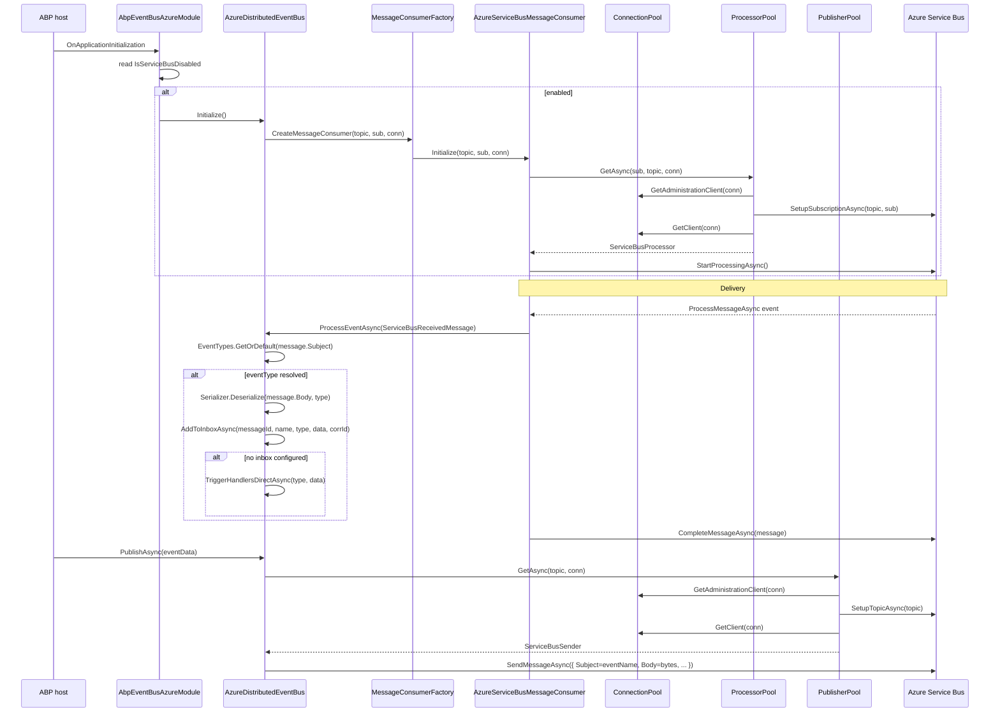

`Volo.Abp.EventBus.Azure` plugs ABP's `IDistributedEventBus` into Azure Service Bus through the official `Azure.Messaging.ServiceBus` SDK (`ServiceBusClient`, `ServiceBusSender`, `ServiceBusProcessor`, `ServiceBusReceivedMessage`). It sits on top of `Volo.Abp.AzureServiceBus`, a transport-only package that owns the three pools — **connection / publisher / processor** — plus the JSON serializer and the topic/subscription provisioning helpers in `ServiceBusAdministrationClientExtensions`.

The EventBus integration:

- Reads `Azure:EventBus` into `AbpAzureEventBusOptions { ConnectionName, TopicName, SubscriberName, IsServiceBusDisabled }`.
- On `OnApplicationInitialization` (when not disabled), calls `AzureDistributedEventBus.Initialize()` which creates one `IAzureServiceBusMessageConsumer` for `(Topic, Subscription, Connection)` and registers `ProcessEventAsync` as the message callback.
- Auto-provisions the topic and subscription on first send/receive via `ServiceBusAdministrationClient` extension methods.
- Each event type maps to a `ServiceBusMessage.Subject` — the wire-level name from `EventNameAttribute.GetNameOrDefault(type)`. One topic, many subjects.
- Publishing uses `PublisherPool.GetAsync(topic, connection)` → `ServiceBusSender.SendMessageAsync(message)`. Outbox batch publishing builds a single `ServiceBusMessageBatch` and ships it via `SendMessagesAsync`.

## File inventory

| File | Purpose |
| --- | --- |
| `Volo.Abp.EventBus.Azure/Volo/Abp/EventBus/Azure/AbpEventBusAzureModule.cs` | Module — binds `Azure:EventBus`, calls `AzureDistributedEventBus.Initialize()` unless `IsServiceBusDisabled`. |
| `Volo.Abp.EventBus.Azure/Volo/Abp/EventBus/Azure/AbpAzureEventBusOptions.cs` | `ConnectionName`, `TopicName`, `SubscriberName`, `IsServiceBusDisabled`. |
| `Volo.Abp.EventBus.Azure/Volo/Abp/EventBus/Azure/AzureDistributedEventBus.cs` | `[Dependency(ReplaceServices = true)]` `DistributedEventBusBase` subclass. |
| `Volo.Abp.AzureServiceBus/Volo/Abp/AzureServiceBus/AbpAzureServiceBusModule.cs` | Lower-level module — binds the `Azure:ServiceBus` configuration section. |
| `Volo.Abp.AzureServiceBus/Volo/Abp/AzureServiceBus/AbpAzureServiceBusOptions.cs` | Holds `Connections : AzureServiceBusConnections`. |
| `Volo.Abp.AzureServiceBus/Volo/Abp/AzureServiceBus/AzureServiceBusConnections.cs` | `Dictionary<string, ClientConfig>` keyed by connection name, `DefaultConnectionName = "Default"`. |
| `Volo.Abp.AzureServiceBus/Volo/Abp/AzureServiceBus/ClientConfig.cs` | `ConnectionString`, plus `Admin`, `Client`, `Processor` options DTOs. |
| `Volo.Abp.AzureServiceBus/Volo/Abp/AzureServiceBus/IConnectionPool.cs` / `ConnectionPool.cs` | Per-connection `ServiceBusClient` + `ServiceBusAdministrationClient` cache. |
| `Volo.Abp.AzureServiceBus/Volo/Abp/AzureServiceBus/IPublisherPool.cs` / `PublisherPool.cs` | Per-topic `ServiceBusSender` cache; calls `SetupTopicAsync` on first access. |
| `Volo.Abp.AzureServiceBus/Volo/Abp/AzureServiceBus/IProcessorPool.cs` / `ProcessorPool.cs` | Per-`(topic, subscription)` `ServiceBusProcessor` cache; calls `SetupSubscriptionAsync` on first access. |
| `Volo.Abp.AzureServiceBus/Volo/Abp/AzureServiceBus/AzureServiceBusMessageConsumer.cs` | Transient — wires `ProcessMessageAsync` / `ProcessErrorAsync` and starts processing. |
| `Volo.Abp.AzureServiceBus/Volo/Abp/AzureServiceBus/AzureServiceBusMessageConsumerFactory.cs` | Singleton, internal scope, resolves the transient consumer. |
| `Volo.Abp.AzureServiceBus/Volo/Abp/AzureServiceBus/ServiceBusAdministrationClientExtensions.cs` | `SetupTopicAsync(topic)` / `SetupSubscriptionAsync(topic, sub)`. |
| `Volo.Abp.AzureServiceBus/Volo/Abp/AzureServiceBus/IAzureServiceBusSerializer.cs` / `Utf8JsonAzureServiceBusSerializer.cs` | `byte[] Serialize(object)` / `object Deserialize(byte[], Type)`. |

## Key abstractions

| Symbol | Kind | File |
| --- | --- | --- |
| `AzureDistributedEventBus : DistributedEventBusBase, ISingletonDependency` | `[Dependency(ReplaceServices = true)]`, exposes `IDistributedEventBus` | `AzureDistributedEventBus.cs` |
| `AbpAzureEventBusOptions` | options POCO | `AbpAzureEventBusOptions.cs` |
| `AbpAzureServiceBusOptions` | options POCO — holds `Connections` | `AbpAzureServiceBusOptions.cs` |
| `AzureServiceBusConnections : Dictionary<string, ClientConfig>` | connection registry | `AzureServiceBusConnections.cs` |
| `ClientConfig` | DTO bundling `ServiceBusClientOptions`, `ServiceBusAdministrationClientOptions`, `ServiceBusProcessorOptions` | `ClientConfig.cs` |
| `IConnectionPool.GetClient(string) / GetAdministrationClient(string)` | per-connection lazy clients | `ConnectionPool.cs` |
| `IPublisherPool.GetAsync(topic, connection)` | per-topic `ServiceBusSender`; provisions topic | `PublisherPool.cs` |
| `IProcessorPool.GetAsync(subscription, topic, connection)` | per-(topic,sub) `ServiceBusProcessor`; provisions subscription | `ProcessorPool.cs` |
| `IAzureServiceBusMessageConsumer.Initialize(topic, sub, conn)` / `OnMessageReceived(...)` | live consumer | `AzureServiceBusMessageConsumer.cs` |
| `IAzureServiceBusMessageConsumerFactory.CreateMessageConsumer(topic, sub, conn)` | singleton factory | `AzureServiceBusMessageConsumerFactory.cs` |
| `IAzureServiceBusSerializer` | byte serializer | `IAzureServiceBusSerializer.cs` |

## Initialize / Publish / Receive sequence



## Module wiring

`AbpEventBusAzureModule` depends on `AbpEventBusModule` + `AbpAzureServiceBusModule`, binds config, and conditionally initializes the bus:

```csharp
[DependsOn(typeof(AbpEventBusModule), typeof(AbpAzureServiceBusModule))]
public class AbpEventBusAzureModule : AbpModule
{
    public override void ConfigureServices(ServiceConfigurationContext context)
    {
        var configuration = context.Services.GetConfiguration();
        Configure<AbpAzureEventBusOptions>(configuration.GetSection("Azure:EventBus"));
    }

    public override void OnApplicationInitialization(ApplicationInitializationContext context)
    {
        var options = context.ServiceProvider
            .GetRequiredService<IOptions<AbpAzureEventBusOptions>>().Value;

        if (!options.IsServiceBusDisabled)
        {
            context.ServiceProvider
                .GetRequiredService<AzureDistributedEventBus>()
                .Initialize();
        }
    }
}
```

`AbpAzureServiceBusModule` simply binds `Azure:ServiceBus` → `AbpAzureServiceBusOptions`. There is no shutdown hook in this module — `IConnectionPool` / `IPublisherPool` / `IProcessorPool` implement `IAsyncDisposable` and are disposed when the DI container disposes them at host shutdown.

## Options

### `AbpAzureEventBusOptions` (`Azure:EventBus` section)

| Property | Type | Notes |
| --- | --- | --- |
| `ConnectionName` | `string` | Resolves a `ClientConfig` from `AbpAzureServiceBusOptions.Connections`. `null` → `"Default"`. |
| `TopicName` | `string` | Single topic — all events share it; routing is by `Message.Subject`. |
| `SubscriberName` | `string` | Subscription name on the topic for this host. Two hosts using the same subscription compete; two hosts with different subscriptions both receive every event. |
| `IsServiceBusDisabled` | `bool` | When `true`, skip `Initialize()` — useful for designtime / migration hosts that should not consume. |

### `AbpAzureServiceBusOptions` (`Azure:ServiceBus` section)

| Property | Type | Notes |
| --- | --- | --- |
| `Connections` | `AzureServiceBusConnections` | `Dictionary<string, ClientConfig>`; constructor seeds `Default = new ClientConfig()`. |

### `ClientConfig`

| Property | Type | Notes |
| --- | --- | --- |
| `ConnectionString` | `string` | Standard Azure Service Bus connection string. |
| `Admin` | `ServiceBusAdministrationClientOptions` | Passed to `new ServiceBusAdministrationClient(...)`. |
| `Client` | `ServiceBusClientOptions` | Passed to `new ServiceBusClient(...)` — set `TransportType`, retry policy, etc. |
| `Processor` | `ServiceBusProcessorOptions` | Forwarded to `CreateProcessor(...)` — concurrency, autocomplete, prefetch. |

## Walkthrough — Initialize

```csharp
public void Initialize()
{
    Consumer = MessageConsumerFactory.CreateMessageConsumer(
        Options.TopicName,
        Options.SubscriberName,
        Options.ConnectionName);

    Consumer.OnMessageReceived(ProcessEventAsync);
    SubscribeHandlers(AbpDistributedEventBusOptions.Handlers);
}
```

`AzureServiceBusMessageConsumer.Initialize(...)` stores topic/subscription/connection then starts a long-running task:

```csharp
protected virtual void StartProcessing()
{
    Task.Factory.StartNew(async () =>
    {
        var serviceBusProcessor = await _processorPool.GetAsync(
            _subscriptionName, _topicName, _connectionName);
        serviceBusProcessor.ProcessErrorAsync   += HandleIncomingError;
        serviceBusProcessor.ProcessMessageAsync += HandleIncomingMessage;

        if (!serviceBusProcessor.IsProcessing)
            await serviceBusProcessor.StartProcessingAsync();

        while (true) { Thread.Sleep(1000); }
    }, TaskCreationOptions.LongRunning);
}
```

`HandleIncomingMessage` fans out to every registered callback, then completes the message (regardless of the SDK's `AutoComplete` setting in `ServiceBusProcessorOptions`):

```csharp
protected virtual async Task HandleIncomingMessage(ProcessMessageEventArgs args)
{
    try
    {
        foreach (var callback in _callbacks)
            await callback(args.Message);

        await args.CompleteMessageAsync(args.Message);
    }
    catch (Exception exception)
    {
        await HandleError(exception);
    }
}
```

## Walkthrough — Receive

```csharp
private async Task ProcessEventAsync(ServiceBusReceivedMessage message)
{
    var eventName = message.Subject;
    if (eventName == null) return;

    var eventType = EventTypes.GetOrDefault(eventName);
    if (eventType == null) return;

    var eventData = Serializer.Deserialize(message.Body.ToArray(), eventType);

    if (await AddToInboxAsync(message.MessageId, eventName, eventType, eventData,
                              message.CorrelationId))
        return;

    using (CorrelationIdProvider.Change(message.CorrelationId))
        await TriggerHandlersDirectAsync(eventType, eventData);
}
```

`Subject`, `MessageId`, and `CorrelationId` are all native Service Bus message properties — no custom application properties needed.

## Walkthrough — Publish

`PublishToEventBusAsync` is a thin wrapper that resolves the event name from `EventNameAttribute` and forwards to the byte-level path:

```csharp
protected async override Task PublishToEventBusAsync(Type eventType, object eventData)
{
    await PublishAsync(EventNameAttribute.GetNameOrDefault(eventType), eventData);
}

protected virtual async Task PublishAsync(
    string eventName, byte[] body, string? correlationId, Guid? eventId)
{
    var message = new ServiceBusMessage(body) { Subject = eventName };

    if (message.MessageId.IsNullOrWhiteSpace())
        message.MessageId = (eventId ?? GuidGenerator.Create()).ToString("N");

    message.CorrelationId = correlationId;

    var publisher = await PublisherPool.GetAsync(
        Options.TopicName, Options.ConnectionName);

    await publisher.SendMessageAsync(message);
}
```

### Outbox batch path

```csharp
public async override Task PublishManyFromOutboxAsync(
    IEnumerable<OutgoingEventInfo> outgoingEvents, OutboxConfig outboxConfig)
{
    var publisher  = await PublisherPool.GetAsync(Options.TopicName, Options.ConnectionName);
    using var batch = await publisher.CreateMessageBatchAsync();

    foreach (var outgoingEvent in outgoingEvents)
    {
        var message = new ServiceBusMessage(outgoingEvent.EventData)
        {
            Subject = outgoingEvent.EventName
        };

        if (message.MessageId.IsNullOrWhiteSpace())
            message.MessageId = outgoingEvent.Id.ToString();

        message.CorrelationId = outgoingEvent.GetCorrelationId();

        if (!batch.TryAddMessage(message))
            throw new AbpException(
                "The message is too large to fit in the batch. Set AbpEventBusBoxesOptions.OutboxWaitingEventMaxCount to reduce the number");

        // ... TriggerDistributedEventSentAsync ...
    }

    await publisher.SendMessagesAsync(batch);
}
```

The batch is built against the **Service Bus tier limit** (256 KiB on Standard, 1 MiB on Premium); when `TryAddMessage` returns `false` ABP throws and the outbox processor will retry with the remaining items.

## Pools

### `PublisherPool` — per-topic

```csharp
public async Task<ServiceBusSender> GetAsync(string topicName, string connectionName)
{
    var admin = _connectionPool.GetAdministrationClient(connectionName);
    await admin.SetupTopicAsync(topicName);

    return _publishers.GetOrAdd(topicName, new Lazy<ServiceBusSender>(() =>
    {
        var client = _connectionPool.GetClient(connectionName);
        return client.CreateSender(topicName);
    })).Value;
}
```

### `ProcessorPool` — per `(topic, subscription)`

```csharp
public async Task<ServiceBusProcessor> GetAsync(
    string subscriptionName, string topicName, string connectionName)
{
    var admin = _connectionPool.GetAdministrationClient(connectionName);
    await admin.SetupSubscriptionAsync(topicName, subscriptionName);

    return _processors.GetOrAdd($"{topicName}-{subscriptionName}",
        new Lazy<ServiceBusProcessor>(() =>
        {
            var config = _options.Connections.GetOrDefault(connectionName);
            var client = _connectionPool.GetClient(connectionName);
            return client.CreateProcessor(topicName, subscriptionName, config.Processor);
        })).Value;
}
```

### `ConnectionPool` — per-connection-name

```csharp
public ServiceBusClient GetClient(string connectionName)
{
    connectionName ??= AzureServiceBusConnections.DefaultConnectionName;
    return _clients.GetOrAdd(connectionName, new Lazy<ServiceBusClient>(() =>
    {
        var config = _options.Connections.GetOrDefault(connectionName);
        return new ServiceBusClient(config.ConnectionString, config.Client);
    })).Value;
}
```

`SetupTopicAsync` / `SetupSubscriptionAsync` (in `ServiceBusAdministrationClientExtensions`) call the corresponding `CreateTopicAsync` / `CreateSubscriptionAsync` and silently swallow `MessagingEntityAlreadyExists` so multiple hosts can race safely.

## Configuration sample

```json
{
  "Azure": {
    "ServiceBus": {
      "Connections": {
        "Default": {
          "ConnectionString": "Endpoint=sb://...;SharedAccessKeyName=...;SharedAccessKey=..."
        }
      }
    },
    "EventBus": {
      "ConnectionName": "Default",
      "TopicName": "myapp-events",
      "SubscriberName": "myapp-web"
    }
  }
}
```

## Gotchas

<Note>
**`Thread.Sleep(1000)` in the consumer keep-alive.** `AzureServiceBusMessageConsumer.StartProcessing` ends with a `while (true) { Thread.Sleep(1000); }` inside a long-running task. The blocking sleep does not deliver messages — the SDK's internal pump does — but it is a real OS thread that lives for the entire host lifetime, one per consumer.
</Note>

<Note>
**`AutoComplete` is overridden.** Even if you set `ServiceBusProcessorOptions.AutoCompleteMessages = false` (or true) via `ClientConfig.Processor`, `HandleIncomingMessage` always calls `CompleteMessageAsync` after callbacks succeed. Set `MaxAutoLockRenewalDuration` and `MaxConcurrentCalls` for throughput, not the autocomplete flag.
</Note>

<Note>
**Subscription = single shared semantics per host group.** All hosts with the same `SubscriberName` compete for messages on that subscription; to fan out to multiple independent consumers, give each host a unique `SubscriberName` — the topic will gain a new subscription on first connect via `SetupSubscriptionAsync`.
</Note>

<Tip>
For Premium-tier topics with large payloads, configure `ClientConfig.Client.TransportType = ServiceBusTransportType.AmqpWebSockets` if your network blocks raw AMQP, and raise `AbpEventBusBoxesOptions.OutboxWaitingEventMaxCount` carefully — the batch limit is checked client-side in `TryAddMessage`.
</Tip>

<Note>
`IsServiceBusDisabled = true` skips only the consumer side. Publishes still go through `PublisherPool` and will fail if the connection string is invalid — set this when you want a host that emits events but does not consume.
</Note>

## Related pages

<CardGroup cols={2}>
  <Card title="Distributed EventBus core" icon="bolt" href="/framework/eventbus/distributed-eventbus">
    `DistributedEventBusBase`, the abstract class Azure extends.
  </Card>
  <Card title="Inbox / Outbox" icon="box-archive" href="/framework/eventbus/inbox-outbox">
    `PublishManyFromOutboxAsync` batches and `AddToInboxAsync` semantics.
  </Card>
  <Card title="Kafka EventBus" icon="bolt-lightning" href="/framework/eventbus/kafka">
    Same shape (single topic + name routing), wildly different broker.
  </Card>
  <Card title="RabbitMQ EventBus" icon="rabbit" href="/framework/eventbus/rabbitmq">
    Sibling broker with exchange/queue topology.
  </Card>
</CardGroup>
