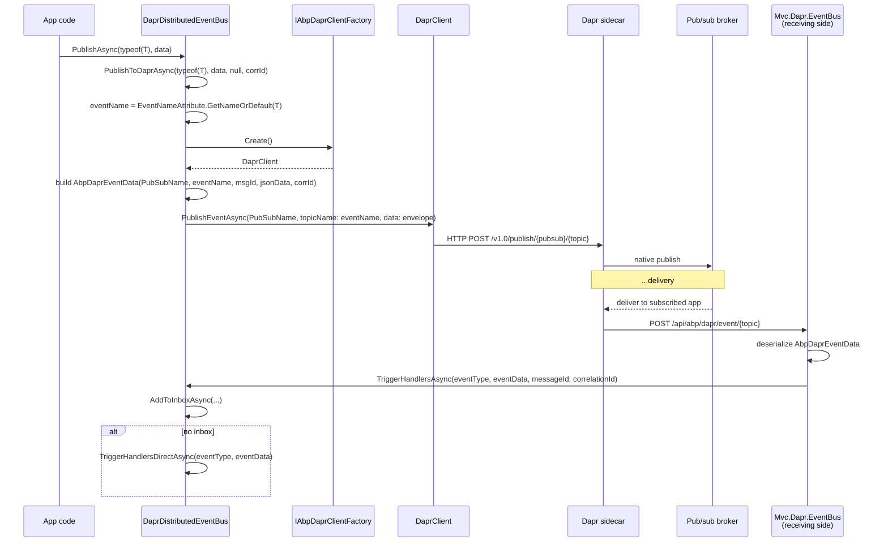

`Volo.Abp.EventBus.Dapr` plugs ABP's `IDistributedEventBus` into a Dapr pub/sub component (Redis, Kafka, RabbitMQ, Service Bus, NATS, …) via the official `Dapr.Client` SDK. Unlike the other transports, ABP never talks to the broker directly — every publish becomes a `DaprClient.PublishEventAsync(pubsubName, topicName, data)` against the **Dapr sidecar**, and every receive comes back through an ASP.NET Core endpoint mapped by the companion `Volo.Abp.AspNetCore.Mvc.Dapr.EventBus` package.

The integration:

- Reads no configuration into `AbpDaprEventBusOptions`; the only setting is `PubSubName`, which defaults to `"pubsub"` in the constructor.
- Uses `Volo.Abp.Dapr` for the client factory (`IAbpDaprClientFactory`), API tokens, and JSON serializer.
- Wraps every event in an `AbpDaprEventData(pubSubName, topic, messageId, jsonData, correlationId)` envelope serialized to JSON — the broker payload is therefore JSON-of-JSON. The string `JsonData` body lets the receiving side deserialize against `EventTypes.GetOrDefault(eventName)` without knowing the CLR type at the broker.
- On publish, calls `client.PublishEventAsync(pubsubName: PubSubName, topicName: eventName, data: envelope)` — the **event name is the Dapr topic**, one topic per event type.
- On receive, the MVC integration controller deserializes the envelope and calls `DaprDistributedEventBus.TriggerHandlersAsync(eventType, eventData, messageId, correlationId)`.

## File inventory

| File | Purpose |
| --- | --- |
| `Volo.Abp.EventBus.Dapr/Volo/Abp/EventBus/Dapr/AbpEventBusDaprModule.cs` | Module — depends on `AbpEventBusModule` + `AbpDaprModule`, calls `DaprDistributedEventBus.Initialize()` on init. |
| `Volo.Abp.EventBus.Dapr/Volo/Abp/EventBus/Dapr/AbpDaprEventBusOptions.cs` | Single property: `PubSubName` (default `"pubsub"`). |
| `Volo.Abp.EventBus.Dapr/Volo/Abp/EventBus/Dapr/AbpDaprEventData.cs` | Envelope: `PubSubName`, `Topic`, `MessageId`, `JsonData`, `CorrelationId`. |
| `Volo.Abp.EventBus.Dapr/Volo/Abp/EventBus/Dapr/DaprDistributedEventBus.cs` | `[Dependency(ReplaceServices = true)]` `DistributedEventBusBase` subclass. |
| `Volo.Abp.Dapr/Volo/Abp/Dapr/AbpDaprModule.cs` | Lower-level module — binds `Dapr` config section, defaults `DaprClient` via `IAbpDaprClientFactory`. |
| `Volo.Abp.Dapr/Volo/Abp/Dapr/AbpDaprOptions.cs` | `HttpEndpoint`, `GrpcEndpoint`, `DaprApiToken`, `AppApiToken`. |
| `Volo.Abp.Dapr/Volo/Abp/Dapr/IAbpDaprClientFactory.cs` / `AbpDaprClientFactory.cs` | `DaprClient Create(builderAction)` / `HttpClient CreateHttpClient(...)`. |
| `Volo.Abp.Dapr/Volo/Abp/Dapr/IDaprApiTokenProvider.cs` / `DaprApiTokenProvider.cs` | `string? GetDaprApiToken()` / `GetAppApiToken()`. |
| `Volo.Abp.Dapr/Volo/Abp/Dapr/IDaprSerializer.cs` / `Utf8JsonDaprSerializer.cs` | `byte[] Serialize(object)` / `string SerializeToString(object)` / `Deserialize(...)`. |

## Key abstractions

| Symbol | Kind | File |
| --- | --- | --- |
| `DaprDistributedEventBus : DistributedEventBusBase, ISingletonDependency` | `[Dependency(ReplaceServices = true)]`, exposes `IDistributedEventBus` | `DaprDistributedEventBus.cs` |
| `AbpDaprEventBusOptions { string PubSubName = "pubsub" }` | options POCO | `AbpDaprEventBusOptions.cs` |
| `AbpDaprEventData(pubSubName, topic, messageId, jsonData, correlationId)` | wire envelope | `AbpDaprEventData.cs` |
| `AbpDaprOptions { HttpEndpoint, GrpcEndpoint, DaprApiToken, AppApiToken }` | base Dapr config | `AbpDaprOptions.cs` |
| `IAbpDaprClientFactory.Create(Action<DaprClientBuilder>?)` | singleton factory for `DaprClient` | `IAbpDaprClientFactory.cs` |
| `IAbpDaprClientFactory.CreateHttpClient(appId?, daprEndpoint?, daprApiToken?)` | invocation HTTP client | `IAbpDaprClientFactory.cs` |
| `IDaprApiTokenProvider.GetDaprApiToken() / GetAppApiToken()` | env-var/config token resolver | `IDaprApiTokenProvider.cs` |
| `IDaprSerializer.SerializeToString(object) / Deserialize(byte[], Type)` | JSON serializer | `IDaprSerializer.cs` |

## End-to-end pub/sub flow



<Note>
The HTTP endpoint that receives Dapr deliveries lives in **`Volo.Abp.AspNetCore.Mvc.Dapr.EventBus`** — see the [`MapDaprEventBus` page](/framework/ui-mvc/mvc-dapr-eventbus). This package only owns the publish side and the `TriggerHandlersAsync` entry point.
</Note>

## Module wiring

```csharp
[DependsOn(typeof(AbpEventBusModule), typeof(AbpDaprModule))]
public class AbpEventBusDaprModule : AbpModule
{
    public override void OnApplicationInitialization(ApplicationInitializationContext context)
    {
        context.ServiceProvider
            .GetRequiredService<DaprDistributedEventBus>()
            .Initialize();
    }
}
```

There is **no** `Configure<AbpDaprEventBusOptions>(configuration.GetSection("..."))` here — the options POCO is registered through the regular DI options machinery only, defaulting to `PubSubName = "pubsub"`. Override it in your app module:

```csharp
Configure<AbpDaprEventBusOptions>(options =>
{
    options.PubSubName = "myapp-pubsub";
});
```

`AbpDaprModule` (the base module) binds the `Dapr` section to `AbpDaprOptions`, then falls back to environment variables `DAPR_API_TOKEN` and `APP_API_TOKEN` if the section did not provide them. It also registers a default `DaprClient` singleton via the factory:

```csharp
context.Services.TryAddSingleton(
    serviceProvider => serviceProvider
        .GetRequiredService<IAbpDaprClientFactory>()
        .Create()
);
```

## Options

### `AbpDaprEventBusOptions`

| Property | Type | Default | Notes |
| --- | --- | --- | --- |
| `PubSubName` | `string` | `"pubsub"` | Name of the Dapr pub/sub component (`metadata.name` in the component YAML). |

### `AbpDaprOptions` (`Dapr` section)

| Property | Type | Notes |
| --- | --- | --- |
| `HttpEndpoint` | `string?` | If set, `DaprClient` uses this instead of the standard `DAPR_HTTP_ENDPOINT`. |
| `GrpcEndpoint` | `string?` | Same for gRPC. |
| `DaprApiToken` | `string?` | Fallback chain: section → `DAPR_API_TOKEN` config key → `DAPR_API_TOKEN` env var. |
| `AppApiToken` | `string?` | Same chain for `APP_API_TOKEN`. Used by callers (Dapr → app) to authenticate. |

## Walkthrough — Initialize

`DaprDistributedEventBus.Initialize()` is intentionally minimal — pub/sub subscriptions are advertised by the Mvc.Dapr.EventBus middleware (one per registered handler type) via an ASP.NET Core endpoint Dapr scrapes on startup, **not** by this class:

```csharp
public void Initialize()
{
    SubscribeHandlers(AbpDistributedEventBusOptions.Handlers);
}
```

## Walkthrough — Publish

`PublishToEventBusAsync` is delegated through `PublishToDaprAsync(eventType, eventData, null, correlationId)` which composes the envelope and posts to the sidecar:

```csharp
protected async override Task PublishToEventBusAsync(Type eventType, object eventData)
{
    await PublishToDaprAsync(eventType, eventData, null, CorrelationIdProvider.Get());
}

protected virtual async Task PublishToDaprAsync(
    Type eventType, object eventData, Guid? messageId = null, string correlationId = null)
{
    await PublishToDaprAsync(EventNameAttribute.GetNameOrDefault(eventType),
                             eventData, messageId, correlationId);
}

protected virtual async Task PublishToDaprAsync(
    string eventName, object eventData, Guid? messageId = null, string correlationId = null)
{
    var client = DaprClientFactory.Create();
    var data   = new AbpDaprEventData(
        DaprEventBusOptions.PubSubName,
        eventName,
        (messageId ?? GuidGenerator.Create()).ToString("N"),
        Serializer.SerializeToString(eventData),
        correlationId);

    await client.PublishEventAsync(
        pubsubName: DaprEventBusOptions.PubSubName,
        topicName:  eventName,
        data:       data);
}
```

Three things to note:

1. The Dapr **topic name is the wire-level event name**, not a single fixed topic. `EventNameAttribute.GetNameOrDefault(type)` resolves it.
2. The body is `AbpDaprEventData`, where `JsonData` is the user's event serialized to a **string** with `Serializer.SerializeToString(...)`. The broker therefore stores a JSON-encoded JSON string — the receiver re-parses it.
3. Each call resolves `DaprClient` fresh via `DaprClientFactory.Create()`. `DaprClient` is itself singleton-friendly (registered as a singleton by `AbpDaprModule`), but going through the factory respects the user `Action<DaprClientBuilder>?` hook if you override `Create`.

### `IAbpDaprClientFactory.Create`

```csharp
public virtual DaprClient Create(Action<DaprClientBuilder>? builderAction = null)
{
    var builder = new DaprClientBuilder()
        .UseJsonSerializationOptions(JsonSerializerOptions);

    if (!DaprOptions.HttpEndpoint.IsNullOrWhiteSpace())
        builder.UseHttpEndpoint(DaprOptions.HttpEndpoint);

    if (!DaprOptions.GrpcEndpoint.IsNullOrWhiteSpace())
        builder.UseGrpcEndpoint(DaprOptions.GrpcEndpoint);

    var apiToken = DaprApiTokenProvider.GetDaprApiToken();
    if (!apiToken.IsNullOrWhiteSpace())
        builder.UseDaprApiToken(apiToken);

    builderAction?.Invoke(builder);
    return builder.Build();
}
```

`JsonSerializerOptions` is derived from `AbpSystemTextJsonSerializerOptions` so DaprClient and the rest of the app share casing/policy.

### Outbox

Both `PublishFromOutboxAsync` and `PublishManyFromOutboxAsync` deserialize the bytes back into the original CLR type (using `GetEventType(eventName)` and `Serializer.Deserialize`), then re-publish via `PublishToDaprAsync` — one Dapr publish per outbox row. There is no batch endpoint in Dapr pub/sub.

## Walkthrough — Receive

`TriggerHandlersAsync` is the public entry point used by the Mvc.Dapr.EventBus controller:

```csharp
public virtual async Task TriggerHandlersAsync(
    Type eventType, object eventData,
    string messageId = null, string correlationId = null)
{
    if (await AddToInboxAsync(messageId, EventNameAttribute.GetNameOrDefault(eventType),
                              eventType, eventData, correlationId))
        return;

    using (CorrelationIdProvider.Change(correlationId))
        await TriggerHandlersDirectAsync(eventType, eventData);
}
```

`GetEventType(eventName)` exposes the internal `EventTypes` dictionary so the controller can resolve `T` from the topic string:

```csharp
public Type GetEventType(string eventName)
{
    return EventTypes.GetOrDefault(eventName);
}
```

## Sample configuration

```json
{
  "Dapr": {
    "HttpEndpoint": "http://localhost:3500",
    "GrpcEndpoint": "http://localhost:50001",
    "DaprApiToken": "..."
  }
}
```

```csharp
Configure<AbpDaprEventBusOptions>(options =>
{
    options.PubSubName = "redis-pubsub";
});
```

Plus a Dapr component YAML defining the broker:

```yaml
apiVersion: dapr.io/v1alpha1
kind: Component
metadata:
  name: redis-pubsub
spec:
  type: pubsub.redis
  version: v1
  metadata:
    - name: redisHost
      value: localhost:6379
```

## Gotchas

<Note>
**The Dapr topic IS the event name.** Unlike Kafka/Azure (one topic, name in the message key/subject) every event type publishes to a different Dapr topic. Renaming an event (or changing its `[EventName]`) effectively re-routes traffic and breaks in-flight subscribers.
</Note>

<Note>
**Double-JSON encoding.** `AbpDaprEventData.JsonData` is the event payload as a *string*, then the envelope itself is JSON-serialized when sent to the sidecar. Inspecting a message in the broker shows escaped JSON inside JSON — that is by design so the receiver can defer deserialization until `EventTypes.GetOrDefault(eventName)` resolves the CLR type.
</Note>

<Note>
**No `Volo.Abp.AspNetCore.Mvc.Dapr.EventBus` ⇒ no inbound deliveries.** This package only handles publishing and the `TriggerHandlersAsync` callback. The actual ASP.NET Core endpoint (`/api/abp/dapr/event/{topic}` and the Dapr subscription manifest at `/dapr/subscribe`) is exposed by the companion MVC package via `MapDaprEventBus` — cross-link below.
</Note>

<Tip>
`DaprApiToken` falls back from config to environment variables — useful when running under `dapr run` which sets `DAPR_API_TOKEN` automatically. The same chain applies to `APP_API_TOKEN`.
</Tip>

<Note>
`Initialize()` is empty beyond `SubscribeHandlers(...)`. Removing the module's `OnApplicationInitialization` will skip subscriber pre-registration; ABP's outbox/inbox plumbing still relies on those handler factories existing so static handler types are reachable.
</Note>

## Related pages

<CardGroup cols={2}>
  <Card title="MVC + Dapr EventBus endpoint" icon="server" href="/framework/ui-mvc/mvc-dapr-eventbus">
    `MapDaprEventBus` — the ASP.NET Core endpoint that receives Dapr deliveries and dispatches to `TriggerHandlersAsync`.
  </Card>
  <Card title="Distributed EventBus core" icon="bolt" href="/framework/eventbus/distributed-eventbus">
    `DistributedEventBusBase`, the abstract Dapr extends.
  </Card>
  <Card title="Inbox / Outbox" icon="box-archive" href="/framework/eventbus/inbox-outbox">
    Why `TriggerHandlersAsync` and `PublishFromOutboxAsync` use the same envelope.
  </Card>
  <Card title="EventBus abstractions" icon="diagram-project" href="/framework/eventbus/abstractions">
    `EventNameAttribute`, the source of the Dapr topic name.
  </Card>
</CardGroup>
