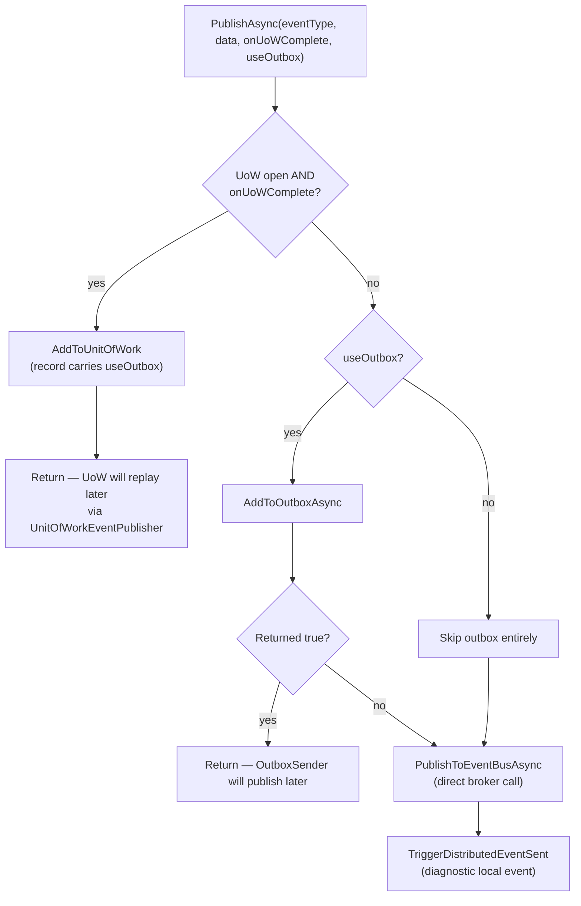
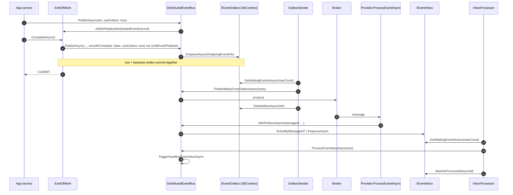

`Volo.Abp.EventBus.Distributed` is the **provider-agnostic half** of ABP's distributed messaging. It contains:

- `DistributedEventBusBase` — the abstract class every broker integration (RabbitMQ, Kafka, Azure, Rebus, Dapr) extends.
- `LocalDistributedEventBus` — the **default** registration (`[Dependency(TryRegister = true)]`). When no broker module is added, it transparently relays distributed events to `ILocalEventBus`, which is exactly what you want for tests, single-process samples, and monolith deployments.
- `NullDistributedEventBus` — a no-op `IDistributedEventBus` for environments that explicitly want to disable distributed messaging (it is **not** auto-registered; you opt in by exposing `NullDistributedEventBus.Instance`).
- `AbpDistributedEventBusOptions` — the **handler list plus inbox/outbox config dictionaries** used by all providers.
- A few extension methods including `AsSupportsEventBoxes()`.

The page below stays at this layer — it doesn't cover the inbox/outbox **workers** (`OutboxSender`, `InboxProcessor`) or per-broker code; those are linked at the end.

## File inventory

| File | Purpose |
| --- | --- |
| `Volo/Abp/EventBus/Distributed/DistributedEventBusBase.cs` | Abstract base. Implements `PublishAsync(... useOutbox)`, the outbox-write path, the inbox-write path, serialize hook, and direct/inbox handler dispatch. |
| `Volo/Abp/EventBus/Distributed/LocalDistributedEventBus.cs` | Default `IDistributedEventBus` that forwards everything to `ILocalEventBus`. Registered with `[Dependency(TryRegister = true)]`. |
| `Volo/Abp/EventBus/Distributed/NullDistributedEventBus.cs` | Sealed singleton. All `PublishAsync` calls return `Task.CompletedTask`, all `Subscribe` calls return `NullDisposable.Instance`. |
| `Volo/Abp/EventBus/Distributed/AbpDistributedEventBusOptions.cs` | `Handlers : TypeList`, `Outboxes : OutboxConfigDictionary`, `Inboxes : InboxConfigDictionary`. |
| `Volo/Abp/EventBus/Distributed/AbpDistributedEventBusExtensions.cs` | One static: `AsSupportsEventBoxes()` — casts to `ISupportsEventBoxes` or throws. |
| `Volo/Abp/EventBus/Distributed/AbpEventBusBoxesOptions.cs` | Runtime knobs for the worker side (period, batch size, distributed-lock wait). Covered on the [Inbox/Outbox](/framework/eventbus/inbox-outbox) page. |

## Key abstractions

| Symbol | Kind | File |
| --- | --- | --- |
| `DistributedEventBusBase` | abstract class : `EventBusBase`, `IDistributedEventBus`, `ISupportsEventBoxes` | `DistributedEventBusBase.cs` |
| `LocalDistributedEventBus` | class : `IDistributedEventBus`, `ISingletonDependency` (with `[Dependency(TryRegister = true)]`) | `LocalDistributedEventBus.cs` |
| `NullDistributedEventBus` | sealed class : `IDistributedEventBus` | `NullDistributedEventBus.cs` |
| `AbpDistributedEventBusOptions` | options POCO | `AbpDistributedEventBusOptions.cs` |
| `AbpDistributedEventBusExtensions` | static class | `AbpDistributedEventBusExtensions.cs` |

## Options

```csharp title="AbpDistributedEventBusOptions.cs"
public class AbpDistributedEventBusOptions
{
    public ITypeList<IEventHandler> Handlers { get; }
    public OutboxConfigDictionary Outboxes { get; }
    public InboxConfigDictionary Inboxes { get; }

    public AbpDistributedEventBusOptions()
    {
        Handlers = new TypeList<IEventHandler>();
        Outboxes = new OutboxConfigDictionary();
        Inboxes = new InboxConfigDictionary();
    }
}
```

| Property | Type | Default | Populated by |
| --- | --- | --- | --- |
| `Handlers` | `ITypeList<IEventHandler>` | empty | `AbpEventBusModule.AddEventHandlers` walks DI registrations and appends every type assignable to `IDistributedEventHandler<>`. |
| `Outboxes` | `OutboxConfigDictionary` | empty | Your module's `ConfigureServices`: `Configure<AbpDistributedEventBusOptions>(o => o.Outboxes.Configure(c => c.UseDbContext<MyDbContext>()))`. |
| `Inboxes` | `InboxConfigDictionary` | empty | Same pattern: `o.Inboxes.Configure(c => c.UseDbContext<MyDbContext>())`. |

Once `Outboxes` is non-empty, `OutboxSenderManager` starts polling at app initialization (see the [Inbox/Outbox](/framework/eventbus/inbox-outbox) page). The same is true for `Inboxes` / `InboxProcessManager`.

<Note>
`Outboxes` and `Inboxes` are keyed dictionaries — you can declare **multiple** named outboxes per app (one per `DbContext`, for instance). The shorthand `.Configure(action)` uses the literal key `"Default"`.
</Note>

## `DistributedEventBusBase`

`DistributedEventBusBase` derives from `EventBusBase` and adds three things on top of the local pipeline:

1. The `useOutbox` flag on `PublishAsync`.
2. The `AddToOutboxAsync` / `AddToInboxAsync` helpers that pick the right `IEventOutbox` / `IEventInbox` from DI based on the configured `Selector` / `EventSelector`.
3. The four abstract methods that every broker provider must implement: `PublishFromOutboxAsync`, `PublishManyFromOutboxAsync`, `ProcessFromInboxAsync`, plus the inherited `Serialize`.

### Construction

```csharp title="DistributedEventBusBase.cs (excerpt) — ctor"
protected DistributedEventBusBase(
    IServiceScopeFactory serviceScopeFactory,
    ICurrentTenant currentTenant,
    IUnitOfWorkManager unitOfWorkManager,
    IOptions<AbpDistributedEventBusOptions> abpDistributedEventBusOptions,
    IGuidGenerator guidGenerator,
    IClock clock,
    IEventHandlerInvoker eventHandlerInvoker,
    ILocalEventBus localEventBus,
    ICorrelationIdProvider correlationIdProvider)
    : base(serviceScopeFactory, currentTenant, unitOfWorkManager, eventHandlerInvoker)
{
    GuidGenerator = guidGenerator;
    Clock = clock;
    AbpDistributedEventBusOptions = abpDistributedEventBusOptions.Value;
    LocalEventBus = localEventBus;
    CorrelationIdProvider = correlationIdProvider;
}
```

The five extra dependencies (`GuidGenerator`, `Clock`, options, `LocalEventBus`, `CorrelationIdProvider`) reflect what the base needs to:

- Generate primary keys for outbox rows (`GuidGenerator.Create()`).
- Stamp `CreationTime` on outbox/inbox rows (`Clock.Now`).
- Read `Outboxes` / `Inboxes` (the options).
- Republish diagnostic events `DistributedEventSent` / `DistributedEventReceived` (`LocalEventBus`).
- Propagate the current correlation id into outbox rows and out of inbox rows (`CorrelationIdProvider`).

### Publish — five paths in one method

```csharp title="DistributedEventBusBase.cs (excerpt) — PublishAsync"
public override Task PublishAsync(Type eventType, object eventData, bool onUnitOfWorkComplete = true)
    => PublishAsync(eventType, eventData, onUnitOfWorkComplete, useOutbox: true);

public Task PublishAsync<TEvent>(TEvent eventData, bool onUnitOfWorkComplete = true, bool useOutbox = true)
    where TEvent : class
    => PublishAsync(typeof(TEvent), eventData, onUnitOfWorkComplete, useOutbox);

public async Task PublishAsync(
    Type eventType, object eventData,
    bool onUnitOfWorkComplete = true,
    bool useOutbox = true)
{
    if (onUnitOfWorkComplete && UnitOfWorkManager.Current != null)
    {
        AddToUnitOfWork(
            UnitOfWorkManager.Current,
            new UnitOfWorkEventRecord(eventType, eventData, EventOrderGenerator.GetNext(), useOutbox)
        );
        return;
    }

    if (useOutbox)
    {
        if (await AddToOutboxAsync(eventType, eventData))
        {
            return;
        }
    }

    await TriggerDistributedEventSentAsync(new DistributedEventSent()
    {
        Source = DistributedEventSource.Direct,
        EventName = EventNameAttribute.GetNameOrDefault(eventType),
        EventData = eventData
    });

    await PublishToEventBusAsync(eventType, eventData);
}
```

The flow can be drawn as a decision tree:



There are therefore **three exit points** from `PublishAsync`:

| Exit | Conditions | When the event actually leaves the process |
| --- | --- | --- |
| Deferred to UoW | UoW open and `onUnitOfWorkComplete: true` | After `IUnitOfWork.CompleteAsync` → `UnitOfWorkEventPublisher.PublishDistributedEventsAsync` calls back with `onUnitOfWorkComplete: false`. |
| Outbox | No UoW (or already deferred), `useOutbox: true`, a matching `OutboxConfig.Selector` returns true | When `OutboxSender` polls and calls `PublishFromOutboxAsync`. |
| Direct | All other cases | Immediately, inside the same `await`. |

<Tip>
`TriggerDistributedEventSentAsync` is fired **only on the direct path**. On the outbox path, the providers fire it inside `PublishFromOutboxAsync` with `Source = Outbox`. Subscribe to `DistributedEventSent` on the local bus and inspect `.Source` to tell which path your event took.
</Tip>

### `AddToOutboxAsync` — picking the right outbox

```csharp title="DistributedEventBusBase.cs (excerpt) — outbox routing"
protected virtual async Task<bool> AddToOutboxAsync(Type eventType, object eventData)
{
    var unitOfWork = UnitOfWorkManager.Current;
    if (unitOfWork == null)
    {
        return false;
    }

    foreach (var outboxConfig in AbpDistributedEventBusOptions.Outboxes.Values.OrderBy(x => x.Selector is null))
    {
        if (outboxConfig.Selector == null || outboxConfig.Selector(eventType))
        {
            var eventOutbox = (IEventOutbox)unitOfWork.ServiceProvider
                .GetRequiredService(outboxConfig.ImplementationType);
            var eventName = EventNameAttribute.GetNameOrDefault(eventType);

            await OnAddToOutboxAsync(eventName, eventType, eventData);

            var outgoingEventInfo = new OutgoingEventInfo(
                GuidGenerator.Create(),
                eventName,
                Serialize(eventData),
                Clock.Now
            );
            outgoingEventInfo.SetCorrelationId(CorrelationIdProvider.Get());
            await eventOutbox.EnqueueAsync(outgoingEventInfo);
            return true;
        }
    }

    return false;
}
```

A few subtleties:

- **The outbox row is written via the UoW's `ServiceProvider`**, not the bus's. That means the `IEventOutbox` implementation (typically EF Core's `EventOutbox`) participates in the same `DbContext` and is committed atomically with the business write.
- `OrderBy(x => x.Selector is null)` puts **all named outboxes with explicit selectors first**, leaving the catch-all (no selector) as the fallback. The loop calls **only one** outbox per event (`return true` after the first match) — events do not fan out to multiple outboxes.
- `OnAddToOutboxAsync` is overridden by every provider to register `(eventName → eventType)` in their internal lookup table — without that, `ProcessFromInbox` couldn't deserialise an incoming row's `EventData` because it only knows the wire-level `EventName` string.

<Note>
If `AddToOutboxAsync` returns `false` (no UoW, or no matching `OutboxConfig`), the publish falls through to the **direct broker call**. This is exactly what allows the same `PublishAsync` to work whether or not your module wires an outbox.
</Note>

### `AddToInboxAsync` — write-side of the inbox

```csharp title="DistributedEventBusBase.cs (excerpt) — inbox routing"
protected async Task<bool> AddToInboxAsync(
    string messageId,
    string eventName,
    Type eventType,
    object eventData,
    [CanBeNull] string correlationId)
{
    if (AbpDistributedEventBusOptions.Inboxes.Count <= 0)
    {
        return false;
    }

    using (var scope = ServiceScopeFactory.CreateScope())
    {
        foreach (var inboxConfig in AbpDistributedEventBusOptions.Inboxes.Values
                                            .OrderBy(x => x.EventSelector is null))
        {
            if (inboxConfig.EventSelector == null || inboxConfig.EventSelector(eventType))
            {
                var eventInbox =
                    (IEventInbox)scope.ServiceProvider.GetRequiredService(inboxConfig.ImplementationType);

                if (!messageId.IsNullOrEmpty())
                {
                    if (await eventInbox.ExistsByMessageIdAsync(messageId))
                    {
                        continue;   // dedup hit: do not enqueue, try next inbox
                    }
                }

                var incomingEventInfo = new IncomingEventInfo(
                    GuidGenerator.Create(),
                    messageId,
                    eventName,
                    Serialize(eventData),
                    Clock.Now
                );
                incomingEventInfo.SetCorrelationId(correlationId);
                await eventInbox.EnqueueAsync(incomingEventInfo);
            }
        }
    }

    return true;
}
```

Notes on the semantics:

- **`ExistsByMessageIdAsync` is the deduplication primitive** — providers must pass the broker's native message id (`BasicProperties.MessageId` for RabbitMQ, the `messageId` header for Kafka, `ServiceBusReceivedMessage.MessageId` for Azure, etc.) so the inbox can reject duplicates introduced by at-least-once delivery.
- The inbox path **fans out to all matching inboxes**. Each inbox owns its own dedup view and processing schedule, so a single arriving message can produce multiple `IncomingEventInfo` rows across different inbox tables.
- When `Inboxes.Count == 0`, the method returns `false` and the caller (`provider.ProcessEventAsync(...)`) falls through to `TriggerHandlersDirectAsync` — exactly the at-most-once path.

### Direct vs. inbox handler dispatch

```csharp title="DistributedEventBusBase.cs (excerpt) — dispatch helpers"
protected virtual async Task TriggerHandlersDirectAsync(Type eventType, object eventData)
{
    await TriggerDistributedEventReceivedAsync(new DistributedEventReceived
    {
        Source = DistributedEventSource.Direct,
        EventName = EventNameAttribute.GetNameOrDefault(eventType),
        EventData = eventData
    });

    await TriggerHandlersAsync(eventType, eventData);
}

protected virtual async Task TriggerHandlersFromInboxAsync(
    Type eventType, object eventData,
    List<Exception> exceptions, InboxConfig inboxConfig = null)
{
    await TriggerDistributedEventReceivedAsync(new DistributedEventReceived
    {
        Source = DistributedEventSource.Inbox,
        EventName = EventNameAttribute.GetNameOrDefault(eventType),
        EventData = eventData
    });

    await TriggerHandlersAsync(eventType, eventData, exceptions, inboxConfig);
}
```

Two flavours so the **inbox** path can pass an `InboxConfig` through to `EventBusBase.TriggerHandlersAsync` — that's what lets `InboxConfig.HandlerSelector` filter which handlers run for inbox-replayed events vs. live ones.

### The diagnostics envelope

Both helpers re-publish a `DistributedEventReceived` / `DistributedEventSent` envelope on the **local** bus before the actual dispatch / publish, wrapped in a swallowing try/catch:

```csharp title="DistributedEventBusBase.cs (excerpt) — diagnostics"
public virtual async Task TriggerDistributedEventSentAsync(DistributedEventSent distributedEvent)
{
    try { await LocalEventBus.PublishAsync(distributedEvent); }
    catch (Exception _) { /* ignored */ }
}

public virtual async Task TriggerDistributedEventReceivedAsync(DistributedEventReceived distributedEvent)
{
    try { await LocalEventBus.PublishAsync(distributedEvent); }
    catch (Exception _) { /* ignored */ }
}
```

Subscribing to those local events is the recommended way to add metrics, tracing, and structured logging around distributed traffic **without** touching the provider or wrapping the bus:

```csharp title="Application code"
public class DistributedEventTracer :
    ILocalEventHandler<DistributedEventSent>,
    ILocalEventHandler<DistributedEventReceived>,
    ITransientDependency
{
    public Task HandleEventAsync(DistributedEventSent eventData) { /* metric.IncSent(eventData.Source, eventData.EventName) */ ; return Task.CompletedTask; }
    public Task HandleEventAsync(DistributedEventReceived eventData) { /* metric.IncReceived(eventData.Source, eventData.EventName) */ ; return Task.CompletedTask; }
}
```

## `LocalDistributedEventBus` — the default

When no provider module is added, ABP registers `LocalDistributedEventBus` as the `IDistributedEventBus`. It does **not** derive from `DistributedEventBusBase` — it composes `ILocalEventBus` instead:

```csharp title="LocalDistributedEventBus.cs (excerpt)"
[Dependency(TryRegister = true)]
[ExposeServices(typeof(IDistributedEventBus), typeof(LocalDistributedEventBus))]
public class LocalDistributedEventBus : IDistributedEventBus, ISingletonDependency
{
    private readonly ILocalEventBus _localEventBus;
    protected IServiceScopeFactory ServiceScopeFactory { get; }
    protected AbpDistributedEventBusOptions AbpDistributedEventBusOptions { get; }

    public LocalDistributedEventBus(
        ILocalEventBus localEventBus,
        IServiceScopeFactory serviceScopeFactory,
        IOptions<AbpDistributedEventBusOptions> distributedEventBusOptions)
    {
        _localEventBus = localEventBus;
        ServiceScopeFactory = serviceScopeFactory;
        AbpDistributedEventBusOptions = distributedEventBusOptions.Value;
        Subscribe(distributedEventBusOptions.Value.Handlers);
        // ... + LocalEventBus.OnEventHandleInvoking / OnPublishing test hooks (see below)
    }
```

`[Dependency(TryRegister = true)]` means **first registration wins**. When `AbpEventBusRabbitMqModule` (or any provider module) is loaded, its `[Dependency(ReplaceServices = true)]` on `RabbitMqDistributedEventBus` wins and `LocalDistributedEventBus` is silently dropped.

### Auto-subscribing distributed handlers as local handlers

```csharp title="LocalDistributedEventBus.cs (excerpt) — Subscribe"
public virtual void Subscribe(ITypeList<IEventHandler> handlers)
{
    foreach (var handler in handlers)
    {
        var interfaces = handler.GetInterfaces();
        foreach (var @interface in interfaces)
        {
            if (!typeof(IEventHandler).GetTypeInfo().IsAssignableFrom(@interface)) continue;

            var genericArgs = @interface.GetGenericArguments();
            if (genericArgs.Length == 1)
            {
                Subscribe(genericArgs[0], new IocEventHandlerFactory(ServiceScopeFactory, handler));
            }
        }
    }
}
```

Because the constructor calls `Subscribe(distributedEventBusOptions.Value.Handlers)` — and `Subscribe(Type, IEventHandlerFactory)` delegates to `_localEventBus.Subscribe(...)` — your `IDistributedEventHandler<T>` implementations are wired into the **local** bus when there's no broker. That's the single most important piece of ergonomic glue in the framework: in-process and distributed handlers fire from the same publish call.

### Test-only hooks: `OnEventHandleInvoking` / `OnPublishing`

```csharp title="LocalDistributedEventBus.cs (excerpt) — testing hooks"
if (localEventBus is LocalEventBus eventBus)
{
    eventBus.OnEventHandleInvoking = async (eventType, eventData) =>
    {
        await localEventBus.PublishAsync(new DistributedEventReceived()
        {
            Source = DistributedEventSource.Direct,
            EventName = EventNameAttribute.GetNameOrDefault(eventType),
            EventData = eventData
        }, onUnitOfWorkComplete: false);
    };

    eventBus.OnPublishing = async (eventType, eventData) =>
    {
        await localEventBus.PublishAsync(new DistributedEventSent()
        {
            Source = DistributedEventSource.Direct,
            EventName = EventNameAttribute.GetNameOrDefault(eventType),
            EventData = eventData
        }, onUnitOfWorkComplete: false);
    };
}
```

These are why **test code that exercises `IDistributedEventBus`** still sees `DistributedEventSent` / `DistributedEventReceived` envelopes even though there's no broker round-trip — the test infrastructure re-uses `LocalDistributedEventBus`'s relay path.

### The forwarding surface

Every `Publish`/`Subscribe`/`Unsubscribe` member just forwards to `_localEventBus`. A representative slice:

```csharp title="LocalDistributedEventBus.cs (excerpt) — forwarding"
public Task PublishAsync(Type eventType, object eventData, bool onUnitOfWorkComplete = true)
    => _localEventBus.PublishAsync(eventType, eventData, onUnitOfWorkComplete);

public Task PublishAsync<TEvent>(TEvent eventData, bool onUnitOfWorkComplete = true, bool useOutbox = true) where TEvent : class
    => _localEventBus.PublishAsync(eventData, onUnitOfWorkComplete);

public Task PublishAsync(Type eventType, object eventData, bool onUnitOfWorkComplete = true, bool useOutbox = true)
    => _localEventBus.PublishAsync(eventType, eventData, onUnitOfWorkComplete);
```

Notice: `useOutbox` is **silently ignored** by `LocalDistributedEventBus` — there is no outbox table when the bus is in-process. That is harmless for application code, but means **integration tests that assert outbox rows do not work** against the default registration — they need a real provider or a custom `IEventOutbox`.

<Note>
`LocalDistributedEventBus` does **not** implement `ISupportsEventBoxes`. Calling `bus.AsSupportsEventBoxes()` against it throws — which is exactly what you want, because there's nothing to drain.
</Note>

## `NullDistributedEventBus`

```csharp title="NullDistributedEventBus.cs (excerpt)"
public sealed class NullDistributedEventBus : IDistributedEventBus
{
    public static NullDistributedEventBus Instance { get; } = new NullDistributedEventBus();
    private NullDistributedEventBus() {}

    public Task PublishAsync<TEvent>(TEvent eventData, bool onUnitOfWorkComplete = true) where TEvent : class
        => Task.CompletedTask;

    public Task PublishAsync(Type eventType, object eventData, bool onUnitOfWorkComplete = true)
        => Task.CompletedTask;

    public Task PublishAsync<TEvent>(TEvent eventData, bool onUnitOfWorkComplete = true, bool useOutbox = true) where TEvent : class
        => Task.CompletedTask;

    public Task PublishAsync(Type eventType, object eventData, bool onUnitOfWorkComplete = true, bool useOutbox = true)
        => Task.CompletedTask;

    // ... all Subscribe overloads return NullDisposable.Instance; Unsubscribe is no-op
}
```

This is **not** registered by the framework. Wire it manually when you want to disable distributed messaging in a specific composition (e.g. an offline command-line tool that shares an application module with a web host):

```csharp
context.Services.Replace(
    ServiceDescriptor.Singleton<IDistributedEventBus>(NullDistributedEventBus.Instance));
```

## Cast helper

```csharp title="AbpDistributedEventBusExtensions.cs"
public static class AbpDistributedEventBusExtensions
{
    public static ISupportsEventBoxes AsSupportsEventBoxes(this IDistributedEventBus eventBus)
    {
        var supportsEventBoxes = eventBus as ISupportsEventBoxes;
        if (supportsEventBoxes == null)
        {
            throw new AbpException(
                $"Given type ({eventBus.GetType().AssemblyQualifiedName}) should implement {nameof(ISupportsEventBoxes)}!");
        }
        return supportsEventBoxes;
    }
}
```

Used by `OutboxSender` to invoke `PublishFromOutboxAsync` / `PublishManyFromOutboxAsync` without a static dependency on a specific provider class. Throwing — rather than returning `null` — turns "you wired an outbox against a bus that can't drain it" into a hard startup-time failure rather than a silent stuck queue.

## Provider abstract surface

A provider extends `DistributedEventBusBase` and implements **eight** members. They split into three groups:

| Group | Members |
| --- | --- |
| Subscribe-side | `Subscribe(Type, IEventHandlerFactory)`, four `Unsubscribe` overloads, `GetHandlerFactories(Type)` (from `EventBusBase`). |
| Wire-side | `PublishToEventBusAsync(Type, object)`, `AddToUnitOfWork(IUnitOfWork, UnitOfWorkEventRecord)`, `Serialize(object) → byte[]`. |
| Box-side | `PublishFromOutboxAsync`, `PublishManyFromOutboxAsync`, `ProcessFromInboxAsync`. |

Every provider also overrides `OnAddToOutboxAsync` to register the `(eventName → eventType)` pair, because the outbox row only stores the wire-level name and the inbox processor will need to reverse the lookup:

```csharp title="Provider override pattern"
protected override Task OnAddToOutboxAsync(string eventName, Type eventType, object eventData)
{
    EventTypes.GetOrAdd(eventName, eventType);
    return base.OnAddToOutboxAsync(eventName, eventType, eventData);
}
```

The same `EventTypes` dictionary is populated lazily in `GetOrCreateHandlerFactories` so handlers and outbox rows seed it from both directions.

### Subscribe surface — typical provider implementation

The RabbitMQ provider's `Subscribe` shows the shape — note that it **binds the queue to the routing key** the first time a handler appears for a type, but only the first time:

```csharp title="RabbitMqDistributedEventBus.cs (excerpt) — Subscribe"
public override IDisposable Subscribe(Type eventType, IEventHandlerFactory factory)
{
    var handlerFactories = GetOrCreateHandlerFactories(eventType);

    if (factory.IsInFactories(handlerFactories))
    {
        return NullDisposable.Instance;
    }

    handlerFactories.Add(factory);

    if (handlerFactories.Count == 1) //TODO: Multi-threading!
    {
        Consumer.BindAsync(EventNameAttribute.GetNameOrDefault(eventType));
    }

    return new EventHandlerFactoryUnregistrar(this, eventType, factory);
}
```

Kafka, Azure, and Dapr don't issue per-subscription bindings — they use a single consumer/topic and filter incoming messages by name. Rebus calls `Rebus.Subscribe(eventType)` on first subscription.

### Inbox / outbox interplay per provider

Every provider's `ProcessEventAsync` follows the same shape: read the wire-level name, look up the event CLR type, deserialize the body, check inbox config, dispatch direct or enqueue inbox.

```csharp title="RabbitMqDistributedEventBus.cs (excerpt) — ProcessEventAsync"
private async Task ProcessEventAsync(IModel channel, BasicDeliverEventArgs ea)
{
    var eventName = ea.RoutingKey;
    var eventType = EventTypes.GetOrDefault(eventName);
    if (eventType == null) return;

    var eventData = Serializer.Deserialize(ea.Body.ToArray(), eventType);

    var correlationId = ea.BasicProperties.CorrelationId;
    if (await AddToInboxAsync(ea.BasicProperties.MessageId, eventName, eventType, eventData, correlationId))
    {
        return;       // inbox enqueued; InboxProcessor will dispatch later
    }

    using (CorrelationIdProvider.Change(correlationId))
    {
        await TriggerHandlersDirectAsync(eventType, eventData);
    }
}
```

`AddToInboxAsync` returns `true` whenever the inbox dictionary has at least one entry — even if dedup filtered all matching rows out. That's why the early `return` is correct: when an inbox is configured, **all** dispatch goes through it.

## Transaction interplay

This is the picture that makes the whole story click:



| Phase | Atomicity guarantee |
| --- | --- |
| Outbox enqueue ↔ business write | **Same DbContext, same transaction.** Lose this and you lose at-least-once. |
| Broker publish ↔ outbox delete | At-least-once. If the process crashes between publish and delete, the next poll resends. |
| Inbox enqueue | At-least-once via broker's redelivery; `ExistsByMessageIdAsync` deduplicates. |
| Inbox dispatch ↔ `MarkAsProcessedAsync` | Wrapped in a new transactional UoW (`UnitOfWorkManager.Begin(isTransactional: true, requiresNew: true)`) — see [Inbox/Outbox](/framework/eventbus/inbox-outbox). |

## Gotchas

<Note>
`DistributedEventBusBase.AddToOutboxAsync` returns `false` when **no UoW is open** — falling through to the direct broker call. That means publishing from a `BackgroundWorker` or any non-UoW context will **bypass the outbox even when `useOutbox: true`**. Wrap the publish in `using var uow = UnitOfWorkManager.Begin(requiresNew: true)` if you want outbox semantics.
</Note>

<Note>
`OnAddToOutboxAsync` registers `(eventName → eventType)`. If the publisher and the consumer use different `[EventName]` strings for the same CLR type, the consumer's `EventTypes` table will not see the inbound name and the message will be **silently dropped** in `ProcessEventAsync`. Always agree on the name across services.
</Note>

<Note>
The order `OrderBy(x => x.Selector is null)` in `AddToOutboxAsync` works because `false < true` in C# ordering — `Selector != null` (explicit) sorts **before** `Selector == null` (catch-all). A single `OutboxConfig` without a selector is therefore the **last** fallback.
</Note>

<Note>
`LocalDistributedEventBus` ignores `useOutbox`. Integration tests that assert outbox behaviour need a real provider (or a `[Dependency(ReplaceServices = true)]` test bus that implements `ISupportsEventBoxes`).
</Note>

<Note>
`TriggerDistributedEventSentAsync` / `TriggerDistributedEventReceivedAsync` swallow exceptions — so a buggy `ILocalEventHandler<DistributedEventSent>` cannot kill the publish path, but it also means you **won't see the exception** unless your `ILocalEventBus` wrapper logs it.
</Note>

## Cross-links

<CardGroup cols={2}>
<Card title="Abstractions" icon="diagram-project" href="/framework/eventbus/abstractions">
The contracts `DistributedEventBusBase` implements (`IDistributedEventBus`, `ISupportsEventBoxes`).
</Card>
<Card title="Local EventBus" icon="bolt" href="/framework/eventbus/local-eventbus">
`EventBusBase`, the dispatch loop, and `UnitOfWorkEventPublisher`.
</Card>
<Card title="Inbox / Outbox" icon="inbox" href="/framework/eventbus/inbox-outbox">
`OutboxSender`, `InboxProcessor`, `AbpEventBusBoxesOptions`, deduplication.
</Card>
<Card title="RabbitMQ" icon="rabbit" href="/framework/eventbus/rabbitmq">
A concrete `DistributedEventBusBase` subclass.
</Card>
<Card title="Kafka" icon="layer-group" href="/framework/eventbus/kafka">
Another concrete subclass with `IProducerPool` / `IConsumerPool`.
</Card>
<Card title="Azure Service Bus" icon="cloud" href="/framework/eventbus/azure">
`AzureDistributedEventBus`, `IPublisherPool` / `IProcessorPool`.
</Card>
</CardGroup>
