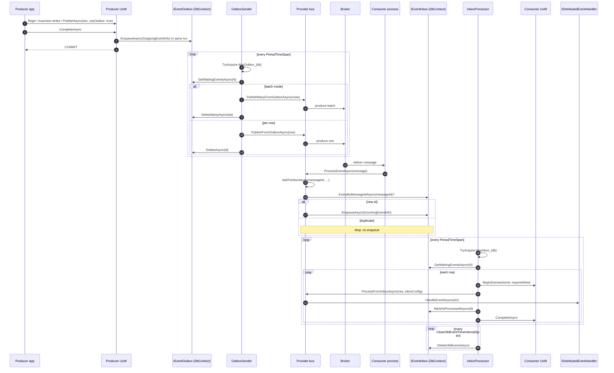

ABP's **transactional outbox / idempotent inbox** is the missing piece between "I called `PublishAsync`" and "my consumer ran the handler". It turns the unreliable network round-trip with the broker into two **local** transactions plus two **polled** background workers — together they give you at-least-once delivery, exactly-once processing per consumer, and durability against crashes between publish and broker-ack.

The pattern lives in `Volo.Abp.EventBus`. Storage adapters (EF Core, MongoDB) plug in via `IEventOutbox` / `IEventInbox`; the polling, batching, distributed locking and lifecycle is generic.

This page covers everything from the `Volo/Abp/EventBus/Distributed/` folder that isn't the bus itself: the **two background-worker managers**, the **two pollers**, the **boxes options**, and how `DistributedEventBusBase` participates from both sides.

## File inventory

| File | Purpose |
| --- | --- |
| `Volo/Abp/EventBus/Distributed/AbpEventBusBoxesOptions.cs` | Runtime knobs — period, batch size, distributed-lock wait, cleanup interval, `BatchPublishOutboxEvents`. |
| `Volo/Abp/EventBus/Distributed/OutboxSenderManager.cs` | `IBackgroundWorker` — starts one `IOutboxSender` per enabled `OutboxConfig`. |
| `Volo/Abp/EventBus/Distributed/OutboxSender.cs` | `ITransientDependency` — polls `IEventOutbox`, acquires a distributed lock, batch-publishes via the bus, deletes rows. |
| `Volo/Abp/EventBus/Distributed/InboxProcessManager.cs` | `IBackgroundWorker` — starts one `IInboxProcessor` per enabled `InboxConfig`. |
| `Volo/Abp/EventBus/Distributed/InboxProcessor.cs` | `ITransientDependency` — polls `IEventInbox`, dispatches via `ProcessFromInboxAsync` inside a new UoW, marks rows as processed, periodically cleans old rows. |
| `Volo/Abp/EventBus/Abstractions/Volo/Abp/EventBus/Distributed/InboxConfig.cs` | Per-inbox name, database, `ImplementationType`, `EventSelector`, `HandlerSelector`, `IsProcessingEnabled`. |
| `Volo/Abp/EventBus/Abstractions/Volo/Abp/EventBus/Distributed/OutboxConfig.cs` | Per-outbox name, database, `ImplementationType`, `Selector`, `IsSendingEnabled`. |
| `Volo/Abp/EventBus/Abstractions/Volo/Abp/EventBus/Distributed/InboxConfigDictionary.cs` | Dictionary helper. |
| `Volo/Abp/EventBus/Abstractions/Volo/Abp/EventBus/Distributed/OutboxConfigDictionary.cs` | Dictionary helper. |
| `Volo/Abp/EventBus/Abstractions/Volo/Abp/EventBus/Distributed/IEventOutbox.cs` | `EnqueueAsync` / `GetWaitingEventsAsync` / `DeleteAsync` / `DeleteManyAsync`. |
| `Volo/Abp/EventBus/Abstractions/Volo/Abp/EventBus/Distributed/IEventInbox.cs` | `EnqueueAsync` / `GetWaitingEventsAsync` / `MarkAsProcessedAsync` / `ExistsByMessageIdAsync` / `DeleteOldEventsAsync`. |
| `Volo/Abp/EventBus/Abstractions/Volo/Abp/EventBus/Distributed/IOutboxSender.cs` / `IInboxProcessor.cs` | `StartAsync(config)` / `StopAsync()` lifecycle pair. |
| `Volo/Abp/EventBus/Abstractions/Volo/Abp/EventBus/Distributed/ISupportsEventBoxes.cs` | Implemented by every broker provider — `PublishFromOutboxAsync`, `PublishManyFromOutboxAsync`, `ProcessFromInboxAsync`. |

## Key abstractions

| Symbol | Kind | File |
| --- | --- | --- |
| `AbpEventBusBoxesOptions` | options POCO | `AbpEventBusBoxesOptions.cs` |
| `OutboxSenderManager : IBackgroundWorker` | manager | `OutboxSenderManager.cs` |
| `OutboxSender : IOutboxSender, ITransientDependency` | worker | `OutboxSender.cs` |
| `InboxProcessManager : IBackgroundWorker` | manager | `InboxProcessManager.cs` |
| `InboxProcessor : IInboxProcessor, ITransientDependency` | worker | `InboxProcessor.cs` |
| `OutboxConfig` / `InboxConfig` | per-box config | `OutboxConfig.cs` / `InboxConfig.cs` |
| `IEventOutbox` / `IEventInbox` | storage contract | `IEventOutbox.cs` / `IEventInbox.cs` |
| `OutgoingEventInfo` / `IncomingEventInfo` | row DTO | `OutgoingEventInfo.cs` / `IncomingEventInfo.cs` |
| `ISupportsEventBoxes` | provider capability | `ISupportsEventBoxes.cs` |

## Options

```csharp title="AbpEventBusBoxesOptions.cs"
public class AbpEventBusBoxesOptions
{
    /// <summary>Default: 6 hours</summary>
    public TimeSpan CleanOldEventTimeIntervalSpan { get; set; }

    /// <summary>Default: 1000</summary>
    public int InboxWaitingEventMaxCount { get; set; }

    /// <summary>Default: 1000</summary>
    public int OutboxWaitingEventMaxCount { get; set; }

    /// <summary>Period of InboxProcessor and OutboxSender. Default: 2 seconds.</summary>
    public TimeSpan PeriodTimeSpan { get; set; }

    /// <summary>Default: 15 seconds</summary>
    public TimeSpan DistributedLockWaitDuration { get; set; }

    /// <summary>Default: 2 hours</summary>
    public TimeSpan WaitTimeToDeleteProcessedInboxEvents { get; set; }

    /// <summary>Default: true</summary>
    public bool BatchPublishOutboxEvents { get; set; }

    public AbpEventBusBoxesOptions()
    {
        CleanOldEventTimeIntervalSpan = TimeSpan.FromHours(6);
        InboxWaitingEventMaxCount = 1000;
        OutboxWaitingEventMaxCount = 1000;
        PeriodTimeSpan = TimeSpan.FromSeconds(2);
        DistributedLockWaitDuration = TimeSpan.FromSeconds(15);
        WaitTimeToDeleteProcessedInboxEvents = TimeSpan.FromHours(2);
        BatchPublishOutboxEvents = true;
    }
}
```

| Knob | Default | Meaning |
| --- | --- | --- |
| `PeriodTimeSpan` | 2 s | The timer period that drives both `OutboxSender` and `InboxProcessor`. Lower = lower latency under load; higher = fewer DB round-trips when idle. |
| `OutboxWaitingEventMaxCount` | 1000 | Max rows fetched per outbox poll. The sender keeps looping until the result is empty. |
| `InboxWaitingEventMaxCount` | 1000 | Same, for the inbox processor. |
| `DistributedLockWaitDuration` | 15 s | When `IAbpDistributedLock.TryAcquireAsync` fails (another instance owns the box), the worker sleeps this long before retrying. |
| `CleanOldEventTimeIntervalSpan` | 6 h | How often `InboxProcessor` calls `Inbox.DeleteOldEventsAsync` — the EF Core implementation deletes rows older than `WaitTimeToDeleteProcessedInboxEvents`. |
| `WaitTimeToDeleteProcessedInboxEvents` | 2 h | The retention window after `MarkAsProcessedAsync`. **Must exceed the broker's max redelivery delay** or you'll lose dedup against retries. |
| `BatchPublishOutboxEvents` | `true` | Use `PublishManyFromOutboxAsync` (single broker batch) instead of `PublishFromOutboxAsync` per row. Disable when the broker SDK doesn't support batches or you want one-by-one progress logs. |

<Note>
The `WaitTimeToDeleteProcessedInboxEvents` budget is **decoupled** from `CleanOldEventTimeIntervalSpan`. Setting cleanup to "every 6 hours" while keeping the retention at "2 hours" means a processed row lives between 2 and 8 hours before deletion. Both knobs are independent guards.
</Note>

## `OutboxConfig` and `InboxConfig`

```csharp title="OutboxConfig.cs"
public class OutboxConfig
{
    [NotNull] public string Name { get; }

    [NotNull]
    public string DatabaseName {
        get => _databaseName;
        set => _databaseName = Check.NotNullOrWhiteSpace(value, nameof(DatabaseName));
    }
    [NotNull] private string _databaseName;

    public Type ImplementationType { get; set; }
    public Func<Type, bool> Selector { get; set; }

    /// <summary>Default: true</summary>
    public bool IsSendingEnabled { get; set; } = true;

    public OutboxConfig([NotNull] string name) { /* throws if blank */ }
}
```

```csharp title="InboxConfig.cs"
public class InboxConfig
{
    [NotNull] public string Name { get; }
    [NotNull] public string DatabaseName { /* throws if blank */ }
    public Type ImplementationType { get; set; }
    public Func<Type, bool> EventSelector { get; set; }
    public Func<Type, bool> HandlerSelector { get; set; }

    /// <summary>Default: true</summary>
    public bool IsProcessingEnabled { get; set; } = true;
}
```

| Field | Outbox | Inbox |
| --- | --- | --- |
| `Name` | Dictionary key (e.g. `"Default"`, `"PaymentsDb"`). Stamped into the distributed-lock name. | Same. |
| `DatabaseName` | The logical database the worker takes a lock on (`AbpOutbox_{DatabaseName}`). Lets multiple Abp apps sharing a database safely share a lock. | `AbpInbox_{DatabaseName}`. |
| `ImplementationType` | Concrete `IEventOutbox` to resolve. Set by the EF Core / Mongo modules. | Same for `IEventInbox`. |
| `Selector` / `EventSelector` | `Func<Type, bool>` — only route events matching this predicate into this outbox/inbox. `null` = catch-all. | Same. |
| `HandlerSelector` | — | `Func<Type, bool>` — when inbox-replaying, only fire handlers matching the predicate. Used to split work across services. |
| `IsSendingEnabled` / `IsProcessingEnabled` | Suspend the worker without removing the config. | Same. |

### Dictionary helpers

```csharp title="OutboxConfigDictionary.cs"
public class OutboxConfigDictionary : Dictionary<string, OutboxConfig>
{
    public void Configure(Action<OutboxConfig> configAction) => Configure("Default", configAction);

    public void Configure(string outboxName, Action<OutboxConfig> configAction)
    {
        var outboxConfig = this.GetOrAdd(outboxName, () => new OutboxConfig(outboxName));
        configAction(outboxConfig);
    }
}
```

`InboxConfigDictionary` is identical in shape. The convention `Configure("Default", x => …)` is what every EF Core extension method calls under the hood:

```csharp title="Typical wiring (in your module)"
Configure<AbpDistributedEventBusOptions>(options =>
{
    options.Outboxes.Configure(config =>
    {
        config.UseDbContext<MyDbContext>();   // sets ImplementationType + DatabaseName
        // optional:
        config.Selector = type => typeof(IPaymentEto).IsAssignableFrom(type);
    });
    options.Inboxes.Configure(config =>
    {
        config.UseDbContext<MyDbContext>();
        config.HandlerSelector = type => type.Namespace?.StartsWith("Payments.Handlers") == true;
    });
});
```

(`UseDbContext<T>()` is an EF Core extension defined outside the core EventBus module.)

## `OutboxSender` — polled, locked, batched

`OutboxSender` is a transient service that the manager spins up once per `OutboxConfig`. It owns a `AbpAsyncTimer`, an `IAbpDistributedLock`, and a reference to the distributed bus (cast to `ISupportsEventBoxes` at publish time).

```csharp title="OutboxSender.cs (excerpt) — ctor and Start/Stop"
public class OutboxSender : IOutboxSender, ITransientDependency
{
    protected IServiceProvider ServiceProvider { get; }
    protected AbpAsyncTimer Timer { get; }
    protected IDistributedEventBus DistributedEventBus { get; }
    protected IAbpDistributedLock DistributedLock { get; }
    protected IEventOutbox Outbox { get; private set; }
    protected OutboxConfig OutboxConfig { get; private set; }
    protected AbpEventBusBoxesOptions EventBusBoxesOptions { get; }
    protected string DistributedLockName { get; private set; }
    public ILogger<OutboxSender> Logger { get; set; }

    protected CancellationTokenSource StoppingTokenSource { get; }
    protected CancellationToken StoppingToken { get; }

    public OutboxSender(
        IServiceProvider serviceProvider,
        AbpAsyncTimer timer,
        IDistributedEventBus distributedEventBus,
        IAbpDistributedLock distributedLock,
        IOptions<AbpEventBusBoxesOptions> eventBusBoxesOptions)
    {
        ServiceProvider = serviceProvider;
        DistributedEventBus = distributedEventBus;
        DistributedLock = distributedLock;
        EventBusBoxesOptions = eventBusBoxesOptions.Value;
        Timer = timer;
        Timer.Period = Convert.ToInt32(EventBusBoxesOptions.PeriodTimeSpan.TotalMilliseconds);
        Timer.Elapsed += TimerOnElapsed;
        Logger = NullLogger<OutboxSender>.Instance;
        StoppingTokenSource = new CancellationTokenSource();
        StoppingToken = StoppingTokenSource.Token;
    }

    public virtual Task StartAsync(OutboxConfig outboxConfig, CancellationToken cancellationToken = default)
    {
        OutboxConfig = outboxConfig;
        Outbox = (IEventOutbox)ServiceProvider.GetRequiredService(outboxConfig.ImplementationType);
        DistributedLockName = $"AbpOutbox_{OutboxConfig.DatabaseName}";
        Timer.Start(cancellationToken);
        return Task.CompletedTask;
    }

    public virtual Task StopAsync(CancellationToken cancellationToken = default)
    {
        StoppingTokenSource.Cancel();
        Timer.Stop(cancellationToken);
        StoppingTokenSource.Dispose();
        return Task.CompletedTask;
    }
```

A few specifics:

- The `Outbox` is resolved at `StartAsync`, not in the constructor. Two senders for two `OutboxConfig`s can resolve **two different** `IEventOutbox` instances from the same DI container.
- `DistributedLockName = "AbpOutbox_{DatabaseName}"` — the **`Name`** field is not part of the lock; the `DatabaseName` is. That's deliberate: two outboxes that share a database must serialise their polling, otherwise both could read the same rows and produce duplicates on the broker. Two outboxes against **different** databases run concurrently.
- The `AbpAsyncTimer` is the same primitive ABP uses for any periodic worker — see `Volo.Abp.Threading`.

### The polling loop

```csharp title="OutboxSender.cs (excerpt) — RunAsync"
protected virtual async Task RunAsync()
{
    await using (var handle = await DistributedLock.TryAcquireAsync(
                     DistributedLockName, cancellationToken: StoppingToken))
    {
        if (handle != null)
        {
            while (true)
            {
                var waitingEvents = await Outbox.GetWaitingEventsAsync(
                    EventBusBoxesOptions.OutboxWaitingEventMaxCount, StoppingToken);

                if (waitingEvents.Count <= 0) break;

                Logger.LogInformation($"Found {waitingEvents.Count} events in the outbox.");

                if (EventBusBoxesOptions.BatchPublishOutboxEvents)
                {
                    await PublishOutgoingMessagesInBatchAsync(waitingEvents);
                }
                else
                {
                    await PublishOutgoingMessagesAsync(waitingEvents);
                }
            }
        }
        else
        {
            Logger.LogDebug("Could not obtain the distributed lock: " + DistributedLockName);
            try { await Task.Delay(EventBusBoxesOptions.DistributedLockWaitDuration, StoppingToken); }
            catch (TaskCanceledException) { }
        }
    }
}

protected virtual async Task PublishOutgoingMessagesAsync(List<OutgoingEventInfo> waitingEvents)
{
    foreach (var waitingEvent in waitingEvents)
    {
        await DistributedEventBus.AsSupportsEventBoxes()
            .PublishFromOutboxAsync(waitingEvent, OutboxConfig);

        await Outbox.DeleteAsync(waitingEvent.Id);

        Logger.LogInformation($"Sent the event to the message broker with id = {waitingEvent.Id:N}");
    }
}

protected virtual async Task PublishOutgoingMessagesInBatchAsync(List<OutgoingEventInfo> waitingEvents)
{
    await DistributedEventBus.AsSupportsEventBoxes()
        .PublishManyFromOutboxAsync(waitingEvents, OutboxConfig);

    await Outbox.DeleteManyAsync(waitingEvents.Select(x => x.Id).ToArray());

    Logger.LogInformation($"Sent {waitingEvents.Count} events to message broker");
}
```

Semantics worth flagging:

- **Lock-or-wait, never lock-and-wait.** The lock is acquired with `TryAcquireAsync` (non-blocking). If it fails, the worker sleeps for `DistributedLockWaitDuration` and the timer ticks again — there is no queue, the loser just retries.
- **Drain-on-tick.** Once the lock is held, the worker loops until `GetWaitingEventsAsync` returns 0. A timer tick can therefore process millions of rows under sustained load.
- **Per-row delete in non-batch mode.** If the broker call succeeds and the delete then fails (DB outage), the next poll redelivers — at-least-once.
- **Batch mode is all-or-nothing per chunk.** In `PublishOutgoingMessagesInBatchAsync`, a failure in `PublishManyFromOutboxAsync` leaves the entire chunk in the table. Providers that use publisher confirms (RabbitMQ's `channel.ConfirmSelect()` + `WaitForConfirmsOrDie`) make this safe; providers that don't, can produce duplicates.

## `OutboxSenderManager` — one sender per config

```csharp title="OutboxSenderManager.cs"
public class OutboxSenderManager : IBackgroundWorker
{
    protected AbpDistributedEventBusOptions Options { get; }
    protected IServiceProvider ServiceProvider { get; }
    protected List<IOutboxSender> Senders { get; }

    public OutboxSenderManager(
        IOptions<AbpDistributedEventBusOptions> options,
        IServiceProvider serviceProvider)
    {
        ServiceProvider = serviceProvider;
        Options = options.Value;
        Senders = new List<IOutboxSender>();
    }

    public async Task StartAsync(CancellationToken cancellationToken = default)
    {
        foreach (var outboxConfig in Options.Outboxes.Values)
        {
            if (outboxConfig.IsSendingEnabled)
            {
                var sender = ServiceProvider.GetRequiredService<IOutboxSender>();
                await sender.StartAsync(outboxConfig, cancellationToken);
                Senders.Add(sender);
            }
        }
    }

    public async Task StopAsync(CancellationToken cancellationToken = default)
    {
        foreach (var sender in Senders)
        {
            await sender.StopAsync(cancellationToken);
        }
    }
}
```

The manager is registered as a background worker by `AbpEventBusModule.OnApplicationInitializationAsync`. When `AbpDistributedEventBusOptions.Outboxes` is empty, the manager iterates over nothing and starts nothing — there is zero overhead for apps that don't use the outbox.

`InboxProcessManager` is symmetrical (`IsProcessingEnabled` instead of `IsSendingEnabled`):

```csharp title="InboxProcessManager.cs (excerpt)"
public async Task StartAsync(CancellationToken cancellationToken = default)
{
    foreach (var inboxConfig in Options.Inboxes.Values)
    {
        if (inboxConfig.IsProcessingEnabled)
        {
            var processor = ServiceProvider.GetRequiredService<IInboxProcessor>();
            await processor.StartAsync(inboxConfig, cancellationToken);
            Processors.Add(processor);
        }
    }
}
```

## `InboxProcessor` — polled, locked, transactional dispatch

```csharp title="InboxProcessor.cs (excerpt) — ctor and Start"
public class InboxProcessor : IInboxProcessor, ITransientDependency
{
    protected IServiceProvider ServiceProvider { get; }
    protected AbpAsyncTimer Timer { get; }
    protected IDistributedEventBus DistributedEventBus { get; }
    protected IAbpDistributedLock DistributedLock { get; }
    protected IUnitOfWorkManager UnitOfWorkManager { get; }
    protected IClock Clock { get; }
    protected IEventInbox Inbox { get; private set; }
    protected InboxConfig InboxConfig { get; private set; }
    protected AbpEventBusBoxesOptions EventBusBoxesOptions { get; }

    protected DateTime? LastCleanTime { get; set; }
    protected string DistributedLockName { get; private set; }

    public Task StartAsync(InboxConfig inboxConfig, CancellationToken cancellationToken = default)
    {
        InboxConfig = inboxConfig;
        Inbox = (IEventInbox)ServiceProvider.GetRequiredService(inboxConfig.ImplementationType);
        DistributedLockName = $"AbpInbox_{InboxConfig.DatabaseName}";
        Timer.Start(cancellationToken);
        return Task.CompletedTask;
    }
```

### Per-tick work — clean, drain, dispatch

```csharp title="InboxProcessor.cs (excerpt) — RunAsync"
protected virtual async Task RunAsync()
{
    if (StoppingToken.IsCancellationRequested) return;

    await using (var handle = await DistributedLock.TryAcquireAsync(
                     DistributedLockName, cancellationToken: StoppingToken))
    {
        if (handle != null)
        {
            await DeleteOldEventsAsync();

            while (true)
            {
                var waitingEvents = await Inbox.GetWaitingEventsAsync(
                    EventBusBoxesOptions.InboxWaitingEventMaxCount, StoppingToken);

                if (waitingEvents.Count <= 0) break;

                Logger.LogInformation($"Found {waitingEvents.Count} events in the inbox.");

                foreach (var waitingEvent in waitingEvents)
                {
                    using (var uow = UnitOfWorkManager.Begin(
                                          isTransactional: true, requiresNew: true))
                    {
                        await DistributedEventBus.AsSupportsEventBoxes()
                            .ProcessFromInboxAsync(waitingEvent, InboxConfig);

                        await Inbox.MarkAsProcessedAsync(waitingEvent.Id);

                        await uow.CompleteAsync(StoppingToken);
                    }

                    Logger.LogInformation($"Processed the incoming event with id = {waitingEvent.Id:N}");
                }
            }
        }
        else
        {
            Logger.LogDebug("Could not obtain the distributed lock: " + DistributedLockName);
            try { await Task.Delay(EventBusBoxesOptions.DistributedLockWaitDuration, StoppingToken); }
            catch (TaskCanceledException) { }
        }
    }
}

protected virtual async Task DeleteOldEventsAsync()
{
    if (LastCleanTime != null &&
        LastCleanTime + EventBusBoxesOptions.CleanOldEventTimeIntervalSpan > Clock.Now)
    {
        return;
    }

    await Inbox.DeleteOldEventsAsync();
    LastCleanTime = Clock.Now;
}
```

Key invariants:

- **One UoW per row.** Each inbox row is dispatched inside a **fresh, transactional, top-level UoW** (`isTransactional: true, requiresNew: true`). That UoW wraps both the handlers' side effects (writes to the local DB) and `MarkAsProcessedAsync`. They commit together. If the handlers throw, the UoW rolls back, the row stays unprocessed, and the next tick retries.
- **The clean step runs only after acquiring the lock.** That keeps cleanup serialised across cluster members.
- **`LastCleanTime` is per-process.** When a node loses the lock and another takes over, the new node's clock starts from `null` — so cleanup may run more often than `CleanOldEventTimeIntervalSpan` during failover. Harmless: `DeleteOldEventsAsync` is idempotent.

<Tip>
Putting `MarkAsProcessedAsync` **inside** the same UoW as the handler's writes is what gives you **exactly-once-per-consumer** semantics. If you wrote your own handler that opened a separate transaction, you'd lose that guarantee.
</Tip>

## End-to-end picture



## Deduplication, retries, ordering

**Deduplication** is `IEventInbox.ExistsByMessageIdAsync(messageId)` — called inside `DistributedEventBusBase.AddToInboxAsync`. The `messageId` is the **broker's** native id (RabbitMQ `BasicProperties.MessageId`, Kafka `messageId` header, Azure `ServiceBusReceivedMessage.MessageId`, Rebus `Headers.MessageId`, Dapr `AbpDaprEventData.MessageId`). Providers must set this on send so that a redelivery has the same id.

**Retries** come for free from the broker. The processor only marks an inbox row as processed after the handler returns; on exception the row stays unprocessed and the next tick reruns it. Be aware: this is a tight retry loop (every `PeriodTimeSpan`) — if your handler is failing for a transient reason it will hammer until success or until you suspend the inbox via `IsProcessingEnabled = false`.

**Ordering** is **not guaranteed across rows**. `GetWaitingEventsAsync` typically orders by `CreationTime`, but two outbox rows enqueued in different transactions can interleave on the broker — and `InboxProcessor` processes rows sequentially per inbox, not globally. If you need strict ordering, partition by an aggregate id at the broker level (e.g. Kafka partitioning by `eventName`/key).

## `HandlerSelector` and the "shared inbox table, different handlers" pattern

`InboxConfig.HandlerSelector` is the more subtle of the two selectors. It runs **inside `EventBusBase.TriggerHandlerAsync`** when the inbox is replaying:

```csharp title="EventBusBase.cs (excerpt)"
if (inboxConfig?.HandlerSelector != null &&
    !inboxConfig.HandlerSelector(handlerType))
{
    return;
}
```

A common deployment shape uses this:

| Module | EventSelector | HandlerSelector |
| --- | --- | --- |
| Payments service | `t => t.IsAssignableTo(typeof(IPaymentEto))` | `t => t.Namespace.StartsWith("Payments.")` |
| Notifications service | `t => true` (catch all) | `t => t.Namespace.StartsWith("Notifications.")` |

Both services share the **same** `DbContext` and inbox table (they run in the same monolith), but the inbox runs each service's handlers separately. `EventSelector` controls *what gets enqueued*; `HandlerSelector` controls *what fires when the row is dispatched*.

## Provider responsibilities

Each provider implements `ISupportsEventBoxes` on top of `DistributedEventBusBase`. The general shape:

```csharp title="Provider pattern — outbox side"
public override async Task PublishFromOutboxAsync(OutgoingEventInfo row, OutboxConfig outboxConfig)
{
    using (CorrelationIdProvider.Change(row.GetCorrelationId()))
    {
        await TriggerDistributedEventSentAsync(new DistributedEventSent {
            Source = DistributedEventSource.Outbox,
            EventName = row.EventName,
            EventData = row.EventData
        });
    }

    // Provider-specific: send to broker with eventId = row.Id, correlationId = row.GetCorrelationId()
    await SendToBrokerAsync(row);
}
```

```csharp title="Provider pattern — inbox side"
public override async Task ProcessFromInboxAsync(IncomingEventInfo row, InboxConfig inboxConfig)
{
    var eventType = EventTypes.GetOrDefault(row.EventName);
    if (eventType == null) return;

    var eventData = Serializer.Deserialize(row.EventData, eventType);
    var exceptions = new List<Exception>();
    using (CorrelationIdProvider.Change(row.GetCorrelationId()))
    {
        await TriggerHandlersFromInboxAsync(eventType, eventData, exceptions, inboxConfig);
    }
    if (exceptions.Any()) ThrowOriginalExceptions(eventType, exceptions);
}
```

The two functions are mirror-images: outbox publishes a stored row (and fires the `DistributedEventSent` diagnostic with `Source = Outbox`); inbox replays a stored row (and fires `DistributedEventReceived` with `Source = Inbox` inside `TriggerHandlersFromInboxAsync`).

## Failure modes and what saves you

| Failure | Saved by | Outcome |
| --- | --- | --- |
| Crash after business write, before broker call | Outbox enqueue inside the same DB txn | Next `OutboxSender` poll publishes. |
| Crash after broker call, before delete | `IEventOutbox.DeleteAsync` not yet committed | Duplicate broker message. Inbox dedups via `MessageId`. |
| Two app instances poll the same outbox | `IAbpDistributedLock` keyed by `DatabaseName` | Only one drains at a time. |
| Consumer crashes mid-handler | Top-level UoW per row | Row stays unprocessed; next tick retries. |
| Broker redelivers the same message | `ExistsByMessageIdAsync` | Duplicate dropped at inbox enqueue. |
| Inbox table fills up | `DeleteOldEventsAsync` every `CleanOldEventTimeIntervalSpan` | Processed rows older than `WaitTimeToDeleteProcessedInboxEvents` are removed. |
| `LocalDistributedEventBus` registered (no broker) | `AsSupportsEventBoxes()` throws | Workers fail loudly at startup if you wire an outbox without a provider. |

## Gotchas

<Note>
`AddToOutboxAsync` returns `false` when no UoW is open. Publishing from a `BackgroundWorker` therefore **bypasses the outbox** even with `useOutbox: true` — wrap in `using var uow = UnitOfWorkManager.Begin(requiresNew: true)` to get outbox semantics.
</Note>

<Note>
`WaitTimeToDeleteProcessedInboxEvents` must exceed the broker's longest redelivery window. RabbitMQ default `delivery_limit` and Kafka's `auto.offset.reset = earliest` can resurface very old messages — pick a value matching your operational reality.
</Note>

<Note>
`BatchPublishOutboxEvents = true` is incompatible with providers that don't issue per-batch acks. The shipped RabbitMQ, Kafka, Azure, Rebus and Dapr providers all implement `PublishManyFromOutboxAsync` correctly; custom providers must too, or you get **double-delivery on transient broker errors**.
</Note>

<Note>
`InboxProcessor.RunAsync` calls `DistributedLock.TryAcquireAsync(...)` **per tick**. Acquire-then-release-then-reacquire pings the lock store every `PeriodTimeSpan`. With Redis as the lock store this is fine; with a SQL-based lock provider, tune `PeriodTimeSpan` to avoid hammering the DB.
</Note>

<Note>
`HandlerSelector` is **only** consulted by inbox-replayed dispatch. Direct dispatch (when inboxes are empty) does **not** filter — your handler fires regardless of namespace. Use `EventSelector` to control which events are even enqueued.
</Note>

## Cross-links

<CardGroup cols={2}>
<Card title="Distributed EventBus" icon="tower-broadcast" href="/framework/eventbus/distributed-eventbus">
`DistributedEventBusBase.AddToOutboxAsync` / `AddToInboxAsync`, options.
</Card>
<Card title="Abstractions" icon="diagram-project" href="/framework/eventbus/abstractions">
`IEventOutbox`, `IEventInbox`, `ISupportsEventBoxes`, `OutboxConfig`, `InboxConfig`.
</Card>
<Card title="Local EventBus" icon="bolt" href="/framework/eventbus/local-eventbus">
`UnitOfWorkEventPublisher` — the producer-side glue.
</Card>
<Card title="RabbitMQ" icon="rabbit" href="/framework/eventbus/rabbitmq">
`PublishManyFromOutboxAsync` with `channel.ConfirmSelect()` + `WaitForConfirmsOrDie`.
</Card>
<Card title="Kafka" icon="layer-group" href="/framework/eventbus/kafka">
`PublishManyFromOutboxAsync` via `Produce` (fire-and-forget) per row.
</Card>
<Card title="Azure" icon="cloud" href="/framework/eventbus/azure">
`PublishManyFromOutboxAsync` via `ServiceBusMessageBatch`.
</Card>
</CardGroup>
