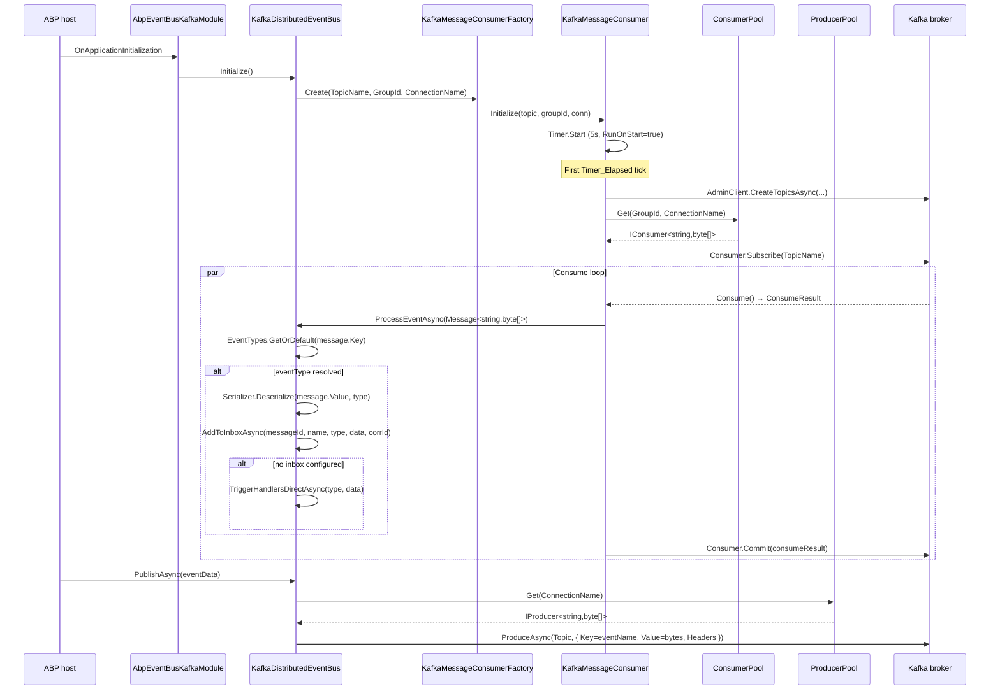

`Volo.Abp.EventBus.Kafka` plugs ABP's `IDistributedEventBus` into Apache Kafka through Confluent's `Confluent.Kafka` client (`IProducer<,>`, `IConsumer<,>`, `Message<,>`). It sits on top of the lower-level `Volo.Abp.Kafka` package, which owns the producer/consumer **pools**, the message-consumer abstraction, the JSON serializer, and the `AdminClient` topic creation — all reusable for non-EventBus Kafka scenarios.

The EventBus integration:

- Reads `Kafka:EventBus` from `IConfiguration` into `AbpKafkaEventBusOptions { ConnectionName, TopicName, GroupId }`.
- On `OnApplicationInitialization` calls `KafkaDistributedEventBus.Initialize()`, which creates **one** `IKafkaMessageConsumer` for `(TopicName, GroupId, ConnectionName)` and registers `ProcessEventAsync` as the callback.
- Each event type maps to a Kafka **message key** — the wire-level name from `EventNameAttribute.GetNameOrDefault(type)`. There is no per-event-type topic.
- Publishing goes through `ProducerPool.Get(connectionName)` → `producer.ProduceAsync(topic, new Message<string, byte[]> { Key, Value, Headers })`. Outbox batch publishing uses fire-and-forget `producer.Produce(...)` against the same shared producer.

## File inventory

| File | Purpose |
| --- | --- |
| `Volo.Abp.EventBus.Kafka/Volo/Abp/EventBus/Kafka/AbpEventBusKafkaModule.cs` | Module — binds `Kafka:EventBus`, calls `KafkaDistributedEventBus.Initialize()` on startup. |
| `Volo.Abp.EventBus.Kafka/Volo/Abp/EventBus/Kafka/AbpKafkaEventBusOptions.cs` | `ConnectionName`, `TopicName`, `GroupId`. |
| `Volo.Abp.EventBus.Kafka/Volo/Abp/EventBus/Kafka/KafkaDistributedEventBus.cs` | `[Dependency(ReplaceServices = true)]` `DistributedEventBusBase` subclass — the main wiring. |
| `Volo.Abp.EventBus.Kafka/Volo/Abp/EventBus/Kafka/MessageExtensions.cs` | `Message<string,byte[]>.GetMessageId()` / `GetCorrelationId()` header helpers. |
| `Volo.Abp.Kafka/Volo/Abp/Kafka/AbpKafkaModule.cs` | Lower-level module — binds `Kafka` config, disposes `IConsumerPool` / `IProducerPool` on shutdown. |
| `Volo.Abp.Kafka/Volo/Abp/Kafka/AbpKafkaOptions.cs` | `Connections : KafkaConnections` + `ConfigureProducer/Consumer/Topic` action hooks. |
| `Volo.Abp.Kafka/Volo/Abp/Kafka/KafkaConnections.cs` | `Dictionary<string, ClientConfig>` keyed on connection name; `DefaultConnectionName = "Default"`. |
| `Volo.Abp.Kafka/Volo/Abp/Kafka/IConsumerPool.cs` / `ConsumerPool.cs` | `IConsumer<string, byte[]> Get(groupId, connectionName)` — singleton, `Lazy` per connection name. |
| `Volo.Abp.Kafka/Volo/Abp/Kafka/IProducerPool.cs` / `ProducerPool.cs` | `IProducer<string, byte[]> Get(connectionName)` — singleton, `Lazy` per connection name. |
| `Volo.Abp.Kafka/Volo/Abp/Kafka/IKafkaMessageConsumer.cs` / `KafkaMessageConsumer.cs` | Transient consumer wrapper; owns the consume loop, topic creation, callback fan-out. |
| `Volo.Abp.Kafka/Volo/Abp/Kafka/IKafkaMessageConsumerFactory.cs` / `KafkaMessageConsumerFactory.cs` | Singleton factory that resolves `KafkaMessageConsumer` from an internal `IServiceScope`. |
| `Volo.Abp.Kafka/Volo/Abp/Kafka/IKafkaSerializer.cs` / `Utf8JsonKafkaSerializer.cs` | `byte[] Serialize(object)` / `object Deserialize(byte[], Type)`. |

## Key abstractions

| Symbol | Kind | File |
| --- | --- | --- |
| `KafkaDistributedEventBus : DistributedEventBusBase, ISingletonDependency` | `[Dependency(ReplaceServices = true)]`, exposes `IDistributedEventBus` | `KafkaDistributedEventBus.cs` |
| `AbpKafkaEventBusOptions` | options POCO — `ConnectionName`, `TopicName`, `GroupId` | `AbpKafkaEventBusOptions.cs` |
| `AbpKafkaOptions` | `KafkaConnections Connections` + `Action<ProducerConfig\|ConsumerConfig\|TopicSpecification>` hooks | `AbpKafkaOptions.cs` |
| `KafkaConnections : Dictionary<string, ClientConfig>` | connection registry; `Default` always present | `KafkaConnections.cs` |
| `IConsumerPool.Get(string groupId, string? connectionName)` | per-connection `Lazy<IConsumer<string, byte[]>>` | `ConsumerPool.cs` |
| `IProducerPool.Get(string? connectionName)` | per-connection `Lazy<IProducer<string, byte[]>>` | `ProducerPool.cs` |
| `IKafkaMessageConsumer.Initialize(topic, groupId, connectionName)` / `OnMessageReceived(...)` | the live consumer wrapper | `KafkaMessageConsumer.cs` |
| `IKafkaMessageConsumerFactory.Create(topic, groupId, connectionName)` | singleton, scoped internal `IServiceProvider` | `KafkaMessageConsumerFactory.cs` |
| `IKafkaSerializer` | byte-array serializer | `IKafkaSerializer.cs` |

## Initialize / Subscribe / Publish control flow



## Module wiring

`AbpEventBusKafkaModule` depends on `AbpEventBusModule` + `AbpKafkaModule`, binds the configuration section, and triggers the consumer in the initialize phase:

```csharp
[DependsOn(typeof(AbpEventBusModule), typeof(AbpKafkaModule))]
public class AbpEventBusKafkaModule : AbpModule
{
    public override void ConfigureServices(ServiceConfigurationContext context)
    {
        var configuration = context.Services.GetConfiguration();
        Configure<AbpKafkaEventBusOptions>(configuration.GetSection("Kafka:EventBus"));
    }

    public override void OnApplicationInitialization(ApplicationInitializationContext context)
    {
        context.ServiceProvider
            .GetRequiredService<KafkaDistributedEventBus>()
            .Initialize();
    }
}
```

`AbpKafkaModule` binds the bare `Kafka` section into `AbpKafkaOptions` and disposes the pools on shutdown:

```csharp
public override void OnApplicationShutdown(ApplicationShutdownContext context)
{
    context.ServiceProvider.GetRequiredService<IConsumerPool>().Dispose();
    context.ServiceProvider.GetRequiredService<IProducerPool>().Dispose();
}
```

## Options

### `AbpKafkaEventBusOptions` (`Kafka:EventBus` section)

| Property | Type | Notes |
| --- | --- | --- |
| `ConnectionName` | `string` | Resolves a `ClientConfig` from `AbpKafkaOptions.Connections`. `null` → `"Default"`. |
| `TopicName` | `string` | Single topic used for **all** distributed events; routing happens via `Message.Key`. |
| `GroupId` | `string` | Kafka consumer group — set per app instance you want to compete. |

### `AbpKafkaOptions` (`Kafka` section)

| Property | Type | Notes |
| --- | --- | --- |
| `Connections` | `KafkaConnections` | `Dictionary<string, ClientConfig>` of broker connection definitions. The constructor seeds `Default = new ClientConfig()`. |
| `ConfigureProducer` | `Action<ProducerConfig>` | Mutates the `ProducerConfig` before `ProducerBuilder.Build()`. |
| `ConfigureConsumer` | `Action<ConsumerConfig>` | Mutates `ConsumerConfig` after `GroupId` and `EnableAutoCommit = false` are forced. |
| `ConfigureTopic` | `Action<TopicSpecification>` | Tweak the default `NumPartitions=1, ReplicationFactor=1` topic created on first consume. |

`KafkaConnections.DefaultConnectionName` is the literal string `"Default"`; `GetOrDefault(connectionName)` falls back to `Default` when the key is missing.

## Walkthrough — Initialize

`KafkaDistributedEventBus.Initialize()` runs once, in `OnApplicationInitialization`:

```csharp
public void Initialize()
{
    Consumer = MessageConsumerFactory.Create(
        AbpKafkaEventBusOptions.TopicName,
        AbpKafkaEventBusOptions.GroupId,
        AbpKafkaEventBusOptions.ConnectionName);
    Consumer.OnMessageReceived(ProcessEventAsync);

    SubscribeHandlers(AbpDistributedEventBusOptions.Handlers);
}
```

`MessageConsumerFactory` is a singleton with its own `IServiceScope` so it can resolve the transient `KafkaMessageConsumer`:

```csharp
public KafkaMessageConsumerFactory(IServiceScopeFactory serviceScopeFactory)
{
    ServiceScope = serviceScopeFactory.CreateScope();
}

public IKafkaMessageConsumer Create(string topicName, string groupId, string connectionName = null)
{
    var consumer = ServiceScope.ServiceProvider.GetRequiredService<KafkaMessageConsumer>();
    consumer.Initialize(topicName, groupId, connectionName);
    return consumer;
}
```

`KafkaMessageConsumer.Initialize(...)` stores topic/group/connection and starts an `AbpAsyncTimer` with `Period = 5000ms, RunOnStart = true`. The first tick lazily creates the topic and kicks off a long-running consume task:

```csharp
protected virtual async Task Timer_Elapsed(AbpAsyncTimer timer)
{
    if (Consumer == null)
    {
        await CreateTopicAsync();
        Consume();
    }
}

protected virtual async Task CreateTopicAsync()
{
    using (var adminClient = new AdminClientBuilder(Options.Connections.GetOrDefault(ConnectionName)).Build())
    {
        var topic = new TopicSpecification { Name = TopicName, NumPartitions = 1, ReplicationFactor = 1 };
        Options.ConfigureTopic?.Invoke(topic);

        try { await adminClient.CreateTopicsAsync(new[] { topic }); }
        catch (CreateTopicsException e)
        {
            if (e.Results.Any(x => x.Error.Code != ErrorCode.TopicAlreadyExists))
                throw;
        }
    }
}
```

The consume loop runs on `Task.Factory.StartNew(..., TaskCreationOptions.LongRunning)`, drains via `Consumer.Consume()`, fans out to every registered callback, then **commits manually** (auto-commit is disabled at pool construction):

```csharp
protected virtual void Consume()
{
    Consumer = ConsumerPool.Get(GroupId, ConnectionName);

    Task.Factory.StartNew(async () =>
    {
        Consumer.Subscribe(TopicName);

        while (true)
        {
            try
            {
                var consumeResult = Consumer.Consume();
                if (consumeResult.IsPartitionEOF) continue;
                await HandleIncomingMessage(consumeResult);
            }
            catch (ConsumeException ex)
            {
                Logger.LogException(ex, LogLevel.Warning);
                await ExceptionNotifier.NotifyAsync(ex, logLevel: LogLevel.Warning);
            }
        }
    }, TaskCreationOptions.LongRunning);
}

protected virtual async Task HandleIncomingMessage(ConsumeResult<string, byte[]> consumeResult)
{
    try
    {
        foreach (var callback in Callbacks)
            await callback(consumeResult.Message);
    }
    catch (Exception ex)
    {
        Logger.LogException(ex);
        await ExceptionNotifier.NotifyAsync(ex);
    }
    finally
    {
        Consumer.Commit(consumeResult);
    }
}
```

## Walkthrough — Subscribe

`Subscribe(Type, IEventHandlerFactory)` is identical in shape to RabbitMQ/Azure — it appends the factory to the per-event-type list inside `HandlerFactories` and indexes the wire name in `EventTypes` (Kafka uses the same dictionary for inbox/outbox lookup):

```csharp
public override IDisposable Subscribe(Type eventType, IEventHandlerFactory factory)
{
    var handlerFactories = GetOrCreateHandlerFactories(eventType);
    if (factory.IsInFactories(handlerFactories)) return NullDisposable.Instance;
    handlerFactories.Add(factory);
    return new EventHandlerFactoryUnregistrar(this, eventType, factory);
}

private List<IEventHandlerFactory> GetOrCreateHandlerFactories(Type eventType)
{
    return HandlerFactories.GetOrAdd(eventType, type =>
    {
        var eventName = EventNameAttribute.GetNameOrDefault(type);
        EventTypes.GetOrAdd(eventName, eventType);
        return new List<IEventHandlerFactory>();
    });
}
```

Unlike Rebus there is no broker-side subscription call — Kafka delivery is driven entirely by the single shared consumer and group id.

## Walkthrough — Publish

Direct publishes wrap event data + correlation header + a random `messageId` into a `Message<string, byte[]>`:

```csharp
protected async override Task PublishToEventBusAsync(Type eventType, object eventData)
{
    var headers = new Headers
    {
        { "messageId", Encoding.UTF8.GetBytes(Guid.NewGuid().ToString("N")) }
    };

    if (CorrelationIdProvider.Get() != null)
        headers.Add(EventBusConsts.CorrelationIdHeaderName,
                    Encoding.UTF8.GetBytes(CorrelationIdProvider.Get()!));

    await PublishAsync(AbpKafkaEventBusOptions.TopicName, eventType, eventData, headers);
}

private Task<DeliveryResult<string, byte[]>> PublishAsync(
    string topicName, string eventName, byte[] body, Headers headers)
{
    var producer = ProducerPool.Get(AbpKafkaEventBusOptions.ConnectionName);
    return producer.ProduceAsync(topicName,
        new Message<string, byte[]> { Key = eventName, Value = body, Headers = headers });
}
```

The outbox batch path (`PublishManyFromOutboxAsync`) uses fire-and-forget `producer.Produce(...)` against the shared producer — no per-call delivery confirmation. ABP relies on Confluent.Kafka's internal queueing + flush-on-dispose for at-least-once semantics; tune `linger.ms` / `acks` through `AbpKafkaOptions.ConfigureProducer`.

## Walkthrough — Receive

`ProcessEventAsync(Message<string, byte[]> message)` is the single callback registered by `Initialize()`:

```csharp
private async Task ProcessEventAsync(Message<string, byte[]> message)
{
    var eventName = message.Key;
    var eventType = EventTypes.GetOrDefault(eventName);
    if (eventType == null) return;             // not subscribed — silently drop

    var messageId = message.GetMessageId();
    var eventData = Serializer.Deserialize(message.Value, eventType);
    var correlationId = message.GetCorrelationId();

    if (await AddToInboxAsync(messageId, eventName, eventType, eventData, correlationId))
        return;                                // inbox took ownership

    using (CorrelationIdProvider.Change(correlationId))
        await TriggerHandlersDirectAsync(eventType, eventData);
}
```

When inbox processing is configured (`AbpEventBusBoxesOptions`), `AddToInboxAsync` persists the event and returns `true` — handler invocation is then driven by the inbox processor via `ProcessFromInboxAsync`, which re-deserializes the body and calls `TriggerHandlersFromInboxAsync`.

## Pools — singleton, lazy, disposed on shutdown

Both pools key `Lazy<>` by connection name and dispose their entries on app shutdown with a 10-second budget:

```csharp
public virtual IConsumer<string, byte[]> Get(string groupId, string connectionName = null)
{
    connectionName ??= KafkaConnections.DefaultConnectionName;

    return Consumers.GetOrAdd(connectionName,
        connection => new Lazy<IConsumer<string, byte[]>>(() =>
        {
            var config = new ConsumerConfig(
                Options.Connections.GetOrDefault(connection)
                       .ToDictionary(k => k.Key, v => v.Value))
            {
                GroupId = groupId,
                EnableAutoCommit = false
            };

            Options.ConfigureConsumer?.Invoke(config);
            return new ConsumerBuilder<string, byte[]>(config).Build();
        })).Value;
}
```

`EnableAutoCommit = false` is intentional and not overridable — the event bus commits manually per delivery in `HandleIncomingMessage`.

## Configuration sample

```json
{
  "Kafka": {
    "Connections": {
      "Default": { "BootstrapServers": "localhost:9092" }
    },
    "EventBus": {
      "ConnectionName": "Default",
      "TopicName": "MyApp.Events",
      "GroupId": "MyApp.Web"
    }
  }
}
```

## Gotchas

<Note>
**Pool keyed by connection name, not group id.** `ConsumerPool` caches one `IConsumer` per `connectionName`. If you call `Get("groupA", "Default")` and later `Get("groupB", "Default")`, the second `groupId` is ignored and the cached consumer with `groupA` is returned. Only the consumer the EventBus opened in `Initialize()` is safe to assume.
</Note>

<Note>
**Single topic, key-based routing.** All distributed events share `AbpKafkaEventBusOptions.TopicName`; the wire-level event name lives in `Message.Key`. Subscribers must subscribe to event types by `Type`, not by topic — Kafka partition assignment will deliver every event in the topic and ABP filters by `EventTypes` dictionary, silently dropping unknown keys.
</Note>

<Note>
**Topic auto-creation defaults to 1 partition.** `KafkaMessageConsumer.CreateTopicAsync` uses `NumPartitions = 1, ReplicationFactor = 1`. For production, set `AbpKafkaOptions.ConfigureTopic` or pre-create the topic out-of-band — otherwise every host will race to create the same single-partition topic on first startup.
</Note>

<Tip>
`PublishManyFromOutboxAsync` uses non-blocking `producer.Produce(...)` for the whole batch. Combine with `acks=all` and a `linger.ms` / `batch.size` tuned via `ConfigureProducer` if you need durability, and rely on application-level shutdown (`AbpKafkaModule.OnApplicationShutdown`) to dispose the pool — disposal triggers Confluent.Kafka's flush.
</Tip>

<Note>
`AbpKafkaEventBusOptions` has no `IsKafkaDisabled` flag — to deploy a host that should not consume, do not register `AbpEventBusKafkaModule` (or override `OnApplicationInitialization`).
</Note>

## Related pages

<CardGroup cols={2}>
  <Card title="Distributed EventBus core" icon="bolt" href="/framework/eventbus/distributed-eventbus">
    `DistributedEventBusBase`, the abstract class Kafka extends — subscription, UoW, inbox/outbox plumbing.
  </Card>
  <Card title="Inbox / Outbox" icon="box-archive" href="/framework/eventbus/inbox-outbox">
    How `AddToInboxAsync` and `PublishFromOutboxAsync` interact with the Kafka transport.
  </Card>
  <Card title="RabbitMQ EventBus" icon="rabbit" href="/framework/eventbus/rabbitmq">
    Sibling broker integration — same `DistributedEventBusBase`, very different topology.
  </Card>
  <Card title="EventBus abstractions" icon="diagram-project" href="/framework/eventbus/abstractions">
    `IDistributedEventBus`, `IEventHandlerFactory`, and the `EventNameAttribute` mechanism.
  </Card>
</CardGroup>
