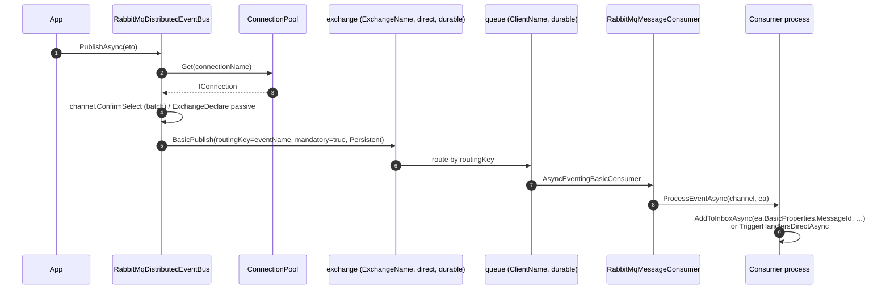

`Volo.Abp.EventBus.RabbitMQ` plugs ABP's `IDistributedEventBus` into RabbitMQ via the official `RabbitMQ.Client` library (`IModel`, `IConnection`, `BasicDeliverEventArgs`). It lives **on top of** the more general `Volo.Abp.RabbitMQ` package, which provides the connection / channel pool and the message-consumer abstraction — both reusable for any RabbitMQ scenario, not just the EventBus.

The EventBus integration:

- Declares a single **exchange** (default name from configuration; default type `direct`, durable).
- Creates a single **queue** named after `ClientName`, durable, non-exclusive, non-auto-delete.
- Binds the queue to the exchange with one **routing key per subscribed event type** — the routing key is the wire-level event name from `EventNameAttribute.GetNameOrDefault(...)`.
- Uses `BasicPublish` with `DeliveryMode = Persistent` and a `MessageId` set from the outbox row id (or a fresh `GuidGenerator.Create()` for direct sends).
- In batch outbox mode opens a single `IModel` channel, enables **publisher confirms** (`channel.ConfirmSelect()`) and calls `WaitForConfirmsOrDie()` at the end.

## File inventory

| File | Purpose |
| --- | --- |
| `Volo.Abp.EventBus.RabbitMQ/Volo/Abp/EventBus/RabbitMq/AbpEventBusRabbitMqModule.cs` | Module. Binds `RabbitMQ:EventBus` config section, calls `RabbitMqDistributedEventBus.Initialize()` on init. |
| `Volo.Abp.EventBus.RabbitMQ/Volo/Abp/EventBus/RabbitMq/AbpRabbitMqEventBusOptions.cs` | EventBus-specific options — connection name, client name, exchange name/type, prefetch. |
| `Volo.Abp.EventBus.RabbitMQ/Volo/Abp/EventBus/RabbitMq/RabbitMqDistributedEventBus.cs` | `[Dependency(ReplaceServices = true)]` `DistributedEventBusBase` subclass — the main wiring. |
| `Volo.Abp.RabbitMQ/Volo/Abp/RabbitMQ/AbpRabbitMqModule.cs` | Module that binds `RabbitMQ` config, disposes `IChannelPool` / `IConnectionPool` on shutdown, sets `DispatchConsumersAsync = true` on every connection factory. |
| `Volo.Abp.RabbitMQ/Volo/Abp/RabbitMQ/AbpRabbitMqOptions.cs` | `Connections : RabbitMqConnections`. |
| `Volo.Abp.RabbitMQ/Volo/Abp/RabbitMQ/RabbitMqConnections.cs` | `Dictionary<string, ConnectionFactory>` with a `DefaultConnectionName = "Default"`. |
| `Volo.Abp.RabbitMQ/Volo/Abp/RabbitMQ/RabbitMqConsts.cs` | `DeliveryModes.{NonPersistent=1, Persistent=2}`, `ExchangeTypes.{Direct, Topic, Fanout, Headers}`. |
| `Volo.Abp.RabbitMQ/Volo/Abp/RabbitMQ/IConnectionPool.cs` / `ConnectionPool.cs` | `IConnection Get(string? connectionName)` — Lazy connection per name, cluster-aware on `;`-separated hostnames. |
| `Volo.Abp.RabbitMQ/Volo/Abp/RabbitMQ/IChannelPool.cs` / `ChannelPool.cs` | Per-channel-name lease. |
| `Volo.Abp.RabbitMQ/Volo/Abp/RabbitMQ/IRabbitMqMessageConsumerFactory.cs` / `RabbitMqMessageConsumerFactory.cs` | Creates `IRabbitMqMessageConsumer` instances inside an internal `IServiceScope`. |
| `Volo.Abp.RabbitMQ/Volo/Abp/RabbitMQ/RabbitMqMessageConsumer.cs` | The actual consumer — declares the queue, binds routing keys, recreates the channel on disconnect, drives `OnMessageReceived`. |
| `Volo.Abp.RabbitMQ/Volo/Abp/RabbitMQ/ExchangeDeclareConfiguration.cs` | DTO: `ExchangeName`, `Type`, `Durable`, `AutoDelete`, `Arguments`. |
| `Volo.Abp.RabbitMQ/Volo/Abp/RabbitMQ/QueueDeclareConfiguration.cs` | DTO: `QueueName`, `Durable`, `Exclusive`, `AutoDelete`, `PrefetchCount`, `Arguments`. |
| `Volo.Abp.RabbitMQ/Volo/Abp/RabbitMQ/IRabbitMqSerializer.cs` / `Utf8JsonRabbitMqSerializer.cs` | `byte[] Serialize(object)` / `Deserialize(...)` via `IJsonSerializer`. |

## Key abstractions

| Symbol | Kind | File |
| --- | --- | --- |
| `RabbitMqDistributedEventBus` | class : `DistributedEventBusBase`, `ISingletonDependency` (`[Dependency(ReplaceServices = true)]`) | `RabbitMqDistributedEventBus.cs` |
| `AbpRabbitMqEventBusOptions` | options POCO | `AbpRabbitMqEventBusOptions.cs` |
| `AbpRabbitMqOptions` | options POCO | `AbpRabbitMqOptions.cs` |
| `RabbitMqConnections : Dictionary<string, ConnectionFactory>` | connection registry | `RabbitMqConnections.cs` |
| `IConnectionPool` / `ConnectionPool` | singleton, lazy per connection name | `IConnectionPool.cs` / `ConnectionPool.cs` |
| `IRabbitMqMessageConsumerFactory` / `RabbitMqMessageConsumerFactory` | scoped consumer creation | `IRabbitMqMessageConsumerFactory.cs` |
| `RabbitMqMessageConsumer` | the active consumer | `RabbitMqMessageConsumer.cs` |
| `ExchangeDeclareConfiguration` / `QueueDeclareConfiguration` | declare DTOs | `ExchangeDeclareConfiguration.cs` / `QueueDeclareConfiguration.cs` |
| `IRabbitMqSerializer` / `Utf8JsonRabbitMqSerializer` | byte serializer | `IRabbitMqSerializer.cs` / `Utf8JsonRabbitMqSerializer.cs` |
| `RabbitMqConsts` | constants (delivery modes, exchange types) | `RabbitMqConsts.cs` |

## Modules

```csharp title="AbpEventBusRabbitMqModule.cs"
[DependsOn(
    typeof(AbpEventBusModule),
    typeof(AbpRabbitMqModule))]
public class AbpEventBusRabbitMqModule : AbpModule
{
    public override void ConfigureServices(ServiceConfigurationContext context)
    {
        var configuration = context.Services.GetConfiguration();
        Configure<AbpRabbitMqEventBusOptions>(configuration.GetSection("RabbitMQ:EventBus"));
    }

    public override void OnApplicationInitialization(ApplicationInitializationContext context)
    {
        context.ServiceProvider
            .GetRequiredService<RabbitMqDistributedEventBus>()
            .Initialize();
    }
}
```

Two-stage wiring: the **config sections** `RabbitMQ` (transport) and `RabbitMQ:EventBus` (this module) are bound by `AbpRabbitMqModule` and `AbpEventBusRabbitMqModule` respectively, and then `Initialize()` creates the long-lived consumer.

```csharp title="AbpRabbitMqModule.cs"
[DependsOn(typeof(AbpJsonModule), typeof(AbpThreadingModule))]
public class AbpRabbitMqModule : AbpModule
{
    public override void ConfigureServices(ServiceConfigurationContext context)
    {
        var configuration = context.Services.GetConfiguration();
        Configure<AbpRabbitMqOptions>(configuration.GetSection("RabbitMQ"));
        Configure<AbpRabbitMqOptions>(options =>
        {
            foreach (var connectionFactory in options.Connections.Values)
            {
                connectionFactory.DispatchConsumersAsync = true;
            }
        });
    }

    public override void OnApplicationShutdown(ApplicationShutdownContext context)
    {
        context.ServiceProvider.GetRequiredService<IChannelPool>().Dispose();
        context.ServiceProvider.GetRequiredService<IConnectionPool>().Dispose();
    }
}
```

`DispatchConsumersAsync = true` is the magic flag that lets `RabbitMqMessageConsumer` use `AsyncEventingBasicConsumer` and `await` inside the message callback — without it, the consumer would have to use synchronous `EventingBasicConsumer` and block the dispatch thread.

## Options

```csharp title="AbpRabbitMqEventBusOptions.cs"
public class AbpRabbitMqEventBusOptions
{
    public const string DefaultExchangeType = RabbitMqConsts.ExchangeTypes.Direct;

    public string ConnectionName { get; set; }
    public string ClientName { get; set; }
    public string ExchangeName { get; set; }
    public string ExchangeType { get; set; }
    public ushort? PrefetchCount { get; set; }

    public string GetExchangeTypeOrDefault()
        => string.IsNullOrEmpty(ExchangeType) ? DefaultExchangeType : ExchangeType;
}
```

| Property | Type | Default | Meaning |
| --- | --- | --- | --- |
| `ConnectionName` | `string` | `null` ⇒ `"Default"` | Selects the `ConnectionFactory` from `AbpRabbitMqOptions.Connections`. |
| `ClientName` | `string` | `null` | **Used as the queue name**. Each app instance with the same `ClientName` shares a queue; differing names mean independent fan-out. |
| `ExchangeName` | `string` | `null` | The exchange this app publishes to and binds its queue against. |
| `ExchangeType` | `string` | `"direct"` | One of `RabbitMqConsts.ExchangeTypes`. Direct routes by exact routing key match (the event name). |
| `PrefetchCount` | `ushort?` | `null` (broker default) | Applied to the queue's consumer channel — caps unacked messages in flight per consumer. |

```csharp title="AbpRabbitMqOptions.cs"
public class AbpRabbitMqOptions
{
    public RabbitMqConnections Connections { get; }
    public AbpRabbitMqOptions() { Connections = new RabbitMqConnections(); }
}
```

```csharp title="RabbitMqConnections.cs"
[Serializable]
public class RabbitMqConnections : Dictionary<string, ConnectionFactory>
{
    public const string DefaultConnectionName = "Default";

    [NotNull] public ConnectionFactory Default { get; set; }

    public RabbitMqConnections() { Default = new ConnectionFactory(); }

    public ConnectionFactory GetOrDefault(string connectionName)
        => TryGetValue(connectionName, out var connectionFactory) ? connectionFactory : Default;
}
```

You configure it directly:

```csharp title="Your module"
Configure<AbpRabbitMqOptions>(o =>
{
    o.Connections.Default.HostName = "rabbit1;rabbit2;rabbit3"; // semicolon-cluster
    o.Connections.Default.UserName = "guest";
    o.Connections.Default.Password = "guest";
});

Configure<AbpRabbitMqEventBusOptions>(o =>
{
    o.ClientName = "payments-api";
    o.ExchangeName = "events";
    o.PrefetchCount = 50;
});
```

## Connection pool

```csharp title="ConnectionPool.cs (excerpt)"
public class ConnectionPool : IConnectionPool, ISingletonDependency
{
    protected AbpRabbitMqOptions Options { get; }
    protected ConcurrentDictionary<string, Lazy<IConnection>> Connections { get; }

    public virtual IConnection Get(string? connectionName = null)
    {
        connectionName ??= RabbitMqConnections.DefaultConnectionName;
        try
        {
            var lazyConnection = Connections.GetOrAdd(
                connectionName, () => new Lazy<IConnection>(() =>
                {
                    var connection = Options.Connections.GetOrDefault(connectionName);
                    var hostnames = connection.HostName.TrimEnd(';').Split(';');
                    return hostnames.Length == 1
                        ? connection.CreateConnection()
                        : connection.CreateConnection(hostnames);
                }));
            return lazyConnection.Value;
        }
        catch (Exception)
        {
            Connections.TryRemove(connectionName, out _);
            throw;
        }
    }

    public void Dispose()
    {
        // dispose all connections, swallow errors
    }
}
```

A few details:

- The pool keys are **connection names**, not channels. One connection per name; many channels per connection.
- The cluster wiring is **a single `HostName` field containing `';'`-separated hosts**. If two or more are present, `CreateConnection(hostnames)` is used and the client driver picks one.
- On any creation failure the entry is removed from the dictionary, so the next `Get(...)` retries from scratch.

## Bus initialization

```csharp title="RabbitMqDistributedEventBus.cs (excerpt) — Initialize"
public void Initialize()
{
    Consumer = MessageConsumerFactory.Create(
        new ExchangeDeclareConfiguration(
            AbpRabbitMqEventBusOptions.ExchangeName,
            type: AbpRabbitMqEventBusOptions.GetExchangeTypeOrDefault(),
            durable: true
        ),
        new QueueDeclareConfiguration(
            AbpRabbitMqEventBusOptions.ClientName,
            durable: true,
            exclusive: false,
            autoDelete: false,
            prefetchCount: AbpRabbitMqEventBusOptions.PrefetchCount
        ),
        AbpRabbitMqEventBusOptions.ConnectionName
    );

    Consumer.OnMessageReceived(ProcessEventAsync);

    SubscribeHandlers(AbpDistributedEventBusOptions.Handlers);
}
```

The exchange is **always durable**. The queue is **durable, non-exclusive, non-auto-delete** — survives broker restart, isn't tied to the connection, and stays around after disconnection. That's mandatory for at-least-once delivery: messages enqueued while the app is down must be there when it comes back.

`SubscribeHandlers(AbpDistributedEventBusOptions.Handlers)` walks every auto-discovered `IDistributedEventHandler<T>` and registers it via the inherited `EventBusBase.SubscribeHandlers` — which in turn calls `Subscribe(Type, IocEventHandlerFactory)` for each one. The override below kicks in:

```csharp title="RabbitMqDistributedEventBus.cs (excerpt) — Subscribe"
public override IDisposable Subscribe(Type eventType, IEventHandlerFactory factory)
{
    var handlerFactories = GetOrCreateHandlerFactories(eventType);

    if (factory.IsInFactories(handlerFactories))
    {
        return NullDisposable.Instance;
    }

    handlerFactories.Add(factory);

    if (handlerFactories.Count == 1) //TODO: Multi-threading!
    {
        Consumer.BindAsync(EventNameAttribute.GetNameOrDefault(eventType));
    }

    return new EventHandlerFactoryUnregistrar(this, eventType, factory);
}
```

The binding is **per event-name** and **only on first subscription** for that event type. The comment `//TODO: Multi-threading!` is in the source — concurrent subscriptions for the same event type can race; in practice `Initialize()` runs once at startup so this is rarely seen.

## Receive — `ProcessEventAsync`

```csharp title="RabbitMqDistributedEventBus.cs (excerpt) — receive path"
private async Task ProcessEventAsync(IModel channel, BasicDeliverEventArgs ea)
{
    var eventName = ea.RoutingKey;
    var eventType = EventTypes.GetOrDefault(eventName);
    if (eventType == null) return;

    var eventData = Serializer.Deserialize(ea.Body.ToArray(), eventType);

    var correlationId = ea.BasicProperties.CorrelationId;
    if (await AddToInboxAsync(ea.BasicProperties.MessageId, eventName, eventType, eventData, correlationId))
    {
        return;
    }

    using (CorrelationIdProvider.Change(correlationId))
    {
        await TriggerHandlersDirectAsync(eventType, eventData);
    }
}
```

| Wire field | Use |
| --- | --- |
| `ea.RoutingKey` | The event name (set by the publisher via `BasicPublish.routingKey`). |
| `ea.BasicProperties.MessageId` | The dedup id for `AddToInboxAsync`. Outbox rows use `outgoingEvent.Id.ToString("N")`; direct sends use a fresh guid. |
| `ea.BasicProperties.CorrelationId` | The ABP correlation id, restored via `CorrelationIdProvider.Change(...)` for the duration of the handlers. |
| `ea.Body` | The UTF-8 JSON payload, deserialised into the registered `eventType`. |

If the event type is **not** registered (`EventTypes.GetOrDefault(eventName) == null`), the message is silently dropped — but `RabbitMqMessageConsumer` still acks it. Make sure publisher and consumer agree on `[EventName(...)]`.

## Send — `PublishAsync` / outbox

```csharp title="RabbitMqDistributedEventBus.cs (excerpt) — direct publish path"
protected async override Task PublishToEventBusAsync(Type eventType, object eventData)
{
    await PublishAsync(eventType, eventData, correlationId: CorrelationIdProvider.Get());
}

public virtual Task PublishAsync(
    Type eventType, object eventData,
    Dictionary<string, object> headersArguments = null,
    Guid? eventId = null,
    [CanBeNull] string correlationId = null)
{
    var eventName = EventNameAttribute.GetNameOrDefault(eventType);
    var body = Serializer.Serialize(eventData);
    return PublishAsync(eventName, body, headersArguments, eventId, correlationId);
}

protected virtual Task PublishAsync(
    string eventName, byte[] body,
    Dictionary<string, object> headersArguments = null,
    Guid? eventId = null,
    [CanBeNull] string correlationId = null)
{
    using (var channel = ConnectionPool.Get(AbpRabbitMqEventBusOptions.ConnectionName).CreateModel())
    {
        return PublishAsync(channel, eventName, body, headersArguments, eventId, correlationId);
    }
}

protected virtual Task PublishAsync(
    IModel channel, string eventName, byte[] body,
    Dictionary<string, object> headersArguments = null,
    Guid? eventId = null,
    [CanBeNull] string correlationId = null)
{
    EnsureExchangeExists(channel);

    var properties = channel.CreateBasicProperties();
    properties.DeliveryMode = RabbitMqConsts.DeliveryModes.Persistent;

    if (properties.MessageId.IsNullOrEmpty())
    {
        properties.MessageId = (eventId ?? GuidGenerator.Create()).ToString("N");
    }

    if (correlationId != null) properties.CorrelationId = correlationId;

    SetEventMessageHeaders(properties, headersArguments);

    channel.BasicPublish(
        exchange: AbpRabbitMqEventBusOptions.ExchangeName,
        routingKey: eventName,
        mandatory: true,
        basicProperties: properties,
        body: body
    );

    return Task.CompletedTask;
}
```

Worth highlighting:

- `mandatory: true` — the broker will return the message if it can't route it. There is no return-listener wired by default, so the return is currently dropped; the flag still acts as a runtime check that **somebody** is bound.
- `DeliveryMode.Persistent` — the message survives broker restart **if** the exchange and queue are durable (they are).
- `MessageId` is **the** identity for inbox deduplication. For outbox rows it's `outgoingEvent.Id.ToString("N")`, which is durable and stable across redeliveries.

### Lazy exchange declare

```csharp title="RabbitMqDistributedEventBus.cs (excerpt) — EnsureExchangeExists"
private bool _exchangeCreated;

private void EnsureExchangeExists(IModel channel)
{
    if (_exchangeCreated) return;

    try
    {
        using (var temporaryChannel = ConnectionPool.Get(AbpRabbitMqEventBusOptions.ConnectionName).CreateModel())
        {
            temporaryChannel.ExchangeDeclarePassive(AbpRabbitMqEventBusOptions.ExchangeName);
        }
    }
    catch (Exception)
    {
        channel.ExchangeDeclare(
            AbpRabbitMqEventBusOptions.ExchangeName,
            AbpRabbitMqEventBusOptions.GetExchangeTypeOrDefault(),
            durable: true);
    }
    _exchangeCreated = true;
}
```

`ExchangeDeclarePassive` is the read-only "does it exist?" probe — if it throws, we fall through and **create** the exchange. The boolean cache means each app instance does this exactly once after startup.

## Batch outbox publish — publisher confirms

```csharp title="RabbitMqDistributedEventBus.cs (excerpt) — PublishManyFromOutbox"
public async override Task PublishManyFromOutboxAsync(
    IEnumerable<OutgoingEventInfo> outgoingEvents,
    OutboxConfig outboxConfig)
{
    using (var channel = ConnectionPool.Get(AbpRabbitMqEventBusOptions.ConnectionName).CreateModel())
    {
        var outgoingEventArray = outgoingEvents.ToArray();
        channel.ConfirmSelect();

        foreach (var outgoingEvent in outgoingEventArray)
        {
            using (CorrelationIdProvider.Change(outgoingEvent.GetCorrelationId()))
            {
                await TriggerDistributedEventSentAsync(new DistributedEventSent()
                {
                    Source = DistributedEventSource.Outbox,
                    EventName = outgoingEvent.EventName,
                    EventData = outgoingEvent.EventData
                });
            }

            await PublishAsync(
                channel,
                outgoingEvent.EventName,
                outgoingEvent.EventData,
                eventId: outgoingEvent.Id,
                correlationId: outgoingEvent.GetCorrelationId());
        }

        channel.WaitForConfirmsOrDie();
    }
}
```

`ConfirmSelect()` puts the channel into **publisher-confirms mode** and `WaitForConfirmsOrDie()` blocks until every message in the batch is acked by the broker. If any one is `nack`'d, an exception bubbles up and the entire batch stays in the outbox table — the next `OutboxSender` poll retries.

This is why `BatchPublishOutboxEvents = true` is the default: combined with publisher confirms it gives the best throughput **without** sacrificing at-least-once.

## The single-row outbox publish path

```csharp title="RabbitMqDistributedEventBus.cs (excerpt) — PublishFromOutboxAsync"
public async override Task PublishFromOutboxAsync(
    OutgoingEventInfo outgoingEvent,
    OutboxConfig outboxConfig)
{
    using (CorrelationIdProvider.Change(outgoingEvent.GetCorrelationId()))
    {
        await TriggerDistributedEventSentAsync(new DistributedEventSent()
        {
            Source = DistributedEventSource.Outbox,
            EventName = outgoingEvent.EventName,
            EventData = outgoingEvent.EventData
        });
    }

    await PublishAsync(
        outgoingEvent.EventName,
        outgoingEvent.EventData,
        eventId: outgoingEvent.Id,
        correlationId: outgoingEvent.GetCorrelationId());
}
```

Used when `AbpEventBusBoxesOptions.BatchPublishOutboxEvents = false`. Each publish opens **its own channel** via the inner `PublishAsync(string, byte[], ...)` overload. Slower, but the per-row delete in `OutboxSender.PublishOutgoingMessagesAsync` means a crash only loses the row currently being processed.

## End-to-end picture



## Provider topology summary

| Layer | Object | Lifetime | Sharing |
| --- | --- | --- | --- |
| Transport | `ConnectionFactory` from `AbpRabbitMqOptions.Connections[name]` | One per `ConnectionName` | Defines host/credentials/TLS. |
| Connection | `IConnection` via `ConnectionPool.Get(name)` | Lazy singleton per name | Re-created on first failure. |
| Channel | `IModel` via `IConnection.CreateModel()` | Per publish (`using`) or per consumer | Publisher confirms scoped to a channel. |
| Topology | `ExchangeName` (durable) + `ClientName` queue (durable) + per-event routing-key bindings | Process-wide | One queue per `ClientName` is shared by all instances with the same name (load-balanced delivery). |
| Identity | `BasicProperties.MessageId`, `BasicProperties.CorrelationId` | Per message | Inbox dedup + correlation propagation. |

## Gotchas

<Note>
Two app instances with the **same** `ClientName` share a queue → RabbitMQ load-balances each event between them. Two instances with **different** `ClientName`s each get their own queue → each receives every event. Pick deliberately.
</Note>

<Note>
The exchange and queue declares fix `durable: true`. If you have an existing non-durable queue with the same name, declaration will fail with `PRECONDITION_FAILED`. Delete the old queue or change `ClientName`.
</Note>

<Note>
There is **no automatic exchange-type change**. Setting `ExchangeType` from `direct` to `topic` against a pre-existing direct exchange will also fail with `PRECONDITION_FAILED`. Delete the exchange first.
</Note>

<Note>
`BatchPublishOutboxEvents = false` opens a **new channel per row** (via the inner per-call `using (var channel = …)`). That's fine for low volume but expensive under load — leave the batch flag on unless you have a specific reason.
</Note>

<Note>
The consumer drops unknown event names silently. If your producer is at `OrderCreatedEto` and your consumer reads `OrderCreated`, you'll see traffic on the wire and nothing in the handlers — verify `[EventName]` strings.
</Note>

<Note>
`ExchangeDeclarePassive` opens a **second** channel to probe the exchange. On a brand-new broker the probe throws, the exception is caught, and the main channel does the `ExchangeDeclare`. That extra round-trip happens **once** per process; subsequent publishes hit the cached `_exchangeCreated = true` short-circuit.
</Note>

## Cross-links

<CardGroup cols={2}>
<Card title="Distributed EventBus" icon="tower-broadcast" href="/framework/eventbus/distributed-eventbus">
The `DistributedEventBusBase` template that `RabbitMqDistributedEventBus` fills in.
</Card>
<Card title="Inbox / Outbox" icon="inbox" href="/framework/eventbus/inbox-outbox">
How `PublishManyFromOutboxAsync` is invoked by `OutboxSender`.
</Card>
<Card title="Abstractions" icon="diagram-project" href="/framework/eventbus/abstractions">
`EventNameAttribute`, `EventBusConsts.CorrelationIdHeaderName`.
</Card>
<Card title="Kafka" icon="layer-group" href="/framework/eventbus/kafka">
The Kafka counterpart — single topic, no per-subscription bindings.
</Card>
</CardGroup>
