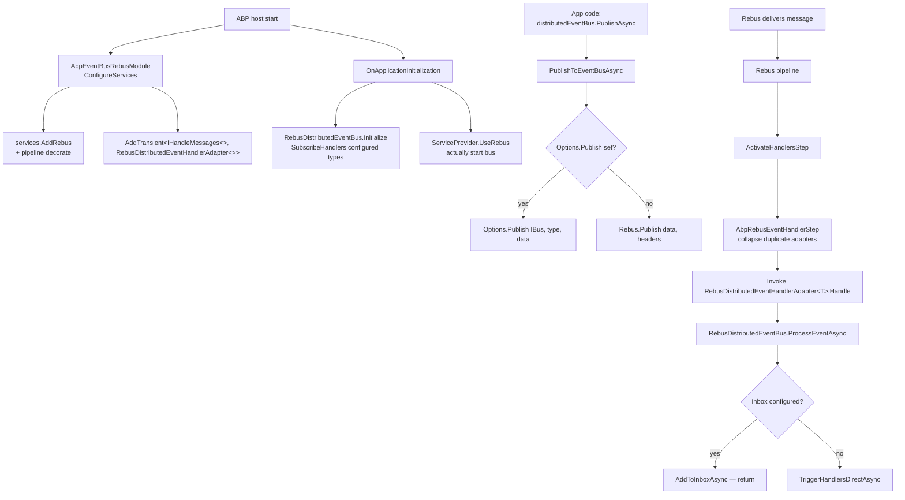

`Volo.Abp.EventBus.Rebus` plugs ABP's `IDistributedEventBus` into [Rebus](https://github.com/rebus-org/Rebus), the .NET service bus. Unlike the Kafka/Azure/RabbitMQ integrations — which target a specific broker — Rebus is itself a transport-agnostic framework, so this module is mostly **glue between ABP's distributed event bus contract and Rebus' `IBus` + `IHandleMessages<T>` pipeline**. The actual transport (RabbitMQ, Azure Service Bus, MSMQ, SQL Server, files, in-memory…) is chosen by your `AbpRebusEventBusOptions.Configurer` action.

The integration:

- Calls `services.AddRebus(configure => ...)` from `Rebus.ServiceProvider` inside `ConfigureServices`, applying any pre-configure actions plus the user `Configurer`.
- Registers a single open-generic handler — `RebusDistributedEventHandlerAdapter<>` — bound to `IHandleMessages<>`. Every published event type gets the same adapter, which forwards into `RebusDistributedEventBus.ProcessEventAsync`.
- Decorates Rebus' pipeline with an `AbpRebusEventHandlerStep` placed **after** `ActivateHandlersStep` to ensure the adapter only fires once per incoming message even if multiple ABP handlers are registered.
- On `OnApplicationInitialization` calls `RebusDistributedEventBus.Initialize()` (subscribe pre-registered handlers) and then `ServiceProvider.UseRebus()` to actually start the bus.

## File inventory

| File | Purpose |
| --- | --- |
| `AbpEventBusRebusModule.cs` | Module — registers `IHandleMessages<>` adapter, hooks Rebus pipeline, calls `UseRebus()` on init. |
| `AbpRebusEventBusOptions.cs` | `InputQueueName`, `Configurer : Action<RebusConfigurer>`, `Publish : Func<IBus, Type, object, Task>`. |
| `RebusDistributedEventBus.cs` | `[Dependency(ReplaceServices = true)]` `DistributedEventBusBase` subclass. |
| `RebusDistributedEventHandlerAdapter.cs` | `IHandleMessages<TEventData> + IRebusDistributedEventHandlerAdapter`. |
| `IRebusDistributedEventHandlerAdapter.cs` | Marker interface used by the pipeline step. |
| `AbpRebusEventHandlerStep.cs` | `IIncomingStep` — collapses duplicate handler invocations. |
| `IRebusSerializer.cs` / `Utf8JsonRabbitMqSerializer.cs` | Byte serializer used for inbox/outbox bodies. |

## Key abstractions

| Symbol | Kind | File |
| --- | --- | --- |
| `RebusDistributedEventBus : DistributedEventBusBase, ISingletonDependency` | `[Dependency(ReplaceServices = true)]`, exposes `IDistributedEventBus` | `RebusDistributedEventBus.cs` |
| `AbpRebusEventBusOptions` | options POCO — input queue name + `Configurer` | `AbpRebusEventBusOptions.cs` |
| `RebusDistributedEventHandlerAdapter<TEventData>` | generic `IHandleMessages<>` impl, forwards to `RebusDistributedEventBus.ProcessEventAsync` | `RebusDistributedEventHandlerAdapter.cs` |
| `IRebusDistributedEventHandlerAdapter` | marker used by `AbpRebusEventHandlerStep` | `IRebusDistributedEventHandlerAdapter.cs` |
| `AbpRebusEventHandlerStep : IIncomingStep` | injected after `ActivateHandlersStep` | `AbpRebusEventHandlerStep.cs` |
| `IRebusSerializer.Serialize(object) / Deserialize(byte[], Type)` | byte serializer | `IRebusSerializer.cs` |

## Module wiring — what `AbpEventBusRebusModule` actually does

```csharp
[DependsOn(typeof(AbpEventBusModule))]
public class AbpEventBusRebusModule : AbpModule
{
    public override void ConfigureServices(ServiceConfigurationContext context)
    {
        // 1. Open generic handler for any event type that flows in through Rebus
        context.Services.AddTransient(
            typeof(IHandleMessages<>),
            typeof(RebusDistributedEventHandlerAdapter<>));

        // 2. Apply any pre-configure actions to options
        var preActions = context.Services.GetPreConfigureActions<AbpRebusEventBusOptions>();
        Configure<AbpRebusEventBusOptions>(rebusOptions => preActions.Configure(rebusOptions));

        // 3. Configure Rebus itself
        context.Services.AddRebus(configure =>
        {
            configure.Options(options =>
            {
                options.Decorate<IPipeline>(d =>
                {
                    var step     = new AbpRebusEventHandlerStep();
                    var pipeline = d.Get<IPipeline>();
                    return new PipelineStepInjector(pipeline)
                        .OnReceive(step, PipelineRelativePosition.After,
                                   typeof(ActivateHandlersStep));
                });
            });

            preActions.Configure().Configurer?.Invoke(configure);
            return configure;
        });
    }

    public override void OnApplicationInitialization(ApplicationInitializationContext context)
    {
        context.ServiceProvider.GetRequiredService<RebusDistributedEventBus>().Initialize();
        context.ServiceProvider.UseRebus();
    }
}
```

Two things are subtle:

1. The pipeline decoration injects `AbpRebusEventHandlerStep` exactly once — after handler activation, before invocation — regardless of what the user `Configurer` does.
2. `UseRebus()` (from `Rebus.ServiceProvider`) is what actually starts the bus and binds it to the host's `IServiceProvider`. Without it `IBus` resolves but never receives messages.

## Options

### `AbpRebusEventBusOptions`

| Property | Type | Notes |
| --- | --- | --- |
| `InputQueueName` | `string` (`[NotNull]`) | Logical input queue name passed to the default `UseInMemoryTransport(...)` and available to user `Configurer` actions. |
| `Configurer` | `Action<RebusConfigurer>` (`[NotNull]`) | The user hook for choosing transport/subscriptions/sagas. Defaults to in-memory transport + in-memory subscriptions. |
| `Publish` | `Func<IBus, Type, object, Task>?` | Optional override for publishing. When set, `RebusDistributedEventBus.PublishAsync` delegates to it instead of `Rebus.Publish(...)`. |

Default `Configurer` is bound in the constructor:

```csharp
public AbpRebusEventBusOptions()
{
    _configurer = DefaultConfigure;
}

private void DefaultConfigure(RebusConfigurer configure)
{
    configure.Subscriptions(s => s.StoreInMemory());
    configure.Transport(t => t.UseInMemoryTransport(new InMemNetwork(), InputQueueName));
}
```

This means a brand-new ABP host will boot with **in-memory** Rebus — fine for tests, useless across processes. A production app must override:

```csharp
PreConfigure<AbpRebusEventBusOptions>(options =>
{
    options.InputQueueName = "MyApp.Web";
    options.Configurer = configure =>
    {
        configure.Transport(t => t.UseRabbitMq("amqp://localhost", options.InputQueueName));
        configure.Subscriptions(s => s.StoreInPostgres(...));
    };
});
```

## Initialize / Subscribe / Publish flow



## Walkthrough — Subscribe (broker-side)

Rebus' transport stores subscriptions per topic (event type). `RebusDistributedEventBus.Subscribe` adds to the in-process handler list and, when this is the **first** handler for that type, calls `Rebus.Subscribe(eventType)` to make the broker route copies into the input queue:

```csharp
public override IDisposable Subscribe(Type eventType, IEventHandlerFactory factory)
{
    var handlerFactories = GetOrCreateHandlerFactories(eventType);
    if (factory.IsInFactories(handlerFactories)) return NullDisposable.Instance;

    handlerFactories.Add(factory);

    if (handlerFactories.Count == 1) //TODO: Multi-threading!
    {
        Rebus.Subscribe(eventType);
    }

    return new EventHandlerFactoryUnregistrar(this, eventType, factory);
}
```

(`Unsubscribe` symmetrically calls `Rebus.Unsubscribe(eventType)` every time — even when other handlers remain — which is a known wart preserved here for completeness.)

## Walkthrough — Publish

```csharp
protected async override Task PublishToEventBusAsync(Type eventType, object eventData)
{
    var headers = new Dictionary<string, string>();
    if (CorrelationIdProvider.Get() != null)
        headers.Add(EventBusConsts.CorrelationIdHeaderName, CorrelationIdProvider.Get());

    await PublishAsync(eventType, eventData, headersArguments: headers);
}

protected virtual async Task PublishAsync(
    Type eventType, object eventData,
    Guid? eventId = null, Dictionary<string, string> headersArguments = null)
{
    if (AbpRebusEventBusOptions.Publish != null)
    {
        await AbpRebusEventBusOptions.Publish(Rebus, eventType, eventData);
        return;
    }

    headersArguments ??= new Dictionary<string, string>();
    if (!headersArguments.ContainsKey(Headers.MessageId))
        headersArguments[Headers.MessageId] =
            (eventId ?? GuidGenerator.Create()).ToString("N");

    await Rebus.Publish(eventData, headersArguments);
}
```

Note `Rebus.Publish` is used — not `Send`. Rebus' pub/sub model expects the **publisher** to publish topics; the **subscriber** to subscribe before the publisher routes copies. ABP's `Subscribe(...)` implementation above takes care of the subscription side.

### Outbox: many-from-outbox in a single Rebus transaction

```csharp
public async override Task PublishManyFromOutboxAsync(
    IEnumerable<OutgoingEventInfo> outgoingEvents, OutboxConfig outboxConfig)
{
    var outgoingEventArray = outgoingEvents.ToArray();

    using (var scope = new RebusTransactionScope())
    {
        foreach (var outgoingEvent in outgoingEventArray)
        {
            // ... TriggerDistributedEventSentAsync ...
            await PublishFromOutboxAsync(outgoingEvent, outboxConfig);
        }

        await scope.CompleteAsync();
    }
}
```

`RebusTransactionScope` is Rebus' ambient unit-of-work — every `Publish` inside it is committed atomically (per transport). This is the only EventBus integration that uses a transport-level batching transaction.

## Walkthrough — Receive

When Rebus delivers a message it walks the pipeline. `ActivateHandlersStep` resolves every `IHandleMessages<TEvent>` registered against the message type. Because ABP registered the open generic `RebusDistributedEventHandlerAdapter<>` as a handler for everything, **every** Rebus delivery hits the adapter:

```csharp
public class RebusDistributedEventHandlerAdapter<TEventData>
    : IHandleMessages<TEventData>, IRebusDistributedEventHandlerAdapter
{
    protected RebusDistributedEventBus RebusDistributedEventBus { get; }

    public async Task Handle(TEventData message)
    {
        await RebusDistributedEventBus.ProcessEventAsync(message.GetType(), message);
    }
}
```

But if the user **also** registered other Rebus `IHandleMessages<T>` for the same type, Rebus would call all of them — defeating ABP's intent that all dispatch happens through `IDistributedEventBus`. `AbpRebusEventHandlerStep` solves this by collapsing the handler list **when every handler is the ABP adapter**:

```csharp
public class AbpRebusEventHandlerStep : IIncomingStep
{
    public Task Process(IncomingStepContext context, Func<Task> next)
    {
        var message         = context.Load<Message>();
        var handlerInvokers = context.Load<HandlerInvokers>().ToList();

        if (handlerInvokers.All(x => x.Handler is IRebusDistributedEventHandlerAdapter))
        {
            handlerInvokers = new List<HandlerInvoker> { handlerInvokers.Last() };
            context.Save(new HandlerInvokers(message, handlerInvokers));
        }

        return next();
    }
}
```

That is: if Rebus would invoke N adapters (because the type hierarchy resolves N times), keep only the **last** one — so `ProcessEventAsync` runs exactly once.

### `ProcessEventAsync`

```csharp
public async Task ProcessEventAsync(Type eventType, object eventData)
{
    var messageId     = MessageContext.Current.TransportMessage.GetMessageId();
    var eventName     = EventNameAttribute.GetNameOrDefault(eventType);
    var correlationId = MessageContext.Current.Headers
                          .GetOrDefault(EventBusConsts.CorrelationIdHeaderName);

    if (await AddToInboxAsync(messageId, eventName, eventType, eventData, correlationId))
        return;

    using (CorrelationIdProvider.Change(correlationId))
        await TriggerHandlersDirectAsync(eventType, eventData);
}
```

`MessageContext.Current` is Rebus' ambient — set automatically inside the pipeline.

## Configuration sample (RabbitMQ transport)

```csharp
public override void PreConfigureServices(ServiceConfigurationContext context)
{
    PreConfigure<AbpRebusEventBusOptions>(options =>
    {
        options.InputQueueName = "MyApp.Web";
        options.Configurer = configure =>
        {
            configure.Transport(t =>
                t.UseRabbitMq("amqp://localhost", options.InputQueueName));
        };
    });
}
```

## Gotchas

<Note>
**Defaults are in-memory.** Out of the box `AbpRebusEventBusOptions` uses `InMemNetwork()` + `StoreInMemory()`. The default works for tests but every host gets its own `InMemNetwork` instance — nothing crosses processes. Always override `Configurer` in production.
</Note>

<Note>
**`Unsubscribe` always calls `Rebus.Unsubscribe`.** The `Unsubscribe(Type eventType, IEventHandlerFactory)` overload removes the factory locally and then calls `Rebus.Unsubscribe(eventType)` **unconditionally** — even when other handlers remain. Removing one of two handlers also unsubscribes the topic at the broker.
</Note>

<Note>
**Pipeline step requires marker interface.** `AbpRebusEventHandlerStep` only collapses invokers when **all** are `IRebusDistributedEventHandlerAdapter`. Mixing user-written `IHandleMessages<T>` with ABP handlers keeps both invocations active.
</Note>

<Tip>
To support a custom publish path (e.g., manually adding `Topic` headers for a specific transport), set `AbpRebusEventBusOptions.Publish` — `RebusDistributedEventBus.PublishAsync` short-circuits to your delegate before adding `Headers.MessageId`.
</Tip>

<Note>
`Initialize()` only calls `SubscribeHandlers(AbpDistributedEventBusOptions.Handlers)`. The actual Rebus bus is started by `ServiceProvider.UseRebus()` — keep that call in `OnApplicationInitialization` even if you move `Initialize()` elsewhere.
</Note>

## Related pages

<CardGroup cols={2}>
  <Card title="Distributed EventBus core" icon="bolt" href="/framework/eventbus/distributed-eventbus">
    `DistributedEventBusBase`, the abstract that wires UoW, inbox, outbox.
  </Card>
  <Card title="Inbox / Outbox" icon="box-archive" href="/framework/eventbus/inbox-outbox">
    `PublishManyFromOutboxAsync` + `RebusTransactionScope` integration.
  </Card>
  <Card title="RabbitMQ EventBus" icon="rabbit" href="/framework/eventbus/rabbitmq">
    A direct broker integration, not via Rebus.
  </Card>
  <Card title="EventBus abstractions" icon="diagram-project" href="/framework/eventbus/abstractions">
    `IDistributedEventBus`, `EventNameAttribute`, handler factories.
  </Card>
</CardGroup>
