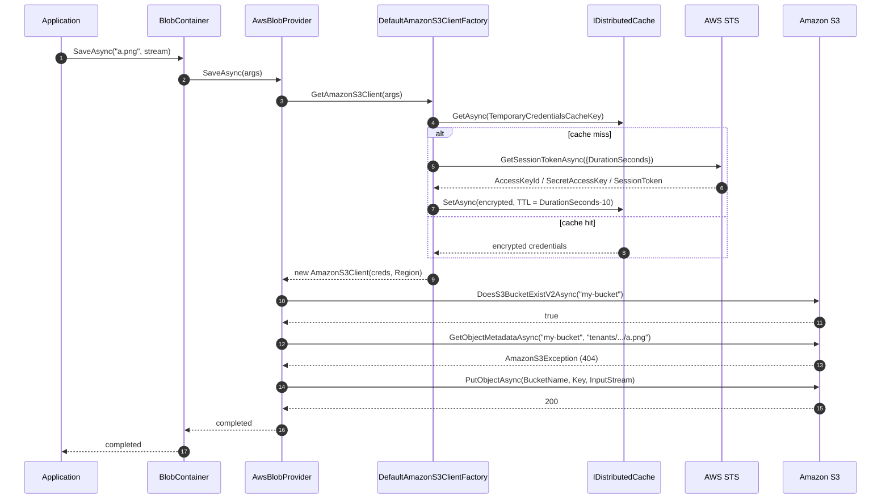

`Volo.Abp.BlobStoring.Aws` adapts the official `AWSSDK.S3` to ABP's `IBlobContainer` pipeline. It supports four credential modes — static keys, AWS profile chain, STS temporary session credentials, and STS federated credentials — caches STS-issued credentials encrypted in `IDistributedCache`, and applies S3's bucket naming rules to container names.

It is the heaviest of the cloud providers in this set: the credential-factory state machine has more code than the provider itself. That complexity exists because many ABP-on-AWS deployments mint short-lived credentials from STS rather than ship long-lived access keys.

## File inventory

| File | Purpose |
| --- | --- |
| `Volo/Abp/BlobStoring/Aws/AbpBlobStoringAwsModule.cs` | `[DependsOn(typeof(AbpBlobStoringModule), typeof(AbpCachingModule))]`. Empty body. |
| `Volo/Abp/BlobStoring/Aws/AwsBlobProvider.cs` | `IBlobProvider` over `AmazonS3Client`. |
| `Volo/Abp/BlobStoring/Aws/AwsBlobProviderConfiguration.cs` | Typed config (15 properties). |
| `Volo/Abp/BlobStoring/Aws/AwsBlobProviderConfigurationNames.cs` | The 15 string keys. |
| `Volo/Abp/BlobStoring/Aws/AwsBlobContainerConfigurationExtensions.cs` | `UseAws(...)`. |
| `Volo/Abp/BlobStoring/Aws/AwsBlobNamingNormalizer.cs` | S3 bucket naming rules including the IPv4 reject. |
| `Volo/Abp/BlobStoring/Aws/IAmazonS3ClientFactory.cs` / `DefaultAmazonS3ClientFactory.cs` | Builds `AmazonS3Client` per the credential mode flags. |
| `Volo/Abp/BlobStoring/Aws/AwsTemporaryCredentialsCacheItem.cs` | The encrypted STS-credential cache row. |
| `Volo/Abp/BlobStoring/Aws/IAwsBlobNameCalculator.cs` / `DefaultAwsBlobNameCalculator.cs` | `host/` vs `tenants/{id}/` prefix. |

## Module wiring

```csharp title="AbpBlobStoringAwsModule.cs"
[DependsOn(typeof(AbpBlobStoringModule), typeof(AbpCachingModule))]
public class AbpBlobStoringAwsModule : AbpModule
{
    public override void ConfigureServices(ServiceConfigurationContext context) { }
}
```

Two dependencies matter:

- `AbpBlobStoringModule` — pulls in the `IBlobContainer` machinery.
- `AbpCachingModule` — supplies the `IDistributedCache<AwsTemporaryCredentialsCacheItem>` used by the temporary-credentials path.

## Registration

```csharp title="AwsBlobContainerConfigurationExtensions.cs"
public static BlobContainerConfiguration UseAws(
    this BlobContainerConfiguration containerConfiguration,
    Action<AwsBlobProviderConfiguration> awsConfigureAction)
{
    containerConfiguration.ProviderType = typeof(AwsBlobProvider);
    containerConfiguration.NamingNormalizers.TryAdd<AwsBlobNamingNormalizer>();
    awsConfigureAction(new AwsBlobProviderConfiguration(containerConfiguration));
    return containerConfiguration;
}
```

Same shape as every other provider's `UseXxx`: set the `ProviderType`, register the naming normalizer, hand the typed wrapper to the caller's delegate.

## Options

```csharp title="AwsBlobProviderConfiguration.cs (excerpt)"
public class AwsBlobProviderConfiguration
{
    public string? AccessKeyId { get; set; }
    public string? SecretAccessKey { get; set; }
    public bool UseCredentials { get; set; }                  // resolve via AWS profile chain
    public bool UseTemporaryCredentials { get; set; }         // STS GetSessionToken
    public bool UseTemporaryFederatedCredentials { get; set; }// STS GetFederationToken
    public string? ProfileName { get; set; }
    public string? ProfilesLocation { get; set; }
    public int DurationSeconds { get; set; }                  // STS validity, 900..129600
    public string Name { get; set; }                          // GetFederationToken name
    public string? Policy { get; set; }                       // GetFederationToken inline policy
    public string Region { get; set; }                        // required
    public string? ContainerName { get; set; }                // bucket override
    public bool CreateContainerIfNotExists { get; set; }
    public string? TemporaryCredentialsCacheKey { get; set; } // default: a per-config GUID
}
```

The key/value pairs live in the shared `BlobContainerConfiguration._properties` bag under the prefixes `Aws.AccessKeyId`, `Aws.SecretAccessKey`, etc. (see `AwsBlobProviderConfigurationNames`).

`Region` and `ContainerName` are the two most common pitfalls:

```csharp title="AwsBlobProviderConfiguration.cs"
public string Region
{
    get => _containerConfiguration.GetConfiguration<string>(AwsBlobProviderConfigurationNames.Region);
    set => _containerConfiguration.SetConfiguration(
        AwsBlobProviderConfigurationNames.Region,
        Check.NotNull(value, nameof(value)));
}
```

`Region` uses `GetConfiguration<T>` (required) and `Check.NotNull` (forbids null but allows empty). It throws when first read if you forgot to set it.

The `TemporaryCredentialsCacheKey` defaults to a per-instance GUID generated in the constructor — meaning each `AwsBlobProviderConfiguration` instance has its own cache key, and any cached credentials get a fresh row on app restart. Set it explicitly if you need long-running STS sessions to survive a process restart.

## `AwsBlobNamingNormalizer`

S3 bucket rules are stricter than Azure container rules. The normalizer mirrors them:

```csharp title="AwsBlobNamingNormalizer.cs"
public virtual string NormalizeContainerName(string containerName)
{
    using (CultureHelper.Use(CultureInfo.InvariantCulture))
    {
        containerName = containerName.ToLower();
        if (containerName.Length > 63) containerName = containerName.Substring(0, 63);

        // Bucket names can consist only of lowercase letters, numbers, dots (.), and hyphens (-).
        containerName = Regex.Replace(containerName, "[^a-z0-9-.]", string.Empty);

        // Bucket names can't have consecutive dots / dash-adjacent-dot.
        containerName = Regex.Replace(containerName, "\\.{2,}", ".");
        containerName = Regex.Replace(containerName, "-\\.", string.Empty);
        containerName = Regex.Replace(containerName, "\\.-", string.Empty);
        containerName = Regex.Replace(containerName, "^-", string.Empty);
        containerName = Regex.Replace(containerName, "-$", string.Empty);
        containerName = Regex.Replace(containerName, "^\\.", string.Empty);
        containerName = Regex.Replace(containerName, "\\.$", string.Empty);

        // Bucket names must not be formatted as an IP address (192.168.5.4).
        containerName = Regex.Replace(containerName, "^(?:(?:^|\\.)(?:2(?:5[0-5]|[0-4]\\d)|1?\\d?\\d)){4}$", string.Empty);

        if (containerName.Length < 3)
        {
            var length = containerName.Length;
            for (var i = 0; i < 3 - length; i++) containerName += "0";
        }
        return containerName;
    }
}

public virtual string NormalizeBlobName(string blobName) => blobName;
```

Compared to [Azure's normalizer](/framework/imaging-blob/blob-storing-azure#azureblobnamingnormalizer), the AWS one:

- Allows dots (`.`) as well as hyphens.
- Rejects strings that look like dotted-quad IPs.
- Does not collapse double-dashes.

`NormalizeBlobName` is again a no-op — S3 object keys allow any UTF-8 bytes up to 1024 characters.

## Name calculation

```csharp title="DefaultAwsBlobNameCalculator.cs"
public virtual string Calculate(BlobProviderArgs args)
{
    return CurrentTenant.Id == null
        ? $"host/{args.BlobName}"
        : $"tenants/{CurrentTenant.Id.Value.ToString("D")}/{args.BlobName}";
}
```

Identical to Azure's calculator — the multi-tenant prefix is layered on the object key, not the bucket.

## Credential factory: four modes, one path

```csharp title="DefaultAmazonS3ClientFactory.cs"
public virtual async Task<AmazonS3Client> GetAmazonS3Client(AwsBlobProviderConfiguration configuration)
{
    var region = RegionEndpoint.GetBySystemName(configuration.Region);

    if (configuration.UseCredentials)
    {
        var awsCredentials = GetAwsCredentials(configuration);
        return awsCredentials == null
            ? new AmazonS3Client(region)
            : new AmazonS3Client(awsCredentials, region);
    }

    if (configuration.UseTemporaryCredentials)
        return new AmazonS3Client(await GetTemporaryCredentialsAsync(configuration), region);

    if (configuration.UseTemporaryFederatedCredentials)
        return new AmazonS3Client(await GetTemporaryFederatedCredentialsAsync(configuration), region);

    Check.NotNullOrWhiteSpace(configuration.AccessKeyId, nameof(configuration.AccessKeyId));
    Check.NotNullOrWhiteSpace(configuration.SecretAccessKey, nameof(configuration.SecretAccessKey));

    return new AmazonS3Client(configuration.AccessKeyId, configuration.SecretAccessKey, region);
}
```

| Mode | Triggered by | Path |
| --- | --- | --- |
| **AWS profile chain** | `UseCredentials = true` | Reads `ProfileName` from `ProfilesLocation` via `CredentialProfileStoreChain`. If no `ProfileName` is set, falls through to the SDK's default credential resolution (`AmazonS3Client(region)`). |
| **STS session credentials** | `UseTemporaryCredentials = true` | Calls `AmazonSecurityTokenServiceClient.GetSessionTokenAsync` with `DurationSeconds`. Result cached under `TemporaryCredentialsCacheKey`. |
| **STS federation token** | `UseTemporaryFederatedCredentials = true` | Calls `GetFederationTokenAsync` with `Name`, `Policy`, and `DurationSeconds`. Result cached. |
| **Static access key** | none of the above + `AccessKeyId` / `SecretAccessKey` set | Direct `AmazonS3Client(key, secret, region)`. |

The flags are tested in order, so if you set `UseCredentials` *and* `UseTemporaryCredentials`, the profile-chain wins.

### STS caching with encryption-at-rest

```csharp title="DefaultAmazonS3ClientFactory.cs (excerpt)"
protected virtual async Task<SessionAWSCredentials> GetTemporaryCredentialsAsync(
    AwsBlobProviderConfiguration configuration)
{
    var temporaryCredentialsCache = await Cache.GetAsync(configuration.TemporaryCredentialsCacheKey!);

    if (temporaryCredentialsCache == null)
    {
        // ... build stsClient from static keys or profile chain
        var sessionTokenResponse = await stsClient.GetSessionTokenAsync(
            new GetSessionTokenRequest { DurationSeconds = configuration.DurationSeconds });

        var credentials = sessionTokenResponse.Credentials;
        temporaryCredentialsCache = await SetTemporaryCredentialsCache(configuration, credentials);
    }

    return new SessionAWSCredentials(
        StringEncryptionService.Decrypt(temporaryCredentialsCache.AccessKeyId),
        StringEncryptionService.Decrypt(temporaryCredentialsCache.SecretAccessKey),
        StringEncryptionService.Decrypt(temporaryCredentialsCache.SessionToken));
}

private async Task<AwsTemporaryCredentialsCacheItem> SetTemporaryCredentialsCache(
    AwsBlobProviderConfiguration configuration, Credentials credentials)
{
    var temporaryCredentialsCache = new AwsTemporaryCredentialsCacheItem(
        StringEncryptionService.Encrypt(credentials.AccessKeyId)!,
        StringEncryptionService.Encrypt(credentials.SecretAccessKey)!,
        StringEncryptionService.Encrypt(credentials.SessionToken)!);

    await Cache.SetAsync(configuration.TemporaryCredentialsCacheKey!, temporaryCredentialsCache,
        new DistributedCacheEntryOptions
        {
            AbsoluteExpirationRelativeToNow = TimeSpan.FromSeconds(configuration.DurationSeconds - 10)
        });

    return temporaryCredentialsCache;
}
```

Two important details:

- **The cached values are encrypted with `IStringEncryptionService`**, ABP's symmetric AES wrapper. The cache key is encrypted-at-rest; the framework decrypts on read. If you rotate `AppSecrets:DefaultPassPhrase`, in-flight cache entries become unreadable and a fresh STS call is triggered.
- **Cache TTL = `DurationSeconds - 10`.** Ten seconds shorter than the credential lifetime so the cached item expires before the credentials become invalid. Set `DurationSeconds = 900` for STS minimums; 3600 is the safe default for `GetFederationToken`.

`GetTemporaryFederatedCredentialsAsync` is structurally identical but additionally `Check.NotNullOrWhiteSpace`-validates `Name` and `Policy`. The `Policy` is an inline JSON IAM policy further restricting the resulting credentials — useful when you mint per-tenant credentials with a `Resource` clause scoped to one bucket prefix.

## The provider

```csharp title="AwsBlobProvider.cs"
public override async Task SaveAsync(BlobProviderSaveArgs args)
{
    var blobName = AwsBlobNameCalculator.Calculate(args);
    var configuration = args.Configuration.GetAwsConfiguration();
    var containerName = GetContainerName(args);

    using (var amazonS3Client = await GetAmazonS3Client(args))
    {
        if (!args.OverrideExisting && await BlobExistsAsync(amazonS3Client, containerName, blobName))
        {
            throw new BlobAlreadyExistsException(
                $"Saving BLOB '{args.BlobName}' does already exists in the container '{containerName}'! " +
                $"Set {nameof(args.OverrideExisting)} if it should be overwritten.");
        }

        if (configuration.CreateContainerIfNotExists)
        {
            await CreateContainerIfNotExists(amazonS3Client, containerName);
        }

        await amazonS3Client.PutObjectAsync(new PutObjectRequest
        {
            BucketName = containerName,
            Key = blobName,
            InputStream = args.BlobStream
        });
    }
}
```

```csharp title="AwsBlobProvider.cs"
public override async Task<Stream?> GetOrNullAsync(BlobProviderGetArgs args)
{
    var blobName = AwsBlobNameCalculator.Calculate(args);
    var containerName = GetContainerName(args);

    using (var amazonS3Client = await GetAmazonS3Client(args))
    {
        if (!await BlobExistsAsync(amazonS3Client, containerName, blobName)) return null;

        var response = await amazonS3Client.GetObjectAsync(new GetObjectRequest
        {
            BucketName = containerName,
            Key = blobName
        });

        return await TryCopyToMemoryStreamAsync(response.ResponseStream, args.CancellationToken);
    }
}
```

Things to flag:

- **The `AmazonS3Client` is created and disposed per call.** With the static-key path that's cheap; with the STS paths it triggers a `GetSessionToken` round-trip only on cache miss. Either way the SDK pools the underlying `HttpClient` internally.
- **`BlobExistsAsync` does a `DoesS3BucketExistV2Async` followed by `GetObjectMetadataAsync`.** That's two requests per existence check; on a high-traffic path you may want to subclass and assume the bucket exists.
- **`AmazonS3Exception` is the "not found" signal**. The `BlobExistsAsync` catches `AmazonS3Exception` and returns `false`. Any other exception type re-throws, which is the right behaviour for transient network failures.

```csharp title="AwsBlobProvider.cs (BlobExistsAsync)"
protected virtual async Task<bool> BlobExistsAsync(AmazonS3Client amazonS3Client, string containerName, string blobName)
{
    if (!await AmazonS3Util.DoesS3BucketExistV2Async(amazonS3Client, containerName))
        return false;

    try
    {
        await amazonS3Client.GetObjectMetadataAsync(containerName, blobName);
    }
    catch (Exception ex)
    {
        if (ex is AmazonS3Exception) return false;
        throw;
    }
    return true;
}
```

## Multi-tenant and container-name strategy

The container-name fallback matches Azure exactly:

```csharp title="AwsBlobProvider.cs"
protected virtual string GetContainerName(BlobProviderArgs args)
{
    var configuration = args.Configuration.GetAwsConfiguration();
    return configuration.ContainerName.IsNullOrWhiteSpace()
        ? args.ContainerName
        : BlobNormalizeNamingService.NormalizeContainerName(args.Configuration, configuration.ContainerName!);
}
```

- `ContainerName` unset → per-ABP container, separate S3 bucket per `BlobContainer<TContainer>`. Each bucket name comes from the marker class's name after normalization.
- `ContainerName` set → all blobs land in one shared S3 bucket, keyed by the `host/...` / `tenants/{id}/...` prefix the calculator produces.

For multi-tenant workloads, the recommended pattern is one shared bucket with `ContainerName` set explicitly and `IsMultiTenant = true` on the container — that way every tenant's blobs share a bucket lifecycle policy, encryption configuration, and bucket-level metric.

## Sequence: save with temporary credentials



## Full example

```csharp title="MyModule.cs (static keys)"
[DependsOn(typeof(AbpBlobStoringAwsModule))]
public class MyModule : AbpModule
{
    public override void ConfigureServices(ServiceConfigurationContext context)
    {
        var cfg = context.Services.GetConfiguration();

        Configure<AbpBlobStoringOptions>(options =>
        {
            options.Containers.ConfigureDefault(container =>
            {
                container.UseAws(aws =>
                {
                    aws.AccessKeyId = cfg["Aws:AccessKeyId"]!;
                    aws.SecretAccessKey = cfg["Aws:SecretAccessKey"]!;
                    aws.Region = cfg["Aws:Region"]!;
                    aws.ContainerName = cfg["Aws:Bucket"]!;
                    aws.CreateContainerIfNotExists = false;
                });
            });
        });
    }
}
```

```csharp title="MyModule.cs (STS session credentials)"
options.Containers.ConfigureDefault(container =>
{
    container.UseAws(aws =>
    {
        aws.UseTemporaryCredentials = true;
        aws.UseCredentials = true;     // resolve base credentials from the AWS profile chain
        aws.ProfileName = "default";
        aws.DurationSeconds = 3600;
        aws.Region = "us-east-1";
        aws.ContainerName = "myapp-shared";
    });
});
```

```csharp title="MyModule.cs (STS federation token)"
options.Containers.Configure<TenantUploadsContainer>(container =>
{
    container.UseAws(aws =>
    {
        aws.AccessKeyId = cfg["Aws:Federation:KeyId"]!;
        aws.SecretAccessKey = cfg["Aws:Federation:KeySecret"]!;
        aws.UseTemporaryFederatedCredentials = true;
        aws.Name = "tenant-uploads-session";
        aws.Policy = """
            {
              "Version": "2012-10-17",
              "Statement": [{
                "Effect": "Allow",
                "Action": ["s3:PutObject","s3:GetObject"],
                "Resource": "arn:aws:s3:::myapp-shared/tenants/*"
              }]
            }
            """;
        aws.DurationSeconds = 3600;
        aws.Region = "us-east-1";
        aws.ContainerName = "myapp-shared";
    });
});
```

## Gotchas

- **`Region` is required.** It's read by `GetConfiguration<T>` and throws on first save if you forgot it. There is no fallback to environment variables.
- **`TemporaryCredentialsCacheKey` defaults to a per-instance GUID.** Cached credentials do not survive a process restart. For long-lived STS sessions (e.g. shared between a web tier and a worker tier), set the cache key explicitly.
- **`IStringEncryptionService` must be configured.** If you haven't set `Settings:Abp.Security.Encryption.DefaultPassPhrase` (or whatever your encryption module reads), the STS-credential cache will fail to decrypt on a subsequent read, triggering an unnecessary STS round-trip. Worse, if you rotate the pass phrase, in-flight cache rows can't be decoded — make sure cache entries expire before rotation.
- **`UseCredentials` falls through to SDK defaults when `ProfileName` is null**, but it does *not* fall back through to `UseTemporaryCredentials`. The flags are checked in order — set only one to avoid surprises.
- **No multipart upload for large files.** `PutObjectAsync` streams the whole input in one request. For very large objects (>100 MB), bypass the abstraction and use `TransferUtility` from the SDK directly.
- **`AmazonS3Util.DoesS3BucketExistV2Async` is the canonical bucket existence check** and is cheap — it does a `HEAD /` and ignores `403` (meaning "exists but you can't list"). Even so, two HTTP requests per `BlobExistsAsync` add up.
- **`CreateContainerIfNotExists` calls `PutBucketAsync` with default ACLs.** It does not configure encryption, lifecycle policies, or versioning. Use Terraform / CloudFormation for production bucket provisioning and leave the flag off.
- **`AwsBlobNamingNormalizer` rejects IPv4-looking strings.** Container names like `192.168.0.1` get stripped to empty and right-padded to `000`. Names like `10.1.2.3` survive though, because the regex only matches *full* dotted-quads, not prefixes.
- **No native cancellation token forwarding to `PutObjectAsync`.** The provider passes `args.CancellationToken` to `TryCopyToMemoryStreamAsync` on the download path but not to the AWS SDK's `PutObjectAsync` on upload. For cancellable uploads, wrap the call yourself.

## See also

- [Volo.Abp.BlobStoring](/framework/imaging-blob/blob-storing) — the consumer pipeline.
- [Volo.Abp.BlobStoring.Minio](/framework/imaging-blob/blob-storing-minio) — uses the same S3 API surface with simpler auth.
- [Volo.Abp.BlobStoring.Azure](/framework/imaging-blob/blob-storing-azure) — Azure equivalent.
