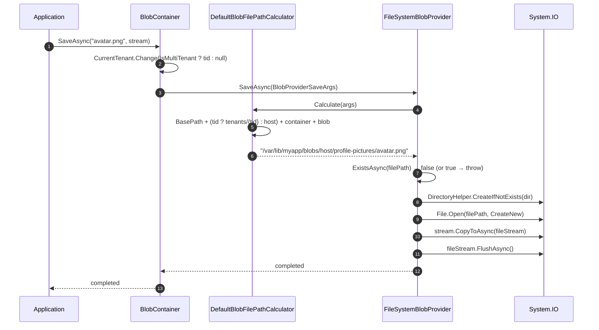

`Volo.Abp.BlobStoring.FileSystem` is the simplest of ABP's `IBlobProvider` implementations: BLOBs go on disk. Each `(tenant, container, blob)` triple maps to a path computed by `DefaultBlobFilePathCalculator`, files are written with `File.Open` wrapped in a Polly retry against transient `IOException`, and naming is left alone on Linux but stripped of `: * ? " < > |` on Windows.

Use this provider for local development, single-node deployments, and CI test fixtures. For multi-instance hosts you need a shared file system (NFS, SMB, EFS) — the provider does no locking beyond `FileMode.CreateNew`'s atomic-create semantics.

## File inventory

| File | Purpose |
| --- | --- |
| `Volo/Abp/BlobStoring/FileSystem/AbpBlobStoringFileSystemModule.cs` | `[DependsOn(typeof(AbpBlobStoringModule))]`. Empty body. |
| `Volo/Abp/BlobStoring/FileSystem/FileSystemBlobProvider.cs` | The `IBlobProvider`. `SaveAsync`/`DeleteAsync`/`GetOrNullAsync`/`ExistsAsync` using `System.IO`. |
| `Volo/Abp/BlobStoring/FileSystem/FileSystemBlobProviderConfiguration.cs` | Typed wrapper around `BlobContainerConfiguration`: `BasePath`, `AppendContainerNameToBasePath`. |
| `Volo/Abp/BlobStoring/FileSystem/FileSystemBlobProviderConfigurationNames.cs` | The two string keys above use in the `_properties` bag. |
| `Volo/Abp/BlobStoring/FileSystem/FileSystemBlobContainerConfigurationExtensions.cs` | `UseFileSystem(...)` extension and `GetFileSystemConfiguration()` helper. |
| `Volo/Abp/BlobStoring/FileSystem/FileSystemBlobNamingNormalizer.cs` | Strips Windows-reserved characters; no-op on Linux/macOS. |
| `Volo/Abp/BlobStoring/FileSystem/IBlobFilePathCalculator.cs` / `DefaultBlobFilePathCalculator.cs` | Composes the on-disk path including tenant prefix. |

## Module wiring

```csharp title="AbpBlobStoringFileSystemModule.cs"
[DependsOn(typeof(AbpBlobStoringModule))]
public class AbpBlobStoringFileSystemModule : AbpModule
{
}
```

That's it. `FileSystemBlobProvider` and `DefaultBlobFilePathCalculator` are `ITransientDependency` and registered by convention. The provider is **not** assigned to any container automatically — you must call `UseFileSystem` on at least one container, or [the selector](/framework/imaging-blob/blob-storing#provider-selection) will refuse to resolve.

## Registration extension

```csharp title="FileSystemBlobContainerConfigurationExtensions.cs"
public static BlobContainerConfiguration UseFileSystem(
    this BlobContainerConfiguration containerConfiguration,
    Action<FileSystemBlobProviderConfiguration> fileSystemConfigureAction)
{
    containerConfiguration.ProviderType = typeof(FileSystemBlobProvider);
    containerConfiguration.NamingNormalizers.TryAdd<FileSystemBlobNamingNormalizer>();

    fileSystemConfigureAction(new FileSystemBlobProviderConfiguration(containerConfiguration));

    return containerConfiguration;
}
```

The method does four things:

1. Sets `ProviderType = typeof(FileSystemBlobProvider)`. The [provider selector](/framework/imaging-blob/blob-storing#provider-selection) uses this to match.
2. Adds `FileSystemBlobNamingNormalizer` to the container's `NamingNormalizers` list (via `TryAdd`, so duplicates are skipped).
3. Constructs the typed wrapper and hands it to your delegate.
4. Returns the container configuration for chaining.

The companion `GetFileSystemConfiguration()` is what the provider calls internally to read its config back out of the bag:

```csharp title="FileSystemBlobContainerConfigurationExtensions.cs"
public static FileSystemBlobProviderConfiguration GetFileSystemConfiguration(
    this BlobContainerConfiguration containerConfiguration)
{
    return new FileSystemBlobProviderConfiguration(containerConfiguration);
}
```

The wrapper is cheap to construct (it just holds a reference), so it's allocated per call rather than cached.

## Options

```csharp title="FileSystemBlobProviderConfiguration.cs"
public class FileSystemBlobProviderConfiguration
{
    public string BasePath {
        get => _containerConfiguration.GetConfiguration<string>(FileSystemBlobProviderConfigurationNames.BasePath);
        set => _containerConfiguration.SetConfiguration(
            FileSystemBlobProviderConfigurationNames.BasePath,
            Check.NotNullOrWhiteSpace(value, nameof(value)));
    }

    public bool AppendContainerNameToBasePath {
        get => _containerConfiguration.GetConfigurationOrDefault(
            FileSystemBlobProviderConfigurationNames.AppendContainerNameToBasePath, true);
        set => _containerConfiguration.SetConfiguration(
            FileSystemBlobProviderConfigurationNames.AppendContainerNameToBasePath, value);
    }

    private readonly BlobContainerConfiguration _containerConfiguration;

    public FileSystemBlobProviderConfiguration(BlobContainerConfiguration containerConfiguration)
    {
        _containerConfiguration = containerConfiguration;
    }
}
```

| Property | Key | Required? | Default | Notes |
| --- | --- | --- | --- | --- |
| `BasePath` | `FileSystem.BasePath` | **Yes** | (none — getter throws) | Root directory for this container's blobs. Must not be null/whitespace; getter calls `GetConfiguration<T>` which throws `AbpException` if missing. |
| `AppendContainerNameToBasePath` | `FileSystem.AppendContainerNameToBasePath` | No | `true` | If `false`, blobs for the container are written *directly* into `BasePath/host` (or `BasePath/tenants/{id}/`). Useful when each container has its own `BasePath`. |

```csharp title="FileSystemBlobProviderConfigurationNames.cs"
public static class FileSystemBlobProviderConfigurationNames
{
    public const string BasePath = "FileSystem.BasePath";
    public const string AppendContainerNameToBasePath = "FileSystem.AppendContainerNameToBasePath";
}
```

Both keys live in the shared `BlobContainerConfiguration._properties` bag, alongside every other provider's keys, but namespaced by the `"FileSystem."` prefix so they can't collide with `"Azure.BasePath"` (hypothetical) or similar.

## Path layout — host vs tenants

```csharp title="DefaultBlobFilePathCalculator.cs"
public virtual string Calculate(BlobProviderArgs args)
{
    var fileSystemConfiguration = args.Configuration.GetFileSystemConfiguration();
    var blobPath = fileSystemConfiguration.BasePath;

    if (CurrentTenant.Id == null)
    {
        blobPath = Path.Combine(blobPath, "host");
    }
    else
    {
        blobPath = Path.Combine(blobPath, "tenants", CurrentTenant.Id.Value.ToString("D"));
    }

    if (fileSystemConfiguration.AppendContainerNameToBasePath)
    {
        blobPath = Path.Combine(blobPath, args.ContainerName);
    }

    blobPath = Path.Combine(blobPath, args.BlobName);

    return blobPath;
}
```

Two example layouts for `BasePath = /var/lib/myapp/blobs`, container name `profile-pictures`, blob name `avatar.png`:

| Tenant | `AppendContainerNameToBasePath` | Resulting path |
| --- | --- | --- |
| host (`CurrentTenant.Id == null`) | `true` (default) | `/var/lib/myapp/blobs/host/profile-pictures/avatar.png` |
| host | `false` | `/var/lib/myapp/blobs/host/avatar.png` |
| `9c5a-…-…` | `true` | `/var/lib/myapp/blobs/tenants/9c5a-…-…/profile-pictures/avatar.png` |
| `9c5a-…-…` | `false` | `/var/lib/myapp/blobs/tenants/9c5a-…-…/avatar.png` |

Notice the calculator reads `CurrentTenant.Id` *unconditionally*, ignoring `BlobContainerConfiguration.IsMultiTenant`. That works because [`BlobContainer.SaveAsync`](/framework/imaging-blob/blob-storing#the-non-generic-blobcontainer-is-where-the-real-work-happens) already wraps the provider call in `CurrentTenant.Change(null)` when the container is single-tenant — so by the time the calculator runs, the tenant id is already cleared for shared containers.

The tenant id is formatted with `"D"` (`xxxxxxxx-xxxx-xxxx-xxxx-xxxxxxxxxxxx`), not `"N"`. So directories contain dashes.

## The provider

```csharp title="FileSystemBlobProvider.cs"
public class FileSystemBlobProvider : BlobProviderBase, ITransientDependency
{
    protected IBlobFilePathCalculator FilePathCalculator { get; }

    public override async Task SaveAsync(BlobProviderSaveArgs args)
    {
        var filePath = FilePathCalculator.Calculate(args);

        if (!args.OverrideExisting && await ExistsAsync(filePath))
        {
            throw new BlobAlreadyExistsException(
                $"Saving BLOB '{args.BlobName}' does already exists in the container '{args.ContainerName}'! " +
                $"Set {nameof(args.OverrideExisting)} if it should be overwritten.");
        }

        DirectoryHelper.CreateIfNotExists(Path.GetDirectoryName(filePath)!);

        var fileMode = args.OverrideExisting ? FileMode.Create : FileMode.CreateNew;

        await Policy.Handle<IOException>()
            .WaitAndRetryAsync(2, retryCount => TimeSpan.FromSeconds(retryCount))
            .ExecuteAsync(async () =>
            {
                using (var fileStream = File.Open(filePath, fileMode, FileAccess.Write))
                {
                    await args.BlobStream.CopyToAsync(fileStream, args.CancellationToken);
                    await fileStream.FlushAsync();
                }
            });
    }
}
```

Four things to notice:

- **Directory auto-create.** `DirectoryHelper.CreateIfNotExists` walks the path and `mkdir`s any missing component. You never need to pre-provision the `tenants/<id>/` directories.
- **`FileMode.CreateNew` for non-override saves.** This is atomic across processes on POSIX and on NTFS, so two simultaneous `SaveAsync` calls with `overrideExisting = false` on the same blob will result in one success and one `IOException` → `BlobAlreadyExistsException` (the existence check is best-effort; the `FileMode.CreateNew` is the actual guarantee).
- **Polly retry: 2 attempts with linear back-off.** On the first `IOException` the call waits 1 s, then 2 s. Designed for antivirus / file-indexer locks on Windows. There's no retry budget — three failures in a row throw.
- **`FlushAsync` before disposing.** Ensures the OS write cache is flushed even if the process crashes immediately after returning.

`GetOrNullAsync`, `DeleteAsync`, and `ExistsAsync` follow the same template:

```csharp title="FileSystemBlobProvider.cs"
public override async Task<Stream?> GetOrNullAsync(BlobProviderGetArgs args)
{
    var filePath = FilePathCalculator.Calculate(args);
    if (!File.Exists(filePath)) return null;

    return await Policy.Handle<IOException>()
        .WaitAndRetryAsync(2, retryCount => TimeSpan.FromSeconds(retryCount))
        .ExecuteAsync(async () =>
        {
            using (var fileStream = File.OpenRead(filePath))
            {
                return await TryCopyToMemoryStreamAsync(fileStream, args.CancellationToken);
            }
        });
}
```

`GetOrNullAsync` reads the entire file into a `MemoryStream` before returning, so the caller can safely use the stream after the file handle is closed. This is the trade-off for atomicity: a 4 GB blob will fully buffer in process memory.

```csharp title="FileSystemBlobProvider.cs"
public override Task<bool> DeleteAsync(BlobProviderDeleteArgs args)
{
    var filePath = FilePathCalculator.Calculate(args);
    return Task.FromResult(FileHelper.DeleteIfExists(filePath));
}

public override Task<bool> ExistsAsync(BlobProviderExistsArgs args)
{
    var filePath = FilePathCalculator.Calculate(args);
    return ExistsAsync(filePath);
}

protected virtual Task<bool> ExistsAsync(string filePath)
{
    return Task.FromResult(File.Exists(filePath));
}
```

Both `DeleteAsync` and `ExistsAsync` are synchronous wrapped in `Task.FromResult`. They do not retry on transient `IOException` — if you need that, override the provider.

## Naming normalizer (Windows only)

```csharp title="FileSystemBlobNamingNormalizer.cs"
public class FileSystemBlobNamingNormalizer : IBlobNamingNormalizer, ITransientDependency
{
    private readonly IOSPlatformProvider _iosPlatformProvider;

    public FileSystemBlobNamingNormalizer(IOSPlatformProvider iosPlatformProvider)
    {
        _iosPlatformProvider = iosPlatformProvider;
    }

    public virtual string NormalizeContainerName(string containerName) => Normalize(containerName);
    public virtual string NormalizeBlobName(string blobName) => Normalize(blobName);

    protected virtual string Normalize(string fileName)
    {
        using (CultureHelper.Use(CultureInfo.InvariantCulture))
        {
            var os = _iosPlatformProvider.GetCurrentOSPlatform();
            if (os == OSPlatform.Windows)
            {
                // A filename cannot contain any of the following characters: \ / : * ? " < > |
                // In order to support the directory included in the blob name, remove / and \
                fileName = Regex.Replace(fileName, "[:\\*\\?\"<>\\|]", string.Empty);
            }
            return fileName;
        }
    }
}
```

Two things:

- On Linux and macOS, this normalizer is a **no-op**. Your blob name can contain whatever bytes the filesystem allows.
- On Windows, the regex strips `: * ? " < > |` but **leaves `/` and `\` alone** on purpose — the framework allows a blob name like `users/joe/avatar.png`, which the path calculator passes through `Path.Combine`. Forward slashes inside the blob name become directory separators on disk.

So `_container.SaveAsync("users/joe/avatar.png", stream)` on Linux creates `…/host/<container>/users/joe/avatar.png`, with `users/joe/` materialized as nested directories.

## End-to-end sequence: save



## Multi-tenant container name strategy

The filesystem provider does not honour a per-provider `ContainerName` override — there's no `FileSystemBlobProviderConfiguration.ContainerName`. The on-disk container directory is **always** `args.ContainerName` (the value passed by `BlobContainer` after normalization). Two ways to override:

- Replace the calculator: implement `IBlobFilePathCalculator` and register it. You'll be re-implementing the host/tenants split.
- Disable the directory: set `AppendContainerNameToBasePath = false` and split containers by `BasePath` instead.

Compare with [Azure](/framework/imaging-blob/blob-storing-azure#multi-tenant-and-container-name-strategy) and [AWS](/framework/imaging-blob/blob-storing-aws#multi-tenant-and-container-name-strategy), which support a separate `ContainerName` property because the storage backend has a separate namespace concept.

## Full configuration example

```csharp title="MyModule.cs"
[DependsOn(typeof(AbpBlobStoringFileSystemModule))]
public class MyModule : AbpModule
{
    public override void ConfigureServices(ServiceConfigurationContext context)
    {
        var env = context.Services.GetHostingEnvironment();

        Configure<AbpBlobStoringOptions>(options =>
        {
            options.Containers.ConfigureDefault(container =>
            {
                container.UseFileSystem(fs =>
                {
                    fs.BasePath = Path.Combine(env.ContentRootPath, "blobs");
                });
            });

            options.Containers.Configure<ProfilePictureContainer>(container =>
            {
                container.IsMultiTenant = true;
                container.UseFileSystem(fs =>
                {
                    fs.BasePath = "/var/lib/myapp/profile-pictures";
                    fs.AppendContainerNameToBasePath = false; // one container per BasePath
                });
            });
        });
    }
}
```

## Gotchas

- **`BasePath` is required.** Calling `UseFileSystem(fs => { })` without setting `BasePath` fails on the **first save**, not at startup — the getter throws `AbpException("Could not find the configuration value for 'FileSystem.BasePath'!")` when the calculator first reads it.
- **No file locking on read**. `File.OpenRead` opens with `FileShare.Read`, so a partial read during a concurrent save will succeed and return an incomplete stream. If your workload writes blobs once and never overwrites, this is fine. If you `overrideExisting`, readers may see a half-written file.
- **`FileMode.Create` truncates without warning** when `overrideExisting = true`. There's no backup; if the source stream throws midway through `CopyToAsync`, the blob is left truncated. Wrap the call in your own transaction logic if that matters.
- **The Polly retry catches `IOException` only.** `UnauthorizedAccessException` (permission denied), `PathTooLongException` (Windows MAX_PATH), and `DirectoryNotFoundException` propagate immediately. The latter shouldn't happen since `DirectoryHelper.CreateIfNotExists` runs first — but if your `BasePath` is on a deleted mount, you'll see it.
- **Blob names containing `/` are treated as paths.** Useful, but a blob name `../../etc/passwd` lets a malicious caller break out of `BasePath`. Validate caller input or insert a normalizer that strips `..`.
- **`GetOrNullAsync` buffers the whole file into memory.** For big media files prefer to bypass the abstraction and use `File.OpenRead` directly when you control the host.
- **Tenant directory uses GUID with dashes (`"D"`)**, not the dash-free `"N"`. Some tooling (file managers, deployments) prefers `"N"`; you'll need a custom calculator to change it.
- **Multi-node deployments need a shared filesystem.** The Polly retry handles transient file-locks, not network-partition cases. For multi-instance hosts pick [Azure](/framework/imaging-blob/blob-storing-azure), [AWS](/framework/imaging-blob/blob-storing-aws), [MinIO](/framework/imaging-blob/blob-storing-minio), or [Aliyun OSS](/framework/imaging-blob/blob-storing-aliyun).

## See also

- [Volo.Abp.BlobStoring](/framework/imaging-blob/blob-storing) — the abstractions and `BlobContainer` pipeline.
- [Volo.Abp.BlobStoring.Database (module)](/framework/imaging-blob/blob-storing-database) — for persistence inside your existing RDBMS.
- [Volo.Abp.BlobStoring.Azure](/framework/imaging-blob/blob-storing-azure), [.Aws](/framework/imaging-blob/blob-storing-aws), [.Minio](/framework/imaging-blob/blob-storing-minio), [.Aliyun](/framework/imaging-blob/blob-storing-aliyun) — cloud alternatives.
