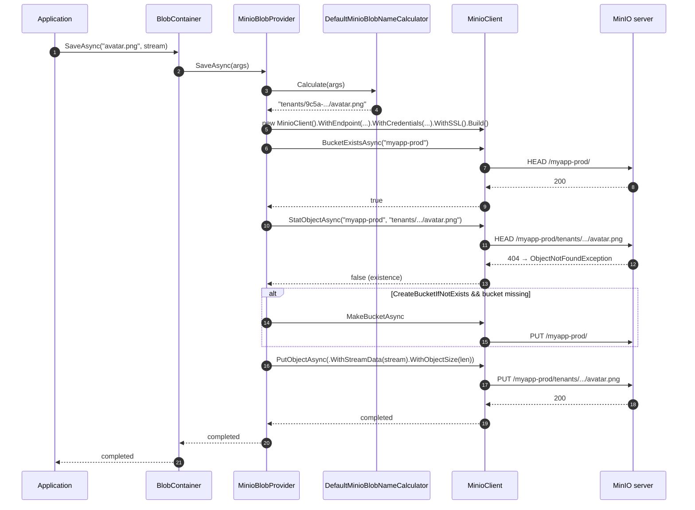

`Volo.Abp.BlobStoring.Minio` wraps the official MinIO .NET SDK (`Minio` NuGet) and is the right pick for self-hosted MinIO clusters, Wasabi, Backblaze B2 (with their S3-compatible endpoint), and any other S3-compatible object store you don't want to drive through the AWS SDK.

It is the smallest of the cloud providers in this set: there is no STS-credential cache, no factory class, no encryption-at-rest for secrets. Every save constructs a fresh `MinioClient` from the configured access keys and the endpoint.

## File inventory

| File | Purpose |
| --- | --- |
| `Volo/Abp/BlobStoring/Minio/AbpBlobStoringMinioModule.cs` | `[DependsOn(typeof(AbpBlobStoringModule))]`. Empty body. |
| `Volo/Abp/BlobStoring/Minio/MinioBlobProvider.cs` | `IBlobProvider` over `MinioClient`. |
| `Volo/Abp/BlobStoring/Minio/MinioBlobProviderConfiguration.cs` | Typed config: `BucketName?`, `EndPoint`, `AccessKey`, `SecretKey`, `WithSSL`, `CreateBucketIfNotExists`. |
| `Volo/Abp/BlobStoring/Minio/MinioBlobProviderConfigurationNames.cs` | The six string keys. |
| `Volo/Abp/BlobStoring/Minio/MinioBlobContainerConfigurationExtensions.cs` | `UseMinio(...)`, `GetMinioConfiguration()`. |
| `Volo/Abp/BlobStoring/Minio/MinioBlobNamingNormalizer.cs` | Same S3 bucket rules as `AwsBlobNamingNormalizer`. |
| `Volo/Abp/BlobStoring/Minio/IMinioBlobNameCalculator.cs` / `DefaultMinioBlobNameCalculator.cs` | `host/` vs `tenants/{id}/` prefix. |

## Module wiring

```csharp title="AbpBlobStoringMinioModule.cs"
[DependsOn(typeof(AbpBlobStoringModule))]
public class AbpBlobStoringMinioModule : AbpModule
{
}
```

No `AbpCachingModule` dependency — there's nothing to cache, since the provider doesn't issue temporary credentials.

## Registration

```csharp title="MinioBlobContainerConfigurationExtensions.cs"
public static BlobContainerConfiguration UseMinio(
    this BlobContainerConfiguration containerConfiguration,
    Action<MinioBlobProviderConfiguration> minioConfigureAction)
{
    containerConfiguration.ProviderType = typeof(MinioBlobProvider);
    containerConfiguration.NamingNormalizers.TryAdd<MinioBlobNamingNormalizer>();
    minioConfigureAction(new MinioBlobProviderConfiguration(containerConfiguration));
    return containerConfiguration;
}
```

Same shape as every other `UseXxx`.

## Options

```csharp title="MinioBlobProviderConfiguration.cs"
public class MinioBlobProviderConfiguration
{
    public string? BucketName
    {
        get => _containerConfiguration.GetConfigurationOrDefault<string>(MinioBlobProviderConfigurationNames.BucketName);
        set => _containerConfiguration.SetConfiguration(MinioBlobProviderConfigurationNames.BucketName, value);
    }

    public string EndPoint
    {
        get => _containerConfiguration.GetConfiguration<string>(MinioBlobProviderConfigurationNames.EndPoint);
        set => _containerConfiguration.SetConfiguration(MinioBlobProviderConfigurationNames.EndPoint,
            Check.NotNullOrWhiteSpace(value, nameof(value)));
    }

    public string AccessKey
    {
        get => _containerConfiguration.GetConfiguration<string>(MinioBlobProviderConfigurationNames.AccessKey);
        set => _containerConfiguration.SetConfiguration(MinioBlobProviderConfigurationNames.AccessKey,
            Check.NotNullOrWhiteSpace(value, nameof(value)));
    }

    public string SecretKey
    {
        get => _containerConfiguration.GetConfiguration<string>(MinioBlobProviderConfigurationNames.SecretKey);
        set => _containerConfiguration.SetConfiguration(MinioBlobProviderConfigurationNames.SecretKey,
            Check.NotNullOrWhiteSpace(value, nameof(value)));
    }

    public bool WithSSL { get; set; }
    public bool CreateBucketIfNotExists { get; set; }
}
```

| Property | Key | Required? | Default | Notes |
| --- | --- | --- | --- | --- |
| `EndPoint` | `Minio.EndPoint` | **Yes** | (getter throws) | URL, domain name, IPv4, or IPv6 — without the scheme. The `WithSSL` flag decides whether the client uses `https://`. Example: `play.min.io`, `localhost:9000`. |
| `AccessKey` | `Minio.AccessKey` | **Yes** | (getter throws) | MinIO access key (analogous to AWS `AccessKeyId`). The docstring notes it's optional for anonymous access, but the setter throws on null/empty, so anonymous use is not supported through `UseMinio`. |
| `SecretKey` | `Minio.SecretKey` | **Yes** | (getter throws) | Companion secret. |
| `BucketName` | `Minio.BucketName` | No | `null` → uses `args.ContainerName` | When set, all blobs in this ABP container land in the named MinIO bucket. |
| `WithSSL` | `Minio.WithSSL` | No | `false` | Calls `MinioClient.WithSSL()`. Use `true` for any production deployment. |
| `CreateBucketIfNotExists` | `Minio.CreateBucketIfNotExists` | No | `false` | If `true`, `SaveAsync` calls `MakeBucketAsync` when the bucket is missing. |

```csharp title="MinioBlobProviderConfigurationNames.cs"
public static class MinioBlobProviderConfigurationNames
{
    public const string BucketName = "Minio.BucketName";
    public const string EndPoint = "Minio.EndPoint";
    public const string AccessKey = "Minio.AccessKey";
    public const string SecretKey = "Minio.SecretKey";
    public const string WithSSL = "Minio.WithSSL";
    public const string CreateBucketIfNotExists = "Minio.CreateBucketIfNotExists";
}
```

## `MinioBlobNamingNormalizer`

Identical to [the AWS normalizer](/framework/imaging-blob/blob-storing-aws#awsblobnamingnormalizer):

```csharp title="MinioBlobNamingNormalizer.cs (excerpt)"
public virtual string NormalizeContainerName(string containerName)
{
    using (CultureHelper.Use(CultureInfo.InvariantCulture))
    {
        containerName = containerName.ToLower();
        if (containerName.Length > 63) containerName = containerName.Substring(0, 63);
        containerName = Regex.Replace(containerName, "[^a-z0-9-.]", string.Empty);
        // ... collapse `..`, strip `-.` and `.-`, strip leading/trailing `-` and `.`
        // ... reject IPv4-looking strings
        if (containerName.Length < 3)
        {
            for (var i = 0; i < 3 - containerName.Length; i++) containerName += "0";
        }
        return containerName;
    }
}

public virtual string NormalizeBlobName(string blobName) => blobName;
```

`NormalizeBlobName` is a no-op. MinIO follows S3 conventions for object keys, so any UTF-8 byte sequence under 1024 chars is accepted.

## Name calculation

```csharp title="DefaultMinioBlobNameCalculator.cs"
public virtual string Calculate(BlobProviderArgs args)
{
    return CurrentTenant.Id == null
        ? $"host/{args.BlobName}"
        : $"tenants/{CurrentTenant.Id.Value.ToString("D")}/{args.BlobName}";
}
```

Same as Azure / AWS / Aliyun.

## The provider

```csharp title="MinioBlobProvider.cs"
public class MinioBlobProvider : BlobProviderBase, ITransientDependency
{
    protected IMinioBlobNameCalculator MinioBlobNameCalculator { get; }
    protected IBlobNormalizeNamingService BlobNormalizeNamingService { get; }

    public override async Task SaveAsync(BlobProviderSaveArgs args)
    {
        var blobName = MinioBlobNameCalculator.Calculate(args);
        var configuration = args.Configuration.GetMinioConfiguration();
        var client = GetMinioClient(args);
        var containerName = GetContainerName(args);

        if (!args.OverrideExisting && await BlobExistsAsync(client, containerName, blobName))
        {
            throw new BlobAlreadyExistsException(
                $"Saving BLOB '{args.BlobName}' does already exists in the container '{containerName}'! " +
                $"Set {nameof(args.OverrideExisting)} if it should be overwritten.");
        }

        if (configuration.CreateBucketIfNotExists)
        {
            await CreateBucketIfNotExists(client, containerName);
        }

        await client.PutObjectAsync(new PutObjectArgs()
            .WithBucket(containerName)
            .WithObject(blobName)
            .WithStreamData(args.BlobStream)
            .WithObjectSize(args.BlobStream.Length));
    }
}
```

```csharp title="MinioBlobProvider.cs"
protected virtual MinioClient GetMinioClient(BlobProviderArgs args)
{
    var configuration = args.Configuration.GetMinioConfiguration();

    var client = new MinioClient()
        .WithEndpoint(configuration.EndPoint)
        .WithCredentials(configuration.AccessKey, configuration.SecretKey);

    if (configuration.WithSSL)
    {
        client.WithSSL();
    }

    return client.Build();
}
```

Things to flag:

- **`PutObjectArgs.WithObjectSize(args.BlobStream.Length)`** requires a seekable input stream. The MinIO SDK uses the length to decide whether to do a single-part upload or multipart. If your stream doesn't support `Length`, `PutObjectAsync` throws. The `BlobContainer` pipeline normally hands you a seekable `MemoryStream`, so this is fine; but if you call the provider directly with an HTTP request body, buffer first.
- **`MinioClient` per call.** Same pattern as the Azure SDK — the underlying `HttpClient` pool inside the MinIO SDK absorbs the cost.
- **`WithSSL()` modifies the client in place but `Build()` is what returns the configured instance.** A common mistake is to omit `Build()` and pass the fluent builder around expecting it to work.
- **`StatObjectAsync` is the existence check.** Like AWS, it returns 404 → `ObjectNotFoundException` → `false`, anything else → re-throw.

```csharp title="MinioBlobProvider.cs"
protected virtual async Task<bool> BlobExistsAsync(MinioClient client, string containerName, string blobName)
{
    if (await client.BucketExistsAsync(new BucketExistsArgs().WithBucket(containerName)))
    {
        try
        {
            await client.StatObjectAsync(new StatObjectArgs().WithBucket(containerName).WithObject(blobName));
        }
        catch (Exception e)
        {
            if (e is ObjectNotFoundException) return false;
            throw;
        }
        return true;
    }
    return false;
}
```

### Get path: callback-based streaming

```csharp title="MinioBlobProvider.cs"
public override async Task<Stream?> GetOrNullAsync(BlobProviderGetArgs args)
{
    var blobName = MinioBlobNameCalculator.Calculate(args);
    var client = GetMinioClient(args);
    var containerName = GetContainerName(args);

    if (!await BlobExistsAsync(client, containerName, blobName)) return null;

    var memoryStream = new MemoryStream();
    await client.GetObjectAsync(new GetObjectArgs()
        .WithBucket(containerName)
        .WithObject(blobName)
        .WithCallbackStream(stream =>
        {
            if (stream != null)
            {
                stream.CopyTo(memoryStream);
                memoryStream.Seek(0, SeekOrigin.Begin);
            }
            else
            {
                memoryStream = null;
            }
        }));

    return memoryStream;
}
```

MinIO's `GetObjectAsync` takes a `WithCallbackStream(Action<Stream>)` rather than returning a stream. The callback runs **synchronously inside `GetObjectAsync`**, copying the network stream into a `MemoryStream` the provider returns. If the response body is null (the only path that nulls the local `memoryStream`), the provider returns `null`. In every other failure case the SDK throws.

This is the only provider in the set whose download path doesn't go through `BlobProviderBase.TryCopyToMemoryStreamAsync`.

## Multi-tenant and bucket strategy

The `GetContainerName` follows the same pattern as Azure and AWS:

```csharp title="MinioBlobProvider.cs"
protected virtual string GetContainerName(BlobProviderArgs args)
{
    var configuration = args.Configuration.GetMinioConfiguration();
    return configuration.BucketName.IsNullOrWhiteSpace()
        ? args.ContainerName
        : BlobNormalizeNamingService.NormalizeContainerName(args.Configuration, configuration.BucketName!);
}
```

- `BucketName` unset → each ABP container resolves to a separate MinIO bucket named after itself (after normalization).
- `BucketName` set → all blobs share the named bucket, distinguished only by the `host/` or `tenants/{id}/` key prefix.

For a multi-tenant SaaS on MinIO, the common pattern is *one bucket per environment* (e.g. `myapp-prod`, `myapp-staging`) with `BucketName` set explicitly. That way bucket-level lifecycle rules and replication policies apply uniformly across tenants.

## Sequence: save



## Full example

```csharp title="MyModule.cs"
[DependsOn(typeof(AbpBlobStoringMinioModule))]
public class MyModule : AbpModule
{
    public override void ConfigureServices(ServiceConfigurationContext context)
    {
        var cfg = context.Services.GetConfiguration();

        Configure<AbpBlobStoringOptions>(options =>
        {
            options.Containers.ConfigureDefault(container =>
            {
                container.UseMinio(minio =>
                {
                    minio.EndPoint = cfg["Minio:EndPoint"]!;            // "minio.internal:9000"
                    minio.AccessKey = cfg["Minio:AccessKey"]!;
                    minio.SecretKey = cfg["Minio:SecretKey"]!;
                    minio.WithSSL = bool.Parse(cfg["Minio:WithSSL"] ?? "false");
                    minio.BucketName = "myapp-prod";
                    minio.CreateBucketIfNotExists = true;
                });
            });

            options.Containers.Configure<ProfilePictureContainer>(container =>
            {
                container.IsMultiTenant = true;
                container.UseMinio(minio =>
                {
                    minio.EndPoint = cfg["Minio:EndPoint"]!;
                    minio.AccessKey = cfg["Minio:AccessKey"]!;
                    minio.SecretKey = cfg["Minio:SecretKey"]!;
                    minio.WithSSL = true;
                    minio.BucketName = "myapp-profiles";
                });
            });
        });
    }
}
```

## Gotchas

- **`EndPoint` must not include the scheme.** `https://minio.example.com:9000` will fail; pass `minio.example.com:9000` and toggle `WithSSL`. The SDK's `WithEndpoint` does the URI assembly.
- **`AccessKey` and `SecretKey` setters reject null/empty.** Anonymous read of public-read buckets is not reachable through `UseMinio` even though the underlying SDK supports it. Either subclass the provider or set placeholder credentials and rely on the bucket's anonymous policy.
- **`PutObjectAsync` needs a seekable stream with a known `Length`.** Buffer non-seekable inputs (HTTP request bodies, pipes) before calling `IBlobContainer.SaveAsync`.
- **`MinioClient` is re-created per call.** No factory class exists. To pool the underlying HTTP client and share TLS handshakes, subclass `MinioBlobProvider` and cache the `MinioClient` on a static `ConcurrentDictionary` keyed by endpoint + access key.
- **`WithCallbackStream` runs synchronously**, so `GetOrNullAsync` doesn't honour `args.CancellationToken` during the body copy. If you need cancellable downloads, bypass the abstraction or wrap the call in a `Task.Run` with a token-watcher.
- **No multipart upload.** The MinIO SDK's `PutObjectAsync` chooses single-part vs multipart based on `WithObjectSize`, but the provider always supplies the stream length — multipart only kicks in for very large streams (>5 GB by default). For 100 MB – 5 GB objects you may get one giant PUT request.
- **`MinioBlobNamingNormalizer` matches the AWS rules**, including the IPv4 reject. Same caveats apply: container names like `192.168.0.1` get stripped to `''` then padded to `000`.
- **No STS support.** If your auth model requires short-lived credentials (most enterprise S3-compatible offerings), this provider isn't the right entry point — adapt the [AWS provider](/framework/imaging-blob/blob-storing-aws) by pointing it at MinIO's S3 endpoint (the AWS SDK supports custom service URLs).

## See also

- [Volo.Abp.BlobStoring](/framework/imaging-blob/blob-storing) — the consumer pipeline.
- [Volo.Abp.BlobStoring.Aws](/framework/imaging-blob/blob-storing-aws) — same wire format, richer auth.
- [Volo.Abp.BlobStoring.Azure](/framework/imaging-blob/blob-storing-azure) — Azure equivalent.
