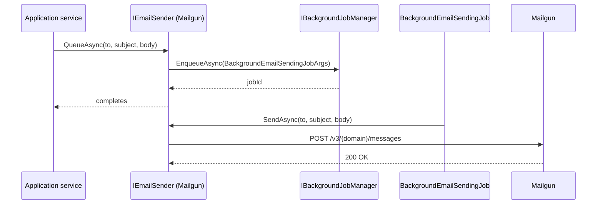

<Note>
  As of ABP v7.4.0 there is **no** `Volo.Abp.Mailgun` package in the framework source tree. The shipped email providers are `Volo.Abp.Emailing` (the abstractions plus `SmtpEmailSender`) and `Volo.Abp.MailKit` (a MailKit-based SMTP implementation). To send mail through Mailgun you implement `EmailSenderBase` against either Mailgun's HTTPS API or its SMTP relay. This page documents both.
</Note>

## What ABP gives you

The `EmailSenderBase` abstract class handles the high-level concerns: queueing through background jobs, normalizing `From`/encodings, and the two-method `SendAsync(string,…)` / `SendAsync(MailMessage,…)` interface. You only have to implement `SendEmailAsync(MailMessage)` to plug a new transport in.

```csharp framework/src/Volo.Abp.Emailing/EmailSenderBase.cs
public abstract class EmailSenderBase : IEmailSender
{
    protected IEmailSenderConfiguration Configuration { get; }
    protected IBackgroundJobManager BackgroundJobManager { get; }

    public virtual async Task SendAsync(string to, string? subject, string? body, bool isBodyHtml = true)
    {
        await SendAsync(new MailMessage
        {
            To = { to },
            Subject = subject,
            Body = body,
            IsBodyHtml = isBodyHtml
        });
    }

    public virtual async Task SendAsync(MailMessage mail, bool normalize = true)
    {
        if (normalize)
        {
            await NormalizeMailAsync(mail);
        }
        await SendEmailAsync(mail);
    }

    public virtual async Task QueueAsync(string to, string subject, string body, bool isBodyHtml = true)
    {
        if (!BackgroundJobManager.IsAvailable())
        {
            await SendAsync(to, subject, body, isBodyHtml);
            return;
        }

        await BackgroundJobManager.EnqueueAsync(new BackgroundEmailSendingJobArgs { /* … */ });
    }

    protected abstract Task SendEmailAsync(MailMessage mail);

    protected virtual async Task NormalizeMailAsync(MailMessage mail)
    {
        if (mail.From == null || mail.From.Address.IsNullOrEmpty())
        {
            mail.From = new MailAddress(
                await Configuration.GetDefaultFromAddressAsync(),
                await Configuration.GetDefaultFromDisplayNameAsync(),
                Encoding.UTF8);
        }
        if (mail.HeadersEncoding == null) mail.HeadersEncoding = Encoding.UTF8;
        if (mail.SubjectEncoding == null) mail.SubjectEncoding = Encoding.UTF8;
        if (mail.BodyEncoding == null) mail.BodyEncoding = Encoding.UTF8;
    }
}
```

So a Mailgun sender boils down to:

1. Read API key, domain, and base URL from configuration.
2. Translate `MailMessage` into a Mailgun multipart POST.
3. Replace `IEmailSender` in DI.

## Option A — Mailgun HTTPS API

Mailgun's send endpoint is `POST https://api.mailgun.net/v3/{domain}/messages` (or `https://api.eu.mailgun.net/...` for EU customers). Authentication is HTTP Basic with username `api` and password = API key.

### Options class

```csharp
public class AbpMailgunOptions
{
    /// <summary>e.g. https://api.mailgun.net/v3</summary>
    public string BaseUrl { get; set; } = "https://api.mailgun.net/v3";

    public string Domain { get; set; } = default!;

    public string ApiKey { get; set; } = default!;
}
```

### The sender

```csharp
public class MailgunEmailSender : EmailSenderBase, ITransientDependency
{
    protected AbpMailgunOptions Options { get; }
    protected IHttpClientFactory HttpClientFactory { get; }

    public MailgunEmailSender(
        IEmailSenderConfiguration configuration,
        IBackgroundJobManager backgroundJobManager,
        IHttpClientFactory httpClientFactory,
        IOptionsMonitor<AbpMailgunOptions> options)
        : base(configuration, backgroundJobManager)
    {
        HttpClientFactory = httpClientFactory;
        Options = options.CurrentValue;
    }

    protected override async Task SendEmailAsync(MailMessage mail)
    {
        var client = HttpClientFactory.CreateClient(nameof(MailgunEmailSender));

        client.BaseAddress = new Uri(Options.BaseUrl.EnsureEndsWith('/'));
        client.DefaultRequestHeaders.Authorization =
            new AuthenticationHeaderValue("Basic",
                Convert.ToBase64String(Encoding.ASCII.GetBytes($"api:{Options.ApiKey}")));

        using var content = new MultipartFormDataContent
        {
            { new StringContent($"{mail.From!.DisplayName} <{mail.From.Address}>"), "from" },
            { new StringContent(mail.Subject ?? string.Empty), "subject" },
            { new StringContent(mail.Body ?? string.Empty), mail.IsBodyHtml ? "html" : "text" },
        };

        foreach (var to in mail.To)
        {
            content.Add(new StringContent(to.Address), "to");
        }
        foreach (var cc in mail.CC)
        {
            content.Add(new StringContent(cc.Address), "cc");
        }
        foreach (var bcc in mail.Bcc)
        {
            content.Add(new StringContent(bcc.Address), "bcc");
        }

        var response = await client.PostAsync($"{Options.Domain}/messages", content);
        response.EnsureSuccessStatusCode();
    }
}
```

### Module registration

```csharp
[DependsOn(typeof(AbpEmailingModule), typeof(AbpHttpClientModule))]
public class MyMailgunModule : AbpModule
{
    public override void ConfigureServices(ServiceConfigurationContext context)
    {
        var configuration = context.Services.GetConfiguration();
        Configure<AbpMailgunOptions>(configuration.GetSection("Mailgun"));

        context.Services.AddHttpClient(nameof(MailgunEmailSender));

        context.Services.Replace(
            ServiceDescriptor.Transient<IEmailSender, MailgunEmailSender>());
    }
}
```

`Replace` is required — `SmtpEmailSender` is registered as `ITransientDependency` and you must displace it.

### appsettings.json

```json
{
  "Mailgun": {
    "BaseUrl": "https://api.mailgun.net/v3",
    "Domain": "mg.contoso.com",
    "ApiKey": "key-xxxxxxxxxxxxxxxxxxxxxxxxxxxxxx"
  },
  "Settings": {
    "Abp.Mailing.DefaultFromAddress": "no-reply@contoso.com",
    "Abp.Mailing.DefaultFromDisplayName": "Contoso"
  }
}
```

The setting keys are defined in `EmailSettingNames` and consumed by `EmailSettingProvider`:

```csharp framework/src/Volo.Abp.Emailing/EmailSettingNames.cs
public static class EmailSettingNames
{
    public const string DefaultFromAddress = "Abp.Mailing.DefaultFromAddress";
    public const string DefaultFromDisplayName = "Abp.Mailing.DefaultFromDisplayName";

    public static class Smtp
    {
        public const string Host = "Abp.Mailing.Smtp.Host";
        public const string Port = "Abp.Mailing.Smtp.Port";
        public const string UserName = "Abp.Mailing.Smtp.UserName";
        public const string Password = "Abp.Mailing.Smtp.Password";
        public const string Domain = "Abp.Mailing.Smtp.Domain";
        public const string EnableSsl = "Abp.Mailing.Smtp.EnableSsl";
        public const string UseDefaultCredentials = "Abp.Mailing.Smtp.UseDefaultCredentials";
    }
}
```

Even when sending over the Mailgun REST API, `Abp.Mailing.DefaultFromAddress` / `DefaultFromDisplayName` still drive `NormalizeMailAsync` — the `From` falls back to those if you don't set it explicitly on the `MailMessage`.

## Option B — Mailgun SMTP relay

Mailgun also exposes an SMTP endpoint at `smtp.mailgun.org:587` (or `smtp.eu.mailgun.org:587`). For pure SMTP you don't need a custom sender at all — `Volo.Abp.MailKit` works out of the box:

```json
{
  "Settings": {
    "Abp.Mailing.DefaultFromAddress": "no-reply@contoso.com",
    "Abp.Mailing.DefaultFromDisplayName": "Contoso",
    "Abp.Mailing.Smtp.Host": "smtp.mailgun.org",
    "Abp.Mailing.Smtp.Port": "587",
    "Abp.Mailing.Smtp.UserName": "postmaster@mg.contoso.com",
    "Abp.Mailing.Smtp.Password": "<smtp-password>",
    "Abp.Mailing.Smtp.EnableSsl": "true",
    "Abp.Mailing.Smtp.UseDefaultCredentials": "false"
  }
}
```

Trade-offs:

| | REST API | SMTP relay |
|--|---------|-----------|
| Connection overhead | One HTTP request | TCP + STARTTLS handshake per send |
| Tags, variables, scheduling | Native multipart fields | Custom headers (`X-Mailgun-*`) |
| Throughput at scale | Higher | Lower (per-connection limits) |
| Implementation cost | Custom sender (above) | None — use SmtpEmailSender/MailKit |

## Queueing flow

`SendAsync` is synchronous-ish: it calls `SendEmailAsync` immediately. `QueueAsync` enqueues a `BackgroundEmailSendingJobArgs` and `BackgroundEmailSendingJob` calls `SendAsync` on the background worker:

```csharp framework/src/Volo.Abp.Emailing/BackgroundEmailSendingJob.cs
public class BackgroundEmailSendingJob : AsyncBackgroundJob<BackgroundEmailSendingJobArgs>, ITransientDependency
{
    public override async Task ExecuteAsync(BackgroundEmailSendingJobArgs args)
    {
        if (args.From.IsNullOrWhiteSpace())
        {
            await EmailSender.SendAsync(args.To, args.Subject, args.Body, args.IsBodyHtml);
        }
        else
        {
            await EmailSender.SendAsync(args.From!, args.To, args.Subject, args.Body, args.IsBodyHtml);
        }
    }
}
```

So `EmailSender.QueueAsync("user@x", "Subj", "Body")` from an application service returns immediately, and the actual REST call happens on the background-job thread — useful for batch sends or for endpoints that need predictable latency.



## Gotchas

<Warning>
  Mailgun rejects `From` addresses that don't match an authorized sender for the domain. Set `Abp.Mailing.DefaultFromAddress` to an address on `mg.contoso.com` (or your verified sender domain), not your raw `contoso.com`, unless DMARC/SPF for `contoso.com` includes Mailgun.
</Warning>

<Warning>
  EU Mailgun customers must use `https://api.eu.mailgun.net/v3` and `smtp.eu.mailgun.org`. Mixing US/EU endpoints fails with 401.
</Warning>

<Warning>
  `BackgroundEmailSendingJobArgs` carries `string Subject`/`string Body` only — it cannot serialize a `MailMessage` (attachments, custom headers, multiple Tos). For rich messages, call `SendAsync(MailMessage)` directly or build your own job args.
</Warning>

<Note>
  ABP's `IEmailSender` is `IEmailSender` from `Volo.Abp.Emailing`, not from `Microsoft.AspNetCore.Identity.UI.Services`. The Account module forwards to ABP's interface; if you need Identity's `IEmailSender`, register a small adapter that delegates.
</Note>

## Cross-links

<CardGroup cols={2}>
  <Card title="Emailing module" icon="envelope" href="/framework/messaging/emailing">
    The IEmailSender contract and SMTP defaults.
  </Card>
  <Card title="MailKit" icon="envelope-open" href="/framework/messaging/emailing-mailkit">
    Production-grade SMTP via MailKit.
  </Card>
  <Card title="SMS" icon="comment-sms" href="/framework/messaging/sms">
    The parallel abstraction for SMS senders.
  </Card>
  <Card title="Background jobs" icon="clock" href="/framework/background/background-jobs">
    Where QueueAsync enqueues its work.
  </Card>
</CardGroup>
