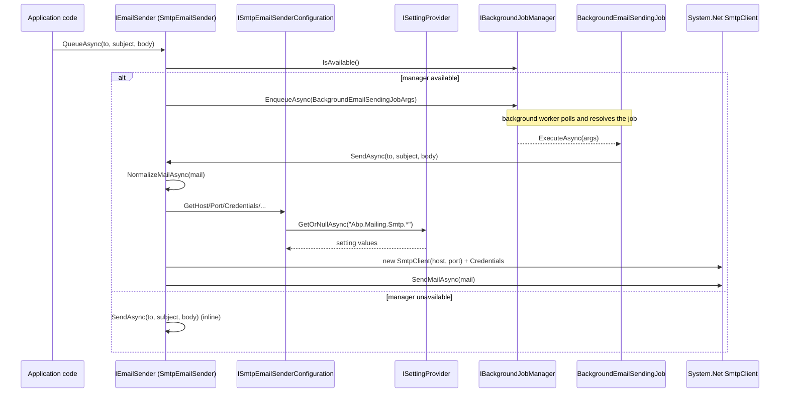

`Volo.Abp.Emailing` is the package every other ABP module reaches for when it needs to "just send an email". It defines the [`IEmailSender`](#iemailsender) abstraction, a [`MailMessage`](https://learn.microsoft.com/dotnet/api/system.net.mail.mailmessage)-based base class that takes care of UTF‑8 normalisation and background queueing, an SMTP implementation that talks to `System.Net.Mail.SmtpClient`, and a setting graph (`Abp.Mailing.*`) that surfaces host/port/credentials through `ISettingProvider` so multi-tenant overrides "just work". The same package also registers two reusable text templates — `StandardEmailTemplates.Layout` and `StandardEmailTemplates.Message` — that account, identity, and account-pro modules render through `Volo.Abp.TextTemplating`.

This page walks every file shipped in `framework/src/Volo.Abp.Emailing/`, explains how the configuration / setting layers fit together, and links to the [MailKit](/framework/messaging/emailing-mailkit) and [Mailgun](/framework/messaging/emailing-mailgun) adapters that replace the System.Net SMTP transport.

<CardGroup cols={2}>
  <Card title="MailKit transport" icon="envelope" href="/framework/messaging/emailing-mailkit">
    Cross-platform SMTP client that replaces SmtpEmailSender — required on .NET 5+ where System.Net.Mail.SmtpClient is "not recommended".
  </Card>
  <Card title="Mailgun (HTTP API)" icon="paper-plane" href="/framework/messaging/emailing-mailgun">
    Bring-your-own HTTP API sender that bypasses SMTP entirely.
  </Card>
  <Card title="Settings" icon="sliders" href="/framework/cross/settings">
    ISettingProvider, multi-tenant setting overrides — used by EmailSettingProvider.
  </Card>
  <Card title="Background jobs" icon="gear" href="/framework/background/background-jobs">
    BackgroundEmailSendingJob enqueues mails via IBackgroundJobManager.
  </Card>
</CardGroup>

## Package coordinates

```xml framework/src/Volo.Abp.Emailing/Volo.Abp.Emailing.csproj
<TargetFrameworks>netstandard2.0;netstandard2.1;net7.0</TargetFrameworks>
<AssemblyName>Volo.Abp.Emailing</AssemblyName>
<PackageId>Volo.Abp.Emailing</PackageId>
```

Dependencies (project references):

- `Volo.Abp.BackgroundJobs.Abstractions` — for `IBackgroundJobManager` used by `QueueAsync`.
- `Volo.Abp.Settings` — every transport setting is an ABP setting.
- `Volo.Abp.Localization` — `EmailingResource` for setting display names.
- `Volo.Abp.TextTemplating` — Layout/Message templates ship as `.tpl` files.
- `Volo.Abp.VirtualFileSystem` — those templates and JSON resources are embedded.

## File inventory

Source path: `framework/src/Volo.Abp.Emailing/Volo/Abp/Emailing/`.

| File | Purpose |
| --- | --- |
| `AbpEmailingModule.cs` | Module class. Embeds localization JSON + `.tpl` files and registers the background job. |
| `IEmailSender.cs` | The public contract: `SendAsync` / `QueueAsync` overloads. |
| `EmailSenderBase.cs` | Abstract base. Converts overloads to `MailMessage`, normalises encodings, defers to `IBackgroundJobManager` when queueing. |
| `NullEmailSender.cs` | Logs and discards — the registered fallback when nothing else replaces it. |
| `IEmailSenderConfiguration.cs` | Two getters: default From address + display name. |
| `EmailSenderConfiguration.cs` | Abstract base that reads them from `ISettingProvider` and throws `AbpException` if they're blank. |
| `EmailSettingNames.cs` | String constants for every `Abp.Mailing.*` setting. |
| `EmailSettingProvider.cs` | `SettingDefinitionProvider` that registers the nine SMTP / default-sender settings with default values. |
| `BackgroundEmailSendingJobArgs.cs` | `[Serializable]` POCO: `From`, `To`, `Subject`, `Body`, `IsBodyHtml`. |
| `BackgroundEmailSendingJob.cs` | `AsyncBackgroundJob<BackgroundEmailSendingJobArgs>` that re-injects `IEmailSender` and calls `SendAsync`. |
| `Smtp/ISmtpEmailSender.cs` | Refines `IEmailSender` with `BuildClientAsync()` returning `System.Net.Mail.SmtpClient`. |
| `Smtp/SmtpEmailSender.cs` | The default `IEmailSender`. Builds a `SmtpClient` from settings and calls `SendMailAsync`. |
| `Smtp/ISmtpEmailSenderConfiguration.cs` | Host/Port/UserName/Password/Domain/EnableSsl/UseDefaultCredentials accessors. |
| `Smtp/SmtpEmailSenderConfiguration.cs` | Reads each one from `ISettingProvider`. |
| `Templates/StandardEmailTemplates.cs` | Constants for the Layout/Message template names. |
| `Templates/StandardEmailTemplateDefinitionProvider.cs` | Registers them as `TemplateDefinition`s pointing at the embedded `.tpl` files. |
| `Localization/EmailingResource.cs` | Localization resource attribute. |

## The module

```csharp framework/src/Volo.Abp.Emailing/Volo/Abp/Emailing/AbpEmailingModule.cs
[DependsOn(
    typeof(AbpSettingsModule),
    typeof(AbpVirtualFileSystemModule),
    typeof(AbpBackgroundJobsAbstractionsModule),
    typeof(AbpLocalizationModule),
    typeof(AbpTextTemplatingModule)
    )]
public class AbpEmailingModule : AbpModule
{
    public override void ConfigureServices(ServiceConfigurationContext context)
    {
        Configure<AbpVirtualFileSystemOptions>(options =>
        {
            options.FileSets.AddEmbedded<AbpEmailingModule>();
        });

        Configure<AbpLocalizationOptions>(options =>
        {
            options.Resources
                .Add<EmailingResource>("en")
                .AddVirtualJson("/Volo/Abp/Emailing/Localization");
        });

        Configure<AbpBackgroundJobOptions>(options =>
        {
            options.AddJob<BackgroundEmailSendingJob>();
        });
    }
}
```

Three module dependencies matter:

1. `AbpSettingsModule` — without it `EmailSettingProvider` cannot register its definitions and `ISmtpEmailSenderConfiguration` will throw on the first call.
2. `AbpBackgroundJobsAbstractionsModule` — note the `.Abstractions` suffix. Emailing only needs the `IBackgroundJobManager` interface; the actual queue implementation (the default in-memory one, Hangfire, or Quartz) is pulled in by the consuming application.
3. `AbpTextTemplatingModule` — needed because `StandardEmailTemplateDefinitionProvider` declares templates, even if you never render them yourself; identity/account modules do.

Conventional registration handles every concrete service: `SmtpEmailSender`, `SmtpEmailSenderConfiguration`, and `BackgroundEmailSendingJob` are all attribute-decorated `ITransientDependency`, and `NullEmailSender` falls back through `TryAdd`-style replacement only when nothing else registers an `IEmailSender`.

## IEmailSender

```csharp framework/src/Volo.Abp.Emailing/Volo/Abp/Emailing/IEmailSender.cs
public interface IEmailSender
{
    Task SendAsync(string to, string? subject, string? body, bool isBodyHtml = true);

    Task SendAsync(string from, string to, string? subject, string? body, bool isBodyHtml = true);

    Task SendAsync(MailMessage mail, bool normalize = true);

    Task QueueAsync(string to, string subject, string body, bool isBodyHtml = true);

    Task QueueAsync(string from, string to, string subject, string body, bool isBodyHtml = true);
}
```

Five overloads, two operations:

| Operation | Overload | What happens |
| --- | --- | --- |
| `SendAsync` | `(to, subject, body, isBodyHtml)` | Builds `new MailMessage { To = { to }, ... }` and delegates. |
| `SendAsync` | `(from, to, subject, body, isBodyHtml)` | Wraps in `new MailMessage(from, to, subject, body)`. |
| `SendAsync` | `(MailMessage, normalize)` | Direct path; `normalize=true` rewrites blank From and forces UTF-8 encodings. |
| `QueueAsync` | `(to, subject, body, isBodyHtml)` | Enqueues a `BackgroundEmailSendingJobArgs` if the background job manager is available — otherwise falls back to a synchronous send. |
| `QueueAsync` | `(from, to, subject, body, isBodyHtml)` | Same with explicit From. |

Note the comment at the bottom of the interface — there is no `QueueAsync(MailMessage)` overload because `MailMessage` is not serialisable.

## EmailSenderBase: normalisation + queueing

```csharp framework/src/Volo.Abp.Emailing/Volo/Abp/Emailing/EmailSenderBase.cs
public abstract class EmailSenderBase : IEmailSender
{
    protected IEmailSenderConfiguration Configuration { get; }
    protected IBackgroundJobManager BackgroundJobManager { get; }

    public virtual async Task SendAsync(MailMessage mail, bool normalize = true)
    {
        if (normalize)
        {
            await NormalizeMailAsync(mail);
        }

        await SendEmailAsync(mail);
    }

    public virtual async Task QueueAsync(string to, string subject, string body, bool isBodyHtml = true)
    {
        if (!BackgroundJobManager.IsAvailable())
        {
            await SendAsync(to, subject, body, isBodyHtml);
            return;
        }

        await BackgroundJobManager.EnqueueAsync(
            new BackgroundEmailSendingJobArgs { To = to, Subject = subject, Body = body, IsBodyHtml = isBodyHtml }
        );
    }

    protected abstract Task SendEmailAsync(MailMessage mail);
}
```

`NormalizeMailAsync` is the part you don't have to write yourself:

```csharp framework/src/Volo.Abp.Emailing/Volo/Abp/Emailing/EmailSenderBase.cs
protected virtual async Task NormalizeMailAsync(MailMessage mail)
{
    if (mail.From == null || mail.From.Address.IsNullOrEmpty())
    {
        mail.From = new MailAddress(
            await Configuration.GetDefaultFromAddressAsync(),
            await Configuration.GetDefaultFromDisplayNameAsync(),
            Encoding.UTF8
        );
    }

    if (mail.HeadersEncoding == null) mail.HeadersEncoding = Encoding.UTF8;
    if (mail.SubjectEncoding == null) mail.SubjectEncoding = Encoding.UTF8;
    if (mail.BodyEncoding == null)    mail.BodyEncoding = Encoding.UTF8;
}
```

Concrete senders only implement `SendEmailAsync(MailMessage)`; the base class handles every other concern. The MailKit and Mailgun adapters both subclass `EmailSenderBase`.

## Settings layer

The setting names are constants you reference from code or admin UIs.

```csharp framework/src/Volo.Abp.Emailing/Volo/Abp/Emailing/EmailSettingNames.cs
public static class EmailSettingNames
{
    public const string DefaultFromAddress     = "Abp.Mailing.DefaultFromAddress";
    public const string DefaultFromDisplayName = "Abp.Mailing.DefaultFromDisplayName";

    public static class Smtp
    {
        public const string Host                  = "Abp.Mailing.Smtp.Host";
        public const string Port                  = "Abp.Mailing.Smtp.Port";
        public const string UserName              = "Abp.Mailing.Smtp.UserName";
        public const string Password              = "Abp.Mailing.Smtp.Password";
        public const string Domain                = "Abp.Mailing.Smtp.Domain";
        public const string EnableSsl             = "Abp.Mailing.Smtp.EnableSsl";
        public const string UseDefaultCredentials = "Abp.Mailing.Smtp.UseDefaultCredentials";
    }
}
```

`EmailSettingProvider` registers them with default values; `Password` is the only one marked `isEncrypted: true`:

| Setting name | Default | Encrypted? |
| --- | --- | --- |
| `Abp.Mailing.DefaultFromAddress` | `noreply@abp.io` | No |
| `Abp.Mailing.DefaultFromDisplayName` | `ABP application` | No |
| `Abp.Mailing.Smtp.Host` | `127.0.0.1` | No |
| `Abp.Mailing.Smtp.Port` | `25` | No |
| `Abp.Mailing.Smtp.UserName` | _(none)_ | No |
| `Abp.Mailing.Smtp.Password` | _(none)_ | **Yes** |
| `Abp.Mailing.Smtp.Domain` | _(none)_ | No |
| `Abp.Mailing.Smtp.EnableSsl` | `false` | No |
| `Abp.Mailing.Smtp.UseDefaultCredentials` | `true` | No |

Because they are settings — not raw configuration — the [Setting Management](/framework/cross/settings) module can store per-tenant overrides in the database. A multi-tenant SaaS can ship a system-wide SMTP gateway and let each tenant override its own From address from the admin UI.

`EmailSenderConfiguration` is the base class every adapter inherits to read these:

```csharp framework/src/Volo.Abp.Emailing/Volo/Abp/Emailing/EmailSenderConfiguration.cs
public abstract class EmailSenderConfiguration : IEmailSenderConfiguration
{
    protected ISettingProvider SettingProvider { get; }

    public Task<string> GetDefaultFromAddressAsync()
        => GetNotEmptySettingValueAsync(EmailSettingNames.DefaultFromAddress);

    public Task<string> GetDefaultFromDisplayNameAsync()
        => GetNotEmptySettingValueAsync(EmailSettingNames.DefaultFromDisplayName);

    protected async Task<string> GetNotEmptySettingValueAsync(string name)
    {
        var value = await SettingProvider.GetOrNullAsync(name);
        if (value.IsNullOrEmpty())
        {
            throw new AbpException($"Setting value for '{name}' is null or empty!");
        }
        return value!;
    }
}
```

A blank required setting throws `AbpException`, not `NullReferenceException` — much easier to diagnose.

## SmtpEmailSender

```csharp framework/src/Volo.Abp.Emailing/Volo/Abp/Emailing/Smtp/SmtpEmailSender.cs
public class SmtpEmailSender : EmailSenderBase, ISmtpEmailSender, ITransientDependency
{
    protected ISmtpEmailSenderConfiguration SmtpConfiguration { get; }

    public async Task<SmtpClient> BuildClientAsync()
    {
        var host = await SmtpConfiguration.GetHostAsync();
        var port = await SmtpConfiguration.GetPortAsync();

        var smtpClient = new SmtpClient(host, port);

        try
        {
            if (await SmtpConfiguration.GetEnableSslAsync())
            {
                smtpClient.EnableSsl = true;
            }

            if (await SmtpConfiguration.GetUseDefaultCredentialsAsync())
            {
                smtpClient.UseDefaultCredentials = true;
            }
            else
            {
                smtpClient.UseDefaultCredentials = false;

                var userName = await SmtpConfiguration.GetUserNameAsync();
                if (!userName.IsNullOrEmpty())
                {
                    var password = await SmtpConfiguration.GetPasswordAsync();
                    var domain   = await SmtpConfiguration.GetDomainAsync();
                    smtpClient.Credentials = !domain.IsNullOrEmpty()
                        ? new NetworkCredential(userName, password, domain)
                        : new NetworkCredential(userName, password);
                }
            }

            return smtpClient;
        }
        catch
        {
            smtpClient.Dispose();
            throw;
        }
    }

    protected override async Task SendEmailAsync(MailMessage mail)
    {
        using (var smtpClient = await BuildClientAsync())
        {
            await smtpClient.SendMailAsync(mail);
        }
    }
}
```

Three details worth pointing out:

- The `try { ... } catch { smtpClient.Dispose(); throw; }` pattern in `BuildClientAsync` matters: callers receive a fully-configured client _or_ no client at all — the partial object is never leaked.
- `UseDefaultCredentials = true` (the default) ignores `UserName`/`Password` and uses the process identity. Most production SMTP servers reject that; flip the setting to `false` before configuring credentials.
- `SmtpEmailSender` is registered as `ITransientDependency` on the **interface** `ISmtpEmailSender`. `IEmailSender` resolves to the same instance because `ISmtpEmailSender : IEmailSender`.

`ISmtpEmailSender` exposes one extra method:

```csharp framework/src/Volo.Abp.Emailing/Volo/Abp/Emailing/Smtp/ISmtpEmailSender.cs
public interface ISmtpEmailSender : IEmailSender
{
    Task<SmtpClient> BuildClientAsync();
}
```

…so code that genuinely needs a configured `SmtpClient` for advanced scenarios (attachments streamed from blob storage, custom DSN parameters) can still get one without re-reading every setting.

## NullEmailSender: the safety net

```csharp framework/src/Volo.Abp.Emailing/Volo/Abp/Emailing/NullEmailSender.cs
public class NullEmailSender : EmailSenderBase
{
    public ILogger<NullEmailSender> Logger { get; set; }

    protected override Task SendEmailAsync(MailMessage mail)
    {
        Logger.LogWarning("USING NullEmailSender!");
        Logger.LogDebug("SendEmailAsync:");
        LogEmail(mail);
        return Task.FromResult(0);
    }
}
```

It's the canonical "null object" — useful in tests and on developer machines. If you see `USING NullEmailSender!` in production logs, your composition root never depended on `Volo.Abp.MailKit` (or any other transport), and the registered `IEmailSender` silently dropped all mail. Treat it as an alert.

## Background queueing

`QueueAsync` is a one-line shortcut around the background job manager:

```csharp framework/src/Volo.Abp.Emailing/Volo/Abp/Emailing/BackgroundEmailSendingJobArgs.cs
[Serializable]
public class BackgroundEmailSendingJobArgs
{
    public string? From { get; set; }
    public string To { get; set; } = default!;
    public string? Subject { get; set; }
    public string? Body { get; set; }
    public bool IsBodyHtml { get; set; } = true;
}
```

```csharp framework/src/Volo.Abp.Emailing/Volo/Abp/Emailing/BackgroundEmailSendingJob.cs
public class BackgroundEmailSendingJob : AsyncBackgroundJob<BackgroundEmailSendingJobArgs>, ITransientDependency
{
    protected IEmailSender EmailSender { get; }

    public override async Task ExecuteAsync(BackgroundEmailSendingJobArgs args)
    {
        if (args.From.IsNullOrWhiteSpace())
        {
            await EmailSender.SendAsync(args.To, args.Subject, args.Body, args.IsBodyHtml);
        }
        else
        {
            await EmailSender.SendAsync(args.From!, args.To, args.Subject, args.Body, args.IsBodyHtml);
        }
    }
}
```

The job re-injects `IEmailSender` from the container; whatever transport is bound (SMTP, MailKit, Mailgun) will dispatch the actual mail. The args object is the only thing that has to be serialisable — and it isn't required to carry CC/BCC/attachments, which is why the TODO in `IEmailSender.cs` calls out that queued sends are limited to body + subject + to + from.

## End-to-end sequence



## Standard templates

```csharp framework/src/Volo.Abp.Emailing/Volo/Abp/Emailing/Templates/StandardEmailTemplates.cs
public static class StandardEmailTemplates
{
    public const string Layout  = "Abp.StandardEmailTemplates.Layout";
    public const string Message = "Abp.StandardEmailTemplates.Message";
}
```

`StandardEmailTemplateDefinitionProvider` wires those names to embedded `.tpl` files:

```csharp framework/src/Volo.Abp.Emailing/Volo/Abp/Emailing/Templates/StandardEmailTemplateDefinitionProvider.cs
context.Add(
    new TemplateDefinition(
        StandardEmailTemplates.Layout,
        displayName: LocalizableString.Create<EmailingResource>("TextTemplate:StandardEmailTemplates.Layout"),
        isLayout: true
    ).WithVirtualFilePath("/Volo/Abp/Emailing/Templates/Layout.tpl", true)
);

context.Add(
    new TemplateDefinition(
        StandardEmailTemplates.Message,
        displayName: LocalizableString.Create<EmailingResource>("TextTemplate:StandardEmailTemplates.Message"),
        layout: StandardEmailTemplates.Layout
    ).WithVirtualFilePath("/Volo/Abp/Emailing/Templates/Message.tpl", true)
);
```

The pattern is reusable: every module that wants branded HTML mail registers a new `TemplateDefinition` against `StandardEmailTemplates.Layout`, populates a `IStringLocalizer`-backed `.tpl`, then renders via `ITemplateRenderer.RenderAsync(name, model)` — see [text templating](/framework/templating/text-templating).

## Configuring SMTP from appsettings

Settings have **default values** in `EmailSettingProvider`. To configure them once at startup without an admin UI, register a `ConfigurationSettingValueProvider` (already wired by the host module) and add JSON like:

```json appsettings.json
{
  "Settings": {
    "Abp.Mailing.DefaultFromAddress": "no-reply@example.com",
    "Abp.Mailing.DefaultFromDisplayName": "Example",
    "Abp.Mailing.Smtp.Host": "smtp.sendgrid.net",
    "Abp.Mailing.Smtp.Port": "587",
    "Abp.Mailing.Smtp.UserName": "apikey",
    "Abp.Mailing.Smtp.Password": "SG.xxxxxxxx",
    "Abp.Mailing.Smtp.EnableSsl": "true",
    "Abp.Mailing.Smtp.UseDefaultCredentials": "false"
  }
}
```

Every value is a **string** — `ISettingProvider` is `string`-typed; the configuration class converts via `.To<int>()` / `.To<bool>()` extension methods.

## Gotchas

<Warning>
`System.Net.Mail.SmtpClient` is marked _"not recommended"_ in modern .NET (see the [API docs](https://learn.microsoft.com/dotnet/api/system.net.mail.smtpclient)). It still works for plain SMTP, but for STARTTLS, OAuth2, or modern providers (Gmail, Office 365) you need the [MailKit adapter](/framework/messaging/emailing-mailkit) — it ships `MailKitSmtpEmailSender` and registers itself with `ReplaceServices = true`, transparently swapping out `SmtpEmailSender`.
</Warning>

<Warning>
`UseDefaultCredentials` defaults to `true`. If you forget to flip it to `false`, `SmtpEmailSender` ignores the username / password you set and tries to authenticate as the worker-process identity — which on a Linux container is nobody. This is the single most common "why does mail still fail when I set the password?" report.
</Warning>

<Warning>
`QueueAsync` checks `BackgroundJobManager.IsAvailable()`. If no background-jobs module is registered (because the host depends only on `AbpBackgroundJobsAbstractionsModule`), the queue path silently degrades into a synchronous send. That is by design — but it does mean a slow SMTP server can block a web request handler.
</Warning>

<Warning>
`MailMessage` is not `[Serializable]` in the modern sense and `BackgroundEmailSendingJobArgs` only carries `From`/`To`/`Subject`/`Body`/`IsBodyHtml`. CC, BCC, attachments, and custom headers are lost when you queue. To queue rich mail, render the body yourself and put attachments in [BLOB storing](/framework/blob/blob-storing) keyed by job id, or fall back to `SendAsync(MailMessage)` directly.
</Warning>

<Warning>
The default `DefaultFromAddress` is `noreply@abp.io` — a domain you don't own. Set this in `appsettings.json` or via the admin UI before going to production; otherwise SPF/DKIM checks at the receiver will silently drop your mail.
</Warning>

## Cross-links

- [MailKit transport](/framework/messaging/emailing-mailkit) — replace `SmtpEmailSender` with the cross-platform `MailKit` client.
- [Mailgun transport](/framework/messaging/emailing-mailgun) — HTTP API alternative for environments without SMTP egress.
- [SMS abstractions](/framework/messaging/sms) — sibling `ISmsSender` pipeline with the same null-fallback pattern.
- [Settings](/framework/cross/settings) — how `Abp.Mailing.*` values are resolved and per-tenant-overridden.
- [Background jobs](/framework/background/background-jobs) — what `QueueAsync` plugs into.
- [Text templating](/framework/templating/text-templating) — how `StandardEmailTemplates.Layout` is rendered.
