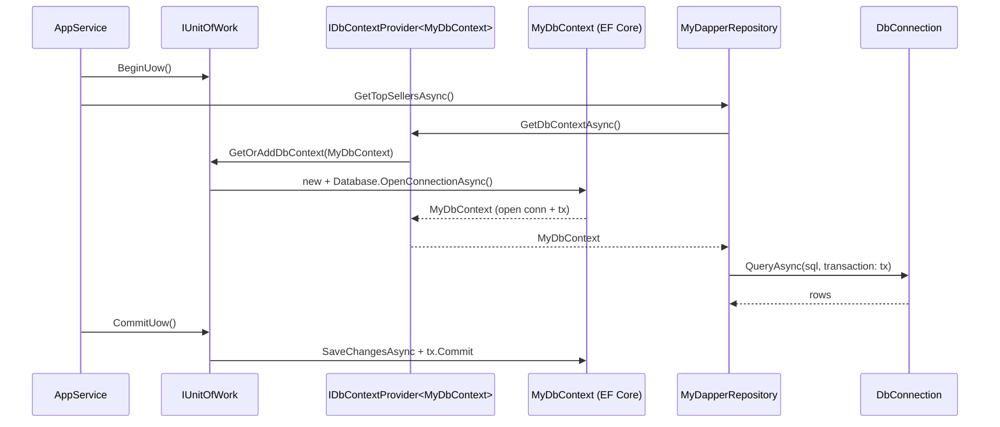

`Volo.Abp.Dapper` is the smallest persistence package in the framework — three source files and a module — yet it solves a real problem: hand-written SQL through [Dapper](https://github.com/DapperLib/Dapper) needs to share the same physical connection and transaction as the EF Core `DbContext` that owns the unit of work. Otherwise a service that mixes EF and Dapper would either deadlock against itself or partially commit.

The package's design is therefore "ride on top of EF Core". It depends on `Volo.Abp.EntityFrameworkCore`, asks the framework's `IDbContextProvider<TDbContext>` for the resolved `DbContext`, and exposes that DbContext's open `DbConnection` and `CurrentTransaction.GetDbTransaction()` for Dapper calls to consume.

## File inventory

| File | Purpose |
| --- | --- |
| `Volo/Abp/Dapper/AbpDapperModule.cs` | Empty module depending on `AbpDddDomainModule` and `AbpEntityFrameworkCoreModule`. |
| `Volo/Abp/Domain/Repositories/Dapper/IDapperRepository.cs` | Marker interface exposing `GetDbConnectionAsync` / `GetDbTransactionAsync`. |
| `Volo/Abp/Domain/Repositories/Dapper/DapperRepository.cs` | Generic concrete implementation `DapperRepository<TDbContext>`. |
| `Volo.Abp.Dapper.csproj` | References `Dapper` and `Volo.Abp.EntityFrameworkCore`. |

That is the entire package surface — no extension methods, no service collection helpers, no repository registrar.

## Key abstractions

| Symbol | Role |
| --- | --- |
| `IDapperRepository` | Top-level marker. Two async getters and two obsolete sync ones. |
| `DapperRepository<TDbContext>` | Generic base class consumed by the user-derived repository. `TDbContext` must implement `IEfCoreDbContext`. |
| `IDbContextProvider<TDbContext>` | Reused from `Volo.Abp.EntityFrameworkCore`. Returns the EF Core DbContext for the current UoW + tenant. |
| `IUnitOfWorkEnabled` | Marker on `DapperRepository` so the framework wraps its public methods in an ambient UoW when none exists. |

## The module

```csharp
[DependsOn(
    typeof(AbpDddDomainModule),
    typeof(AbpEntityFrameworkCoreModule))]
public class AbpDapperModule : AbpModule { }
```

There is intentionally no `ConfigureServices` body. Dapper itself is a set of `IDbConnection` extension methods — there are no services to register. Your concrete repositories close the generic on a real `TDbContext` and register themselves via the standard ABP conventions.

## The marker interface

```csharp
public interface IDapperRepository
{
    [Obsolete("Use GetDbConnectionAsync method.")]
    IDbConnection DbConnection { get; }
    Task<IDbConnection> GetDbConnectionAsync();

    [Obsolete("Use GetDbTransactionAsync method.")]
    IDbTransaction? DbTransaction { get; }
    Task<IDbTransaction?> GetDbTransactionAsync();
}
```

The sync properties are kept for backwards compatibility but were marked `[Obsolete]` in v6 — the async pair is what the EF Core 7 connection-resilience and async-flow story expects.

## `DapperRepository<TDbContext>` — full source

```csharp
public class DapperRepository<TDbContext> : IDapperRepository, IUnitOfWorkEnabled
    where TDbContext : IEfCoreDbContext
{
    public IAbpLazyServiceProvider LazyServiceProvider { get; set; } = default!;

    public IDataFilter DataFilter => LazyServiceProvider.LazyGetRequiredService<IDataFilter>();
    public ICurrentTenant CurrentTenant => LazyServiceProvider.LazyGetRequiredService<ICurrentTenant>();
    public IUnitOfWorkManager UnitOfWorkManager => LazyServiceProvider.LazyGetRequiredService<IUnitOfWorkManager>();
    public ICancellationTokenProvider CancellationTokenProvider =>
        LazyServiceProvider.LazyGetService<ICancellationTokenProvider>(NullCancellationTokenProvider.Instance);

    private readonly IDbContextProvider<TDbContext> _dbContextProvider;

    public DapperRepository(IDbContextProvider<TDbContext> dbContextProvider)
    {
        _dbContextProvider = dbContextProvider;
    }

    public virtual async Task<IDbConnection> GetDbConnectionAsync()
        => (await _dbContextProvider.GetDbContextAsync()).Database.GetDbConnection();

    public virtual async Task<IDbTransaction?> GetDbTransactionAsync()
        => (await _dbContextProvider.GetDbContextAsync()).Database.CurrentTransaction?.GetDbTransaction();

    protected virtual CancellationToken GetCancellationToken(CancellationToken preferredValue = default)
        => CancellationTokenProvider.FallbackToProvider(preferredValue);
}
```

That's it. Every Dapper repository in the world built on ABP is a thin wrapper over those two getters.

## How the connection ends up shared



Two observations from the diagram:

1. **Connection ownership.** `Database.GetDbConnection()` returns the raw `DbConnection` that EF Core uses for its own commands. The connection is opened by EF Core (often lazily on first `SaveChanges` or query) and closed when the `DbContext` is disposed at end-of-UoW. The Dapper call therefore must not call `connection.Close()` or wrap it in a `using` — that would yank the rug from under EF.
2. **Transaction enrolment.** `Database.CurrentTransaction` is non-null only when an ambient EF transaction has been started — which ABP does automatically inside a `IsTransactional = true` UoW. Passing that `IDbTransaction` to Dapper (`conn.ExecuteAsync(sql, param, transaction: tx)`) means the SQL participates in the same DB transaction; without it, the SQL would run outside the transaction and could observe (or write) uncommitted state inconsistently.

## A typical user repository

```csharp
public interface IBookDapperRepository : IDapperRepository, ITransientDependency
{
    Task<BookDto?> FindByIsbnAsync(string isbn, CancellationToken ct = default);
    Task<int> ArchiveStaleAsync(DateTime cutoff, CancellationToken ct = default);
}

public class BookDapperRepository
    : DapperRepository<BookStoreDbContext>, IBookDapperRepository
{
    public BookDapperRepository(IDbContextProvider<BookStoreDbContext> p) : base(p) { }

    public async Task<BookDto?> FindByIsbnAsync(string isbn, CancellationToken ct = default)
    {
        var conn = await GetDbConnectionAsync();
        var tx   = await GetDbTransactionAsync();
        return await conn.QuerySingleOrDefaultAsync<BookDto>(
            "SELECT Id, Title, Isbn FROM Books WHERE Isbn = @isbn",
            new { isbn },
            transaction: tx);
    }

    public async Task<int> ArchiveStaleAsync(DateTime cutoff, CancellationToken ct = default)
    {
        var conn = await GetDbConnectionAsync();
        var tx   = await GetDbTransactionAsync();
        return await conn.ExecuteAsync(
            "UPDATE Books SET IsDeleted = 1 WHERE LastSoldAt < @cutoff",
            new { cutoff },
            transaction: tx);
    }
}
```

Three things the framework gives you for free:

- `IsAuditedAttribute`-style auditing **does not happen** — Dapper bypasses `SaveChanges`, the ChangeTracker and the `AuditPropertySetter`. You write SQL, you set the audit columns.
- The SQL runs against the **resolved tenant connection string** because `IDbContextProvider` consults `IConnectionStringResolver` for `BookStoreDbContext`.
- Soft-delete and other global filters **are not applied** — that is purely an EF Core query-filter feature. Add `WHERE IsDeleted = 0` (or read `DataFilter.IsEnabled<ISoftDelete>()`) yourself.

## Options reference

`Volo.Abp.Dapper` exposes no options class. Behaviour is configured indirectly through:

| Knob | Where | Effect on Dapper |
| --- | --- | --- |
| `AbpUnitOfWorkDefaultOptions.IsTransactional` | `AbpUnitOfWorkOptions` | When `true`, `Database.CurrentTransaction` is non-null and Dapper participates. |
| `[ConnectionStringName("...")]` on `TDbContext` | DbContext attribute | Drives `IConnectionStringResolver` → the `DbConnection` Dapper receives. |
| `IConnectionStringResolver` (tenant-aware default impl) | DI | Reads the resolved tenant's connection string before EF opens the connection. |
| Dapper command timeouts / buffering | Dapper API (`commandTimeout:`, `buffered:`) | Pass directly to `QueryAsync` etc. — not abstracted by ABP. |

## End-to-end example with a transactional UoW

```csharp
public class ReportingAppService : ApplicationService
{
    private readonly IBookDapperRepository _dapper;
    private readonly IRepository<Book, Guid> _books;
    private readonly IUnitOfWorkManager _uowManager;

    public ReportingAppService(
        IBookDapperRepository dapper,
        IRepository<Book, Guid> books,
        IUnitOfWorkManager uowManager)
    {
        _dapper = dapper;
        _books = books;
        _uowManager = uowManager;
    }

    [UnitOfWork(IsTransactional = true)]
    public async Task RebuildSnapshotAsync()
    {
        // EF Core write — opens the connection and begins a transaction
        await _books.InsertAsync(new Book { Id = GuidGenerator.Create(), Title = "Marker" });

        // Same connection + same transaction
        var conn = await _dapper.GetDbConnectionAsync();
        var tx   = await _dapper.GetDbTransactionAsync();

        await conn.ExecuteAsync(
            "DELETE FROM BookSnapshots WHERE Date = @today",
            new { today = DateTime.UtcNow.Date },
            transaction: tx);

        await conn.ExecuteAsync(@"
            INSERT INTO BookSnapshots (Date, TotalBooks, TotalAuthors)
            SELECT @today,
                   (SELECT COUNT(*) FROM Books WHERE IsDeleted = 0),
                   (SELECT COUNT(*) FROM Authors WHERE IsDeleted = 0)",
            new { today = DateTime.UtcNow.Date },
            transaction: tx);

        // UoW commits both halves atomically
    }
}
```

If `RebuildSnapshotAsync` throws between the two `ExecuteAsync` calls, ABP's UoW rolls back the EF insert **and** the Dapper delete because both ran against the same `DbTransaction`. Without `IsTransactional = true`, the Dapper SQL would run without a transaction — the EF Core change-tracker would still buffer its `INSERT` until `SaveChanges`, but mid-method failures could leave the snapshot table inconsistent.

## DI lifetime — concretely

`IDbContextProvider<TDbContext>` is registered as transient and itself resolves the DbContext from the current UoW (a scoped object). `DapperRepository<TDbContext>` is therefore safe to register as transient as well — which is what the standard ABP convention does for any class deriving from it. Two transient repositories injected into the same scope share the same DbContext because both go through the same `IUnitOfWorkManager.Current.GetOrAddDbContext(...)` lookup.

## Gotchas

- **Mixing providers fails silently.** `DapperRepository<TDbContext>` assumes `TDbContext` is the same EF Core context that drives the UoW. If you also have a Mongo repository in the same service method, the Dapper call still goes to SQL — it does not enrol in the Mongo session.
- **Open the connection eagerly when reading first.** EF Core opens connections lazily. If your service makes only a Dapper call (no EF query first) inside a non-transactional UoW, `Database.CurrentTransaction` is `null`. Either start a transactional UoW (`[UnitOfWork(IsTransactional = true)]`) or call `await dbContext.Database.OpenConnectionAsync()` before using Dapper.
- **Closed-connection tests.** EF Core's in-memory SQLite provider keeps the connection open for the duration of the test only when you opt in. The connection Dapper receives must be open before `QueryAsync` — if it isn't, Dapper opens it itself and EF Core later sees an unexpected state.
- **No automatic parameter sanitisation beyond Dapper's.** ABP does not add a SQL filter layer — interpolated SQL is your responsibility. Always use parameterised queries.
- **`autoSave` semantics don't exist.** Dapper writes are immediate. Wrap in a UoW transaction if you need atomicity with sibling EF writes.

<CardGroup cols={2}>
  <Card title="Entity Framework Core" icon="database" href="/framework/persistence/entity-framework-core">
    Source of the `DbContext`, `DbConnection` and ambient transaction.
  </Card>
  <Card title="Unit of Work" icon="layer-group" href="/framework/data/unit-of-work">
    `[UnitOfWork(IsTransactional = true)]` makes `CurrentTransaction` non-null.
  </Card>
  <Card title="Connection Strings" icon="link" href="/framework/data/connection-strings">
    How `IConnectionStringResolver` picks the per-tenant string Dapper ends up using.
  </Card>
  <Card title="Multi-Tenancy" icon="building" href="/framework/cross/multi-tenancy">
    Per-tenant connections work transparently — Dapper inherits the EF connection.
  </Card>
</CardGroup>
