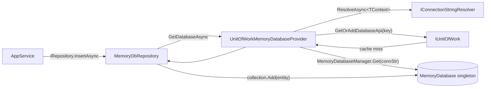

`Volo.Abp.MemoryDb` provides a fully functional ABP persistence provider that lives entirely in process memory. It mirrors the surface of `Volo.Abp.EntityFrameworkCore` and `Volo.Abp.MongoDB` — same `IRepository<TEntity, TKey>`, same `IDataFilter`, same unit-of-work hooks — but stores entities as UTF-8 JSON blobs in a `Dictionary<string, byte[]>` keyed by the entity's primary key.

The package was born for the framework's own test suite (where a hundred test fixtures need their own isolated store) but it is equally useful for spike modules, sample applications and CLI tools that should run without provisioning a database.

## File inventory

| File | Purpose |
| --- | --- |
| `Volo/Abp/MemoryDb/AbpMemoryDbModule.cs` | Registers `UnitOfWorkMemoryDatabaseProvider<>` and `MemoryDatabaseCollection<>`. |
| `Volo/Abp/MemoryDb/MemoryDbContext.cs` | Abstract base — singleton, declares `GetEntityTypes()`. |
| `Volo/Abp/MemoryDb/IMemoryDatabaseProvider.cs` | Resolves the right database for the current UoW/tenant. |
| `Volo/Abp/MemoryDb/DependencyInjection/AbpMemoryDbContextRegistrationOptions.cs` | Used by `AddMemoryDbContext`. |
| `Volo/Abp/MemoryDb/DependencyInjection/MemoryDbRepositoryRegistrar.cs` | Reflects entity types on the DbContext and registers `MemoryDbRepository<,>` / `MemoryDbRepository<,,>`. |
| `Volo/Abp/Domain/Repositories/MemoryDb/IMemoryDatabase.cs` | The store contract: `Collection<TEntity>()` + `GenerateNextId<TEntity, TKey>()`. |
| `Volo/Abp/Domain/Repositories/MemoryDb/MemoryDatabase.cs` | Singleton store. `ConcurrentDictionary<Type, object>` of collections. |
| `Volo/Abp/Domain/Repositories/MemoryDb/MemoryDatabaseCollection.cs` | Per-entity collection. `Dictionary<string, byte[]>` keyed by `entity.GetKeys().JoinAsString(",")`. |
| `Volo/Abp/Domain/Repositories/MemoryDb/IMemoryDbSerializer.cs` | Pluggable serializer interface. |
| `Volo/Abp/Domain/Repositories/MemoryDb/Utf8JsonMemoryDbSerializer.cs` | Default implementation using `System.Text.Json`. |
| `Volo/Abp/Domain/Repositories/MemoryDb/Utf8JsonMemoryDbSerializerOptions.cs` | Holds the `JsonSerializerOptions` instance. |
| `Volo/Abp/Domain/Repositories/MemoryDb/InMemoryIdGenerator.cs` | Thread-safe id generator for `Guid`, `int`, `long`. |
| `Volo/Abp/Domain/Repositories/MemoryDb/MemoryDatabaseManager.cs` | Singleton dictionary of `IMemoryDatabase` instances keyed by connection-string name. |
| `Volo/Abp/Domain/Repositories/MemoryDb/MemoryDbRepository.cs` | Generic concrete repository. |
| `Volo/Abp/Uow/MemoryDb/UnitOfWorkMemoryDatabaseProvider.cs` | Resolves the database for the current UoW + tenant. |
| `Volo/Abp/Uow/MemoryDb/MemoryDbDatabaseApi.cs` | UoW `IDatabaseApi` wrapper. |
| `Microsoft/Extensions/DependencyInjection/AbpMemoryDbServiceCollectionExtensions.cs` | `services.AddMemoryDbContext<T>()` entry point. |

## Key abstractions

| Symbol | Role |
| --- | --- |
| `MemoryDbContext` | User-derived class that simply lists the entity types it owns. Registered as singleton. |
| `IMemoryDatabaseProvider<TContext>` | Returns the `IMemoryDatabase` to use, given the current UoW and resolved connection-string name. |
| `IMemoryDatabase` | A facade exposing `Collection<TEntity>()` and `GenerateNextId<TEntity, TKey>()`. |
| `IMemoryDatabaseCollection<TEntity>` | A typed dictionary of entities supporting `Add` / `Update` / `Remove` and `IEnumerable<TEntity>`. |
| `IMemoryDbSerializer` | Strategy for converting entities to/from `byte[]`. Default = JSON. |
| `MemoryDbRepository<TContext, TEntity[, TKey]>` | Concrete repository — applies ABP concepts (id assignment, auditing, events, soft-delete). |
| `MemoryDatabaseManager` | Singleton keyed by connection-string name. Hands out an `IMemoryDatabase` per name. |

## The module

```csharp
[DependsOn(typeof(AbpDddDomainModule))]
public class AbpMemoryDbModule : AbpModule
{
    public override void ConfigureServices(ServiceConfigurationContext context)
    {
        context.Services.TryAddTransient(typeof(IMemoryDatabaseProvider<>),
                                         typeof(UnitOfWorkMemoryDatabaseProvider<>));
        context.Services.TryAddTransient(typeof(IMemoryDatabaseCollection<>),
                                         typeof(MemoryDatabaseCollection<>));
    }
}
```

No EF Core dependency, no Mongo dependency — `AbpMemoryDbModule` plugs straight into the domain abstractions and is enough for `IRepository<T>` resolution to start working.

## Resolving a database — `UnitOfWorkMemoryDatabaseProvider`



The lookup key is `"{TContext.FullName}_{connectionString}"` so two tenants pointing at different in-memory "connection strings" (e.g. `"db1"` / `"db2"` configured in `appsettings`) get isolated stores — exactly what you want for multi-tenancy tests. A single tenant calling `GetDatabaseAsync` twice in the same UoW receives the same `IMemoryDatabase`.

```csharp
public async Task<IMemoryDatabase> GetDatabaseAsync()
{
    var unitOfWork = _unitOfWorkManager.Current;
    if (unitOfWork == null)
        throw new AbpException($"A {nameof(IMemoryDatabase)} instance can only be created inside a unit of work!");

    var connectionString = await _connectionStringResolver.ResolveAsync<TMemoryDbContext>();
    var dbContextKey = $"{typeof(TMemoryDbContext).FullName}_{connectionString}";

    var databaseApi = unitOfWork.GetOrAddDatabaseApi(
        dbContextKey,
        () => new MemoryDbDatabaseApi(_memoryDatabaseManager.Get(connectionString)));
    return ((MemoryDbDatabaseApi)databaseApi).Database;
}
```

<Warning>
`GetDatabaseAsync` **throws** if there is no current unit of work. ABP application services and `[UnitOfWork]`-decorated methods open one automatically; raw helper code must open one explicitly via `IUnitOfWorkManager.Begin()` before touching a Mem-Db repository.
</Warning>

## The store — `MemoryDatabaseCollection`

```csharp
public class MemoryDatabaseCollection<TEntity> : IMemoryDatabaseCollection<TEntity>
    where TEntity : class, IEntity
{
    private readonly Dictionary<string, byte[]> _dictionary = new();
    private readonly IMemoryDbSerializer _memoryDbSerializer;

    public IEnumerator<TEntity> GetEnumerator()
    {
        foreach (var entity in _dictionary.Values)
            yield return _memoryDbSerializer.Deserialize(entity, typeof(TEntity)).As<TEntity>();
    }

    public void Add(TEntity entity)
        => _dictionary.Add(GetEntityKey(entity), _memoryDbSerializer.Serialize(entity));

    public void Update(TEntity entity)
    {
        if (_dictionary.ContainsKey(GetEntityKey(entity)))
            _dictionary[GetEntityKey(entity)] = _memoryDbSerializer.Serialize(entity);
    }

    public void Remove(TEntity entity)
        => _dictionary.Remove(GetEntityKey(entity));

    private string GetEntityKey(TEntity entity)
        => entity.GetKeys().JoinAsString(",");
}
```

Three observations:

1. **Serialise-on-write, deserialise-on-read.** Iterating the collection rebuilds each entity from JSON. That makes the store behave like a real database (no shared references, no accidental mutation of "rows") — and it means `MemoryDbRepository.GetAsync` returns a clone, just like EF Core after a no-tracking query.
2. **Composite keys are supported.** `GetKeys()` returns the entity's primary-key values; joining with a comma produces the dictionary key.
3. **No concurrency.** `Dictionary<,>` is *not* thread-safe. ABP relies on the UoW boundary to serialise writes per database. In parallel test scenarios, give each test fixture its own connection-string name so its `IMemoryDatabase` is independent.

## ID generation

```csharp
internal class InMemoryIdGenerator
{
    private int _lastInt;
    private long _lastLong;

    public TKey GenerateNext<TKey>()
    {
        if (typeof(TKey) == typeof(Guid)) return (TKey)(object)Guid.NewGuid();
        if (typeof(TKey) == typeof(int))  return (TKey)(object)Interlocked.Increment(ref _lastInt);
        if (typeof(TKey) == typeof(long)) return (TKey)(object)Interlocked.Increment(ref _lastLong);
        throw new AbpException("Not supported PrimaryKey type: " + typeof(TKey).FullName);
    }
}
```

Only `Guid`, `int` and `long` keys are supported out of the box. Composite keys (`IEntity<>` with no `Id`) work for read/write but `GenerateNextId` will throw if the repository calls it.

## `MemoryDbRepository<TContext, TEntity>` — concept application

The repository follows the same shape as the Mongo one: lazy services for auditing, events, GUID generation, plus a `DatabaseProvider`.

```csharp
public class MemoryDbRepository<TMemoryDbContext, TEntity>
    : RepositoryBase<TEntity>, IMemoryDbRepository<TEntity>
    where TMemoryDbContext : MemoryDbContext
    where TEntity : class, IEntity
{
    protected IMemoryDatabaseProvider<TMemoryDbContext> DatabaseProvider { get; }

    public ILocalEventBus LocalEventBus =>
        LazyServiceProvider.LazyGetService<ILocalEventBus>(NullLocalEventBus.Instance);
    public IGuidGenerator GuidGenerator =>
        LazyServiceProvider.LazyGetService<IGuidGenerator>(SimpleGuidGenerator.Instance);
    public IAuditPropertySetter AuditPropertySetter =>
        LazyServiceProvider.LazyGetRequiredService<IAuditPropertySetter>();
    // ...

    public override async Task<IQueryable<TEntity>> GetQueryableAsync()
        => ApplyDataFilters((await GetCollectionAsync()).AsQueryable());
}
```

`ApplyDataFilters` injects the `IsDeleted == false` and `TenantId == CurrentTenant.Id` predicates into the LINQ expression, so soft-delete and multi-tenant filtering behave identically to EF Core and Mongo.

## Serialization options

```csharp
public class Utf8JsonMemoryDbSerializerOptions
{
    public JsonSerializerOptions JsonSerializerOptions { get; set; }
}
```

The default options enable `PropertyNameCaseInsensitive`, `IncludeFields` and ignore null values. You can replace the serializer entirely:

```csharp
public class BsonMemoryDbSerializer : IMemoryDbSerializer, ITransientDependency
{
    public byte[] Serialize(object obj) => BsonExtensionMethods.ToBson(obj);
    public object Deserialize(byte[] value, Type type) => BsonSerializer.Deserialize(value, type);
}
```

Register your implementation with `[Dependency(ReplaceServices = true)]` and the collection will use it transparently.

## Options reference

| Option | Type | Default | Purpose |
| --- | --- | --- | --- |
| `Utf8JsonMemoryDbSerializerOptions.JsonSerializerOptions` | `JsonSerializerOptions` | Case-insensitive + include fields | Customise JSON shape of stored entities. |
| Connection-string value of `TContext` | string | the type's `[ConnectionStringName]` value | Acts as the "database name" inside `MemoryDatabaseManager`. Distinct values isolate stores. |

## Typical wiring (test project)

```csharp
[DependsOn(typeof(AbpMemoryDbModule), typeof(MyDomainModule))]
public class MyTestModule : AbpModule
{
    public override void ConfigureServices(ServiceConfigurationContext context)
    {
        context.Services.AddMemoryDbContext<BookStoreMemoryDbContext>();
    }
}

public class BookStoreMemoryDbContext : MemoryDbContext
{
    public override IReadOnlyList<Type> GetEntityTypes() => new[] { typeof(Book), typeof(Author) };
}
```

Inject `IRepository<Book, Guid>` in your tests — you'll get a `MemoryDbRepository<BookStoreMemoryDbContext, Book, Guid>` instance that survives across tests in the same test class because the underlying `IMemoryDatabase` is singleton.

## Gotchas

- **Singleton state leaks across tests.** Because `MemoryDatabaseManager` is `ISingletonDependency`, every test sharing the host has the same store. Use a per-test root service provider, or pass a unique connection-string name per fixture.
- **JSON-only by default.** Non-serialisable types (delegates, `IServiceProvider`, EF navigation properties) blow up at write time. Strip them with `[JsonIgnore]` or replace the serializer.
- **No transactions.** `MemoryDbDatabaseApi` does **not** implement `ISupportsRollback`. Throwing inside a transactional UoW does not undo earlier `Add` calls — Mem-Db is for tests, not for crash-safe storage.
- **`Update` is silent when the key is absent.** `MemoryDatabaseCollection.Update` checks `ContainsKey` first and does nothing otherwise. EF Core would throw a concurrency exception in the same situation.
- **Performance falls off a cliff for large queries.** Every `GetQueryableAsync` deserialises **every** row of the collection. Mem-Db is suited to fixtures with a few hundred entities, not a quarter of a million.

<CardGroup cols={2}>
  <Card title="Entity Framework Core" icon="database" href="/framework/persistence/entity-framework-core">
    The production-grade companion that Mem-Db emulates in tests.
  </Card>
  <Card title="MongoDB" icon="leaf" href="/framework/persistence/mongodb">
    The same abstractions over a document database.
  </Card>
  <Card title="Unit of Work" icon="layer-group" href="/framework/data/unit-of-work">
    Mem-Db caches its `IMemoryDatabase` inside the current UoW.
  </Card>
  <Card title="Repositories" icon="box-archive" href="/framework/ddd/repositories">
    `IRepository<TEntity, TKey>` is the unchanged surface Mem-Db provides.
  </Card>
</CardGroup>
