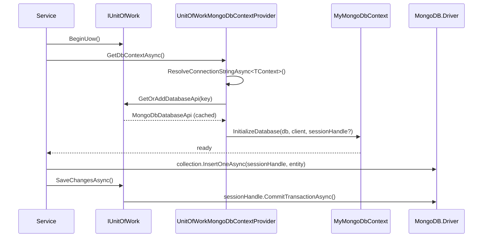
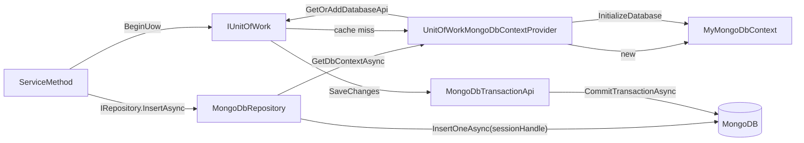

`Volo.Abp.MongoDB` is the second first-class persistence provider that ships with the framework. It binds the official `MongoDB.Driver` to ABP's repository, unit-of-work, soft-delete, multi-tenancy and auditing infrastructure while keeping the document-oriented programming model intact — there is no `ChangeTracker`, no `SaveChanges` and no entity-state graph. Every write is an explicit `InsertOneAsync`/`ReplaceOneAsync`/`DeleteManyAsync` call against an `IMongoCollection<TEntity>` resolved from your `AbpMongoDbContext`.

The package's job is therefore to make those raw driver calls look and feel like the EF Core experience: the same `IRepository<TEntity, TKey>` surface, the same `WithDetailsAsync`, the same `IDataFilter<ISoftDelete>` toggling, the same multi-tenant connection-string resolution, the same domain-event publishing on save — but implemented on top of `IClientSessionHandle` transactions instead of `DbContext` change tracking.

## File inventory

| File | Purpose |
| --- | --- |
| `Volo/Abp/MongoDB/AbpMongoDbModule.cs` | Module class. Registers `UnitOfWorkMongoDbContextProvider<>`, `MongoDbRepositoryFilterer<>`, the event in/outbox implementations and adds `AbpMongoDbConventionalRegistrar`. |
| `Volo/Abp/MongoDB/AbpMongoDbContext.cs` | Abstract base type for user DbContexts. Holds `IMongoClient`, `IMongoDatabase`, `IClientSessionHandle`. |
| `Volo/Abp/MongoDB/IAbpMongoDbContext.cs` | Public contract used by repositories and the UoW provider. |
| `Volo/Abp/MongoDB/AbpMongoDbContextOptions.cs` | Holds `DbContextReplacements` (for `ReplaceDbContext`) and `MongoClientSettingsConfigurer`. |
| `Volo/Abp/MongoDB/AbpMongoDbOptions.cs` | One flag — `UseAbpClockHandleDateTime` (default `true`). |
| `Volo/Abp/MongoDB/MongoModelBuilder.cs` | Fluent model builder used in `AbpMongoDbContext.CreateModel`. |
| `Volo/Abp/MongoDB/MongoEntityModelBuilder.cs` | Per-entity configuration (`CollectionName`, BSON class map hook). |
| `Volo/Abp/MongoDB/MongoCollectionAttribute.cs` | Attribute used on `IMongoCollection<T>` properties of a DbContext to name the collection. |
| `Volo/Abp/MongoDB/AbpBsonClassMapExtensions.cs` | Helpers for `IHasBsonClassMap`. |
| `Volo/Abp/MongoDB/AbpMongoDbDateTimeSerializer.cs` | Custom BSON serializer honouring `AbpClockOptions.Kind`. |
| `Volo/Abp/MongoDB/ConnectionStrings/MongoDBConnectionStringChecker.cs` | `IConnectionStringChecker` implementation. |
| `Volo/Abp/MongoDB/DependencyInjection/AbpMongoDbConventionalRegistrar.cs` | Auto-registers `AbpMongoDbContext` subclasses as transient. |
| `Volo/Abp/MongoDB/DependencyInjection/MongoDbRepositoryRegistrar.cs` | Walks `IMongoCollection<T>` properties and registers `MongoDbRepository<TContext, TEntity[, TKey]>`. |
| `Volo/Abp/MongoDB/DistributedEvents/MongoDbContextEventInbox.cs` | Mongo implementation of `IEventInbox` for the distributed event bus. |
| `Volo/Abp/MongoDB/DistributedEvents/MongoDbContextEventOutbox.cs` | Mongo implementation of `IEventOutbox`. |
| `Volo/Abp/MongoDB/Migrations/MongoDatabaseMigrationEventHandlerBase.cs` | Base for tenant-database-created handlers. |
| `Volo/Abp/Domain/Repositories/MongoDB/MongoDbRepository.cs` | The 844-line concrete repository. |
| `Volo/Abp/Domain/Repositories/MongoDB/MongoDbRepositoryFilterer.cs` | Implements the soft-delete + multi-tenant predicate join. |
| `Volo/Abp/Domain/Repositories/MongoDB/IMongoDbBulkOperationProvider.cs` | Optional pluggable bulk-write provider used by `Insert/Update/DeleteManyAsync`. |
| `Volo/Abp/Uow/MongoDB/MongoDbDatabaseApi.cs` | UoW `IDatabaseApi` holding the DbContext. |
| `Volo/Abp/Uow/MongoDB/MongoDbTransactionApi.cs` | UoW `ITransactionApi` wrapping an `IClientSessionHandle`. |
| `Microsoft/Extensions/DependencyInjection/AbpMongoDbServiceCollectionExtensions.cs` | `services.AddMongoDbContext<TMongoDbContext>(...)` entry point. |

## Key abstractions

| Symbol | Role |
| --- | --- |
| `AbpMongoDbContext` | User-derived class. Exposes `IMongoCollection<TEntity>` properties decorated with `[MongoCollection("name")]`. |
| `IMongoDbContextProvider<TContext>` | Resolves the context for the current tenant and unit of work. Default impl is `UnitOfWorkMongoDbContextProvider<>`. |
| `IMongoDbRepository<TEntity[, TKey]>` | Mongo-flavoured repository interface inheriting `IRepository<TEntity, TKey>`. |
| `MongoDbRepository<TContext, TEntity[, TKey]>` | Concrete repository. Translates `InsertAsync`/`UpdateAsync`/`DeleteAsync` to driver calls and applies ABP concepts. |
| `IMongoDbRepositoryFilterer<TEntity[, TKey]>` | Produces the `FilterDefinition<TEntity>` for soft-delete + multi-tenant pre-conditions. |
| `IMongoDbBulkOperationProvider` | Optional service. When registered, `InsertManyAsync` / `UpdateManyAsync` / `DeleteManyAsync` delegate to it for batched writes. |
| `MongoDbDatabaseApi` / `MongoDbTransactionApi` | Unit-of-work adapters keyed by `"{TContext.FullName}_{connectionString}"`. |

## Lifecycle inside a unit of work



The DbContext is rebuilt **lazily** through `Database.GetCollection<T>(name)` calls; there is no analogue of EF's `OnModelCreating` save-or-throw — `CreateModel` only feeds the `IMongoModelSource` cache that supplies collection names.

## `AbpMongoDbContext` — the bare minimum

```csharp
public abstract class AbpMongoDbContext : IAbpMongoDbContext, ITransientDependency
{
    public IAbpLazyServiceProvider LazyServiceProvider { get; set; }
    public IMongoModelSource ModelSource { get; set; }
    public IMongoClient Client { get; private set; }
    public IMongoDatabase Database { get; private set; }
    public IClientSessionHandle SessionHandle { get; private set; }

    protected internal virtual void CreateModel(IMongoModelBuilder modelBuilder) { }

    public virtual void InitializeDatabase(IMongoDatabase database, IMongoClient client, IClientSessionHandle sessionHandle)
    {
        Database = database;
        Client = client;
        SessionHandle = sessionHandle;
    }

    public virtual IMongoCollection<T> Collection<T>()
        => Database.GetCollection<T>(GetCollectionName<T>());

    protected virtual string GetCollectionName<T>()
        => GetEntityModel<T>().CollectionName;
}
```

A user DbContext typically looks like:

```csharp
[ConnectionStringName("Default")]
public class BookStoreMongoDbContext : AbpMongoDbContext
{
    [MongoCollection("Books")]
    public IMongoCollection<Book> Books => Collection<Book>();

    protected override void CreateModel(IMongoModelBuilder modelBuilder)
    {
        base.CreateModel(modelBuilder);
        modelBuilder.Entity<Book>(b => b.CollectionName = "Books");
    }
}
```

`SessionHandle` is **null** outside a UoW transaction. The repository checks this property on every write to decide which driver overload to call.

## `MongoDbRepository<TContext, TEntity>` — write path

The repository's `InsertAsync` shows the pattern shared by every write:

```csharp
public async override Task<TEntity> InsertAsync(
    TEntity entity, bool autoSave = false, CancellationToken cancellationToken = default)
{
    cancellationToken = GetCancellationToken(cancellationToken);

    await ApplyAbpConceptsForAddedEntityAsync(entity); // GUID, audit, events
    var dbContext = await GetDbContextAsync(cancellationToken);
    var collection = dbContext.Collection<TEntity>();

    if (dbContext.SessionHandle != null)
    {
        await collection.InsertOneAsync(dbContext.SessionHandle, entity, cancellationToken: cancellationToken);
    }
    else
    {
        await collection.InsertOneAsync(entity, cancellationToken: cancellationToken);
    }
    return entity;
}
```

`ApplyAbpConceptsForAddedEntityAsync` is small and shared across the repository's write methods:

```csharp
protected virtual Task ApplyAbpConceptsForAddedEntityAsync(TEntity entity)
{
    CheckAndSetId(entity);              // EntityHelper.TrySetId(GuidGenerator.Create)
    SetCreationAuditProperties(entity); // AuditPropertySetter.SetCreationProperties
    TriggerEntityCreateEvents(entity);  // EntityChangeEventHelper.PublishEntityCreatedEvent
    TriggerDomainEvents(entity);        // distributes IGeneratesDomainEvents items
    return Task.CompletedTask;
}
```

`UpdateAsync` adds **optimistic concurrency**:

```csharp
var oldConcurrencyStamp = SetNewConcurrencyStamp(entity);
var result = await collection.ReplaceOneAsync(
    dbContext.SessionHandle,
    await CreateEntityFilterAsync(entity, withConcurrencyStamp: true, oldConcurrencyStamp),
    entity,
    cancellationToken: cancellationToken);

if (result.MatchedCount <= 0) ThrowOptimisticConcurrencyException();
```

`CreateEntityFilterAsync` always emits `_id == entity.Id`, and when `IHasConcurrencyStamp` is implemented, an additional `ConcurrencyStamp == oldStamp` predicate. A zero `MatchedCount` therefore means somebody else updated the document — ABP throws `AbpDbConcurrencyException`.

### Bulk operations

Both `InsertManyAsync`, `UpdateManyAsync` and `DeleteManyAsync` first check for `IMongoDbBulkOperationProvider`:

```csharp
if (BulkOperationProvider != null)
{
    await BulkOperationProvider.InsertManyAsync(this, entityArray,
        dbContext.SessionHandle, autoSave, cancellationToken);
    return;
}
```

ABP's `Volo.Abp.MongoDB` package itself does **not** ship a default `IMongoDbBulkOperationProvider`; it is a slot for higher-level packages (or your own code) that want to coalesce multiple writes into a single `BulkWriteAsync` call.

## Soft-delete + multi-tenant filter (`MongoDbRepositoryFilterer`)

EF Core hides global query filters in `OnModelCreating`. Mongo has no equivalent, so ABP rebuilds filter predicates **on every query** through `IMongoDbRepositoryFilterer<TEntity>`:

```csharp
public virtual Task AddGlobalFiltersAsync(List<FilterDefinition<TEntity>> filters)
{
    if (typeof(ISoftDelete).IsAssignableFrom(typeof(TEntity)) && DataFilter.IsEnabled<ISoftDelete>())
    {
        filters.Add(Builders<TEntity>.Filter.Eq(e => ((ISoftDelete)e).IsDeleted, false));
    }

    if (typeof(IMultiTenant).IsAssignableFrom(typeof(TEntity)))
    {
        var tenantId = CurrentTenant.Id;
        filters.Add(Builders<TEntity>.Filter.Eq(e => ((IMultiTenant)e).TenantId, tenantId));
    }

    return Task.CompletedTask;
}
```

The `<TEntity, TKey>` overload adds id-based and entities-based factories on top:

```csharp
public virtual async Task<FilterDefinition<TEntity>> CreateEntityFilterAsync(TKey id, bool applyFilters = false)
{
    var filters = new List<FilterDefinition<TEntity>>
    {
        Builders<TEntity>.Filter.Eq(e => e.Id, id)
    };
    if (applyFilters) await AddGlobalFiltersAsync(filters);
    return Builders<TEntity>.Filter.And(filters);
}
```

Every repository read method that needs a predicate consults the filterer first and then `And`-joins the user predicate. Disabling soft-delete in code (`using (_dataFilter.Disable<ISoftDelete>())`) flips `DataFilter.IsEnabled<ISoftDelete>()` to `false` and the `IsDeleted == false` filter is no longer added — exactly mirroring the EF Core behaviour.

## Unit-of-work integration



The provider builds a `MongoDbDatabaseApi` keyed by `"{TContext.FullName}_{connectionString}"` and stores it in the current UoW. A second `GetDbContextAsync` inside the same UoW returns the same DbContext, sharing the `IClientSessionHandle` — that's how two repositories enrol in the same transaction.

`MongoDbTransactionApi.CommitAsync` and `RollbackAsync` simply forward to `SessionHandle.CommitTransactionAsync` / `AbortTransactionAsync`. There is **no `SaveChanges` semantic**: the moment you call `InsertOneAsync`, MongoDB has the data — `SaveChanges` only commits the surrounding transaction (when one is open).

<Warning>
Mongo transactions require a **replica set** or **sharded cluster**. Against a standalone `mongod`, `SessionHandle` is `null` and writes are immediately durable; calling `UnitOfWork.RollbackAsync()` does not undo them. Spin up `mongod --replSet rs0` and `rs.initiate()` in dev to test the full transactional path.
</Warning>

## Registration — `AddMongoDbContext`

```csharp
public static IServiceCollection AddMongoDbContext<TMongoDbContext>(
    this IServiceCollection services,
    Action<IAbpMongoDbContextRegistrationOptionsBuilder> optionsBuilder = null)
    where TMongoDbContext : AbpMongoDbContext
{
    var options = new AbpMongoDbContextRegistrationOptions(typeof(TMongoDbContext), services);
    // ...honour [ReplaceDbContext] attributes...
    optionsBuilder?.Invoke(options);

    foreach (var entry in options.ReplacedDbContextTypes)
    {
        services.Replace(ServiceDescriptor.Transient(entry.Key.Type, sp =>
        {
            var dbContextType = sp.GetRequiredService<IMongoDbContextTypeProvider>()
                .GetDbContextType(entry.Key.Type);
            return sp.GetRequiredService(dbContextType);
        }));
        services.Configure<AbpMongoDbContextOptions>(opts =>
        {
            opts.DbContextReplacements[
                new MultiTenantDbContextType(entry.Key.Type, entry.Key.MultiTenancySide)
            ] = entry.Value ?? typeof(TMongoDbContext);
        });
    }
    new MongoDbRepositoryRegistrar(options).AddRepositories();
    return services;
}
```

The `MongoDbRepositoryRegistrar` walks every `IMongoCollection<TEntity>` property of `TMongoDbContext` and registers the corresponding `MongoDbRepository<TMongoDbContext, TEntity, TKey>` against `IRepository<TEntity, TKey>` / `IMongoDbRepository<TEntity, TKey>` — symmetric with the EF Core registrar.

## Options reference

| Option | Type | Default | Purpose |
| --- | --- | --- | --- |
| `AbpMongoDbContextOptions.MongoClientSettingsConfigurer` | `Action<MongoClientSettings>` | `null` | Mutates the `MongoClientSettings` parsed from the connection string. Use to plug in `ClusterConfigurator`, `SSL`, custom serializers. |
| `AbpMongoDbContextOptions.DbContextReplacements` | `Dictionary<MultiTenantDbContextType, Type>` | empty | Internal map populated by `ReplaceDbContext(...)`. |
| `AbpMongoDbOptions.UseAbpClockHandleDateTime` | `bool` | `true` | Registers `AbpMongoDbDateTimeSerializer` so `DateTime` round-trips through `IClock.Now` semantics. |

## Gotchas

- **`autoSave` is a no-op.** The driver writes immediately — the parameter is preserved on the interface for symmetry with EF Core but the Mongo implementation ignores it. Use a UoW transaction if you need atomicity.
- **No `Include` / `WithDetailsAsync` projection magic.** Aggregates that need their child collections embedded must store them as nested documents; Mongo has no joins.
- **`IMongoCollection<T>.AsQueryable()`** is provided by `MongoDB.Driver.Linq`. The repository's `GetQueryableAsync` returns this queryable wrapped by `ApplyDataFilters`. Unsupported LINQ operators throw at execution time, not at compile time.
- **`MongoCollectionAttribute` only sets the name** consumed by the in-memory `IMongoModelSource` — it does **not** create indexes. Indexes are created either through `CreateModel` (`modelBuilder.Entity<T>(...).WithBsonClassMap` or a side `database.GetCollection<T>().Indexes.CreateOne(...)` call) or out-of-band.
- **Multi-tenant entity host queries:** `GetDbContextAsync` calls `CurrentTenant.Change(null)` only when the entity is **not** `IMultiTenant`. For host-side queries against an `IMultiTenant` collection, wrap the call yourself: `using (_currentTenant.Change(null)) { ... }`.

<CardGroup cols={2}>
  <Card title="Entity Framework Core" icon="database" href="/framework/persistence/entity-framework-core">
    The companion provider with the same repository surface.
  </Card>
  <Card title="Unit of Work" icon="layer-group" href="/framework/data/unit-of-work">
    How `IClientSessionHandle` gets committed at UoW boundary.
  </Card>
  <Card title="Multi-Tenancy" icon="building" href="/framework/cross/multi-tenancy">
    How `ICurrentTenant` drives connection-string resolution.
  </Card>
  <Card title="Data Filtering" icon="filter" href="/framework/data/data-filtering">
    `IDataFilter` toggles the soft-delete and multi-tenant predicates.
  </Card>
</CardGroup>
