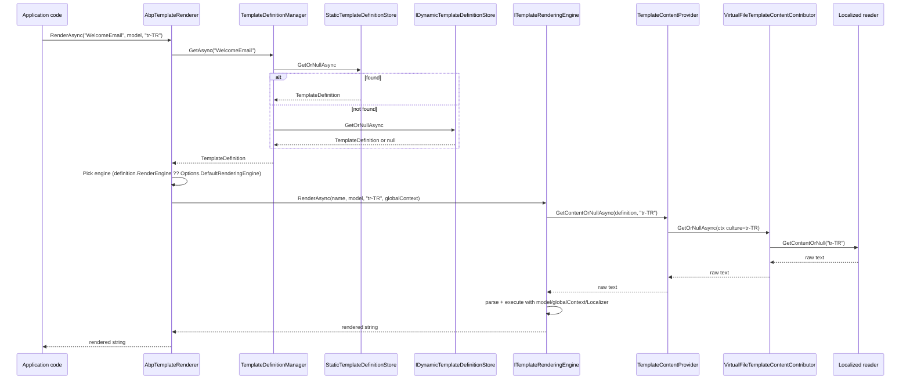

`Volo.Abp.TextTemplating` is ABP's **engine-agnostic text templating layer**. It does not parse templates by itself — instead it gives you a uniform way to **name** templates (`TemplateDefinition`), **load** their raw content (`ITemplateContentProvider` + virtual files), **localize** them per-culture and **dispatch** to a registered engine such as [Scriban](/framework/templating/text-templating-scriban) or [Razor](/framework/templating/text-templating-razor).

The split between the legacy facade package (`Volo.Abp.TextTemplating`, marked obsolete in 7.4.0) and the engine-neutral core (`Volo.Abp.TextTemplating.Core`) is intentional: applications now reference `AbpTextTemplatingScribanModule` and/or `AbpTextTemplatingRazorModule` directly, and the core only ships the abstractions both engines build on.

## File inventory

The implementation lives in two assemblies. `Volo.Abp.TextTemplating.Core` carries every interface, the dispatcher, the static-definition store and the virtual-file content reader; `Volo.Abp.TextTemplating` is now a thin backward-compat shim.

| File | Role |
| --- | --- |
| `Volo.Abp.TextTemplating.Core/.../AbpTextTemplatingCoreModule.cs` | Module that auto-registers `ITemplateDefinitionProvider` and `ITemplateContentContributor` discovered in DI. |
| `Volo.Abp.TextTemplating.Core/.../AbpTextTemplatingOptions.cs` | Options bag with `DefinitionProviders`, `ContentContributors`, `RenderingEngines` map and `DefaultRenderingEngine`. |
| `Volo.Abp.TextTemplating.Core/.../ITemplateRenderer.cs` | Public façade — `RenderAsync(name, model, cultureName, globalContext)`. |
| `Volo.Abp.TextTemplating.Core/.../AbpTemplateRenderer.cs` | Default `ITemplateRenderer` that resolves a `TemplateDefinition`, picks an engine and forwards the call. |
| `Volo.Abp.TextTemplating.Core/.../ITemplateRenderingEngine.cs` | Engine contract — `Name` plus `RenderAsync`. Implemented by Scriban / Razor / your own engine. |
| `Volo.Abp.TextTemplating.Core/.../TemplateRenderingEngineBase.cs` | Base class engines derive from. Provides `GetContentOrNullAsync` and `GetLocalizerOrNull` helpers. |
| `Volo.Abp.TextTemplating.Core/.../TemplateDefinition.cs` | Strongly-typed template metadata (name, layout, localization resource, render engine, properties bag). |
| `Volo.Abp.TextTemplating.Core/.../ITemplateDefinitionProvider.cs` + `TemplateDefinitionProvider.cs` | `PreDefine` / `Define` / `PostDefine` provider model. |
| `Volo.Abp.TextTemplating.Core/.../ITemplateDefinitionContext.cs` + `TemplateDefinitionContext.cs` | Mutable bag passed into providers — `Add`, `GetOrNull`, `GetAll`. |
| `Volo.Abp.TextTemplating.Core/.../StaticTemplateDefinitionStore.cs` | Singleton cache of definitions built by running every provider once. |
| `Volo.Abp.TextTemplating.Core/.../IDynamicTemplateDefinitionStore.cs` + `NullIDynamicTemplateDefinitionStore.cs` | Hook for database-driven definitions; default no-op implementation. |
| `Volo.Abp.TextTemplating.Core/.../TemplateDefinitionManager.cs` | Merges static + dynamic stores, with static taking precedence. |
| `Volo.Abp.TextTemplating.Core/.../ITemplateContentProvider.cs` + `TemplateContentProvider.cs` | Resolves the raw template text by walking contributors with culture fallback. |
| `Volo.Abp.TextTemplating.Core/.../ITemplateContentContributor.cs` + `TemplateContentContributorContext.cs` | Contributor SPI — pluggable sources (virtual files today; DB, S3, etc. tomorrow). |
| `Volo.Abp.TextTemplating.Core/.../TemplateDefinitionExtensions.cs` | `WithVirtualFilePath(...)` / `GetVirtualFilePathOrNull()` helpers. |
| `Volo.Abp.TextTemplating.Core/.../VirtualFiles/VirtualFileTemplateContentContributor.cs` | Default contributor — reads template text from `IVirtualFileProvider`. |
| `Volo.Abp.TextTemplating.Core/.../VirtualFiles/LocalizedTemplateContentReaderFactory.cs` | Decides whether a definition points at a file or a folder, caches a reader per template. |
| `Volo.Abp.TextTemplating.Core/.../VirtualFiles/VirtualFolderLocalizedTemplateContentReader.cs` | Reads `<culture>.tpl` / `<culture>.cshtml` files for the folder layout. |
| `Volo.Abp.TextTemplating.Core/.../VirtualFiles/FileInfoLocalizedTemplateContentReader.cs` | Reads a single inline-localized file. |
| `Volo.Abp.TextTemplating.Core/.../VirtualFiles/TemplateContentFileProvider.cs` | Bulk helper used by the management UI to list every file behind a definition. |
| `Volo.Abp.TextTemplating/.../AbpTextTemplatingModule.cs` | **Obsolete** — `[DependsOn(typeof(AbpTextTemplatingScribanModule))]` shim that exists only for 7.x migration. |

## The `ITemplateRenderer` façade

Most application code only sees this interface. The signature is engine-agnostic:

```csharp
public interface ITemplateRenderer
{
    Task<string> RenderAsync(
        [NotNull] string templateName,
        [CanBeNull] object model = null,
        [CanBeNull] string cultureName = null,
        [CanBeNull] Dictionary<string, object> globalContext = null
    );
}
```

`AbpTemplateRenderer` is the default implementation. It is a `ITransientDependency`, and its job is purely **routing** — fetch the definition, look up which engine to use, resolve that engine from a fresh scope, forward the call:

```csharp
public virtual async Task<string> RenderAsync(
    string templateName,
    object model = null,
    string cultureName = null,
    Dictionary<string, object> globalContext = null)
{
    var templateDefinition = await TemplateDefinitionManager.GetAsync(templateName);

    var renderEngine = templateDefinition.RenderEngine;

    if (renderEngine.IsNullOrWhiteSpace())
    {
        renderEngine = Options.DefaultRenderingEngine;
    }

    var providerType = Options.RenderingEngines.GetOrDefault(renderEngine);

    if (providerType != null && typeof(ITemplateRenderingEngine).IsAssignableFrom(providerType))
    {
        using (var scope = ServiceScopeFactory.CreateScope())
        {
            var templateRenderingEngine =
                (ITemplateRenderingEngine)scope.ServiceProvider.GetRequiredService(providerType);
            return await templateRenderingEngine.RenderAsync(templateName, model, cultureName, globalContext);
        }
    }

    throw new AbpException("There is no rendering engine found with template name: " + templateName);
}
```

Three properties of the routing logic are worth calling out:

1. **The engine name lives on the definition.** `templateDefinition.RenderEngine` (set via `.WithScribanEngine()`, `.WithRazorEngine()` or `.WithRenderEngine("MyEngine")`) wins over the module-wide default. This is what lets one app render some templates with Razor and others with Scriban.
2. **A fresh DI scope is created per render call.** Engines can therefore depend on scoped services (current tenant, current user, `IStringLocalizerFactory`) without leaking state between requests.
3. **The engine is *resolved by type*, not by name.** `Options.RenderingEngines` is a `Dictionary<string, Type>`; the value is the concrete engine type, which must be registered in the container. Both `AbpTextTemplatingScribanModule` and `AbpTextTemplatingRazorModule` populate that map in `ConfigureServices`.

## `AbpTextTemplatingOptions`

```csharp
public class AbpTextTemplatingOptions
{
    public ITypeList<ITemplateDefinitionProvider> DefinitionProviders { get; }
    public ITypeList<ITemplateContentContributor> ContentContributors { get; }
    public IDictionary<string, Type> RenderingEngines { get; }

    public string DefaultRenderingEngine { get; set; }

    public HashSet<string> DeletedTemplates { get; }
}
```

| Member | Default | Purpose |
| --- | --- | --- |
| `DefinitionProviders` | Auto-populated from DI by `AbpTextTemplatingCoreModule` | Ordered list of providers whose `PreDefine`/`Define`/`PostDefine` build the static store. |
| `ContentContributors` | Auto-populated (includes `VirtualFileTemplateContentContributor`) | Ordered list of sources walked by `TemplateContentProvider` until one returns content. |
| `RenderingEngines` | empty (engines fill it) | Map from engine name (`"Razor"`, `"Scriban"`, …) to the engine type to resolve. |
| `DefaultRenderingEngine` | `null` until an engine module sets it | Used when `TemplateDefinition.RenderEngine` is null/empty. Scriban's module sets it unconditionally; Razor's module only sets it if no other engine has claimed the slot yet. |
| `DeletedTemplates` | empty | Set of template names you want to hide even though a provider declared them — useful when a dependent module ships a template you no longer need. |

`AbpTextTemplatingCoreModule.PreConfigureServices` auto-discovers providers and contributors via the standard `services.OnRegistered` hook, so you rarely add them by hand:

```csharp
services.OnRegistered(context =>
{
    if (typeof(ITemplateDefinitionProvider).IsAssignableFrom(context.ImplementationType))
    {
        definitionProviders.Add(context.ImplementationType);
    }

    if (typeof(ITemplateContentContributor).IsAssignableFrom(context.ImplementationType))
    {
        contentContributors.Add(context.ImplementationType);
    }
});
```

## Declaring templates: `TemplateDefinition` and providers

A `TemplateDefinition` is a small POCO that **names** a template and tells the rendering pipeline how to find and treat it:

```csharp
public class TemplateDefinition : IHasNameWithLocalizableDisplayName
{
    public const int MaxNameLength = 128;

    [NotNull] public string Name { get; }
    [NotNull] public ILocalizableString DisplayName { get; set; }
    public bool IsLayout { get; }
    [CanBeNull] public string Layout { get; set; }
    [CanBeNull] public string LocalizationResourceName { get; set; }
    public bool IsInlineLocalized { get; set; }
    [CanBeNull] public string DefaultCultureName { get; }
    [CanBeNull] public string RenderEngine { get; set; }

    [NotNull] public Dictionary<string, object> Properties { get; }

    public virtual TemplateDefinition WithProperty(string key, object value) { /*...*/ }
    public virtual TemplateDefinition WithRenderEngine(string renderEngine) { /*...*/ }
}
```

| Property | Meaning |
| --- | --- |
| `Name` | Unique key, up to 128 chars. Use namespaced strings (`"MyApp.WelcomeEmail"`). |
| `DisplayName` | Localizable label shown in admin UIs; defaults to a `FixedLocalizableString` of `Name`. |
| `IsLayout` | `true` when the template is a wrapper — engines will render it with `content` / `Body` set to the child's output. |
| `Layout` | Name of another template (must be `IsLayout = true`) that wraps this one. |
| `LocalizationResourceName` | Localization resource the engine should hand to the template as `L` (Scriban) or `Localizer` (Razor). |
| `IsInlineLocalized` | `true` ⇒ the file itself contains the localization keys (one file per template); `false` ⇒ one file per culture (folder layout). |
| `DefaultCultureName` | Fallback culture used when the requested culture has no matching file and `IsInlineLocalized` is false. |
| `RenderEngine` | `"Scriban"`, `"Razor"`, or a custom engine name. `null` falls back to `Options.DefaultRenderingEngine`. |
| `Properties` | Free-form bag. `VirtualFileTemplateContentContributor` stores the path under `"VirtualPath"`. |

Providers fill the static store. The framework runs them in three passes so dependent modules can adjust definitions added by their dependencies:

```csharp
public abstract class TemplateDefinitionProvider : ITemplateDefinitionProvider, ITransientDependency
{
    public virtual void PreDefine(ITemplateDefinitionContext context) { }
    public abstract void Define(ITemplateDefinitionContext context);
    public virtual void PostDefine(ITemplateDefinitionContext context) { }
}
```

A typical provider declares names in one pass and attaches engine-specific metadata in another (this is the pattern the unit tests use):

```csharp
public class MyEmailTemplateDefinitionProvider : TemplateDefinitionProvider
{
    public override void Define(ITemplateDefinitionContext context)
    {
        context.Add(
            new TemplateDefinition(
                name: "MyApp.WelcomeEmail",
                localizationResource: typeof(MyAppResource),
                displayName: new LocalizableString(typeof(MyAppResource), "Templates:Welcome"))
            .WithVirtualFilePath("/Emails/WelcomeEmail", isInlineLocalized: false)
            .WithScribanEngine(),

            new TemplateDefinition(
                name: "MyApp.ForgotPasswordEmail",
                localizationResource: typeof(MyAppResource))
            .WithVirtualFilePath("/Emails/ForgotPasswordEmail.tpl", isInlineLocalized: true)
            .WithScribanEngine()
        );
    }
}
```

`StaticTemplateDefinitionStore` materialises the dictionary lazily and caches it for the lifetime of the app — providers run **once**, in a scoped service provider, in `PreDefine → Define → PostDefine` order. If you need runtime mutability, implement `IDynamicTemplateDefinitionStore` (e.g. backed by EF Core); `TemplateDefinitionManager` will merge it with the static store, preferring static entries on name collisions.

## Loading content: contributors and culture fallback

`ITemplateContentProvider` separates *where the bytes come from* from *which engine parses them*. `TemplateContentProvider` walks contributors in reverse registration order (so later registrations win) and applies a culture-fallback strategy:

```csharp
//Try to get from the requested culture
templateString = await GetContentOrNullAsync(
    contributors,
    new TemplateContentContributorContext(templateDefinition, scope.ServiceProvider, cultureName));

// ... if null and culture has a region (e.g. "tr-TR"):
templateString = await GetContentOrNullAsync(
    contributors,
    new TemplateContentContributorContext(templateDefinition, scope.ServiceProvider,
        CultureHelper.GetBaseCultureName(cultureName)));

// ... if still null:
if (templateDefinition.IsInlineLocalized)
{
    // Try culture-independent content (single inline-localized file)
    templateString = await GetContentOrNullAsync(
        contributors,
        new TemplateContentContributorContext(templateDefinition, scope.ServiceProvider, culture: null));
}
else if (templateDefinition.DefaultCultureName != null)
{
    // Try the definition's default culture (folder layout)
    templateString = await GetContentOrNullAsync(
        contributors,
        new TemplateContentContributorContext(templateDefinition, scope.ServiceProvider,
            templateDefinition.DefaultCultureName));
}
```

So the lookup order for a request with `cultureName = "tr-TR"` is:

1. The contributor returns content for `"tr-TR"`.
2. The contributor returns content for `"tr"` (base culture).
3. If `IsInlineLocalized = true`, the contributor returns content for *no* culture (the single file's raw content).
4. If `IsInlineLocalized = false`, the contributor returns content for `DefaultCultureName`.
5. `null` → engines that depend on content (Scriban, Razor) will throw downstream.

`VirtualFileTemplateContentContributor` is the default contributor and it delegates to `LocalizedTemplateContentReaderFactory`. The factory inspects the virtual path:

- **File path** (`/Emails/ForgotPassword.tpl`) → `FileInfoLocalizedTemplateContentReader` — returns the same content regardless of culture. Pair with `IsInlineLocalized = true`.
- **Folder path** (`/Emails/WelcomeEmail`) → `VirtualFolderLocalizedTemplateContentReader` — looks for files named `<culture>.tpl` or `<culture>.cshtml` inside the folder. Pair with `IsInlineLocalized = false`.

The reader is cached per template name behind a `SemaphoreSlim`, so the virtual-file system is hit at most once per template even under concurrent load:

```csharp
public virtual async Task<ILocalizedTemplateContentReader> CreateAsync(TemplateDefinition templateDefinition)
{
    if (ReaderCache.TryGetValue(templateDefinition.Name, out var reader))
    {
        return reader;
    }

    using (await SyncObj.LockAsync())
    {
        if (ReaderCache.TryGetValue(templateDefinition.Name, out reader))
        {
            return reader;
        }

        reader = await CreateInternalAsync(templateDefinition);
        ReaderCache[templateDefinition.Name] = reader;
        return reader;
    }
}
```

The folder reader pre-loads the whole directory into a `Dictionary<string, TemplateContentFileInfo>` keyed by culture name, with `.tpl` and `.cshtml` extensions stripped:

```csharp
foreach (var file in directoryContents)
{
    if (file.IsDirectory) continue;

    _dictionary.Add(file.Name.RemovePostFix(_fileExtension), new TemplateContentFileInfo
    {
        FileName = file.Name,
        FileContent = await file.ReadAsStringAsync()
    });
}
```

## End-to-end render sequence



## Plugging in a custom engine

Implementing `ITemplateRenderingEngine` (or deriving from `TemplateRenderingEngineBase`) is the only thing required to register a new engine. The base class wires up `ITemplateDefinitionManager`, `ITemplateContentProvider` and `IStringLocalizerFactory` for you and exposes two helpers:

```csharp
public abstract class TemplateRenderingEngineBase : ITemplateRenderingEngine
{
    public abstract string Name { get; }

    public abstract Task<string> RenderAsync(string templateName, object model = null,
        string cultureName = null, Dictionary<string, object> globalContext = null);

    protected virtual async Task<string> GetContentOrNullAsync(TemplateDefinition templateDefinition)
    {
        return await TemplateContentProvider.GetContentOrNullAsync(templateDefinition);
    }

    protected virtual IStringLocalizer GetLocalizerOrNull(TemplateDefinition templateDefinition)
    {
        if (templateDefinition.LocalizationResourceName != null)
        {
            return StringLocalizerFactory.CreateByResourceName(templateDefinition.LocalizationResourceName);
        }

        return StringLocalizerFactory.CreateDefaultOrNull();
    }
}
```

A minimal engine looks like this:

```csharp
public class MyEngineRenderingEngine : TemplateRenderingEngineBase, ITransientDependency
{
    public const string EngineName = "MyEngine";
    public override string Name => EngineName;

    public MyEngineRenderingEngine(
        ITemplateDefinitionManager defs,
        ITemplateContentProvider content,
        IStringLocalizerFactory locFactory) : base(defs, content, locFactory) { }

    public override async Task<string> RenderAsync(string templateName, object model = null,
        string cultureName = null, Dictionary<string, object> globalContext = null)
    {
        var def  = await TemplateDefinitionManager.GetAsync(templateName);
        var text = await GetContentOrNullAsync(def);
        var loc  = GetLocalizerOrNull(def);

        // ... parse `text`, evaluate against `model`/`globalContext`, return output.
        return MyParser.Render(text, model, globalContext, loc);
    }
}

public class AbpMyEngineModule : AbpModule
{
    public override void ConfigureServices(ServiceConfigurationContext context)
    {
        Configure<AbpTextTemplatingOptions>(options =>
        {
            options.RenderingEngines[MyEngineRenderingEngine.EngineName] = typeof(MyEngineRenderingEngine);
            // Optional: claim the default slot if not yet set
            if (options.DefaultRenderingEngine.IsNullOrWhiteSpace())
            {
                options.DefaultRenderingEngine = MyEngineRenderingEngine.EngineName;
            }
        });
    }
}
```

You can then opt individual templates in via `def.WithRenderEngine("MyEngine")`, or make it the global default.

## Gotchas

- **The legacy `Volo.Abp.TextTemplating` package is obsolete.** Its module simply depends on `AbpTextTemplatingScribanModule`. New code should reference `Volo.Abp.TextTemplating.Scriban` and/or `Volo.Abp.TextTemplating.Razor` directly and depend on the corresponding module — the obsolete shim will be removed in a future major.
- **No contributor → exception.** `TemplateContentProvider` throws `AbpException("No template content contributor was registered. …")` if `Options.ContentContributors` is empty. Removing `VirtualFileTemplateContentContributor` from DI without a replacement breaks all rendering.
- **Inline-localized vs. folder layout is decided per template, not globally.** A single template can be inline-localized (one file with `{{ L "Hello" }}` markers) while a sibling uses one file per culture. The flag is on `TemplateDefinition.IsInlineLocalized` and is set by the `WithVirtualFilePath` overload.
- **Static beats dynamic on collisions.** `TemplateDefinitionManager.GetAllAsync` concatenates dynamic entries *after* static ones, then filters out any dynamic entry whose name already exists in the static store. You can't override a static template's metadata from a dynamic store — only add new ones.
- **`DeletedTemplates` is consulted by callers, not by the manager itself.** The store still returns them; UIs and dynamic stores are expected to honour the set.
- **`AbpTemplateRenderer` resolves the engine from a child scope.** Engines should not keep request-scoped state on themselves; ABP creates a new `IServiceScope` for every `RenderAsync` call. This is also why engines are registered as `ITransientDependency`.
- **Definitions are built once.** `StaticTemplateDefinitionStore.CreateTextTemplateDefinitions` runs every provider in a `Lazy<T>` — if you mutate a `TemplateDefinition`'s `Properties` at runtime, the mutation sticks for the process lifetime. Treat them as effectively immutable after startup.
- **The `WithVirtualFilePath` extension flips `IsInlineLocalized` on the definition.** Calling it twice with conflicting flags silently overwrites the previous value; the last writer wins.
- **`.tpl` and `.cshtml` are the only file extensions recognised by the folder reader.** They are hard-coded in `LocalizedTemplateContentReaderFactory.CreateInternalAsync` (`new[] { ".tpl", ".cshtml" }`). Adding a Liquid file extension or anything else requires a custom contributor.

## Related pages

- [Scriban rendering engine](/framework/templating/text-templating-scriban) — the default engine, with `{{ L "Key" }}` localization.
- [Razor rendering engine](/framework/templating/text-templating-razor) — the Roslyn-compiled `@Model.Name` engine.
- [Liquid rendering engine](/framework/templating/text-templating-liquid) — pattern for building your own engine on top of the same abstractions, with Liquid as the worked example.
- [Localization](/framework/cross/multi-lingual-objects) — how `IStringLocalizerFactory` resolves the resource the templates use.
- [Virtual file system](/framework/core/virtual-file-system) — how `.tpl` and `.cshtml` files are embedded into module assemblies and surfaced through `IVirtualFileProvider`.
