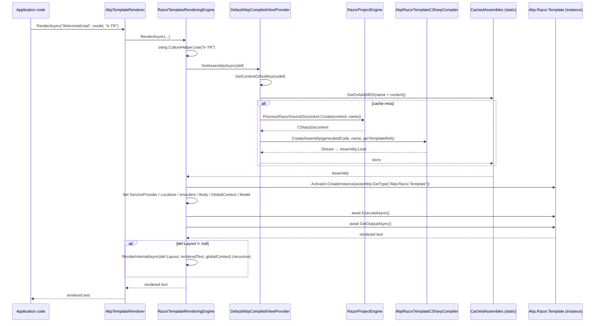

`Volo.Abp.TextTemplating.Razor` is ABP's **Razor-based** rendering engine for the text-templating system. Unlike the [Scriban engine](/framework/templating/text-templating-scriban), Razor templates are real C# — `@inherits`, `@if`, `@foreach`, `@Model.Name`, `@Localizer["Hello"]` all work the same as in MVC views — but they are rendered **outside the ASP.NET Core view engine**: ABP compiles each template into its own in-memory assembly using `RazorProjectEngine` + Roslyn, then instantiates the generated class through `IRazorTemplatePage`.

Use this engine when you need the full expressive power of C# inside a template: complex conditionals, calling helper services from the template, generating HTML emails with strongly-typed models, or producing structured documents that mix logic with markup.

## File inventory

| File | Role |
| --- | --- |
| `Volo.Abp.TextTemplating.Razor/.../AbpTextTemplatingRazorModule.cs` | Module that registers the engine in `AbpTextTemplatingOptions.RenderingEngines` and *conditionally* claims the `DefaultRenderingEngine` slot. |
| `Volo.Abp.TextTemplating.Razor/.../RazorTemplateRenderingEngine.cs` | The `ITemplateRenderingEngine` implementation — gets the compiled assembly, instantiates the page, wires DI / encoders / model / body, calls `ExecuteAsync`. |
| `Volo.Abp.TextTemplating.Razor/.../IAbpCompiledViewProvider.cs` + `DefaultAbpCompiledViewProvider.cs` | Compiles a `TemplateDefinition`'s raw `.cshtml` into a Razor `CodeDocument` → C# source → `Assembly`, with a process-wide cache keyed by `MD5(name + content)`. |
| `Volo.Abp.TextTemplating.Razor/.../AbpRazorTemplateCSharpCompiler.cs` + `AbpRazorTemplateCSharpCompilerOptions.cs` | Wraps Roslyn's `CSharpCompilation` with a fixed default-references list plus user-supplied `PortableExecutableReference`s. |
| `Volo.Abp.TextTemplating.Razor/.../IAbpRazorProjectEngineFactory.cs` + `DefaultAbpRazorProjectEngineFactory.cs` + `EmptyProjectFileSystem.cs` + `NotFoundProjectItem.cs` | Factory for `RazorProjectEngine` against an empty file system — ABP doesn't use disk paths, it feeds the template source in as a `RazorSourceDocument`. |
| `Volo.Abp.TextTemplating.Razor/.../AbpCompiledViewProviderOptions.cs` | Options bag holding **per-template** extra references (`Dictionary<string, List<PortableExecutableReference>>`). |
| `Volo.Abp.TextTemplating.Razor/.../AbpRazorTemplateConsts.cs` | The fixed namespace (`Abp.Razor`) and class name (`Template`) the generated assembly uses. |
| `Volo.Abp.TextTemplating.Razor/.../IRazorTemplatePage.cs` + `RazorTemplatePageBase.cs` | The base class generated templates `@inherits` — exposes `Model`, `Localizer`, `Body`, `GlobalContext`, `Html/JavaScript/Url Encoder`, plus `Write` / `WriteLiteral` / attribute writers Razor's code generator emits calls to. |
| `Volo.Abp.TextTemplating.Razor/.../RazorTemplateDefinitionExtensions.cs` | `WithRazorEngine()` extension that sets `TemplateDefinition.RenderEngine = "Razor"`. |

The package depends on `AbpTextTemplatingCoreModule` plus `Microsoft.AspNetCore.Razor.Language` and `Microsoft.CodeAnalysis.CSharp` from the .NET SDK.

## Module wiring

```csharp
[DependsOn(typeof(AbpTextTemplatingCoreModule))]
public class AbpTextTemplatingRazorModule : AbpModule
{
    public override void ConfigureServices(ServiceConfigurationContext context)
    {
        Configure<AbpTextTemplatingOptions>(options =>
        {
            if (options.DefaultRenderingEngine.IsNullOrWhiteSpace())
            {
                options.DefaultRenderingEngine = RazorTemplateRenderingEngine.EngineName;
            }
            options.RenderingEngines[RazorTemplateRenderingEngine.EngineName] = typeof(RazorTemplateRenderingEngine);
        });
    }
}
```

Two things to highlight versus the Scriban module:

1. **Razor only claims the default if nobody else has.** Scriban's module sets `DefaultRenderingEngine = "Scriban"` unconditionally; Razor checks `IsNullOrWhiteSpace` first. In a project that depends on both, Scriban wins by default. Override in your own module with `Configure<AbpTextTemplatingOptions>(o => o.DefaultRenderingEngine = "Razor")`.
2. **The engine type is registered against the engine *name* string.** That string is the constant `RazorTemplateRenderingEngine.EngineName = "Razor"` and it is what `TemplateDefinition.WithRazorEngine()` writes into `RenderEngine`.

## The render pipeline

`RazorTemplateRenderingEngine` derives from `TemplateRenderingEngineBase` and adds two collaborators: `IServiceScopeFactory` (it makes its own DI scope for every template instance) and `IAbpCompiledViewProvider` (the compile-and-cache pipeline). The public `RenderAsync` mirrors the Scriban engine, including the `CultureHelper.Use(cultureName)` scope:

```csharp
public override async Task<string> RenderAsync(
    [NotNull] string templateName,
    [CanBeNull] object model = null,
    [CanBeNull] string cultureName = null,
    [CanBeNull] Dictionary<string, object> globalContext = null)
{
    Check.NotNullOrWhiteSpace(templateName, nameof(templateName));

    if (globalContext == null) globalContext = new Dictionary<string, object>();

    if (cultureName == null)
    {
        return await RenderInternalAsync(templateName, null, globalContext, model);
    }
    else
    {
        using (CultureHelper.Use(cultureName))
        {
            return await RenderInternalAsync(templateName, null, globalContext, model);
        }
    }
}
```

`RenderInternalAsync` does the layout chaining. Where the Scriban engine pushes the child's output into `globalContext["content"]`, the Razor engine passes it down as a `body` parameter (which `RazorTemplatePageBase` exposes as `@Body`):

```csharp
protected virtual async Task<string> RenderInternalAsync(
    string templateName, string body,
    Dictionary<string, object> globalContext, object model = null)
{
    var templateDefinition = await TemplateDefinitionManager.GetAsync(templateName);

    var renderedContent = await RenderSingleTemplateAsync(templateDefinition, body, globalContext, model);

    if (templateDefinition.Layout != null)
    {
        renderedContent = await RenderInternalAsync(
            templateDefinition.Layout, renderedContent, globalContext);
    }

    return renderedContent;
}
```

The heart of the render is `RenderTemplateContentWithRazorAsync`. It asks `IAbpCompiledViewProvider` for the compiled assembly, locates the generated `Abp.Razor.Template` type, instantiates it, wires properties from a fresh scope, and calls `ExecuteAsync`/`GetOutputAsync`:

```csharp
protected virtual async Task<string> RenderTemplateContentWithRazorAsync(
    TemplateDefinition templateDefinition, string body,
    Dictionary<string, object> globalContext, object model = null)
{
    var assembly     = await AbpCompiledViewProvider.GetAssemblyAsync(templateDefinition);
    var templateType = assembly.GetType(AbpRazorTemplateConsts.TypeName);   // "Abp.Razor.Template"
    var template     = (IRazorTemplatePage)Activator.CreateInstance(templateType);

    using (var scope = ServiceScopeFactory.CreateScope())
    {
        var modelType = templateType
            .GetInterfaces()
            .Where(x => x.IsGenericType && x.GetGenericTypeDefinition() == typeof(IRazorTemplatePage<>))
            .Select(x => x.GenericTypeArguments.FirstOrDefault())
            .FirstOrDefault();

        if (modelType != null)
        {
            GetType().GetMethod(nameof(SetModel), BindingFlags.Instance | BindingFlags.NonPublic)
                ?.MakeGenericMethod(modelType).Invoke(this, new[] { template, model });
        }

        template.ServiceProvider    = scope.ServiceProvider;
        template.Localizer          = GetLocalizerOrNull(templateDefinition);
        template.HtmlEncoder        = scope.ServiceProvider.GetService<HtmlEncoder>();
        template.JavaScriptEncoder  = scope.ServiceProvider.GetService<JavaScriptEncoder>();
        template.UrlEncoder         = scope.ServiceProvider.GetService<UrlEncoder>();
        template.Body               = body;
        template.GlobalContext      = globalContext;

        await template.ExecuteAsync();

        return await template.GetOutputAsync();
    }
}
```

The reflection dance for `SetModel<TModel>` is needed because Razor templates declare their model type via `@inherits RazorTemplatePageBase<MyModel>`; the engine discovers the generic argument at runtime and only then assigns `Model`.

## Compilation: `DefaultAbpCompiledViewProvider`

This is where the Razor → C# → IL pipeline lives. It is hit on **first render of each unique template content**, then cached process-wide:

```csharp
private static readonly ConcurrentDictionary<string, Assembly> CachedAssembles = new();

public virtual async Task<Assembly> GetAssemblyAsync(TemplateDefinition templateDefinition)
{
    async Task<Assembly> CreateAssembly(string content)
    {
        using (var assemblyStream = await GetAssemblyStreamAsync(templateDefinition, content))
        {
            return Assembly.Load(await assemblyStream.GetAllBytesAsync());
        }
    }

    var templateContent = await _templateContentProvider.GetContentOrNullAsync(templateDefinition);
    if (templateContent == null)
    {
        throw new AbpException($"Razor template content of {templateDefinition.Name} is null!");
    }

    return CachedAssembles.GetOrAdd(
        (templateDefinition.Name + templateContent).ToMd5(),
        await CreateAssembly(templateContent));
}
```

The cache key is `MD5(templateDefinition.Name + templateContent)`. That has two consequences worth understanding:

- **Editing a template at runtime triggers recompilation automatically** — different content ⇒ different MD5 ⇒ new assembly is built and cached. The old assembly stays loaded for the process's lifetime (.NET cannot unload assemblies from the default load context), so don't rely on this for hot-reload scenarios with thousands of edits.
- **The cache is static** (process-wide), not per-DI-container, and is never evicted. In test runs that spin up many host instances, all of them share the same cache.

The Razor → C# step uses `RazorProjectEngine` with a synthetic source document:

```csharp
protected virtual async Task<Stream> GetAssemblyStreamAsync(TemplateDefinition templateDefinition, string templateContent)
{
    var razorProjectEngine = await _razorProjectEngineFactory.CreateAsync(builder =>
    {
        builder.SetNamespace(AbpRazorTemplateConsts.DefaultNameSpace);     // "Abp.Razor"
        builder.ConfigureClass((document, node) =>
        {
            node.ClassName = AbpRazorTemplateConsts.DefaultClassName;       // "Template"
        });
    });

    var codeDocument = razorProjectEngine.Process(
        RazorSourceDocument.Create(templateContent, templateDefinition.Name),
        null, new List<RazorSourceDocument>(), new List<TagHelperDescriptor>());

    var cSharpDocument = codeDocument.GetCSharpDocument();

    var templateReferences = _options.TemplateReferences
        .GetOrDefault(templateDefinition.Name)
        ?.Select(x => x)
        .Cast<MetadataReference>()
        .ToList();

    return _razorTemplateCSharpCompiler.CreateAssembly(
        cSharpDocument.GeneratedCode, templateDefinition.Name, templateReferences);
}
```

Two design choices to note:

- **Every generated class is `Abp.Razor.Template`.** The engine fixes the namespace and class name in the builder. That's why `assembly.GetType(AbpRazorTemplateConsts.TypeName)` always finds it. The cost is that you must build a fresh assembly per template — you can't multi-class a single assembly.
- **No tag helpers, no imports.** `Process` is called with empty `List<TagHelperDescriptor>` and `null` for imports. `@addTagHelper`, `@inject` and the like aren't supported out of the box. `@inherits` is, because that's part of the base Razor language, not the MVC tag-helper pipeline.

## The Roslyn compile step

`AbpRazorTemplateCSharpCompiler` is the boundary between Razor-generated C# and an `Assembly`. It owns a fixed list of default references — the BCL slices needed to compile generated `@Model.Name` style code plus ABP's own assemblies for the base class:

```csharp
private static IEnumerable<PortableExecutableReference> DefaultReferences => new List<Assembly>()
    {
        Assembly.Load("netstandard"),
        Assembly.Load("System.Private.CoreLib"),
        Assembly.Load("System.Runtime"),
        Assembly.Load("System.Collections"),
        Assembly.Load("System.ComponentModel"),
        Assembly.Load("System.Linq"),
        Assembly.Load("System.Linq.Expressions"),
        Assembly.Load("Microsoft.Extensions.DependencyInjection"),
        Assembly.Load("Microsoft.Extensions.DependencyInjection.Abstractions"),
        Assembly.Load("Microsoft.Extensions.Localization"),
        Assembly.Load("Microsoft.Extensions.Localization.Abstractions"),

        typeof(AbpRazorTemplateCSharpCompiler).Assembly
    }
    .Select(x => MetadataReference.CreateFromFile(x.Location))
    .ToImmutableList();
```

That's the **only** set of references available unless you opt in. Your own model types, ABP modules, or third-party libraries referenced from the template will fail to resolve at compile time with a `Build failed` exception unless you register them via one of the two options bags:

```csharp
public override void ConfigureServices(ServiceConfigurationContext context)
{
    // Apply to every template
    Configure<AbpRazorTemplateCSharpCompilerOptions>(options =>
    {
        options.References.Add(MetadataReference.CreateFromFile(typeof(MyDomainModel).Assembly.Location));
    });

    // Apply to a specific template only
    Configure<AbpCompiledViewProviderOptions>(options =>
    {
        options.TemplateReferences[MyTemplates.SpecialReport] = new List<PortableExecutableReference>
        {
            MetadataReference.CreateFromFile(typeof(SpecialReportHelpers).Assembly.Location)
        };
    });
}
```

The unit-test module for the Razor package does exactly this:

```csharp
Configure<AbpRazorTemplateCSharpCompilerOptions>(options =>
{
    options.References.Add(MetadataReference.CreateFromFile(typeof(RazorTextTemplatingTestModule).Assembly.Location));
});
```

The compiler emits a release-mode dynamic-library and surfaces diagnostics in the exception message:

```csharp
public virtual Stream CreateAssembly(string code, string assemblyName,
    List<MetadataReference> references = null, CSharpCompilationOptions options = null)
{
    var defaultReferences = DefaultReferences.Concat(Options.References);
    var compilation = CSharpCompilation.Create(
        assemblyName,
        syntaxTrees: new[] { CreateSyntaxTree(code) },
        references: references != null ? defaultReferences.Concat(references) : defaultReferences,
        options ?? GetCompilationOptions());

    using (var memoryStream = new MemoryStream())
    {
        var result = compilation.Emit(memoryStream);
        if (!result.Success)
        {
            var error = new StringBuilder();
            error.AppendLine("Build failed");
            foreach (var diagnostic in result.Diagnostics)
            {
                error.AppendLine(diagnostic.ToString());
            }
            throw new Exception(error.ToString());
        }

        memoryStream.Seek(0, SeekOrigin.Begin);
        var assemblyStream = new MemoryStream();
        memoryStream.CopyTo(assemblyStream);
        return assemblyStream;
    }
}
```

`GetCompilationOptions` suppresses the `CS1701`/`CS1702`/`CS1705` "binding redirect" warnings and runs `OptimizationLevel.Release`.

## The runtime base class

Razor templates `@inherits` either `RazorTemplatePageBase` (model-less) or `RazorTemplatePageBase<TModel>`. The base implements the `Write` / `WriteLiteral` / `BeginWriteAttribute` / `EndWriteAttribute` methods that Razor's code generator emits calls to, and accumulates the output in a `StringBuilder`:

```csharp
public abstract class RazorTemplatePageBase : IRazorTemplatePage
{
    public Dictionary<string, object> GlobalContext { get; set; }
    public IServiceProvider ServiceProvider { get; set; }
    public IStringLocalizer Localizer { get; set; }
    public HtmlEncoder HtmlEncoder { get; set; }
    public JavaScriptEncoder JavaScriptEncoder { get; set; }
    public UrlEncoder UrlEncoder { get; set; }
    public string Body { get; set; }

    private readonly StringBuilder _stringBuilder = new StringBuilder();

    public virtual void WriteLiteral(string literal = null)
    {
        if (!literal.IsNullOrEmpty()) _stringBuilder.Append(literal);
    }

    public virtual void Write(object value = null)
    {
        if (value is null) return;
        _stringBuilder.Append(value.ToString());
    }

    public virtual Task ExecuteAsync() => Task.CompletedTask;
    public virtual Task<string> GetOutputAsync() => Task.FromResult(_stringBuilder.ToString());
    /* ... attribute writers below ... */
}
```

`Write(object value)` just appends `value.ToString()` — there is **no automatic HTML encoding**, even though `HtmlEncoder` is injected. The encoder is exposed so your template can call `@HtmlEncoder.Encode(someString)` explicitly when emitting untrusted data. This is a deliberate choice for text templates (emails, SMS, code generation) where forcing HTML encoding would corrupt non-HTML payloads.

The attribute writers (`BeginWriteAttribute` / `WriteAttributeValue` / `EndWriteAttribute`) implement Razor's bool-attribute conventions: `attr="@false"` suppresses the attribute, `attr="@true"` emits `attr="attr"`.

## Template authoring

### Model-less, with the localizer

`ForgotPasswordEmail.cshtml`:

```cshtml
@inherits Volo.Abp.TextTemplating.Razor.RazorTemplatePageBase<MyApp.ForgotPasswordEmailModel>
@{
    var url = @"https://abp.io/Account/ResetPassword";
}
@Localizer["HelloText", Model.Name], @Localizer["HowAreYou"]. Please click to the following link to get an email to reset your password!<a target="_blank" href="@url">Reset your password</a>
```

Registered as:

```csharp
new TemplateDefinition("MyApp.ForgotPasswordEmail", typeof(MyAppResource))
    .WithVirtualFilePath("/Emails/ForgotPasswordEmail.cshtml", isInlineLocalized: true)
    .WithRazorEngine();
```

### Folder layout

`WelcomeEmail/en.cshtml`:

```cshtml
@inherits Volo.Abp.TextTemplating.Razor.RazorTemplatePageBase<MyApp.WelcomeEmailModel>
Welcome @Model.Name to the abp.io!
```

```csharp
new TemplateDefinition("MyApp.WelcomeEmail")
    .WithVirtualFilePath("/Emails/WelcomeEmail", isInlineLocalized: false)
    .WithRazorEngine();
```

### Layouts

`TestTemplateLayout1.cshtml`:

```cshtml
@inherits Volo.Abp.TextTemplating.Razor.RazorTemplatePageBase
*BEGIN*@Body*END*
```

`@Body` is the rendered child template's output, assigned by `RenderInternalAsync`'s recursive call.

```csharp
new TemplateDefinition("MyApp.EmailLayout", isLayout: true)
    .WithVirtualFilePath("/Emails/EmailLayout.cshtml", isInlineLocalized: true)
    .WithRazorEngine();

new TemplateDefinition("MyApp.WelcomeEmail", layout: "MyApp.EmailLayout")
    .WithVirtualFilePath("/Emails/WelcomeEmail", isInlineLocalized: false)
    .WithRazorEngine();
```

### Calling services from a template

Because `ServiceProvider` is wired to a scoped provider, templates can resolve dependencies in `@{ }` blocks:

```cshtml
@inherits Volo.Abp.TextTemplating.Razor.RazorTemplatePageBase<MyApp.InvoiceModel>
@using Microsoft.Extensions.DependencyInjection
@{
    var fmt = ServiceProvider.GetRequiredService<IPriceFormatter>();
}
<p>Total: @fmt.Format(Model.Total)</p>
```

The injected service lives for the lifetime of the render call — the engine disposes the scope as soon as `GetOutputAsync` returns.

## Render sequence



## Gotchas

- **All generated types are named `Abp.Razor.Template`** — and each template gets its own dynamically-loaded `Assembly`, so the name is unique per assembly, not per AppDomain. You cannot have multiple templates compiled into a single assembly.
- **Cached assemblies leak for the process's lifetime.** `CachedAssembles` is `static` and assemblies in the default load context cannot be unloaded. If you stream a lot of distinct content (e.g. one-off user-authored templates), wrap your own provider that uses `AssemblyLoadContext` with `isCollectible: true`, or compile to disk and reuse.
- **No automatic HTML encoding.** `Write(object)` writes `value.ToString()` straight to the buffer. If you emit user-supplied content into HTML, call `HtmlEncoder.Encode(value)` explicitly.
- **The compiler's default reference list is small.** Anything outside `netstandard`, the CoreLib slice, `Microsoft.Extensions.DependencyInjection*`, `Microsoft.Extensions.Localization*` and the engine assembly will fail with a Roslyn `CS0246`/`CS0234` until you add a reference via `AbpRazorTemplateCSharpCompilerOptions` (global) or `AbpCompiledViewProviderOptions.TemplateReferences` (per template). The model type's assembly is the most common omission.
- **Compile errors throw `Exception`, not `AbpException`.** They surface as `"Build failed\n<diagnostic 1>\n<diagnostic 2>\n…"` — wrap them in your own try/catch if you want template authors to see something nicer.
- **`@inject` and tag helpers don't work.** The Razor project engine is created with an empty file system and no tag-helper descriptors. Resolve services through the injected `ServiceProvider` property instead.
- **Each render builds a new DI scope.** That's important if you call `ServiceProvider.GetRequiredService<MyScopedService>()` from the template — services live exactly as long as the render call.
- **Razor's `@Body` differs from Scriban's `content`.** Razor's layout chain uses the `Body` property; Scriban's uses `globalContext["content"]`. Layouts are engine-specific — you cannot share a `.tpl` layout with a `.cshtml` template.
- **Razor and Scriban compete for `DefaultRenderingEngine`.** Scriban's module unconditionally sets it; Razor only sets it if it is empty. With both modules loaded, Scriban wins. Pin the default explicitly if you want Razor: `Configure<AbpTextTemplatingOptions>(o => o.DefaultRenderingEngine = RazorTemplateRenderingEngine.EngineName)` in a `PostConfigureServices` hook.
- **`templateDefinition.Name` is used as the `RazorSourceDocument` filename and as the assembly name.** That value ends up in stack traces from generated code, so use descriptive names — `"MyApp.WelcomeEmail"` is more useful than `"t1"`.
- **The model type discovery uses reflection.** `RenderAsync` looks for `IRazorTemplatePage<>` in the generated type's interfaces. If you write `@inherits Volo.Abp.TextTemplating.Razor.RazorTemplatePageBase` (no generic), `Model` is simply not set. Passing a `model` argument is silently ignored.

## Related pages

- [Text templating core](/framework/templating/text-templating) — abstractions, content provider, culture fallback.
- [Scriban rendering engine](/framework/templating/text-templating-scriban) — the simpler, sandboxed alternative.
- [Liquid rendering engine](/framework/templating/text-templating-liquid) — how to add a third engine alongside Razor.
- [Localization](/framework/core/localization) — `IStringLocalizer`, resource resolution, the source of `@Localizer["..."]`.
- [Dependency injection](/framework/di/abstractions) — how the scoped `ServiceProvider` exposed to templates is built.
- [Virtual file system](/framework/core/virtual-file-system) — where `.cshtml` template files come from.
