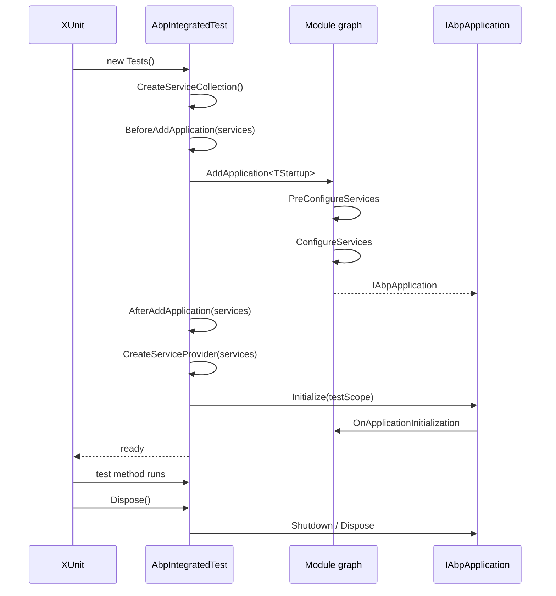

`Volo.Abp.TestBase` is the cornerstone of every integration test in the ABP framework. Six files, two abstract base classes, one helper module — and the entire test stack of `Volo.Abp.Auditing.Tests`, `Volo.Abp.Identity.Domain.Tests`, `Volo.Abp.MongoDB.Tests`, etc. derives from them. Reading the source is the fastest way to understand the **lifecycle hooks** you can override when writing your own tests: `BeforeAddApplication`, `SetAbpApplicationCreationOptions`, `AfterAddApplication`, and `CreateServiceProvider`.

## Package layout

```text framework/src/Volo.Abp.TestBase/
Properties/AssemblyInfo.cs
Volo/Abp/
  AbpTestBaseModule.cs
  AbpTestBaseWithServiceProvider.cs
Volo/Abp/Testing/
  AbpAsyncIntegratedTest.cs
  AbpIntegratedTest.cs
Volo/Abp/Testing/Utils/
  ITestCounter.cs
  TestCounter.cs
```

Six C# files. Notably **no Shouldly dependency** — that lives in `framework/test/AbpTestBase` (not a shipped package). Shouldly extension patterns are covered in [TestBase with Shouldly](/framework/testing/test-base-shouldly).

## Key abstractions

| Type | Role |
|------|------|
| `AbpTestBaseWithServiceProvider` | Holds `IServiceProvider` and exposes `GetService<T>()` / `GetRequiredService<T>()`. The bottom of the inheritance chain. |
| `AbpIntegratedTest<TStartupModule>` | Sync constructor builds an `IAbpApplication`, initializes it, exposes scoped services. `IDisposable`. |
| `AbpAsyncIntegratedTest<TStartupModule>` | xUnit `IAsyncLifetime`-style: `InitializeAsync` / `DisposeAsync` for async module init. |
| `AbpTestBaseModule` | Empty module — a marker for the testing assembly. |
| `ITestCounter` / `TestCounter` | Counter helper used by some internal tests; not generally important. |

## The sync base

```csharp framework/src/Volo.Abp.TestBase/Volo/Abp/Testing/AbpIntegratedTest.cs
public abstract class AbpIntegratedTest<TStartupModule> : AbpTestBaseWithServiceProvider, IDisposable
    where TStartupModule : IAbpModule
{
    protected IAbpApplication Application { get; }
    protected IServiceProvider RootServiceProvider { get; }
    protected IServiceScope TestServiceScope { get; }

    protected AbpIntegratedTest()
    {
        var services = CreateServiceCollection();
        BeforeAddApplication(services);

        var application = services.AddApplication<TStartupModule>(SetAbpApplicationCreationOptions);
        Application = application;

        AfterAddApplication(services);

        RootServiceProvider = CreateServiceProvider(services);
        TestServiceScope = RootServiceProvider.CreateScope();

        application.Initialize(TestServiceScope.ServiceProvider);
        ServiceProvider = Application.ServiceProvider;
    }

    protected virtual IServiceCollection CreateServiceCollection()
        => new ServiceCollection();

    protected virtual void BeforeAddApplication(IServiceCollection services) { }

    protected virtual void SetAbpApplicationCreationOptions(AbpApplicationCreationOptions options) { }

    protected virtual void AfterAddApplication(IServiceCollection services) { }

    protected virtual IServiceProvider CreateServiceProvider(IServiceCollection services)
        => services.BuildServiceProviderFromFactory();

    public virtual void Dispose()
    {
        Application.Shutdown();
        TestServiceScope.Dispose();
        Application.Dispose();
    }
}
```

Read it as a fixed sequence:

1. **`CreateServiceCollection()`** — fresh `ServiceCollection`. Override to pre-populate (e.g., add a mock `IClock`).
2. **`BeforeAddApplication(services)`** — register extra services. The application has not been added yet, so module discovery hasn't run.
3. **`services.AddApplication<TStartupModule>(SetAbpApplicationCreationOptions)`** — this is the heavy step: discover module graph, call `PreConfigureServices` and `ConfigureServices` on every module.
4. **`AfterAddApplication(services)`** — last chance to override module-registered services *before* the provider is built. `services.Replace(...)` and `services.Remove(...)` work here.
5. **`CreateServiceProvider(services)`** — by default `BuildServiceProviderFromFactory()` honors the Autofac (or default) factory configured via `AbpApplicationCreationOptions.UseAutofac()`.
6. **`application.Initialize(TestServiceScope.ServiceProvider)`** — calls `OnApplicationInitialization` on every module within a test scope. `ServiceProvider` (inherited) now points at the application's root.

Disposal runs in reverse: shutdown the application, dispose the test scope, dispose the application.

## The async base

```csharp framework/src/Volo.Abp.TestBase/Volo/Abp/Testing/AbpAsyncIntegratedTest.cs
public class AbpAsyncIntegratedTest<TStartupModule> : AbpTestBaseWithServiceProvider
    where TStartupModule : IAbpModule
{
    public virtual async Task InitializeAsync()
    {
        var services = await CreateServiceCollectionAsync();
        await BeforeAddApplicationAsync(services);
        var application = await services.AddApplicationAsync<TStartupModule>(
            await SetAbpApplicationCreationOptionsAsync());
        await AfterAddApplicationAsync(services);

        RootServiceProvider = await CreateServiceProviderAsync(services);
        TestServiceScope = RootServiceProvider.CreateScope();
        await application.InitializeAsync(TestServiceScope.ServiceProvider);
        ServiceProvider = application.ServiceProvider;
        Application = application;

        await InitializeServicesAsync();
    }

    public virtual async Task DisposeAsync()
    {
        await Application.ShutdownAsync();
        TestServiceScope.Dispose();
        Application.Dispose();
    }

    // CreateServiceCollectionAsync, BeforeAddApplicationAsync, SetAbpApplicationCreationOptionsAsync,
    // AfterAddApplicationAsync, CreateServiceProviderAsync, InitializeServicesAsync
}
```

Two things distinguish the async base:

- It does **not** implement `IDisposable` or `IAsyncDisposable` — by convention you pair it with xUnit's `IAsyncLifetime` to get `InitializeAsync`/`DisposeAsync` calls.
- It has an extra hook `InitializeServicesAsync` that runs **after** the application is initialized — the right place to seed data through application services that need the running app.

## The shared base

```csharp framework/src/Volo.Abp.TestBase/Volo/Abp/AbpTestBaseWithServiceProvider.cs
public abstract class AbpTestBaseWithServiceProvider
{
    protected IServiceProvider ServiceProvider { get; set; } = default!;

    protected virtual T? GetService<T>()
        => ServiceProvider.GetService<T>();

    protected virtual T GetRequiredService<T>() where T : notnull
        => ServiceProvider.GetRequiredService<T>();
}
```

Trivially small — the actual service lookups go through `IServiceProvider.GetRequiredService<T>()` on the *application root* provider, not the test scope. That's important: services resolved this way share a single scope across the lifetime of the test class.

## Constructing a test class

Define a startup module that declares the modules you want under test plus any in-memory infrastructure:

```csharp
[DependsOn(
    typeof(AbpTestBaseModule),
    typeof(AbpAutofacModule),
    typeof(MyDomainModule),
    typeof(MyEntityFrameworkCoreModule)
)]
public class MyDomainTestModule : AbpModule
{
    public override void ConfigureServices(ServiceConfigurationContext context)
    {
        context.Services.AddAlwaysAllowAuthorization();

        Configure<AbpDbContextOptions>(options =>
        {
            options.Configure(c =>
            {
                c.DbContextOptions.UseInMemoryDatabase(Guid.NewGuid().ToString());
            });
        });
    }
}
```

Then a test base that wires the application creation options:

```csharp
public abstract class MyDomainTestBase : AbpIntegratedTest<MyDomainTestModule>
{
    protected override void SetAbpApplicationCreationOptions(AbpApplicationCreationOptions options)
    {
        options.UseAutofac();
    }
}
```

And finally an actual test class:

```csharp
public class BookAppService_Tests : MyDomainTestBase
{
    private readonly IBookAppService _bookAppService;

    public BookAppService_Tests()
    {
        _bookAppService = GetRequiredService<IBookAppService>();
    }

    [Fact]
    public async Task Should_Get_Books()
    {
        var result = await _bookAppService.GetListAsync(new GetBooksInput());
        result.TotalCount.ShouldBeGreaterThan(0);
    }
}
```

Every test class is one xUnit test fixture — xUnit instantiates the class once per test method, so `MyDomainTestBase`'s constructor runs once per test. That's expensive but isolates state between tests; share a database file or use `IClassFixture<>` if you need broader sharing.

## Lifecycle diagram



## Async variant in xUnit

```csharp
public abstract class MyDomainAsyncTestBase
    : AbpAsyncIntegratedTest<MyDomainTestModule>, IAsyncLifetime
{
    protected override Task<Action<AbpApplicationCreationOptions>> SetAbpApplicationCreationOptionsAsync()
    {
        return Task.FromResult<Action<AbpApplicationCreationOptions>>(o => o.UseAutofac());
    }

    protected override async Task InitializeServicesAsync()
    {
        var seeder = GetRequiredService<IDataSeeder>();
        await seeder.SeedAsync(new DataSeedContext());
    }
}
```

`IAsyncLifetime` is implemented by the base, but you must depend on `Xunit.Extensions.AssemblyFixture` or the standard `Xunit.IAsyncLifetime` interface in your test project. xUnit will call `InitializeAsync` after the constructor and `DisposeAsync` before disposing the instance.

## Test isolation patterns

- **Per-test database** — use `Guid.NewGuid().ToString()` for the in-memory database name (as above), or a SQLite `:memory:` connection that the test base creates.
- **Always-allow authorization** — register `IAuthorizationService` as `AlwaysAllowAuthorizationService` so `[Authorize]` on application services doesn't reject calls. `Volo.Abp.Authorization.AddAlwaysAllowAuthorization()` does this.
- **WithCurrentUser** — use `ICurrentUser` mocks or call `CurrentUser.Use(...)` (where supported) to simulate logged-in users.

## Gotchas

<Warning>
  `AfterAddApplication(services)` runs **after** module `ConfigureServices` but **before** the provider is built. This is the only window where you can `services.Replace(ServiceDescriptor.Transient<IFoo, MockFoo>())` and have it win over module registrations.
</Warning>

<Warning>
  The sync `AbpIntegratedTest` constructor runs synchronously — any async work (data seeding, distributed cache warm-up) must happen in the test method or use the async variant. Calling `.Result` on async code in the constructor will deadlock under `xunit.runner.visualstudio`'s synchronization context.
</Warning>

<Warning>
  `CreateServiceProvider` returns `services.BuildServiceProviderFromFactory()` — this honors whichever DI factory `AbpApplicationCreationOptions.UseAutofac()` (or similar) registered. If you forget `UseAutofac()`, interceptors registered by modules silently fail to wire up.
</Warning>

<Note>
  `Application.ServiceProvider` is the application root provider, not the test scope. Anything you resolve in a test method via `GetRequiredService` shares the same lifetime. For per-method scopes, call `ServiceProvider.CreateScope()` inside the test.
</Note>

## Cross-links

<CardGroup cols={2}>
  <Card title="Shouldly patterns" icon="check-double" href="/framework/testing/test-base-shouldly">
    ServiceCollection assertions and Shouldly idioms.
  </Card>
  <Card title="Module lifecycle" icon="layer-group" href="/framework/core/modules">
    PreConfigureServices, ConfigureServices, OnApplicationInitialization.
  </Card>
  <Card title="DI registrars" icon="puzzle-piece" href="/framework/di/registration">
    Conventional registration that AddApplication discovers.
  </Card>
  <Card title="SMS test example" icon="comment-sms" href="/framework/messaging/sms">
    Real test pattern using AbpIntegratedTest&lt;T&gt;.
  </Card>
</CardGroup>
