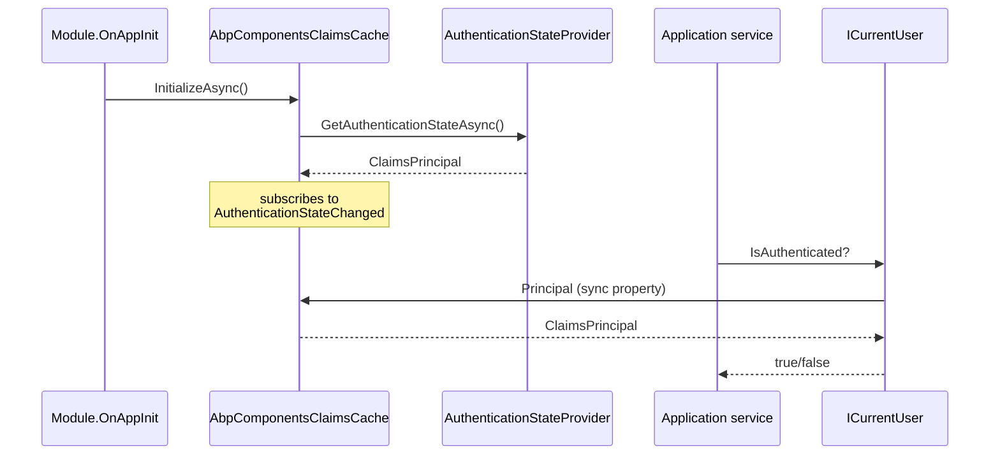

Authentication in an ABP Blazor app crosses three layers: the ASP.NET Core `AuthenticationStateProvider` (push-based), `AbpComponentsClaimsCache` (per-circuit/per-host pull-based cache), and `CurrentPrincipalAccessorBase` (the synchronous accessor that application services and `ICurrentUser` read from). This page walks through how a cookie or OIDC sign-in ends up answering `CurrentUser.IsAuthenticated == true` inside an application service called from a Blazor page — and what differs between Server, WebAssembly, and MAUI.

## The principal cache

```csharp framework/src/Volo.Abp.AspNetCore.Components.Web/Security/AbpComponentsClaimsCache.cs
public class AbpComponentsClaimsCache : IScopedDependency
{
    public ClaimsPrincipal Principal { get; private set; } = default!;

    private readonly AuthenticationStateProvider? _authenticationStateProvider;

    public AbpComponentsClaimsCache(IClientScopeServiceProviderAccessor serviceProviderAccessor)
    {
        _authenticationStateProvider = serviceProviderAccessor.ServiceProvider
            .GetService<AuthenticationStateProvider>();
        if (_authenticationStateProvider != null)
        {
            _authenticationStateProvider.AuthenticationStateChanged += async (task) =>
            {
                Principal = (await task).User;
            };
        }
    }

    public virtual async Task InitializeAsync()
    {
        if (_authenticationStateProvider != null)
        {
            var authenticationState = await _authenticationStateProvider.GetAuthenticationStateAsync();
            Principal = authenticationState.User;
        }
    }
}
```

The cache:

- Subscribes once to `AuthenticationStateChanged` and reads the new principal from the task argument.
- Holds the principal as a synchronous property — usable from any non-async code path.
- Is **scoped**, sourced from `IClientScopeServiceProviderAccessor.ServiceProvider`, so each circuit (Server) or host scope (Wasm/MAUI) has its own.

## The current-principal accessor

ABP's `ICurrentPrincipalAccessor` is what every internal service reads — `ICurrentUser`, audit logging, multi-tenancy. For Blazor it derives from `CurrentPrincipalAccessorBase` and reads the cache:

```csharp framework/src/Volo.Abp.AspNetCore.Components.MauiBlazor/MauiBlazorCurrentPrincipalAccessor.cs
public class MauiBlazorCurrentPrincipalAccessor : CurrentPrincipalAccessorBase, ITransientDependency
{
    private AbpComponentsClaimsCache ClaimsCache { get; }

    public MauiBlazorCurrentPrincipalAccessor(
        IClientScopeServiceProviderAccessor clientScopeServiceProviderAccessor)
    {
        ClaimsCache = clientScopeServiceProviderAccessor.ServiceProvider
            .GetRequiredService<AbpComponentsClaimsCache>();
    }

    protected override ClaimsPrincipal GetClaimsPrincipal()
    {
        return ClaimsCache.Principal;
    }
}
```

`WebAssemblyCurrentPrincipalAccessor` is structurally identical. On Blazor **Server**, the in-process MVC `HttpContextAccessor`-backed principal accessor remains the default because the SignalR hub has access to `HttpContext`.

## Initialization order



If you forget to call `InitializeAsync` (custom host) `Principal` will be the unauthenticated default and audit/permission checks misfire silently.

## Blazor Server cookie + OIDC

Blazor Server typically authenticates with a cookie scheme remote-signed-in by OIDC (the BFF pattern). The module configures the cookie/OIDC chain in your host's `Program.cs`:

```csharp
services.AddAuthentication(options =>
    {
        options.DefaultScheme = "Cookies";
        options.DefaultChallengeScheme = "oidc";
    })
    .AddCookie("Cookies", options =>
    {
        options.ExpireTimeSpan = TimeSpan.FromDays(30);
        options.SlidingExpiration = true;
        options.IntrospectAccessToken("oidc"); // see below
    })
    .AddAbpOpenIdConnect("oidc", options =>
    {
        options.Authority = configuration["AuthServer:Authority"];
        options.ClientId = configuration["AuthServer:ClientId"];
        options.ClientSecret = configuration["AuthServer:ClientSecret"];
        options.ResponseType = "code";
        options.SaveTokens = true;
        options.GetClaimsFromUserInfoEndpoint = true;
        options.Scope.Add("role");
        options.Scope.Add("email");
        options.Scope.Add("phone");
        options.Scope.Add("MyApp");
    });
```

## Access-token introspection

`Volo.Abp.AspNetCore.Components.Server` ships an extension that re-validates the cookie's stored `access_token` via the authority's introspection endpoint on every request:

```csharp framework/src/Volo.Abp.AspNetCore.Components.Server/Microsoft/AspNetCore/Authentication/Cookies/CookieAuthenticationOptionsExtensions.cs
public static CookieAuthenticationOptions IntrospectAccessToken(
    this CookieAuthenticationOptions options, string oidcAuthenticationScheme = "oidc")
{
    options.Events.OnValidatePrincipal = async principalContext =>
    {
        var accessToken = principalContext.Properties.GetTokenValue("access_token");
        if (!accessToken.IsNullOrWhiteSpace())
        {
            var openIdConnectOptions = await GetOpenIdConnectOptions(principalContext, oidcAuthenticationScheme);
            var response = await openIdConnectOptions.Backchannel.IntrospectTokenAsync(
                new TokenIntrospectionRequest
                {
                    Address = openIdConnectOptions.Configuration?.IntrospectionEndpoint
                              ?? openIdConnectOptions.Authority!.EnsureEndsWith('/') + "connect/introspect",
                    ClientId = openIdConnectOptions.ClientId,
                    ClientSecret = openIdConnectOptions.ClientSecret,
                    Token = accessToken
                });

            if (response.IsError || !response.IsActive)
            {
                principalContext.RejectPrincipal();
                await principalContext.HttpContext.SignOutAsync(principalContext.Scheme.Name);
            }
        }
        else
        {
            logger.LogError("The access_token is not found in the cookie properties, "
                + "Please make sure SaveTokens of OpenIdConnectOptions is set as true.");
            await SignOutAsync(principalContext);
        }
    };

    return options;
}
```

The contract:

- Requires `OpenIdConnectOptions.SaveTokens = true`. Without it the cookie has no `access_token` claim and every request signs the user out.
- Runs on every cookie validation (default every request, or every 30 minutes if you configure `CookieAuthenticationOptions.Events.OnValidatePrincipal` with sliding).
- Costs one HTTP request to the authority per validation — pair with a sensible `CookieAuthenticationOptions.ExpireTimeSpan` and consider a shorter validation interval rather than per-request validation in high-traffic apps.

## Blazor WebAssembly

WebAssembly uses `Microsoft.AspNetCore.Components.WebAssembly.Authentication` — typically OIDC with PKCE against the same authority. The `RemoteAuthenticationService` exposes an `AuthenticationStateProvider` and `AbpComponentsClaimsCache` listens to it without code changes. Access tokens are attached to outgoing HTTP calls by the proxy generator's authentication handler (not `AbpBlazorClientHttpMessageHandler`, which only adds anti-forgery and language).

## MAUI Blazor

MAUI typically authenticates by opening a `WebAuthenticator` browser tab against the authority, receiving the authorization code, exchanging it for tokens, and stashing them in `SecureStorage`. The token-attaching handler reads the stored access token on each call. `AbpComponentsClaimsCache` is fed by a custom `AuthenticationStateProvider` that builds a `ClaimsPrincipal` from the decoded id_token.

## Verifying access end-to-end

```razor
@inherits AbpComponentBase
@attribute [Authorize]

<h3>Hello @CurrentUser.UserName</h3>

@if (await AuthorizationService.IsGrantedAsync("MyApp.Books.Create"))
{
    <Button Color="Color.Primary" Clicked="CreateAsync">Create</Button>
}

@code {
    private async Task CreateAsync()
    {
        await AppService.CreateAsync(new CreateBookDto());
    }
}
```

`[Authorize]` is the standard Blazor attribute — the router uses `AuthorizeRouteView` to redirect unauthenticated users to the configured login page. `AuthorizationService.IsGrantedAsync` reads the cached granted policies (refreshed via `ApplicationConfigurationChangedService` when permissions change server-side).

## Gotchas

<Warning>
  Do **not** read `AuthenticationStateProvider.GetAuthenticationStateAsync()` from inside a synchronous code path on the hot path — it allocates and can re-fetch on Wasm. Use `CurrentUser` (which reads the cache) instead.
</Warning>

<Warning>
  `AbpComponentsClaimsCache.InitializeAsync()` must run before the first time a service reads `CurrentUser`. The host modules call it in `OnApplicationInitializationAsync`; if you call into ABP services from a hand-rolled `Program.cs` before `InitializeAsync`, you'll see an unauthenticated principal.
</Warning>

<Warning>
  `IntrospectAccessToken` swallows logger output via `ILogger<CookieAuthenticationOptions>` — make sure the category is included in your logger filter, otherwise sign-outs due to introspection failures will look mysterious.
</Warning>

<Note>
  On Blazor Server in tiered mode (Blazor host ≠ API), the Blazor host carries the cookie; outgoing calls to the API attach a bearer token from the cookie's `access_token` via the proxy client authenticator. The introspection extension protects the cookie itself, not the bearer attachment.
</Note>

## Cross-links

<CardGroup cols={2}>
  <Card title="Server circuits" icon="bolt" href="/framework/ui-blazor/blazor-server-circuits">
    Per-circuit claims cache scoping.
  </Card>
  <Card title="Server & SignalR" icon="bolt" href="/framework/ui-blazor/blazor-server-signalr">
    Where IntrospectAccessToken lives.
  </Card>
  <Card title="MAUI Blazor" icon="mobile" href="/framework/ui-blazor/blazor-mauiblazor">
    SecureStorage-backed token handling.
  </Card>
  <Card title="AbpComponentBase" icon="puzzle-piece" href="/framework/ui-blazor/blazor">
    CurrentUser/CurrentTenant on every component.
  </Card>
</CardGroup>
