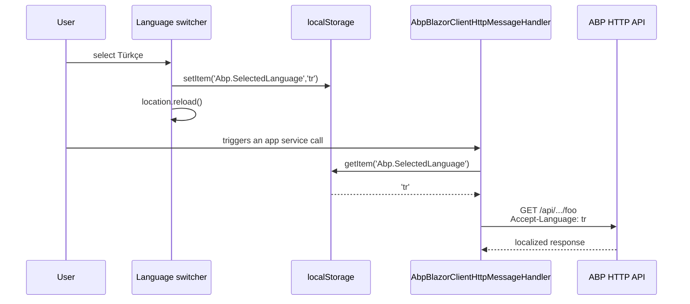

ABP's Blazor localization story builds on three things that already exist in ASP.NET Core: `IStringLocalizer`, `IStringLocalizerFactory`, and `CultureInfo.CurrentUICulture`. What's distinctive is *where* the culture comes from in a Blazor app, *how* a resource type is bound to a component, and *how* the chosen language is propagated to remote service calls. This page walks through each end of that chain.

## The `L` property

```csharp framework/src/Volo.Abp.AspNetCore.Components/AbpComponentBase.cs
protected IStringLocalizer L {
    get {
        if (_localizer == null)
        {
            _localizer = CreateLocalizer();
        }
        return _localizer;
    }
}

protected Type? LocalizationResource {
    get => _localizationResource;
    set {
        _localizationResource = value;
        _localizer = null;
    }
}
private Type? _localizationResource = typeof(DefaultResource);

protected virtual IStringLocalizer CreateLocalizer()
{
    if (LocalizationResource != null)
    {
        return StringLocalizerFactory.Create(LocalizationResource);
    }

    var localizer = StringLocalizerFactory.CreateDefaultOrNull();
    if (localizer == null)
    {
        throw new AbpException(
            $"Set {nameof(LocalizationResource)} or define the default localization resource "
            + $"type to be able to use the {nameof(L)} object!");
    }

    return localizer;
}
```

Three rules to internalize:

1. **Default resource** — every component starts pointing at `typeof(DefaultResource)`. If you've configured `AbpLocalizationOptions.DefaultResourceType = typeof(MyModuleResource)`, you can leave `L` alone and get keys from that resource.
2. **Override at component level** — assign `LocalizationResource = typeof(MyFeatureResource);` in `OnInitialized` (or in `@code { ... }`) to bind a specific resource. The setter resets the cached localizer.
3. **Throws if nothing is configured** — `CreateDefaultOrNull` returning null is fatal. You'll get a clear `AbpException` telling you to configure the default resource type, not a silent fallback to keys.

## Binding a resource type to a component

```razor
@inherits AbpComponentBase

<h3>@L["WelcomeMessage"]</h3>

@code {
    protected override void OnInitialized()
    {
        LocalizationResource = typeof(MyFeatureResource);
    }
}
```

For pages used across an ABP module it's idiomatic to derive a *module-specific* component base that hardcodes the resource:

```csharp
public abstract class MyFeatureComponentBase : AbpComponentBase
{
    protected MyFeatureComponentBase()
    {
        LocalizationResource = typeof(MyFeatureResource);
    }
}
```

Then every `@inherits MyFeatureComponentBase` gets the right localizer without per-component plumbing.

## Localizing validation messages

`AbpBlazorMessageLocalizerHelper<T>` is the helper Blazorise validators call to localize messages:

```csharp framework/src/Volo.Abp.AspNetCore.Components.Web/AbpBlazorMessageLocalizerHelper.cs
public string Localize(string message, IEnumerable<string>? arguments)
{
    try
    {
        return arguments?.Count() > 0
            ? stringLocalizer[message, LocalizeMessageArguments(arguments)?.ToArray()!]
            : stringLocalizer[message];
    }
    catch
    {
        return stringLocalizer[message];
    }
}

private IEnumerable<string> LocalizeMessageArguments(IEnumerable<string> arguments)
{
    foreach (var argument in arguments)
    {
        // first try to localize with "DisplayName:{Name}"
        var localization = stringLocalizer[$"DisplayName:{argument}"];

        if (localization.ResourceNotFound)
        {
            // then try to localize with just "{Name}"
            localization = stringLocalizer[argument];
        }

        yield return localization;
    }
}
```

The two-pass argument lookup means you can keep a clean `DisplayName:` namespace in your resource files:

```json
{
  "DisplayName:Name": "Product name",
  "DisplayName:Quantity": "Quantity in stock",
  "ThisFieldIsRequired:{0}": "The {0} field is required."
}
```

A validation message `ThisFieldIsRequired:{0}` argument `Name` resolves as `"The Product name field is required."` even though no plain `Name` key exists.

## Persisting the user's choice

The language switcher in LeptonX/Basic theme writes the chosen culture name to `localStorage`:

```js
// abp.utils.setCookieValue('.AspNetCore.Culture', ...)
localStorage.setItem('Abp.SelectedLanguage', 'tr');
location.reload(); // re-negotiate circuit / re-render Wasm app
```

For Blazor Server, a server-side `SetLanguage` MVC endpoint typically writes both the cookie and a header so the next negotiate carries the culture. For WebAssembly and MAUI, `localStorage` is the source of truth that the HTTP handler reads.

## The Accept-Language flow



For MAUI, `IMauiBlazorSelectedLanguageProvider` replaces `localStorage` — see [MAUI Blazor](/framework/ui-blazor/blazor-mauiblazor#picking-a-language).

## Initial culture from the application configuration

At application initialization, every Blazor host fetches `/api/abp/application-configuration` and reads the configured current culture:

```csharp
// MauiBlazor module & WebAssembly module, identical pattern
var configuration = await configurationClient.GetAsync();
var cultureName = configuration.Localization?.CurrentCulture?.CultureName;
if (!cultureName.IsNullOrEmpty())
{
    var culture = new CultureInfo(cultureName!);
    CultureInfo.DefaultThreadCurrentCulture = culture;
    CultureInfo.DefaultThreadCurrentUICulture = culture;
}

if (CultureInfo.CurrentUICulture.TextInfo.IsRightToLeft)
{
    await utilsService.AddClassToTagAsync("body", "rtl");
}
```

The RTL line means that switching to Arabic/Hebrew automatically adds an `rtl` class to `<body>` so theme CSS can mirror the layout.

## Resource type pattern

A typical ABP module localization resource:

```csharp
[LocalizationResourceName("MyFeature")]
public class MyFeatureResource
{
}
```

Registered in the module's `ConfigureServices`:

```csharp
Configure<AbpLocalizationOptions>(options =>
{
    options.Resources
        .Add<MyFeatureResource>("en")
        .AddVirtualJson("/Localization/MyFeature");
});

Configure<AbpVirtualFileSystemOptions>(options =>
{
    options.FileSets.AddEmbedded<MyFeatureModule>();
});
```

JSON resource files in the embedded `Localization/MyFeature/` folder name themselves `en.json`, `tr.json`, etc. The `IStringLocalizer<MyFeatureResource>` returned by `StringLocalizerFactory.Create(typeof(MyFeatureResource))` reads from them.

## Mixing resources inside one component

If a page needs strings from multiple resources, resolve additional localizers on demand:

```csharp
@inherits AbpComponentBase
@inject IStringLocalizerFactory LocalizerFactory

@code {
    private IStringLocalizer Shared = null!;

    protected override void OnInitialized()
    {
        LocalizationResource = typeof(MyFeatureResource);
        Shared = LocalizerFactory.Create(typeof(AbpUiResource));
    }
}
```

`Shared["Save"]` reads from `AbpUiResource`; `L["WelcomeMessage"]` reads from your module's resource.

## Gotchas

<Warning>
  Setting `LocalizationResource` after the first read of `L` does invalidate the cached localizer (the setter nulls `_localizer`) but **does not** force `StateHasChanged`. Set it in `OnInitialized` before the first render, or call `StateHasChanged()` after assigning.
</Warning>

<Warning>
  In tiered mode the API may serve a different default culture than the Blazor host. The application-configuration document carries the API's current culture, which is what the host adopts on init. If you want the host culture to win, override the language provider after configuration fetch.
</Warning>

<Note>
  `DefaultResource` is the framework's catch-all marker type — it's a real class with no behavior. Configuring `AbpLocalizationOptions.DefaultResourceType` is what makes any localizer "default" instead.
</Note>

## Cross-links

<CardGroup cols={2}>
  <Card title="AbpComponentBase" icon="puzzle-piece" href="/framework/ui-blazor/blazor">
    Where L and LocalizationResource live.
  </Card>
  <Card title="Components.Web primitives" icon="layer-group" href="/framework/ui-blazor/blazor-components-web">
    AbpBlazorMessageLocalizerHelper and the HTTP handler.
  </Card>
  <Card title="MAUI Blazor" icon="mobile" href="/framework/ui-blazor/blazor-mauiblazor">
    IMauiBlazorSelectedLanguageProvider replaces localStorage.
  </Card>
  <Card title="Server circuits" icon="bolt" href="/framework/ui-blazor/blazor-server-circuits">
    Per-circuit culture and config caching.
  </Card>
</CardGroup>
