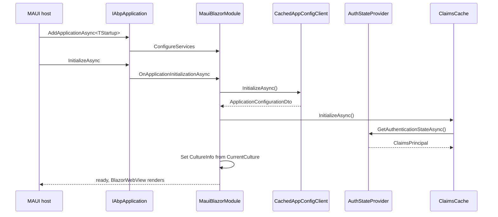

`Volo.Abp.AspNetCore.Components.MauiBlazor` is the **hybrid host** for ABP's Blazor UI: the same Razor components that run on Blazor Server and Blazor WebAssembly are mounted inside a `BlazorWebView` shipped by a .NET MAUI app. Unlike WebAssembly there is no browser, no localStorage, no static asset pipeline — everything runs in-process on the device, and every HTTP call leaves the device to talk to a remote ABP HTTP API.

This package therefore looks **structurally identical** to `Volo.Abp.AspNetCore.Components.WebAssembly` (same module dependency graph, same `OnApplicationInitializationAsync` flow) but replaces the browser-specific pieces with MAUI-friendly equivalents: a `Preferences`/secure-storage-based language provider abstraction, an in-process tenant store, and a delegating handler that does **not** rely on browser cookies for anti-forgery.

## Package layout

```text framework/src/Volo.Abp.AspNetCore.Components.MauiBlazor/
Volo/Abp/AspNetCore/Components/MauiBlazor/
  AbpAspNetCoreComponentsMauiBlazorModule.cs
  AbpMauiBlazorClientHttpMessageHandler.cs
  ApplicationConfigurationCache.cs
  IMauiBlazorSelectedLanguageProvider.cs
  MauiBlazorCachedApplicationConfigurationClient.cs
  MauiBlazorCurrentPrincipalAccessor.cs
  MauiBlazorCurrentTenantAccessor.cs
  MauiBlazorRemoteTenantStore.cs
  MauiBlazorServerUrlProvider.cs
  NullMauiBlazorSelectedLanguageProvider.cs
```

Ten C# files, no Razor, no JS, no static assets — the *theme* lives in the sibling `Volo.Abp.AspNetCore.Components.MauiBlazor.Theming` package and the cross-host UI primitives live in `Volo.Abp.AspNetCore.Components.Web`.

## Key abstractions

| Type | Role |
|------|------|
| `AbpAspNetCoreComponentsMauiBlazorModule` | Depends on `AbpAspNetCoreMvcClientCommonModule`, `AbpUiModule`, `AbpAspNetCoreComponentsWebModule`. Registers the delegating handler and warms caches in `OnApplicationInitializationAsync`. |
| `AbpMauiBlazorClientHttpMessageHandler` | `DelegatingHandler` added to every typed proxy client; drives `IUiPageProgressService` and stamps the `Accept-Language` header. |
| `IMauiBlazorSelectedLanguageProvider` | One-method abstraction returning the user-selected culture; implement against MAUI `Preferences` or `SecureStorage`. |
| `NullMauiBlazorSelectedLanguageProvider` | Default no-op implementation — language stays at the device default until you replace it. |
| `MauiBlazorCurrentPrincipalAccessor` | Reads the `ClaimsPrincipal` from `AbpComponentsClaimsCache`, which itself listens to `AuthenticationStateProvider`. |
| `MauiBlazorCurrentTenantAccessor` | Singleton holder of `BasicTenantInfo` — there is no HTTP context, so the tenant lives in process. |
| `MauiBlazorRemoteTenantStore` | Calls `AbpTenantClientProxy` and caches results in `IDistributedCache<TenantConfiguration>` for 5 minutes. |
| `MauiBlazorServerUrlProvider` | Resolves the remote API base URL from `IRemoteServiceConfigurationProvider`, ensuring a trailing slash. |
| `MauiBlazorCachedApplicationConfigurationClient` | Pulls `/api/abp/application-configuration` once at startup and on demand. |

## Module bootstrap

The module mirrors the WebAssembly module almost line for line — same dependencies, same initialization order:

```csharp framework/src/Volo.Abp.AspNetCore.Components.MauiBlazor/AbpAspNetCoreComponentsMauiBlazorModule.cs
[DependsOn(
    typeof(AbpAspNetCoreMvcClientCommonModule),
    typeof(AbpUiModule),
    typeof(AbpAspNetCoreComponentsWebModule)
)]
public class AbpAspNetCoreComponentsMauiBlazorModule : AbpModule
{
    public override void PreConfigureServices(ServiceConfigurationContext context)
    {
        PreConfigure<AbpHttpClientBuilderOptions>(options =>
        {
            options.ProxyClientBuildActions.Add((_, builder) =>
            {
                builder.AddHttpMessageHandler<AbpMauiBlazorClientHttpMessageHandler>();
            });
        });
    }

    public async override Task OnApplicationInitializationAsync(ApplicationInitializationContext context)
    {
        await context.ServiceProvider
            .GetRequiredService<IClientScopeServiceProviderAccessor>().ServiceProvider
            .GetRequiredService<MauiBlazorCachedApplicationConfigurationClient>().InitializeAsync();

        await context.ServiceProvider
            .GetRequiredService<IClientScopeServiceProviderAccessor>().ServiceProvider
            .GetRequiredService<AbpComponentsClaimsCache>().InitializeAsync();

        await SetCurrentLanguageAsync(context.ServiceProvider);
    }
}
```

`PreConfigureServices` runs before any module's `ConfigureServices`, which is exactly when proxy client builders need to be amended — the handler must be registered on the same `IHttpClientBuilder` that `AbpHttpClientModule` creates for each typed client.

`OnApplicationInitializationAsync` then does three things in order:

1. Fetch the application-configuration document (features, settings, granted policies, current culture) and cache it.
2. Initialize `AbpComponentsClaimsCache` — this subscribes to `AuthenticationStateProvider.AuthenticationStateChanged` and seeds the current `ClaimsPrincipal`.
3. Read `Localization.CurrentCulture.CultureName` from the cached configuration and set `CultureInfo.DefaultThreadCurrentCulture` / `DefaultThreadCurrentUICulture`. If the resolved culture is RTL it also appends `rtl` to the `<body>` tag through `IAbpUtilsService`.

## The HTTP message handler

Every typed client proxy generated by ABP runs through `AbpMauiBlazorClientHttpMessageHandler`:

```csharp framework/src/Volo.Abp.AspNetCore.Components.MauiBlazor/AbpMauiBlazorClientHttpMessageHandler.cs
public class AbpMauiBlazorClientHttpMessageHandler : DelegatingHandler, ITransientDependency
{
    public AbpMauiBlazorClientHttpMessageHandler(
        IClientScopeServiceProviderAccessor clientScopeServiceProviderAccessor,
        IMauiBlazorSelectedLanguageProvider mauiBlazorSelectedLanguageProvider)
    {
        _mauiBlazorSelectedLanguageProvider = mauiBlazorSelectedLanguageProvider;
        _uiPageProgressService = clientScopeServiceProviderAccessor.ServiceProvider
            .GetRequiredService<IUiPageProgressService>();
    }

    protected async override Task<HttpResponseMessage> SendAsync(
        HttpRequestMessage request, CancellationToken cancellationToken)
    {
        try
        {
            await _uiPageProgressService.Go(null, options => options.Type = UiPageProgressType.Info);
            await SetLanguageAsync(request);
            return await base.SendAsync(request, cancellationToken);
        }
        finally
        {
            await _uiPageProgressService.Go(-1);
        }
    }
}
```

Compared with the WebAssembly variant (`AbpBlazorClientHttpMessageHandler`) this handler:

- **Does not** call `localStorage.getItem("Abp.SelectedLanguage")` — there is no `IJSRuntime` localStorage in a MAUI BlazorWebView reliably accessible cross-platform; instead it delegates to `IMauiBlazorSelectedLanguageProvider`.
- **Does not** read the `XSRF-TOKEN` cookie — anti-forgery is a server-side concern, and the MAUI client typically authenticates with a bearer token, not a cookie session.

## Picking a language

`IMauiBlazorSelectedLanguageProvider` is intentionally minimal:

```csharp framework/src/Volo.Abp.AspNetCore.Components.MauiBlazor/IMauiBlazorSelectedLanguageProvider.cs
public interface IMauiBlazorSelectedLanguageProvider
{
    Task<string?> GetSelectedLanguageAsync();
}
```

The shipped default does nothing:

```csharp framework/src/Volo.Abp.AspNetCore.Components.MauiBlazor/NullMauiBlazorSelectedLanguageProvider.cs
public class NullMauiBlazorSelectedLanguageProvider
    : IMauiBlazorSelectedLanguageProvider, ITransientDependency
{
    public Task<string?> GetSelectedLanguageAsync() => Task.FromResult((string?)null);
}
```

You provide your own implementation backed by `Microsoft.Maui.Storage.Preferences`:

```csharp
[Dependency(ReplaceServices = true)]
public class PreferencesLanguageProvider
    : IMauiBlazorSelectedLanguageProvider, ITransientDependency
{
    public Task<string?> GetSelectedLanguageAsync()
        => Task.FromResult(Preferences.Get("AbpSelectedLanguage", (string?)null));
}
```

Then any UI control that lets the user switch language writes the same key back: `Preferences.Set("AbpSelectedLanguage", "tr")`. Next HTTP call carries `Accept-Language: tr`.

## Multi-tenancy

The tenant accessor is a singleton — there is exactly one current tenant in a MAUI process at a time:

```csharp framework/src/Volo.Abp.AspNetCore.Components.MauiBlazor/MauiBlazorCurrentTenantAccessor.cs
[Dependency(ReplaceServices = true)]
public class MauiBlazorCurrentTenantAccessor : ICurrentTenantAccessor, ISingletonDependency
{
    public BasicTenantInfo? Current { get; set; }
}
```

The tenant store calls the remote `AbpTenantClientProxy` and caches lookups for 5 minutes in `IDistributedCache<TenantConfiguration>`:

```csharp framework/src/Volo.Abp.AspNetCore.Components.MauiBlazor/MauiBlazorRemoteTenantStore.cs
public async Task<TenantConfiguration?> FindAsync(string name)
{
    var cacheKey = CreateCacheKey(name);
    var tenantConfiguration = await Cache.GetOrAddAsync(
        cacheKey,
        async () => CreateTenantConfiguration(await TenantAppService.FindTenantByNameAsync(name))!,
        () => new DistributedCacheEntryOptions
        {
            AbsoluteExpirationRelativeToNow = TimeSpan.FromMinutes(5) //TODO: Should be configurable.
        }
    );
    return tenantConfiguration;
}
```

The `TODO` in source is real — the TTL is not yet exposed as an option in v7.4.0.

## Server URL resolution

```csharp framework/src/Volo.Abp.AspNetCore.Components.MauiBlazor/MauiBlazorServerUrlProvider.cs
public async Task<string> GetBaseUrlAsync(string? remoteServiceName = null)
{
    var remoteServiceConfiguration = await RemoteServiceConfigurationProvider
        .GetConfigurationOrDefaultAsync(
            remoteServiceName ?? RemoteServiceConfigurationDictionary.DefaultName);

    return remoteServiceConfiguration.BaseUrl.EnsureEndsWith('/');
}
```

Unlike `DefaultServerUrlProvider` (which returns `"/"`) MAUI must produce an absolute URL — every call leaves the device. Configure it in `appsettings.json` shipped with the MAUI bundle:

```json
{
  "RemoteServices": {
    "Default": { "BaseUrl": "https://api.contoso.com/" }
  }
}
```

## Initialization sequence



## Gotchas

<Warning>
  The handler in v7.4.0 does **not** stamp tenant headers (`__tenant`) — multi-tenant calls rely on `MauiBlazorCurrentTenantAccessor` being set before the client proxy resolves and on the proxy's own auth handler adding the tenant header. If you build clients outside the proxy pipeline (raw `HttpClient`) you must add the header yourself.
</Warning>

<Warning>
  `MauiBlazorRemoteTenantStore` uses a `5 minute` TTL hard-coded in source. If you change tenants frequently or a tenant is renamed, evict the `RemoteTenantStore_Name_*` / `RemoteTenantStore_Id_*` cache keys explicitly.
</Warning>

<Note>
  The MAUI module depends on `AbpAspNetCoreComponentsWebModule` (which depends on `AbpUiModule` and `AbpAspNetCoreComponentsModule`), so `AbpComponentBase`, `IUiMessageService`, `IUiNotificationService`, `IAlertManager`, `IUiPageProgressService` are all available exactly as in the other Blazor hosts.
</Note>

## Cross-links

<CardGroup cols={2}>
  <Card title="AbpComponentBase" icon="puzzle-piece" href="/framework/ui-blazor/blazor">
    The component base class every page derives from.
  </Card>
  <Card title="Blazor WebAssembly" icon="globe" href="/framework/ui-blazor/blazor-webassembly">
    Sibling host — same patterns, different infrastructure.
  </Card>
  <Card title="Components.Web primitives" icon="layer-group" href="/framework/ui-blazor/blazor-components-web">
    Where the cross-host handlers and cookie service live.
  </Card>
  <Card title="Blazor authentication" icon="key" href="/framework/ui-blazor/blazor-authentication">
    How AuthenticationStateProvider feeds the claims cache.
  </Card>
</CardGroup>
