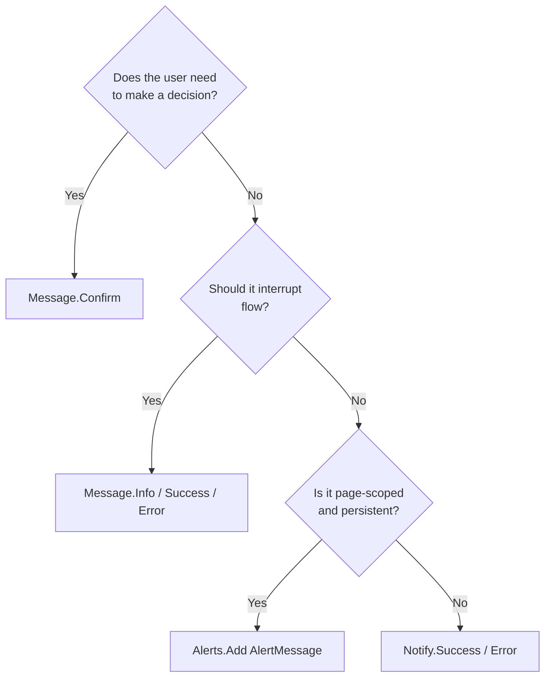

ABP exposes three layers of in-page user feedback, each with a different lifetime, modality, and rendering path:

| Layer | Interface | Modal? | Lifetime | Typical use |
|-------|-----------|--------|----------|-------------|
| **Message** | `IUiMessageService` | Yes (blocks) | Per circuit (event-driven) | Confirm before delete, success after save with OK |
| **Notification** | `IUiNotificationService` | No (toast) | Per circuit | Background success/failure toasts |
| **Alert** | `IAlertManager` | No (inline banner) | Per component | Validation summary, page-level info banner |

Knowing which to reach for is most of the battle — and they're all already wired on `AbpComponentBase` as `Message`, `Notify`, and `Alerts`.

## The three interfaces

```csharp framework/src/Volo.Abp.AspNetCore.Components/Messages/IUiMessageService.cs
public interface IUiMessageService
{
    Task Info(string message, string? title = null, Action<UiMessageOptions>? options = null);
    Task Success(string message, string? title = null, Action<UiMessageOptions>? options = null);
    Task Warn(string message, string? title = null, Action<UiMessageOptions>? options = null);
    Task Error(string message, string? title = null, Action<UiMessageOptions>? options = null);
    Task<bool> Confirm(string message, string? title = null, Action<UiMessageOptions>? options = null);
}
```

```csharp framework/src/Volo.Abp.AspNetCore.Components/Notifications/IUiNotificationService.cs
public interface IUiNotificationService
{
    Task Info(string message, string? title = null, Action<UiNotificationOptions>? options = null);
    Task Success(string message, string? title = null, Action<UiNotificationOptions>? options = null);
    Task Warn(string message, string? title = null, Action<UiNotificationOptions>? options = null);
    Task Error(string message, string? title = null, Action<UiNotificationOptions>? options = null);
}
```

```csharp framework/src/Volo.Abp.AspNetCore.Components/Alerts/IAlertManager.cs (referenced)
public interface IAlertManager
{
    AlertList Alerts { get; }
}
```

`UiNotificationOptions` keeps `OkButtonText` as `ILocalizableString?` — toasts are localized lazily because they live longer than the immediate call site. `UiMessageOptions` (modal) uses plain `string?` because the dispatch is synchronous.

## Alert types

```csharp framework/src/Volo.Abp.AspNetCore.Components/Alerts/AlertType.cs
public enum AlertType
{
    Default, Primary, Secondary, Success, Danger, Warning, Info, Light, Dark
}
```

`AlertMessage` is a small DTO:

```csharp framework/src/Volo.Abp.AspNetCore.Components/Alerts/AlertMessage.cs
public class AlertMessage
{
    public string Text { get; set; }
    public AlertType Type { get; set; }
    public string? Title { get; set; }
    public bool Dismissible { get; set; }

    public AlertMessage(AlertType type, string text, string? title = null, bool dismissible = true)
    { /* ... */ }
}
```

## How AbpComponentBase exposes them

```csharp framework/src/Volo.Abp.AspNetCore.Components/AbpComponentBase.cs
protected IUiMessageService Message  => LazyGetNonScopedRequiredService(ref _message)!;
protected IUiNotificationService Notify => LazyGetNonScopedRequiredService(ref _notify)!;
protected IAlertManager AlertManager => LazyGetNonScopedRequiredService(ref _alertManager)!;
protected AlertList Alerts => AlertManager.Alerts;
```

All three go through `LazyGetNonScopedRequiredService`. Why?

- **Message** must reach the single per-circuit modal host. If two component instances each resolved their own scoped `BlazoriseUiMessageService`, the host would only subscribe to one of them.
- **Notify** must reach the single per-circuit toast host (analogous reason).
- **AlertManager** is scoped — but you want the *host* root scope so `AbpComponentBase` instances don't each get their own empty `AlertList`. The `Alerts` shortcut hides that.

## Decision flow



## Practical patterns

### Save with success toast and error modal

```razor
@inherits AbpComponentBase

@code {
    private async Task SaveAsync()
    {
        try
        {
            await AppService.UpdateAsync(Id, Input);
            await Notify.Success(L["SavedSuccessfully"]);
        }
        catch (BusinessException ex)
        {
            await Message.Error(L[ex.Code ?? "GenericError"], L["Error"]);
        }
    }
}
```

### Confirmed delete

```razor
@inherits AbpComponentBase

@code {
    private async Task DeleteAsync(Guid id)
    {
        if (!await Message.Confirm(L["AreYouSureToDelete"], L["AreYouSure"]))
        {
            return;
        }

        await AppService.DeleteAsync(id);
        await Notify.Success(L["SuccessfullyDeleted"]);
        await GetEntitiesAsync();
    }
}
```

### Inline validation summary

```razor
@inherits AbpComponentBase

<AlertList Alerts="@Alerts" />

@code {
    private async Task ValidateAsync()
    {
        Alerts.Clear();
        if (Input.Quantity <= 0)
        {
            Alerts.Add(new AlertMessage(AlertType.Danger, L["QuantityMustBePositive"]));
        }
        if (Input.UnitPrice <= 0)
        {
            Alerts.Add(new AlertMessage(AlertType.Warning, L["UnitPriceWarning"]));
        }
    }
}
```

`<AlertList>` is provided by the LeptonX/Basic theme; it iterates `Alerts` and renders Bootstrap-style banners.

## The two notification fallbacks

The framework ships:

- **`SimpleUiMessageService`** — JS `alert`/`confirm`. Fallback when no UI theme is referenced.
- **`NullUiNotificationService`** — no-op until a theme replaces it.

```csharp framework/src/Volo.Abp.AspNetCore.Components/Notifications/NullUiNotificationService.cs (typical shape)
public class NullUiNotificationService : IUiNotificationService, ITransientDependency
{
    public Task Info(string message, string? title = null, Action<UiNotificationOptions>? options = null)
        => Task.CompletedTask;
    // ...
}
```

Adding `Volo.Abp.BlazoriseUI` (or LeptonX, which depends on it) replaces both with Blazorise-backed event dispatchers. The pattern is identical to messages: an event raised on the scoped service, a host component (`<NotificationAlert>`) subscribing once in `MainLayout`.

## UserExceptionInformer hooks into Message

`AbpComponentBase.HandleErrorAsync` calls `IUserExceptionInformer.InformAsync`, which the BlazoriseUI implementation routes through `Message.Error`:

```csharp framework/src/Volo.Abp.AspNetCore.Components/AbpComponentBase.cs
protected virtual async Task HandleErrorAsync(Exception exception)
{
    if (IsDisposed) return;
    Logger.LogException(exception);
    await InvokeAsync(async () =>
    {
        await UserExceptionInformer.InformAsync(new UserExceptionInformerContext(exception));
        StateHasChanged();
    });
}
```

This is why uncaught exceptions in event handlers produce a modal error dialog *and* a server log entry, not a silent failure.

## Gotchas

<Warning>
  `AlertManager` is `IScopedDependency`. Because `AbpComponentBase.AlertManager` resolves via the non-scoped (host root) provider, `Alerts` is shared across all components in the same circuit. Two pages both adding to `Alerts` will see each other's banners — call `Alerts.Clear()` in `OnInitializedAsync` if you want page-scoped state.
</Warning>

<Warning>
  `UiNotificationOptions.OkButtonText` is `ILocalizableString` — passing a raw string requires wrapping with `new LocalizableString(s)`. `UiMessageOptions.OkButtonText` is `string?` — pass `L["Ok"]` (which has an implicit conversion to string).
</Warning>

<Note>
  In Blazor WebAssembly the modal host renders inside the user's browser tab. In Blazor Server it renders inside the SignalR-attached page. Either way the `TaskCompletionSource` round-trip is identical from the caller's perspective.
</Note>

## Cross-links

<CardGroup cols={2}>
  <Card title="Modal services" icon="window-restore" href="/framework/ui-blazor/blazor-modal-services">
    The dispatcher and host pattern behind Confirm.
  </Card>
  <Card title="AbpComponentBase" icon="puzzle-piece" href="/framework/ui-blazor/blazor">
    Message / Notify / Alerts properties.
  </Card>
  <Card title="Components.Web primitives" icon="layer-group" href="/framework/ui-blazor/blazor-components-web">
    SimpleUiMessageService fallback details.
  </Card>
  <Card title="Localization" icon="globe" href="/framework/ui-blazor/blazor-localization">
    L[] usage inside messages and notifications.
  </Card>
</CardGroup>
