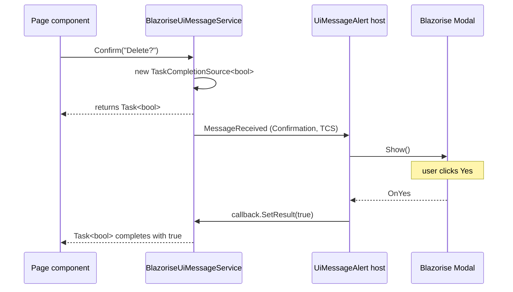

ABP does not ship a `IModalService` interface with `OpenAsync<TComponent>(parameters)` — the well-known shape Radzen/MudBlazor users expect. Instead it leans on `IUiMessageService.Confirm` for confirm dialogs and on Blazorise's own `Modal` component (with `CancelClosingModalWhenFocusLost`) for everything else. This page documents *exactly* what is in the box in v7.4.0, how the message-event dispatcher works, and how to build a richer modal experience on top.

## The contract

```csharp framework/src/Volo.Abp.AspNetCore.Components/Messages/IUiMessageService.cs
public interface IUiMessageService
{
    Task Info(string message, string? title = null, Action<UiMessageOptions>? options = null);
    Task Success(string message, string? title = null, Action<UiMessageOptions>? options = null);
    Task Warn(string message, string? title = null, Action<UiMessageOptions>? options = null);
    Task Error(string message, string? title = null, Action<UiMessageOptions>? options = null);
    Task<bool> Confirm(string message, string? title = null, Action<UiMessageOptions>? options = null);
}
```

The four notify methods are fire-and-forget; `Confirm` returns a `Task<bool>` that completes when the user clicks Yes or Cancel.

## UiMessageOptions

```csharp framework/src/Volo.Abp.AspNetCore.Components/Messages/UiMessageOptions.cs
public class UiMessageOptions
{
    public bool CenterMessage { get; set; }
    public bool ShowMessageIcon { get; set; }
    public object? MessageIcon { get; set; }
    public string? OkButtonText { get; set; }
    public object? OkButtonIcon { get; set; }
    public string? ConfirmButtonText { get; set; }
    public object? ConfirmButtonIcon { get; set; }
    public string? CancelButtonText { get; set; }
    public object? CancelButtonIcon { get; set; }
}
```

The `MessageIcon` / `OkButtonIcon` are `object?` so different themes can pass their own icon enum (Blazorise `IconName`, FontAwesome string, …). `OkButtonText` is plain `string?`. The `UiNotificationOptions` cousin used by toast notifications keeps texts as `ILocalizableString`.

## Implementations

| Service | Package | Behavior |
|---------|---------|----------|
| `SimpleUiMessageService` | `Components.Web` | JS `alert`/`confirm` — fallback if no UI theme is referenced. |
| `BlazoriseUiMessageService` | `Volo.Abp.BlazoriseUI` | Raises `MessageReceived` event; a host component renders the Blazorise modal. |

## The Blazorise dispatcher

`BlazoriseUiMessageService` is the production path for the Basic Theme, LeptonX, and Blazorise-based community themes:

```csharp framework/src/Volo.Abp.BlazoriseUI/BlazoriseUiMessageService.cs
[Dependency(ReplaceServices = true)]
public class BlazoriseUiMessageService : IUiMessageService, IScopedDependency
{
    public event EventHandler<UiMessageEventArgs>? MessageReceived;

    public Task Info(string message, string? title = null, Action<UiMessageOptions>? options = null)
    {
        var uiMessageOptions = CreateDefaultOptions();
        options?.Invoke(uiMessageOptions);
        MessageReceived?.Invoke(this,
            new UiMessageEventArgs(UiMessageType.Info, message, title, uiMessageOptions));
        return Task.CompletedTask;
    }

    public Task<bool> Confirm(string message, string? title = null, Action<UiMessageOptions>? options = null)
    {
        var uiMessageOptions = CreateDefaultOptions();
        options?.Invoke(uiMessageOptions);

        var callback = new TaskCompletionSource<bool>();
        MessageReceived?.Invoke(this,
            new UiMessageEventArgs(UiMessageType.Confirmation, message, title, uiMessageOptions, callback));
        return callback.Task;
    }

    protected virtual UiMessageOptions CreateDefaultOptions()
    {
        return new UiMessageOptions
        {
            CenterMessage = true,
            ShowMessageIcon = true,
            OkButtonText = localizer["Ok"],
            CancelButtonText = localizer["Cancel"],
            ConfirmButtonText = localizer["Yes"],
        };
    }
}
```

Three properties make this work:

1. **`IScopedDependency`** — one instance per Blazor circuit (Server) or per host scope (Wasm/MAUI). That's why `AbpComponentBase.Message` uses `LazyGetNonScopedRequiredService`: the *non-scoped* (host root) provider, not the per-component child scope, ensures every component instance gets the same dispatcher.
2. **`event MessageReceived`** — fired synchronously when `Info`/`Confirm` is called. A single host component subscribes to it.
3. **`TaskCompletionSource<bool>`** — for `Confirm`, the host completes this TCS after the user clicks Yes/Cancel. The original caller awaits the same task.



The host component is `UiMessageAlert.razor` (shipped inside `Volo.Abp.BlazoriseUI/Components`). It's placed once in the theme's `MainLayout` so every circuit has exactly one modal renderer.

## Cancelling close on focus-lost

Blazorise's `Modal` closes on outside-click by default. For confirm modals that's almost never the right behavior — the user clicked something dangerous, then clicked away without deciding. ABP exposes a one-line helper:

```csharp framework/src/Volo.Abp.BlazoriseUI/AbpBlazoriseUiModalExtensions.cs
public static class AbpBlazoriseUiModalExtensions
{
    public static Task CancelClosingModalWhenFocusLost(this Modal modal, ModalClosingEventArgs eventArgs)
    {
        // cancel close if clicked outside of modal area
        eventArgs.Cancel = eventArgs.CloseReason == CloseReason.FocusLostClosing;
        return Task.CompletedTask;
    }
}
```

Wire it on any `Modal` you own:

```razor
<Modal @ref="modal" Closing="OnModalClosing">
    <ModalContent Centered>
        <ModalHeader>...</ModalHeader>
        <ModalBody>...</ModalBody>
    </ModalContent>
</Modal>

@code {
    private Modal modal = null!;
    private Task OnModalClosing(ModalClosingEventArgs e) => modal.CancelClosingModalWhenFocusLost(e);
}
```

## Using Confirm from a page

```razor
@inherits AbpComponentBase

<Button Color="Color.Danger" Clicked="DeleteAsync">Delete</Button>

@code {
    private async Task DeleteAsync()
    {
        if (!await Message.Confirm(
                L["AreYouSureToDelete"],
                title: L["Confirmation"],
                options: o => o.ConfirmButtonText = L["Yes,delete"]))
        {
            return;
        }

        await Repo.DeleteAsync(SelectedId);
        await Notify.Success(L["Deleted"]);
    }
}
```

`Message` resolves through `LazyGetNonScopedRequiredService` — guaranteed to be the circuit-wide dispatcher even though the page derives `OwningComponentBase`.

## Building a custom modal facade

There's no abstraction in v7.4.0 for "open this whole component as a modal" — typical ABP CRUD pages use a Blazorise `<Modal>` declared inline and a `ShowAsync()` method on the page. To centralize that:

```csharp
public interface IFormModalService
{
    Task<TResult?> OpenAsync<TComponent, TResult>(Dictionary<string, object?>? parameters = null)
        where TComponent : ComponentBase, IModalForm<TResult>;
}

[Dependency(ReplaceServices = true)]
public class FormModalService : IFormModalService, IScopedDependency
{
    public event EventHandler<FormModalEventArgs>? Requested;

    public Task<TResult?> OpenAsync<TComponent, TResult>(Dictionary<string, object?>? parameters = null)
        where TComponent : ComponentBase, IModalForm<TResult>
    {
        var tcs = new TaskCompletionSource<TResult?>();
        Requested?.Invoke(this,
            new FormModalEventArgs(typeof(TComponent), parameters, r => tcs.SetResult((TResult?)r)));
        return tcs.Task;
    }
}
```

A `FormModalHost.razor` placed in `MainLayout` subscribes to `Requested`, renders the requested component inside a Blazorise `<Modal>` with `DynamicComponent`, and signals the TCS when the user submits or cancels. This is the same pattern `BlazoriseUiMessageService` uses, generalized.

## Gotchas

<Warning>
  `BlazoriseUiMessageService` is `IScopedDependency`. If you resolve it from a transient service constructor that's resolved per-call, you can accidentally create multiple dispatchers — `MessageReceived` will be raised on the wrong instance. Resolve via `AbpComponentBase.Message` or from the non-scoped root provider.
</Warning>

<Warning>
  The `MessageReceived` event has no async signature — handlers must complete synchronously (post to the renderer via `InvokeAsync` if needed). Never await long-running work inside the handler or the dispatcher thread will block.
</Warning>

<Note>
  `UiMessageOptions.MessageIcon` and `OkButtonIcon` are typed as `object?` so different themes can use their own icon types. The default `BlazoriseUiMessageService` does not set them, so themes are free to pick defaults based on `UiMessageType`.
</Note>

## Cross-links

<CardGroup cols={2}>
  <Card title="Message services" icon="comment" href="/framework/ui-blazor/blazor-message-services">
    Notify vs Message — toasts vs blocking dialogs.
  </Card>
  <Card title="Components.Web primitives" icon="layer-group" href="/framework/ui-blazor/blazor-components-web">
    SimpleUiMessageService fallback path.
  </Card>
  <Card title="AbpComponentBase" icon="puzzle-piece" href="/framework/ui-blazor/blazor">
    Where Message and Notify properties live.
  </Card>
  <Card title="Server circuits" icon="bolt" href="/framework/ui-blazor/blazor-server-circuits">
    Why the dispatcher must be non-scoped.
  </Card>
</CardGroup>
