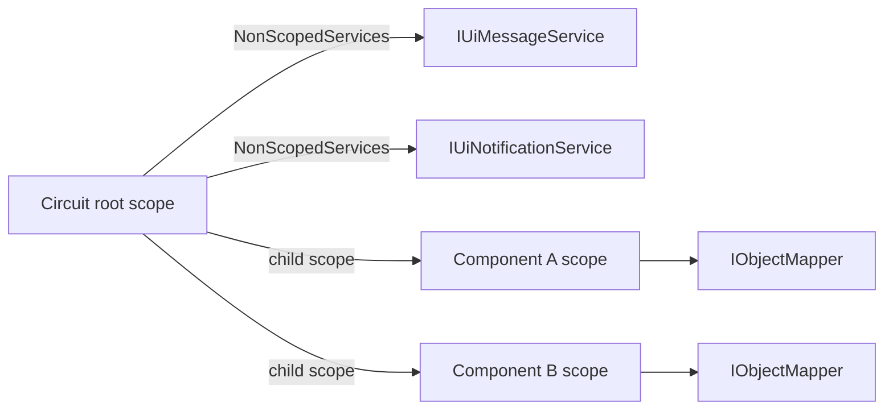
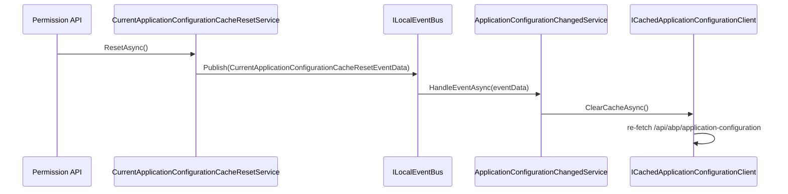
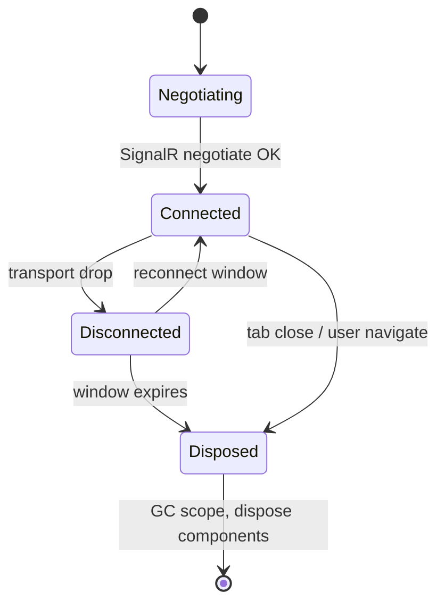

A *circuit* is Blazor Server's atomic unit of state: one TCP-bridged SignalR connection, one DI scope, one `AuthenticationStateProvider`, one set of cached settings and granted policies. When a user reloads the tab, the circuit dies and a new one starts; when the network drops they enter a reconnection grace period before the same fate. Everything ABP caches in a Blazor Server app has to be reasoned about in terms of *which circuit owns it*.

This page maps the moving parts: `AbpComponentBase` and `OwningComponentBase` for scope, `AbpComponentsClaimsCache` for the principal, `ApplicationConfigurationChangedService` for runtime config refreshes, and the local event that ties cross-circuit invalidation together.

## The two service providers in `AbpComponentBase`

```csharp framework/src/Volo.Abp.AspNetCore.Components/AbpComponentBase.cs
public abstract class AbpComponentBase : OwningComponentBase
{
    protected IUiMessageService Message  => LazyGetNonScopedRequiredService(ref _message)!;
    protected IUiNotificationService Notify => LazyGetNonScopedRequiredService(ref _notify)!;
    protected IUserExceptionInformer UserExceptionInformer
        => LazyGetNonScopedRequiredService(ref _userExceptionInformer)!;
    protected IAlertManager AlertManager => LazyGetNonScopedRequiredService(ref _alertManager)!;
    protected IClock Clock => LazyGetNonScopedRequiredService(ref _clock)!;

    [Inject]
    protected IServiceProvider NonScopedServices { get; set; } = default!;
}
```

Two service providers are involved:

| Provider | How obtained | Use |
|----------|--------------|-----|
| `ScopedServices` | `OwningComponentBase` creates a child scope per component instance | Per-component services: `AuthorizationService`, `ICurrentUser`, `ICurrentTenant`, `IObjectMapper`. |
| `NonScopedServices` | `[Inject] IServiceProvider` — the circuit's own root scope | Cross-component, circuit-wide services: `IUiMessageService`, `IUiNotificationService`, `IAlertManager`, `IClock`. |

Why does this matter? `IUiMessageService` (Blazorise implementation) raises an event the *modal host* listens to. If you resolved the message service from the per-component scope, two component instances would each have their own dispatcher and the modal would never see the confirm. Going through `NonScopedServices` guarantees there's exactly one dispatcher per circuit.



## Per-circuit claims cache

`AbpComponentsClaimsCache` is a scoped service that subscribes once to the `AuthenticationStateProvider` and exposes the latest `ClaimsPrincipal`:

```csharp framework/src/Volo.Abp.AspNetCore.Components.Web/Security/AbpComponentsClaimsCache.cs
public class AbpComponentsClaimsCache : IScopedDependency
{
    public ClaimsPrincipal Principal { get; private set; } = default!;

    public AbpComponentsClaimsCache(IClientScopeServiceProviderAccessor serviceProviderAccessor)
    {
        _authenticationStateProvider = serviceProviderAccessor.ServiceProvider
            .GetService<AuthenticationStateProvider>();
        if (_authenticationStateProvider != null)
        {
            _authenticationStateProvider.AuthenticationStateChanged += async (task) =>
            {
                Principal = (await task).User;
            };
        }
    }

    public virtual async Task InitializeAsync()
    {
        if (_authenticationStateProvider != null)
        {
            var authenticationState = await _authenticationStateProvider.GetAuthenticationStateAsync();
            Principal = authenticationState.User;
        }
    }
}
```

The reason this exists at all: `ICurrentUser` and `ICurrentTenant` need a `ClaimsPrincipal` to read claims from, but they get resolved deep inside application services where `AuthenticationStateProvider` is not a typed dependency. The cache turns the push-based provider into a pull-based principal accessor that `CurrentPrincipalAccessorBase` can read synchronously.

In Blazor Server the principal arrives over a SignalR negotiation; in WebAssembly/MAUI it arrives from cookie or token authentication. The cache abstracts both.

## Application configuration cache reset

Settings, features, permissions and granted policies are cached per circuit in the `ApplicationConfigurationDto`. When something changes server-side, the reset propagates as a local event:



The server-side replacement publishes the event:

```csharp framework/src/Volo.Abp.AspNetCore.Components.Server/Configuration/BlazorServerCurrentApplicationConfigurationCacheResetService.cs
[Dependency(ReplaceServices = true)]
public class BlazorServerCurrentApplicationConfigurationCacheResetService :
    ICurrentApplicationConfigurationCacheResetService, ITransientDependency
{
    public async Task ResetAsync()
    {
        await _localEventBus.PublishAsync(new CurrentApplicationConfigurationCacheResetEventData());
    }
}
```

<Note>
  In Blazor Server `ILocalEventBus` is per-application — every circuit shares it. A permission edit in one circuit invalidates every other circuit's cached configuration in the same process. In a tiered topology where the API and the Blazor host are separate processes the event won't cross; you need `IDistributedEventBus` for that.
</Note>

## Disposable component scope

`OwningComponentBase` disposes its scope when the component is removed from the render tree. ABP relies on this for:

- `IObjectMapper`, `IAuthorizationService`, `ICurrentUser`, `ICurrentTenant` getting fresh per-component lifetimes.
- Application services and `IRepository<>` instances resolved via `ScopedServices` having a deterministic disposal boundary.

`HandleErrorAsync` checks for disposal before touching state:

```csharp framework/src/Volo.Abp.AspNetCore.Components/AbpComponentBase.cs
protected virtual async Task HandleErrorAsync(Exception exception)
{
    if (IsDisposed)
    {
        return;
    }

    Logger.LogException(exception);
    await InvokeAsync(async () =>
    {
        await UserExceptionInformer.InformAsync(new UserExceptionInformerContext(exception));
        StateHasChanged();
    });
}
```

`InvokeAsync` is the `ComponentBase` synchronization context helper — it dispatches the work back to the renderer's loop even if the exception is thrown on a background thread (e.g., `Task.Run` inside a button handler).

## Circuit lifecycle and reconnection



While `Disconnected`, the circuit's DI scope and all your component state live on. Caches survive — including `AbpComponentsClaimsCache` — so when the user reconnects no extra work is needed. If the reconnection window expires the scope disposes and a fresh circuit (new auth state evaluation, new application config fetch) starts.

The reconnection window is configured via `CircuitOptions`:

```csharp
context.Services.PreConfigure<IServerSideBlazorBuilder>(builder =>
{
    builder.AddCircuitOptions(o =>
    {
        o.DisconnectedCircuitRetentionPeriod = TimeSpan.FromMinutes(3);
        o.DisconnectedCircuitMaxRetained = 100;
        o.JSInteropDefaultCallTimeout = TimeSpan.FromMinutes(1);
    });
});
```

## Gotchas

<Warning>
  Don't resolve `IUiMessageService` directly via `[Inject]` — you'll get a per-component scoped instance that doesn't share its event subscription with the modal host. Always go through `AbpComponentBase.Message` (which uses `LazyGetNonScopedRequiredService`).
</Warning>

<Warning>
  `AuthorizationService` resolved through `ScopedServices` reads the current principal at the moment of resolution. If the user signs out mid-circuit, re-resolve (or rely on `[Authorize]` page-level guards) — cached results inside the same scope won't update.
</Warning>

<Warning>
  In tiered topology a permission change made on the API server is **not** picked up automatically on the Blazor host — the local event bus is process-local. You need a distributed reset (the cache reset service still publishes locally; pair it with an `IDistributedEventBus` handler if cross-process invalidation is required).
</Warning>

<Note>
  `IsDisposed` is a member of `OwningComponentBase` (inherited via `ComponentBase`). Always check it before calling `StateHasChanged` from async continuations after a `Task.Delay` or HTTP call.
</Note>

## Cross-links

<CardGroup cols={2}>
  <Card title="Hub mapping & options" icon="bolt" href="/framework/ui-blazor/blazor-server-signalr">
    The /_blazor mapping and AddServerSideBlazor configuration.
  </Card>
  <Card title="AbpComponentBase" icon="puzzle-piece" href="/framework/ui-blazor/blazor">
    Two-provider scope model and lazy resolution.
  </Card>
  <Card title="Authentication" icon="key" href="/framework/ui-blazor/blazor-authentication">
    AuthenticationStateProvider, cookie introspection.
  </Card>
  <Card title="Components.Web primitives" icon="layer-group" href="/framework/ui-blazor/blazor-components-web">
    SimpleUiMessageService, CookieService, alert manager.
  </Card>
</CardGroup>
