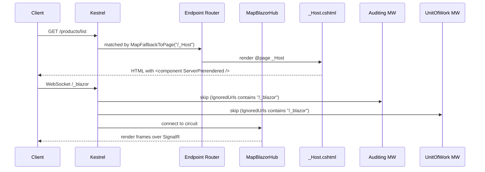

`Volo.Abp.AspNetCore.Components.Server` is the **host-side glue** that lets a normal ASP.NET Core application boot Blazor Server, route the SignalR `/_blazor` hub through the endpoint router, fall back to a `_Host.cshtml` page, and skip the per-request unit-of-work / auditing machinery that would otherwise wrap every Blazor frame.

The package is tiny — one module class, one circuit-friendly configuration cache reset service, one lookup-API request service, plus a cookie-authentication extension method that adds OAuth introspection on validation. Everything is built on top of the `Volo.Abp.AspNetCore.Components.Web` and `Volo.Abp.AspNetCore.SignalR` modules.

## Package layout

```text framework/src/Volo.Abp.AspNetCore.Components.Server/
Microsoft/AspNetCore/Authentication/Cookies/
  CookieAuthenticationOptionsExtensions.cs       — IntrospectAccessToken()
Volo/Abp/AspNetCore/Components/Server/
  AbpAspNetCoreComponentsServerModule.cs
  Configuration/
    BlazorServerCurrentApplicationConfigurationCacheResetService.cs
  Extensibility/
    BlazorServerLookupApiRequestService.cs
```

## The module

`AbpAspNetCoreComponentsServerModule` depends on the `Web` components module **plus** `AbpAspNetCoreSignalRModule`, `AbpEventBusModule`, `AbpAspNetCoreMvcContractsModule` and `AbpHttpClientModule`. The dependency on `SignalR` is what brings `MapHub<T>` registration plumbing and the `AbpHubContextAccessorHubFilter` into the Blazor host — your own `AbpHub` subclasses ride the same machinery as Blazor's internal hub.

```csharp framework/src/Volo.Abp.AspNetCore.Components.Server/Volo/Abp/AspNetCore/Components/Server/AbpAspNetCoreComponentsServerModule.cs
[DependsOn(
    typeof(AbpHttpClientModule),
    typeof(AbpAspNetCoreComponentsWebModule),
    typeof(AbpAspNetCoreSignalRModule),
    typeof(AbpEventBusModule),
    typeof(AbpAspNetCoreMvcContractsModule)
)]
public class AbpAspNetCoreComponentsServerModule : AbpModule
{
    public override void ConfigureServices(ServiceConfigurationContext context)
    {
        StaticWebAssetsLoader.UseStaticWebAssets(
            context.Services.GetHostingEnvironment(),
            context.Services.GetConfiguration());

        context.Services.AddHttpClient();

        var serverSideBlazorBuilder = context.Services.AddServerSideBlazor(options =>
        {
            if (context.Services.GetHostingEnvironment().IsDevelopment())
                options.DetailedErrors = true;
        });
        context.Services.ExecutePreConfiguredActions(serverSideBlazorBuilder);

        Configure<AbpAspNetCoreUnitOfWorkOptions>(options =>
            options.IgnoredUrls.AddIfNotContains("/_blazor"));

        Configure<AbpAspNetCoreAuditingOptions>(options =>
            options.IgnoredUrls.AddIfNotContains("/_blazor"));

        var preConfigureActions = context.Services
            .GetPreConfigureActions<HttpConnectionDispatcherOptions>();

        Configure<AbpEndpointRouterOptions>(options =>
        {
            options.EndpointConfigureActions.Add(endpointContext =>
            {
                endpointContext.Endpoints.MapBlazorHub(httpConnectionDispatcherOptions =>
                {
                    preConfigureActions.Configure(httpConnectionDispatcherOptions);
                });
                endpointContext.Endpoints.MapFallbackToPage("/_Host");
            });
        });
    }

    public override void OnApplicationInitialization(ApplicationInitializationContext context)
    {
        context.GetEnvironment().WebRootFileProvider =
            new CompositeFileProvider(
                new ManifestEmbeddedFileProvider(typeof(IServerSideBlazorBuilder).Assembly),
                context.GetEnvironment().WebRootFileProvider
            );
    }
}
```

### What each line does

| Line | Why |
|---|---|
| `StaticWebAssetsLoader.UseStaticWebAssets(...)` | Re-runs the static-web-assets loader so Razor Class Library `wwwroot/` assets ship in **Release** as well as Development — the default ASP.NET startup only runs it in Development. |
| `AddServerSideBlazor(options => DetailedErrors = true)` | Wires the standard SSB pipeline, then surfaces full exception text in the browser only in Development. **In Production the `DetailedErrors` flag stays `false`** and the user sees the generic Blazor error UI. |
| `ExecutePreConfiguredActions(serverSideBlazorBuilder)` | Lets downstream modules (e.g. the LeptonX theme, your application) hook into the `IServerSideBlazorBuilder` from a `PreConfigureServices` block — typically to call `.AddCircuitOptions(...)` or `.AddHubOptions(...)`. |
| `IgnoredUrls.AddIfNotContains("/_blazor")` (UoW & Audit) | The Blazor circuit reuses one long-lived SignalR connection. If you wrap every frame in an audit log and unit-of-work you (a) blow up the audit DB, (b) blow up memory because UoW pins one DbContext per circuit. The two `_blazor`-prefixed URL exclusions short-circuit both middlewares. |
| `MapBlazorHub(...)` | Maps the Blazor SignalR hub at `/_blazor` and replays `PreConfigure<HttpConnectionDispatcherOptions>` actions so app code can change buffer sizes etc. from a module instead of the host's `Program.cs`. |
| `MapFallbackToPage("/_Host")` | Routes every unmatched request to `Pages/_Host.cshtml`, the Razor page that renders the Blazor `<component>` root. |
| `OnApplicationInitialization` ⇒ `CompositeFileProvider` | Wraps the embedded `_framework/*` blob from the `Microsoft.AspNetCore.Components.Server` assembly **in front of** the host's normal `WebRootFileProvider`, so the `blazor.server.js` script is served even when the host project has no physical `wwwroot/_framework` folder. |

## Endpoint pipeline



## Configuration cache reset

The Web layer defines `ICurrentApplicationConfigurationCacheResetService` — a small contract called whenever a user logs in/out or permissions change, so the cached `ApplicationConfigurationDto` (menus, granted permissions, current culture …) can be invalidated. The Blazor Server replacement publishes a local-event-bus event so every active circuit picks it up:

```csharp framework/src/Volo.Abp.AspNetCore.Components.Server/Volo/Abp/AspNetCore/Components/Server/Configuration/BlazorServerCurrentApplicationConfigurationCacheResetService.cs
[Dependency(ReplaceServices = true)]
public class BlazorServerCurrentApplicationConfigurationCacheResetService
    : ICurrentApplicationConfigurationCacheResetService, ITransientDependency
{
    private readonly ILocalEventBus _localEventBus;

    public BlazorServerCurrentApplicationConfigurationCacheResetService(
        ILocalEventBus localEventBus) => _localEventBus = localEventBus;

    public async Task ResetAsync()
    {
        await _localEventBus.PublishAsync(
            new CurrentApplicationConfigurationCacheResetEventData());
    }
}
```

Each circuit's `ApplicationConfigurationChangedService` (from `Web.Security`) subscribes to `CurrentApplicationConfigurationCacheResetEventData` and raises its `Changed` delegate so the `NavMenu`, `LoginDisplay` and any user component that needs to re-render does so on the next dispatcher tick.

## Cookie-side `IntrospectAccessToken()`

`CookieAuthenticationOptionsExtensions.IntrospectAccessToken("oidc")` plugs into `CookieAuthenticationOptions.Events.OnValidatePrincipal` and re-checks the saved `access_token` against the OIDC provider's `/connect/introspect` endpoint **on every Cookie revalidation** — typically every 30 minutes by default. If the token is missing, errored, or `IsActive == false`, the principal is rejected and the user is signed out:

```csharp framework/src/Volo.Abp.AspNetCore.Components.Server/Microsoft/AspNetCore/Authentication/Cookies/CookieAuthenticationOptionsExtensions.cs
public static CookieAuthenticationOptions IntrospectAccessToken(
    this CookieAuthenticationOptions options,
    string oidcAuthenticationScheme = "oidc")
{
    options.Events.OnValidatePrincipal = async principalContext =>
    {
        if (principalContext.Principal?.Identity?.IsAuthenticated != true) return;

        var accessToken = principalContext.Properties.GetTokenValue("access_token");
        if (accessToken.IsNullOrWhiteSpace())
        {
            // SaveTokens must be true on OpenIdConnectOptions
            await SignOutAsync(principalContext);
            return;
        }

        var oidc = await GetOpenIdConnectOptions(principalContext, oidcAuthenticationScheme);
        var response = await oidc.Backchannel.IntrospectTokenAsync(new TokenIntrospectionRequest
        {
            Address      = oidc.Configuration?.IntrospectionEndpoint
                          ?? oidc.Authority!.EnsureEndsWith('/') + "connect/introspect",
            ClientId     = oidc.ClientId,
            ClientSecret = oidc.ClientSecret,
            Token        = accessToken
        });

        if (response.IsError || !response.IsActive)
            await SignOutAsync(principalContext);
    };

    return options;
}
```

Call it in your host's auth wiring **after** `AddOpenIdConnect`:

```csharp Program.cs
context.Services.AddAuthentication(opts => /* … cookie + oidc … */)
    .AddCookie("Cookies", opts => opts.IntrospectAccessToken())
    .AddOpenIdConnect("oidc", opts =>
    {
        opts.SaveTokens = true; // required — IntrospectAccessToken reads access_token from properties
        // ...
    });
```

The extension keys `oidc` by scheme name, so multi-OIDC apps can pass a different name.

## `BlazorServerLookupApiRequestService`

The Suite-generated CRUD pages and the `EntityActionList<TKey>` / `TableColumn<TItem>` extensibility surface offer dropdown / autocomplete lookups powered by `ILookupApiRequestService`. In a Blazor Server host there is no JS-side fetch, so the service is a thin proxy over `IHttpClientFactory` — see `BlazorServerLookupApiRequestService.cs`. The WebAssembly equivalent (`WebAssemblyLookupApiRequestService`) lives in the WASM package.

## Gotchas

- **`/_Host` must exist.** `MapFallbackToPage("/_Host")` will throw at startup if there is no `Pages/_Host.cshtml` page. The Suite-generated template includes one — if you start from a blank ASP.NET Core project, add it manually.
- **Don't add `/_blazor` to `IgnoredUrls` twice.** `AddIfNotContains` already guards against duplicates; **do** add **other** SignalR hubs to the same list if you register them under `/signalr-hubs/...` and don't want UoW/Audit wrapping them.
- **Static web assets in Release** — the explicit `StaticWebAssetsLoader.UseStaticWebAssets` call is necessary because ASP.NET Core's default builder only invokes it in `Development`. Without it, Razor Class Library CSS/JS files (LeptonX theme, etc.) 404 in `Production`.
- **`AddServerSideBlazor` is called by the module.** Do **not** call it again from your `Program.cs` — you'll end up with duplicate registrations of `CircuitOptions`, the `CircuitHandler` collection and the routing component. Use a `PreConfigureServices` block + `IServerSideBlazorBuilder` action instead.
- **`IntrospectAccessToken` requires `SaveTokens = true`** on the OpenIdConnect options. The validator reads `access_token` straight out of the cookie's auth properties — without saved tokens it short-circuits to `SignOutAsync`.
- **Don't depend on `HttpContext` inside components.** It's only reliable during the initial pre-render. After the SignalR connection is upgraded, every request goes through the circuit, not a request pipeline — use `AuthenticationStateProvider`, `ICurrentUser`, `ICurrentTenant` instead.

## See also

<CardGroup cols={2}>
<Card title="Circuit handlers & revalidation" href="/framework/ui-blazor/blazor-server-circuits">
  How a `CircuitHandler` cleans up tenant/user state and how cookie revalidation re-checks the OIDC token.
</Card>
<Card title="SignalR" href="/framework/ui-blazor/blazor-server-signalr">
  Hub auto-mapping, `AbpHub`, `AbpHubContextAccessorHubFilter` and route patterns.
</Card>
<Card title="AbpComponentBase" href="/framework/ui-blazor/blazor">
  The shared component base used by every Blazor page.
</Card>
<Card title="Authentication" href="/framework/ui-blazor/blazor-authentication">
  OIDC, cookie, `AbpComponentsClaimsCache` and the WASM `RemoteAuthenticatorView` flow.
</Card>
</CardGroup>
