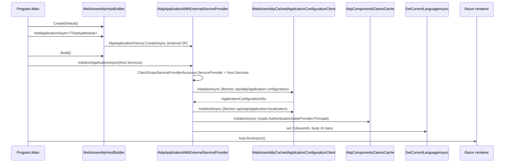

`Volo.Abp.AspNetCore.Components.WebAssembly` is the WASM-client counterpart to the Server module: it teaches `WebAssemblyHostBuilder` how to instantiate an ABP application, sets up the `WebAssemblyCachedApplicationConfigurationClient` so the SPA has a working `ApplicationConfigurationDto` before the first render, and provides a `WebAssemblyCurrentPrincipalAccessor` that bridges Blazor's `AuthenticationStateProvider` into ABP's claims pipeline.

The package contains no Razor components and no UI styling — that's the Theming and BasicTheme packages. What you get here is the **glue between `WebAssemblyHostBuilder` and `IAbpApplicationWithExternalServiceProvider`**.

## Package layout

```text framework/src/Volo.Abp.AspNetCore.Components.WebAssembly/
Microsoft/AspNetCore/Components/WebAssembly/Hosting/
  AbpWebAssemblyHostBuilderExtensions.cs              — AddApplication[Async] / InitializeApplicationAsync
Microsoft/Extensions/DependencyInjection/
  AbpWebAssemblyServiceCollectionExtensions.cs        — GetHostBuilder / GetWebAssemblyHostEnvironment
  EmptyWebAssemblyHostEnvironment.cs
Volo/Abp/AspNetCore/Components/WebAssembly/
  AbpAspNetCoreComponentsWebAssemblyModule.cs
  AbpWebAssemblyApplicationCreationOptions.cs
  ApplicationConfigurationCache.cs
  ClientProxyExceptionEventHandler.cs
  Configuration/
    BlazorWebAssemblyCurrentApplicationConfigurationCacheResetService.cs
  Extensibility/
    WebAssemblyLookupApiRequestService.cs
  WebAssemblyCachedApplicationConfigurationClient.cs
  WebAssemblyCurrentPrincipalAccessor.cs
  WebAssemblyCurrentTenantAccessor.cs
  WebAssemblyServerUrlProvider.cs
```

## Bootstrapping a WASM host

There is no `Main()` magic — you call `builder.AddApplicationAsync<TModule>(...)` and `await app.InitializeApplicationAsync(serviceProvider)` from `Program.cs`:

```csharp Program.cs
public static async Task Main(string[] args)
{
    var builder = WebAssemblyHostBuilder.CreateDefault(args);
    builder.RootComponents.Add<App>("#ApplicationContainer");

    await builder.AddApplicationAsync<MyAppBlazorModule>(options =>
    {
        // options.HostBuilder is the WebAssemblyHostBuilder
        // options.ApplicationCreationOptions is the regular AbpApplicationCreationOptions
    });

    var host = builder.Build();
    await host.Services
        .GetRequiredService<IAbpApplicationWithExternalServiceProvider>()
        .InitializeApplicationAsync(host.Services);

    await host.RunAsync();
}
```

The two extension methods live in `Microsoft.AspNetCore.Components.WebAssembly.Hosting`:

```csharp framework/src/Volo.Abp.AspNetCore.Components.WebAssembly/Microsoft/AspNetCore/Components/WebAssembly/Hosting/AbpWebAssemblyHostBuilderExtensions.cs
public static async Task<IAbpApplicationWithExternalServiceProvider> AddApplicationAsync<TStartupModule>(
    this WebAssemblyHostBuilder builder,
    Action<AbpWebAssemblyApplicationCreationOptions> options)
    where TStartupModule : IAbpModule
{
    // Net5+ DynamicProxy fix — AsyncStateMachineAttribute is stripped by the linker
    Castle.DynamicProxy.Generators.AttributesToAvoidReplicating
        .Add<AsyncStateMachineAttribute>();

    builder.Services.AddSingleton<IConfiguration>(builder.Configuration);
    builder.Services.AddSingleton(builder);

    var application = await builder.Services.AddApplicationAsync<TStartupModule>(opts =>
    {
        options?.Invoke(new AbpWebAssemblyApplicationCreationOptions(builder, opts));
        if (opts.Environment.IsNullOrWhiteSpace())
            opts.Environment = builder.HostEnvironment.Environment;
    });

    return application;
}

public async static Task InitializeApplicationAsync(
    this IAbpApplicationWithExternalServiceProvider application,
    IServiceProvider serviceProvider)
{
    ((ComponentsClientScopeServiceProviderAccessor)serviceProvider
        .GetRequiredService<IClientScopeServiceProviderAccessor>())
        .ServiceProvider = serviceProvider;

    await application.InitializeAsync(serviceProvider);
}
```

Three things are happening:

1. **`AttributesToAvoidReplicating.Add<AsyncStateMachineAttribute>()`** — Castle DynamicProxy normally clones every attribute when generating subclasses, but in .NET 5+ the runtime stripped some build-tool support. Without this call, async interceptors throw on subclass generation in WASM.
2. **`AddSingleton<IConfiguration>(builder.Configuration)` and `AddSingleton(builder)`** — the WASM `HostBuilder` is registered as a singleton so modules can resolve it through `services.GetSingletonInstance<WebAssemblyHostBuilder>()` (see `GetHostBuilder()` extension). Same for `IConfiguration`.
3. **`InitializeApplicationAsync`** wires the **client scope service-provider accessor** to the host's root provider. This is what makes `IClientScopeServiceProviderAccessor.ServiceProvider` return a usable container *before any Razor component is rendered* — `WebAssemblyCurrentPrincipalAccessor`, `AbpComponentsClaimsCache`, `WebAssemblyCachedApplicationConfigurationClient` all dereference it during their `InitializeAsync()` chain.

`AbpWebAssemblyApplicationCreationOptions` is a tiny carrier — it exposes both the `WebAssemblyHostBuilder` and the underlying `AbpApplicationCreationOptions`:

```csharp framework/src/Volo.Abp.AspNetCore.Components.WebAssembly/Volo/Abp/AspNetCore/Components/WebAssembly/AbpWebAssemblyApplicationCreationOptions.cs
public class AbpWebAssemblyApplicationCreationOptions
{
    public WebAssemblyHostBuilder HostBuilder { get; }
    public AbpApplicationCreationOptions ApplicationCreationOptions { get; }
}
```

So `options.HostBuilder.Services.AddSingleton<MyThing>()` works from inside `AddApplicationAsync`'s callback.

## The module

```csharp framework/src/Volo.Abp.AspNetCore.Components.WebAssembly/Volo/Abp/AspNetCore/Components/WebAssembly/AbpAspNetCoreComponentsWebAssemblyModule.cs
[DependsOn(
    typeof(AbpAspNetCoreMvcClientCommonModule),
    typeof(AbpUiModule),
    typeof(AbpAspNetCoreComponentsWebModule)
)]
public class AbpAspNetCoreComponentsWebAssemblyModule : AbpModule
{
    public override void PreConfigureServices(ServiceConfigurationContext context)
    {
        var abpHostEnvironment = context.Services.GetSingletonInstance<IAbpHostEnvironment>();
        if (abpHostEnvironment.EnvironmentName.IsNullOrWhiteSpace())
            abpHostEnvironment.EnvironmentName =
                context.Services.GetWebAssemblyHostEnvironment().Environment;

        PreConfigure<AbpHttpClientBuilderOptions>(options =>
        {
            options.ProxyClientBuildActions.Add((_, builder) =>
                builder.AddHttpMessageHandler<AbpBlazorClientHttpMessageHandler>());
        });
    }

    public override void ConfigureServices(ServiceConfigurationContext context)
    {
        context.Services.AddHttpClient();
        context.Services
            .GetHostBuilder().Logging
            .AddProvider(new AbpExceptionHandlingLoggerProvider(context.Services));
    }

    public override void OnApplicationInitialization(ApplicationInitializationContext context)
        => AsyncHelper.RunSync(() => OnApplicationInitializationAsync(context));

    public async override Task OnApplicationInitializationAsync(ApplicationInitializationContext context)
    {
        var scope = context.ServiceProvider
            .GetRequiredService<IClientScopeServiceProviderAccessor>().ServiceProvider;

        await scope.GetRequiredService<WebAssemblyCachedApplicationConfigurationClient>().InitializeAsync();
        await scope.GetRequiredService<AbpComponentsClaimsCache>().InitializeAsync();
        await SetCurrentLanguageAsync(context.ServiceProvider);
    }

    private async static Task SetCurrentLanguageAsync(IServiceProvider serviceProvider)
    {
        var configuration = await serviceProvider
            .GetRequiredService<ICachedApplicationConfigurationClient>().GetAsync();
        var cultureName = configuration.Localization?.CurrentCulture?.CultureName;
        if (!cultureName.IsNullOrEmpty())
        {
            var culture = new CultureInfo(cultureName!);
            CultureInfo.DefaultThreadCurrentCulture   = culture;
            CultureInfo.DefaultThreadCurrentUICulture = culture;
        }

        if (CultureInfo.CurrentUICulture.TextInfo.IsRightToLeft)
            await serviceProvider.GetRequiredService<IAbpUtilsService>()
                .AddClassToTagAsync("body", "rtl");
    }
}
```

### The PreConfigure hook on HTTP clients

Every ABP-generated dynamic / static client proxy gets the `AbpBlazorClientHttpMessageHandler` injected as a `DelegatingHandler`. That handler does **three** things on every outbound HTTP request from WASM (also reused in Server / MAUI as the renderer-agnostic counterpart `AbpMauiBlazorClientHttpMessageHandler`):

```csharp framework/src/Volo.Abp.AspNetCore.Components.Web/Volo/Abp/AspNetCore/Components/Web/AbpBlazorClientHttpMessageHandler.cs
protected override async Task<HttpResponseMessage> SendAsync(
    HttpRequestMessage request, CancellationToken cancellationToken)
{
    try
    {
        await _uiPageProgressService.Go(null, o => o.Type = UiPageProgressType.Info);
        await SetLanguageAsync(request, cancellationToken);
        await SetAntiForgeryTokenAsync(request);
        return await base.SendAsync(request, cancellationToken);
    }
    finally
    {
        await _uiPageProgressService.Go(-1);
    }
}
```

- Starts and stops the top-of-page **progress bar** via `IUiPageProgressService`.
- Copies the **selected language** (`localStorage.Abp.SelectedLanguage`) into `Accept-Language`.
- Copies the **anti-forgery cookie** (`XSRF-TOKEN`) into the `RequestVerificationToken` header for unsafe methods on same-origin requests.

### Application initialization order



### The cached configuration client

`WebAssemblyCachedApplicationConfigurationClient` is the WASM implementation of `ICachedApplicationConfigurationClient`. Its `InitializeAsync()` runs twice — once during module init, once whenever it is asked to refresh — and the **single** in-memory cache it writes to is the singleton `ApplicationConfigurationCache`:

```csharp framework/src/Volo.Abp.AspNetCore.Components.WebAssembly/Volo/Abp/AspNetCore/Components/WebAssembly/WebAssemblyCachedApplicationConfigurationClient.cs
public virtual async Task InitializeAsync()
{
    var configurationDto = await ApplicationConfigurationClientProxy.GetAsync(
        new ApplicationConfigurationRequestOptions {
            IncludeLocalizationResources = false
        });

    var localizationDto = await ApplicationLocalizationClientProxy.GetAsync(
        new ApplicationLocalizationRequestDto {
            CultureName = configurationDto.Localization.CurrentCulture.Name,
            OnlyDynamics = true
        });

    configurationDto.Localization.Resources = localizationDto.Resources;
    Cache.Set(configurationDto);
    ApplicationConfigurationChangedService.NotifyChanged();

    CurrentTenantAccessor.Current = new BasicTenantInfo(
        configurationDto.CurrentTenant.Id,
        configurationDto.CurrentTenant.Name);
}
```

Note **`IncludeLocalizationResources = false`** on the first request — the configuration endpoint returns navigation, granted policies, current tenant, etc., **without** the (much larger) translated resource strings; those are fetched in a second request with **`OnlyDynamics = true`**. This is the "lookahead resource bundle pipeline" — by splitting the two calls the configuration round-trip is short enough that the first paint is not delayed, and the (deduplicated) localization payload is downloaded in parallel.

After both responses land, the client also pokes `CurrentTenantAccessor` so that immediately-following code that reads `CurrentTenant` from any ABP service gets the correct tenant id.

### The principal accessor

```csharp framework/src/Volo.Abp.AspNetCore.Components.WebAssembly/Volo/Abp/AspNetCore/Components/WebAssembly/WebAssemblyCurrentPrincipalAccessor.cs
public class WebAssemblyCurrentPrincipalAccessor : CurrentPrincipalAccessorBase, ITransientDependency
{
    protected AbpComponentsClaimsCache ClaimsCache { get; }

    public WebAssemblyCurrentPrincipalAccessor(
        IClientScopeServiceProviderAccessor clientScopeServiceProviderAccessor)
    {
        ClaimsCache = clientScopeServiceProviderAccessor.ServiceProvider
            .GetRequiredService<AbpComponentsClaimsCache>();
    }

    protected override ClaimsPrincipal GetClaimsPrincipal() => ClaimsCache.Principal;
}
```

`ClaimsCache.Principal` is kept in sync by subscribing to `AuthenticationStateProvider.AuthenticationStateChanged`. ABP's `ICurrentUser` and `ICurrentPrincipalAccessor` thus see the same identity that `<AuthorizeView>` sees — without ever hitting the OIDC endpoint twice.

## Distributed cache notes

WebAssembly cannot rely on a server-side `IDistributedCache`. ABP's WASM stack uses the **default in-memory** `IDistributedCache` for the duration of the SPA's lifetime — there is **no** automatic swap to `localStorage`. Tenants, configuration, lookups all live in singleton `ApplicationConfigurationCache` / `IDistributedCache` instances. The MAUI variant is the only one that persists configuration across runs (it uses MAUI `SecureStorage` / file storage inside `Volo.Abp.Maui.Client`).

## Gotchas

- **`builder.RootComponents.Add<App>` runs before `AddApplicationAsync`.** That's correct — root component registration just records the type; nothing renders until `host.RunAsync()`. But you must `await AddApplicationAsync` before `builder.Build()` or DI registrations are lost.
- **`InitializeApplicationAsync` must be awaited before `host.RunAsync()`.** It assigns `ClientScopeServiceProviderAccessor.ServiceProvider`, fetches the configuration DTO and seeds the claims cache. If you call `RunAsync` first, the first render fires with an uninitialised `WebAssemblyCachedApplicationConfigurationClient` and you get the `should be initialized before using it` `AbpException`.
- **Don't `[Inject]` a `WebAssemblyHostBuilder`.** Use `services.GetHostBuilder()` from a module's `ConfigureServices` block instead.
- **`/api/abp/application-configuration` is called unauthenticated initially.** Don't gate it behind `[Authorize]`. Granted policies for an unauthenticated user are still returned (i.e. the AlwaysAllowed ones).
- **Configuration cache is per host, not per user.** When the user signs in or out, `ICurrentApplicationConfigurationCacheResetService.ResetAsync()` must be called (it is, automatically, from the cookie / OIDC callbacks) so the cache is replaced. If you do "silent" claim changes (impersonation), call it yourself.
- **Anti-forgery only applies to same-origin requests.** Calls to a separate API host don't get the `RequestVerificationToken` header. Use cookie or bearer auth there instead.
- **The `Logging` provider is registered against the WASM host builder's `Logging`** — make sure you don't `ClearProviders()` in your `Program.cs` after `AddApplicationAsync`, or you'll lose the `AbpExceptionHandlingLoggerProvider` and unhandled exceptions stop showing up in the message dialog.

## See also

<CardGroup cols={2}>
<Card title="Blazor Server" href="/framework/ui-blazor/blazor-server">
  Same module surface for the server-side render model.
</Card>
<Card title="MAUI Blazor" href="/framework/ui-blazor/blazor-mauiblazor">
  The hybrid (BlazorWebView) host with persistent file-storage cache.
</Card>
<Card title="Authentication" href="/framework/ui-blazor/blazor-authentication">
  `AbpComponentsClaimsCache`, `RemoteAuthenticatorView`, OIDC and the `AbpClaimTypes` overlay.
</Card>
<Card title="Localization" href="/framework/ui-blazor/blazor-localization">
  How `localStorage.Abp.SelectedLanguage` flows back through `AbpBlazorClientHttpMessageHandler`.
</Card>
</CardGroup>
