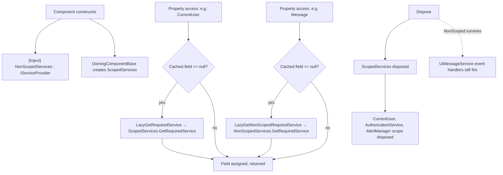

`Volo.Abp.AspNetCore.Components` is the **bottom** of the Blazor UI stack. It contains no rendering code, no theme, no JS interop — just the `AbpComponentBase` abstract class that every other component in the framework (and almost every component in an ABP application) inherits from, plus the cross-host abstractions for messages, notifications, alerts, and page-progress that the higher-level packages adapt to a concrete renderer (Blazorise, LeptonX, …).

The whole package is one module, one component base, and five tiny folders of marker interfaces and DTOs. It is referenced from `Volo.Abp.AspNetCore.Components.Web`, `…Server`, `…WebAssembly`, `…MauiBlazor` and the `Volo.Abp.AspNetCore.SignalR` hub base — so understanding what `AbpComponentBase` does (and especially what it deliberately **does not** do) is a prerequisite for reading any of the renderer-specific packages.

## Package layout

```text framework/src/Volo.Abp.AspNetCore.Components/
Volo/Abp/AspNetCore/Components/
  AbpAspNetCoreComponentsModule.cs
  AbpComponentBase.cs
  Alerts/
    AlertList.cs
    AlertMessage.cs
    AlertType.cs
    IAlertManager.cs
  DependencyInjection/
    AbpWebAssemblyConventionalRegistrar.cs
    ServiceProviderComponentActivator.cs
  ExceptionHandling/
    IUserExceptionInformer.cs
    NullUserExceptionInformer.cs
    UserExceptionInformerContext.cs
  Messages/
    IUiMessageService.cs
    UiMessageEventArgs.cs
    UiMessageOptions.cs
    UiMessageType.cs
  Notifications/
    IUiNotificationService.cs
    NullUiNotificationService.cs
    UiNotificationEventArgs.cs
    UiNotificationOptions.cs
    UiNotificationType.cs
  Progression/
    IUiPageProgressService.cs
    NullUiPageProgressService.cs
    UiPageProgressEventArgs.cs
    UiPageProgressOptions.cs
    UiPageProgressType.cs
```

There are no Razor files in this assembly. The renderer-specific packages — `Volo.Abp.BlazoriseUI`, the LeptonX theme, the Server / WebAssembly / MauiBlazor host modules — provide the `<UiMessageAlert />`, `<UiNotificationAlert />`, `<UiPageProgress />` and `<PageAlert />` components that subscribe to the events defined here.

## Module dependencies

`AbpAspNetCoreComponentsModule` depends on the renderer-neutral core modules and does **two** PreConfigure-level things:

```csharp framework/src/Volo.Abp.AspNetCore.Components/Volo/Abp/AspNetCore/Components/AbpAspNetCoreComponentsModule.cs
[DependsOn(
    typeof(AbpObjectMappingModule),
    typeof(AbpSecurityModule),
    typeof(AbpTimingModule),
    typeof(AbpMultiTenancyAbstractionsModule)
)]
public class AbpAspNetCoreComponentsModule : AbpModule
{
    public override void PreConfigureServices(ServiceConfigurationContext context)
    {
        DynamicProxyIgnoreTypes.Add<ComponentBase>();
        context.Services.AddConventionalRegistrar(new AbpWebAssemblyConventionalRegistrar());
    }
}
```

1. **`DynamicProxyIgnoreTypes.Add<ComponentBase>()`** — Castle DynamicProxy can't subclass `ComponentBase` and have the Razor compiler's generated descendants still render correctly, so every `ComponentBase` derivative is permanently excluded from interceptor weaving. As a side effect, **interceptor-based authorisation (`AbpAuthorize`) does not run inside components**; the framework relies on `<AuthorizeView>` and the `[Authorize]` attribute on `@page` directives instead.

2. **`AbpWebAssemblyConventionalRegistrar`** registers every `ComponentBase` descendant in the application as **Transient**, even in the WebAssembly client where the default conventional registrar would otherwise treat them like ordinary services:

   ```csharp framework/src/Volo.Abp.AspNetCore.Components/Volo/Abp/AspNetCore/Components/DependencyInjection/AbpWebAssemblyConventionalRegistrar.cs
   public class AbpWebAssemblyConventionalRegistrar : DefaultConventionalRegistrar
   {
       protected override bool IsConventionalRegistrationDisabled(Type type)
           => !IsComponent(type) || base.IsConventionalRegistrationDisabled(type);

       private static bool IsComponent(Type type)
           => typeof(ComponentBase).IsAssignableFrom(type);

       protected override ServiceLifetime? GetDefaultLifeTimeOrNull(Type type)
           => ServiceLifetime.Transient;
   }
   ```

   That registration enables the higher-level `ServiceProviderComponentActivator` (in `…Components.Web`) to resolve components through the container instead of `Activator.CreateInstance`, which is what makes `[Inject]` and **constructor injection** both work in the same component.

## AbpComponentBase

`AbpComponentBase` extends `OwningComponentBase` (not plain `ComponentBase`), so it owns a private DI scope for its lifetime — disposed when the component is disposed. Everything resolved through the `ScopedServices` property (e.g. `IAuthorizationService`, `ICurrentUser`, `ICurrentTenant`) is bound to that scope; everything resolved through `NonScopedServices` (the injected `IServiceProvider`) is taken from the parent container.

### Lazy properties

Every common service is exposed as a protected, **lazily resolved** property — nothing is fetched until the component touches it:

```csharp framework/src/Volo.Abp.AspNetCore.Components/Volo/Abp/AspNetCore/Components/AbpComponentBase.cs
public abstract class AbpComponentBase : OwningComponentBase
{
    protected IStringLocalizerFactory StringLocalizerFactory =>
        LazyGetRequiredService(ref _stringLocalizerFactory)!;

    protected IStringLocalizer L { get { /* see CreateLocalizer below */ } }

    protected Type? LocalizationResource {
        get => _localizationResource;
        set { _localizationResource = value; _localizer = null; }
    }
    private Type? _localizationResource = typeof(DefaultResource);

    protected ILogger          Logger              => _lazyLogger.Value;
    protected ILoggerFactory   LoggerFactory       => LazyGetRequiredService(ref _loggerFactory)!;
    protected IAuthorizationService AuthorizationService => LazyGetRequiredService(ref _authorizationService)!;
    protected ICurrentUser     CurrentUser         => LazyGetRequiredService(ref _currentUser)!;
    protected ICurrentTenant   CurrentTenant       => LazyGetRequiredService(ref _currentTenant)!;
    protected IUiMessageService Message            => LazyGetNonScopedRequiredService(ref _message)!;
    protected IUiNotificationService Notify        => LazyGetNonScopedRequiredService(ref _notify)!;
    protected IUserExceptionInformer UserExceptionInformer =>
        LazyGetNonScopedRequiredService(ref _userExceptionInformer)!;
    protected IAlertManager    AlertManager        => LazyGetNonScopedRequiredService(ref _alertManager)!;
    protected IClock           Clock               => LazyGetNonScopedRequiredService(ref _clock)!;
    protected AlertList        Alerts              => AlertManager.Alerts;
    protected IObjectMapper    ObjectMapper        { get { /* honours ObjectMapperContext */ } }

    [Inject]
    protected IServiceProvider NonScopedServices { get; set; } = default!;
    // …
}
```

There are **three resolution helpers** and they pick different containers:

| Helper                              | Container                  | Disposed with                  |
| ----------------------------------- | -------------------------- | ------------------------------ |
| `LazyGetRequiredService<T>(ref T)`  | `ScopedServices`           | Component (via `OwningComponentBase`) |
| `LazyGetService<T>(ref T?)`         | `ScopedServices` (optional)| Component                      |
| `LazyGetNonScopedRequiredService<T>(ref T)` | `NonScopedServices` (`[Inject]`) | Host circuit / WASM scope |
| `LazyGetNonScopedService<T>(ref T?)`| `NonScopedServices` (opt.) | Host circuit / WASM scope      |

The non-scoped versions exist so that **`IUiMessageService`**, **`IUiNotificationService`**, **`AlertManager`** and friends keep firing their events even after the component is disposed (otherwise the message dialog wouldn't have time to react to the last action). `IClock` is non-scoped purely as a singleton optimisation.

### The `L` localizer

`L` returns an `IStringLocalizer` lazily created from the **`LocalizationResource`** type. Default is `DefaultResource`; you override it per page like so:

```csharp components/_Imports.razor
@code {
    protected override void OnInitialized()
    {
        LocalizationResource = typeof(MyAppResource);
        base.OnInitialized();
    }
}
```

`CreateLocalizer` falls back to `IStringLocalizerFactory.CreateDefaultOrNull()` when no resource is set — and throws a deliberately verbose `AbpException` if even the default isn't configured:

```csharp framework/src/Volo.Abp.AspNetCore.Components/Volo/Abp/AspNetCore/Components/AbpComponentBase.cs
protected virtual IStringLocalizer CreateLocalizer()
{
    if (LocalizationResource != null)
        return StringLocalizerFactory.Create(LocalizationResource);

    var localizer = StringLocalizerFactory.CreateDefaultOrNull();
    if (localizer == null)
        throw new AbpException(
            $"Set {nameof(LocalizationResource)} or define the default localization resource type " +
            $"(by configuring the {nameof(AbpLocalizationOptions)}.{nameof(AbpLocalizationOptions.DefaultResourceType)}) " +
            $"to be able to use the {nameof(L)} object!");

    return localizer;
}
```

Setting `LocalizationResource = typeof(SomethingElse)` after the first read of `L` resets the cached `_localizer` and forces re-creation. That's also why the property is virtual — UI modules (e.g. Identity Management) ship pages with a fixed resource set in `OnInitialized`.

### `ObjectMapper` and `ObjectMapperContext`

```csharp framework/src/Volo.Abp.AspNetCore.Components/Volo/Abp/AspNetCore/Components/AbpComponentBase.cs
protected IObjectMapper ObjectMapper {
    get {
        if (_objectMapper != null) return _objectMapper;
        if (ObjectMapperContext == null)
            return LazyGetRequiredService(ref _objectMapper)!;
        return LazyGetRequiredService(
            typeof(IObjectMapper<>).MakeGenericType(ObjectMapperContext),
            ref _objectMapper)!;
    }
}

protected Type? ObjectMapperContext { get; set; }
```

By default `ObjectMapper` resolves the generic `IObjectMapper`; setting `ObjectMapperContext = typeof(MyAppModule)` in `OnInitialized` switches to the module-scoped `IObjectMapper<MyAppModule>`. The CRUD page bases in `Volo.Abp.BlazoriseUI` (`AbpCrudPageBase`) use this so each feature module gets its own AutoMapper profile lookup without inheritance gymnastics.

### `HandleErrorAsync`

The single user-facing error helper:

```csharp framework/src/Volo.Abp.AspNetCore.Components/Volo/Abp/AspNetCore/Components/AbpComponentBase.cs
protected virtual async Task HandleErrorAsync(Exception exception)
{
    if (IsDisposed) return;

    Logger.LogException(exception);
    await InvokeAsync(async () =>
    {
        await UserExceptionInformer.InformAsync(
            new UserExceptionInformerContext(exception));
        StateHasChanged();
    });
}
```

It logs through the component's typed logger, then dispatches a render-thread-safe call to `IUserExceptionInformer` so the UI gets a message / notification / alert (depending on which informer is registered), then forces a re-render. The default informer is replaced by `UserExceptionInformer` in `…Components.Web` which decodes `BusinessException`/`AbpRemoteCallException` payloads — see the [Blazor message services](/framework/ui-blazor/blazor-message-services) page for the full call-chain.

## Resolution flow



## Alerts, exceptions and the cross-cutting DTOs

The `Alerts`, `Messages`, `Notifications`, `Progression` and `ExceptionHandling` folders are pure abstractions — DTOs, interfaces, enums:

```csharp framework/src/Volo.Abp.AspNetCore.Components/Volo/Abp/AspNetCore/Components/Alerts/AlertList.cs
public class AlertList : ObservableCollection<AlertMessage>
{
    public void Info   (string text, string? title = null, bool dismissible = true) => Add(new AlertMessage(AlertType.Info,    text, title, dismissible));
    public void Warning(string text, string? title = null, bool dismissible = true) => Add(new AlertMessage(AlertType.Warning, text, title, dismissible));
    public void Danger (string text, string? title = null, bool dismissible = true) => Add(new AlertMessage(AlertType.Danger,  text, title, dismissible));
    public void Success(string text, string? title = null, bool dismissible = true) => Add(new AlertMessage(AlertType.Success, text, title, dismissible));
}
```

`AlertList` is an `ObservableCollection<AlertMessage>`, which is exactly what `<PageAlert />` (in `Volo.Abp.BlazoriseUI/Components/PageAlert.razor.cs`) subscribes to via `CollectionChanged`. There is also no `Toast`, `Snackbar` or `PopOver` type — those are responsibilities of the renderer (Blazorise / LeptonX).

`IAlertManager` is just `AlertList Alerts { get; }`, implemented as `IScopedDependency` in `…Components.Web/Alerts/AlertManager.cs` — one list per circuit / WASM scope:

```csharp framework/src/Volo.Abp.AspNetCore.Components.Web/Volo/Abp/AspNetCore/Components/Web/Alerts/AlertManager.cs
public class AlertManager : IAlertManager, IScopedDependency
{
    public AlertList Alerts { get; } = new AlertList();
}
```

Component code uses `Alerts.Success("Saved.")` (or `AlertManager.Alerts.Success(...)`) to push a banner; the layout's `<PageAlert />` renders and removes them.

## Options reference

The DTO classes have no startup-time options — they're consumed per call. The relevant per-call options live in `UiMessageOptions`, `UiNotificationOptions` and `UiPageProgressOptions`:

| Option / DTO | Property | Purpose |
|---|---|---|
| `UiMessageOptions` | `CenterMessage` | Center the dialog instead of top-of-page |
| | `ShowMessageIcon` | Toggle the large type icon |
| | `MessageIcon` | Override the icon (renderer-specific `object`) |
| | `OkButtonText` / `OkButtonIcon` | Override OK button caption / icon |
| | `ConfirmButtonText` / `ConfirmButtonIcon` | Override Confirm caption / icon |
| | `CancelButtonText` / `CancelButtonIcon` | Override Cancel caption / icon |
| `UiNotificationOptions` | `OkButtonText : ILocalizableString?` | Localised OK button caption |
| | `OkButtonIcon` | Renderer-specific icon |

Notice `UiNotificationOptions.OkButtonText` is `ILocalizableString` while `UiMessageOptions.OkButtonText` is a plain `string` — this is intentional: notifications are non-modal and the renderer may have to localize the caption *after* the call site loses its `IStringLocalizer`; the modal message dialog blocks until acknowledgement so the caller can pre-localize.

## Gotchas

- **Don't constructor-inject `ScopedServices`.** Use the lazy properties or `LazyGetRequiredService`. Constructor-injected services aren't taken from the owned scope and won't get disposed with the component.
- **`AuthorizationService` from `AbpComponentBase` is the framework `IAuthorizationService`, not Blazor's `IAuthorizeService`.** It returns `AuthorizationResult` and is the imperative-permission API; declarative checks should still use `<AuthorizeView>`.
- **Castle interceptors are off.** `IAbpInterceptor`-based attributes (`Authorize`, `UnitOfWork`, `Audited` …) **do not run on component methods**. Apply them in injected application services instead.
- **`L` throws if you forget to set `LocalizationResource` or `DefaultResourceType`.** The exception text is very explicit — read it; don't `try/catch` it. The fix is one line in `AbpLocalizationOptions`.
- **`Message`, `Notify`, `Alerts` are non-scoped.** They survive the component's dispose. That's a feature for modal callbacks but also means you can leak event-handler subscriptions; always unsubscribe in `Dispose`.
- **`ObjectMapperContext` must be set before the first `ObjectMapper` access.** Once the lazy field is populated, switching the context is a no-op until the component is re-created.

## See also

<CardGroup cols={2}>
<Card title="Blazor Server module" href="/framework/ui-blazor/blazor-server">
  How `AbpAspNetCoreComponentsServerModule` wires `AddServerSideBlazor`, the `_blazor` URL ignore-list and the `_Host` fallback.
</Card>
<Card title="Blazor WebAssembly" href="/framework/ui-blazor/blazor-webassembly">
  `WebAssemblyHostBuilder.AddApplicationAsync`, `WebAssemblyCachedApplicationConfigurationClient`, `ClientScopeServiceProviderAccessor`.
</Card>
<Card title="Message services" href="/framework/ui-blazor/blazor-message-services">
  `IUiMessageService`, `IUiNotificationService`, `SimpleUiMessageService`, `BlazoriseUiMessageService`.
</Card>
<Card title="Modal services" href="/framework/ui-blazor/blazor-modal-services">
  Confirm/yes-no/dialog patterns, `Modal` close-reason handling in Blazorise.
</Card>
</CardGroup>
