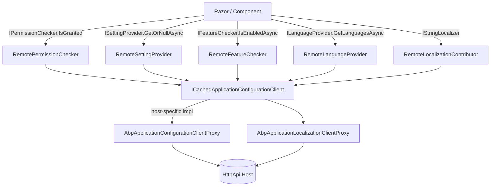

`Volo.Abp.AspNetCore.Mvc.Client.Common` is the **shared** half of the framework's tiered-client tier — the bits that don't depend on whether the host is an MVC Razor Pages app, a Blazor Server app or a tiered Blazor WebAssembly host. Specifically it ships:

- Three **auto-generated static client proxies** for the framework's "infrastructure" controllers (`AbpApplicationConfigurationAppService`, `AbpApplicationLocalizationAppService`, `AbpTenantAppService`).
- The `ICachedApplicationConfigurationClient` **contract** that the host-specific package (MVC, Blazor Server, …) implements with its own caching strategy.
- Four **`Remote*`** providers that translate ABP's framework abstractions (`IPermissionChecker`, `IFeatureChecker`, `ISettingProvider`, `ILanguageProvider`) into calls to the cached configuration client.
- A `RemoteExternalLocalizationStore` and `RemoteLocalizationContributor` that make the API-side dynamic localization resources available on the client side.

The pattern is: **anything a Razor page might need to know about the user (granted permissions, current settings, enabled features, available languages, localized strings)** is read from one big DTO that the host fetches once and caches.

## Package layout

```text framework/src/Volo.Abp.AspNetCore.Mvc.Client.Common/
ClientProxies/
  AbpApplicationConfigurationClientProxy.cs
  AbpApplicationConfigurationClientProxy.Generated.cs
  AbpApplicationLocalizationClientProxy.cs
  AbpApplicationLocalizationClientProxy.Generated.cs
  AbpTenantClientProxy.cs
  AbpTenantClientProxy.Generated.cs
Volo/Abp/AspNetCore/Mvc/Client/
  AbpAspNetCoreMvcClientCommonModule.cs
  ICachedApplicationConfigurationClient.cs
  RemoteExternalLocalizationStore.cs
  RemoteFeatureChecker.cs
  RemoteLanguageProvider.cs
  RemoteLocalizationContributor.cs
  RemotePermissionChecker.cs
  RemoteSettingProvider.cs
```

## Module

```csharp framework/src/Volo.Abp.AspNetCore.Mvc.Client.Common/Volo/Abp/AspNetCore/Mvc/Client/AbpAspNetCoreMvcClientCommonModule.cs
[DependsOn(
    typeof(AbpHttpClientModule),
    typeof(AbpAspNetCoreMvcContractsModule),
    typeof(AbpCachingModule),
    typeof(AbpLocalizationModule),
    typeof(AbpAuthorizationModule),
    typeof(AbpFeaturesModule),
    typeof(AbpVirtualFileSystemModule)
)]
public class AbpAspNetCoreMvcClientCommonModule : AbpModule
{
    public const string RemoteServiceName = "AbpMvcClient";

    public override void ConfigureServices(ServiceConfigurationContext context)
    {
        context.Services.AddStaticHttpClientProxies(
            typeof(AbpAspNetCoreMvcContractsModule).Assembly,
            RemoteServiceName);

        Configure<AbpVirtualFileSystemOptions>(options =>
        {
            options.FileSets.AddEmbedded<AbpAspNetCoreMvcClientCommonModule>();
        });

        Configure<AbpLocalizationOptions>(options =>
        {
            options.GlobalContributors.Add<RemoteLocalizationContributor>();
        });

        context.Services.AddTransient<AbpApplicationConfigurationClientProxy>();
        context.Services.AddTransient<AbpTenantClientProxy>();
    }
}
```

Three important calls:

1. **`AddStaticHttpClientProxies`** — registers every `[RemoteService(Name="AbpMvcClient")]` controller's auto-generated proxy against `IHttpClientFactory("AbpMvcClient")`. Consumers configure the BaseAddress for that client in `appsettings.json`.
2. **`GlobalContributors.Add<RemoteLocalizationContributor>()`** — adds the remote contributor *to every localization resource* so dynamic strings are merged with the embedded ones.
3. **Explicit `AddTransient`** for the three client proxies so they can be injected directly (the static helper registers them as part of their service interface; this also exposes the concrete type).

`RemoteServiceName = "AbpMvcClient"` is the conventional alias used in the `appsettings.json` `RemoteServices` section.

## `ICachedApplicationConfigurationClient`

```csharp framework/src/Volo.Abp.AspNetCore.Mvc.Client.Common/Volo/Abp/AspNetCore/Mvc/Client/ICachedApplicationConfigurationClient.cs
public interface ICachedApplicationConfigurationClient
{
    Task<ApplicationConfigurationDto> GetAsync();
    ApplicationConfigurationDto Get();
}
```

The **single point of indirection** — every `Remote*` consumer asks this service for the current `ApplicationConfigurationDto`, and the concrete implementation (in [`mvc-client`](/framework/ui-mvc/mvc-client) for MVC, `Volo.Abp.AspNetCore.Components.Web.Theming` for Blazor) decides how to cache it.

## The four "remote" providers

### `RemotePermissionChecker`

```csharp framework/src/Volo.Abp.AspNetCore.Mvc.Client.Common/Volo/Abp/AspNetCore/Mvc/Client/RemotePermissionChecker.cs
public class RemotePermissionChecker : IPermissionChecker, ITransientDependency
{
    public async Task<bool> IsGrantedAsync(string name)
    {
        var configuration = await ConfigurationClient.GetAsync();
        return configuration.Auth.GrantedPolicies.ContainsKey(name);
    }

    public async Task<bool> IsGrantedAsync(ClaimsPrincipal? claimsPrincipal, string name)
        => await IsGrantedAsync(name);   // always for the current principal

    public async Task<MultiplePermissionGrantResult> IsGrantedAsync(string[] names)
    {
        var result = new MultiplePermissionGrantResult();
        var configuration = await ConfigurationClient.GetAsync();
        foreach (var name in names)
        {
            result.Result.Add(name, configuration.Auth.GrantedPolicies.ContainsKey(name)
                ? PermissionGrantResult.Granted
                : PermissionGrantResult.Undefined);
        }
        return result;
    }
}
```

**`GrantedPolicies`** is a flat dictionary of `<policyName, value>`. Whether the value is the literal `"true"` or a serialized JSON value, it being present means the policy is granted. This avoids round-tripping for every individual permission check.

The `(claimsPrincipal, name)` overload intentionally ignores the principal — the cached DTO is always for the *current* user, and the contract is "I trust the cached configuration".

### `RemoteFeatureChecker`

```csharp framework/src/Volo.Abp.AspNetCore.Mvc.Client.Common/Volo/Abp/AspNetCore/Mvc/Client/RemoteFeatureChecker.cs
public class RemoteFeatureChecker : FeatureCheckerBase
{
    public override async Task<string?> GetOrNullAsync(string name)
    {
        var configuration = await ConfigurationClient.GetAsync();
        return configuration.Features.Values.GetOrDefault(name);
    }
}
```

Features are exposed as the raw string value (`"true"`, `"100"`, `"basic"`); `FeatureCheckerBase` parses them depending on the requested type (`bool`, `int`, …).

### `RemoteSettingProvider`

```csharp framework/src/Volo.Abp.AspNetCore.Mvc.Client.Common/Volo/Abp/AspNetCore/Mvc/Client/RemoteSettingProvider.cs
public class RemoteSettingProvider : ISettingProvider, ITransientDependency
{
    public async Task<string?> GetOrNullAsync(string name)
    {
        var configuration = await ConfigurationClient.GetAsync();
        return configuration.Setting.Values.GetOrDefault(name);
    }

    public async Task<List<SettingValue>> GetAllAsync(string[] names)
    {
        var configuration = await ConfigurationClient.GetAsync();
        return names.Select(x =>
            new SettingValue(x, configuration.Setting.Values.GetOrDefault(x))).ToList();
    }

    public async Task<List<SettingValue>> GetAllAsync()
    {
        var configuration = await ConfigurationClient.GetAsync();
        return configuration
            .Setting.Values
            .Select(s => new SettingValue(s.Key, s.Value))
            .ToList();
    }
}
```

Settings flow the same way: pre-resolved by the API (taking the current user/tenant into account), exposed as a flat dictionary.

### `RemoteLanguageProvider`

```csharp framework/src/Volo.Abp.AspNetCore.Mvc.Client.Common/Volo/Abp/AspNetCore/Mvc/Client/RemoteLanguageProvider.cs
public class RemoteLanguageProvider : ILanguageProvider, ITransientDependency
{
    public async Task<IReadOnlyList<LanguageInfo>> GetLanguagesAsync()
    {
        var configuration = await ConfigurationClient.GetAsync();
        return configuration.Localization.Languages;
    }
}
```

This is what the language-switcher toolbar component lists.

## Localization on the client side

The framework supports **dynamic** localization resources (Language-Texts module), where strings live in the database and can be edited at runtime. Those strings have to flow from the API to the client without baking them into the assembly.

### `RemoteLocalizationContributor`

Implements `IGlobalLocalizationContributor` (added to `AbpLocalizationOptions.GlobalContributors` in the module). It is asked for translated strings per culture, and answers by inspecting the configuration DTO:

```csharp
// (excerpt: full file)
public class RemoteLocalizationContributor : ILocalizationResourceContributor, ITransientDependency
{
    public bool IsDynamic => true;

    public LocalizedString? GetOrNull(string cultureName, string name)
    {
        var configuration = ConfigurationClient.Get();
        var contributors = configuration.Localization.Resources
            .Values.Select(r => r.Texts.GetOrDefault(name))…
        return null;
    }
}
```

(The full file delegates to `ICachedApplicationConfigurationClient.Get()` and looks up the `<resource, key>` pair inside the cached DTO.)

### `RemoteExternalLocalizationStore`

```csharp framework/src/Volo.Abp.AspNetCore.Mvc.Client.Common/Volo/Abp/AspNetCore/Mvc/Client/RemoteExternalLocalizationStore.cs
public class RemoteExternalLocalizationStore : IExternalLocalizationStore, ITransientDependency
{
    public virtual LocalizationResourceBase? GetResourceOrNull(string resourceName) { … }
    public virtual async Task<LocalizationResourceBase?> GetResourceOrNullAsync(string resourceName)
    {
        var configurationDto = await ConfigurationClient.GetAsync();
        return CreateLocalizationResourceFromConfigurationOrNull(resourceName, configurationDto);
    }

    public virtual async Task<string[]> GetResourceNamesAsync()
    {
        var configurationDto = await ConfigurationClient.GetAsync();
        return configurationDto.Localization.Resources.Keys
            .Where(x => !LocalizationOptions.Resources.ContainsKey(x))
            .ToArray();
    }

    protected virtual NonTypedLocalizationResource CreateNonTypedLocalizationResource(
        string resourceName, ApplicationLocalizationResourceDto dto)
        => new NonTypedLocalizationResource(resourceName)
              .AddBaseResources(dto.BaseResources);
}
```

The store handles **resources that don't exist on the client at all** (because no C# class with the right `[LocalizationResourceName]` is referenced) — it materializes them as `NonTypedLocalizationResource` instances based on what the API reports.

## The client proxies

Three proxies are pre-registered:

```csharp
context.Services.AddTransient<AbpApplicationConfigurationClientProxy>();
context.Services.AddTransient<AbpTenantClientProxy>();
// AbpApplicationLocalizationClientProxy is exposed through AddStaticHttpClientProxies
```

The `*.Generated.cs` files are the actual proxy bodies generated by the ABP CLI; the partial `*.cs` files are extension points for hand-written customization. Together they pair with these API-side controllers:

| Proxy | API controller route |
| --- | --- |
| `AbpApplicationConfigurationClientProxy` | `GET /api/abp/application-configuration` |
| `AbpApplicationLocalizationClientProxy` | `POST /api/abp/application-localization` |
| `AbpTenantClientProxy` | `GET /api/abp/multi-tenancy/tenants/by-name/{name}` and `…/by-id/{id}` |

## How everything stitches together



## Cross-references

- The MVC-specific implementation of `ICachedApplicationConfigurationClient` is documented in [`mvc-client`](/framework/ui-mvc/mvc-client).
- `AddStaticHttpClientProxies` and the contract assembly conventions are documented in [`Volo.Abp.Http.Client`](/framework/cross/http-client).
- The `ApplicationConfigurationDto`, `ApplicationLocalizationRequestDto` and the controllers behind the proxies live in [`Volo.Abp.AspNetCore.Mvc`](/framework/cross/aspnetcore-mvc).
- The `IPermissionChecker`, `ISettingProvider`, `IFeatureChecker` abstractions come from [`Volo.Abp.Authorization`](/framework/auth/authorization), [`Volo.Abp.Settings`](/framework/core/settings) and [`Volo.Abp.Features`](/framework/auth/features) respectively.
- The localization contributor protocol is detailed in [`Volo.Abp.Localization`](/framework/core/localization).
