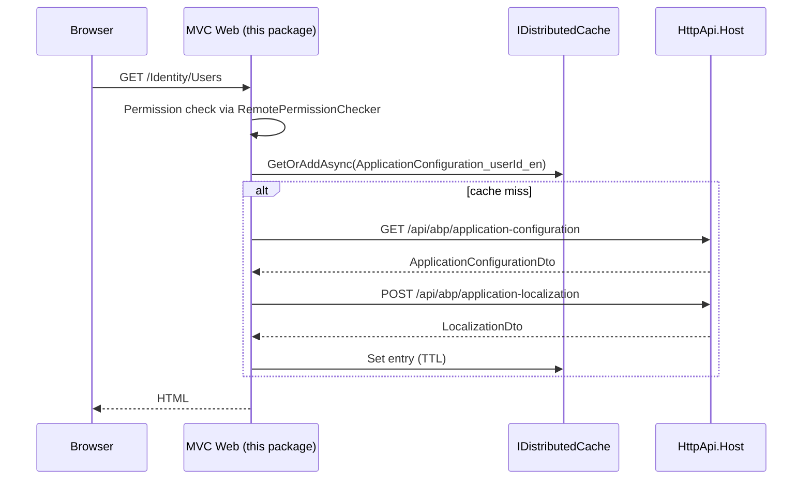

`Volo.Abp.AspNetCore.Mvc.Client` is the **MVC-only** half of the framework's tiered-client tier. In a tiered ABP solution (`*.Web` ⇄ `*.HttpApi.Host`), the MVC application doesn't host its own application services — it calls them over HTTP via dynamic client proxies. This package layers two things on top of the cross-cutting `Mvc.Client.Common`:

1. An **MVC-specific cache for `ApplicationConfigurationDto`** that uses both `HttpContext.Items` (per-request) and `IDistributedCache` (cross-request) — so each Razor request hits the API at most once for permissions/settings/features even when many pages share the same configuration.
2. **`MvcRemoteTenantStore`** — an `ITenantStore` implementation that asks the remote `AbpTenantController` for tenant info and caches results the same way.
3. A **local event handler** that invalidates the distributed cache entry whenever a `CurrentApplicationConfigurationCacheResetEventData` is published (e.g. after the user's permissions change).
4. **Development-time defaults** that shorten the cache TTL to 5 seconds so changes are visible quickly.

Compare to `Mvc.Client.Common` ([next page](/framework/ui-mvc/mvc-client-common)), which contains the **shared bits** (remote permission/setting/feature checkers, dynamic proxy registration, the cached-configuration interface).

## Package layout

```text framework/src/Volo.Abp.AspNetCore.Mvc.Client/
Volo/Abp/AspNetCore/Mvc/Client/
  AbpAspNetCoreMvcClientModule.cs
  AbpAspNetCoreMvcClientCacheOptions.cs
  MvcCachedApplicationConfigurationClient.cs
  MvcCachedApplicationConfigurationClientHelper.cs
  MvcCurrentApplicationConfigurationCacheResetEventHandler.cs
  MvcRemoteTenantStore.cs
```

Six files. Everything else (the contracts, the client proxies, the localization wiring) is inherited from `Mvc.Client.Common`.

## Module

```csharp framework/src/Volo.Abp.AspNetCore.Mvc.Client/Volo/Abp/AspNetCore/Mvc/Client/AbpAspNetCoreMvcClientModule.cs
[DependsOn(
    typeof(AbpAspNetCoreMvcClientCommonModule),
    typeof(AbpEventBusModule)
)]
public class AbpAspNetCoreMvcClientModule : AbpModule
{
    public override void ConfigureServices(ServiceConfigurationContext context)
    {
        var abpHostEnvironment = context.Services.GetAbpHostEnvironment();
        if (abpHostEnvironment.IsDevelopment())
        {
            Configure<AbpAspNetCoreMvcClientCacheOptions>(options =>
            {
                options.TenantConfigurationCacheAbsoluteExpiration       = TimeSpan.FromSeconds(5);
                options.ApplicationConfigurationDtoCacheAbsoluteExpiration = TimeSpan.FromSeconds(5);
            });
        }
    }
}
```

The module body is tiny because most of the registration happens through `[ITransientDependency]` markers on the three implementations. Two things it *does* configure:

1. **Depends on `AbpEventBusModule`** so the cache-reset event handler can be triggered.
2. **Lowers cache TTLs to 5 s in `Development`** — production keeps the default 5-minute / 300-second windows.

## `AbpAspNetCoreMvcClientCacheOptions`

```csharp framework/src/Volo.Abp.AspNetCore.Mvc.Client/Volo/Abp/AspNetCore/Mvc/Client/AbpAspNetCoreMvcClientCacheOptions.cs
public class AbpAspNetCoreMvcClientCacheOptions
{
    public TimeSpan TenantConfigurationCacheAbsoluteExpiration       { get; set; }
    public TimeSpan ApplicationConfigurationDtoCacheAbsoluteExpiration { get; set; }

    public AbpAspNetCoreMvcClientCacheOptions()
    {
        TenantConfigurationCacheAbsoluteExpiration       = TimeSpan.FromMinutes(5);
        ApplicationConfigurationDtoCacheAbsoluteExpiration = TimeSpan.FromSeconds(300);
    }
}
```

Two knobs only — one for tenant lookup results, one for the full application configuration DTO (permissions, settings, features, current culture). Both default to 5 minutes; both drop to 5 seconds in `Development`.

## `MvcCachedApplicationConfigurationClient`

This is the **MVC implementation of `ICachedApplicationConfigurationClient`** declared in [`Mvc.Client.Common`](/framework/ui-mvc/mvc-client-common). Every `RemotePermissionChecker`, `RemoteSettingProvider`, `RemoteFeatureChecker` and `RemoteLanguageProvider` call lands here.

```csharp framework/src/Volo.Abp.AspNetCore.Mvc.Client/Volo/Abp/AspNetCore/Mvc/Client/MvcCachedApplicationConfigurationClient.cs
public class MvcCachedApplicationConfigurationClient
    : ICachedApplicationConfigurationClient, ITransientDependency
{
    public async Task<ApplicationConfigurationDto> GetAsync()
    {
        var cacheKey   = CreateCacheKey();
        var httpContext = HttpContextAccessor?.HttpContext;

        // 1) per-request cache (HttpContext.Items)
        if (httpContext != null
            && httpContext.Items[cacheKey] is ApplicationConfigurationDto configuration)
            return configuration;

        // 2) distributed cache (Redis / in-mem)
        configuration = (await Cache.GetOrAddAsync(
            cacheKey,
            async () => await GetRemoteConfigurationAsync(),
            () => new DistributedCacheEntryOptions
            {
                AbsoluteExpirationRelativeToNow = Options.ApplicationConfigurationDtoCacheAbsoluteExpiration
            }
        ))!;

        if (httpContext != null)
            httpContext.Items[cacheKey] = configuration;

        return configuration;
    }
}
```

The two-tier scheme is important:

- **`HttpContext.Items`** ensures that within a single Razor request, even if twenty partials each check three permissions, the configuration is fetched **once**.
- **`IDistributedCache<ApplicationConfigurationDto>`** ensures that across requests, the cost of an HTTP round-trip to `/api/abp/application-configuration` is amortised over the configured TTL.

### Remote fetch

```csharp framework/src/Volo.Abp.AspNetCore.Mvc.Client/Volo/Abp/AspNetCore/Mvc/Client/MvcCachedApplicationConfigurationClient.cs
private async Task<ApplicationConfigurationDto> GetRemoteConfigurationAsync()
{
    var config = await ApplicationConfigurationAppService.GetAsync(
        new ApplicationConfigurationRequestOptions
        {
            IncludeLocalizationResources = false
        }
    );

    var localizationDto = await ApplicationLocalizationClientProxy.GetAsync(
        new ApplicationLocalizationRequestDto
        {
            CultureName  = config.Localization.CurrentCulture.Name,
            OnlyDynamics = true
        }
    );

    config.Localization.Resources = localizationDto.Resources;

    return config;
}
```

Two HTTP calls per cache-miss:

1. The full configuration **without** localization resources (which would be huge if it contained every culture).
2. A *culture-scoped*, *dynamic-only* localization fetch — i.e. only the strings that aren't embedded in the assembly, such as those stored in the Language Texts module.

The two payloads are then stitched together on the client.

### Cache-key strategy

```csharp framework/src/Volo.Abp.AspNetCore.Mvc.Client/Volo/Abp/AspNetCore/Mvc/Client/MvcCachedApplicationConfigurationClientHelper.cs
internal static class MvcCachedApplicationConfigurationClientHelper
{
    public static string CreateCacheKey(ICurrentUser currentUser)
    {
        var userKey = currentUser.Id?.ToString("N") ?? "Anonymous";
        return $"ApplicationConfiguration_{userKey}_{CultureInfo.CurrentUICulture.Name}";
    }
}
```

Cache entries are keyed by **user + culture**. That is necessary because permissions and settings are user-scoped, and localization is culture-scoped. Anonymous users share a single "Anonymous_en" entry per culture, which keeps the cache warm for public pages.

### Sync sibling

```csharp framework/src/Volo.Abp.AspNetCore.Mvc.Client/Volo/Abp/AspNetCore/Mvc/Client/MvcCachedApplicationConfigurationClient.cs
public ApplicationConfigurationDto Get()
{
    var cacheKey = CreateCacheKey();
    var httpContext = HttpContextAccessor?.HttpContext;

    if (httpContext != null
        && httpContext.Items[cacheKey] is ApplicationConfigurationDto configuration)
        return configuration;

    return AsyncHelper.RunSync(GetAsync);
}
```

`Get()` exists so legacy synchronous code (`IPermissionChecker.IsGranted(...)`, sync `IStringLocalizer` calls) still works. It tries the per-request cache first and only falls through to `AsyncHelper.RunSync` if there is no entry — so for the typical request, no sync-over-async deadlock risk.

## `MvcRemoteTenantStore`

```csharp framework/src/Volo.Abp.AspNetCore.Mvc.Client/Volo/Abp/AspNetCore/Mvc/Client/MvcRemoteTenantStore.cs
public class MvcRemoteTenantStore : ITenantStore, ITransientDependency
{
    public async Task<TenantConfiguration?> FindAsync(string name)
    {
        var cacheKey   = CreateCacheKey(name);
        var httpContext = HttpContextAccessor?.HttpContext;

        if (httpContext != null
            && httpContext.Items[cacheKey] is TenantConfiguration tenantConfiguration)
            return tenantConfiguration;

        tenantConfiguration = (await Cache.GetOrAddAsync(
            cacheKey,
            async () => CreateTenantConfiguration(
                await TenantAppService.FindTenantByNameAsync(name))!,
            () => new DistributedCacheEntryOptions
            {
                AbsoluteExpirationRelativeToNow = Options.TenantConfigurationCacheAbsoluteExpiration
            }
        ))!;

        if (httpContext != null)
            httpContext.Items[cacheKey] = tenantConfiguration;

        return tenantConfiguration;
    }

    public async Task<TenantConfiguration?> FindAsync(Guid id)            { /* same shape, by id */ }
    public TenantConfiguration Find(string name)                          { /* sync sibling      */ }
    public TenantConfiguration Find(Guid id)                              { /* sync sibling      */ }

    protected virtual TenantConfiguration? CreateTenantConfiguration(FindTenantResultDto dto)
    {
        if (!dto.Success || dto.TenantId == null) return null;
        return new TenantConfiguration(dto.TenantId.Value, dto.Name!);
    }
}
```

The behavior mirrors `MvcCachedApplicationConfigurationClient` (per-request + distributed cache) but for tenant lookups. The remote client is `AbpTenantClientProxy` — the auto-generated proxy for the controller defined in [`mvc-ui-multitenancy`](/framework/ui-mvc/mvc-ui-multitenancy).

Replacing the default in-process `ITenantStore` is what allows a tiered MVC host to participate in multi-tenancy without having a copy of the tenant database.

## Cache eviction on permission change

```csharp framework/src/Volo.Abp.AspNetCore.Mvc.Client/Volo/Abp/AspNetCore/Mvc/Client/MvcCurrentApplicationConfigurationCacheResetEventHandler.cs
public class MvcCurrentApplicationConfigurationCacheResetEventHandler
    : ILocalEventHandler<CurrentApplicationConfigurationCacheResetEventData>,
      ITransientDependency
{
    public virtual async Task HandleEventAsync(
        CurrentApplicationConfigurationCacheResetEventData eventData)
    {
        await Cache.RemoveAsync(CreateCacheKey());
    }

    protected virtual string CreateCacheKey()
        => MvcCachedApplicationConfigurationClientHelper.CreateCacheKey(CurrentUser);
}
```

Whenever upstream code (e.g. an admin granting a new role) publishes the **`CurrentApplicationConfigurationCacheResetEventData`** local event, this handler evicts the distributed-cache entry for the current user — so the very next request fetches fresh permissions. The event itself is published by the framework's Account / Permissions controllers after impactful changes.

## How a tiered MVC request flows



## Cross-references

- The contracts (`ICachedApplicationConfigurationClient`, `RemotePermissionChecker`, …) live in [`Mvc.Client.Common`](/framework/ui-mvc/mvc-client-common).
- The local event used to evict the cache comes from [`Volo.Abp.AspNetCore.Mvc`](/framework/cross/aspnetcore-mvc).
- `IDistributedCache<T>` and its serialization plumbing are documented in [`Volo.Abp.Caching`](/framework/caching/volo-abp-caching).
- The `AbpTenantClientProxy` accessed by `MvcRemoteTenantStore` is auto-generated by [`Volo.Abp.Http.Client`](/framework/cross/http-client), against the controller in [`mvc-ui-multitenancy`](/framework/ui-mvc/mvc-ui-multitenancy).
