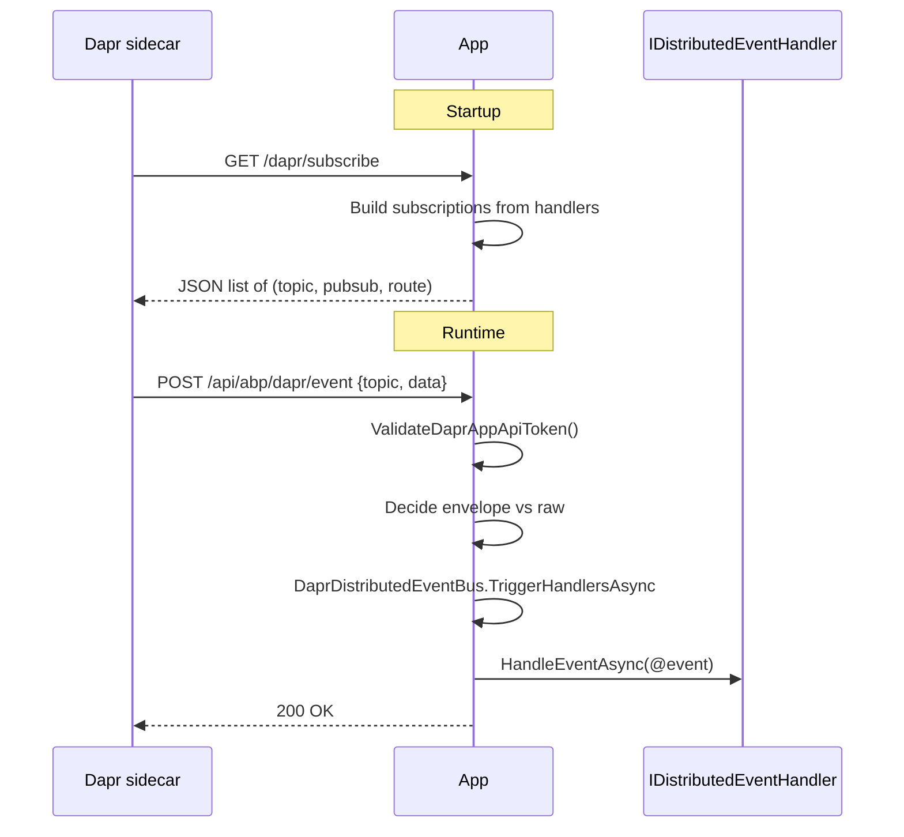

`Volo.Abp.AspNetCore.Mvc.Dapr.EventBus` is the **HTTP edge** of the ABP Dapr event-bus integration. It is what makes the sidecar know that "this application wants to subscribe to topic X on pub-sub component Y" and what receives the incoming envelopes. It does three things:

1. Maps a `GET /dapr/subscribe` endpoint that returns the subscription list — Dapr calls this once per app startup and uses the answer to configure its own subscriptions.
2. Auto-populates that subscription list from the application's **`IDistributedEventHandler<TEvent>`** registrations, so every event the app handles is automatically subscribed in Dapr.
3. Exposes a `POST /api/abp/dapr/event` controller that the sidecar invokes with the actual event payload; the controller validates the app-api-token, unwraps the envelope, and dispatches through `DaprDistributedEventBus`.

## Package layout

```text framework/src/Volo.Abp.AspNetCore.Mvc.Dapr.EventBus/
DaprAspNetCore/
  AbpDaprEndpointRouteBuilderExtensions.cs
Volo/Abp/AspNetCore/Mvc/Dapr/EventBus/
  AbpAspNetCoreMvcDaprEventBusModule.cs
  AbpAspNetCoreMvcDaprPubSubConsts.cs
  Controllers/
    AbpAspNetCoreMvcDaprEventsController.cs
```

Four files. The `DaprAspNetCore` folder is in a different root namespace because it contains code that **must live under the `Microsoft.AspNetCore.Builder` and `Dapr` namespaces** for downstream code to find it via convention (it is a fork of the official Dapr endpoint builder, prefixed with `Abp*` so the two can coexist).

## Module

```csharp framework/src/Volo.Abp.AspNetCore.Mvc.Dapr.EventBus/Volo/Abp/AspNetCore/Mvc/Dapr/EventBus/AbpAspNetCoreMvcDaprEventBusModule.cs
[DependsOn(
    typeof(AbpAspNetCoreMvcDaprModule),
    typeof(AbpEventBusDaprModule)
)]
public class AbpAspNetCoreMvcDaprEventBusModule : AbpModule
{
    public override void ConfigureServices(ServiceConfigurationContext context)
    {
        var subscribeOptions = context.Services.ExecutePreConfiguredActions<AbpSubscribeOptions>();

        Configure<AbpEndpointRouterOptions>(options =>
        {
            options.EndpointConfigureActions.Add(endpointContext =>
            {
                var rootServiceProvider = endpointContext.ScopeServiceProvider
                    .GetRequiredService<IRootServiceProvider>();

                subscribeOptions.SubscriptionsCallback = subscriptions =>
                {
                    var daprEventBusOptions = rootServiceProvider
                        .GetRequiredService<IOptions<AbpDaprEventBusOptions>>().Value;

                    foreach (var handler in rootServiceProvider
                            .GetRequiredService<IOptions<AbpDistributedEventBusOptions>>().Value.Handlers)
                    {
                        foreach (var @interface in handler.GetInterfaces()
                                .Where(x => x.IsGenericType
                                        && x.GetGenericTypeDefinition() == typeof(IDistributedEventHandler<>)))
                        {
                            var eventType = @interface.GetGenericArguments()[0];
                            var eventName = EventNameAttribute.GetNameOrDefault(eventType);

                            if (subscriptions.Any(x =>
                                    x.PubsubName == daprEventBusOptions.PubSubName
                                    && x.Topic    == eventName))
                            {
                                // Controllers with a [Topic] attribute can replace built-in event handlers.
                                continue;
                            }

                            var subscription = new AbpSubscription
                            {
                                PubsubName = daprEventBusOptions.PubSubName,
                                Topic      = eventName,
                                Route      = AbpAspNetCoreMvcDaprPubSubConsts.DaprEventCallbackUrl,
                                Metadata   = new AbpMetadata
                                {
                                    { AbpMetadata.RawPayload, "true" }
                                }
                            };

                            subscriptions.Add(subscription);
                        }
                    }
                    return Task.CompletedTask;
                };

                endpointContext.Endpoints.MapAbpSubscribeHandler(subscribeOptions);
            });
        });
    }
}
```

The interesting moves:

1. **`ExecutePreConfiguredActions<AbpSubscribeOptions>()`** — collects any `PreConfigure<AbpSubscribeOptions>` from earlier modules (e.g. an app wanting to enable raw payloads globally).
2. **`AbpEndpointRouterOptions.EndpointConfigureActions.Add(…)`** — defers the endpoint registration until ASP.NET Core builds the route table.
3. **`SubscriptionsCallback`** — runs at the time Dapr asks for the subscription list; it iterates every registered `IDistributedEventHandler<TEvent>` from `AbpDistributedEventBusOptions.Handlers` and synthesizes an `AbpSubscription` per event.
4. **`[Topic]`-attribute pre-existing entries are respected** — if a user already declared a `[Topic("MyTopic", PubsubName="X")]` controller, the auto-subscription doesn't override it.
5. **`Metadata.rawPayload = "true"`** — tells Dapr that the application speaks "raw" JSON; the controller does its own envelope parsing.
6. **`MapAbpSubscribeHandler`** — installs the `GET /dapr/subscribe` endpoint with all the synthesized subscriptions.

## Route constant

```csharp framework/src/Volo.Abp.AspNetCore.Mvc.Dapr.EventBus/Volo/Abp/AspNetCore/Mvc/Dapr/EventBus/AbpAspNetCoreMvcDaprPubSubConsts.cs
public class AbpAspNetCoreMvcDaprPubSubConsts
{
    public const string DaprEventCallbackUrl = "api/abp/dapr/event";
}
```

Single source of truth for the callback URL — used both as the `Route` value in synthesized subscriptions and as the route attribute on the controller.

## The events controller

```csharp framework/src/Volo.Abp.AspNetCore.Mvc.Dapr.EventBus/Volo/Abp/AspNetCore/Mvc/Dapr/EventBus/Controllers/AbpAspNetCoreMvcDaprEventsController.cs
[Area("abp")]
[RemoteService(Name = "abp")]
public class AbpAspNetCoreMvcDaprEventsController : AbpController
{
    [HttpPost(AbpAspNetCoreMvcDaprPubSubConsts.DaprEventCallbackUrl)]
    public virtual async Task<IActionResult> EventAsync()
    {
        HttpContext.ValidateDaprAppApiToken();

        var daprSerializer = HttpContext.RequestServices.GetRequiredService<IDaprSerializer>();
        var body = await JsonDocument.ParseAsync(HttpContext.Request.Body);

        var pubSubName = body.RootElement.GetProperty("pubsubname").GetString();
        var topic      = body.RootElement.GetProperty("topic").GetString();
        var data       = body.RootElement.GetProperty("data").GetRawText();

        if (pubSubName.IsNullOrWhiteSpace()
            || topic.IsNullOrWhiteSpace()
            || data.IsNullOrWhiteSpace())
        {
            Logger.LogError("Invalid Dapr event request.");
            return BadRequest();
        }

        var distributedEventBus = HttpContext.RequestServices
            .GetRequiredService<DaprDistributedEventBus>();

        if (IsAbpDaprEventData(data))
        {
            var daprEventData = daprSerializer
                .Deserialize(data, typeof(AbpDaprEventData))
                .As<AbpDaprEventData>();
            var eventData = daprSerializer.Deserialize(
                daprEventData.JsonData,
                distributedEventBus.GetEventType(daprEventData.Topic));

            await distributedEventBus.TriggerHandlersAsync(
                distributedEventBus.GetEventType(daprEventData.Topic),
                eventData,
                daprEventData.MessageId,
                daprEventData.CorrelationId);
        }
        else
        {
            var eventData = daprSerializer.Deserialize(
                data,
                distributedEventBus.GetEventType(topic));
            await distributedEventBus.TriggerHandlersAsync(
                distributedEventBus.GetEventType(topic),
                eventData);
        }

        return Ok();
    }
}
```

Step-by-step:

1. **`HttpContext.ValidateDaprAppApiToken()`** — guard against arbitrary callers (see [`mvc-dapr`](/framework/ui-mvc/mvc-dapr)).
2. **Parse the Dapr cloud-event envelope** — the JSON shape is `{ "pubsubname": "...", "topic": "...", "data": ... }`. ABP doesn't use Dapr's native typed deserialization because it wants raw control over the `data` field.
3. **Reject malformed requests** with a `400` and a log entry.
4. **Probe whether the payload is an `AbpDaprEventData`** (the framework's outer envelope, used to carry `MessageId` and `CorrelationId` for the inbox/outbox pattern) — if so, deserialize twice (envelope, then wrapped JSON); if not, deserialize the raw payload directly.
5. **Resolve the .NET event type by topic name** via `DaprDistributedEventBus.GetEventType(...)`, then trigger handlers.

The detection heuristic:

```csharp
protected virtual bool IsAbpDaprEventData(string data)
{
    var document = JsonDocument.Parse(data);
    var objects  = document.RootElement.EnumerateObject().ToList();
    return objects.Count == 5
        && objects.Any(x => x.Name.Equals("PubSubName",   StringComparison.CurrentCultureIgnoreCase))
        && objects.Any(x => x.Name.Equals("Topic",        StringComparison.CurrentCultureIgnoreCase))
        && objects.Any(x => x.Name.Equals("MessageId",    StringComparison.CurrentCultureIgnoreCase))
        && objects.Any(x => x.Name.Equals("JsonData",     StringComparison.CurrentCultureIgnoreCase))
        && objects.Any(x => x.Name.Equals("CorrelationId",StringComparison.CurrentCultureIgnoreCase));
}
```

Exactly five fields with those names → ABP envelope.

## The custom subscribe endpoint

Why does ABP fork Dapr's official `MapSubscribeHandler` instead of using it? Two reasons:

- The official one only returns `[Topic]`-attribute-decorated routes; ABP wants to synthesize subscriptions from the `IDistributedEventHandler<>` registrations.
- The official one doesn't expose a `SubscriptionsCallback` to allow late mutation of the response.

The forked extension class lives in `DaprAspNetCore/AbpDaprEndpointRouteBuilderExtensions.cs`. The data model:

```csharp framework/src/Volo.Abp.AspNetCore.Mvc.Dapr.EventBus/DaprAspNetCore/AbpDaprEndpointRouteBuilderExtensions.cs
namespace Dapr
{
    public class AbpSubscribeOptions
    {
        public bool EnableRawPayload { get; set; }
        public Func<List<AbpSubscription>, Task> SubscriptionsCallback { get; set; }
    }

    public class AbpSubscription
    {
        public string Topic { get; set; }
        public string PubsubName { get; set; }
        public string Route { get; set; }
        public AbpRoutes Routes { get; set; }
        public AbpMetadata Metadata { get; set; }
        public string DeadLetterTopic { get; set; }
    }

    public class AbpMetadata : Dictionary<string, string>
    {
        internal const string RawPayload = "rawPayload";
    }

    public class AbpRoutes
    {
        public string Default { get; set; }
        public List<AbpRule> Rules { get; set; }
    }

    public class AbpRule
    {
        public string Match { get; set; }   // CEL expression
        public string Path  { get; set; }
    }
}
```

And the extension itself:

```csharp framework/src/Volo.Abp.AspNetCore.Mvc.Dapr.EventBus/DaprAspNetCore/AbpDaprEndpointRouteBuilderExtensions.cs
public static IEndpointConventionBuilder MapAbpSubscribeHandler(
    this IEndpointRouteBuilder endpoints, AbpSubscribeOptions options)
{
    return endpoints.MapGet("dapr/subscribe", async context =>
    {
        // 1) collect ITopicMetadata from every endpoint
        // 2) group by (PubsubName, Topic), pick lowest-priority as default route
        // 3) compose AbpSubscription entries (with routes/rules for V2 routing)
        // 4) await options.SubscriptionsCallback(subscriptions)  ← our auto-synth runs here
        // 5) JSON-write the list
    });
}
```

The official Apache-2.0 license header is preserved at the top of the file — this is a forked copy of the original Dapr SDK code (visible in the source).

## Configuration in `Program.cs`

A typical MVC app `Program.cs`:

```csharp
builder.Services.AddApplicationAsync<MyMvcWebModule>();   // depends on AbpAspNetCoreMvcDaprEventBusModule
var app = builder.Build();
await app.InitializeApplicationAsync();
app.UseRouting();
app.UseConfiguredEndpoints();   // ABP's wrapper that runs EndpointConfigureActions → MapAbpSubscribeHandler is called here
app.Run();
```

The `UseConfiguredEndpoints` extension (from `Volo.Abp.AspNetCore`) is what calls all the registered `EndpointConfigureActions`, which is how the `dapr/subscribe` mapping ever lands in the route table.

## End-to-end



## Cross-references

- The base Dapr MVC integration and `IDaprAppApiTokenValidator` are in [`mvc-dapr`](/framework/ui-mvc/mvc-dapr).
- The `DaprDistributedEventBus`, `IDaprSerializer`, `AbpDaprEventData` envelope and `AbpDaprEventBusOptions.PubSubName` come from [`Volo.Abp.EventBus.Dapr`](/framework/cross/eventbus-dapr).
- The `IDistributedEventHandler<TEvent>` registration model is documented in [`Volo.Abp.EventBus`](/framework/core/event-bus).
- `EventNameAttribute.GetNameOrDefault(eventType)` and the inbox/outbox semantics are detailed alongside the distributed event bus pages.
- `UseConfiguredEndpoints` and `AbpEndpointRouterOptions` belong to [`Volo.Abp.AspNetCore`](/framework/cross/aspnetcore).
