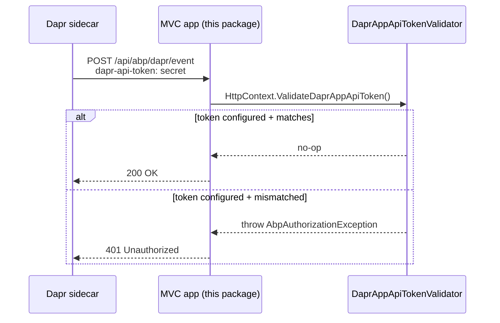

`Volo.Abp.AspNetCore.Mvc.Dapr` is a small wiring package — four source files — that gives an ASP.NET Core MVC host the minimum it needs to **accept calls from the Dapr sidecar**. Specifically it:

- Combines `AbpAspNetCoreMvcModule` and `AbpDaprModule` so the host both serves controllers and resolves Dapr configuration.
- Implements `IDaprAppApiTokenValidator` — a singleton that compares the inbound `dapr-api-token` HTTP header against the value configured for the application (a shared secret between the sidecar and the app).
- Ships `DaprHttpContextExtensions` so any Dapr-callable controller can guard itself with `HttpContext.ValidateDaprAppApiToken()` in one line.

It is the dependency that the **`Mvc.Dapr.EventBus`** package (see [`mvc-dapr-eventbus`](/framework/ui-mvc/mvc-dapr-eventbus)) builds on for the `/api/abp/dapr/event` callback.

## Package layout

```text framework/src/Volo.Abp.AspNetCore.Mvc.Dapr/
Volo/Abp/AspNetCore/Mvc/Dapr/
  AbpAspNetCoreMvcDaprModule.cs
  IDaprAppApiTokenValidator.cs
  DaprAppApiTokenValidator.cs
  DaprHttpContextExtensions.cs
```

## Module

```csharp framework/src/Volo.Abp.AspNetCore.Mvc.Dapr/Volo/Abp/AspNetCore/Mvc/Dapr/AbpAspNetCoreMvcDaprModule.cs
[DependsOn(
    typeof(AbpAspNetCoreMvcModule),
    typeof(AbpDaprModule)
)]
public class AbpAspNetCoreMvcDaprModule : AbpModule { }
```

No `ConfigureServices` body — both auxiliary classes (`DaprAppApiTokenValidator` and its interface) are registered through conventional registration thanks to the `ISingletonDependency` marker on the implementation.

| Dependency | What it pulls in |
| --- | --- |
| `AbpAspNetCoreMvcModule` | The base MVC host (controllers, model binding, error handling). |
| [`AbpDaprModule`](/framework/cross/dapr) | `IDaprApiTokenProvider`, `DaprSerializer`, `DaprClientBuilder` factory — the host-agnostic Dapr glue. |

## Why an app-API token?

Dapr injects a `dapr-api-token` header into every request it forwards from the sidecar to the application. The application can validate this token to make sure:

- The request actually came from the sidecar and not from somewhere else inside the cluster (network-level isolation).
- The token matches the value the application was configured with (rotating the token rotates trust).

`IDaprApiTokenProvider` (from `AbpDaprModule`) reads the expected value from configuration (`Dapr:AppApiToken` or environment variable); this package's validator compares it to the header.

## `IDaprAppApiTokenValidator`

```csharp framework/src/Volo.Abp.AspNetCore.Mvc.Dapr/Volo/Abp/AspNetCore/Mvc/Dapr/IDaprAppApiTokenValidator.cs
public interface IDaprAppApiTokenValidator
{
    void CheckDaprAppApiToken();
    bool IsValidDaprAppApiToken();
    string GetDaprAppApiTokenOrNull();
}
```

Three operations, three usage patterns:

1. **`CheckDaprAppApiToken()`** — *enforcing* the token. Throws `AbpAuthorizationException` if the token is missing or wrong. Use this in any controller endpoint exposed to Dapr.
2. **`IsValidDaprAppApiToken()`** — *introspecting* the token. Returns `true` / `false` without throwing. Useful for middleware that wants to branch.
3. **`GetDaprAppApiTokenOrNull()`** — reads the raw header value, for logging or for forwarding when chaining services.

## `DaprAppApiTokenValidator`

```csharp framework/src/Volo.Abp.AspNetCore.Mvc.Dapr/Volo/Abp/AspNetCore/Mvc/Dapr/DaprAppApiTokenValidator.cs
public class DaprAppApiTokenValidator : IDaprAppApiTokenValidator, ISingletonDependency
{
    protected IHttpContextAccessor HttpContextAccessor { get; }
    protected HttpContext HttpContext => GetHttpContext();

    public virtual void CheckDaprAppApiToken()
    {
        var expectedAppApiToken = GetConfiguredAppApiTokenOrNull();
        if (expectedAppApiToken.IsNullOrWhiteSpace())
            return;          // not configured → token check disabled

        var headerAppApiToken = GetDaprAppApiTokenOrNull();
        if (headerAppApiToken.IsNullOrWhiteSpace())
            throw new AbpAuthorizationException(
                "Expected Dapr App API Token is not provided! " +
                "Dapr should set the 'dapr-api-token' HTTP header.");

        if (expectedAppApiToken != headerAppApiToken)
            throw new AbpAuthorizationException(
                "The Dapr App API Token (provided in the 'dapr-api-token' HTTP header) " +
                "doesn't match the expected value!");
    }

    public virtual bool IsValidDaprAppApiToken()
    {
        var expectedAppApiToken = GetConfiguredAppApiTokenOrNull();
        if (expectedAppApiToken.IsNullOrWhiteSpace())
            return true;     // not configured → permissive

        var headerAppApiToken = GetDaprAppApiTokenOrNull();
        return expectedAppApiToken == headerAppApiToken;
    }

    public virtual string GetDaprAppApiTokenOrNull()
    {
        string apiTokenHeader = HttpContext.Request.Headers["dapr-api-token"];
        if (string.IsNullOrEmpty(apiTokenHeader) || apiTokenHeader.Length < 1)
            return null;
        return apiTokenHeader;
    }

    protected virtual string GetConfiguredAppApiTokenOrNull()
    {
        return HttpContext.RequestServices
            .GetRequiredService<IDaprApiTokenProvider>()
            .GetAppApiToken();
    }
}
```

Key behaviours:

- **Permissive when not configured** — if `Dapr:AppApiToken` is empty in `appsettings.json`, the validator returns `true` and never throws. This is the dev-time path: an unsecured Dapr sidecar is normal locally.
- **Header-name constant**: `"dapr-api-token"` (case-insensitive in `IHeaderDictionary`).
- **Throws `AbpAuthorizationException`** for both "missing" and "wrong" — both map to a 401 in the framework exception-handling middleware.
- **`virtual` everything** — a hosted application can override `GetConfiguredAppApiTokenOrNull` to pull the token from Key Vault, override `GetDaprAppApiTokenOrNull` to accept the token from a different header during migration, etc.

## `DaprHttpContextExtensions`

```csharp framework/src/Volo.Abp.AspNetCore.Mvc.Dapr/Volo/Abp/AspNetCore/Mvc/Dapr/DaprHttpContextExtensions.cs
public static class DaprHttpContextExtensions
{
    public static void ValidateDaprAppApiToken(this HttpContext httpContext)
    {
        httpContext.RequestServices
            .GetRequiredService<IDaprAppApiTokenValidator>()
            .CheckDaprAppApiToken();
    }

    public static bool IsValidDaprAppApiToken(this HttpContext httpContext)
    {
        return httpContext.RequestServices
            .GetRequiredService<IDaprAppApiTokenValidator>()
            .IsValidDaprAppApiToken();
    }

    public static string GetDaprAppApiTokenOrNull(HttpContext httpContext)
    {
        return httpContext.RequestServices
            .GetRequiredService<IDaprAppApiTokenValidator>()
            .GetDaprAppApiTokenOrNull();
    }
}
```

Three one-liners that resolve the validator from `HttpContext.RequestServices`. Use:

```csharp
[HttpPost("api/integration/work")]
public async Task<IActionResult> OnWork()
{
    HttpContext.ValidateDaprAppApiToken();   // throws on bad token
    // … real work
    return Ok();
}
```

The same pattern is what the framework-supplied Dapr event-bus controller does (next section).

## How a Dapr call flows



## Configuration

The expected token is normally read from `appsettings.json`:

```json
{
  "Dapr": {
    "AppApiToken": "00000000-0000-0000-0000-000000000000"
  }
}
```

`IDaprApiTokenProvider` (defined in `AbpDaprModule`) is the indirection — it can be replaced if you keep the token in a secret store or rotate it through an environment variable.

## Common usage patterns

### Decorating a Dapr-only controller

If you have a controller that should only be reachable from the sidecar, mix in the validator at the top of every action:

```csharp
[Area("integration")]
[Route("api/integration/orders")]
public class OrderProcessingController : AbpController
{
    [HttpPost("paid")]
    public async Task<IActionResult> OnPaidAsync([FromBody] OrderPaidPayload payload)
    {
        HttpContext.ValidateDaprAppApiToken();
        // …handle the event…
        return Ok();
    }
}
```

Because the validator is **silently permissive when `Dapr:AppApiToken` is unset**, the same code runs unchanged in local dev (no token configured, no enforcement) and in production (token configured, enforced).

### Mounting a global filter

If every controller in a *separate* host should be guarded, register a global filter:

```csharp
public class DaprAppApiTokenFilter : IAsyncActionFilter
{
    public async Task OnActionExecutionAsync(
        ActionExecutingContext context, ActionExecutionDelegate next)
    {
        context.HttpContext.ValidateDaprAppApiToken();
        await next();
    }
}

services.AddControllers(options => options.Filters.Add<DaprAppApiTokenFilter>());
```

### Inspecting the token

For audit logging, use the introspection overload and don't throw:

```csharp
public async Task<IActionResult> OnHookAsync()
{
    var token = HttpContext.GetDaprAppApiTokenOrNull();
    if (!HttpContext.IsValidDaprAppApiToken())
    {
        Logger.LogWarning("Unauthenticated webhook call. Token: {Token}", token);
        return Unauthorized();
    }
    return Ok();
}
```

## Test seam

Because all the validator members are `virtual`, unit tests can derive a fake validator and replace `IDaprAppApiTokenValidator` in the test container:

```csharp
public class AcceptingDaprAppApiTokenValidator : DaprAppApiTokenValidator
{
    public AcceptingDaprAppApiTokenValidator(IHttpContextAccessor accessor)
        : base(accessor) { }
    public override void CheckDaprAppApiToken() { /* no-op */ }
    public override bool IsValidDaprAppApiToken() => true;
}
```

…and register with `[Dependency(ReplaceServices = true)]` for the test module. No production code path needs changing.

## Cross-references

- The host-agnostic Dapr glue (the API-token provider, the serializer, the client factory) lives in [`Volo.Abp.Dapr`](/framework/cross/dapr).
- The package that consumes this validator to expose the `dapr/event` endpoint is [`mvc-dapr-eventbus`](/framework/ui-mvc/mvc-dapr-eventbus).
- For the Dapr-aware distributed event bus implementation that publishes events through the sidecar, see [`Volo.Abp.EventBus.Dapr`](/framework/cross/eventbus-dapr).
- For the controller-side error handling that turns `AbpAuthorizationException` into a 401, see [`Volo.Abp.AspNetCore`](/framework/cross/aspnetcore).
