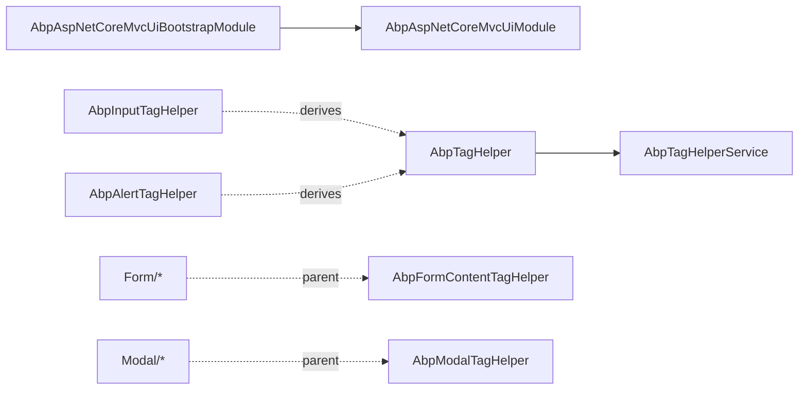

`Volo.Abp.AspNetCore.Mvc.UI.Bootstrap` ships a complete library of **`abp-*` Razor tag helpers** that emit Bootstrap-5 markup. Every theme that depends on this package (the MVC Basic theme, LeptonX, every CMS-kit page) writes UI in terms of `<abp-button>`, `<abp-input>`, `<abp-modal>` rather than handwritten Bootstrap HTML, which lets the framework:

- inject localized labels, validation attributes, and disabled/required affordances automatically;
- keep markup neutral so a future Bootstrap upgrade is a single-package change;
- attach common behaviours (busy spinners, modal stacking, info tooltips) once.

This page is a tour of the helper hierarchy, the major helper families and their attributes, with cross-references to the concrete classes.

## Package layout

```text framework/src/Volo.Abp.AspNetCore.Mvc.UI.Bootstrap/
AbpAspNetCoreMvcUiBootstrapModule.cs
Microsoft/AspNetCore/Razor/TagHelpers/AbpTagHelperAttributeListExtensions.cs
TagHelpers/
  AbpTagHelper.cs
  AbpTagHelperLocalizer.cs
  AbpTagHelperService.cs
  IAbpTagHelperLocalizer.cs
  IAbpTagHelperService.cs
  TagBuilderExtensions.cs
  FontIconType.cs
  HtmlHeadingType.cs
  Alert/      Badge/      Blockquote/   Border/
  Breadcrumb/ Button/     Card/         Carousel/
  Collapse/   Dropdown/   Extensions/   Figure/
  Form/       Grid/       ListGroup/    Modal/
  Nav/        Pagination/ Popover/      ProgressBar/
  Tab/        Table/      Tooltip/      Utils/
```

251 `.cs` files total, organised one folder per Bootstrap component family.

## Module

```csharp framework/src/Volo.Abp.AspNetCore.Mvc.UI.Bootstrap/AbpAspNetCoreMvcUiBootstrapModule.cs
[DependsOn(typeof(AbpAspNetCoreMvcUiModule))]
public class AbpAspNetCoreMvcUiBootstrapModule : AbpModule
{
    public override void ConfigureServices(ServiceConfigurationContext context)
    {
        Configure<AbpVirtualFileSystemOptions>(options =>
        {
            options.FileSets.AddEmbedded<AbpAspNetCoreMvcUiBootstrapModule>(
                "Volo.Abp.AspNetCore.Mvc.UI.Bootstrap");
        });
    }
}
```

The module embeds its Razor partials/JS assets and inherits everything from [`Volo.Abp.AspNetCore.Mvc.UI`](/framework/ui-mvc/mvc-ui). No additional service registrations are needed — each tag helper has the `[ITransientDependency]` marker (via the base class) so the conventional registrar picks them up automatically.

## The tag-helper base sandwich

Every `abp-*` tag helper inherits a two-class sandwich: a thin **helper** that exposes attributes (so Razor / tooling can see them) plus a fat **service** that contains the rendering logic. This pattern keeps the helper itself purely declarative and the service unit-testable.

```csharp framework/src/Volo.Abp.AspNetCore.Mvc.UI.Bootstrap/TagHelpers/AbpTagHelper.cs
public abstract class AbpTagHelper : TagHelper, ITransientDependency { }

public abstract class AbpTagHelper<TTagHelper, TService> : AbpTagHelper
    where TTagHelper : AbpTagHelper<TTagHelper, TService>
    where TService   : class, IAbpTagHelperService<TTagHelper>
{
    protected TService Service { get; }
    public override int Order => Service.Order;

    [HtmlAttributeNotBound, ViewContext]
    public ViewContext ViewContext { get; set; } = default!;

    protected AbpTagHelper(TService service)
    {
        Service = service;
        Service.As<AbpTagHelperService<TTagHelper>>().TagHelper = (TTagHelper)this;
    }

    public override void Init(TagHelperContext context)             => Service.Init(context);
    public override void Process(TagHelperContext c, TagHelperOutput o) => Service.Process(c, o);
    public override Task ProcessAsync(TagHelperContext c, TagHelperOutput o)
        => Service.ProcessAsync(c, o);
}
```

```csharp framework/src/Volo.Abp.AspNetCore.Mvc.UI.Bootstrap/TagHelpers/IAbpTagHelperService.cs
public interface IAbpTagHelperService<TTagHelper> : ITransientDependency
    where TTagHelper : TagHelper
{
    TTagHelper TagHelper { get; }
    int Order { get; }
    void Init(TagHelperContext context);
    void Process(TagHelperContext context, TagHelperOutput output);
    Task ProcessAsync(TagHelperContext context, TagHelperOutput output);
}
```

A concrete service derives from `AbpTagHelperService<TTagHelper>`, which exposes shared placeholders used by the parent/child helpers (for tabs, forms, accordions) so a parent can stash content for a child to slot in later:

```csharp framework/src/Volo.Abp.AspNetCore.Mvc.UI.Bootstrap/TagHelpers/AbpTagHelperService.cs
protected const string FormGroupContents = "FormGroupContents";
protected const string TabItems = "TabItems";
protected const string AccordionItems = "AccordionItems";
protected const string BreadcrumbItemsContent = "BreadcrumbItemsContent";
protected const string CarouselItemsContent = "CarouselItemsContent";
protected const string TabItemsDataTogglePlaceHolder = "{_data_toggle_Placeholder_}";
// …more
```

## Buttons

```csharp framework/src/Volo.Abp.AspNetCore.Mvc.UI.Bootstrap/TagHelpers/Button/AbpButtonTagHelper.cs
[HtmlTargetElement("abp-button", TagStructure = TagStructure.NormalOrSelfClosing)]
public class AbpButtonTagHelper : AbpTagHelper<AbpButtonTagHelper, AbpButtonTagHelperService>, IButtonTagHelperBase
{
    public AbpButtonType ButtonType { get; set; } = AbpButtonType.Default;
    public AbpButtonSize Size       { get; set; } = AbpButtonSize.Default;
    public string?       BusyText   { get; set; }
    public string?       Text       { get; set; }
    public string?       Icon       { get; set; }
    public bool?         Disabled   { get; set; }
    public FontIconType  IconType   { get; set; } = FontIconType.FontAwesome;
    public bool BusyTextIsHtml { get; set; }
}
```

```csharp framework/src/Volo.Abp.AspNetCore.Mvc.UI.Bootstrap/TagHelpers/Button/AbpButtonType.cs
public enum AbpButtonType
{
    Default, Primary, Secondary, Success, Danger, Warning, Info, Light, Dark,
    Outline_Primary, Outline_Secondary, Outline_Success, Outline_Danger,
    Outline_Warning, Outline_Info, Outline_Light, Outline_Dark,
    Link
}
```

```csharp framework/src/Volo.Abp.AspNetCore.Mvc.UI.Bootstrap/TagHelpers/Button/AbpButtonSize.cs
public enum AbpButtonSize { Default, Small, Medium, Large, /* obsolete Block sizes */ }
```

Usage:

```cshtml
<abp-button button-type="Primary" size="Large" icon="save" text="@L["Save"]" busy-text="@L["Saving"]" />

<abp-button-toolbar>
    <abp-button-group>
        <abp-button button-type="Outline_Secondary" text="@L["Cancel"]" />
        <abp-button button-type="Primary" type="submit" text="@L["Save"]" />
    </abp-button-group>
</abp-button-toolbar>
```

Related helpers in `Button/`: `AbpButtonGroupTagHelper`, `AbpButtonToolbarTagHelper`, `AbpLinkButtonTagHelper` (renders an `<a>` styled as a button).

## Forms

Forms are the largest family. The headliner is `<abp-input>`, which inspects an `asp-for` model expression, picks the right Bootstrap input (text, number, checkbox, select, datepicker…), pulls the validator attributes, generates a label, attaches an info tooltip — all in one tag.

```csharp framework/src/Volo.Abp.AspNetCore.Mvc.UI.Bootstrap/TagHelpers/Form/AbpInputTagHelper.cs
public class AbpInputTagHelper : AbpTagHelper<AbpInputTagHelper, AbpInputTagHelperService>
{
    public ModelExpression AspFor { get; set; } = default!;
    public string? Label { get; set; }
    public string? LabelTooltip { get; set; }
    public string  LabelTooltipIcon { get; set; } = "bi-info-circle";
    public string  LabelTooltipPlacement { get; set; } = "right";
    public bool    LabelTooltipHtml { get; set; }

    [HtmlAttributeName("info")]
    public string? InfoText { get; set; }

    [HtmlAttributeName("disabled")] public bool IsDisabled { get; set; }
    [HtmlAttributeName("readonly")] public bool? IsReadonly { get; set; }
    public bool AutoFocus { get; set; }

    [HtmlAttributeName("type")] public string? InputTypeName { get; set; }

    public AbpFormControlSize Size { get; set; } = AbpFormControlSize.Default;
    [HtmlAttributeName("required-symbol")] public bool DisplayRequiredSymbol { get; set; } = true;
    [HtmlAttributeName("asp-format")] public string? Format { get; set; }
    public string? Name { get; set; }
    public string? Value { get; set; }
    public bool SuppressLabel { get; set; }
    [HtmlAttributeName("floating-label")] public bool FloatingLabel { get; set; }
    public CheckBoxHiddenInputRenderMode? CheckBoxHiddenInputRenderMode { get; set; }
}
```

Other form helpers:

| Helper | Purpose |
| --- | --- |
| `AbpFormContentTagHelper` (`<abp-form-content/>`) | A placeholder inside `<form>` that gets replaced with all dynamic form fields. |
| `AbpDynamicformTagHelper` (`<abp-dynamic-form>`) | Inspects a model and emits an `<abp-input>` per property; honours `DynamicFormIgnoreAttribute`, `DisplayOrderAttribute`. |
| `AbpRadioInputTagHelper` | Renders a radio group from `IEnumerable<AbpRadioButton>`. |
| `AbpSelectTagHelper` (`<abp-select>`) | A select that respects `[SelectItems]` and validation attributes. |
| `AbpValidationAttributeTagHelper` | Renders `<span asp-validation-for>`-style summary blocks. |
| `DatePicker/` | Bootstrap-datepicker integration. |

## Modals

```csharp framework/src/Volo.Abp.AspNetCore.Mvc.UI.Bootstrap/TagHelpers/Modal/AbpModalTagHelper.cs
public class AbpModalTagHelper : AbpTagHelper<AbpModalTagHelper, AbpModalTagHelperService>
{
    public AbpModalSize Size { get; set; } = AbpModalSize.Default;
    public bool? Centered  { get; set; } = false;
    public bool? Scrollable{ get; set; } = false;
    public bool? Static    { get; set; } = false;
}
```

```csharp framework/src/Volo.Abp.AspNetCore.Mvc.UI.Bootstrap/TagHelpers/Modal/AbpModalSize.cs
public enum AbpModalSize
{
    Default, Small, Large, ExtraLarge,
    Fullscreen, FullscreenSmDown, FullscreenMdDown,
    FullscreenLgDown, FullscreenXlDown, FullscreenXxlDown
}
```

Child helpers compose the `.modal-dialog/.modal-content` Bootstrap structure:

```csharp framework/src/Volo.Abp.AspNetCore.Mvc.UI.Bootstrap/TagHelpers/Modal/AbpModalHeaderTagHelper.cs
public class AbpModalHeaderTagHelper : AbpTagHelper<AbpModalHeaderTagHelper, AbpModalHeaderTagHelperService>
{
    public string Title { get; set; } = default!;
}
```

```csharp framework/src/Volo.Abp.AspNetCore.Mvc.UI.Bootstrap/TagHelpers/Modal/AbpModalFooterTagHelper.cs
[HtmlTargetElement("abp-modal-footer")]
public class AbpModalFooterTagHelper : AbpTagHelper<AbpModalFooterTagHelper, AbpModalFooterTagHelperService>
{
    public AbpModalButtons Buttons        { get; set; }
    public ButtonsAlign    ButtonAlignment { get; set; } = ButtonsAlign.Default;
}
```

Usage:

```cshtml
<abp-modal size="Large" centered="true" static="true">
    <abp-modal-header title="@L["EditUser"]" />
    <abp-modal-body>
        <form id="EditUserForm" asp-page="./Index">
            <abp-input asp-for="@Model.UserName" />
            <abp-input asp-for="@Model.Email" />
        </form>
    </abp-modal-body>
    <abp-modal-footer buttons="Cancel|Save" button-alignment="Right" />
</abp-modal>
```

## Alerts

```csharp framework/src/Volo.Abp.AspNetCore.Mvc.UI.Bootstrap/TagHelpers/Alert/AbpAlertTagHelper.cs
public class AbpAlertTagHelper : AbpTagHelper<AbpAlertTagHelper, AbpAlertTagHelperService>
{
    public AlertType AlertType { get; set; } = AlertType.Default;
    public bool? Dismissible { get; set; }
}
```

```cshtml
<abp-alert alert-type="Success" dismissible="true">
    <abp-alert-header>@L["Saved"]</abp-alert-header>
    @L["TheRecordWasUpdated"]
    <abp-alert-link href="/Identity/Users">@L["BackToList"]</abp-alert-link>
</abp-alert>
```

`AlertType` is the same enum used by `IAlertManager` (see [`mvc-ui`](/framework/ui-mvc/mvc-ui)), so server-queued alerts and inline `<abp-alert>` tags pick the same Bootstrap classes.

## Badge

```csharp framework/src/Volo.Abp.AspNetCore.Mvc.UI.Bootstrap/TagHelpers/Badge/AbpBadgeTagHelper.cs
[HtmlTargetElement("a",    Attributes = "abp-badge")]
[HtmlTargetElement("span", Attributes = "abp-badge")]
[HtmlTargetElement("a",    Attributes = "abp-badge-pill")]
[HtmlTargetElement("span", Attributes = "abp-badge-pill")]
public class AbpBadgeTagHelper : AbpTagHelper<AbpBadgeTagHelper, AbpBadgeTagHelperService>
{
    [HtmlAttributeName("abp-badge")]      public AbpBadgeType BadgeType    { get; set; } = AbpBadgeType._;
    [HtmlAttributeName("abp-badge-pill")] public AbpBadgeType BadgePillType { get; set; } = AbpBadgeType._;
}
```

Badge is one of the few helpers that targets existing HTML elements (`<a>`, `<span>`) instead of introducing a new tag, so you can do `<span abp-badge="Danger">3</span>`.

## Other families

The folder layout mirrors the Bootstrap component list:

| Folder | Headline tag(s) | Typical use |
| --- | --- | --- |
| `Breadcrumb/` | `<abp-breadcrumb>`, `<abp-breadcrumb-item>` | Static breadcrumb (the dynamic one comes from `PageLayout.BreadCrumb`). |
| `Card/` | `<abp-card>`, `<abp-card-header>`, `<abp-card-body>`, `<abp-card-footer>`, `<abp-card-image>` | Page sections, dashboard tiles. |
| `Carousel/` | `<abp-carousel>` | Image slider. |
| `Collapse/` | `<abp-collapse>` | Accordion bodies. |
| `Dropdown/` | `<abp-dropdown>`, `<abp-dropdown-button>`, `<abp-dropdown-item>` | Action menus on rows / toolbars. |
| `Figure/` | `<abp-figure>` | Captioned image. |
| `Grid/` | `<abp-row>`, `<abp-column>` | Bootstrap 12-column shortcuts. |
| `ListGroup/` | `<abp-list-group>`, `<abp-list-group-item>` | Sidebars, settings menus. |
| `Nav/` | `<abp-nav>`, `<abp-nav-item>`, `<abp-nav-link>` | Custom nav bars. |
| `Pagination/` | `<abp-paginator>` | Goes with `PagerModel`. |
| `Popover/` | `<abp-popover>` | Wraps Bootstrap popover JS. |
| `ProgressBar/` | `<abp-progress-bar>` | Loaders, percentage bars. |
| `Tab/` | `<abp-tabs>`, `<abp-tab>` | Tabbed forms. |
| `Table/` | `<abp-table>`, `<abp-table-column>` | Styled tables (DataTables wiring is separate). |
| `Tooltip/` | `<abp-tooltip>` | Pop-up tip on hover. |
| `Border/` | `<abp-border>`, `<abp-rounded>` | Bootstrap border utility wrappers. |
| `Blockquote/` | `<abp-blockquote>` | Styled quote block. |
| `Utils/` | Various | Shared helpers used by other folders. |

## Localizer abstraction

```csharp framework/src/Volo.Abp.AspNetCore.Mvc.UI.Bootstrap/TagHelpers/IAbpTagHelperLocalizer.cs
public interface IAbpTagHelperLocalizer
{
    string GetLocalizedText(string text, ModelExplorer explorer);
}
```

`AbpTagHelperLocalizer` resolves the right `IStringLocalizer` for the `ModelExpression` being rendered (typically the resource declared on the model's type or its module). This is how `<abp-input asp-for="UserName">` automatically picks up `[Display(Name="…")]` localization without each helper needing to plumb a localizer manually.

## Composition



## Cross-references

- The `AlertType` enum used by `<abp-alert>` is documented in [`mvc-ui`](/framework/ui-mvc/mvc-ui).
- The vendor packs that drop the underlying Bootstrap/jQuery files are catalogued in [`mvc-ui-packages`](/framework/ui-mvc/mvc-ui-packages).
- The `<abp-script>` / `<abp-style>` / `<abp-script-bundle>` / `<abp-style-bundle>` family lives in [`mvc-ui-bundling`](/framework/ui-mvc/mvc-ui-bundling).
- The CSS itself is loaded by the global bundle defined in [`mvc-ui-theme-shared`](/framework/ui-mvc/mvc-ui-theme-shared).
