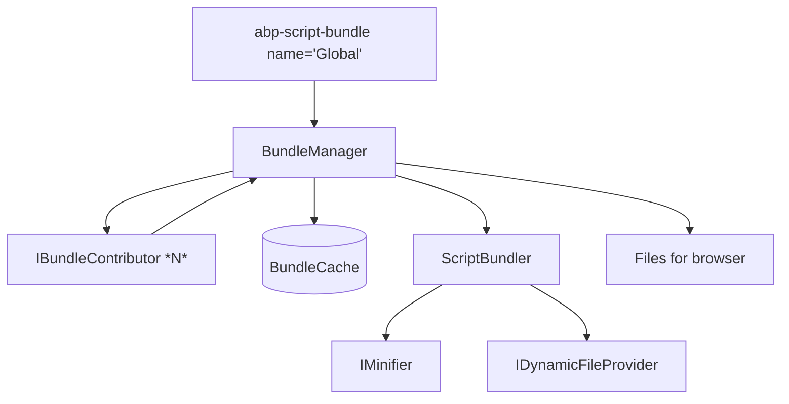

`Volo.Abp.AspNetCore.Mvc.UI.Bundling` is the **runtime** of the ABP bundling pipeline. While the abstractions package ([mvc-ui-bundling-abstractions](/framework/ui-mvc/mvc-ui-bundling-abstractions)) defines what a *contributor*, a *bundle configuration* and the *bundling options* look like, this package contains:

- `BundleManager` — runs contributors, computes the bundle hash, and stitches files together;
- `BundlerBase` + `ScriptBundler` / `StyleBundler` — the actual file-content concatenation, with pre-minified file detection;
- `BundleCache` — singleton cache keyed by bundle relative path;
- `WebRequestResources` — request-scoped deduplication of files already emitted;
- `AbpScriptBundleTagHelper`, `AbpStyleBundleTagHelper`, `AbpScriptTagHelper`, `AbpStyleTagHelper` — the Razor surface.

## Package layout

```text framework/src/Volo.Abp.AspNetCore.Mvc.UI.Bundling/
Volo/Abp/AspNetCore/Mvc/UI/Bundling/
  AbpAspNetCoreMvcUiBundlingModule.cs
  AbpBundleContributorOptions.cs
  BundleManager.cs
  IBundleManager.cs
  BundleCache.cs
  BundleCacheItem.cs
  IBundleCache.cs
  BundlerBase.cs
  IBundler.cs
  BundlerContext.cs
  IBundlerContext.cs
  BundleResult.cs
  Scripts/
    IScriptBundler.cs
    ScriptBundler.cs
  Styles/
    IStyleBundler.cs
    StyleBundler.cs
    CssRelativePath.cs
  TagHelpers/
    AbpScriptTagHelper.cs / AbpScriptTagHelperService.cs
    AbpStyleTagHelper.cs  / AbpStyleTagHelperService.cs
    AbpScriptBundleTagHelper.cs / AbpScriptBundleTagHelperService.cs
    AbpStyleBundleTagHelper.cs  / AbpStyleBundleTagHelperService.cs
    AbpBundleTagHelper.cs / AbpBundleItemTagHelper.cs / …
    BundleTagHelperContributorTypeItem.cs
    BundleTagHelperFileItem.cs
    BundleTagHelperItem.cs
    ScriptNonceTagHelper.cs
    IBundleTagHelper.cs / IBundleItemTagHelper.cs
  Resources/
    IWebRequestResources.cs
    WebRequestResources.cs
```

## Module

```csharp framework/src/Volo.Abp.AspNetCore.Mvc.UI.Bundling/Volo/Abp/AspNetCore/Mvc/UI/Bundling/AbpAspNetCoreMvcUiBundlingModule.cs
[DependsOn(
    typeof(AbpAspNetCoreMvcUiBootstrapModule),
    typeof(AbpMinifyModule),
    typeof(AbpAspNetCoreMvcUiBundlingAbstractionsModule)
)]
public class AbpAspNetCoreMvcUiBundlingModule : AbpModule { }
```

| Dependency | Provides |
| --- | --- |
| `AbpAspNetCoreMvcUiBootstrapModule` | The tag-helper sandwich base class used by `AbpScriptBundleTagHelper` etc. |
| [`AbpMinifyModule`](/framework/ui-mvc/minify) | `IJavascriptMinifier`, `ICssMinifier` (NUglify under the hood). |
| [`AbpAspNetCoreMvcUiBundlingAbstractionsModule`](/framework/ui-mvc/mvc-ui-bundling-abstractions) | `AbpBundlingOptions`, `BundleConfigurationCollection`, `IBundleContributor`. |

## The `BundleManager`

`BundleManager` is the orchestrator — every other piece in the package exists to support it.

```csharp framework/src/Volo.Abp.AspNetCore.Mvc.UI.Bundling/Volo/Abp/AspNetCore/Mvc/UI/Bundling/BundleManager.cs
public class BundleManager : IBundleManager, ITransientDependency
{
    public virtual async Task<IReadOnlyList<string>> GetStyleBundleFilesAsync(string bundleName)
        => await GetBundleFilesAsync(Options.StyleBundles, bundleName, StyleBundler);

    public virtual async Task<IReadOnlyList<string>> GetScriptBundleFilesAsync(string bundleName)
        => await GetBundleFilesAsync(Options.ScriptBundles, bundleName, ScriptBundler);
}
```

The interface only has those two methods, and they answer **"what files must the browser load to receive this bundle?"** — that may be a single bundled file in production or many raw files in development.

### File aggregation

```csharp framework/src/Volo.Abp.AspNetCore.Mvc.UI.Bundling/Volo/Abp/AspNetCore/Mvc/UI/Bundling/BundleManager.cs
protected virtual async Task<IReadOnlyList<string>> GetBundleFilesAsync(
    BundleConfigurationCollection bundles, string bundleName, IBundler bundler)
{
    var contributors      = GetContributors(bundles, bundleName);
    var bundleFiles       = RequestResources.TryAdd(await GetBundleFilesAsync(contributors));
    var dynamicResources  = RequestResources.TryAdd(await GetDynamicResourcesAsync(contributors));

    if (!IsBundlingEnabled())
    {
        return bundleFiles.Union(dynamicResources).ToImmutableList();
    }

    var bundleRelativePath =
        Options.BundleFolderName.EnsureEndsWith('/') +
        bundleName + "." + bundleFiles.JoinAsString("|").ToMd5() + "." + bundler.FileExtension;

    var cacheItem = BundleCache.GetOrAdd(bundleRelativePath, () =>
    {
        var cacheValue = new BundleCacheItem(new List<string> { "/" + bundleRelativePath });
        WatchChanges(cacheValue, bundleFiles, bundleRelativePath);

        var bundleResult = bundler.Bundle(
            new BundlerContext(bundleRelativePath, bundleFiles, IsMinficationEnabled())
        );
        SaveBundleResult(bundleRelativePath, bundleResult);
        return cacheValue;
    });

    return cacheItem.Files.Union(dynamicResources).ToImmutableList();
}
```

Step-by-step:

1. **Resolve contributors** for the requested bundle name, including any base bundles (recursive) and any `AbpBundleContributorOptions` extensions.
2. **Run contributors** (`PreConfigureBundleAsync` → `ConfigureBundleAsync` → `PostConfigureBundleAsync`) to collect a deduplicated list of files.
3. **Run `ConfigureDynamicResourcesAsync`** to collect files that must always be emitted as separate `<script>` / `<link>` tags (e.g. localization scripts that change per request).
4. **If bundling is disabled** (development by default), return the raw file list.
5. Otherwise compute the bundle's relative path:
   ```
   __bundles/{bundleName}.{md5(file list)}.{js|css}
   ```
   The MD5 guarantees the URL changes whenever any contributor changes its file list, which gives free cache-busting.
6. **`GetOrAdd`** in the singleton `BundleCache` — first request builds the bundle by calling the `Bundler`, subsequent requests get the cached relative path.
7. **`WatchChanges`** subscribes to the web-root `IFileProvider`. If any included file changes, the cache entry and the dynamic file are evicted, so the next request rebuilds.
8. **`SaveBundleResult`** registers the bundled content in `IDynamicFileProvider` under `/wwwroot/{bundleRelativePath}` so the static-files middleware can serve it.

### Mode → minify decision

```csharp framework/src/Volo.Abp.AspNetCore.Mvc.UI.Bundling/Volo/Abp/AspNetCore/Mvc/UI/Bundling/BundleManager.cs
protected virtual bool IsBundlingEnabled() => Options.Mode switch
{
    BundlingMode.None             => false,
    BundlingMode.Bundle           => true,
    BundlingMode.BundleAndMinify  => true,
    BundlingMode.Auto             => !HostingEnvironment.IsDevelopment(),
    _ => throw new AbpException($"Unhandled {nameof(BundlingMode)}: {Options.Mode}")
};

protected virtual bool IsMinficationEnabled() => Options.Mode switch
{
    BundlingMode.None or BundlingMode.Bundle => false,
    BundlingMode.BundleAndMinify             => true,
    BundlingMode.Auto                        => !HostingEnvironment.IsDevelopment(),
    _ => throw new AbpException($"Unhandled {nameof(BundlingMode)}: {Options.Mode}")
};
```

`BundlingMode.Auto` is the default — it produces raw files for `dotnet run` and a single minified bundle in production.

### Contributor resolution

```csharp framework/src/Volo.Abp.AspNetCore.Mvc.UI.Bundling/Volo/Abp/AspNetCore/Mvc/UI/Bundling/BundleManager.cs
protected virtual List<IBundleContributor> GetContributors(BundleConfigurationCollection bundles, string bundleName)
{
    var contributors = new List<IBundleContributor>();
    AddContributorsWithBaseBundles(contributors, bundles, bundleName);

    for (var i = 0; i < contributors.Count; ++i)
    {
        var extensions = ContributorOptions.Extensions(contributors[i].GetType()).GetAll();
        if (extensions.Count > 0)
        {
            contributors.InsertRange(i + 1, extensions);
            i += extensions.Count;
        }
    }
    return contributors;
}

protected virtual void AddContributorsWithBaseBundles(
    List<IBundleContributor> contributors, BundleConfigurationCollection bundles, string bundleName)
{
    var bundleConfiguration = bundles.Get(bundleName);
    foreach (var baseBundleName in bundleConfiguration.BaseBundles)
        AddContributorsWithBaseBundles(contributors, bundles, baseBundleName); // recursive

    var selfContributors = bundleConfiguration.Contributors.GetAll();
    if (selfContributors.Any())
        contributors.AddRange(selfContributors);
}
```

Two extension mechanisms come together here:

- **`BaseBundles`** — a bundle can inherit one or more other bundles. The Theme.Shared `Global` bundle uses this to chain `Core` + `JQuery` + `Bootstrap` + …
- **`AbpBundleContributorOptions.Extensions(typeof(X))`** — a way for a downstream module to **append files to an existing contributor** (e.g. add a fingerprinting script after `BootstrapScriptContributor` without modifying the bundle definition).

## The bundlers

```csharp framework/src/Volo.Abp.AspNetCore.Mvc.UI.Bundling/Volo/Abp/AspNetCore/Mvc/UI/Bundling/BundlerBase.cs
public abstract class BundlerBase : IBundler, ITransientDependency
{
    private static string[] _minFileSuffixes = { "min", "prod" };

    public abstract string FileExtension { get; }

    public BundleResult Bundle(IBundlerContext context)
    {
        var bundleContentBuilder = new StringBuilder();
        foreach (var file in context.ContentFiles)
            AddFileToBundle(context, bundleContentBuilder, file);

        return new BundleResult(bundleContentBuilder.ToString());
    }
}
```

The interesting bit is `GetFileContentConsideringMinification`:

1. If bundling-but-not-minifying, or if the file is on `MinificationIgnoredFiles`, **append raw**.
2. If a sibling `*.min.{ext}` / `*.prod.{ext}` exists, **prefer it over re-minifying** — vendors usually ship pre-minified files smaller than NUglify's output.
3. Otherwise call `Minifier.Minify(...)` (NUglify; see [`minify`](/framework/ui-mvc/minify)). If minification throws, log a warning and append the raw content — bundling never breaks the page.

### Script flavour

```csharp framework/src/Volo.Abp.AspNetCore.Mvc.UI.Bundling/Volo/Abp/AspNetCore/Mvc/UI/Bundling/Scripts/ScriptBundler.cs
public class ScriptBundler : BundlerBase, IScriptBundler
{
    public override string FileExtension => "js";

    protected override string ProcessBeforeAddingToTheBundle(
        IBundlerContext context, string filePath, string fileContent)
    {
        return fileContent.EnsureEndsWith(';') + Environment.NewLine;
    }
}
```

It adds a `;` between files to prevent two files ending in expressions from merging incorrectly.

### Style flavour

`StyleBundler` rewrites relative URLs inside CSS so that `url('../fonts/font.ttf')` inside `/libs/fa/css/all.css` still resolves after the bundle is served from `/__bundles/Global.{hash}.css`. The rewriter lives in `Styles/CssRelativePath.cs`.

## Caching

```csharp framework/src/Volo.Abp.AspNetCore.Mvc.UI.Bundling/Volo/Abp/AspNetCore/Mvc/UI/Bundling/BundleCache.cs
public class BundleCache : IBundleCache, ISingletonDependency
{
    private readonly ConcurrentDictionary<string, BundleCacheItem> _cache;

    public BundleCacheItem GetOrAdd(string bundleName, Func<BundleCacheItem> factory)
        => _cache.GetOrAdd(bundleName, factory);

    public bool Remove(string bundleName) => _cache.TryRemove(bundleName, out _);
}
```

`BundleCacheItem` is just a `List<string>` of relative paths plus a `List<IDisposable> WatchDisposeHandles` so the file-watcher subscriptions can be cleaned up when the cache entry is evicted.

## Per-request deduplication

`WebRequestResources` (singleton-style state held on `HttpContext.Items` actually) keeps track of every file already emitted in the current request. If the global bundle and a per-page bundle both depend on `JQueryScriptContributor`, jQuery is only emitted once.

## Tag helpers

```csharp framework/src/Volo.Abp.AspNetCore.Mvc.UI.Bundling/Volo/Abp/AspNetCore/Mvc/UI/Bundling/TagHelpers/AbpBundleTagHelper.cs
public abstract class AbpBundleTagHelper<TTagHelper, TService>
    : AbpTagHelper<TTagHelper, TService>, IBundleTagHelper
    where TTagHelper : AbpTagHelper<TTagHelper, TService>
    where TService   : class, IAbpTagHelperService<TTagHelper>
{
    public string? Name { get; set; }
    public virtual string? GetNameOrNull() => Name;
}
```

```csharp framework/src/Volo.Abp.AspNetCore.Mvc.UI.Bundling/Volo/Abp/AspNetCore/Mvc/UI/Bundling/TagHelpers/AbpScriptBundleTagHelper.cs
[HtmlTargetElement("abp-script-bundle", TagStructure = TagStructure.NormalOrSelfClosing)]
public class AbpScriptBundleTagHelper :
    AbpBundleTagHelper<AbpScriptBundleTagHelper, AbpScriptBundleTagHelperService>, IBundleTagHelper
{
    [HtmlAttributeName("defer")]
    public bool Defer { get; set; }
}
```

```csharp framework/src/Volo.Abp.AspNetCore.Mvc.UI.Bundling/Volo/Abp/AspNetCore/Mvc/UI/Bundling/TagHelpers/AbpStyleBundleTagHelper.cs
[HtmlTargetElement("abp-style-bundle", TagStructure = TagStructure.NormalOrSelfClosing)]
public class AbpStyleBundleTagHelper :
    AbpBundleTagHelper<AbpStyleBundleTagHelper, AbpStyleBundleTagHelperService>, IBundleTagHelper
{
    [HtmlAttributeName("preload")]
    public bool Preload { get; set; }
}
```

Layouts use them like this:

```cshtml
<abp-style-bundle name="@StandardBundles.Styles.Global" />
…
<abp-script-bundle name="@StandardBundles.Scripts.Global" defer="true" />
```

…or, inside the bundle tag, ad-hoc additions:

```cshtml
<abp-script-bundle>
    <abp-script type="typeof(JQueryValidationScriptContributor)" />
    <abp-script src="/scripts/page.js" />
</abp-script-bundle>
```

`AbpScriptTagHelper` / `AbpStyleTagHelper` are the child helpers (`<abp-script>`, `<abp-style>`) that contribute a single file or contributor type to an enclosing bundle.

The shared service that converts the contributor list into `<script>` / `<link>` tags lives in `AbpTagHelperResourceService` / `AbpTagHelperScriptService` / `AbpTagHelperStyleService`. The `ScriptNonceTagHelper` automatically injects a `nonce` attribute when CSP is configured.

## Bundle naming constant

```csharp framework/src/Volo.Abp.AspNetCore.Mvc.UI.Bundling/Volo/Abp/AspNetCore/Mvc/UI/Bundling/TagHelpers/AbpTagHelperConsts.cs
public static class AbpTagHelperConsts
{
    public const string ContextBundleItemListKey = "AbpBundleFileTagHelperService.BundleFiles";
}
```

`ContextBundleItemListKey` is the slot on `TagHelperContext.Items` used by parent/child helpers to pass the in-progress item list around.

## Putting it together



## Cross-references

- The contributor types, options, `BundleConfigurationCollection`, and `BundlingMode` enum are owned by [`mvc-ui-bundling-abstractions`](/framework/ui-mvc/mvc-ui-bundling-abstractions).
- The minifier called from `BundlerBase` is described in [`minify`](/framework/ui-mvc/minify).
- Concrete vendor bundle contributors (jQuery, Bootstrap, FontAwesome, …) live in [`mvc-ui-packages`](/framework/ui-mvc/mvc-ui-packages).
- The `Global` script/style bundles consumed in every theme are declared in [`mvc-ui-theme-shared`](/framework/ui-mvc/mvc-ui-theme-shared).
- For the underlying dynamic file provider, see [`Volo.Abp.AspNetCore.VirtualFileSystem`](/framework/cross/aspnetcore-virtual-file-system).
