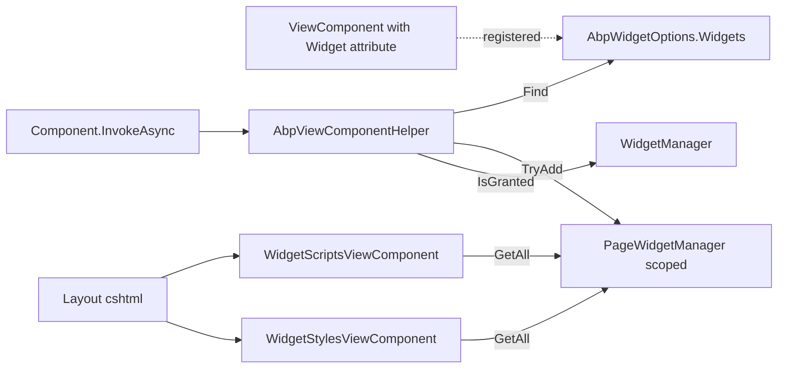

`Volo.Abp.AspNetCore.Mvc.UI.Widgets` is a tiny package — fewer than 20 source files — but it powers every framework dashboard (Identity, Account, CMS-kit) and every solution-template dashboard tile. The idea: **a "widget" is an ordinary `ViewComponent` with extra metadata** declared through a `[Widget]` attribute, so the framework can:

- decide at render time whether the current user is authorized to see it (policies + authenticated-only flag);
- emit the widget's CSS / JS exactly once per page even if the widget is invoked multiple times;
- give the widget a stable refresh URL so the browser can re-render it via AJAX;
- automatically wrap the output in `<div class="abp-widget-wrapper" data-widget-name="…" data-refresh-url="…">` so a JavaScript widget manager can drive it.

## Package layout

```text framework/src/Volo.Abp.AspNetCore.Mvc.UI.Widgets/
Volo/Abp/AspNetCore/Mvc/UI/Widgets/
  AbpAspNetCoreMvcUiWidgetsModule.cs
  AbpViewComponentHelper.cs
  AbpWidgetOptions.cs
  IPageWidgetManager.cs     PageWidgetManager.cs
  IWidgetManager.cs         WidgetManager.cs
  WidgetAttribute.cs
  WidgetDefinition.cs
  WidgetDefinitionCollection.cs
  WidgetDimensions.cs
  WidgetResourceItem.cs
  Components/
    WidgetResourcesViewModel.cs
    WidgetScripts/WidgetScriptsViewComponent.cs
    WidgetStyles/WidgetStylesViewComponent.cs
```

## Module — auto-discovery

```csharp framework/src/Volo.Abp.AspNetCore.Mvc.UI.Widgets/Volo/Abp/AspNetCore/Mvc/UI/Widgets/AbpAspNetCoreMvcUiWidgetsModule.cs
[DependsOn(
    typeof(AbpAspNetCoreMvcUiBootstrapModule),
    typeof(AbpAspNetCoreMvcUiBundlingModule)
)]
public class AbpAspNetCoreMvcUiWidgetsModule : AbpModule
{
    public override void PreConfigureServices(ServiceConfigurationContext context)
    {
        PreConfigure<IMvcBuilder>(mvcBuilder =>
            mvcBuilder.AddApplicationPartIfNotExists(typeof(AbpAspNetCoreMvcUiWidgetsModule).Assembly));

        AutoAddWidgets(context.Services);
    }

    public override void ConfigureServices(ServiceConfigurationContext context)
    {
        context.Services.AddTransient<DefaultViewComponentHelper>();

        Configure<AbpVirtualFileSystemOptions>(options =>
            options.FileSets.AddEmbedded<AbpAspNetCoreMvcUiWidgetsModule>());
    }

    private static void AutoAddWidgets(IServiceCollection services)
    {
        var widgetTypes = new List<Type>();

        services.OnRegistered(context =>
        {
            if (WidgetAttribute.IsWidget(context.ImplementationType))
                widgetTypes.Add(context.ImplementationType);
        });

        services.Configure<AbpWidgetOptions>(options =>
        {
            foreach (var widgetType in widgetTypes)
                options.Widgets.Add(new WidgetDefinition(widgetType));
        });
    }
}
```

`services.OnRegistered(...)` plugs into the conventional registrar — every type that goes through `AddTransient/AddScoped/AddSingleton` is inspected. If it's a `ViewComponent` decorated with `[Widget]`, it gets a `WidgetDefinition` added to the central `AbpWidgetOptions`.

That is how an Identity dashboard tile, declared anywhere in any module, automatically appears on the dashboard page without any explicit registration.

## The `[Widget]` attribute

```csharp framework/src/Volo.Abp.AspNetCore.Mvc.UI.Widgets/Volo/Abp/AspNetCore/Mvc/UI/Widgets/WidgetAttribute.cs
[AttributeUsage(AttributeTargets.Class)]
public class WidgetAttribute : Attribute
{
    public string[]? StyleFiles { get; set; }
    public Type[]?   StyleTypes { get; set; }      // BundleContributor types
    public string[]? ScriptFiles { get; set; }
    public Type[]?   ScriptTypes { get; set; }     // BundleContributor types

    public string? DisplayName { get; set; }
    public Type?   DisplayNameResource { get; set; }

    public string[]? RequiredPolicies { get; set; }
    public bool      RequiresAuthentication { get; set; }

    public string? RefreshUrl { get; set; }
    public bool    AutoInitialize { get; set; }

    public static bool IsWidget(Type type)
        => type.IsSubclassOf(typeof(ViewComponent)) && type.IsDefined(typeof(WidgetAttribute), true);

    public static WidgetAttribute Get(Type viewComponentType)
        => viewComponentType.GetCustomAttribute<WidgetAttribute>(true)
           ?? throw new AbpException($"Given type '{viewComponentType.AssemblyQualifiedName}' does not declare a {typeof(WidgetAttribute).AssemblyQualifiedName}");
}
```

Decorating a view component is enough:

```csharp
[Widget(
    StyleFiles  = new[] { "/views/dashboard/sales-widget.css" },
    ScriptFiles = new[] { "/views/dashboard/sales-widget.js"  },
    ScriptTypes = new[] { typeof(ChartjsScriptContributor) },
    RequiredPolicies = new[] { "MyApp.Dashboard.Sales" },
    RefreshUrl  = "/Widgets/Sales/Refresh",
    AutoInitialize = true
)]
public class SalesWidgetViewComponent : AbpViewComponent { /* ... */ }
```

## `WidgetDefinition`

```csharp framework/src/Volo.Abp.AspNetCore.Mvc.UI.Widgets/Volo/Abp/AspNetCore/Mvc/UI/Widgets/WidgetDefinition.cs
public class WidgetDefinition
{
    public string Name { get; }
    public WidgetAttribute WidgetAttribute { get; }
    public ILocalizableString DisplayName { get; set; }
    public Type ViewComponentType { get; }
    public List<string> RequiredPolicies { get; }
    public bool RequiresAuthentication { get; set; }
    public List<WidgetResourceItem> Styles  { get; }
    public List<WidgetResourceItem> Scripts { get; }
    public string? RefreshUrl { get; set; }
    public bool    AutoInitialize { get; set; }
}
```

…with a fluent set of `WithXxx` helpers for programmatic registration:

```csharp
public WidgetDefinition WithRequiredPolicies(params string[] policyNames);
public WidgetDefinition WithRequiresAuthentication(bool value = true);
public WidgetDefinition WithStyles(params string[] files);
public WidgetDefinition WithStyles(params Type[] bundleContributorTypes);
public WidgetDefinition WithScripts(params string[] files);
public WidgetDefinition WithScripts(params Type[] bundleContributorTypes);
public WidgetDefinition WithRefreshUrl(string refreshUrl);
```

A resource is either a file path or a bundle-contributor type:

```csharp framework/src/Volo.Abp.AspNetCore.Mvc.UI.Widgets/Volo/Abp/AspNetCore/Mvc/UI/Widgets/WidgetResourceItem.cs
public class WidgetResourceItem
{
    public string? Src { get; }
    public Type?   Type { get; }

    public WidgetResourceItem(string src) => Src = Check.NotNullOrWhiteSpace(src, nameof(src));
    public WidgetResourceItem(Type type)  => Type = Check.NotNull(type, nameof(type));
}
```

This dual nature is important: many widgets just need a single CSS/JS file, but framework widgets that rely on a vendor pack (e.g. ChartJs) just reference the contributor type — the bundling pipeline takes care of dependencies.

## `WidgetDefinitionCollection`

```csharp framework/src/Volo.Abp.AspNetCore.Mvc.UI.Widgets/Volo/Abp/AspNetCore/Mvc/UI/Widgets/WidgetDefinitionCollection.cs
public class WidgetDefinitionCollection
{
    public void Add(WidgetDefinition widget);
    public WidgetDefinition Add<TViewComponent>(ILocalizableString? displayName = null);
    public WidgetDefinition Add(Type viewComponentType, ILocalizableString? displayName = null);

    public WidgetDefinition? Find(string name);
    public WidgetDefinition? Find<TViewComponent>();
    public WidgetDefinition? Find(Type viewComponentType);
    public IReadOnlyCollection<WidgetDefinition> GetAll();
}
```

Lookups are O(1) by both name and component type — `AbpViewComponentHelper` uses the type variant when called with `Component.InvokeAsync(typeof(X))` and the name variant for `Component.InvokeAsync("X")`.

## `WidgetManager` — authorization

```csharp framework/src/Volo.Abp.AspNetCore.Mvc.UI.Widgets/Volo/Abp/AspNetCore/Mvc/UI/Widgets/WidgetManager.cs
public class WidgetManager : IWidgetManager
{
    public async Task<bool> IsGrantedAsync(Type widgetComponentType)
    {
        var widget = Options.Widgets.Find(widgetComponentType);
        return await IsGrantedAsyncInternal(widget, widgetComponentType.FullName!);
    }

    public async Task<bool> IsGrantedAsync(string name)
    {
        var widget = Options.Widgets.Find(name);
        return await IsGrantedAsyncInternal(widget, name);
    }

    private async Task<bool> IsGrantedAsyncInternal(WidgetDefinition? widget, string wantedName)
    {
        if (widget == null)
            throw new ArgumentNullException(wantedName);

        if (widget.RequiredPolicies.Any())
        {
            foreach (var policy in widget.RequiredPolicies)
            {
                if (!(await AuthorizationService.AuthorizeAsync(policy)).Succeeded)
                    return false;
            }
        }
        else if (widget.RequiresAuthentication && !CurrentUser.IsAuthenticated)
            return false;

        return true;
    }
}
```

The rule order is:

1. If `RequiredPolicies` is non-empty, **all** policies must succeed.
2. Otherwise, if `RequiresAuthentication` is true, the user must be logged in.
3. Otherwise the widget is public.

Dashboard pages call `WidgetManager.IsGrantedAsync(name)` for each widget before invoking it.

## `PageWidgetManager` — per-request tracking

```csharp framework/src/Volo.Abp.AspNetCore.Mvc.UI.Widgets/Volo/Abp/AspNetCore/Mvc/UI/Widgets/PageWidgetManager.cs
public class PageWidgetManager : IPageWidgetManager, IScopedDependency
{
    public const string HttpContextItemName = "__AbpCurrentWidgets";

    public bool TryAdd(WidgetDefinition widget)
        => GetWidgetList().AddIfNotContains(widget);

    public IReadOnlyList<WidgetDefinition> GetAll()
        => GetWidgetList().ToImmutableArray();
}
```

A simple list stored on `HttpContext.Items`. Every time `AbpViewComponentHelper` renders a widget, it calls `TryAdd`, building up a deduplicated set for the current page. The `WidgetScriptsViewComponent` and `WidgetStylesViewComponent` then iterate the set to emit `<script>` and `<link>` tags exactly once.

## The replacement view-component helper

```csharp framework/src/Volo.Abp.AspNetCore.Mvc.UI.Widgets/Volo/Abp/AspNetCore/Mvc/UI/Widgets/AbpViewComponentHelper.cs
[Dependency(ReplaceServices = true)]
public class AbpViewComponentHelper : IViewComponentHelper, IViewContextAware, ITransientDependency
{
    public virtual async Task<IHtmlContent> InvokeAsync(string name, object? arguments)
    {
        var widget = Options.Widgets.Find(name);
        if (widget == null)
            return await DefaultViewComponentHelper.InvokeAsync(name, arguments);
        return await InvokeWidgetAsync(arguments, widget);
    }

    public virtual async Task<IHtmlContent> InvokeAsync(Type componentType, object? arguments)
    {
        var widget = Options.Widgets.Find(componentType);
        if (widget == null)
            return await DefaultViewComponentHelper.InvokeAsync(componentType, arguments);
        return await InvokeWidgetAsync(arguments, widget);
    }

    protected virtual async Task<IHtmlContent> InvokeWidgetAsync(object? arguments, WidgetDefinition widget)
    {
        PageWidgetManager.TryAdd(widget);

        var wrapperAttrs = new StringBuilder(
            $"class=\"abp-widget-wrapper\" data-widget-name=\"{widget.Name}\"");

        if (widget.RefreshUrl != null)
            wrapperAttrs.Append($" data-refresh-url=\"{widget.RefreshUrl}\"");

        if (widget.AutoInitialize)
            wrapperAttrs.Append(" data-widget-auto-init=\"true\"");

        return new HtmlContentBuilder()
            .AppendHtml($"<div {wrapperAttrs}>")
            .AppendHtml(await DefaultViewComponentHelper.InvokeAsync(widget.ViewComponentType, arguments))
            .AppendHtml("</div>");
    }
}
```

`[Dependency(ReplaceServices = true)]` swaps out the framework `IViewComponentHelper`, so **every `@await Component.InvokeAsync(...)` in any Razor view goes through this code path**. If the requested type is a widget, it gets the wrapper `<div>` (which client-side JS uses to drive refresh/auto-init); if not, it falls through to the original helper unchanged.

## Resource view components

```csharp framework/src/Volo.Abp.AspNetCore.Mvc.UI.Widgets/Volo/Abp/AspNetCore/Mvc/UI/Widgets/Components/WidgetScripts/WidgetScriptsViewComponent.cs
public class WidgetScriptsViewComponent : AbpViewComponent
{
    public virtual IViewComponentResult Invoke()
    {
        return View(
            "~/Volo/Abp/AspNetCore/Mvc/UI/Widgets/Components/WidgetScripts/Default.cshtml",
            new WidgetResourcesViewModel
            {
                Widgets = PageWidgetManager.GetAll()
            });
    }
}
```

```csharp framework/src/Volo.Abp.AspNetCore.Mvc.UI.Widgets/Volo/Abp/AspNetCore/Mvc/UI/Widgets/Components/WidgetStyles/WidgetStylesViewComponent.cs
public class WidgetStylesViewComponent : AbpViewComponent { /* ditto */ }
```

A theme's `_Layout.cshtml` invokes both right before `</body>` / inside `<head>`:

```cshtml
@await Component.InvokeAsync(typeof(WidgetStylesViewComponent))
…
@await Component.InvokeAsync(typeof(WidgetScriptsViewComponent))
```

The associated `Default.cshtml` walks `Model.Widgets`, opens each `Styles` / `Scripts` list, and emits either an `<abp-style src="..."/>` for a file or an `<abp-style type="typeof(X)"/>` for a contributor type. The bundling pipeline (see [`mvc-ui-bundling`](/framework/ui-mvc/mvc-ui-bundling)) deduplicates and minifies.

## `WidgetDimensions`

```csharp framework/src/Volo.Abp.AspNetCore.Mvc.UI.Widgets/Volo/Abp/AspNetCore/Mvc/UI/Widgets/WidgetDimensions.cs
public class WidgetDimensions
{
    public int Width  { get; }
    public int Height { get; }
}
```

A simple value used by dashboards that lay out widgets on a grid.

## Putting it together



## Cross-references

- The bundling pipeline that emits the widget's CSS/JS is documented in [`mvc-ui-bundling`](/framework/ui-mvc/mvc-ui-bundling).
- The `BundleContributor` types referenced by `WidgetResourceItem.Type` come from [`mvc-ui-packages`](/framework/ui-mvc/mvc-ui-packages).
- The `<abp-style>` / `<abp-script>` tag helpers used by the resource view templates are described in [`mvc-ui-bootstrap`](/framework/ui-mvc/mvc-ui-bootstrap) (general tag-helper sandwich) and [`mvc-ui-bundling`](/framework/ui-mvc/mvc-ui-bundling) (bundle-aware helpers).
- The authorization model used for `RequiredPolicies` is documented in [`Volo.Abp.Authorization`](/framework/auth/authorization).
- The Theme.Shared global bundle that ships `widget-manager.js` (the client-side complement of this package) is in [`mvc-ui-theme-shared`](/framework/ui-mvc/mvc-ui-theme-shared).
